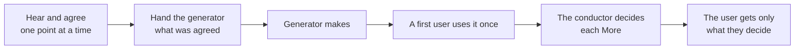

# Plugin rules (ccpm)

How a plugin in this marketplace achieves its user's purpose, and the conventions it keeps. Part 1
holds what every plugin must achieve, as essentials; Part 2 holds what a script can decide.

Source: facts confirmed in the official docs (plugins-reference / plugin-marketplaces / skills / hooks /
sub-agents at code.claude.com/docs) and the official plugins (plugin-dev, hookify, security-guidance,
code-modernization).

## 1. What every plugin achieves

Every plugin that makes something for its user runs one path, and differs from the others only in
what it makes: its own viewpoints for its kinds of work, and the items its agreement and its handoff
hold.

The conductor is the conversation that talks with the user; it alone judges, decides what comes next,
and keeps the record. The generator makes or fixes as the conductor decided. The first user, pith's,
uses the work as its receiver would, knowing nothing of how it was made, and reports what happened
without judging. A plugin builds on pith for the first user rather than keeping a copy of its own.

The questions below are essentials, in the form of `pith/references/essentials/essentials.md`. The
maker aims at them while building. The first user answers them by installing the plugin with
`claude --plugin-dir`, running its README's story from the user's first words to the result with
`claude -p`, playing the user from what the README says they know and want; whoever checks lays the
answers beside the plugin's purpose and gives each a Good or More.
`pith/references/essentials/plugin.md` is this section, word for word, so pith checks any plugin by
it.

- Running the README's story to its end, what did you get, set beside each gain the README promises?

    What the user gets at the end of the whole path is why they would choose the plugin. Each part can do what it was built for while the whole still fails: a run cut into scenes passes every scene and never shows that the story does not reach its end, or reaches it with something other than what was promised.

- On that run, how long did you wait at each point, how many lines did you read to decide each time you were asked, and what were you asked each time?

    What the user spends is part of what they get: a plugin that brings the promised result after hours of waiting, or after a proposal too long to decide from, is one they stop using. The spending shows only across the whole path.

- Running the same story with what you would use instead, the version you have now or Claude Code without the plugin when there is none, what differed in what you got and what you spent?

    A plugin is worth installing only for what it adds over what the user already has. A run alone shows how the plugin behaves, not whether it is better; a change that makes every part more careful can leave the user worse off than before.

- Of the times you were asked, which were for something only you could decide, and which could the plugin have settled from your request, the repository or the documentation?

    A user called only for their own decisions can leave the work to the plugin. A question something else already answers makes them watch over the work, and teaches them to answer without reading.

- Each time you were asked, what did you need to know, or ask back, before you could answer, and how many points did the message ask you to decide?

    A question that says how the plugin understands the point, and, when it offers ways, what each gives and costs and which it recommends and why, is answered on the spot. One point per message can be talked through until both sides see the same thing; with several, the user answers the one they follow and the rest go by half-decided.

- Which ways were put before you before you had said what you wanted the result to do for you?

    Ways built from what the user said give them what they want. Ways offered first are built on the plugin's guess, and a user who takes the recommended one gets what they did not ask for; the talk then goes round the ways instead of what the user wants.

- Before anything was made, what had you agreed it would be, and where did what came back differ from it?

    Agreed before it is made, what the user gets is what they meant, and a mismatch costs one answer. Found after it is made, it costs a round of making and checking, and the user waits for each.

- Reading only what the generator was handed, what would you have had to guess to make it as agreed?

    The generator knows nothing of the talk, so what it is not handed it guesses, and the work drifts from what the user agreed. Handed the agreement itself and where each fact comes from, never a summary, it makes what was agreed.

- How many times was a work used by a first user, and what did each use after the first bring?

    A first user who knows nothing of the discussion finds where a receiver trips, once. Started again after each fix, a new one brings fresh small remarks with every run, and the checking never ends while the user waits. Whether a fix holds shows by doing again what the first user did where it tripped.

- Of the fixes made, which stood between the receiver and the purpose, and which did not?

    Fixing what does not stand in the receiver's way spends the user's time on what they did not choose the work for, and every fix can break what already serves them. Clearing every remark never ends; how close the work has come is what the user decides on.

- When the work met something none of these questions or the plugin's own viewpoints asked, where did it go?

    Kept as a viewpoint of that session, in its own rules, it is aimed at by every maker after it, and proposed for the plugin's viewpoints at the end, so the viewpoints grow from what use showed. Fixed only where it was met, it shows up again elsewhere.

- Deciding from what the plugin gave you at each stop, what did you need beyond it, and which parts did you read past?

    What the user reads grows then with what they decide, not with the work checked: what the plugin proposes and why, how close it has come to each thing they would choose it for, and each point that is theirs. A report that grows with the work is either read whole, spending the time the plugin was meant to save, or not read at all.

- While the plugin's agents worked, when were you called with nothing to decide?

    A user called only to wait watches over the work they meant to leave. The plugin waits for its own agents and calls the user when there is something for them.

- Clearing the conversation at a stop and starting again, what did you have to explain again?

    Work that takes days goes on from its record, so the user explains nothing twice. What was decided and lived only in the conversation is lost with it.

- At which moments did a hook act, and what would have happened at that moment without it?

    A hook runs every time at a fixed moment and sees no more than the condition it was given. It earns its place where the model cannot act itself, such as reading the record again after the conversation is summarized, which the model does not notice. Where the model would have acted rightly without it, a hook adds nothing; where it judges what it cannot see, it stops right moves, such as an agent reading its own output or another session in the same repository.

- While the plugin ran, what did it do to another conversation in the same repository, or to agents it did not start?

    A user works with several sessions side by side. A plugin that takes another session for its own, stops its tools or sends it on with the plugin's work breaks work the user never gave it.

- When you asked for the plugin's job in your own words, without naming its command, what started?

    A skill is chosen by its description. When the user's words for the job do not reach it, the user must learn the command first; when they reach it for other jobs, it starts where it was not wanted.

- Which of the plugin's files did the run read, run or follow, and which were never touched?

    A part no run touches is either not needed, and only adds what can break, or meant for a case the story never meets. Instructions read on every call cost the user's wait and the model's attention each time, so what is read only for some cases is kept apart and read when needed.

## 2. Conventions a script decides

### Code

- **Write what the plugin makes itself in Python 3 with the standard library only, running on 3.9.
  A script that only calls an existing tool, with no logic of its own, may be sh.**
  - Rationale: what the plugin makes itself can be wrong, so it must be held by tests, and bash is
    weak to maintain and test. python3 comes with git in the Mac developer tools, and on Linux and
    Windows it is no less common than jq; Node.js may not be on the user's machine.
- **When python3 is missing, stop and tell the user to install it; never skip the check.** State in
  the plugin's README that Python 3.9 or later is needed.
  - Rationale: a skipped check goes unnoticed, so no one learns it was not made.
- **Put each check in its own named file, and one entry file per hook event**, as the official
  `hookify` does, following plugin-dev's `hook-development`.
  - Rationale: each check can then be read, fixed and tested on its own.

### Agents

- **Start work a role must wait for through a skill with `context: fork`, `agent: <plugin>:<agent>`
  and `background: false`, and call that skill; never start it with the Agent tool directly.**
  - Rationale: in an interactive session Claude Code runs every agent the Agent tool starts in the
    background and cannot be asked for the foreground, so the role either ends its turn, calling the
    user with nothing to decide, or goes on before the result exists. A skill with
    `background: false` makes the caller wait for its result in every kind of session, and its
    agent runs in the foreground (official docs, sub-agents and skills; tried on Claude Code 2.1.291).

### Tests and trials

- **Write the tests with the standard `unittest`, in `dev/<plugin>/tests/`, outside the plugin's
  directory. Feed in what the code would receive, and check both a case it stops and a case it lets
  through. Name each test by what must happen, as one sentence, and mark its body with `# Given`,
  `# When` and `# Then`.**
  - Rationale: installing a plugin copies its whole directory, so what only its makers use stays out
    of it. A check that never stops anything looks the same as one that works, and a test whose Then
    checks nothing stands out.
- **Have the tests run every line the plugin makes itself, and delete a line no test has a reason to
  run. Leave a line out of the count with `# pragma: no cover` only when whether it runs depends on
  an environment the tests cannot make, with the reason beside it.**
  - Rationale: a line no test runs is either not needed, or needed and left unguarded.
- **CI runs every plugin's tests on every push, counting lines, and fails when any line is not run.**
  - Rationale: tests run by hand are skipped when they matter most.
- **Keep the code that runs a plugin as its user would in `dev/<plugin>/trials/`: the README's whole
  story, and one scene per attractive quality from the state just before the moment the user gets it
  to the first result that shows it. Write it as the plugin's own code, but leave it out of the line
  count.**
  - Rationale: kept in the repository, a trial runs the same way each time and is fixed with the
    plugin; a scene checks a change quickly, the whole story judges the round. A trial starts Claude
    Code, which CI cannot run, so the run itself is its check.

### Results and the record

- **A check writes its whole result to `{dir}/open/{NN}-report-{target}.md` in the form of
  `pith/references/result-form.md`, which pith's script checks; the conductor that talks with the user
  commits it, settles each More in it, and, once all are settled, copies it whole into a commit
  message, each More ending with `→ fixed:`, `→ let go:` and the reason, or `→ to the user:`, and
  deletes it in that commit.** `{dir}` is the plugin's own directory, or the place the caller names.
  - Rationale: the result survives the conversation and can be read on the pull request; `open/`
    holds only what still needs action, and the record stays in git history.
- **Hand every role the paths of what it reads, never a summary of them.**
  - Rationale: a summary carries the summarizer's reading, and the role works from that instead.

### Structure check

- **Pass both `claude plugin validate <plugin-path> --strict` and `claude plugin validate
  <marketplace-root> --strict`.**
  - Rationale: a malformed manifest fails for every user at install, before any behavior is reached.

## 3. Register

- **Add every plugin to `.claude-plugin/marketplace.json`** — one entry under `plugins` with `name`,
  `description`, `source` (e.g. `./rn`), and `category`. This is what Claude Code reads to install it.
- **List every plugin in the root `README.md`** with a link to its own README (e.g.
  `[rn](./rn/README.md)`) and a one-line description. This is the human entry point.
- **Change the two together** when a plugin is added, renamed, or removed.
  - Rationale: a plugin counts as shipped only once both the machine and a human reader can reach it.

## 4. Release

### Version number

- **Write `version` in exactly one place: `plugin.json`, and always set it** (semver, e.g. `0.1.0`).
  - Rationale: when both are set, `plugin.json` wins over the marketplace entry, so a second copy is
    meaningless; `claude plugin validate --strict` fails when it is unset. Users receive an update only
    when it is bumped.
- **Bump only on an explicit release instruction**, not on merge to `main`. Until then, user-facing
  changes wait under CHANGELOG's `## [Unreleased]`.
- **Decide the increment by the largest change, from the user's side:** major for a breaking change
  (on `0.x`, minor instead), minor for a new or changed user-visible behavior, patch for no behavior
  change.

### CHANGELOG

- **Keep `CHANGELOG.md` in the plugin root**, in [Keep a Changelog](https://keepachangelog.com)
  format: `## [Unreleased]` on top while changes are pending, then one `## [x.y.z] - YYYY-MM-DD` per
  release, grouped under `Added` / `Changed` / `Fixed` / `Removed` as they apply.
- **Write an entry for every change a user would notice**, as one line: `<what changed> — <why it
  helps the user>`. Typos, refactors, internal docs and formatting get none.
- **On a release, rename `## [Unreleased]` to the version and date, and leave no empty
  `## [Unreleased]` behind**; it is re-created when the next user-facing change lands.

### Who does what

1. **Assistant** — bumps `version` in `plugin.json`, finalizes `CHANGELOG.md`, commits, and pushes.
2. **Assistant** — asks the user to merge the pull request to `main`; never merges it itself and never
   uses `--admin`.
   - Rationale: `main` is protected, and only the user can clear its required review.
3. **User** — merges, and says so.
4. **Assistant** — tags `main` and publishes the GitHub Release.

### Tags and GitHub Releases

- **Tag each release on `main`** as `<plugin>--v<version>` (e.g. `rn--v0.2.0`), created with
  `claude plugin tag --push` from the plugin directory.
  - Rationale: this is Claude Code's own form: a plugin that depends on another with a version range
    resolves it against these tags, and the prefix lets each plugin version independently. The
    command also validates the plugin and refuses a tag that already exists.
- **Publish a GitHub Release** for that tag, with the CHANGELOG's matching section as the notes.
- **Read release timing from tags and Releases, not from merge commits.**
