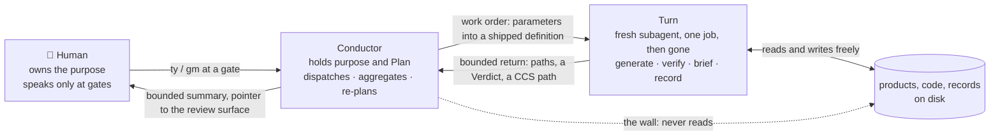
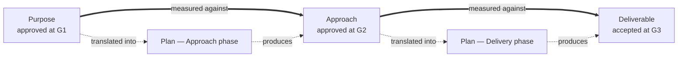
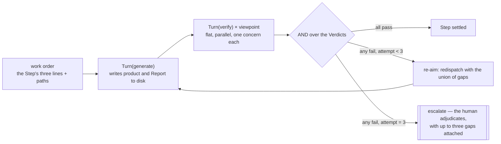
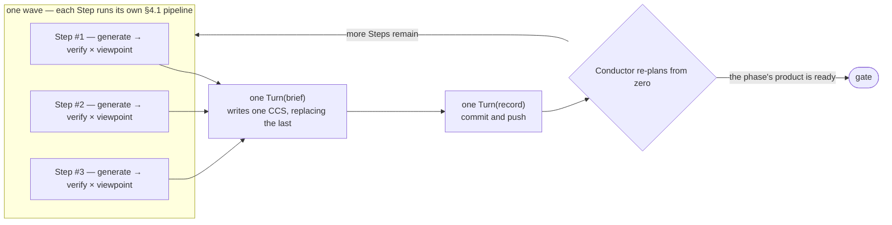

# aiya — Design

aiya is a Claude Code plugin for handing a large job to a crew of AI agents and getting it back finished, with the human spending their attention at six checkpoints instead of on supervision.

## 1. Problem — Delegation whose cost climbs with the size of the job

**The goal: one expert delivering what used to take a team, by directing AI agents rather than doing the work.** An order of magnitude of output from one person.

Hand a large job to agents with no structure around them and the arithmetic runs backwards — the more the agents produce, the more of the human's day is spent keeping them on course. Two failure modes produce that, and they are independent:

- **Context bloat.** The agent doing the directing carries its working state in its context, and that state grows with the job. Every additional stream of work adds to what it must hold; old mistakes ride along in the transcript and get repeated. The cheap direction of many streams — the entire reason to delegate — is what the growth destroys first.
- **Drift.** The work stops answering the purpose, and nobody finds out until delivery. It appears in two shapes: work the purpose never asked for, and the original plan carried out to the letter while everything learned along the way is ignored.

Those two failure modes fix the two properties this design has to guarantee. Every choice in the chapters that follow is checked against them, and chapter 4 closes by stating how each is discharged.

- **Bounded context** — whatever the Conductor (§2) must hold in order to keep steering grows sub-linearly as parallel work streams are added (the waves of §4.2).
- **Drift detection** — every piece of work stays traceable to the purpose, and a deviation is caught while the run is still going, not at the end.

Out of scope: proving the order of magnitude. aiya answers for the two properties above; whether the human ends up ten times more productive is not measured here (§6 says what *is*).

## 2. Core — One director that never reads, workers that never remember

**There are two roles and no third.** The **Conductor** holds the purpose and steers, and never touches the work itself. A **Turn** touches the work and never holds the purpose. The human is outside both: they own the purpose, and they speak at gates.



**Two walls hold the roles apart.**

**The Conductor never touches the real work.** It reads no product, no code, no research file — not even the first-person Report a worker writes about its own Step (§5.3). What may enter its context is a short closed list, given in §5.1. This wall governs the *kind* of thing that can reach the director at all.

**Turns never nest.** Only the Conductor dispatches. Two properties of the platform do the work here: a subagent begins from a fresh context, and nothing but its return reaches whoever called it. So a Turn is born clean, hands back something small, and is thrown away. If a Turn could spawn its own workers, the work underneath it would sit outside the attempt cap (§4.1) and outside the return contract (§5.2) — which is why every shipped Turn definition leaves out the spawn tool, and the tool for questioning the human with it.

**The vocabulary, fixed here and used unchanged for the rest of the document.**

- **Phase** — a run moves through three: Purpose (why), Approach (how), Delivery (execution).
- **Plan / Step** — one Plan per Phase; a Step is one item on it.
- **Turn role families** — a Turn is one kind of thing playing one of three families of role: **generate** makes a product, **verify** measures one, and **run-keeping** sustains the run itself in two roles — **brief**, which writes the cognitive record (the CCS), and **record**, which performs every platform operation.
- **Work order** — the parameters handed to a static shipped definition. The procedure is fixed in the definition; only the content travels.
- **Elicit item** — a Plan item whose product comes out of talking to the human rather than out of building anything. The Conductor takes these itself: its seat is the only one with a channel to a person.
- **Gate** — one of six places the run stops for a human decision: every Phase is entered through a **Planning Gate** that reviews its Plan, and left through an output gate that reviews its product (**G1**, **G2**, **G3**). A gate is answered with one of two typed commands, `/aiya:ty` to approve or `/aiya:gm` to send back. The other three commands — `on`, `dn`, `up` — start, set down, and resume the session rather than deciding anything.
- **Yardstick** — a gate-approved product that everything downstream is measured against. The chain of yardsticks is §3.1.
- **Viewpoint** — one concern that can be checked on its own. Each viewpoint on a Step's product gets its own Turn(verify) (§5.4).
- **Machines verify, humans review.** Pass or fail against a fixed yardstick is mechanical work and belongs to a Turn. Approving, or redirecting, is judgment about intent and belongs to the human. Nothing in this design crosses that line.
- **Investigation is work, not preamble.** Interviewing the human, surveying an existing system, spiking a risky technology — each is a Step with a product on disk.

**Enforcement, stated once for the whole document.** No controller program exists. The loop is prose that an LLM follows, so a rule here is one of exactly two things: **structural**, where the platform makes the breach impossible (a fresh context, an absent tool), or **default and observable**, where following the rule is the cheapest path and breaking it leaves a trace someone can find afterwards. The second kind is never a guarantee, and this document does not pretend otherwise: §5 names, part by part, the trace each breach leaves, and §7 prices what is being accepted.

**One bet runs underneath all of it: model progress.** Judgment, steering, and the last layer of verification are left to the LLM rather than written into code. Control expressed as code freezes the ceiling at whatever its author understood on the day they wrote it; the parts left to the model get better on their own as models do, with nothing rewritten. So the design is an allocation decision — put as much as possible where progress arrives for free, and shrink what remains to a thin skeleton of walls and records. The target is a rising ceiling, not a fixed number.

The skeleton by itself — fan work out to fresh subagents, take small returns back — is common practice and aiya claims none of it. What aiya adds is the machinery for not straying: every judgment is tied, with a version, to a document a human approved; discoveries are allowed to rewrite the plan; and only doubts about the approved documents themselves go back to the human. The bet is placed at the most general layer available — one run carries a job from first interview to acceptance, whether or not the job is software — so whatever the design proves, it proves for everything built on it.

Each of the two required properties gets one primary mechanism: bounded context is carried by the **CCS** (§5.5), drift detection by the **two-layer chain of yardsticks** (§3.1). Each mechanism has two supporting legs beside it, and §4.6 states the full discharge.

## 3. Structure — An approved spine, disposable records, and one place each of them lives

### 3.1 The spine — yardsticks that cannot move, plans that must

Every product of a run hangs off one chain:



The heavy edges are the **immutable layer**. Once a gate approves the Purpose or the Approach, everything downstream is measured against that document as approved, and the only way to change it is a send-back at a gate — where a human is sitting. The dotted edges are the **adaptive layer**: each phase's Plan, the joint that converts an approved document into executable Steps, rebuilt from the current position every time something is discovered (§4.3).

That two-layer shape is what turns drift into an object rather than a mood someone has to notice in time. Each Step justifies itself by the link directly above it, each approved document by the reason the run exists; a Step that cannot be justified that way *is* the drift, and a link that breaks stops at the phase's gate rather than flowing into the next phase.

### 3.2 The ledger — who writes each thing, who checks it, who owns it

Execution also leaves **records** — a trail that moves the chain along and is thrown away with the run. **A record never becomes a yardstick.** Everything a run produces, in one table:

| Product or record | What it is | Written by | Checked by (machine) | Owned by (human) |
|---|---|---|---|---|
| **Plan** ×3 | One per phase: the Steps, their inputs, and their pass conditions — the adaptive layer | Conductor | Turn(verify), against aiya's four fixed viewpoints (§5.7) | Planning Gate |
| **Purpose** | The definition of success, and the head of the chain | Turn(generate) | Turn(verify), for evidential soundness | G1 |
| **Approach** | How that success will be reached, with a Decision annex per decision worth its own page | Turn(generate) | Turn(verify), against the Purpose | G2 |
| **Deliverable** | The working thing itself, living in the repository proper | Turn(generate) | Turn(verify), against Purpose + Approach + the Step's own pass condition | G3 |
| **CCS** | The bounded state handed from one wave to the next — the Conductor's working memory itself | Turn(brief) | Its construction rules (§5.5); a claim the products do not support is exposed at the next verification, which reads products and never the CCS | — consumed by the Conductor |
| **Verdict** | One viewpoint's judgment: pass or fail, the gap, the evidence | Turn(verify) | — it is itself the check; the mandatory evidence keeps it falsifiable | — aggregated by the Conductor |
| **Report** | Turn(generate)'s first-person account of its own Step: did / tried / unsure | Turn(generate) | — Turn(brief) reads it against the product | — |
| **Research** | An investigation Step's product, including the answers from an elicit item | Turn(generate); elicit answers by the Conductor | Turn(verify), for evidential soundness | — never submitted for approval |

Getting any of it into the durable record — the commits, the pushes — belongs to Turn(record) and to nothing else. What each role is forbidden to do follows from one role holding one job, and is written into that role's shipped definition; the Conductor's forbidden list is §5.1.

### 3.3 On disk — one directory per run, and one backend behind it

A run occupies one directory, named from a short slug of the purpose:

```
.aiya/<slug>/
  backend     # github | gitlab | local — detected at on, reread at up
  purpose/    plan.md, purpose.md
  approach/   plan.md, approach.md, decisions/   # one file per decision
  delivery/   plan.md                            # the Deliverable itself lives in the repository proper
  ccs/        tNNN.yaml                          # the CCS chain — one chain per run, each file replacing the last
  verdicts/   # one file per judgment; step, viewpoint and attempt readable from the name
  reports/    # one per Turn(generate); item and attempt in the filename
  research/   # investigation products and elicit answers, always referenced by path
  history/    # approved editions, archived at gate resolution under the local backend (§5.6)
```

Two documents a run may write do not belong to the run at all: the product's **UX** and its **Design**. Both are foundations of the product itself, outliving any single run, so they live with the product rather than under `.aiya/`. Where a project already has them, the run uses them; where it does not, the Plan grows Steps that write them in aiya's shipped formats (§4.4).

The formats and their worked examples ship in the plugin's `references/` directory. Research is the deliberate exception with no fixed format: an investigation's product is whatever shape the investigation needs, judged for evidential soundness rather than for structure, and referred to by path.

**Persistence has two jobs — being the durable record, and being the surface the human reviews on — and one backend does both.** Three ship. **github** puts the run on a branch and a pull request through `gh`; **gitlab** does the same with a merge request through `glab`; **local** uses no git at all — the files on disk are the record, and the human opens them directly. Which one is in force is worked out when the run starts, written to the run's `backend` file, and read back when the run resumes. A remote backend is in force only when its whole toolchain agrees — a git repository, a remote naming that host, that host's CLI installed; anything short of all three falls back to local, and the fallback is announced.

The loop itself is identical under all three. Exactly two things are worse under local, and both are named rather than hidden: a bare `/aiya:gm` has no comment stream to read feedback from (§4.4), and durability stops at the disk, so losing the machine loses the run (§7). Why git is swappable instead of required is itself a decision with a price, stated in §7.

### 3.4 What ships — six skills, six Turn definitions, seven formats

Three kinds of artifact make up the plugin, and there is no fourth.

**Skills.** Five entry skills, one per command word, each marked so that it fires only when the human types it — `ty` and `gm` are gate verdicts and must never be inferred from the flow of a conversation. Behind them sits one Claude-only skill, `conductor`, which is not user-invocable and carries the entire Conductor procedure; the five entry skills do nothing but name the point of that procedure to enter at.

**Turn definitions.** Six shipped subagent definitions: generate, verify, brief, and one record adapter per backend. The count is not a contract — §5.2's Turn contract is. A new role, or a new platform variant of an existing role, arrives as one more definition under the same contract.

**Formats.** Seven worked examples in `references/` — purpose, approach, decision, plan, ux, design, report — passed to a drafting Turn as concrete paths in its work order.

**aiya has exactly one executable part: the main session, reading the conductor skill's prose and acting on it.** That is §2's bet made literal: nothing about the loop is compiled, so nothing about the loop is frozen.

## 4. Behavior — The same cycle at three sizes: a Step, a wave, a phase

### 4.1 One Step — make it, judge it, aim again, or hand it up

**Every attempt at a Step dispatches exactly one Turn(generate).** An elicit item is the exception: the Conductor conducts that interview itself and writes the answers to `research/` on the spot, so nothing below applies to it — no verification, no attempt cap, no place in §6's counts.



Turn(generate) hands back paths and one line of completion, never the work itself. Two viewpoints are checked by default — the Step's own pass condition, and whichever criteria of the phase yardstick bear on it — plus any domain viewpoint the Plan item declares. Aggregation is a mechanical AND, and on a failure the corrective instruction handed to the next attempt is the union of the failing gaps.

For an investigation Step a re-aim means something else: nothing was wrong, the evidence was merely thin, so the next attempt digs deeper instead of rebuilding. Escalation is not a gate but an interrupt — unplanned, rare, and it arrives with the failure history rather than a question in the abstract.

Two side paths keep the attempt counter honest. When a return never arrives, the same Turn goes out again — a Turn holds no state, so nothing is corrupted by dispatching it twice, and a lost message is not a failed attempt. A viewpoint the Conductor finds missing at aggregation time joins the Plan and sets off verification alone — nothing about the product changed, so the attempt count holds still, and only a fail on that new concern starts an ordinary re-aim.

### 4.2 One wave — width in parallel, a single state out

**Steps whose inputs are all satisfied form a wave and are dispatched together;** a wave of one is the sequential case, and needs no separate treatment. Waves are never written down — they are derived from the Plan's `consumes` lines each time they are needed, with one guard: two items that write the same file are never bundled. The platform caps how many subagents run at once — 20 by default — so a wider wave goes out in slices as slots free up, which changes throughput and nothing else.



However wide the wave was, **one Turn(brief) folds what happened into a single CCS.** That is the move that takes parallel width and bounded context out of tension with each other: the Conductor's intake per wave is one bounded state, whether the wave held one Step or ten. Turn(record) runs after brief, so the CCS it commits is one it can read — commit messages describe what actually settled instead of restating a file list.

**Only record ever commits** — not the Conductor, not generate, verify, or brief. It runs at the point in the loop that is serial by construction, after the wave has already collapsed into one brief, so no two writers ever meet at the git index. And it is a Turn, which means it reads what it commits: nothing enters history unread, in a design whose director may not read at all. Commits land at wave settles plus the `on`, gate, and `dn` events and the Plan pushes before a Planning Gate — a granularity chosen so that **any commit can be resumed from with nothing else in hand** (§4.5), and so that reading the log back gives the run's state machine.

### 4.3 Steering — rebuild the plan from zero, every wave

**Keeping the plan right is the Conductor's first duty; dispatching and aggregating are how it earns the right to do so.** The target is the purpose, not the completion of the Plan — finishing the Plan while ignoring what was learned is drift's second shape, and the Conductor is the only party standing where every Step's discoveries arrive.

So each time a wave settles, it reads the CCS and puts three questions in order. Has the distance to the purpose shrunk? What do we now know that we did not? And, starting from where we actually stand, what is the shortest Plan to the phase's product — **built from zero out of that position, never by amending the Plan already sitting there.** Where the fresh plan differs from the old one, that difference is the revision. The moment the existing Plan becomes the default and a discovery has to argue its way in, steering has degenerated into ceremony.

**Discretion has an edge.** Re-planning may do anything to the Plan: add items, drop them, split them, rewire dependencies, reorder. It may never touch the Purpose or the Approach. A discovery that casts doubt on an approved document is not absorbed into the Plan — it goes back to a gate, to the human.

**The steering verbs are a finite set**: Plan surgery inside that edge, re-aim, re-verify, add an investigation Step, send back to a gate, re-send a missing return. Anything outside the set is a breach of the first wall, and the tempting one is always the same — looking into the question yourself. A doubt precise enough to be written as a viewpoint turns into a re-verify; one still shaped like a question turns into an investigation Step. The test that sorts them is one question: **does this act require reading the real work?** If not, it is the Conductor's — control, like the AND over Verdicts, or deriving a wave from `consumes` lines. If so, it is a Turn's — inspection, like consolidating state or integrating artifacts.

### 4.4 Phases and gates — three questions, six stops, versioned approvals

Three phases carry a job from intent to execution. Each holds one Plan, drafted and continually re-planned by the Conductor, and produces one product, made by Turns and never by the Conductor:

| Phase | The question it settles | Product | Steps it typically holds |
|---|---|---|---|
| **Purpose** | What are we doing this for, and what will tell us we arrived? | Purpose — situation, pain, benefit, success criteria | Interview until the intent is decidable; surveys of demand and of competing products |
| **Approach** | By what route do we get there? | Approach — testing, technology, design — with Decision annexes | Survey the existing system; investigate candidate technologies; spike whatever carries the most risk |
| **Delivery** | What gets built, and in what order? | The working Deliverable | Implementation, then verification against the criteria |


Only the outputs carry numbers — G1, G2, G3, in phase order.

**Generation has prerequisites** — the run's own Purpose and Plan, and the product's UX and Design. Without them a Turn has nothing to build against and nothing to be measured against. UX and Design are the product's, not the run's (§3.3); whatever the project lacks becomes Steps on the Plan that write it in aiya's shipped format, with a conversion Step at the end of Delivery when the project demands a format of its own. Investigation Steps appear in every phase, and they are where compression and independent checking pay best: an unbounded pile of reading turns into a few lines of understanding that nothing else on disk would have remembered.

**Each phase's yardstick is fixed, and the fixing is what makes verification independent.** The Approach is measured against the approved Purpose; the Deliverable against Purpose and Approach both, plus its Step's own pass condition. The Purpose has nothing before it, so it is measured for **evidential soundness** instead: each claim names where it came from, a contradiction is shown rather than smoothed over, anything unknown is labelled unknown, and every success criterion is phrased so that something could actually decide it. Research is held to that same standard — being outside the gates means not submitted for approval, not exempt from examination.

**Drafting the Purpose is split between the two roles.** The interview is the Conductor's single point of contact with the chat surface — a purpose cannot be held without first being asked for, and no Turn ships with a way to address a person. But the Conductor does not draft. The human's answers go to files under `research/` as they are given, and a Turn(generate) drafts the Purpose from those paths. Whoever writes a document must read it, and the Conductor may not read — so it writes nothing; transcribing answers verbatim is not drafting, and that exchange sits inside its closed intake (§5.1). Until the human approves it at G1, none of it is the purpose.

**Stopping at a gate**, the Conductor posts a bounded summary to the console and points at the artifact on the review surface. The summary exists to help the human decide whether to look; the surface is where the document actually gets read. Whatever a gate points at is on the surface before the gate is presented: `on` opens the surface, a phase product lands there when its wave settles, and a Plan — new or reworked — gets a record dispatch of its own ahead of the Planning Gate.

Send-back comes in two forms. `/aiya:gm <one line>` carries the feedback in its argument and works under every backend. A bare `/aiya:gm` means "read my review comments": Turn(record) fetches them from the pull or merge request into a file and returns the path, which the rework then consumes. The bare form exists only where a PR or MR exists; typed under local it changes nothing and asks the human to restate the feedback inline.

Between stops the Conductor runs itself in **dispatch rounds** — an unbroken stretch between two stops, normally several waves long, with a progress board kept current on the console: each wave's items shown as done, as running with their attempt and any re-aim's gap, or as still ahead. Every round re-enters from what is on disk (§4.5), which is why stopping costs nothing.

**Approvals carry versions.** Each yardstick document has a `version: vN (timestamp)` line in its header, written by the Turn(generate) that drafted it — `v1` on the first draft, read-and-bumped by the rewriting Turn after a send-back. Nobody else ever writes one; the Conductor passes no version number and keeps no version ledger, because the document's own header is the source of truth. Under the local backend, where no git names editions, that line *is* the edition's identifier. **A new version invalidates whatever was measured against the old one.** Each Verdict pins the exact edition it judged against (§5.4), so the invalidated ones are found by grep rather than by memory, their Steps go back through verification, and a re-aim happens only where the new yardstick actually produces a fail.

**When a gate resolves, the approved document goes into the durable record** — committed and pushed under a remote backend, archived into the run's `history/` under a version-carrying name under local, so an approved edition survives later reworks even with no git behind it. G3 is different in kind: the Deliverable carries no version header, so the dispatch there is a final settle — everything not yet recorded goes in, and the pull or merge request is left open and handed to the human as ready. **aiya never merges.** Merging, or closing, is the human's act and sits outside the run.

### 4.5 Suspending and resuming — nothing special is saved, because nothing special is needed

**The resume point is the latest CCS, the approved phase documents, and the current Plan.** Set a run down halfway and reopen it in a new conversation: it loads precisely the inputs the next wave would have loaded, and goes on from there; the `backend` file tells it which record adapter to dispatch to. Resume is not a feature added on top of the loop — it is the ordinary hand-off between two waves, exercised across a conversation boundary.

Persistence is continuous rather than an event at the end. Every wave settle commits and pushes the resume point together, so suspension is routine and `/aiya:dn` has nothing left to persist — its job is to confirm, and to tell the human to `/clear` and come back with `/aiya:up`.

One ambiguity is left in on purpose. A Planning Gate's approval writes nothing new to disk, so what is on disk cannot always distinguish a gate still waiting for its verdict from one just approved. When it cannot, the resume re-presents the pending gate and waits. That is the safe side of the ambiguity: the cost is at most one redundant `/aiya:ty`.

Boundedness applies to the working state, not to the conversation. The Conductor's transcript still lengthens with every Turn dispatched; the design minimises the coefficient — returns are paths and Verdicts, never output — and the residue is cleared by cycling `dn` → `/clear` → `up`. A remote backend keeps the resume point through the loss of the machine as well as of the conversation; local keeps it through the conversation alone (§7).

### 4.6 The discharge — what each property actually rests on

**Bounded context rests on three legs, none of which scales with the size of the job.** The no-reading wall settles what *sort* of thing is eligible to enter its context at all (§2). The CCS settles *how much* — one file per wave, each written in place of the last rather than on top of it, with the work itself travelling as paths (§5.5). And a single brief per wave cuts the last tie to scale: a wave twice as wide does not hand the Conductor twice as much to read (§4.2).

**Drift detection likewise has one answer per shape the problem takes.** The chain gives drift a physical form — a Step whose justification does not reach the link above it — so catching it depends on reading links, not on anyone's judgment of tone (§3.1). Verification against version-pinned, gate-approved yardsticks catches work the purpose never asked for at the Step, before its wave even settles (§4.4). And re-planning from zero catches the stale plan: a plan drawn again from where the run actually stands has no way to quietly inherit the previous one's assumptions (§4.3). Nothing past the Conductor's discretion is quietly absorbed: doubt about a yardstick itself travels to a human at a gate.

Neither answer is an assertion laid over the loop; both fall out of its shape — some of those legs structural — the fresh context, the missing spawn tool — and the rest defaults whose breaches leave the traces §5 lists. But a shape that can discharge the two properties is not yet evidence that it is worth what it costs. That question is §6's.

## 5. Rules — What each part promises, and the mark a breach leaves

Per part: the promise it makes, and the trace left behind when it is broken (§2's enforcement principle). Schemas, vocabularies, and worked examples live in the Turn definitions and in `references/`; this chapter does not repeat them.

### 5.1 The Conductor — its two lists

**It does:** hold the purpose. Elicit — its only contact with a human. Write each phase's Plan, and rebuild it after every wave. Compose work orders and send them out. Take the AND over Verdicts, and read waves off the `consumes` lines. Advance, re-aim, escalate, and wait at gates.

**It never:** does domain work. Reads the real work, Report contents included. Drafts a product — not even the Purpose, because whoever writes must read. Interferes with a Turn's judgment, which includes ever passing an expected verdict. Changes an approved yardstick. Commits or pushes: every platform operation without exception is Turn(record)'s.

**A doubt becomes a Step** (§4.3). At some point in every long run, looking into a question directly will feel faster than delegating it — that moment is exactly what the rule is for.

This wall cannot be made physical. The Conductor's working state lives in files, so it cannot be deprived of the ability to read them. What makes it observable instead is that its intake is a **closed list**: the latest CCS, bounded Verdicts, the approved phase documents, the current Plan, gate feedback as its arrival and its path, the elicit exchange it writes under `research/` itself, and paths. Anything else appearing in its context means the wall is broken, and the trace is unmistakable — the Conductor referring to content that no return ever contained.

### 5.2 The Turn contract — five rules, and the invariant they add up to

Every Turn, whatever its role:

1. **Starts from a fresh context.** The work order is the only thing that comes in.
2. **Hangs directly off the Conductor.** It never spawns anything of its own.
3. **May touch the real work freely.** Turns are the only parties that may.
4. **Returns something small and fixed in shape** — a path or two plus a line, a Verdict, a CCS path, or a short list of what was committed. Output and transcripts never travel back.
5. **Leaves no context behind.** Born for one job, returns, gone — which is what makes re-sending a lost return safe (§4.1).

Rules 1 and 2 are structural: the fresh context comes from the platform, and the spawn tool, like the tool for questioning a human, is absent from every Turn definition. One gap is named rather than papered over — where a definition carries Bash for its actual work, an indirect spawn through the platform's own CLI stays possible, so there rule 2 drops to default and observable, and the trace is the nested session's transcript, which no bounded return ever mentions. Rule 4 the Conductor checks on every single return.

**The invariant is this contract, not the number of definitions.** Definitions are static and shipped, never improvised at dispatch time; only the Conductor dispatches; whoever writes something reads it first. A new role, or a new platform variant of an old one, enters as another definition under the same contract, and the dispatch loop does not change — the one Conductor-side edit a new backend needs is adding it to the detection roster run at `on`.

### 5.3 Turn(generate) — the product, and an honest account of making it

One Step's work, done: the product and a **Report** go to disk, and the return is those two paths. The Report is first-person and has three headings — what it did, what it tried and abandoned, what it is unsure about. Only Turn(brief) ever reads it, which is what keeps first-person content on the far side of the wall; no human reads it either, so honesty costs it nothing.

When the product is a yardstick document, this Turn writes the version header — `v1` on a first draft, read-and-bump on a rework — and no other party ever writes a version anywhere.

A Step too large for one Turn is not to be inflated into one. The Turn finishes the coherent part it can honestly finish and states the remainder under *unsure*; splitting the Step is the Conductor's job, and that Report line is what triggers it.

### 5.4 Turn(verify) — a single concern, judged and written down

A Step dispatches **one flat Turn(verify) per viewpoint**: a judge holding one narrow concern misses less than a judge juggling several.

It is told four things — its one viewpoint, the fixed yardstick, the path of the product, and the dispatch identifiers. It is never told the maker's Report and never told what judgment is expected, so a well-turned claim about the work cannot reach the party judging the work. It writes its Verdict to disk **itself, before returning**, and returns the identical content: the record exists before the Conductor has touched anything, which makes a judgment convenient to the Conductor structurally impossible to manufacture. `evidence` is mandatory — it keeps the gap's own claim checkable afterwards — and the Verdict pins the edition it measured, which is the hook §4.4's invalidation grep pulls on.

**Provenance is fixed**: the yardstick is always the phase's frozen, gate-approved document, and never the live CCS or the Plan in motion. A ruler that bends along with the work measures nothing. At the head of the chain the dispatch names `evidential-soundness` where a document would go. A dispatch that hands it a moving state instead is turned down: the Turn records a fail whose evidence spells out the breach.

Mechanical checks come first and the LLM is the thin last layer — it runs the tests, executes the command, counts the rows, and falls back on reading only where no mechanical check could settle the question. That is why success criteria have to be written so a machine could run them. A product too large to read in one pass is a scope signal, not licence to skim: it is recorded as a fail whose gap says to split the Step.

### 5.5 Turn(brief) — the CCS, bounded by how it is built

The **CCS (Compressed Cognitive State)** is the bounded state handed from one wave to the next. It doubles as the Conductor's working state, and it is all that any later Turn — a re-aim included — inherits of what came before. Its nine-component YAML schema is adopted from Bousetouane, ["AI Agents Need Memory Control Over More Context"](https://arxiv.org/abs/2601.11653) (2026); what aiya contributes is the rules it is operated under:

- **Third person.** Turn(brief) writes it, not the party whose work it describes — the one with a stake in the outcome does not write the record of it.
- **After the verdict.** What a Step turned out to be worth is only known once it has been judged, so the state carried forward includes the judgment.
- **Replacement, not accumulation.** Each wave writes a fresh complete file; nothing is ever appended to an earlier one.
- **The product wins.** Anything observable is taken from the products, not from the maker's account of them; the Report fills in only the parts no product could show — what was attempted, what is still open. A CCS claiming more than its products show does not survive contact with the next verification, which reads products and never the CCS.
- **One per wave, never decomposed.** Verification is split per viewpoint because a narrow judge judges better; a state has the opposite job, and one stitched together from partial views has lost the very thing that made it a state. It judges, but only about facts, never about direction.

Boundedness is a property of construction, not of a byte count. Real work travels by path and is never inlined. A soft size cap exists, and exceeding it is a health signal rather than permission to grow — which component swelled diagnoses the Step's scope, and the symptom names the remedy: too many focal entities means split the Step, a tangled relational map means narrow it, a piling uncertainty signal means insert a Step whose product is that resolution. And the Conductor keeps no summary of its own alongside it; its intake is the latest CCS plus bounded Verdicts. The result is bounded and sub-linear, not constant.

### 5.6 Turn(record) — the physical record, one adapter per backend

Turn(record) owns every platform operation. It ships as three adapter definitions — github, gitlab, local — sharing one role, one bounded return, and the same five dispatch points, each of which is serial by construction:

- **At `on`** — create the run branch, make the first push, open the pull or merge request. The surface has to exist before any gate can point at it.
- **At each wave settle** — dispatched after brief so the fresh CCS is readable, it commits the wave's products, Verdicts, Reports, the new CCS, and the current Plan by explicit paths, then pushes.
- **Before each Planning Gate** — carries a freshly drafted or reworked Plan and its Plan-check Verdicts onto the surface, so the gate points at something already there.
- **At a gate verdict** — takes the approved document into the durable record; the version stamp came from generate, and record never writes inside the document. At G3 this becomes a final settle instead, leaving the request open. On a bare-`gm` send-back it pulls the review comments into a file and hands back that path.
- **At `dn`** — collects whatever is still outstanding and makes the last push.

Four rules hold across all three adapters. Staging is by explicit path and never `git add -A`, so a commit contains exactly what settled. Whoever commits reads what it commits — the reason this is a Turn at all. Operations are idempotent at this granularity, so a re-send after a missing return is always safe: an already-committed path stages nothing, an already-made push pushes nothing. And history is never force-pushed, because every commit in it is a resume point.

The **local adapter** runs no git at all, since the disk is already the record, and still keeps all five dispatch points and the same return shape. It writes exactly once, at a gate approval: the approved document is copied into `history/` under a name carrying its version, which is how an approved edition outlives later reworks where no git exists to name it.

Breach trace: a commit that no Turn(record) dispatch produced is visible in the history itself.

### 5.7 The Plan — three lines an item, and revision with a paper trail

Each item is three lines plus one optional. **product** — what exists once the item is done. **consumes** — the earlier products actually used as input, which is a dependency statement and not an ordering preference. **done when** — the item's own pass condition, written so it can be run. **viewpoints** — optional domain concerns, each of which gets its own Turn(verify).

**The Plan is itself verified, against four viewpoints aiya fixes rather than the Conductor writes** — if the Conductor set the viewpoints for its own Plan, that would be self-approval. They are: every item has its three lines; `consumes` describes real consumption, including two items writing the same file; `done when` is runnable; and the items, held against the phase's yardstick, produce that phase's product — no more and no less.

**Revision is safe under three conditions.** The discretion line of §4.3. A change log: every revision appends the change itself, the discovery behind it, and which waves had already gone out, so that at the next gate the human reads the diff and the reasoning together. And the four fixed viewpoints, re-applied to every revision, not just the first draft. An item that outgrows a single Turn is broken into new items, each starting its attempt count over at one.

Traces of a breach: a broken format, or a `consumes` line that lies, is caught by the fixed-viewpoint verify; a change nobody logged appears as a Plan diff with no entry beside it; an edition of a yardstick that no gate approved shows up as a mismatch between the document's version line and the file's history.

## 6. Observability — What the loop costs, counted from what it already leaves behind

The bounded path has to also be the affordable one, and that is not self-evident: every Step pays for N verifiers, every wave for a brief and a record, every re-aim for another round of all of it. Three ratios keep the bill in view, all of them countable after any run:

| Measure | Definition |
|---|---|
| **Keep rate** | Steps ÷ Turn(generate)s (= Steps + re-aims). Work that passes first time is 100%. |
| **Escalation rate** | Steps stopped at the attempt cap ÷ all Steps. |
| **Verification overhead** | (Turn(verify)s + Turn(brief)s + Turn(record)s) ÷ Turn(generate)s. |

Turn(record) is inside the overhead ratio deliberately: it is run-keeping just as brief is, and every Turn the loop pays for beyond generate belongs in the bill the loop has to justify. Elicit items dispatch no Turn(generate) and appear in none of the three counts.

**Nothing is instrumented.** The numbers come from what a run already writes: attempt numbers ride in the Verdict filenames, re-aims sit in the CCS chain as trace entries, and record dispatches are the commit history itself. Under the local backend, which commits nothing, the same counts come off the disk — the CCS chain's length gives the waves, and the `history/` archives give the G1 and G2 approvals; the `on`, Planning Gate, and `dn` dispatches leave no on-disk trace there, and that gap is a known limit of counting under local rather than a number to estimate.

As a **starting heuristic, to be refined in use rather than treated as a measured rule**: a keep rate below 50% says the loop is eating more than it produces, and the answer is to cut Steps smaller rather than to allow more attempts.

What these three numbers measure is the loop, not the person using it. Chapter 4 closes on whether the design holds the two properties; this chapter exists to say what holding them cost in Turns.

## 7. Trade-offs — What was rejected, and what this shape costs

**Rejected shapes, each with the reason it lost:**

- **A controller program.** Code would remove the bet on compliance, but it fixes the ceiling at what its author understood on the day it was written (§2). Whether prose alone can carry the cycle, the attempt cap, and the gates is a question dogfooding answers; if the answer is no, only the loop moves into code, and the formats, the chain, and the instruments carry over unchanged.
- **Transcript replay, and retrieval.** The two standard ways to carry state between steps. Replay grows the context linearly and drags early mistakes along with it; retrieval avoids the growth but drifts, because semantic similarity is not the relation task control actually needs. A bounded state rewritten from scratch each wave is what answers both at once.
- **A catalog of content-specific agents** — a reviewer, a designer, one per kind of work. A catalog like that has no natural stopping point, and each definition's contents would steer work quality in a place the Conductor is blind to. Roles stop at the three families; content travels as parameters instead. The axis allowed to grow is the platform one: a fresh backend costs exactly one more record adapter, and an adapter carries nothing that could shape work quality.
- **Improvised work orders**, written fresh for each Turn. Drafting them leaves the temptation to stray with the Conductor, long instructions fatten its history, and variance in wording makes verification's independence depend on how an order happened to be phrased that time.
- **Products drafted by the Conductor.** Whoever writes must read, and the no-reading wall is only credible while the Conductor has no reason to read anything.
- **A hard dependency on git.** What the design actually needs is two roles filled — a durable record and a review surface (§3.3). Git plus a pull request is one way to fill them, not their definition. Swappable backends keep the loop identical everywhere and make the degradation honest instead of implicit.
- **State written by the party it describes** — Turn(generate) writing the CCS. The Conductor's entire picture of the run would then arrive through an interested account of it. The schema is Bousetouane's (§5.5); the operating rules that keep it honest are aiya's.

**Costs accepted, written so they read as accepted rather than overlooked:**

- **Enforcement is not guaranteed.** Most rules are defaults with traces rather than blocks; the wager is that an LLM following prose complies often enough. Should dogfooding show otherwise, the first hardening to try is a hook that refuses the Conductor's reads of work paths — reached for after the measurement, never ahead of it.
- **Turns cost per Step.** N verifiers plus one brief per wave, and every re-aim pays the round again. Independence is bought with that overhead, and §6 keeps the bill visible.
- **First-person fidelity is thinned.** Writing the record in the third person costs the lived texture of the work. What survives of it reaches the CCS through the Report, second-hand by design.
- **Declared independence has to be correct.** A wave is only as safe as its `consumes` lines; one missed dependency corrupts the whole wave at once. That is the price of parallelism, and the reason `consumes` is verified in the Plan and reviewed at a gate rather than inferred.
- **The Plan is plastic.** The Plan the human approved and the Plan that actually ran will differ. The change log and the re-applied viewpoints pay that cost, and what the human gets in exchange is a diff they can read at the next gate.
- **History still grows linearly.** What is bounded is the working state, not the transcript. It is paid down by keeping the coefficient small and cycling `dn` → `/clear` → `up`.
- **Local mode is degraded.** No comment stream for a bare `gm`, and durability that ends at the disk: approved editions live on in `history/`, while intermediate drafts and everything else go with the machine. Taken because a degradation that is named beats a uniformity that is pretended — and because making git mandatory would shut out precisely the small runs where trying aiya costs least.
- **Gates are serial.** The human remains a serial resource at six points in every run. Keeping the gates sparse makes that affordable; nothing here removes it.
