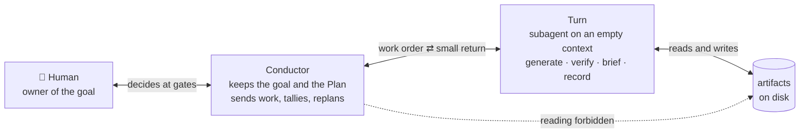
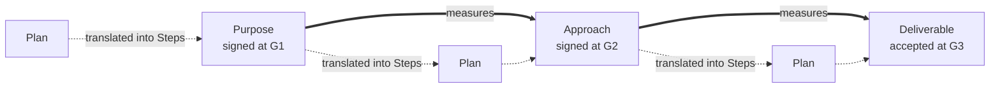
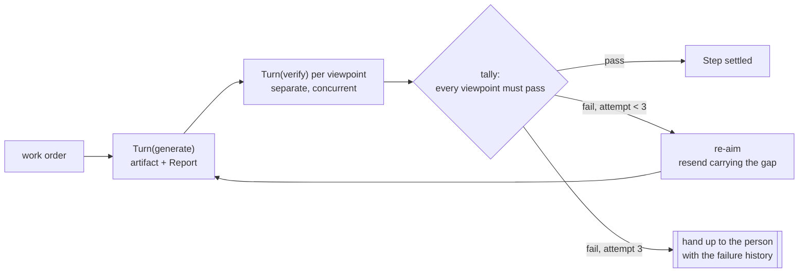
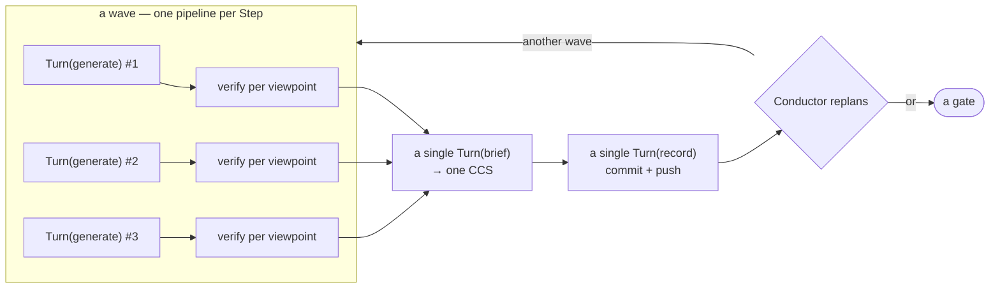

# aiya — Design

aiya is a Claude Code plugin. One person names a goal, a crowd of AI agents pursues it, and nobody has to sit and watch them work.

This file holds two documents. Chapters 1–4 argue the design; chapters 5–7 catalogue it. Each part states at its head who it is for and how it is meant to be read, and neither borrows the other's reader.

---

# Part 1 — the design, read through

*Reader: someone meeting aiya for the first time, deciding whether its mechanisms discharge the properties it claims. Axis: article / explanation.*

## 1. Problem — two failures, and the two properties they demand

aiya is a plugin for Claude Code: one person hands it a goal, and it runs many AI agents against that goal on their behalf. The ambition behind it is that one specialist, working this way, ships what a whole team used to ship — a factor of ten, not a few percent. Whether that factor materializes is not something this design measures; what follows is about the two things that stop it from being reachable at all.

Hand work to agents with no structure around them and the arithmetic runs the wrong way: the larger the job, the more of the person it eats. Two things go wrong.

- **What the directing agent holds keeps swelling.** Every stream of work added to it enlarges what it must carry, and old failures keep resurfacing inside that carriage. Cheap supervision of many streams at once is exactly what the swelling destroys.
- **Work stops answering to the goal, and the divergence shows up at the finish.** It arrives in two forms: effort spent on things the goal never called for, and a plan executed faithfully while everything learned along the way is ignored.

Naming those failures names the obligations. Two properties, and the rest of this document is measured against them.

- **Bounded context** — however many streams run side by side, the directing agent's **working state** — what it must hold to decide what happens next — grows slower than their number. Its conversation transcript is a separate thing, and §4.5 says what happens to that.
- **Drift detection** — any work in flight can be traced upward to the goal, and a divergence is caught while the run is still moving.

## 2. Core — a director, a worker, and what neither may do

The population is two kinds of agent. The **Conductor** keeps the goal and decides what happens next; its hands never reach the artifacts. A **Turn** does the reaching, and is never asked to care about the goal. A person stands outside both, owning the goal and appearing at the approval stops.



### The words this design fixes, and two rules it never breaks

- **Phase** — a run advances through three: Purpose (why), Approach (how), Delivery (execution).
- **Plan / Step** — one Plan belongs to each phase; one entry in a Plan is a Step.
- **Turn role families** — three families holding four roles. **generate** produces and **verify** measures; **run-keeping** looks after the run itself and holds two roles, **brief**, which writes the **CCS** (the Compressed Cognitive State, what one wave hands to the next — §4.2), and **record**, which performs every operation that has to be asked of the git host: commits, pushes, the pull request.
- **Work order** — a handful of parameters poured into a definition that shipped with the plugin. The procedure never varies; only the parameters do.
- **Elicit item** — the one species of Plan entry whose work consists of talking to the person. The Conductor carries it, holding the only seat with a voice.
- **Gates** — six places where the person decides: on the way into each of the three phases, its Plan (three **Planning Gates**, one per phase); on the way out, its product (**G1**, **G2**, **G3**). Two typed commands answer any of them: `/aiya:ty` for yes, `/aiya:gm` to send it back. The three remaining command words open, pause and resume a run rather than answering a gate — `on` starts one, `dn` sets it down for the day, `up` picks it up again in a fresh conversation.
- **Wave** — the Steps whose dependencies are all satisfied, dispatched together (§4.2). A wave of one is ordinary sequential work.
- **Verdict** — what one Turn(verify) writes: pass or fail on its viewpoint, the gap if it failed, and the evidence.
- **Yardstick** — any product a gate has signed; downstream work is measured by it.
- **Viewpoint** — one concern that can be checked on its own. Each viewpoint on a Step's product gets its own Turn(verify).
- **Machines verify, humans review** — measuring a product against a yardstick that does not move, and calling the result pass or fail, is machine work; accepting or redirecting is a person's. Mechanical does not mean scripted: whatever can be run is run first, and a model makes the last call against that same fixed yardstick (§5.3). Nothing in this design crosses the line between the two.
- **Investigation is first-class work** — drawing out a fuzzy intent, mapping an existing system, spiking a technology: each produces something, each is a Step.

### Nothing enforces this — two classes of rule instead

Nothing in aiya supervises the loop. There is no controller program, no checker, no daemon: the loop is prose in a skill file, carried out by a model reading it. Every rule is therefore one of two things. A **structural** rule cannot be broken, because the runtime gives no way to break it — an empty context, a tool that is simply absent. A **default** can be broken: it is merely the path of least effort, and departing from it leaves evidence somewhere on disk.

A rule can also be structural for one party and a default for another, and where that happens this document says which is which rather than rounding up. Chapter 5 gives every piece its promise and the evidence a violation leaves, rule by rule; chapter 7 prices what accepting all of it costs.

### Two walls

**The work under construction never reaches the Conductor.** What may enter it is a short closed list (§5.7): the newest CCS, the rulings that came back, the signed phase documents, the Plan, feedback arriving from a gate, the interview answers it writes down itself, and paths. Everything else is out — the products a Turn is building, the code, the research files, and the maker's own account of its work. The restriction is on categories of input, not on volume.

The signed documents and the Plan being *in* that list is what lets the Conductor plan and steer at all: it holds the yardsticks and the translation of them, and never the thing being measured. This wall is a **default**, not a structural rule — the Conductor's state is files, so nothing can take away its ability to read one. The evidence of a breach is the Conductor citing content that no return carried.

**A Turn cannot start another Turn.** Dispatch belongs to the Conductor alone. Two platform properties do the work here: a subagent opens on an empty context, and nothing but its return value travels back up. Every Turn therefore begins uncontaminated, answers with something small, and disappears. Work started underneath a Turn would sit outside the three-attempt limit (§4.1) and outside the return contract (§5.1), which is why the shipped definitions withhold the spawn tool — the `tools:` line of any of the six files under `aiya/agents/` shows it. The spawn tool is absent from all six, so for the two that also ship without a shell — brief and the local record adapter — this wall is **structural**. The other four (generate, verify, and the github and gitlab record adapters) need Bash for their work, and a shell is a roundabout route to starting a session, so for them the wall is a **default** (§5.1).

### One wager: the models keep improving

Anything resembling judgement — steering, and the final pass of verification — is left to the model. Control expressed as code locks the design at its author's comprehension on the day it was written, while whatever is delegated to the model improves for free. The design is fundamentally a budget decision: put as much as possible where progress accrues by itself, and shrink the remainder to a bare frame of walls and records. What is being chased is a ceiling that keeps rising, not a fixed multiple.

None of the frame is new. Sending jobs to clean subagents and accepting small answers back is ordinary practice. aiya's own contribution is what keeps the work honest: every judgement is anchored, by version number, to something a person signed; findings rewrite the plan as they arrive; and the only questions that climb back to the person are questions about the signed documents themselves. The wager is also placed as generally as it can be — one auditable chain from the first interview to final acceptance, whether or not the product is code — so whatever it establishes transfers to anything built with it.

### The CCS and the chain carry the two properties

Each property has a lead mechanism: the **CCS** for bounded context (§5.4), the **two-layer chain** for drift detection (§3.1). Neither carries its property alone — two further legs stand under each, three per property in total, and §4.6 walks through all six and says how much of each is actually enforced.

## 3. Structure — the chain everything hangs from, and who owns what

### 3.1 The chain — frozen yardsticks over a plan that keeps moving

Every artifact a run produces occupies a position on a single chain.



Heavy arrows are the frozen layer. The instant a gate signs the Purpose or the Approach, that document rules everything after it, and the only route to a different one runs back through a gate with a person behind it. Dotted arrows are the mobile layer: the phase's Plan, the hinge converting a signed document into Steps that can actually be executed, rebuilt from wherever the run currently stands each time something is discovered (§4.3).

This two-layer arrangement is what makes divergence visible in the first place; §4.6 counts what else drift detection needs. A Step reaches a signed document through its Plan, and a signed document reaches the reason the work exists. Divergence therefore stops being an atmosphere someone has to sense and becomes a concrete thing: a Step the Plan cannot derive from the document above it. That link is inspectable rather than metaphorical — it is what the fourth of the Plan's fixed viewpoints checks, holding the items against the phase's document and asking whether they produce that phase's output and nothing else (§5.6), and the Verdict it writes is the artifact recording the answer. A Plan that fails that check does not reach its Planning Gate, so a broken link travels no further than the phase it started in.

### 3.2 The ledger — authorship, checking, ownership

Alongside the chain, running the work deposits **records**: short-lived lineage that pushes the chain forward. A record is never promoted into a yardstick. The complete list, given once — with the last row a proposal rather than a fact, marked as such:

| Product or record | What it holds | Author | Machine check | Human owner |
|---|---|---|---|---|
| **Plan** ×3 | A phase's Steps and their dependencies — the mobile layer | Conductor | Turn(verify) on the four viewpoints aiya fixes (§5.6) | Planning Gate |
| **Purpose** | What counts as success — the top of the chain | Turn(generate) | Turn(verify), for evidential soundness | G1 |
| **Approach** | The route to that success | Turn(generate) | Turn(verify), against the Purpose | G2 |
| **Deliverable** | The thing itself, working | Turn(generate) | Turn(verify), against Purpose, Approach and the Step's `done when` | G3 |
| **CCS** | What travels between waves — the Conductor's working state | Turn(brief) | The compression rules of §5.4; a claim the artifacts do not support fails the next check, which reads artifacts and never the CCS | none — the Conductor consumes it |
| **Verdict** | One viewpoint's ruling: pass or fail, the gap, the evidence | Turn(verify) | none beyond itself — it is the check, and its evidence is what keeps it disprovable | none — the Conductor tallies them |
| **Report** | The maker's own account: done, attempted, unresolved | Turn(generate) | Turn(brief) weighs it against the artifact | none — it never leaves the pair that reads it |
| **Research** | What an investigation Step produced, interview answers included | Turn(generate); interview answers, the Conductor | Turn(verify), for evidential soundness; interview answers exempt | none — Research is never signed |
| **Run-state** *(proposed)* | The facts about a run's life (below) | Conductor | none needed — each entry mirrors a command or a ruling the person typed | none — the Conductor reads it back on resume |

Moving any of it into permanent storage is Turn(record)'s alone. The prohibitions on each role fall out of the one-role-one-skill split and sit inside the definitions themselves; the Conductor's list of prohibitions is §5.7.

### 3.3 On disk — a folder per run, three ways to persist it

Each run gets a folder. Physical layout appears here and in no other chapter.

```
.aiya/<slug>/
  backend     # a single line: github | gitlab | local
  purpose/    plan.md, purpose.md
  approach/   plan.md, approach.md, decisions/    # a file per decision
  delivery/   plan.md                             # the Deliverable itself lives in the repository
  ccs/        tNNN.yaml                           # one file per wave, each a complete state; the chain is per run
  verdicts/   # a file per ruling; the filename gives step, viewpoint and attempt
  reports/    # a file per Turn(generate); the filename gives item and attempt
  research/   # investigation output and interview answers, passed around by path
  history/    # signed editions, archived when a gate resolves under the local backend (§5.5)
```

Two files a run may touch sit outside that folder: the product's **UX** and **Design**. Both describe the product rather than the run and outlive any single one — `docs/ux.md` and `docs/design.md`, unless the Planning Gate redirects them to fit a project's own layout.

Layouts and filled-in examples ship under [references/](../references/). Research is the deliberate exception: an investigation's output takes whatever form suits it, is checked for evidential soundness, and is referred to by path.

**Persisting a run has two jobs — keeping it durably, and giving the person somewhere to read it — and one backend covers both.** Three exist. **github** puts a branch behind a pull request through `gh`; **gitlab** does the same with a merge request through `glab`; **local** keeps no git at all, leaving the files themselves as record and reading surface together. Which applies is worked out during `on`, stored, and looked up again at `up`. The loop does not vary between them. Two capabilities, and only these two, are weaker under local, and both are declared rather than papered over: `gm` with no argument (it collects feedback from review comments, and there are none) and survival of a dead machine (§7).

**Proposed, not built: a run-state file, `state.yaml`.** It would record the facts about a run's life — which backend is in force, the branch, what each gate ruled, and whether the run is still open — so that resuming could look the gates up instead of deducing them (§4.5). Authorship would be the Conductor's exclusively, on the grounds that it is the only participant present whenever something happens at a boundary: at `on`, at every gate ruling, at G3. Turn(record) would move it into permanent storage and never edit it. The proposal deliberately runs ahead of the code and is waiting on the owner's decision; what ships today is still the single-line `backend` file above, and nothing in the plugin changes until that decision arrives. Its field-by-field schema would ship with the conductor skill.

### 3.4 What ships — the skills, the Turn definitions, the formats

The plugin ships three kinds of file and no others.

**Six skills.** Five carry the command words and run only when typed — `ty` and `gm` are a person's recorded ruling and are never guessed from the conversation — plus one skill, invisible to the user, holding the Conductor's entire procedure.

**Turn definitions.** Files that ship, one per role or per platform variant. Six exist right now: generate, verify, brief, and three record adapters. That number promises nothing; §5.1's contract does.

**Formats.** The filled examples under [references/](../references/).

The main session reading and carrying out the conductor skill's prose is the whole of what runs. No compiled or scripted part sits beside it — chapter 2's wager, made concrete.

## 4. Behavior — the loop, from one Step outward

### 4.1 One Step — make it, measure it, aim again, hand it up

An attempt on a Step means precisely one Turn(generate). Elicit items are the exception: they dispatch nothing and bypass everything below, so checking, the attempt ceiling and chapter 6's three ratios cover only the Steps a Turn performs.



Turn(generate) puts the artifact and the Report on disk and hands back only their locations. Combining rulings is an AND and nothing cleverer; when it comes out false, the next attempt carries every failing gap, merged, as its correction. An investigation Step is judged differently in spirit — nothing was incorrect, the evidence was merely thin, so the retry digs deeper instead of rebuilding. Reaching the ceiling raises an exception rather than opening a gate: infrequent, unscheduled, and delivered to the person with the history of all three attempts — one merged gap apiece — to rule on.

Two things happen off the attempt counter. A return that never arrives is simply sent again, since a Turn keeps no state and a repeat is harmless; losing a message is not a failed attempt. And a viewpoint the Conductor notices missing while tallying is added to the Plan and checked on its own — nothing about the product changed, so the counter does not move. It can notice this without reading anything under construction: what it compares is the Plan's declared viewpoints against the rulings that came back, both of which are already its to hold.

### 4.2 One wave — many Steps, one CCS

Steps whose dependencies are all satisfied travel together as a **wave**; a wave of one is ordinary sequential work. Nothing on disk describes a wave: it is recomputed each time from the `consumes` lines of the Plan, where every item declares what it takes in (§5.6).



However many Steps the wave held, **a single Turn(brief) compresses the outcome into one CCS**. What the Conductor takes in per wave is therefore one object, and running wide stops trading against staying bounded.

Judging bounded context means judging exactly what keeps that object small, so here is what does. Each wave writes a **new** file — `ccs/t001.yaml`, `t002.yaml`, and so on. None is ever appended to or edited, and the Conductor reads only the newest; the earlier ones sit on disk as history nobody carries forward, so what the Conductor holds does not grow with the length of the run. Nothing is quoted into the file: every product, file and log the wave touched appears as a path. A soft ceiling of 2,000 bytes governs the file however wide the wave was — it fails nothing, and its use is diagnostic, since the component that swelled names the Step that was scoped too widely, and the answer is to narrow or split that Step rather than let the state grow. Where a list would otherwise lengthen Step by Step, the state carries a count or a path instead of the enumeration. And the Conductor keeps no running summary of its own beside it.

So the CCS does not shrink to a constant as a wave widens — six Steps name more paths than one does. What it does is grow far slower than the width, under a ceiling that stays put, which is the sub-linear claim §1 made and not a stronger one. Its full rules and its nine components are §5.4.

brief runs before record so that record can read the state just written; commit messages then describe what happened instead of repeating a template.

**Committing belongs to record alone** — not to the Conductor, and not to generate, verify or brief. Its slot in the loop is inherently serial, the wave having already collapsed into a single brief, so two writers never contend for the index. And because it is a Turn, it reads what it commits: in a design where the Conductor is forbidden to read, nothing goes into storage unseen. Commits happen per wave, plus at `on`, at gates and at `dn` (§5.5), which makes any commit in the log a place the run can restart from (§4.5) and turns the log into a readable state machine.

### 4.3 Steering — planning again from nothing, every wave

Planning is the Conductor's principal job; dispatching and tallying serve it. Arriving at the goal is what matters, finishing the Plan is not — executing a stale plan is the second way work diverges, and the Conductor, sitting where every Step's findings arrive, is the only participant positioned to stop it.

As each wave closes, it reads the CCS and works through three questions in sequence. Has the distance to the goal shrunk? What turned up? And what is the shortest route from where we now stand — **composed from scratch against the present situation, never by editing the plan already on the table**? Whatever the new plan does differently is the revision. Once the existing plan is the default and every finding has to argue its way in, steering has become theatre.

Latitude has a boundary. Everything inside the Plan is fair game: additions, deletions, splits, rewiring, reordering. Neither the Purpose nor the Approach is. When a finding undermines a signed document, it is not absorbed into planning — it goes back to a gate, to a person.

The permitted moves form a closed list: reshaping the Plan inside that boundary, re-aiming a Step, re-checking one, adding an investigation Step, returning to a gate, resending a lost return. Anything else breaks the wall, and looking into something personally breaks it hardest. A suspicion that can be phrased as a viewpoint turns into a re-check; an unanswered question turns into an investigation Step. One question settles ownership of any act: to do this, must the real work be read? If not, the act is control and belongs to the Conductor, tallying rulings being the model case. If so, the act is inspection and goes to a Turn, consolidating state being the model case.

### 4.4 Gates — where the person decides, and how versions bite

Intent reaches execution through three phases. Each carries a Plan, which the Conductor writes and rewrites and which belongs to the mobile layer rather than being the phase's output, and each carries an output, which Turns produce and the Conductor never does.

| Phase | Question it answers | Output | Steps it typically holds |
|---|---|---|---|
| **Purpose** | Why, and how will we recognize arrival? | Purpose — the situation, the pain, the benefit, the success criteria | Interviewing until the intent can be decided; market and competitor research |
| **Approach** | By what route? | Approach — testing, technology, design | Mapping the existing system; investigating technologies; spiking whatever looks riskiest |
| **Delivery** | In what order do we build? | The Deliverable, working | Implementation |

Of the six stops, only the exits carry numbers: G1, G2, G3, in phase order.

**Building the Deliverable has four prerequisites**: the run's signed Purpose, the Delivery Plan, and two documents that belong to the product rather than to any one run — its **UX**, fixing how the product behaves toward the people using it, and its **Design**, fixing the product's own foundations in the shape this document has. Without all four, a Turn has nothing to build toward and nothing to be judged against. Whatever the project lacks becomes Steps on the Plan. The earlier phases need less by construction: the Purpose phase has no signed document above it at all. The latter two belong to the product rather than the run and live outside the run folder (§3.3); whatever a project lacks becomes Steps on the Plan, written in aiya's formats. Every phase holds investigation Steps.

**Each phase measures against a fixed document.** The Approach answers to the Purpose; the Deliverable answers to both. The Purpose heads the chain with nothing above it, so its check is **evidential soundness** instead: sources behind claims, contradictions raised rather than smoothed over, ignorance labelled as ignorance, and success criteria a reader can actually decide. Research is held to that same standard — sitting outside the gates means unsigned, not unexamined.

**Writing the Purpose is split in two.** Interviewing is the Conductor's, and it is the only place it meets a person: keeping the goal includes asking for it, and no Turn can hold a conversation. Drafting is not the Conductor's. Answers land in files under `research/` as they are given, and a Turn(generate) writes the document from those files. Writing a document entails reading it, and the Conductor is barred from reading what is under construction, so it drafts no phase product — the Plan, which is not a phase product and is built from documents already inside its input list, remains its own (§3.2). Copying down what a person said is not authorship either, and the interview belongs to that same input list (§5.7). Nothing is the purpose until a person signs it at G1.

**At a gate** the Conductor prints a short console summary and points at where the artifact can be read. The summary is there so the person can decide whether to look; the reading itself happens on the review surface. Whatever a gate points at is already sitting there: record opened the surface at `on`, products land when their wave closes, and a Plan just written or just revised is delivered by a record dispatch that runs ahead of the Planning Gate (§5.5). Sending something back has two forms. `gm <one line>` puts the feedback in the argument and works under every backend. Bare `gm` uses the review comments instead, which record downloads into a file and returns as a path.

**Between stops the Conductor runs by itself, in dispatch rounds** — an unbroken stretch from one stop to the next, usually spanning several waves, with a board on the console kept current: per wave, which items finished, which are running (with attempt numbers, and the gap behind any re-aim), and which are still queued. Every round restarts from what is on disk (§4.5), which is why stopping costs nothing.

**Signed documents carry version numbers.** Each holds a `version: vN (timestamp)` line in its header, written and incremented only by Turn(generate); under local, where nothing else names an edition, that line is the identifier. Publishing a new version voids every measurement taken against the previous one. Because each Verdict names the edition it used (§5.3), the Conductor finds the void ones by grepping `verdicts/` for the superseded edition and dispatches their Steps to be checked again — a search over rulings, which are already inside its permitted inputs, so no wall is crossed. Only an actual failure against the new document sends a Step back for another attempt.

**A resolved numbered gate sets two parties writing** — a Planning Gate signs no document, so nothing is carried anywhere when one passes (§4.5). record moves the signed document into permanent storage: a commit and a push under the remote backends, an archive into `history/` under local (§5.5). At G3 that becomes a closing sweep, and the pull or merge request is left open for the person to finish with — merging is not something aiya does. Should the run-state proposal land (§3.3), the Conductor would meanwhile enter the ruling there — every gate's, yes and send-back alike. That file is a log; nothing reads a next version out of it.

### 4.5 Suspending and resuming — any commit will serve as a starting point

**Three things are enough to resume**: the newest CCS, the signed phase documents, and the Plan currently in force. Reopen a paused run in a new conversation and it reads exactly what the following wave would have read, then carries on. The proposed run-state file would add a fourth.

The gates are the one thing disk cannot always settle today. A Planning Gate approves a Plan, not a document to be signed, so nothing new is written when it passes — which is why the two writing parties of §4.4 are the numbered gates' business, not these three. A Planning Gate still waiting and one just approved look identical on disk. The shipped Conductor therefore puts the pending gate back up and waits — erring safely, at a cost of at most one duplicate `ty`. Turning that deduction into a lookup is exactly what the proposed run-state file is for.

One narrow window loses something regardless: a boundary event that has not reached permanent storage dies with the machine, and the resumed run re-presents the gate. Erring safely again — a lost approval costs one extra `ty`, a lost send-back costs repeating the feedback.

Persistence is a continuous condition rather than a closing ceremony. Every wave ends by committing and pushing the whole restart set, which makes pausing ordinary rather than exceptional; `dn` verifies rather than saves.

**Boundedness applies to the working state, not to the conversation.** The Conductor's transcript still lengthens with every Turn dispatched. The design keeps the per-Turn cost small — what comes back is locations and rulings — and the accumulated remainder is flushed by `dn` → `/clear` → `up`. A remote backend carries the restart point past the loss of the machine; local carries it only past the end of a conversation (§7).

### 4.6 Bounded context and drift detection — six legs, and what each is worth

**Bounded context stands on three legs.** What they deliver is the sub-linear growth §1 asked for — not constancy, which nothing here claims.

1. The reading ban limits which categories of thing can enter the Conductor at all (§2). A **default**: nothing can stop a file-reading agent from reading, and the evidence of a breach is the Conductor citing content no return carried.
2. The CCS limits quantity — a fresh file per wave, never appended to or edited, everything named by path rather than quoted, under a ceiling that does not move with the wave's width (§4.2). A **default**, resting on the compression rules brief follows and on the next check reading products rather than the state.
3. One brief per wave cuts the tie between width and what returns: N Steps produce one state to read rather than N, and that state is written to the same ceiling whatever N was (§4.2). A **default** — nothing stops a Conductor dispatching two briefs — resting on a structural fact underneath it, that whatever a Turn read while working never travels back with its return.

What this discharges is the working state, and §4.5 draws the line honestly: the conversation transcript still grows with every Turn dispatched, and it is brought back down by a person running `dn` → `/clear` → `up`, not by anything in the loop. Bounded working state is what the three legs deliver; a bounded transcript is housekeeping.

**Drift detection stands on three legs too: one that makes divergence visible at all, and one for each of the two forms §1 named.**

1. The chain turns divergence into an inspectable object — a Step the Plan cannot derive from the document above it — with nobody required to sense anything (§3.1). Enforced at the Planning Gate by the Plan's own fourth fixed viewpoint, whose Verdict is on disk: a **default** carried out by a Turn, not by the Conductor.
2. Verification against the phase's signed document catches unrequested work at the Step, before its wave closes: a viewpoint drawn from that document's criteria fails an artifact the goal never called for (§4.4). Version-pinning is what keeps that check current rather than what performs it — a new edition voids the rulings taken against the old one, and they are re-run. Both parts are **defaults**, with the Verdict and its cited edition as the trail.
3. Replanning from nothing catches the stale plan, since a plan built out of the present situation cannot quietly inherit yesterday's assumptions (§4.3). This is the weakest leg and the document does not pretend otherwise: it is an instruction to the Conductor with no structural backing, and a Conductor that lightly edits the standing plan while calling it a rebuild leaves no trace that says so.

Anything beyond the Conductor's latitude is not absorbed at all: doubt about a signed document travels to a person at a gate.

Counted honestly: **none of the six legs is enforced**. What is structural is narrower and sits underneath them: a subagent begins on an empty context, only its return travels back to whoever dispatched it, and the spawn tool is in none of the six definitions — leaving, for the four that carry a shell, only the roundabout route §2 named. Those facts make the shape possible; staying inside the shape is the Conductor's compliance, evidenced rather than guaranteed, with the trails chapter 5 lists. That is what going without a controller buys and costs.

So a reader deciding here can settle two things and not a third. The design does make both properties **checkable**: bounded context has a measurable object, the newest CCS, and drift has an inspectable one, a Step its Plan cannot derive. What no reading of this document can settle is whether they will be **kept**, because five of the six legs depend on one party following prose that nothing checks — and the sixth, the wall against nesting, holds absolutely only for the two definitions that ship without a shell. The rest of the decision is priced in the two chapters after this one: chapter 6 asks whether the loop repays what it costs, and chapter 7 lists what was given up to get here.

---

# Part 2 — the reference

*Reader: someone implementing aiya or auditing a run, looking one thing up. Axis: reference.*

## 5. Rules — the promise each piece makes

Each entry gives a promise and the evidence a violation leaves (§2). Schemas, controlled vocabularies and filled examples live in the Turn definitions and [references/](../references/); nothing here repeats them.

Two rosters this chapter uses without re-deriving. **The gates**, six of them: a Planning Gate into each of the three phases, reviewing that phase's Plan, and a numbered gate out of each — **G1** signing the Purpose, **G2** the Approach, **G3** accepting the Deliverable (§4.4). **The command words**, five: `on` starts a run, `dn` sets it down, `up` resumes it in a fresh conversation, and `ty` and `gm` are the person's two answers at a gate — `gm <one line>` carrying the feedback in its argument, a **bare** `gm` taking the review comments on the pull or merge request instead.

### 5.1 The Turn contract — five rules and the invariant

1. **Opens on an empty context** — the work order is the only thing that enters. *Structural*: the agent runtime creates the context, and nothing in the loop can add to it.
2. **Hangs directly off the Conductor** — it starts nothing itself. *Structural for the two definitions that carry no Bash* — brief and the local record adapter — since the spawn tool and the user-question tool are absent from all six. *A default for the four that do carry Bash*: generate, verify, and the github and gitlab record adapters, each of which keeps a roundabout route to starting a session.
3. **Touches the work under construction without restriction** — no other role touches it, with one stated exception: the Conductor writes the interview's answer files under `research/` (§5.7). *A default.*
4. **Answers with something small** — locations plus a line, a Verdict, the path of a CCS, a few lines listing what was committed. Neither raw output nor a transcript, ever. *A default*, and the one rule with a live checker: the Conductor inspects every return and takes only the bounded part of an oversized one.
5. **Retains nothing** — created for one job, answers, disappears. *Structural*: the runtime discards the context. Statelessness is what makes resending a lost answer harmless (§4.1).

Evidence of a violation, rule by rule. Rules 1 and 5 cannot be violated from inside the loop. Rule 3's trail is the work's own history — a file changed by no dispatch. Rule 4's is the oversized return the Conductor cut down. **Rule 2 has no reachable trail**: the evidence would be the nested session's transcript, which no bounded return mentions, so an indirect spawn is undetectable from anything the run writes down.

**The invariant is the contract; the number of definitions is not.** Definitions ship and are never composed at runtime; dispatch belongs to the Conductor alone; whatever a party writes, it has read. Adding a role, or a variant of one for another platform, means one more definition under the same contract with the loop untouched — the only change on the Conductor's side is listing a new backend among those it detects at `on`.

### 5.2 Turn(generate) — the product, the Report, and the version line

Performs one Step, writes the artifact and a **Report** to disk, and returns where both are.

The Report is first-person — what was done, what was attempted, what stayed uncertain — and Turn(brief) is its only reader, so nothing first-person ever crosses the wall ([references/report.md](../references/report.md)).

Where the artifact will become a signed document, generate writes the version line (§4.4): `v1` when it first appears, read-then-increment on each rework. Version numbers have exactly one author.

Return: the two locations plus a single line. Evidence of a violation: an artifact on disk with no Report beside it, or a version line on a document generate did not produce.

### 5.3 Turn(verify) — one concern, one ruling that can be disproved

A **viewpoint** is one concern checkable by itself, and a Step gets one flat Turn(verify) per viewpoint — a judge with one thing to watch overlooks less than a judge with five. Two viewpoints come as standard: the Step's own `done when`, and whichever criteria of the phase's document apply. A Plan item may name more.

What it receives: its viewpoint, the frozen document, where the artifact is, and three identifiers — the Step number, the attempt number, and the path under the run's `verdicts/` to write its Verdict to. What it never receives: the Report, or any hint of the expected answer — so no amount of polish in the maker's account can reach it. It writes its Verdict to disk itself and returns identical content, which puts the record in place before the Conductor has touched anything and makes a ruling flattering to the Conductor impossible to manufacture. `evidence` is required, keeping the claim of a gap checkable later, and each Verdict names the edition it judged (`purpose.md@G1-v2`) — the handle §4.4's invalidation pulls.

**Where the measuring stick comes from is not negotiable**: the phase's frozen, signed document, never the CCS in flight and never the Plan in motion. A ruler that may have bent measures nothing. At the top of the chain, where no signed document exists yet, `evidential-soundness` is named in its place — sources behind claims, contradictions raised rather than smoothed over, ignorance labelled as ignorance, and success criteria a reader can decide. A dispatch offering something still moving is refused by the verifier, which records a failed Verdict whose evidence names the violation — the schema has no separate value for a refusal.

Whatever can be checked mechanically is checked first, with the model as a thin final layer — which is why success criteria are phrased to be runnable. An artifact too large for one verifier in one pass is telling you about scope: divide the Step rather than enlarging the verifier.

Return: the Verdict, identical to the one written. Evidence of a violation: a Verdict with an empty `evidence` field, or one naming no edition. Schema and example: the definition itself.

### 5.4 Turn(brief) — the CCS, and the rules that keep it small

The **CCS (Compressed Cognitive State)** is what travels between waves: simultaneously the Conductor's working state and the only inheritance a re-aimed or later Turn receives. Nine components in YAML, a schema taken from Bousetouane, ["AI Agents Need Memory Control Over More Context"](https://arxiv.org/abs/2601.11653) (2026). What aiya adds is how it is operated.

- **Third person.** brief writes it, after judgement: no party reports on an outcome it has a stake in.
- **After the rulings.** A Step's worth is unknown until it has been judged, so the judgement is part of what travels.
- **Overwrite, never extend.** Each wave gets a fresh file.
- **The artifact outranks the account.** Anything observable is taken from the artifacts, not from the maker's description of them; the Report contributes only what nothing else holds — attempts, and open questions. A claim exceeding what the artifacts show does not last, since the following check reads artifacts and never the CCS.
- **One per wave, undivided.** Verification fragments per viewpoint because narrow attention judges better; a state stitched together out of partial views is missing the very thing that makes it a state. It judges facts, never direction.

Three habits keep it small: artifacts referred to by location and never inlined; a soft ceiling — 2,000 bytes in the shipped definition — whose breach fails nothing, needs no channel of its own, and is visible in the CCS the Conductor reads next, where the swollen component names the cure: narrow the Step, split it, or insert a Step that clears the backlog; and no private running summary on the Conductor's side, whose input is the newest CCS plus small rulings. Small and sub-linear is the claim, not constant in bytes.

Return: the path of the CCS, and nothing else.

Evidence of a violation: a state asserting what its products do not show is surfaced by the next check, which reads products; an inlined product is greppable; a state extended rather than written fresh shows as a file in `ccs/` carrying two waves; and a state written before its rulings shows as a file older than the Verdicts it claims to carry. One rule has no trail — nothing distinguishes brief paraphrasing the Report from brief reading the product.

Schema, the nine component names, per-component roles and an example: the definition.

### 5.5 Turn(record) — commits, pushes, and the five points they happen at

Everything that must be asked of the git host or the review surface belongs to record — commits, pushes, branches, pull and merge requests, fetching review comments. Writing a file to disk is not one of those; every Turn does that for itself. record ships as three **adapters** — github, gitlab, local — identical in role, in what they return, and in the five points at which they run. All five are serial by construction: `on` and `dn` are the session's own boundaries, and the other three are reached only after a wave has collapsed into a single brief or a Plan has settled. Two writers never contend for the index.

- **`on`** — open the branch, push first, create the pull or merge request, so the reading surface exists before anything refers to it.
- **Wave close** — after brief, so the new state is readable; commits the wave's artifacts, rulings, reports, the new CCS and the current Plan by explicit path, then pushes.
- **Ahead of a Planning Gate** — puts a newly written or newly revised Plan, together with the rulings from checking it, onto the surface (§4.4).
- **A gate ruling** — moves the signed document into storage; generate stamped its version and record never does. At G3 this becomes a closing sweep that leaves the request open. When a bare `gm` arrives, downloads the review comments into a file and returns its path.
- **`dn`** — clears anything outstanding and pushes a final time.

The run-state file of §3.3 is proposed and not in force, so nothing about it is auditable today. Should it land, it would join the wave-close and gate-ruling dispatches, and an approved Planning Gate — which triggers no record dispatch at all — would become durable at whichever point comes next.

Return: a few lines naming what was committed and pushed, or, on a bare `gm`, the path of the comments file.

Resending record is safe because its operations are idempotent at this size: already-committed paths stage nothing, an already-completed push moves nothing.

The **local adapter** does no git whatsoever, the disk being the record already. It is dispatched at the same five points and answers in the same shape, but at four of them it writes nothing and returns the paths that make up the review surface. Its one write is at a gate ruling: having no shell, it reads the signed document and writes a copy into `history/` under a name carrying its version, so signed editions outlast later rewrites with no git to name them.

Evidence of a violation: a commit not attributable to a record dispatch shows up in the log.

### 5.6 The Plan — three lines an item, and safe revision

Each item is three lines plus an optional fourth: **product** (what will exist), **consumes** (which earlier artifacts it actually takes in — dependency, not sequence), **done when** (its own pass condition, phrased to be runnable), and **viewpoints** (extra domain concerns, one Turn(verify) each). Semantics and example: [references/plan.md](../references/plan.md).

**The Plan is itself checked, against four viewpoints aiya fixes** — leaving the Conductor to write the criteria for its own Plan would be signing its own work:

1. Three lines present on every item.
2. `consumes` describes genuine consumption, writes to a shared file included.
3. `done when` can be run.
4. Measured against the phase's document, the items yield the phase's output — no less and no more.

**Three conditions make revision safe**: the latitude boundary (§4.3); a revision log, where each change records what moved, the finding that justified it, and which waves have already gone out, so that at the following gate a person has both the changes and their justification in front of them; and those four viewpoints re-applied every time. An item that outgrows a single Turn becomes several new items, each with its attempt counter starting fresh.

Evidence of violations: broken formats and false `consumes` lines fail the fixed-viewpoint check; an undocumented change appears as a Plan diff with nothing in the log; an edition of a signed document that no gate produced shows up in its version line, and in the record of how the file got there — the repository's log under github or gitlab, the `history/` archive under local.

### 5.7 The Conductor — the permitted and the forbidden

**Permitted**: holding the goal; interviewing, its sole contact with a person; writing the Plan and rewriting it every wave; composing and sending work orders; tallying rulings mechanically and deriving waves; advancing, re-aiming, and escalating once a Step has failed three attempts — stopping the round and handing the decision to the person with that Step's failure history (§4.1); no record dispatch attends an escalation, since nothing has settled — and waiting at gates. With the run-state proposal in force, also keeping that file current at every boundary event.

**Forbidden**: doing domain work; reading the real work, Reports included; writing artifacts — the Purpose no exception, since writing entails reading; leaning on a Turn's judgement, and above all naming the ruling it expects; altering a signed document; committing or pushing, since every platform action is record's.

**Uncertainty becomes a Step** (§4.3). At some point, looking into a thing personally will feel quicker than delegating it; that moment is what the rule exists for.

This wall cannot be built physically: the Conductor's state lives in files, so its ability to read cannot be taken away. It holds as a default because the list of admissible inputs is closed — newest CCS, small rulings, signed phase documents, current Plan, gate feedback as an arrival and a path, the interview it records under `research/`, and paths. Anything else present means the wall is down, and the giveaway is the Conductor referring to content that no return ever carried.

## 6. Observability — three ratios, and where the counts come from

Staying bounded has to be affordable too, and affordability is not obvious: each Step buys N verifications, each wave a brief and a record, each re-aim another lap. Three ratios, all countable after the fact from what a run leaves lying around, keep the invoice legible.

| Ratio | How it is counted |
|---|---|
| **Keep rate** | Steps, divided by the Turn(generate)s they cost — which is Steps plus re-aims. Work that passes first time scores 100%. |
| **Escalation rate** | Steps that exhausted all three attempts, divided by all Steps. |
| **Verification overhead** | Verifies plus briefs plus records, divided by generates. |

One attempt is one Turn(generate), and the first attempt is not a re-aim: a Step that exhausts the cap has made three attempts and two re-aims, and cost three generates. record is counted on purpose — every Turn beyond generate is part of the cost the loop has to justify. Elicit items, whose work is the interview itself and which the Conductor carries, appear in none of the three; they are identifiable by absence, having no Report and no Verdicts to their name.

**No instrumentation exists.** Every number is derived from what a run writes anyway: attempts travel with the rulings, re-aims sit in the chain of CCS files, and record dispatches are the commit log itself. Under local the same numbers come off the disk.

A starting rule of thumb, to be sharpened by use rather than treated as measured: below 50% keep rate the loop costs more than it saves, and the fix is smaller Steps, not extra attempts.

What the ratios measure is the loop, not the person's output. Bounded context and drift detection are the design's own examination (§4.6); the ratios ask whether passing it was worth the Turns it took.

## 7. Trade-offs — shapes rejected, prices accepted

**Rejected shapes**, each with its reason:

- **Controlling the loop with code.** It removes the compliance wager, and it pins the ceiling to whatever its author understood while writing it (§2). Whether prose alone can hold the cycle, the ceiling and the gates is a hypothesis, to be settled by using aiya on itself; should it fail, only the loop becomes code, and formats, chain and measures move across intact.
- **Replaying the transcript, or retrieving from it** — the two usual ways of carrying state. Replay grows linearly and drags old mistakes forward; retrieval escapes the growth but wanders, since resembling the query is not the same as being what the task needs. Only a bounded state rewritten each round answers both objections at once.
- **A cast of agents specialized by content** — one for review, one for design, and onward. Such a cast has no natural size limit, and what those definitions say shapes the quality of work the Conductor cannot see. Roles stop at the three families and content rides in as parameters. Growth is allowed along the platform axis instead: a backend adds one record adapter, and an adapter carries no content.
- **Work orders written from scratch.** Composing them keeps the pull toward doing the work with the Conductor, long instructions bloat the transcript, and varying wording makes verification's independence depend on how a particular order happened to be phrased.
- **The Conductor writing artifacts.** Writing entails reading, and a reading ban is believable only while the Conductor has no motive to read.
- **Requiring git.** What the design needs is durable storage and somewhere to review (§3.3); a repository with pull requests supplies both but does not define them. Interchangeable backends keep the loop identical everywhere and keep the reduced capability honest.
- **Letting the author write the state** — generate producing the CCS. Everything the Conductor believes would then arrive through a party with an interest in the outcome. Bousetouane supplies the schema (§5.4); the operating rules are aiya's.

**Accepted prices**, written so they read as accepted rather than missed:

- **Compliance is not enforced.** Rules are defaults with evidence trails, never technically blocked; that a prompt suffices is the wager. If using aiya on itself proves otherwise, the first hardening to reach for is a hook refusing the Conductor's reads of work paths — after measurement, not before it.
- **Turns per Step.** N verifications, one brief per wave, and a full extra lap per re-aim. Independence costs exactly that, and chapter 6 keeps the total in view.
- **Loss of first-hand texture.** A third-person record flattens the felt detail of doing the work. Some of it reaches the CCS through the Report, second-hand by design.
- **Dependency declarations have to be right.** A wave is exactly as safe as the `consumes` lines behind it, and one omission spoils every Step in it at once. That is what parallelism costs, and the reason a `consumes` line is checked while the Plan is checked and read by a person at the gate, rather than being inferred.
- **The Plan will not stay put.** What a person approved and what actually ran will differ. The revision log and the re-applied viewpoints are the payment; what is bought back is a diff a person can follow when the next gate comes.
- **The transcript grows linearly.** Only the working state is bounded. Paid for by keeping the per-Turn cost low and by cycling `dn` → `/clear` → `up`.
- **local is a reduced mode.** No comments for a bare `gm`, and durability that stops at the disk: signed editions survive in `history/`, but a dead machine and the drafts in between do not. Accepted because a stated reduction beats a pretended equivalence — and insisting on git would exclude precisely the small runs where trying aiya is cheapest.
- **Gates are serial.** Six points still need the person, one at a time. Keeping them sparse makes that bearable; nothing makes it disappear.
