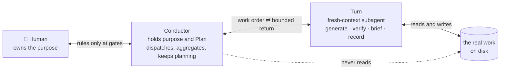
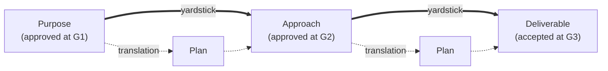
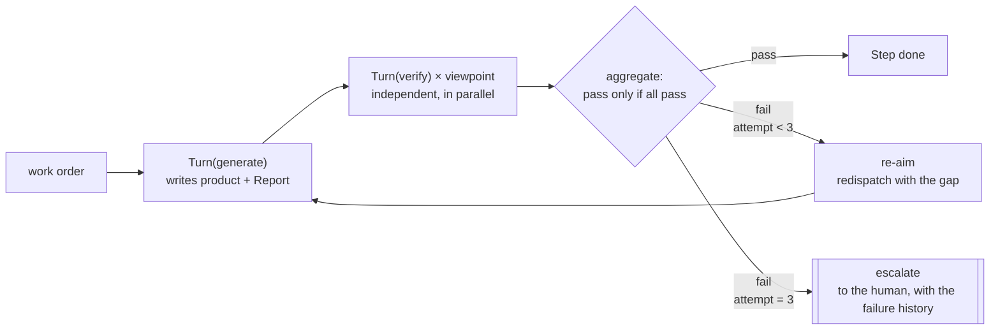
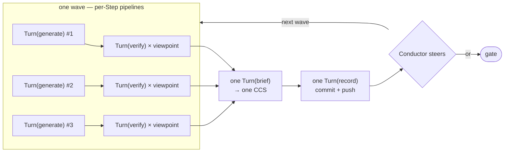
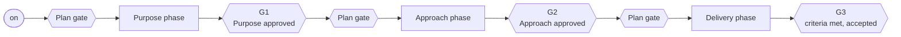

# aiya — Design

aiya is a plugin for Claude Code. It points many AI agents at one goal, directed by a single person who does not sit and watch them work.

This file holds two documents, and it says which is which.

- **Part I — chapters 1 to 4.** For someone meeting aiya for the first time and deciding whether its two mechanisms really deliver the two properties chapter 1 requires. Read front to back, once. Written as an argument.
- **Part II — chapters 5 to 7.** For someone building or operating aiya who wants one promise, one number, or one reason. Arrive by search, read the entry, leave. Written as reference, and it borrows chapter 2's vocabulary rather than repeating it.

---

# Part I — The argument

## 1. Problem — The bigger the job, the more watching it takes

### 1.1 The goal

One specialist, working alone, ships what used to need a team. The target is a tenfold jump in what a single expert delivers, and AI agents are the leverage.

Proving the tenfold figure is out of scope. What follows answers for the design, not for the multiplier.

### 1.2 What breaks when you simply delegate

Hand work to agents without a shape for it and the headcount comes back as the job grows. It returns through two separate failures.

**Context bloat.** Whichever agent is directing piles up state in proportion to the size of the job. Each extra stream adds to what that agent has to hold, old failures resurface inside it and get worked through a second time, and the cheapness that made running many streams attractive is precisely what evaporates.

**Drift.** What is being built stops matching what was wanted, and the mismatch appears at hand-off rather than while there is still time to act. It arrives in two shapes: output nobody asked for, and the original plan finished to the letter while everything learned on the way is ignored.

### 1.3 The two properties — bounded context, drift detection

Two properties follow from those two failures. Every later decision here is checked against them, and §1.4 is where the check itself is written down.

- **Bounded context.** The state the directing agent carries from one batch of parallel work to the next does not grow with how many streams that batch held. A batch is a **wave** — the Steps whose inputs are all ready, dispatched together (§4.2). Two things are outside this claim and stay outside it: the rulings the agent aggregates within a wave, and its own conversation transcript. §1.4 gives the shape of all three.
- **Drift detection.** Any piece of work can be traced back to the purpose, and a departure surfaces while the run is still live.

### 1.4 The answer — the CCS bounds context, the chain catches drift, and nothing enforces either

One mechanism per property. The **CCS** — Compressed Cognitive State — answers bounded context: one small YAML file per wave, nine fixed components, written fresh each time and pointing at real work by path rather than holding it (§5.4). The **two-layer yardstick chain** answers drift detection: a frozen layer of gate-approved documents, and beneath it a Plan per phase that is re-derived as work discovers things (§3.1). Two layers, because one of them must not move and the other must.

Three parties do the work, and the rest of Part I is about them. The **Conductor** directs and opens no artifact. A **Turn** is a throwaway subagent that does one job on the artifacts and hands back something small. The **human** owns the purpose and appears only at gates.

**Bounded context stands on three legs**, and no leg grows with the size of the job.

| Leg | What it bounds | How it holds | Where |
|---|---|---|---|
| The Conductor opens no artifact | The **kind** of thing that can get in — what it may take is a short, closed list | **Traced.** The tell is the Conductor citing content no return delivered. Nothing blocks the read | §2, §5.7 |
| One CCS per wave, rewritten each time, artifacts named by path | The **amount** — the definition sets 2,000 bytes, advisory, and treats an overrun as a symptom to report | **Traced only indirectly.** Nothing inspects the CCS; an overclaim shows up when the next measurement reads the artifacts instead | §5.4 |
| A wave of any width converges on exactly one CCS | The **carry-forward** — a wave leaves one state to be read at the next wave, not one per Step | **Traced.** `ccs/` holds one numbered file per wave, so a second brief in a wave is visible in the count | §4.2 |

**What this bounds, and what it does not.** Three things enter the Conductor and they do not scale alike. The CCS carried from one wave into the next is one file however wide the wave — the third leg, and the only part that is flat in the width. The Verdicts of the wave being aggregated scale with Steps × viewpoints inside that wave (§4.1). And the Conductor's conversation transcript lengthens with every Turn dispatched, bounded by nothing; it is cleared by hand at `dn` → `/clear` → `up` (§4.5). §1.3's property is a claim about the first of the three, and it says so there. The second and third are stated where they arise and are not covered by it. One more thing belongs beside the claim rather than in chapter 3: **the CCS is the one product nothing measures** (§3.2). Its rules govern how brief is told to write it, not what it wrote.

**Drift detection stands on three legs**, one for each shape the failure takes.

| Leg | The failure it catches | How it holds | Where |
|---|---|---|---|
| Step → Plan → gate-approved yardstick → the reason the work exists | Work that traces to nothing. Drift turns into a checkable object — a Step nothing above it justifies — rather than a mood somebody has to notice | **Traced.** A false `consumes` is caught by the Plan's fixed-viewpoint check; an edition no gate approved shows in the document's version line (§5.6) | §3.1 |
| A separate Turn measures each product against the approved yardstick at a pinned version, before its wave closes | Output nobody asked for, caught at the Step instead of at hand-off | **Partly structural.** The verifier writes its ruling to disk before it returns, so the record exists before the Conductor sees it; the rest is traced, in `verdicts/` (§5.3) | §4.1, §4.4 |
| At every wave close the Plan is derived again from the position now, starting from nothing | The stale plan. Yesterday's plan cannot ride along unexamined | **Nothing.** §5.6's traces catch a broken format, a false `consumes`, an unlogged revision and an unapproved edition — none of them tells a re-derived Plan from an edited one | §4.3 |

**Read the third column before the first two.** Not one of the six legs is enforced: there is no controller program, the loop is prose a model follows, and nothing stops a breach of any of them. Five leave evidence behind; the last leaves none at all, which makes re-planning from zero an instruction rather than a property.

What the platform does enforce sits one level below the legs, in the Turn contract (§5.1): a subagent begins with an empty context, and the tool for delegating work is absent from every one of the plugin's six Turn definitions. Those two facts hold the wall between the roles, and even that wall softens where a definition carries a shell — four of the six do (§5.1). They do not hold the six legs at all.

That prose alone holds all six is a wager, and it is untested. Dogfooding is what would settle it, and chapter 7 prices what is being accepted meanwhile.

Chapter 2 gives the roles and the two walls, chapter 3 the chain, chapter 4 the loop each leg runs inside.

## 2. Core — The roles, what separates them, and the bet

### Two roles, and no third

Two roles inside the loop, because the design needs exactly one that holds the purpose and never touches the work, and exactly one that touches the work and never holds the purpose. The human is the third party in the diagram below and holds neither role: the purpose is theirs, and they act only at gates.



### Two walls hold the roles apart

**The Conductor opens nothing real.** Even a Turn's own account of what it just did — the Report (§5.2) — is out of bounds. §5.7 enumerates what may enter instead.

**Turns are leaves.** Dispatching is the Conductor's alone. The platform supplies both halves of it: a subagent opens with nothing in its context, and the caller receives only what that subagent chooses to return. A nested Turn would sit outside the three-attempt ceiling (§4.1) and outside the rule that every return is small (§5.1), so the shipped definitions leave the delegation tool out. This wall is the firmer of the two and it is still not absolute: four of the six definitions carry a shell, and a shell can reach the platform's own command line (§5.1).

### Vocabulary, fixed here

- **Phase** — three of them: Purpose (why), Approach (how), Delivery (do it).
- **Plan / Step** — one Plan to a Phase; a Step is one item on it.
- **Turn role families** — *generate* makes, *verify* measures, and *run-keeping* splits in two: *brief* writes the CCS, *record* performs every platform operation.
- **Work order** — a few parameters handed to a definition that never changes. Static procedure, parametric content.
- **Elicit item** — a Plan item whose work consists of talking to a person, and the only kind that does. The Conductor carries it, since Turns ship with no way to ask a human anything.
- **Gates** — six halts. A Phase is entered past a **Planning Gate** on its Plan and left past an Output Gate on its product: **G1**, **G2**, **G3**. The human replies `/aiya:ty` to approve or `/aiya:gm` to send back. Three more command words — `on`, `dn`, `up` — drive the session rather than the gates.
- **Yardstick** — an approved product that later work is measured against.
- **Viewpoint** — one concern checkable on its own. Each gets a verifying Turn of its own.
- **Structural**, **traced**, **nothing** — the three ways a rule can hold, and the third column of §1.4's tables. Structural means the platform makes a breach impossible; traced means a breach is cheap to spot afterwards and impossible to prevent; nothing means neither. Chapter 5 gives each promise its trace; chapter 7 prices what that costs.
- **Machines measure, humans redirect** — pass or fail against a fixed yardstick is mechanical work; approving and changing course are not.
- **Investigation is work** — eliciting, surveying, and spiking are Steps with products, not warm-up.

### The bet

Judgment, steering, and the final layer of measurement — the one that runs after every mechanical check has run (§5.3) — all sit with the model. Written as code, a capability freezes at the understanding of the day it was written; left to the model, it improves as models do. The design is therefore an allocation: hold the coded skeleton down to walls and records, and leave everything else where it can get better on its own.

Dispatching to fresh subagents and taking small returns back is ordinary practice, not something aiya invented. aiya's addition is that every judgment ties back, version attached, to something a human approved — and that only doubts about those approved things travel back to the human.

## 3. Structure — One chain, one ledger, one layout

### 3.1 The chain — fixed yardsticks, a living translation



Solid edges freeze the moment a gate approves them, and the one route to changing a frozen edge runs back through the gate where a human sits. Dotted edges are each phase's Plan, the joint converting an approved yardstick into executable Steps, derived afresh whenever the work turns something up (§4.3).

§1.4's first drift leg lives here. A Step justified by nothing above it shows up as a broken link, and a broken link halts at that phase's gate rather than travelling on.

### 3.2 The ledger — who writes, who measures, who owns

Execution leaves **records**. They move the chain along and never become yardsticks. The full list, given once:

| Product / record | What it is | Written by | Measured by (machine) | Owned by (human) |
|---|---|---|---|---|
| **Plan** ×3 | A phase's Steps and their dependencies — the translation layer | Conductor | Turn(verify), on aiya's four fixed viewpoints (§5.6) | Planning Gate |
| **Purpose** | The definition of success, and the chain's head | Turn(generate) | Turn(verify), on evidential soundness | G1 |
| **Approach** | The route to that success | Turn(generate) | Turn(verify), against Purpose | G2 |
| **Deliverable** | The thing that works | Turn(generate) | Turn(verify), against Purpose, Approach, and the Step's `done when` | G3 |
| **CCS** | The small state carried wave to wave — the Conductor's working state itself | Turn(brief) | **Nobody.** §5.4's rules tell brief how to write it; nothing checks what it wrote. A false line cannot corrupt a Verdict, since the next measurement reads artifacts and never the CCS — but it does reach the Conductor's steering (§4.3) unchallenged | — (the Conductor consumes it) |
| **Verdict** | One viewpoint's ruling: pass or fail, the gap, the evidence | Turn(verify) | — it is the check. Its evidence is what keeps it falsifiable | — (the Conductor aggregates it) |
| **Report** | What the maker says it did: did / tried / unsure | Turn(generate) | — Turn(brief) holds it up against the artifact | — |
| **Research** | An investigation Step's output, elicit answers among it | Turn(generate); the Conductor for elicit answers | Turn(verify), on evidential soundness; elicit answers exempt | — (never approved) |
| **Run-state** *(proposed)* | Four lifecycle facts about the run (§3.3) | Conductor | — each line mirrors something the human typed | — |

No writer measures its own work and no measurer approves it. That separation is what "independent" means in §1.4's second drift leg.

Everything above reaches durable storage through Turn(record), and through nothing else.

### 3.3 The layout, and the three backends

A run gets one directory:

```
.aiya/<slug>/
  state.yaml  # run-state file — lifecycle facts, Conductor-written (proposed; see below)
  purpose/    plan.md, purpose.md
  approach/   plan.md, approach.md, decisions/    # one file per decision
  delivery/   plan.md                             # the Deliverable lives in the repository proper
  ccs/        tNNN.yaml                           # the CCS chain — one per run, replaced not appended
  verdicts/   # one file per ruling; step, viewpoint, attempt readable from the name
  reports/    # one file per Turn(generate); item and attempt readable from the name
  research/   # investigation output and elicit answers, reached by path
  history/    # approved editions, filed at gate resolution under the local backend (§5.5)
```

Two documents sit outside that tree because they outlive any single run: the product's **UX** and **Design**, at `docs/ux.md` and `docs/design.md` unless a Planning Gate redirects them for a project laid out differently (§4.4).

The formats, with worked examples, are under [references/](../references/). Research is the one product deliberately left without a fixed format: an investigation's output is free-form, judged for evidential soundness, and reached by path.

**Persistence has two jobs — durable storage and a review surface — and one backend fills both.** Three ship. **github** uses a branch and a pull request through `gh`; **gitlab** a branch and a merge request through `glab`; **local** uses no git whatsoever, the files themselves being the record that the human opens. Which one applies is detected at `on`, written down, and read back at `up`.

The loop behaves identically under all three. Local surrenders exactly two things, both stated rather than hidden: an argument-less `gm` has no comment stream to draw feedback from (§4.4), and durability reaches no further than the machine (§7).

**The run-state file, `state.yaml` — proposed, not in force.** It would carry four facts: the backend in force, the run branch, how each gate ruled, and whether the run is open or closed. Its only author would be the **Conductor**, which is the one party standing at every boundary event, writing at three moments — `on`, each gate ruling, and G3. Turn(record) would put it into storage and never edit a line of it. Its reason to exist is §4.5: a resume could then read where the gates stand instead of inferring it.

```yaml
backend: github                # github | gitlab | local — detected at on
branch: aiya/csv-export        # the run branch (absent under local)
gates:
  - {gate: purpose-planning, verdict: ty}
  - {gate: G1, verdict: gm}
  - {gate: G1, verdict: ty, edition: purpose.md@G1-v2}
status: open                   # open | closed — closed at G3 resolution
```

What ships today instead is a one-line `backend` file (`skills/conductor/SKILL.md:26`), by which `up` locates a run (`skills/up/SKILL.md:15`). Here the design deliberately runs ahead of the build and waits on the owner's ruling.

### 3.4 What ships

Artifacts come in three kinds and no more.

**Six skills.** Five are typed entry points for the command words, invoked explicitly and never inferred, which is what keeps `ty` and `gm` a human's ruling rather than something read out of a conversation. The sixth is a Claude-only conductor skill holding the procedure.

**Turn definitions.** Static shipped artifacts, one to a role or platform variant. Their number is not a promise to anyone; §5.1's contract is.

**Formats.** The worked examples under [references/](../references/).

The conductor skill's prose runs in the main session, and nothing else in aiya executes at all. That is §2's bet at its most concrete, and it is the reason §1.4's qualifier reads the way it does.

## 4. Behavior — How the loop actually runs

### 4.1 A Step — where independent measurement happens

An attempt at a Step sends out exactly one Turn(generate). An elicit item (§2) sends none and bypasses this pipeline entirely — the attempt ceiling and chapter 6's counts along with it.



Turn(generate) hands back paths and never content. Aggregation is a plain AND, and a failure goes back out with the failing gaps unioned into a single corrective instruction.

**What makes the verifier independent**, in §1.4's sense: the maker's Report never reaches it, nor does the answer expected of it, so a well-argued claim has no route in; and it writes its ruling to disk before it returns, which puts the record out of the Conductor's reach before the Conductor has seen a word of it. §5.3 carries the rest.

An investigation Step cannot be wrong, only thin, so a re-aim there digs further instead of starting over. Escalation is an interrupt and not a gate — rare, unplanned, and putting at most three gaps in front of the human.

Two side paths exist. A return that never arrived is simply sent again, because a Turn keeps nothing between calls and a lost message did not consume an attempt. A viewpoint the Conductor spots missing while aggregating is added and measured on its own; the artifact is untouched, so the attempt tally does not move.

### 4.2 A wave — many Steps, a single CCS

Steps whose declared inputs are all satisfied go out together as a wave, and a width of one is simply the sequential case. No file describes a wave: it is computed from the Plan's `consumes` lines every time (§5.6).



The convergence on a single brief is §1.4's third bounded-context leg in operation. Brief goes before record so that record has the current CCS in hand, which is why a commit message says something about the work rather than reciting a template.

**Committing belongs to record and to no one else** — not the Conductor, not generate, verify, or brief. It happens at the loop's one serial point, so two writers never collide at the git index; and record, being a Turn, has read what it commits, which the Conductor could not have done. One commit covers a wave, plus one each for `on`, a gate, and `dn` (§5.5), which is why any commit in the history is a complete resume point (§4.5).

### 4.3 Steering — the Plan is derived again, every wave

Planning is the Conductor's first duty, and dispatching and aggregating are how a plan gets carried out. The target is the purpose rather than the Plan. Finishing a Plan while ignoring what the work turned up is drift's second shape, and the Conductor is the only party standing where every Step's findings arrive.

At each wave close it reads the CCS and puts three questions in order. Are we nearer the purpose? What did we learn? And what is the shortest route from here — **derived from zero out of the present position, never by editing the standing Plan.** Whatever separates the fresh plan from the standing one is the revision. The moment the standing Plan becomes the default and a discovery has to argue its way in, steering has turned into a ritual.

**Discretion has a line.** Re-planning may do anything at all to the Plan: add, drop, split, rewire, reorder. It may not touch Purpose or Approach. A discovery undermining a yardstick is not absorbed into the Plan — it travels back to a gate, to the human.

**The verb set is closed**: Plan surgery inside that line, re-aim, re-measure, add an investigation Step, send back to a gate, re-send a lost return. Anything outside it — and above all looking into the question yourself — breaks the wall. A doubt expressible as a viewpoint turns into a re-measurement, and an open question turns into an investigation Step. One question settles who acts: can this be done without opening the work? If yes, it is the Conductor's; if no, a Turn's.

### 4.4 Gates — where the human rules

Three phases connect intent to execution. Each holds a Plan, drafted and re-derived by the Conductor as the translation layer, and a product, made by Turns and never by the Conductor.

| Phase | The question it settles | Product |
|---|---|---|
| **Purpose** | Why are we doing this, and how will we recognise arrival? | Purpose — Situation, Pain, Benefit, Success Criteria |
| **Approach** | By what route do we get there? | Approach — Testing, Technology, Design |
| **Delivery** | In what order do we build it? | The Deliverable, working |

Six halts, being three phases times two — the Plan going in, the product coming out. Only the three outputs carry a number, G1 to G3; a Planning Gate is named by its phase, as `purpose-planning` in §3.3's sample.



**Four things must already exist before Approach or Delivery work can be generated**: the run's approved Purpose and its Plan, and the product's UX and Design documents. Lacking them, a Turn has nothing to build toward and nothing to be measured against. The Purpose phase is the one exception, and it has to be: nothing is approved ahead of it, so its work is measured for evidential soundness instead. Where a project is missing any of the four, Steps go on the Plan to write them in aiya's formats.

**A phase's yardstick is fixed.** Approach is measured against Purpose, and Delivery against both. Purpose has nothing ahead of it, so its bar is **evidential soundness**: every claim sourced, contradictions surfaced instead of smoothed away, the unknown declared unknown, and success criteria a check could actually decide. Research meets the same bar — sitting outside the gates makes it unapproved, not unexamined.

**Writing the Purpose is a divided job.** Asking the human is the Conductor's one seat at the chat surface, since holding a purpose includes asking for it and Turns have no way to talk to people. But it does not write. Answers land under `research/` as they are spoken, and a Turn drafts from those files. An author must read its sources, and the Conductor may not read, so copying an answer down is as far as it goes. Until the human approves at G1, none of it is the purpose.

**At a gate**, the console gets a small summary — enough to decide whether to go and look — plus a pointer to the review surface, where the artifact actually gets read. Whatever the gate points at is on that surface already: `on` opens it, a product lands when its wave settles, and a newly drafted or reworked Plan gets pushed there by a record dispatch existing for exactly that (§5.5). There are two ways to send something back. `gm <one line>` puts the feedback in the argument and works under every backend; a bare `gm` reaches for the review comments, which Turn(record) fetches into a file.

**Approvals are versioned.** A `version: vN (timestamp)` header is written and incremented by the drafting Turn(generate), and by no one else; under local, where nothing in git names editions, that line is the edition's only identifier. Issuing a new version voids every measurement taken against the one before it. Since each Verdict names the edition it judged (§5.3), the voided ones are found by search and their Steps measured again — and only a failure against the replacement yardstick buys a re-aim.

**Resolving a gate sets two parties writing.** Turn(record) puts the approved document into durable storage — pushed under a remote backend, filed into `history/` under local. The Conductor writes the ruling into the run-state file *(proposed)*, approvals and send-backs alike; that file is a log, and nothing reads a next version out of it. G3's dispatch is a closing settle: it leaves the pull or merge request open and hands it to the human as ready. **aiya does not merge.**

### 4.5 Suspend and resume, and what stays unbounded

The resume point is three items today — the newest CCS, the approved phase documents, and the standing Plan — and would be four with the run-state file *(proposed)*. Reopened in a fresh conversation, a run reads precisely what the next wave was about to read and carries on. The run-state file is the piece that would let it read the gates' standing off disk instead of inferring it.

Saving is continuous rather than something that happens at the end: each wave's settle commits and pushes those items together. Setting a run down is therefore routine, and `dn` has only to confirm.

One window is lossy. A boundary event that has not reached storage dies with the machine, and the resume then offers the pending gate a second time — the cheap direction to fail in, costing one repeated `ty` or one repeated line of feedback.

**Bounded means the working state, and nothing else.** The Conductor's transcript still lengthens with every Turn dispatched. The design holds the per-Turn cost down — returns are paths and Verdicts — and clears the accumulation with `dn` → `/clear` → `up`. It does not claim the transcript is bounded, and §1.4's property was never stated about it. A remote backend lets the resume point survive the machine and not merely the conversation; local covers the conversation and stops there. Chapter 7 prices this alongside the rest of what is accepted.

---

# Part II — The reference

Per-part promises, the measures, and the shapes discarded. Find the entry you need.

Two conventions hold here. Chapter 2 fixes the vocabulary and this part does not repeat it, so an entry may use a term it does not define. Anything marked *(proposed)* is design that is not built — §3.3 says what ships in its place.

## 5. Rules — Promises, part by part

Each entry states what a part promises and, where breaking that promise leaves evidence, what the evidence is. Two of the seven leave none and say so. Vocabularies and worked examples travel with the Turn definitions and [references/](../references/).

### 5.1 The Turn contract — five rules, two of them enforced

1. **Starts fresh.** Only the work order gets in.
2. **Is the Conductor's direct child.** It dispatches nothing itself.
3. **Touches the real work freely** — reads and writes the products, the code, the research. The Conductor never does; the human reads them only on the review surface.
4. **Hands back something small.** Paths and a line, a ruling, a CCS path, a few lines naming what got committed — no raw output, no transcript.
5. **Leaves nothing behind.** One job, one return, gone. Being stateless is exactly what makes a re-send harmless (§4.1).

Rules 1 and 2 are structural: the platform supplies the fresh context, and the delegation tool — like the tool for questioning a user — is missing from every definition. The plugin ships six Turn definitions: generate, verify, brief, and one record adapter per backend. Four of them carry Bash — generate, verify, and the two remote adapters. There an indirect escape through the platform's own CLI remains, so for those four rule 2 is a norm and not a block. **Breach trace:** the nested session's transcript, which no bounded return reports — so nobody inside the loop ever sees it. Rule 4 the Conductor checks on each return.

**The invariant is this contract, not how many definitions exist.** Definitions ship static and are never improvised mid-run. A new role, or a platform variant of one already present, joins under the same contract and leaves the dispatch loop untouched; the only Conductor-side change is one more backend in the roster it checks at `on` to pick the matching record adapter (§5.5).

### 5.2 Turn(generate) — makes the thing, then says what happened

Performs one Step's work, puts the product and a **Report** on disk, and returns those paths with one line of completion — rule 4's "paths and a line".

The Report is what the maker says it did — did / tried / unsure — with Turn(brief) as its only reader, so nothing first-person ever crosses the wall ([references/report.md](../references/report.md)).

On a yardstick document it stamps the version (§4.4): `v1` for a first draft, read-then-increment on a rework. No other party writes a version anywhere in aiya.

**Breach trace: none.** A Turn(generate) that writes a flattering Report leaves nothing that distinguishes it from an honest one. What limits the damage is that Turn(brief) takes the artifact over the Report wherever the two disagree (§5.4) — a containment, not a check.

### 5.3 Turn(verify) — one concern, one checkable ruling

A **viewpoint** is one concern checkable on its own, and a Step sends out one flat verifier per viewpoint: a judge holding a single narrow question overlooks less than one juggling several. The concerns come by default from the Step's `done when` and whichever criteria of the phase yardstick apply; a Plan item may add domain concerns of its own.

Its dispatch names four things and no more: the viewpoint, the fixed yardstick, the path to the product, and the dispatch identifiers — the Step and attempt numbers, plus the path to write the ruling at. The Report never reaches it, nor does the answer expected of it. It writes its ruling to disk before it returns and then hands back that same text, so the record exists before the Conductor has seen a word of it and a ruling that would suit the Conductor cannot be arranged afterwards. `evidence` is required, so that the gap's own claim stays checkable afterwards, and the ruling names the edition it judged (`purpose.md@G1-v2`) — the hook §4.4's invalidation reaches for.

**What it measures against never moves**: always the phase's approved, frozen document. Never a live CCS, never the moving Plan — a ruler that may have shifted measures nothing. At the head of the yardstick chain — the Purpose, and every Research product — nothing is approved yet, so the dispatch names `evidential-soundness` where a document would go: claims sourced, contradictions surfaced, the unknown declared unknown, criteria decidable as written. **Breach trace:** every ruling records the yardstick it judged, so a `yardstick:` field naming anything but an approved document — a CCS, a Plan — is the breach itself, sitting in `verdicts/`. Refusing is the correct response to such a dispatch: the verifier files a fail whose evidence names it.

The verifier runs whatever can be run — the tests, the command, the count — and reads only for what no check could have decided. That is why success criteria have to be written so they can be run. A product no single verifier can read through signals an oversized Step: split it rather than enlarging the verifier. Schema and worked example travel with the Turn definition.

### 5.4 Turn(brief) — writing the CCS, and what keeps it small

The **CCS (Compressed Cognitive State)** is the small state carried from one wave to the next. It is the Conductor's working state itself, and the only thing a re-aimed or later Turn inherits. Its schema — nine YAML components — comes from Bousetouane, ["AI Agents Need Memory Control Over More Context"](https://arxiv.org/abs/2601.11653) (2026). What aiya adds is the way it is operated:

- **Third person.** A party with no stake in the outcome writes it, which is why brief writes it and generate does not.
- **After the ruling.** What a Step turned out to be worth is unknown until it has been judged, so the carried state includes the judgment.
- **Replaced, not appended.** Each wave gets a whole new file.
- **The artifact wins.** Observable components are read off the artifacts, not off what the maker said about them; the Report contributes only what nothing else holds — what was attempted, what stayed unresolved. A CCS that overclaims will not last, because the next measurement reads the artifacts and never the CCS.
- **One per wave, never split.** Measurement narrows deliberately, but a state pieced together from partial views has lost the very thing that made it a state. Brief returns the CCS path and nothing else.
- **Facts only.** Brief judges which of a conflicting Report and artifact to trust, and what to leave declared unresolved. It never judges direction and never judges quality.

Three things keep it small:

- **Real work travels by path** and is never pasted in.
- **A ceiling of 2,000 bytes.** Whichever component pushed past it is the diagnosis of the Step's scope.
- **The Conductor keeps no rolling summary of its own** — it takes in the newest CCS plus the wave's rulings and nothing more.

The ceiling is advisory, not enforced. So the honest claim is not that the file has a fixed size: each wave's file is written whole and stays small, and what grows sub-linearly is the total the Conductor has read across the run.

The components, and where a Turn(brief) reads each one from:

| Component | What it holds | Read from |
|---|---|---|
| `episodic_trace` | The events of the wave just settled | Reports and Verdicts |
| `semantic_gist` | What the run is fundamentally doing | The phase documents |
| `focal_entities` | The things being worked on | The artifacts |
| `relational_map` | How those things stand to one another | The artifacts |
| `goal_orientation` | The end being aimed at | The phase's fixed yardstick |
| `constraints` | What must not be done | The phase documents |
| `predictive_cue` | What comes next | The Plan and the Verdicts |
| `uncertainty_signal` | What is still open | Reports and Verdicts |
| `retrieved_artifacts` | Where the information came from | Paths |

**Breach trace:** a CCS claiming more than its artifacts support is contradicted at the next measurement — which reads the artifacts, never the CCS, so the contradiction surfaces there and not in the file itself. Nothing inspects the CCS directly.

### 5.5 Turn(record) — the only writer to storage

Every platform operation belongs to Turn(record). It ships as three per-backend **adapters** — github, gitlab, local — sharing a role, five dispatch points, and one return: a few lines naming the paths that now make up the review surface. Each point is serial by construction:

- **At `on`.** Create the run branch, push for the first time, open the pull or merge request. The surface has to exist before anything points at it.
- **At every wave settle.** After brief, so the current CCS can be read. Commits the wave's products, rulings, Reports, the new CCS, the standing Plan, and the run-state file by explicit path, then pushes.
- **At every pre-Planning-Gate Plan push.** Carries a newly drafted or reworked Plan and its check rulings onto the surface (§4.4).
- **At a gate ruling.** Moves the approved document (§5.2 stamped it) and the run-state file into durable storage. G3 makes this a closing settle: whatever is unrecorded goes in, `status: closed` among it, and the request stays open. A bare-`gm` send-back has it fetch the review comments to a file and hand back the path.
- **At `dn`.** Sweeps up whatever is pending and pushes last.

A Planning Gate's approval sends out no record dispatch at all; its run-state line becomes durable at whichever dispatch point comes next *(proposed, along with the run-state file)*.

Re-sending stays safe because at this granularity the operations do nothing twice: a path already committed stages nothing, and a push with nothing new behind it moves nothing.

The **local adapter** runs no git whatsoever — the disk is the record already — and keeps the same five points and the same return. At `on`, at a wave settle, at a Plan push and at `dn` it confirms that every named path exists as claimed and reports the paths that make up the review surface; it writes nothing at all. Its one write comes at a gate approval: a copy of the approved edition into `history/` under a name carrying its version, as `history/purpose@G1-v1.md`, so approved editions outlive later reworks with no git in play. A copy already sitting under that name is confirmed rather than rewritten, which is what makes a re-send safe here too. A bare `gm` never reaches this adapter — local has no comment stream, so feedback always rides the argument.

**Breach trace:** a commit no record dispatch produced stands out in the history. Under local there is no history to stand out in, and this trace is unavailable.

### 5.6 The Plan — three lines an item, and how it may change

An item is three required lines and one optional. **product** is what exists once it is done. **consumes** lists the earlier products genuinely taken as input — a dependency, not an ordering. **done when** is the item's own pass condition, written so it can be run. **viewpoints** is optional and names domain concerns, each drawing its own verifier. Semantics and worked example: [references/plan.md](../references/plan.md).

**The Plan is measured too**, against four viewpoints aiya fixes rather than the Conductor — a Conductor authoring the criteria for its own Plan would be approving itself. The four: every item carries all three required lines; `consumes` reflects real consumption, same-file writes included; `done when` can be run; and the items, held up against the phase yardstick, add up to that phase's product exactly, with nothing over and nothing missing.

**Three things make a revision safe.** Staying inside the discretion line (§4.3). Appending to a change record what moved, what discovery moved it, and which waves have already gone out, so the next gate puts the diff and the rationale in front of the human together. And re-running the four fixed viewpoints on every revision. An item that will not fit inside one Turn is broken into several, and each of them restarts its attempt count.

Breach traces: a broken format, or a `consumes` line that lies, is caught by the fixed-viewpoint check; a revision nobody logged shows up as a Plan diff with no matching entry; a yardstick edition no gate approved shows up in the document's version line and in the file's history.

### 5.7 The Conductor — the two lists

**Does.** Holds the purpose. Elicits, its one human touchpoint. Drafts the Plan and derives it again each wave. Writes and dispatches work orders. Combines the wave's rulings with a plain AND, and computes each wave from the Plan's `consumes` lines. Keeps the run-state file current at every boundary event *(proposed)*. Advances, re-aims, escalates, and waits at gates.

**Never.** Domain work. Opening the real work, Report contents included. Drafting a product, the Purpose among them — an author reads. Steering a Turn's judgment, which includes handing it an expected ruling. Altering a yardstick. Committing or pushing anything; every platform operation is Turn(record)'s.

**A doubt becomes a Step** (§4.3). The rule exists for the moment when checking directly looks faster than delegating.

Nothing inside the loop can take reading away from the Conductor: its whole state is files, and the tool that reads them is the tool it works with. A block would have to come from outside — a hook refusing its reads by path, which §7 names as the first hardening to try and which does not ship today.

So the wall holds as a traceable default, and what makes the trace possible is that the intake is short and closed:

- the newest CCS
- the rulings of the wave being aggregated
- the approved phase documents
- the standing Plan
- the run-state file *(proposed)*
- gate feedback, as its arrival and its path — never its content
- the elicit exchange the Conductor itself writes under `research/`
- paths to anything else

Anything beyond that list means the wall broke, and the tell is the Conductor citing content that no return delivered.

## 6. Observability — What the loop costs to run

Being the bounded path is not the same as being the cheap one, and cheapness needs showing. Each Step buys one verifier per viewpoint, each wave a brief and a record, and each re-aim a second run of the round. Three ratios keep the bill visible, and every one of them can be counted after a run from what the run left on disk.

| Measure | Definition |
|---|---|
| **Keep rate** | Steps ÷ Turn(generate)s. Work that passes first time scores 100%. |
| **Escalation rate** | Steps that hit the attempt ceiling ÷ every Step. |
| **Verification overhead** | (Turn(verify)s + Turn(brief)s + Turn(record)s) ÷ Turn(generate)s. |

Record is inside the overhead on purpose: every Turn beyond generate belongs in the bill the loop has to justify. Elicit items produce no generate and appear in none of the three.

**Nothing is instrumented.** Attempt numbers ride on the rulings, re-aims sit in the CCS chain, and the record dispatches are the commit history. Under local the same figures come off the disk.

An opening heuristic, meant for tuning by use rather than treatment as a measured rule: below a 50% keep rate the loop spends more than it saves, and the answer is smaller Steps rather than more attempts.

These three measure the loop's efficiency, not a human's productivity. §1.4 answers for the two properties. These ratios answer a separate question: whether that answer earned the Turns it took.

## 7. Trade-offs — What was rejected, and what is being paid

**Shapes discarded**, each with its reason:

- **A controller program.** It would retire the compliance bet — the wager that a model following prose is enough (§1.4) — and that is the argument for it. Against it: code fixes the ceiling wherever understanding happened to stand on the day somebody wrote it (§2). Whether prose alone can carry the cycle, the attempt ceiling, and the gates gets settled in dogfooding. If it cannot, the loop moves into code and nothing else does — formats, chain, and measures cross over unchanged.
- **Transcript replay, and retrieval.** The two usual ways to carry state forward. Replay grows with the run and drags old mistakes along; retrieval sheds that growth but wanders, since closeness in meaning is not the relation task control needs. Only a small state rewritten each time answers both.
- **A catalog of agents per kind of work** — a reviewer, a designer, and onward. Such a catalog has no natural size, and the quality of the work would come to rest on definition text nobody in the loop can see. Roles stop at the three families and content arrives as parameters. One axis may grow: a new backend adds one record adapter, and an adapter carries no content.
- **Work orders improvised per Turn.** Writing them keeps the urge to stray with the Conductor, long instructions swell the history, and a verifier's independence would end up resting on how each order happened to be worded.
- **Products drafted by the Conductor.** An author reads, and the no-reading wall convinces only while the Conductor has no reason to read.
- **Git as a requirement.** Two roles are the real requirement: somewhere durable to keep things, and somewhere the human reads them. Git with a pull request fills both; it does not define either. Swappable backends keep one loop everywhere and make what is missing visible (§3.3).
- **State written by the party it describes** — a Turn(generate) writing its own CCS. The Conductor's whole picture would then arrive through an interested witness. The schema is Bousetouane's (§5.4); the four operating rules are aiya's.

**Costs paid.** Set down here so they read as chosen rather than missed:

- **Enforcement is not guaranteed.** Rules are defaults and never blocks, most of them leaving a trace and one leaving none (§1.4). Falsified in dogfooding, the first hardening to try is a hook refusing the Conductor's reads by path — after the measurement, not ahead of it.
- **Turns cost, per Step.** N verifiers and a brief per wave, with a re-aim buying the round twice. That overhead is the price of independence, and chapter 6 keeps it in view.
- **First-person fidelity thins.** A third-person record loses the texture of having done the work. The Report carries part of it onward, second-hand by construction.
- **Declared independence has to be right.** A wave is exactly as safe as its `consumes` lines, and a single missed dependency spoils the whole wave at once. That is what parallelism costs, and why `consumes` gets measured in the Plan and read at the gate rather than guessed at.
- **The Plan will not stay as approved.** What the human signed off and what actually ran will differ. The change record and the re-applied viewpoints are the payment; a diff worth reading at the next gate is what it buys.
- **History still grows linearly.** Only the working state is bounded (§4.5). Paid down by holding the per-Turn cost small and cycling `dn` → `/clear` → `up`.
- **Local mode is degraded.** No comment stream behind a bare `gm`, and durability stopping at the disk — approved editions survive in `history/`, machine loss and intermediate drafts do not. Taken because a named degradation beats a pretended uniformity, and because demanding git would shut out exactly the small runs aiya is cheapest to try on.
- **Gates are serial.** Six points still need one human, one at a time. Keeping them sparse makes that bearable; nothing makes it go away.
