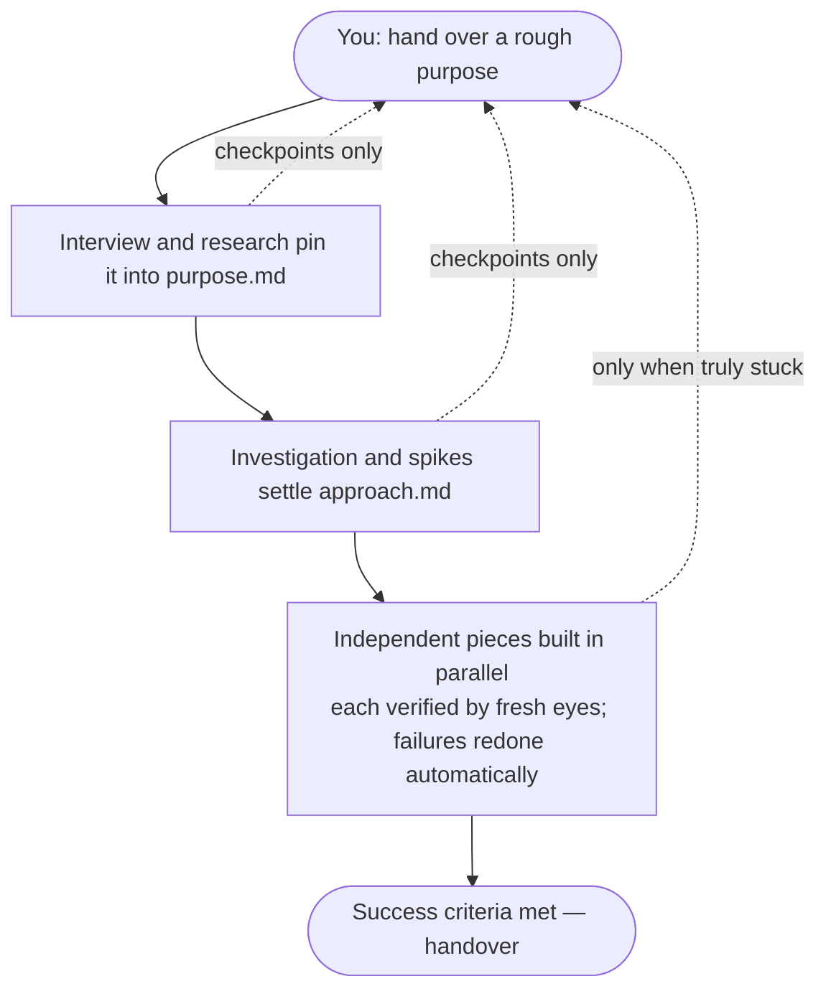

# aiya — Agents In Your Area

Hand a big job to an AI and the delegation turns into babysitting: peeking at progress, pulling it back on course, rebuilding when the context overflows — the bigger the job, the more your hands are needed. `aiya` is built the other way around. Give it one purpose, and it pins the purpose down through interview and research, settles on an approach, builds in parallel where work is independent, checks every piece with independent verification, and carries the job until the success criteria are met. You are called on at six checkpoints only — once a day on a multi-day job, a few minutes at the key moments on a one-day job. And what it builds is not limited to code: a competitive-research report, a proposal deck — anything you generate over time travels through the same checkpoints.

## Install

`aiya` ships from the `ccpm` marketplace. In Claude Code, add the marketplace once and install the plugin:

```console
> /plugin marketplace add lovaizu/ccpm
> /plugin install aiya@ccpm
```

This gives you `/aiya:on`, `/aiya:dn`, `/aiya:up`, and the two words you answer checkpoints with — `/aiya:ty` (approve) and `/aiya:gm` (send back).

## How it works



Before anything is built, the *why* and the *how* become documents, and you read them at the checkpoints. Once building starts, independent pieces are bundled and run at the same time, and every piece is checked by eyes other than the ones that made it. Failures are redone automatically — you are not called. Only when the same piece fails three times in a row does the decision come to you, with the failure history attached.

## Try it

The example: adding CSV export of transaction history to an expense-tracking app — a job of about five days.

### 1. Start — `/aiya:on`

A rough purpose is fine.

```console
> /aiya:on I want to export the expense tracker's transactions as CSV

● ── csv-export: make transaction history exportable as CSV ──
  👉 Confirm the plan for pinning down the purpose ── interview → 2 investigations at once (demand inventory ∥ data survey) → draft purpose.md
  ⬜ Approach / Delivery
  If this looks right, /aiya:ty — the interview starts immediately
```

Reply `/aiya:ty`, and you get asked first.

```console
● Just three questions.
  1. Who is exporting, and what for — to look back yourself? To hand to someone?
  2. What does "done" mean — viewing on screen, or opening cleanly in Excel?
  3. Anything that must never be exported — private memo fields, say?

> For tax filing — handing it to my accountant. It must open in Excel as-is. The memo field must never be exported.

● Thank you. Running 2 investigations at once — demand inventory ∥ data survey
  (purpose.md will be drafted to the PR when they finish)
```

A little later, the first big checkpoint arrives. Your words and the research findings have become a document with success criteria.

```console
● ── csv-export ──
  ✅ Plan confirmed
  👉 G1: approve purpose.md ── review it on the PR
     4 success criteria — e.g. "opens in Excel without garbled text", "memo field absent from output — full-row scan finds 0"
  ⬜ Approach / Delivery
```

> The format and a worked example of the purpose.md you read here are in [references/purpose.md](references/purpose.md) — including what each chapter is for.

These criteria become the yardstick for everything verified afterward. To adjust, just reply with one line: `/aiya:gm last 3 years of data is enough`.

### 2. The approach settles

Approve with `/aiya:ty`, and the next stop arrives at once — the plan for settling the approach.

```console
● 👉 Confirm the plan for settling the approach ── 3 investigations, 2 bundled
  If this looks right, /aiya:ty
```

After your `/aiya:ty`, the investigations that decide the approach run. Again, you just wait.

```console
● Settling the approach. 3 investigations (2 at once):
  data-volume measurement ∥ encoding behavior in real Excel / streaming-write spike
  → approach.md will be drafted and shown at G2

● 👉 G2: approve approach.md ── encoding is UTF-8 with BOM, output is streamed.
     Rejected options (Shift_JIS, full in-memory build) and the reasons are on the PR
```

> The approach.md format is in [references/approach.md](references/approach.md) — including why rejected options are written down.

### 3. It gets built

Reply `/aiya:ty` and the delivery plan appears. Pieces with no dependency on each other are bundled and run at the same time.

```console
● Split the delivery into 5 items. Bundled by dependency, 3 waves:
  Wave 1  #1 query & streaming base ∥ #2 CSV serialization & encoding ∥ #3 download UI
  Wave 2  #4 export API (after #1 #2)
  Wave 3  #5 integration & full-criteria verification (after #3 #4)
  👉 If this works, /aiya:ty
```

> The plan format is in [references/plan.md](references/plan.md) — whether items may be bundled is decided by their consumes lines — plus one guard: two items that write the same file are never bundled.

Approve it, and nothing stops until the success criteria are met. Progress is always visible like this:

```console
● ── csv-export ──
  ✅ Wave 1  #1 #2 #3 ── done
  👉 Wave 2  #4 running
             #4 failed verification → sent back for attempt 2 (month-end boundary transaction missing; criterion "count and amount reconcile")
  ⬜ Wave 3  #5
```

Failures and redos are things you are told about after the fact — your hands are not needed. Only when the same item fails three straight times does the decision come to you, failure record attached.

The final checkpoint is the very success criteria you approved at the start.

```console
● 👉 G3: success-criteria verification ── all 4 pass (evidence on the PR)
     count & amount reconcile ✓ / opens clean in real Excel ✓ / 120k rows in 21s ✓ / memo field: 0 hits ✓
  /aiya:ty completes the session
```

### 4. Pause and resume — `/aiya:dn` and `/aiya:up`

Multi-day work meets the end of a day. When the context is filling up, or you are done for today:

```console
> /aiya:dn

● Progress committed and pushed. Resume in a fresh conversation with /aiya:up
```

```console
> /aiya:up

● Resuming csv-export — Wave 2, #4, attempt 2
```

`on` happens once. After that it is **`dn` → `/clear` → `up`**, over and over, and the job runs unbroken until the criteria are met.

> Run `/clear` yourself after `/aiya:dn` — a plugin cannot clear your context for you.

## Two words

Every checkpoint takes the same two-word vocabulary:

- **`/aiya:ty`** — good, go ahead.
- **`/aiya:gm <one line>`** — not yet; change this. (`/aiya:gm` alone picks up your review comments on the PR.)

Six checkpoints, one way to answer. No room left to wonder how to reply.

## About the name

**aiya** is *Agents In Your Area* — the feel of hiring the builders down the street. Tell them the goal, and they come by to ask questions, show you the work plan, put a crew in at the same time, pass inspection, and hand it over. And yes — in Chinese, *aiya* (哎呀) is the little cry for when something goes sideways. We know. For a tool this relaxed, it fits.

Five command words, that's all:

- **`on`** — power on. Sit down, start.
- **`dn`** — down. Done for the day (not quitting — just setting it down).
- **`up`** — back up, from where it left off.
- **`ty`** — thank you. Approve.
- **`gm`** — gimme a change. Send back.

## aiya or rn

The same marketplace ships `rn`, a lighter sibling. As a rule of thumb: finished in hours → `rn`; a day or more → `aiya`. When unsure, ask two questions — is the purpose worth writing down? Could discoveries change the plan midway? One yes is enough for `aiya`. The five command words are shared, so switching between them costs nothing to relearn.

## Going deeper

What happens between the checkpoints — why long runs don't corrupt the context, and why the maker never checks its own work — is in [docs/design.md](docs/design.md), if you're curious. To just use aiya, you never need to read it.
