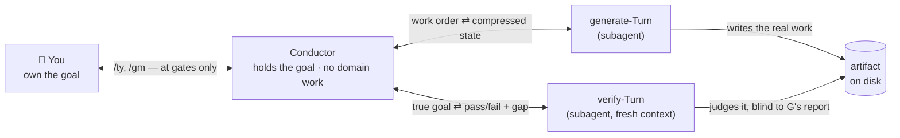

# aiya — Conductor

Hand it a goal, and it drives that goal to delivery through a chain of subagent Turns — checking in
with you only at a few gates along the way, never Turn by Turn.

An AI-agent build that fans out across many streams tends to fail one of two ways: the directing
agent's own working state grows with every stream until it collapses under its own context, or the
work quietly stops tracking the goal and the drift only surfaces at the end. aiya's answer is one
agent — the **Conductor** — that holds the goal, hands the actual work to subagents, and reads back
only a compressed, independently-verified account of what happened. You steer at a handful of phase
gates; the Step-by-Step grind in between is the Conductor's problem, not yours.

## How it works



The Conductor never opens `A` itself — its only reads are the compressed state a generate-Turn hands
back and the verdict a verify-Turn hands back. That wall is what keeps its context bounded no matter
how many Steps the goal takes.

## A walkthrough: adding a health-check endpoint

### 1. You write the goal, and approve it — G1

aiya never drafts `goal.md` — that one's on you, written before aiya is invoked at all:

```console
$ cat .aiya/health-check/goal.md
# Situation
The service has no way to report its own health; nothing pings it to check it's alive.

# Pain
On-call finds out the service is down from a user complaint, not a probe.

# Benefit
An orchestrator can detect and restart a dead instance automatically.

# Acceptance Scenarios
- Given the service is running, GET /health returns 200 {"status":"ok"}.
- Given the database is unreachable, GET /health returns 503 {"status":"degraded"}.
```

You approve it (G1), then hand aiya the goal:

```console
> conduct the build for health-check
```

### 2. The Conductor drafts the approach — gated at G2

It reads `goal.md`, drafts `approach.md` (Testing, Technology, Design), then posts a bounded summary
to the async-chat surface — Slack, or Claude Code Channels — and waits there. It does not touch a line
of code yet:

```console
● Approach ready — .aiya/health-check/approach.md — G2
  Testing:    unit test per Acceptance Scenario, plus a DB-down simulation
  Technology: existing Express router; no new dependency
  Design:     new GET /health route; a DB ping gates the 200/503 branch

  /ty to move to Delivery, /gm <feedback> to send it back
> /ty
```

### 3. The Conductor drafts the Steps — gated at planning IN

From the approved approach, it drafts `delivery.md`'s ordered Steps and gates again the same way:

```console
● Delivery plan ready — .aiya/health-check/delivery.md
  Step 1: implement GET /health with the 200/degraded branch and its tests

  /ty to start Step 1, /gm <feedback> to revise the Steps
> /ty
```

### 4. Step 1 runs: dispatch, verify, and a re-aim

The Conductor dispatches one generate-Turn with Step 1's intent and the relevant approach constraints.
That Turn writes the route and a test to disk, folds its own compression into the same Turn, and hands
back nothing but a path and a status:

```console
● Step 1 — generate-Turn done → .aiya/health-check/ccs/t001.yaml (implemented happy-path route)
```

The Conductor never reads that route itself. Instead it fans out one fresh, blind verify-Turn per
viewpoint — each of the two Acceptance Scenarios, plus the coding catalog's test-coverage and
error-handling checks — every one told only its one viewpoint, the true goal, `approach.md`'s path,
and the artifact's path, never the generate-Turn's own account of what it did:

```console
● Step 1 verify — 4 viewpoints
  ✓ Acceptance: 200 on healthy service
  ✗ Acceptance: 503 on DB-unreachable — route always returns 200, no DB check present
  ✓ Error handling — no swallowed errors on the happy path
  ✓ Test coverage — happy-path case is meaningful
```

One viewpoint failed, so the Step fails as a whole. Attempt 1 of 3 — the Conductor re-aims rather than
escalating: it redispatches Stage ① for the same Step, this time also handing the generate-Turn the
latest CCS and the failing viewpoint's gap as a corrective instruction.

```console
● Step 1 — re-aim, attempt 2/3 → .aiya/health-check/ccs/t002.yaml (added DB ping + 503 branch)

● Step 1 verify — 4 viewpoints
  ✓ Acceptance: 200 on healthy service
  ✓ Acceptance: 503 on DB-unreachable
  ✓ Error handling — DB-ping failure caught, not swallowed
  ✓ Test coverage — both branches covered
```

All four pass. `t002.yaml` is not built by patching `t001.yaml` — it's a fresh, whole replacement, and
it's the one the Conductor treats as its entire working memory of this Step from here on; `t001.yaml`
stays on disk as part of the CCS trail but is never read back into the running state. Had this hit
three failed attempts instead of resolving on the second, the Conductor would have stopped re-aiming
and escalated to you instead, carrying the gaps from all three attempts so you have evidence to judge
from.

### 5. Delivery closes — G3

Step 1 was the last Step, so its pass rolls straight into Delivery's Output Gate. The Conductor
confirms every Acceptance Scenario in `goal.md` is met and posts that confirmation the same way as any
other gate:

```console
● Delivery complete — .aiya/health-check — G3
  Both Acceptance Scenarios confirmed met by Step 1's verification.

  /ty to close, /gm <feedback> to reopen a Step
> /ty
```

That closes the goal. Coming back to an in-progress run — after a break, or to pick a Step back up —
works the same way: say "continue the aiya Conductor loop" or "resume the Step loop," and it re-reads
whichever phase document and CCS file are on disk and carries on from there, skipping any phase already
approved.

## What's on disk when it's done

Everything above lives under `.aiya/health-check/`: `goal.md`, `approach.md`, and `delivery.md` are the
three documents the gates above approved, in order; `ccs/t001.yaml`, `ccs/t002.yaml`, … is the trail of
compressed states one per generate-Turn, each a full replacement of the last, never an append; and
`research/` holds any investigation output a Turn produced along the way — never itself gate content.

## Why the blind verify-Turn, why the fresh CCS

Two rules carry the two things that go wrong at scale. A verify-Turn is told the *goal* — the
gate-approved document, never the Conductor's running state — and nothing about what the generate-Turn
claims it did, so a self-report that talks its way past a real gap can't launder itself through. And
the Conductor's own state never accumulates: it rewrites one CCS file per Turn from scratch and treats
that file, re-read fresh each Step, as its entire memory of the work so far — so the more Steps a goal
takes, the more the work grows, but the Conductor's own context does not.
