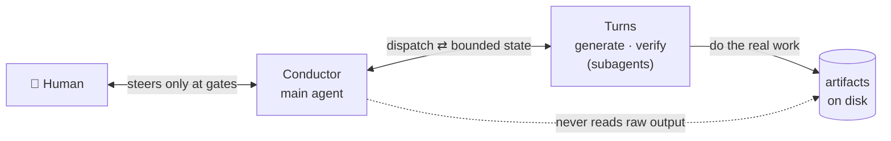
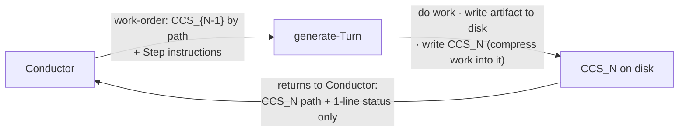
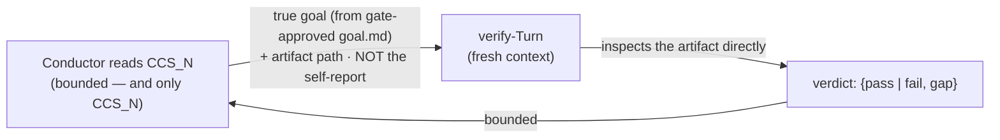
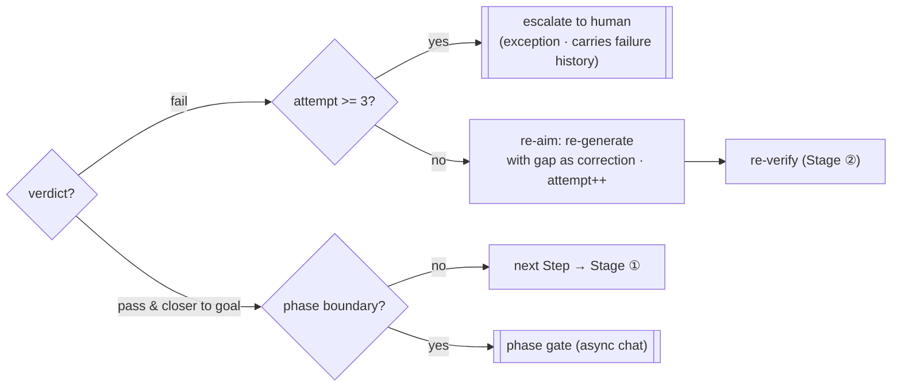

# aiya Conductor — design

The design of aiya: what it is, and the decisions behind it with their intent. It reads top to bottom
as requirements → approach → structure and flow → the details that matter → the decisions.

## 1. Requirements

aiya runs **one goal across many AI work-streams and keeps them converging on it**, so a person can
direct the work without watching every turn. One agent — the **Conductor** — holds the goal, hands the
domain work to subagents, and steers; the human steps in only at a few phase boundaries.

For that to scale, two properties must hold:

- **Bounded context.** The Conductor's working state must stay **bounded — sub-linear, not growing
  linearly — with the number of work-streams.** If it grew linearly, every added stream would cost more
  context and re-process old mistakes, and the whole point — directing many streams cheaply — collapses.
- **Drift detection.** The work must stay **traceable to the goal**, and deviation must be **caught**,
  not discovered at the end. Without this, many fast streams just drift fast.

Everything below exists to make these two hold **by structure**, under a prompt-driven loop with no
controller program.

**Why these two, concretely.** `rn` (this repo's quick coordinator) is the simplified version of the
same pattern — a coordinator dispatches subagents and steers — but with neither property it caps at
2–4 work-streams: the human must watch continuously, and quality depends on who was watching and what
they remembered to check. And bounded state is the only remedy that holds both requirements at once:
replaying the full transcript each Turn grows context linearly and replays early mistakes; retrieval
over history avoids the growth but drifts, because semantic-similarity search does not match what task
control actually needs.

## 2. Approach

The core idea, in one pass:

- The **Conductor** holds the goal and does **no domain work**. It dispatches each unit of work, reads a
  **compressed report** of what came back, measures the gap to the goal, and steers.
- A **Turn** is a subagent that does one unit of domain work. It writes its real output to disk and
  hands the Conductor only a **bounded state**, never its raw output.
- A separate **verify-Turn** measures whether the work actually got closer to the goal — judging the
  artifact against the goal directly, blind to the worker's own report.
- A **human steers at phase boundaries** (gates), redirecting the work rather than babysitting each Turn.

Two mechanisms make this work and are dissolved into the Conductor's procedure (not a program): a
**bounded state handed between Turns** (the CCS, §4.1), and a **traceability chain checked at gates**
(§4.4). The result is that the bounded, on-target path is the **default** path, and adherence is
**observable**.

## 3. Structure and flow

**The cast, at a glance.** Start with the whole picture — four actors and the two boundaries that make
the design work. The files and the step-by-step mechanics come next.



Two boundaries carry the whole design; the rest of this section just details them:

- **The human is outside the loop** — owns the goal and steers **only at gates** (`/ty`, `/gm`), not
  Turn by Turn. That sparseness lets one person direct many streams.
- **The Conductor is walled off from raw output** — its only intake is the bounded handoff (the CCS plus
  the verify verdict); it never reads the artifact. The Turns do the heavy read/write on disk. That wall
  is what keeps the Conductor's context from growing.

**Parts:**

| Part | Role |
|---|---|
| **Conductor** | Holds the goal; dispatches Turns; reads only bounded handoffs; steers. Does no domain work. |
| **generate-Turn** | Does one unit of work; writes the artifact to disk; writes a fresh CCS. |
| **verify-Turn** | Fresh-context check of the artifact against the goal; returns a bounded verdict. |
| **CCS** | The bounded state handed Turn-to-Turn — the only bridge the Conductor reads (§4.1). |
| **phase gate** | A boundary where the human approves or redirects (§4.4). |

**Invariant — 1 Step = 1 Turn.** A Step is counted by its one **work** (generate) Turn. The verify-Turn
that follows is a discarded measurement Turn whose context does not accumulate, so the count stays at one
work-Turn per Step **on the normal, passing path**; a failing Step re-dispatches the work-Turn via re-aim
(Stage ③ below), adding further work-Turns within that same Step, capped at 3 attempts total (§4.3).

**Invariant — Turns never nest.** Only the Conductor spawns; a Turn cannot itself spawn another
subagent. A unit too big for one Turn is split into **more flat Turns**, never nested ones. This is why
each Turn is dispatched dynamically — a work-order authored fresh per Turn via the subagent mechanism —
rather than through a static, pre-defined agent file: nesting would reopen the very accumulation the CCS
wall exists to prevent.

The loop runs in three stages. Each stands on its own:

**Stage ① — dispatch → generate + compress**



The Turn does the work, writes its artifact, and compresses it into a fresh `CCS_N`. **Compression is
folded into this same Turn** — not a separate Turn — and only the `CCS_N` path plus a one-line status
returns.

**Stage ② — read → verify**



The Conductor reads only the bounded CCS, then dispatches an **independent** verify-Turn that inspects
the artifact directly and is blind to the worker's self-report.

**Stage ③ — advance / re-aim / gate**



On `pass` the Conductor advances (to the next Step, or to the gate at a phase boundary). On `fail` it
**re-aims** — re-generates with the gap as a corrective instruction — capped at **3 attempts**, then
escalates rather than spinning.

## 4. Details

### 4.1 CCS format

The **CCS (Compressed Cognitive State)** is the bounded state handed between Turns — the only bridge the
Conductor reads. It is one file per Turn at `.aiya/<issue>/ccs/tNNN.yaml` (`t001.yaml`, `t002.yaml`, …)
under **replacement semantics**: a fresh file each Turn, never accumulated.

It is written in **YAML**: nine fixed components, each a list of `type: contents` entries. The state is
exactly named components holding bulleted items, which is what YAML expresses natively — so no notation
is invented. Every LLM writes YAML fluently (it is authored every Turn), it stays compact, it is
greppable, and — being real YAML — it also **parses** with any tool, which the retrospective and
backtrack reads rely on (see below). The one authoring rule: quote a value that contains a `:`.

The nine components:

| Component | Role |
|---|---|
| `episodic_trace` | What just happened in the previous Turn |
| `semantic_gist` | What we are fundamentally doing |
| `focal_entities` | What we are working on |
| `relational_map` | How they relate to each other |
| `goal_orientation` | What the end goal is |
| `constraints` | What must not be done |
| `predictive_cue` | What to do next |
| `uncertainty_signal` | What is still uncertain |
| `retrieved_artifacts` | Where information came from |

`type` is a small per-component vocabulary — a **starting set, extensible, not frozen** (constrained so
writing stays stable and readers interpret consistently):

| Component | `type` means | Starting types |
|---|---|---|
| `episodic_trace` | Kind of action | `observed`, `executed`, `received`, `completed`, `failed`, `logged`, `constraint` |
| `semantic_gist` | Purpose of the work | `implement`, `fix`, `investigate`, `refactor`, `migrate`, `diagnose`, `mitigate` |
| `focal_entities` | Kind of target | `file`, `function`, `class`, `interface`, `service`, `api`, `table`, `host`, `feature`, `signal` |
| `relational_map` | Kind of relationship | `depends`, `calls`, `implements`, `extends`, `before`, `after`, `timing`, `possible` |
| `goal_orientation` | Kind of outcome | `achieve`, `ensure`, `complete`, `deliver`, `verify`, `reduce`, `preserve` |
| `constraints` | Kind of constraint | `must`, `must_not`, `prefer`, `avoid`, `follow`, `no_restart`, `reload_allowed`, `safe_change` |
| `predictive_cue` | Kind of next action | `next`, `verify`, `generate`, `check`, `test`, `review`, `validate` |
| `uncertainty_signal` | Kind of uncertainty | `level`, `gap`, `assumption`, `pending`, `unverified` |
| `retrieved_artifacts` | Kind of reference | `doc`, `code`, `log`, `config`, `spec`, `guide`, `snippet` |

Example:

```yaml
episodic_trace:
  - executed: wrote design.md §1–4
  - observed: "verify-Turn pass, gap=0"
semantic_gist:
  - implement: prompt-driven Conductor design
focal_entities:
  - file: aiya/docs/design.md
goal_orientation:
  - deliver: "pure design: requirements to decisions"
retrieved_artifacts:
  - doc: .aiya/123/goal.md
```

Four rules keep the CCS bounded:

1. **Artifacts by path, never inlined.** No source, transcript, or full log is pasted into a CCS — it is
   referenced under `retrieved_artifacts` by path. This is grep-checkable.
2. **Stated size budget (soft cap).** Each CCS has a soft cap; exceeding it is a **health signal**, not a
   license to grow — re-scope or split the Turn (a CCS bloats when the Turn's scope is too broad). A list
   that grows monotonically across Turns (e.g. "items so far") is a property of the artifact: carry a
   **count or a by-path reference**, never enumerate the growing list inside the CCS. So the CCS is
   bounded and sub-linear, not byte-constant.
3. **The Conductor's only per-Step intake is the latest CCS file + the verify verdict** — both bounded.
   Its working state **is** the latest CCS; it re-reads that each Step and keeps no growing running
   summary of its own.
4. **The Conductor never reads artifact files.** Its only Reads are `ccs/tNNN.yaml` and the bounded
   verdict — so raw work cannot enter its context by either the push channel (what a Turn returns) or a
   pull channel (opening a file).

**Reading the symptom.** Which component bloats says what is wrong with the Turn's scope:

| Symptom | Likely cause | Remedy |
|---|---|---|
| Too many `focal_entities` | The Turn's scope is too broad | Split the Turn |
| `relational_map` tangled | Too many relationships handled in one pass | Narrow the scope |
| `uncertainty_signal` piling up | Too much was left unresolved | Insert a Turn whose job is to resolve it |

**Retrospective and extraction.** The CCS chain is not write-once: a retrospective (measuring context
size and gap over a run) or a backtrack (a `/gm` redirect, an escalation) reads back across
`ccs/t*.yaml`. An LLM reads it natively, and because it is real YAML it also **parses** — `yq` pulls any
field across the chain (e.g. the `uncertainty_signal` gap trajectory), `wc -c` tracks size. No regex or
one-off converter is needed.

### 4.2 verify-Turn

The verify-Turn runs in a **fresh context** and is told only the **true goal / Step intent + the
artifact path** — never the generator's self-report — so it cannot be fooled by a laundered claim. It
inspects the artifact directly and returns a bounded verdict `{pass | fail, gap}`.

**What it checks.** Three targets, in priority order: the goal itself, the approach's spec, and any
stated rules (e.g. coverage). Mechanical checks carry as much of this as they can; an LLM judgment is
only the thin last layer for what a mechanical check cannot decide. Where the goal names a concrete
outcome, verification **simulates** it — the artifact is actually run against scenarios drawn from the
goal's Acceptance Scenarios, fixed *before* generation (test-first) — rather than judged on whether it
"looks right".

**Goal provenance.** The "true goal" handed to it comes from the **immutable, gate-approved goal
artifact** (the phase's `goal.md`, or the Step intent fixed at its gate), **not** from the mutable
running CCS. Checking against a drifted CCS would measure against a corrupted yardstick; reading the
yardstick from the fixed gate output is what closes that path.

**Boundedness.** The verify-Turn does read the full artifact, but it is a **discarded single-shot Turn**
— only its bounded verdict returns, and its context does not accumulate across Steps. An artifact too
large for one verify-Turn is the same "scope too broad" signal: split the Step, do not grow the verifier.

### 4.3 re-aim and escalation

On `fail`, the Conductor re-generates with the gap as a corrective instruction, then re-verifies. The
loop is **capped at 3 attempts per Step**; on exceeding the cap it **escalates to the human** rather than
spinning. The cap counter lives in the Conductor's bounded state.

Escalation is an **exception interrupt, not one of the gates** — a rare, unplanned human touch that fires
only when a Step is genuinely stuck. Its payload carries the **failure history** (the ≤3 attempt gaps),
so the human adjudicates with the evidence of *why* it failed. Within a Step a re-aim loop adds at most 3
bounded verdicts plus the ≤3-gap log; this is capped and resets at the next Step, so across-Turn
boundedness (rule 3) still holds.

### 4.4 phase gates

The traceability chain links the work from intent to execution across **three phases**, and the human
steers at the boundaries. Each phase answers one question; when a link breaks, the process stops.

| Phase | What it answers | Authored document |
|---|---|---|
| **Goal** | What are we achieving, and how do we know when we have? | `goal.md` — Situation, Pain, Benefit, Acceptance Scenarios |
| **Approach** | How will we achieve it? | `approach.md` — Testing, Technology, Design |
| **Delivery** | In what order do we execute? | `delivery.md` — Steps |

**6 fixed touchpoints** = these 3 phases × **{Planning Gate IN, Output Gate OUT}**:

| Phase | Planning Gate (IN) | Output Gate (OUT) |
|---|---|---|
| **Goal** | Plan reviewed before research and drafting | **G1** — `goal.md` approved |
| **Approach** | Plan reviewed before technical investigation | **G2** — `approach.md` approved |
| **Delivery** | Steps reviewed before implementation | **G3** — Verification confirms the Acceptance Scenarios are met |

**Who drafts each phase (working hypothesis).**

| Phase | Drafted by | Confirmed at |
|---|---|---|
| Goal | The human — they hold the situation and pain firsthand | G1 |
| Approach | The Conductor, human-reviewed | G2 |
| Delivery | The Conductor, generated from the approved Approach | G3 |

**Storage layout.** The phase documents and the CCS chain share one directory per unit of work:

```
.aiya/<issue>/
  goal.md       # Situation, Pain, Benefit, Acceptance Scenarios
  approach.md   # Testing, Technology, Design
  delivery.md   # Steps
  ccs/          # CCS files, one per Turn — t001.yaml, t002.yaml, …
  research/     # intermediate investigation/spike outputs — not gated, not gate content
```

**Feeding the chain into the CCS.** Phase content lands in specific CCS components: Goal-phase content
flows into `goal_orientation`, Approach-phase constraints flow into `constraints`, and the phase
documents themselves are referenced by path under `retrieved_artifacts`. The phase gates decide **what**
to build and whether it got there; the CCS decides **how** state is carried while building it — the two
stay orthogonal.

- **Surface.** Existing **async chat** (Slack / Claude Code Channels) — no dedicated UI.
- **At a gate** the Conductor pauses, posts a bounded summary, and waits: it proceeds on `/ty` (approve)
  and re-aims on `/gm` (redirect with feedback). The human **redirects** the work, not merely approves.
- **Sparse by design.** In the normal run the human steers **only at these 6 gates**; between them the
  Conductor self-steers at the Turn level (§3 Stage ③). That sparseness — 6 boundary decisions instead
  of per-turn watching — is the scaling lever.

## 5. Decisions

- **Prompt-driven, no script holds the loop.** The Conductor is the main agent running this procedure as
  imperative Markdown; the cycle, the cap, the CCS contract, and the gates are all carried by procedure
  prose and the narrow subagent return channel. *Intent:* this is aiya's target form, and it avoids
  depending on a controller program.
- **1 Step = 1 Turn; compression folded into the generate-Turn.** Compression is not a separate Turn.
  *Intent:* independence is needed for *verification*, not for *compression* — the Conductor only ever
  reads the bounded CCS regardless of who wrote it, so a separate compression Turn would only add cost.
- **CCS is YAML.** The state is named components each holding a list of items — exactly YAML's shape, so
  no notation is invented. *Intent:* YAML is written fluently by every LLM (it is authored each Turn),
  stays compact, is greppable, and parses with standard tools for the retrospective/backtrack reads. TOON
  would be marginally denser but only pays off on uniform tabular arrays (which the CCS is not) and is
  written less reliably; a bespoke `type(contents)` notation buys no real density over YAML while losing
  its parseability — so neither is worth it.
- **The bounded path is the default, and adherence is observable** (§2), through three mechanisms of
  different strength — not all equally enforced. The **subagent return contract** is structural by
  construction: a Turn's return channel carries only the CCS path + status, so raw output cannot cross
  the push channel regardless of Turn behavior. The Conductor's **read-restriction** (§4.1 rule 4) is a
  stated procedural rule, not a technical block — the Conductor is instructed never to open an artifact
  file, and following that instruction is what keeps the pull channel closed. The **CCS size budget and
  grep invariant** (§4.1 rules 1–2) is a bounding convention: exceeding the soft cap is a visible health
  signal, not a hard stop. *Intent:* make the default path cheap to follow and any drift from it cheap to
  notice, without claiming an enforcement mechanism the design does not have.
