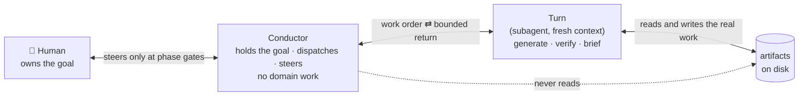
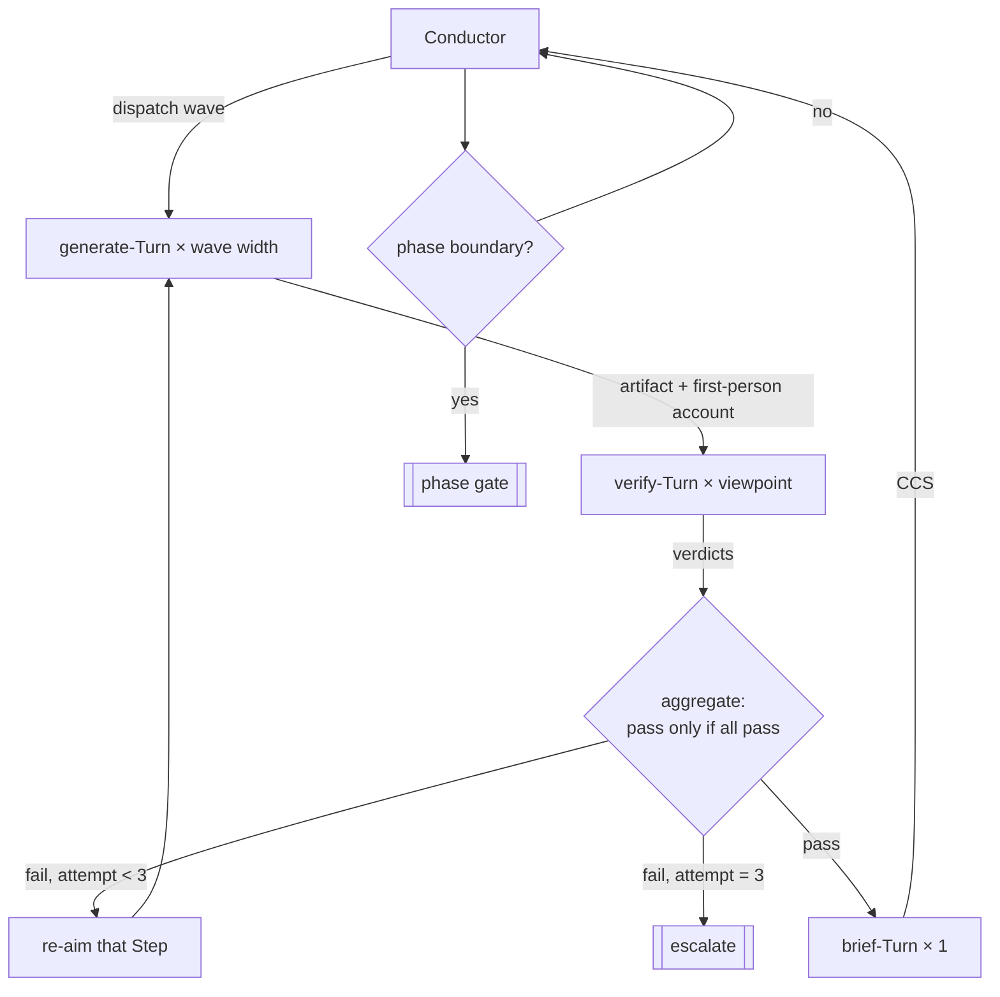

# aiya Conductor — design

The design of aiya: what it is, and the decisions behind it with their intent. The h2 sections are the
canonical design-document sections; under each, the h3 headings are the questions that section must
answer — a section is done when its questions are.

## 1. Background & Goals

### 1.1 What is the goal?

Raise an expert's productivity **by an order of magnitude** through AI agents — one person delivering
what used to take a team.

### 1.2 What goes wrong without this?

An AI-agent attempt at that scale runs into two failure modes:

- **Context bloat.** The directing agent's working state grows linearly with the work: every added
  stream costs more context and re-processes old mistakes, and the whole point — directing many streams
  cheaply — collapses.
- **Drift.** The work stops tracking the goal, and the deviation is discovered at the end instead of
  caught in flight — many fast streams just drift fast.

### 1.3 What does reaching it require?

aiya's hypothesis is that the jump comes from running **one goal across many AI work-streams and keeping
them converging on it**, which holds only if:

- the work **always tracks the goal** — many fast streams are worthless if they converge on the wrong
  thing;
- the human is **freed from babysitting** — directing the work, not watching every turn;
- human–AI coordination happens at **a few gates**, not continuously.

So one agent — the **Conductor** — holds the goal, hands every unit of work to subagents, and steers;
the human steps in only at phase boundaries. For that to survive §1.2's failure modes, two properties
must hold:

- **Bounded context.** The Conductor's working state stays **bounded — sub-linear, not growing linearly
  — with the number of work-streams.**
- **Drift detection.** The work stays **traceable to the goal**, and deviation is **caught**, not
  discovered at the end.

Everything below exists to make these two hold **by structure**, under a prompt-driven loop with no
controller program.

### 1.4 What is out of scope?

- **Measuring the 10× itself.** The order-of-magnitude goal directs the design; what the design is
  verified against is the two properties above, not a productivity measurement. (The loop's *own*
  efficiency is measured — §4.7 — which is a different quantity.)
- **A general-purpose orchestrator.** aiya conducts goal-directed work through one cycle; it is not a
  framework for arbitrary multi-agent topologies.
- **Cross-goal scheduling.** One unit of work, one goal, one Conductor. Running several goals at once is
  the human's business, not aiya's.

## 2. Assumptions & Constraints

### 2.1 What do we take as true?

- **The platform provides the walls.** A subagent starts from a fresh context, and the only thing that
  crosses back to its spawner is what it returns. The design's boundaries are built out of these two
  facts, not invented.
- **LLM competence at the three work-order skills.** A model can do a unit of domain work and report
  what it tried; judge an artifact against a goal handed to it cold; and reconcile several accounts of
  the same work into one fixed-shape state. Every Turn exercises exactly one of the three.
- **Investigation is a first-class kind of work.** Eliciting an ambiguous intent, surveying an existing
  system, or spiking a technology is work with a product, not a preamble to work.

### 2.2 What binds the solution?

- **No controller program.** Self-imposed (§5.1): the loop is carried by procedure prose. The consequence
  binds everything below — with no technical enforcement layer, a rule can at most be **default and
  observable**, never guaranteed.
- **Finite context.** The Conductor lives in one context window; anything that grows per-Turn eventually
  evicts what matters. This is what makes bounded a hard requirement, not a preference.
- **Existing surfaces only.** Human touchpoints ride existing async chat (§4.6); no dedicated UI is built.

## 3. Design overview

### 3.1 What is the core idea, and why does it solve the problem?

**Two roles, and two walls.** The Conductor holds the goal and steers but never touches the work;
Turns touch the work but never hold the goal. The human steers only at phase boundaries.


```mermaid
flowchart LR
    H["👤 Human<br/>owns the goal"]
    C["Conductor<br/>holds the goal · dispatches · steers<br/>no domain work"]
    T["Turn<br/>(subagent, fresh context)<br/>generate · verify · brief"]
    A[("artifacts<br/>on disk")]

    H <-->|"steers only at phase gates"| C
    C <-->|"work order ⇄ bounded return"| T
    T <-->|"reads and writes the real work"| A
    C -. "never reads" .-> A
```

- The **Conductor** holds the goal, decomposes it into Steps, dispatches every unit of work, aggregates
  bounded returns, and steers. It produces plans and decisions — never a work product.
- A **Turn** is a subagent spawned fresh for one work order. It touches artifacts on disk and returns
  only something bounded. Three work orders exist: **generate** (do the work), **verify** (judge it),
  **brief** (write the state the next Turn starts from).
- The **human** owns the goal and redirects at phase gates rather than babysitting each Turn.

Two mechanisms make this answer §1.3's two properties, and both are dissolved into procedure rather
than a program: a **bounded state handed between Steps** (the CCS, §4.2) answers bounded context, and
**independent verification against a fixed yardstick** (§4.3) answers drift detection. The result is
that the bounded, on-target path is the **default** path, and adherence is **observable**.

### 3.2 What are the pieces, and what is each responsible for?

| Part | Role |
|---|---|
| **Human** | Owns the goal; steers only at phase gates (`/ty` approve, `/gm` redirect). |
| **Conductor** | Holds the goal; drafts each phase's plan; dispatches Turns; aggregates verdicts mechanically; advances, re-aims, escalates, and gates. Reads only bounded returns. Does no domain work. |
| **Turn** | One work order, fresh context, direct child of the Conductor. Touches artifacts; returns bounded. Never spawns another Turn. |
| ↳ **generate** | Does one Step's work; writes the artifact; returns a short first-person account of what it did, tried, and is unsure of. |
| ↳ **verify** | Judges the artifact against one viewpoint, blind to the generator's account; returns `{pass \| fail, gap}`. |
| ↳ **brief** | Reads the artifacts, the fixed yardstick, the verdicts and the generators' accounts; writes the one CCS the next Step starts from. |
| **artifact** | The real work product on disk. Written by generate; read by verify and brief; never by the Conductor. |
| **CCS** | The bounded state carried between Steps — the only working state the Conductor holds (§4.2). |
| **phase gate** | A boundary where the human approves or redirects (§4.6). |

**Invariant — the Conductor never touches an artifact.** Its only reads are the latest CCS, the bounded
verdicts, and the phase documents. This wall is what keeps its context from growing with the work.

**Invariant — Turns never nest.** Only the Conductor spawns. A unit too big for one Turn is split into
**more flat Turns**, never nested ones; this is why each Turn is a work order authored fresh rather than
a static agent file. Nesting would put work outside the Conductor's view, where neither the attempt cap
nor the bounded-return contract reaches.

**Invariant — one Step, one generate-Turn.** A Step is counted by its work Turn. The verify-Turns and
the brief-Turn around it are bounded, discarded measurement and bookkeeping. A failing Step adds further
work Turns through re-aim, capped at 3 attempts (§4.5).

### 3.3 How does work move?

Every phase moves the same way. The Conductor drafts that phase's plan — the Steps and their
dependencies — the human reviews it at the Planning Gate, the Steps run, and the phase's product goes to
the Output Gate. What changes between phases is only the product and the yardstick (§4.6).

Steps with no unmet dependency form a **wave** and may be dispatched together; a wave of one is the
sequential case. Each wave runs the same three hops:


```mermaid
flowchart TD
    C["Conductor"] -->|"dispatch wave"| G["generate-Turn × wave width"]
    G -->|"artifact + first-person account"| V["verify-Turn × viewpoint"]
    V -->|"verdicts"| AGG{"aggregate:<br/>pass only if all pass"}
    AGG -->|"fail, attempt &lt; 3"| RA["re-aim that Step"]
    RA --> G
    AGG -->|"fail, attempt = 3"| ESC[["escalate"]]
    AGG -->|"pass"| BR["brief-Turn × 1"]
    BR -->|"CCS"| C
    C --> B{"phase boundary?"}
    B -->|"no"| C
    B -->|"yes"| GATE[["phase gate"]]
```

**Generate.** One generate-Turn per Step in the wave. Each writes its artifact to disk and returns a
short first-person account — never raw output.

**Verify.** One flat verify-Turn per viewpoint per Step, all direct children of the Conductor. The
Conductor aggregates the verdicts mechanically: a Step passes only if every viewpoint passes; on failure
the gap is the union of the failing viewpoints' gaps.

**Brief.** Once the wave has settled, **one** brief-Turn reconciles what actually happened — artifacts,
yardstick, verdicts, accounts — into a single CCS. This is what keeps the Conductor's intake at one
bounded state regardless of how wide the wave was.

**Steer.** The Conductor reads the CCS and decides: next wave, or the phase's gate. Re-aim and
escalation are decided earlier, on the aggregate, so a failing Step never leaves the wave.

## 4. Detailed design

One section per load-bearing contract, each answering the same pair of questions: what does the part
guarantee, and how is a breach caught?

### 4.1 What is the Turn contract, and how is a breach caught?

Everything below the Conductor is one thing — a Turn — under one contract. The three work orders differ
in what they are told and what they return, not in what they are.

Every Turn:

1. **Starts from a fresh context.** Nothing carries in except its work order.
2. **Is a direct child of the Conductor.** It never spawns.
3. **May touch artifacts freely.** It is the only thing that does.
4. **Returns something bounded.** A path plus a short account, a verdict, or a CCS path — never raw
   output, never a transcript.
5. **Is discarded.** Its context does not survive it; only its bounded return does.

**How a breach is caught.** Rules 1–2 are structural — the platform gives fresh contexts, and a work
order that spawns nothing cannot nest. Rule 4 is what the Conductor checks on every return, and a
violation is visible on sight: the return is either bounded or it is not.

### 4.2 What is the CCS's contract, and how is a breach caught?

The **CCS (Compressed Cognitive State)** is the bounded state carried between Steps — the Conductor's
working state, and the only thing a re-aimed or subsequent Turn inherits. One file per brief-Turn at
`.aiya/<issue>/ccs/tNNN.yaml` under **replacement semantics**: a fresh file each time, never appended.

**It is written by the brief-Turn, after verification.** Two consequences follow, and both are the point
of the design:

- **The state is third-person.** The party with a stake in the outcome does not write the record of it.
- **The state is post-verdict.** What a Step is actually worth is known only after it has been judged, so
  the state that carries forward includes that judgment. A re-aim therefore needs no second channel: the
  gap is already in the CCS, and the CCS alone is the corrective instruction.

**Format.** YAML: nine fixed components, each a list of `type: contents` entries. The state is named
components holding bulleted items, which is what YAML expresses natively — so no notation is invented.
Every LLM writes it fluently, it stays compact, it is greppable, and — being real YAML — it parses with
standard tools, which §4.7's reads rely on. The one authoring rule: quote a value containing a `:`.

| Component | Role | Sourced from |
|---|---|---|
| `episodic_trace` | What just happened | accounts + verdicts |
| `semantic_gist` | What we are fundamentally doing | phase documents |
| `focal_entities` | What we are working on | artifacts |
| `relational_map` | How they relate | artifacts |
| `goal_orientation` | What the end goal is | the phase's fixed yardstick |
| `constraints` | What must not be done | phase documents |
| `predictive_cue` | What to do next | plan + verdicts |
| `uncertainty_signal` | What is still uncertain | accounts + verdicts |
| `retrieved_artifacts` | Where information came from | paths |

The `Sourced from` column carries a rule: **components that can be observed are written from the
artifacts, not from what a generate-Turn said about them.** An account is used only where nothing else
can supply the answer — what was tried, what felt unresolved. Where the two conflict, the artifact wins.

`type` is a small per-component vocabulary — a starting set, extensible, not frozen:

| Component | `type` means | Starting types |
|---|---|---|
| `episodic_trace` | Kind of action | `observed`, `executed`, `received`, `completed`, `failed`, `reaim`, `logged` |
| `semantic_gist` | Purpose of the work | `implement`, `fix`, `investigate`, `elicit`, `survey`, `refactor`, `migrate` |
| `focal_entities` | Kind of target | `file`, `function`, `class`, `interface`, `service`, `api`, `table`, `host`, `feature`, `finding` |
| `relational_map` | Kind of relationship | `depends`, `calls`, `implements`, `extends`, `before`, `after`, `supports`, `contradicts` |
| `goal_orientation` | Kind of outcome | `achieve`, `ensure`, `complete`, `deliver`, `verify`, `reduce`, `preserve` |
| `constraints` | Kind of constraint | `must`, `must_not`, `prefer`, `avoid`, `follow` |
| `predictive_cue` | Kind of next action | `next`, `verify`, `generate`, `check`, `test`, `review` |
| `uncertainty_signal` | Kind of uncertainty | `level`, `gap`, `assumption`, `pending`, `unverified` |
| `retrieved_artifacts` | Kind of reference | `doc`, `code`, `log`, `config`, `spec`, `source` |

Example:

```yaml
episodic_trace:
  - executed: drafted the retry policy in §3 of approach.md
  - observed: "verify pass on 4 viewpoints, 1 gap closed on attempt 2"
  - reaim: "attempt 2 of 3 — first draft omitted the idempotency constraint"
semantic_gist:
  - investigate: whether the existing queue guarantees at-least-once
focal_entities:
  - file: .aiya/123/approach.md
  - finding: broker redelivers on ack timeout
goal_orientation:
  - ensure: no duplicate charge under redelivery
uncertainty_signal:
  - unverified: broker behaviour under partition — not reproduced
retrieved_artifacts:
  - doc: .aiya/123/goal.md
  - source: vendor docs §7.2
```

**Four rules keep it bounded:**

1. **Artifacts by path, never inlined.** No source, transcript, or full log is pasted in. Grep-checkable.
2. **Stated size budget (soft cap).** Exceeding it is a **health signal**, not a license to grow. A list
   that grows monotonically across Steps is a property of the artifact: carry a count or a path, never
   the enumeration. The CCS is bounded and sub-linear, not byte-constant.
3. **The Conductor's only intake is the latest CCS plus the bounded verdicts.** Its working state *is*
   the latest CCS; it keeps no running summary of its own.
4. **One CCS per wave, however wide the wave.** Convergence happens inside the brief-Turn, where reading
   several artifacts is allowed, so the Conductor's intake never scales with parallel width.

**How a breach is caught.** Rule 1 is grep-checkable; rule 2 is `wc -c` per file, and which component
bloats says what is wrong with the Step's scope:

| Symptom | Likely cause | Remedy |
|---|---|---|
| Too many `focal_entities` | The Step's scope is too broad | Split the Step |
| `relational_map` tangled | Too many relationships in one pass | Narrow the scope |
| `uncertainty_signal` piling up | Too much left unresolved | Insert a Step whose product is that resolution |

### 4.3 What is the verify-Turn's contract, and how is a breach caught?

A **viewpoint** is any independently-checkable concern — an acceptance scenario, a stated rule, or a
domain concern (for code: decomposition, naming, thread-safety, a leak). A Step dispatches **one flat
verify-Turn per viewpoint**, not one Turn checking everything: a verifier concentrating on one narrow
concern is less likely to miss it than one juggling several.

Each verify-Turn is told **only** its one viewpoint, the fixed yardstick, and the artifact's path — never
the generator's account and never the expected verdict, so a laundered claim cannot reach it. It returns
`{pass | fail, gap}` scoped to that viewpoint.

**Yardstick provenance.** The yardstick is always the **immutable, gate-approved document** for the
phase — never the running CCS. Checking against a state that may have drifted would measure against a
corrupted ruler; reading it from the fixed gate output is what closes that path.

**What it checks**, in priority order: the goal itself, the approach's spec, then any stated rules.
Mechanical checks carry as much as they can — running the artifact against acceptance scenarios fixed
*before* generation — and an LLM judgment is only the thin last layer for what a mechanical check cannot
decide.

**Verdict semantics differ by what the Step produces.** For a Step that builds something, `fail` means
wrong. For an investigation Step, nothing is wrong — evidence is merely insufficient, and `fail` means
the gap names what is still missing, so the re-aim digs further rather than rebuilds. The cap applies
either way: an investigation that cannot close its gap in three attempts is a question for the human.

**Aggregation** is mechanical: pass only if every viewpoint passes; on failure, the gap is the union of
the failing gaps. This is control flow over bounded verdicts, not inspection — the Conductor's wall holds.

**Boundedness.** A verify-Turn does read the whole artifact, but it is single-shot and discarded. An
artifact too large for one verify-Turn is the same scope signal: split the Step, do not grow the verifier.

### 4.4 What is the brief-Turn's contract, and how is a breach caught?

The brief-Turn's responsibility is **the state the next Turn starts from**. It is the only Turn that
works for a successor rather than for the goal, and the only one that sees the whole wave.

It is told: the wave's artifact paths, the phase's fixed yardstick, the aggregated verdicts, and the
generate-Turns' accounts. It returns one CCS path. It runs in a fresh context and has no stake in the
outcome it is recording.

It **judges, but only about facts**: which of two conflicting accounts the artifact supports, which
entities the next Step needs, what to leave declared as unresolved. It never judges direction — whether
the work is good is the verify-Turn's answer, and where to go next is the Conductor's.

**One per wave, never decomposed.** The verify-Turn splits per viewpoint because narrowing improves it;
the brief-Turn cannot split for the same reason inverted — a state assembled from partial views would be
missing exactly what makes it a state. Its guarantee is that after it runs, one file describes the wave
completely enough that nothing else needs to carry over.

**How a breach is caught.** The CCS it writes is checked against §4.2's four rules like any other; a
brief-Turn that inlined an artifact or blew the soft cap is caught the same way. A brief-Turn that
recorded something the artifact does not support is caught at the next verification, which reads the
artifact and not the CCS.

### 4.5 What is the re-aim path's contract, and how is a breach caught?

On an aggregate `fail`, the Conductor re-dispatches that Step's generate-Turn with the gap as the
corrective instruction, capped at **3 attempts per Step**; on exceeding the cap it **escalates** rather
than spinning. The cap is what catches a Step that would otherwise loop unboundedly.

Escalation is an **exception interrupt, not a gate** — rare, unplanned, and firing only when a Step is
genuinely stuck. Its payload carries the failure history (the ≤3 gaps), so the human adjudicates with
evidence of *why* it failed.

**Within a wave, a Step's re-aim is driven by its own bounded verdict**; the CCS is the state carried
*between* waves. In the sequential case the two coincide. The attempt counter lives in the Conductor's
bounded state for the current wave only and resets after it, so it does not accumulate.

### 4.6 What is the phase and gate contract, and how is a breach caught?

Three phases link intent to execution. Each has a **plan** (its Steps and their dependencies, drafted by
the Conductor) and a **product** (produced by Turns, never by the Conductor).

| Phase | What it answers | Product | Typical Steps |
|---|---|---|---|
| **Goal** | What are we achieving, and how will we know? | `goal.md` — Situation, Pain, Benefit, Acceptance Scenarios | elicit the human's intent until it is decidable; market and competitor research |
| **Approach** | How will we achieve it? | `approach.md` — Testing, Technology, Design | survey the existing system; investigate technologies; spike the risky part |
| **Delivery** | In what order do we execute? | the artifact itself | implementation |

**Steps exist in every phase.** Investigation is where an unbounded pile of reading yields a few lines
of understanding, and where nothing on disk remembers what was learned — so it is where compression and
independent checking pay most, not least. It is also where drift is cheapest to catch: a wrong Approach
misdirects every Delivery Step that follows it.

**The yardstick per phase.** Delivery is checked against `goal.md` and `approach.md`; Approach against
`goal.md`. The Goal phase has no prior document to be checked against, so it is checked on **evidential
soundness** instead: every claim carries a source, contradictions are surfaced rather than silently
resolved, what is unknown is declared unknown, and the acceptance scenarios are decidable as written.

**Ownership of `goal.md`.** The Conductor drafts it from what the human says and what the research Steps
find, but it is not the goal until the human approves it at G1. Elicitation is the Conductor's own
touchpoint at the chat surface — holding the goal includes asking for it — and is the one exchange no
Turn can run, because a Turn cannot talk to a person.

**6 fixed touchpoints** = 3 phases × {Planning Gate IN, Output Gate OUT}:

| Phase | Planning Gate (IN) — reviews the plan | Output Gate (OUT) — approves the product |
|---|---|---|
| **Goal** | the Steps that will produce the goal | **G1** — `goal.md` approved |
| **Approach** | the Steps that will produce the approach | **G2** — `approach.md` approved |
| **Delivery** | the Steps and their dependencies | **G3** — verification confirms the acceptance scenarios are met |

At every gate the Conductor pauses, posts a bounded summary on the existing async chat surface, and
waits: `/ty` approves, `/gm` redirects with feedback. The human **redirects** the work rather than
rubber-stamping it. Between gates the Conductor self-steers.

**Dependencies are declared, not implied.** In each plan, a Step records which prior Steps' products it
actually consumes. Order of writing is not a dependency. This is what the Planning Gate reviews, what
makes an over-coupled Step visible as a scope signal, and what makes waves decidable. Two Steps that
write the same artifact are dependent, whatever the plan says.

**Storage layout.** One directory per unit of work; one CCS chain across the whole run:

```
.aiya/<issue>/
  goal/       plan.md, goal.md
  approach/   plan.md, approach.md
  delivery/   plan.md
  ccs/        tNNN.yaml
  research/   investigation output referenced by path, never gate content
```

### 4.7 How is the loop's own cost observed?

The bounded path must also be the cheap one, and cheapness is not self-evident: every Step pays N
verify-Turns plus one brief-Turn, and every re-aim pays another round. Three ratios, all readable after a
run from the CCS chain and the verdict log, make that visible:

| Measure | Definition |
|---|---|
| **Keep rate** | Steps ÷ generate-Turns (Steps + re-aims). One-pass work is 100%. |
| **Escalation rate** | Steps stopped at the cap ÷ all Steps. |
| **Verification overhead** | verify-Turns + brief-Turns ÷ generate-Turns. |

These are readable because the brief-Turn records the attempt under `episodic_trace: reaim`; nothing else
is instrumented. As a starting heuristic — to be refined in use, not a measured rule — a keep rate below
50% means the loop is costing more than the work it saves, and the remedy is narrower Steps rather than
more attempts.

This measures the loop's efficiency, not the human's productivity, which stays out of scope (§1.4).

## 5. Alternatives considered

### 5.1 Why this shape, and not another?

- **Prompt-driven, no script holds the loop.** The Conductor is the main agent running this procedure as
  imperative prose; the cycle, the cap, the CCS contract and the gates are carried by the procedure and
  the narrow subagent return channel. *Intent:* this is aiya's target form, and it avoids depending on a
  controller program.
- **Bounded state handed between Steps — not transcript replay, not retrieval.** Replaying the transcript
  grows context linearly and replays early mistakes; retrieval over history avoids the growth but drifts,
  because semantic similarity is not what task control needs. *Intent:* a bounded state rewritten each
  time is the only remedy that answers both at once.
- **The CCS is written by an independent brief-Turn, after verification.** *Intent:* the state that
  carries forward is what actually happened, not what the party with a stake in it reported, and what
  actually happened is not known until the work has been judged. Writing it earlier or from inside the
  generate-Turn would mean the Conductor's whole picture of the run passes through the subject's own
  account, and would force the verdict into a second channel beside the CCS.
- **The brief-Turn is one, and the verify-Turn is many.** *Intent:* verification improves by narrowing —
  a Turn watching one concern misses less. State does not: a state assembled from partial views is
  missing the part that makes it a state. The two decompose oppositely because their guarantees are
  opposite.
- **Steps in every phase, not only Delivery.** *Intent:* investigation is work with a product, and it is
  the work with no artifact on disk to remember it — so it needs compression most. Making it a Step also
  makes it verifiable, which is what stops a misjudged Approach from misdirecting every Delivery Step
  after it. The alternative — the Conductor drafting the phase documents itself — would put domain work
  and its only witness inside the one agent that must stay clean of both.
- **The Conductor produces plans, never products.** *Intent:* the wall against reading artifacts is only
  credible if the Conductor never has a reason to; a Conductor that authors a document must read what it
  authored.
- **Waves, with declared dependencies.** *Intent:* parallelism is free only where independence is real,
  so independence is written down and reviewed rather than assumed. Because a wave converges at one
  brief-Turn, widening it does not widen the Conductor's intake — parallel width and bounded context stop
  being in tension.
- **CCS is YAML.** *Intent:* the state is named components holding lists, which is YAML's own shape, so
  nothing is invented; it is written fluently by every model, stays compact, greps, and parses with
  standard tools for §4.7's reads.
- **Default and observable, not enforced.** With no controller program, the return contract is structural
  by construction, the read-restriction is a stated rule, and the size budget is a convention whose breach
  is visible. *Intent:* make the default path cheap to follow and any departure cheap to notice, without
  claiming an enforcement mechanism the design does not have.

### 5.2 What did we trade away?

- **Guaranteed enforcement.** With no controller program, the Conductor's read-restriction and the CCS
  budget are default-and-observable, never technically blocked. That prompt adherence suffices is the bet.
- **Turn cost per Step.** Every Step pays N verify-Turns and, per wave, one brief-Turn — and a re-aim pays
  the round again. The independence that makes each verdict and the state trustworthy is bought with that
  overhead. §4.7 is what keeps the bill visible.
- **First-person fidelity.** A third-party record thins the lived detail of the work — what was nearly
  tried, what felt wrong. The generate-Turn's account is carried into the CCS to recover some of it, but
  it is second-hand by construction.
- **Correctness of declared independence.** A wave is only as safe as its dependency declaration; a
  missed dependency corrupts every Step in the wave at once rather than one Step at a time. This is the
  price of parallelism, and the reason dependencies are gate-reviewed rather than inferred.
- **Sequential gates.** The human is still a serial resource at six points. Sparse gates make that
  affordable; they do not remove it.
