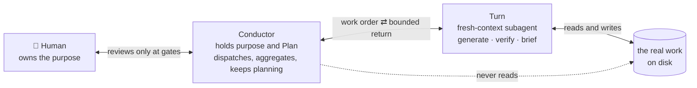
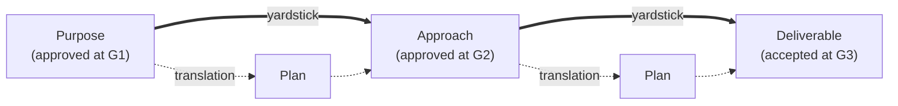
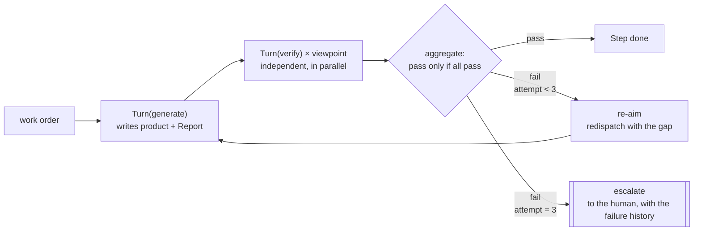

# aiya — Design

aiya is a design for running many AI agents under one purpose and keeping them converging on it. One conductor holds the purpose and the plan, ephemeral workers touch the real work, and the human steers only at six gates.

## 1. Problem — Big work turns into babysitting

**The goal is to raise one expert's productivity by an order of magnitude with AI agents** — delivering alone what used to take a team.

Delegate naively, and the bigger the job, the more human hands it takes. Delegation reliably breaks in two ways:

- **Context bloat.** The directing agent's working state grows in proportion to the work. Every added stream inflates the context, replays old mistakes, and collapses the whole point — directing many streams cheaply.
- **Drift.** The work stops tracking the purpose, and the deviation surfaces at the end instead of being caught in flight. Drift comes in two forms: doing work the purpose never asked for, and **completing the original plan while ignoring what was discovered along the way**. The more fast streams, the faster they stray.

So the design must guarantee exactly two properties:

- **Bounded context** — the conductor's working state stays bounded (sub-linear, not growing linearly) in the number of work streams.
- **Drift detection** — the work stays traceable to the purpose, and deviation is caught mid-flight, not at the end.

## 2. Core — The bet is on model progress

**The skeleton of the answer is borrowed.** A supervisor dispatches to isolated subagents and receives only bounded summaries — this shape is the 2026 industry standard, not aiya's invention. We adopt it as public foundation, and aiya stands three claims on top of it. The skeleton first.

**There are only two roles.** The **Conductor** holds the purpose and steers, but never touches the work. A **Turn** touches the work, but never holds the purpose. The human is neither — the owner of the purpose, appearing only at phase gates.


```mermaid
flowchart LR
    H["👤 Human<br/>owns the purpose"]
    C["Conductor<br/>holds purpose and Plan<br/>dispatches, aggregates, keeps planning"]
    T["Turn<br/>fresh-context subagent<br/>generate · verify · brief"]
    A[("the real work<br/>on disk")]

    H <-->|"reviews only at gates"| C
    C <-->|"work order ⇄ bounded return"| T
    T <-->|"reads and writes"| A
    C -. "never reads" .-> A
```

**There are two walls.**

- **The Conductor never touches the real work.** It reads only a bounded state that folds up the preceding work (**CCS**), judgments (**Verdict**), approved phase documents, and paths. It does not read even the contents of a worker's first-person report (**Report**). This wall is what keeps the Conductor's context from growing with the work — half the answer to bounded context.
- **Turns never nest.** Only the Conductor spawns. A Turn starts from a fresh context, returns something bounded, and is discarded. Nesting would place work outside the Conductor's sight, where neither the attempt cap nor the return contract can reach. The platform itself permits nesting by default — aiya's Turn definitions omit the spawn tool, so a Turn has nothing to spawn with.

The walls are built from platform facts: a subagent starts from a fresh context, and the only thing that reaches the caller is what it returns. These are not invented boundaries. No controller program is written — the loop is carried by procedural prose — so any rule that cannot be made structural is at best **default and observable** (cheapest to follow, and leaving a trace when broken), never guaranteed.

That is the borrowed skeleton. aiya stands on three claims above it.

**First, the bet is on model progress.** No controller program; judgment, steering, and the final layer of verification all sit with the LLM. The moment control is written into code, the system's ceiling is fixed at the understanding of the day the code was written — only the parts left to the LLM get smarter, with no rewrite, as models get smarter. The design's job is an allocation: maximize the part that inherits progress automatically, and shrink the part that doesn't into a minimal skeleton — walls and records. So 10× is not a static target: the aim is a shape that follows a ceiling that keeps rising as models improve, without being rewritten.

**Second, it has a mechanism for not straying.** The world's tools solved dispatch (orchestration). What aiya solves is steering — every judgment ties back, with a version, to yardsticks a human approved; discoveries reshape the plan; only doubts about the yardsticks themselves return to the human (the two-layer traceability chain). Precisely because progress is trusted, a structure that catches straying is the precondition. Fast streams without a mechanism against straying are a liability.

**Third, it carries the whole journey to the purpose.** Existing tools execute tasks. aiya carries everything from elicitation to acceptance — pinning down why, investigating how, generating, verifying — as one verifiable chain, treats investigation as first-class work, and reaches non-development generation in the same shape. Because the bet is made at the most general layer, the proof carries to everything built on top.

The two properties are answered by two mechanisms that implement these claims. For bounded context, the **CCS**. For drift detection, the **two-layer traceability chain**. Both are defined from the next chapter on.

## 3. Structure — What remains, and who owns it

### 3.1 Parts and vocabulary — Phase / Plan / Step / Turn

**Work proceeds in three Phases.** Purpose (why) → Approach (how) → Delivery (execution). Each Phase holds one **Plan** — its Steps and their dependencies — and a **Step** is one Plan item, whose work is carried by exactly one Turn(generate).

**Turns are one kind; work orders come in three types.** Turn(generate) makes, Turn(verify) judges, Turn(brief) writes the state the next work starts from. The three correspond one-to-one to the three skills assumed of an LLM — do a unit of domain work and report on it; judge with no prior context; consolidate several accounts into one fixed-shape state — and every Turn exercises exactly one. A work order is dispatched by passing minimal parameters (paths and a few lines of instruction) into one of three static definitions: the procedure is static, the content is parameters. Work too big for one Turn is split into more flat Turns, never nested ones.

**There are six gates.** Three phases × {review the Plan on the way in, review the product on the way out}. The human replies with two words — `/ty` (approve) and `/gm` (send back). Fix the vocabulary here: **machines verify (pass/fail against a fixed yardstick); humans review (approve or redirect — correcting direction)**. Humans do not verify — that is a Turn's job.

**Investigation is first-class work.** Eliciting a vague intent, surveying an existing system, spiking a technology — each is work with a product, not a preamble to work. This premise shapes everything that follows.

### 3.2 The chain — Immutable yardsticks and a living translation

**Every product sits on one chain.**


```mermaid
flowchart LR
    P["Purpose<br/>(approved at G1)"] ==>|"yardstick"| A["Approach<br/>(approved at G2)"] ==>|"yardstick"| D["Deliverable<br/>(accepted at G3)"]
    P -.->|"translation"| PA["Plan"] -.-> A
    A -.->|"translation"| PD["Plan"] -.-> D
```

The bold edges are the **immutable yardstick layer** — Purpose and Approach. From the moment a gate approves them they are immutable, and everything downstream is verified against them. Purpose fixes what success means; Approach is checked against it; the Deliverable is checked against both. The only path to changing them is sending back to a gate, and at the gate there is a human.

The dotted edges are the **adaptive translation layer** — each phase's Plan. It is the joint that translates yardsticks into executable Steps, and the translation is never finished: each time a Turn brings back a discovery, the Conductor re-translates from the current position, from zero.

This two-layer structure is the substance of drift detection. Every Step traces through its Plan to a yardstick, and every yardstick to the reason the work exists. Drift appears as "a Step that cannot be justified by the link above it," and when a link breaks — a product that no longer supports what it was derived from — the process stops at that phase's gate instead of carrying the break downstream.

### 3.3 Run records — An ephemeral lineage that moves the chain forward

Beside the chain, execution leaves records. **They never become yardsticks.**

| Record | What it is | Written by |
|---|---|---|
| **CCS** | The bounded state carried between Steps — the Conductor's working state itself | Turn(brief) |
| **Verdict** | One viewpoint's judgment: pass/fail with a gap, and evidence | Turn(verify), itself |
| **Report** | Turn(generate)'s first-person record: did / tried / unsure | Turn(generate) |
| **Research** | The product of an investigation Step, verified for evidential soundness | Turn(generate) |

### 3.4 The ownership ledger

**Who writes, who verifies, who reviews and owns** — listed for every product.

| Product | Written by | Verified by (machine) | Reviewed and owned by (human) |
|---|---|---|---|
| Plan ×3 | Conductor | Turn(verify) — aiya's fixed viewpoints | Human (Planning Gate) |
| Purpose | Turn(generate) | Turn(verify) — evidential soundness | Human (G1) |
| Approach | Turn(generate) | Turn(verify) — against Purpose | Human (G2) |
| Deliverable | Turn(generate) | Turn(verify) — Purpose + Approach + the Step's pass condition (done when) | Human (G3) |
| CCS | Turn(brief) | Mechanical rules + the next verification catches lies | — (consumed by the Conductor) |
| Verdict | Turn(verify) | — (it is itself the check; evidence keeps it falsifiable) | — (aggregated by the Conductor) |
| Report | Turn(generate) | — (Turn(brief) checks it against the product) | — |
| Research | Turn(generate) | Turn(verify) — evidential soundness | — (not subject to approval) |

The **reverse side** of responsibility — what each role is *not* responsible for:

| Role | Responsible for | Not responsible for |
|---|---|---|
| Human | Why (the Purpose) and direction; adjudicating escalations | How things are built; the running of the work |
| Conductor | Operation and adaptation — the Plan's quality and freshness, dispatch, mechanical aggregation, go/no-go, keeping the walls | The quality of the content (verify's measurements and human review carry that) |
| Turn(generate) | One Step's product and an honest Report | Judging itself |
| Turn(verify) | One viewpoint's Verdict and its evidence | Fixing, summarizing, overall quality |
| Turn(brief) | Fidelity of the state to the facts | Direction; judging quality |

### 3.5 Where things live

Logical names map to physical layout exactly once, here. One directory per unit of work:

```
.aiya/<issue>/
  purpose/    plan.md, purpose.md        # Plan(Purpose), Purpose
  approach/   plan.md, approach.md,      # Plan(Approach), Approach body
              decisions/                 # Decision — one file per decision (0 or more)
  delivery/   plan.md                    # Plan(Delivery); the Deliverable lives in the repository proper
  ccs/        tNNN.yaml                  # CCS chain (replacement semantics; one chain per run)
  verdicts/   one file per judgment      # Verdict; step, viewpoint and attempt readable from the filename
  reports/    one file per Turn          # Report; item number and attempt readable from the filename
  research/   investigation products     # Research, referenced by path
```

Formats and worked examples for every product are in references/ — Purpose / Approach / Decision / Plan / Report per unit of work, and UX / Design per product (Design being this document's own format).

## 4. Behavior — How work flows

### 4.1 The life of one Step

Count by **1 Step = 1 Turn(generate)**. The Turn(verify)s and Turn(brief) around it are ephemeral measurement and bookkeeping.


```mermaid
flowchart LR
    WO["work order"] --> G["Turn(generate)<br/>writes product + Report"]
    G --> V["Turn(verify) × viewpoint<br/>independent, in parallel"]
    V --> AGG{"aggregate:<br/>pass only if all pass"}
    AGG -->|"pass"| NEXT["Step done"]
    AGG -->|"fail<br/>attempt < 3"| RA["re-aim<br/>redispatch with the gap"]
    RA --> G
    AGG -->|"fail<br/>attempt = 3"| ESC[["escalate<br/>to the human, with the failure history"]]
```

**Turn(generate)** writes the product and a Report to disk and returns paths — never raw output. **Turn(verify)** runs one per viewpoint, told only the product's path and the fixed yardstick (never the Report, never the expected judgment — a polished claim cannot reach it), writes its Verdict to disk itself, and returns the same content. **Aggregation** is a mechanical AND — pass only if every viewpoint passes; on failure, the gap is the union of the failing gaps. A Turn whose return is missing is excluded from aggregation and **re-sent** — a Turn starts fresh and leaves no state, so re-sending is safe. That is accident handling, not a re-aim, and not an attempt.

**Re-aim, up to three times.** The same Step is redispatched with the gap as the corrective instruction. For a building Step, fail means wrong; for an investigation Step, nothing is wrong — evidence is merely insufficient, and re-aim digs further instead of rebuilding. A Step that will not close in three attempts **escalates** — not a gate but an exception interrupt: rare, unplanned, carrying the failure history (≤3 gaps) to the human for adjudication. The attempt counter resets once the Step settles — it does not accumulate.

**Re-verify is the second correction.** On noticing a missing viewpoint, add it to the Plan and redo only the verification — the product is untouched, so the attempt count does not grow; only when the new viewpoint fails does an ordinary re-aim begin.

### 4.2 Waves — Bundle and run together

**Steps with no unmet dependency form a wave and may be dispatched together.** A wave of width one is the sequential case. Waves have no file — they are a runtime fact derived each time from the Plan's consumes. The platform caps concurrently running Turns (20 by default); a wave wider than the cap is dispatched in slices as slots free up. Slicing changes throughput, not correctness — Turn(brief) still runs once per wave, after every Step has settled.

Progress is a **per-Step pipeline**. Each Step advances independently through generate → verify → (re-aim if needed); Step A's verify can run while Step B's generate runs. The wave does not march in lockstep.

Once every Step in the wave has settled, **one Turn(brief)** consolidates what actually happened — products, yardstick, Verdicts, Reports — into a single CCS. That is what keeps the Conductor's intake at one bounded state no matter how wide the wave: **parallel width and bounded context stop being in tension**.

### 4.3 Steering — The Conductor keeps planning

**The Conductor's first duty is to keep planning.** Dispatch and aggregation are merely its means. The goal is 10×, not completing the Plan — and completing while ignoring discoveries is a form of drift. The only party positioned to prevent it is the Conductor, standing where every Step's discoveries converge.

Each time a wave settles, the Conductor reads the CCS and asks three things, in order: **Are we closer to the purpose?** (position against the yardstick). **What was discovered?** (an inventory of facts). And **what is the shortest Plan from here?** — not amending the current Plan, but planning from zero out of the current position and the discoveries. If the fresh plan matches the current one, proceed; where it differs, the difference becomes the revision. A match means "re-planning produced the same plan," not "we judged no change necessary" — the moment the current Plan becomes the default and discoveries bear the burden of proof, steering degenerates into ritual. For the same reason the CCS is replaced rather than appended, **the Plan is steered by re-planning, not by diffs**. Then decide what is next — the next wave, or the phase's gate.

**Discretion has a line.** Re-planning may move all of the Plan — adding, removing, and splitting items, rewiring dependencies, reordering. **It does not touch Purpose or Approach**: when a discovery casts doubt on a yardstick itself (an approved technology turns out impossible, say), it is not absorbed into the Plan but sent back to a gate, up to the human.

**The steering verbs are finite.** Every response to what the CCS and Verdicts show falls into one of: Plan surgery (within the discretion above), re-aim (have it rebuilt), re-verify (have it re-measured), adding an investigation Step, sending back to a gate, re-sending a missing return. Any response that falls into none of these — above all, investigating by oneself — is a breach of the wall.

**Doubt splits in two.** When a result raises doubt, there are only two destinations: if the doubt **can be written as a viewpoint**, add it to the Plan's viewpoints and re-verify. If it is **an open question**, put an investigation Step on the Plan. A doubt that fits neither is merely not yet concrete — making it concrete is the Conductor's judgment work, and needs no tool.

Aggregation, too, has an attribution rule. **Aggregation that needs no reading of the real work** — the AND over Verdicts, deriving waves from consumes — is the Conductor's: that is control, not inspection. **Aggregation that must read the real work** — consolidating state (Turn(brief)), integrating artifacts (an ordinary Step) — belongs to Turns. The test is that single question: does it require reading?

### 4.4 Phases and gates — The human corrects course six times

Three phases connect intent to execution. Each phase has a Plan (drafted and re-planned by the Conductor) and a product (made by Turns — never by the Conductor).

| Phase | The question it answers | Product | Typical Steps |
|---|---|---|---|
| **Purpose** | Why are we doing this, and how will we know we got there? | Purpose — Situation, Pain, Benefit, Success Criteria | Elicit until the intent is decidable; market and competitor research |
| **Approach** | How will we get there? | Approach — Testing, Technology, Design | Survey the existing system; investigate technologies; spike the risky part |
| **Delivery** | In what order do we execute? | Deliverable — the working real thing | Implementation |

**Generation needs prerequisites.** Only when purpose, UX, design, and plan exist can a Turn build against something and be verified against something. If the project already has them, use them; if not, put Steps on the Plan to produce them — written in aiya's formats (references/) while running, with a conversion Step at the end of Delivery if the project demands its own format.

**Steps exist in every phase.** Investigation is where an unbounded pile of reading yields a few lines of understanding, and where nothing on disk remembers what was learned — so compression and independent checking pay most there, not least. It is also where drift is cheapest to catch: a wrong Approach misdirects every Delivery Step after it.

**The yardstick is fixed per phase.** Delivery is verified against Purpose and Approach; Approach against Purpose. Purpose has no prior document — it is the head of the chain — so it is verified for **evidential soundness** instead: every claim has a source, contradictions are surfaced rather than silently resolved, the unknown is declared unknown, and the success criteria are decidable as written. Research is verified by the same standard — "outside the gates" means not subject to human approval, not unexamined.

**Drafting the Purpose is divided.** Elicitation is the Conductor's own touchpoint at the chat surface — holding the purpose includes asking for it, and Turns do not talk to people: the user-question tool is excluded from all three Turn definitions. But the Conductor **does not draft**: answers are written to file on the spot (under research/ — never existing only in the Conductor's context), passed along with investigation findings as paths, and Turn(generate) drafts the Purpose. Whoever writes a document must read it, and the Conductor does neither. Until the human approves at G1, it is not the purpose.

**Gates: 3 phases × {in, out} = six.** G is short for Gate; only the outputs — later referenced as yardsticks — carry the numbers G1–G3:

| Phase | Planning Gate (in) — reviews the Plan | Output Gate (out) — reviews the product |
|---|---|---|
| **Purpose** | The Steps that will produce the Purpose | **G1** — Purpose approved |
| **Approach** | The Steps that will produce the Approach | **G2** — Approach approved |
| **Delivery** | The Steps and their dependencies | **G3** — verification confirms the success criteria; the human accepts |

At every gate the Conductor stops, posts a bounded summary in the console, points to the artifact on the PR, and waits — the summary is for deciding to look, the PR is where the document is actually read. The human corrects course rather than rubber-stamping. Between gates the Conductor self-runs within a dispatch round — re-planning included; across rounds the loop re-enters from file state (§4.5's resume point), which is why a stop between rounds loses nothing.

**Approvals carry versions.** A document re-approved after a `/gm` is a new version, and **Verdicts measured against the old version are invalidated** — the affected Steps are re-verified, and only a fail against the new yardstick triggers a re-aim. A Verdict records for itself which version it measured against, so finding the invalidated ones takes a grep.

### 4.5 Suspend and resume

**The latest CCS + the approved phase documents + the current Plan are the entire resume point.** A run suspended mid-way and reopened in a fresh conversation re-reads exactly what the next wave would have read, and continues. Resume is not a special case bolted on — it is the between-wave handoff exercised across a conversation boundary, which is why nothing extra is saved on stopping.

**What is bounded is the working state, not the history.** The Conductor's transcript grows with the number of Turns — filled-in work orders and bounded returns accumulate. The design can only minimize the coefficient (returns are paths and Verdicts only; Report contents never pass through), and the cycling is carried by `dn` → `/clear` → `up`. Because the resume point is complete in the three items above, `/clear` loses nothing — suspension is routine operation, not exception handling.

## 5. Rules — Each part's rules, and how breaches are caught

Per part: the rules, and how a breach is caught.

### 5.1 Turn — The common contract

Every Turn keeps five rules:

1. **Starts from a fresh context.** Nothing enters but the work order.
2. **Is a direct child of the Conductor.** It never spawns.
3. **May touch the real work freely.** Turns are the only ones that do.
4. **Returns something bounded.** Turn(generate): paths to product and Report plus one line of completion. Turn(verify): the Verdict. Turn(brief): the CCS path. Never raw output, never a transcript.
5. **Leaves no context behind.** Its context does not survive it — what remains is the bounded return and what it wrote to disk. Born for one job, returns, and is gone.

**Catching breaches.** Rule 1 is structural — fresh contexts come from the platform. Rule 2 is structural once made — the spawn tool is absent from every Turn definition, and a tool left out of a definition is not in the Turn's session at all. Rule 4 the Conductor checks on every return: it is bounded, or it is not.

### 5.2 Turn(generate) — Product and Report

Does one Step's work and writes the product and a Report to disk. The Report is Markdown with three fixed headings:

```markdown
## did    — what was done (including product paths)
## tried  — what was attempted and abandoned, and why
## unsure — what was left uncertain
```

It is never machine-processed (only Turn(brief) reads it), so it is not YAML. The three headings map to the CCS's sources, so Turn(brief) knows in advance where each part lands. **The Report is a file, and the Conductor carries only its path** — first-person content never passing through the Conductor's context makes the wall narrower still. Worked example: references/report.md.

### 5.3 Turn(verify) — Viewpoints and the Verdict

A **viewpoint** is one independently checkable concern. The defaults are two — the Step's done when, and the relevant criteria of the phase yardstick. Domain concerns beyond those — for code: decomposition, naming, thread safety, leaks; for documents: sources resolving, figures consistent, terminology uniform — come from what the Plan item declares. A Step dispatches **one flat Turn(verify) per viewpoint** — a verifier holding one narrow concern misses less than one juggling several.

It is told **only its one viewpoint, the fixed yardstick, and the product's path**. It writes the Verdict in YAML **to disk itself** and returns the same content — the record exists before the Conductor touches it, making judgment convenient to the conductor structurally impossible to fabricate:

```yaml
step: "#4"
viewpoint: count-and-amount reconciliation
attempt: 2
yardstick: .aiya/123/purpose/purpose.md@G1-v1
verdict: fail            # pass | fail
gap: transactions at 23:59 on month-end slip through the period-boundary comparison
evidence: tests/export_boundary — 1 of 5 patterns failing
```

`evidence` is mandatory — it keeps the gap's claim itself verifiable afterwards. `yardstick` pins which version was measured against — when a yardstick is revised, the invalidated Verdicts are found with a grep.

**The yardstick's provenance is fixed.** Always the phase's immutable, gate-approved document — never the running CCS, never the moving Plan. Measuring against a state that may have drifted is measuring with a warped ruler.

**Mechanical checks first; the LLM is the thin last layer.** The product is actually run against success criteria fixed before generation. Success criteria are therefore written to be runnable — a criterion no mechanical check could ever decide is not yet finished being written.

**Boundedness.** Turn(verify) reads the whole product, but is single-shot and leaves no context behind. A product too large for one verifier is the same scope signal: split the Step; do not grow the verifier.

### 5.4 Turn(brief) — The CCS

The **CCS (Compressed Cognitive State)** is the bounded state carried between Steps — the Conductor's working state, and the only thing a re-aimed or subsequent Turn inherits. The name and the nine-component schema below are adopted from Bousetouane, ["AI Agents Need Memory Control Over More Context"](https://arxiv.org/abs/2601.11653) (2026). One file per Turn(brief), **replacement semantics**: a fresh file each time, never appended.

**Written by Turn(brief), after verification.** Two consequences follow, and both are the point:

- **The state is third-person.** The party with a stake in the outcome does not write its record.
- **The state is post-verdict.** What a Step is actually worth is known only after judgment, so the carried state includes the judgment. Re-aim therefore needs no second channel: the gap is already in the CCS, and the CCS alone is the corrective instruction.

It is told the wave's product and Report paths, the fixed yardstick, and the aggregated Verdicts. It returns one CCS path. **It judges — but only about facts**: which of a conflicting Report and product to trust (the product wins), which entities the next Step needs, what to leave declared unresolved. It never judges direction.

**One per wave, never decomposed.** Turn(verify) splits per viewpoint because narrowing improves verification. Turn(brief) cannot split, for the same reason inverted — a state assembled from partial views lacks exactly what makes it a state.

**Format.** YAML: nine fixed components, each a list of `type: contents` entries. The state is named components holding bullet items — YAML's native shape, so no notation is invented. Every LLM writes it fluently; it stays compact, greps, and being real YAML parses with standard tools. The one authoring rule: quote any value containing a `:`.

| Component | Role | Sourced from |
|---|---|---|
| `episodic_trace` | What just happened | Report + Verdict |
| `semantic_gist` | What we are fundamentally doing | Phase documents |
| `focal_entities` | What we are working on | Products |
| `relational_map` | How they relate | Products |
| `goal_orientation` | What the end goal is | The phase's fixed yardstick |
| `constraints` | What must not be done | Phase documents |
| `predictive_cue` | What to do next | Plan + Verdict |
| `uncertainty_signal` | What is still uncertain | Report + Verdict |
| `retrieved_artifacts` | Where information came from | Paths |

The "Sourced from" column carries a rule: **observable components are written from the products, not from what Turn(generate) said about them.** The Report is used only where nothing else can supply the answer — what was tried, what felt unresolved. Where they conflict, the product wins.

`type` is a small per-component vocabulary — a starting set, extensible, not frozen:

| Component | `type` means | Starting types |
|---|---|---|
| `episodic_trace` | Kind of action | `observed`, `executed`, `received`, `completed`, `failed`, `reaim`, `logged` |
| `semantic_gist` | Purpose of the work | `implement`, `fix`, `investigate`, `elicit`, `survey`, `refactor`, `migrate` |
| `focal_entities` | Kind of target | `file`, `function`, `class`, `interface`, `service`, `api`, `table`, `host`, `feature`, `finding` |
| `relational_map` | Kind of relation | `depends`, `calls`, `implements`, `extends`, `before`, `after`, `supports`, `contradicts` |
| `goal_orientation` | Kind of outcome | `achieve`, `ensure`, `complete`, `deliver`, `verify`, `reduce`, `preserve` |
| `constraints` | Kind of constraint | `must`, `must_not`, `prefer`, `avoid`, `follow` |
| `predictive_cue` | Kind of next action | `next`, `verify`, `generate`, `check`, `test`, `review` |
| `uncertainty_signal` | Kind of uncertainty | `level`, `gap`, `assumption`, `pending`, `unverified` |
| `retrieved_artifacts` | Kind of reference | `doc`, `code`, `log`, `config`, `spec`, `source` |

Example:

```yaml
episodic_trace:
  - executed: drafted the retry policy in §3 of the Approach
  - observed: "verify pass on 4 viewpoints, 1 gap closed on attempt 2"
  - reaim: "attempt 2 of 3 — first draft omitted the idempotency constraint"
semantic_gist:
  - investigate: whether the existing queue guarantees at-least-once
focal_entities:
  - file: .aiya/123/approach/approach.md
  - finding: broker redelivers on ack timeout
goal_orientation:
  - ensure: no duplicate charge under redelivery
uncertainty_signal:
  - unverified: broker behaviour under partition — not reproduced
retrieved_artifacts:
  - doc: .aiya/123/purpose/purpose.md
  - source: vendor docs §7.2
```

**Four rules keep it bounded:**

1. **Real work by path, never inlined.** No source, transcript, or full log is pasted in. Grep-checkable.
2. **A stated size budget (soft cap).** Exceeding it is a health signal, not a license to grow. A list that grows monotonically across Steps is a property of the product: carry a count or a path, never the enumeration. The CCS is bounded and sub-linear, not byte-constant.
3. **The Conductor's intake is the latest CCS plus bounded Verdicts, nothing more.** Its working state *is* the latest CCS; it keeps no growing summary of its own.
4. **One CCS per wave, however wide.** Convergence happens inside Turn(brief), where reading several products is allowed.

**Catching breaches.** Rule 1 by grep, rule 2 by `wc -c`. Which component bloats tells you what is wrong with the Step's scope:

| Symptom | Likely cause | Remedy |
|---|---|---|
| Too many `focal_entities` | The Step's scope is too broad | Split the Step |
| `relational_map` tangles | Too many relations in one pass | Narrow the scope |
| `uncertainty_signal` piles up | Too much left unresolved | Insert a Step whose product is that resolution |

A Turn(brief) that recorded something the products do not support is caught at the next verification — verification reads the products, not the CCS.

### 5.5 Plan — Format, fixed viewpoints, three conditions for revision

**Format.** Each item is three lines plus one optional:

- **product** — what exists once this item is done. One item, one product.
- **consumes** — the earlier items' products actually used as input. Not ordering. Approved phase documents are everyone's premise and are not counted. Two items writing the same file are dependent, whatever is written.
- **done when** — this item's own pass condition, written to be runnable.
- **viewpoints** (optional) — domain concerns beyond done when and the yardstick. Each listed one gets its own Turn(verify).

Worked example: references/plan.md.

**The Plan itself is verified. aiya owns the fixed viewpoints** — if the Conductor wrote the viewpoints for its own Plan, that would be self-approval:

1. Every item has product / consumes / done when
2. consumes is real consumption (including same-file-write detection)
3. done when is runnable
4. The items, held against the phase yardstick, produce the phase's product — no more, no less

**Three conditions for revision.** The courage to change is safe only with structure behind it:

1. **The discretion line** — re-plan from zero every wave. Never touch Purpose / Approach; doubts about a yardstick go back to a gate.
2. **The change record** — each revision appends to the Plan's change log: what changed, the discovery that grounded it (Report / Verdict / CCS), and the waves already fired. At the next gate, the human reads the diff and the reasons.
3. **Viewpoints re-applied** — every revision is re-verified against the fixed viewpoints above. That is how speed and quality assurance coexist.

**The split rule.** An item found too big for one Turn is split into new items. New items' attempt counters start fresh; partial products may be counted in the new items' consumes. The original item's history lives in the change log.

**Catching breaches.** Format breaks and consumes lies are caught by the fixed-viewpoint verify. Unrecorded change shows as a mismatch between the Plan's version and its change log. Crossing the discretion line — the Conductor rewriting a yardstick — is prevented by the yardstick itself being an approved, non-replaceable file: change requires a gate, and gates have humans.

### 5.6 Conductor — What it does, what it never does

**Does**: hold the purpose. Elicit (its only human touchpoint). Draft the Plan and re-plan every wave. Author and dispatch work orders. Aggregate Verdicts mechanically and derive waves. Advance, re-aim, escalate, wait at gates.

**Never does**: domain work. Read the real work (including Report contents). Draft products (not even the Purpose — whoever writes must read). Interfere with a Turn's judgment (never pass the expected verdict). Change a yardstick.

**Doubt becomes a Step.** If it can be written as a viewpoint, add it and re-measure; if it is an open question, put an investigation Step on the Plan. Investigating by oneself will, at some moment, feel faster than delegating — this rule exists for that moment. This wall cannot be made physical: the Conductor's own working state is files, so it cannot lose the ability to read. The wall is an instruction — kept by pinning each Turn's tools in its definition while the Conductor's stay open, and observable when broken (the tell below).

**The complete intake list**: the latest CCS, bounded Verdicts, approved phase documents, the current Plan, and paths. Anything else in its context means a broken wall — and the trace is the Conductor mentioning content that no return contained.

## 6. Observability — Is the loop earning its keep?

The bounded path must also be the cheap path, and cheapness is not self-evident: every Step pays N Turn(verify)s and one Turn(brief) per wave, and every re-aim pays another round. Three ratios — all readable after a run from verdicts/ and the CCS chain — make it visible:

| Measure | Definition |
|---|---|
| **Keep rate** | Steps ÷ Turn(generate)s (= Steps + re-aims). One-pass work is 100%. |
| **Escalation rate** | Steps stopped at the cap ÷ all Steps. |
| **Verification overhead** | (Turn(verify)s + Turn(brief)s) ÷ Turn(generate)s. |

These are readable because Verdicts sit in verdicts/ with their attempt, and attempts are recorded in the CCS under `episodic_trace: reaim`. Nothing else is instrumented. As a starting heuristic — to be refined in use, not a measured rule — a loop below 50% keep rate is costing more than the work it saves, and the remedy is narrower Steps, not more attempts.

This measures the loop's efficiency, not human productivity — 10× itself is not a measurement target; the design is verified against the two properties: bounded context and drift detection.

## 7. Trade-offs — Shapes discarded, costs paid

**Shapes discarded.**

- **A controller program** — a script holding the loop. Discarded because: writing control into code removes the compliance bet but fixes the system's ceiling at the understanding of the day the code was written. Leaving judgment with the LLM is the bet on inheriting model progress without rewrites. Whether prompts alone can carry the cycle, the cap, and the gates is measured in dogfooding; if they cannot, only the loop moves into code — the formats, the chain, and the instruments carry over as they are.
- **Transcript replay and retrieval** — the two alternatives for carrying state. Replay grows context linearly and replays early mistakes. Retrieval avoids the growth but drifts — semantic similarity is not what task control needs. Only a bounded state rewritten each time answers both at once.
- **A catalog of content-specific agents** — growing agent definitions per kind of work (reviewer, designer, …). Discarded because: the catalog multiplies without bound, and definition contents shape work quality outside the Conductor's sight. Roles stop at three — generate / verify / brief — and the content travels as parameters.
- **Improvised work orders** — writing each Turn's instructions from scratch. Discarded because: drafting stays with the Conductor as a temptation to stray, long instructions fatten the history, and wording variance makes verification's independence depend on how orders happen to be written. Passing fill-ins to three static definitions is faster, thinner, steadier.
- **Conductor-drafted products** — discarded because whoever writes must read, and the no-reading wall is credible only when the Conductor has no reason to read.
- **State recorded by its author** — having Turn(generate) write the CCS. Discarded because: the Conductor's entire picture of the run would pass through an interested party's account, and the verdict would be pushed into a second channel beside the CCS. The nine-component cognitive structure of the CCS is adopted from Bousetouane's CCS schema (arXiv:2601.11653, cited in §5.4); aiya's contribution is the operating rules — post-verdict, third-person, replacement, product-wins, invalidation.

**Costs paid.** Stated so they are read as accepted, not overlooked:

- **Guaranteed enforcement.** Rules are default and observable, never technically blocked. That prompt compliance suffices is the bet. If dogfooding falsifies it, a hook that blocks the Conductor's reads of the real work by path is the hardening to reach for — after measuring, not before.
- **Turn cost per Step.** N verifies plus one brief per wave, and a re-aim pays the round again. Independence is bought with this overhead, and the instruments keep the bill visible.
- **First-person fidelity.** A third-person record thins the lived detail of the work. The Report carries some of it into the CCS, but second-hand by construction.
- **Correctness of declared independence.** A wave is only as safe as its dependency declarations; one missed dependency corrupts the whole wave at once. That is the price of parallelism, and why dependencies are verified in the Plan and reviewed at the gate rather than inferred.
- **Plan plasticity.** The Plan reviewed at a gate is not the final shape — what the human saw and what ran will differ. The change record and re-applied viewpoints pay that cost, and a readable diff at the next gate is the compensation.
- **Linear history growth.** What is bounded is the working state (CCS), not the Conductor's history — the history grows with the number of Turns. Paid by minimizing the coefficient and by cycling `dn` → `/clear` → `up`.
- **Serial gates.** The human remains a serial resource at six points. Sparse gates make that affordable; they do not remove it.
