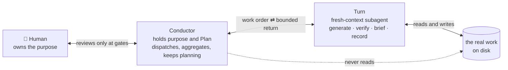
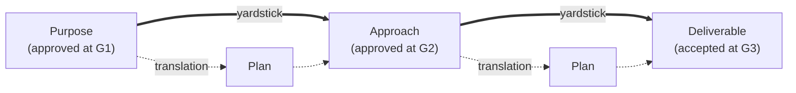
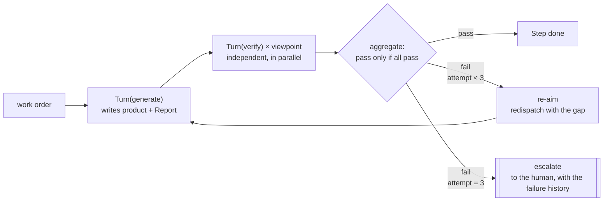
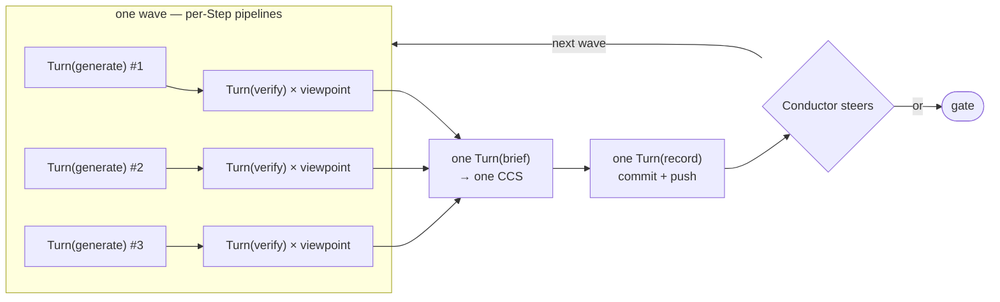
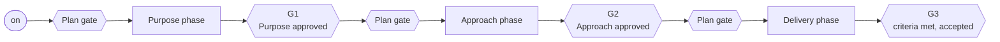

# aiya — Design

aiya is a Claude Code plugin that lets one person direct many AI agents toward a single goal — without watching them work.

## 1. Problem — Big work turns into babysitting

**The goal: raise one expert's productivity by an order of magnitude with AI agents** — delivering alone what used to take a team.

Delegate naively, and the bigger the job, the more human hands it takes. Delegation breaks in two ways:

- **Context bloat.** The directing agent's working state grows with the work. Every added stream inflates the context and replays old mistakes, defeating the whole point — directing many streams cheaply.
- **Drift.** The work stops tracking the purpose, and the deviation surfaces at the end instead of in flight. It takes two forms: doing work the purpose never asked for, and completing the original plan while ignoring what was discovered along the way.

So the design must guarantee exactly two properties, and everything that follows is verified against them:

- **Bounded context** — the Conductor's working state stays sub-linear in the number of work streams.
- **Drift detection** — the work stays traceable to the purpose, and deviation is caught mid-flight, not at the end.

Out of scope: measuring the 10× itself.

## 2. Core — Two roles, two walls, one bet

**Two roles, and only two.** The **Conductor** holds the purpose and steers, but never touches the work. A **Turn** touches the work, but never holds the purpose. The human is neither — the owner of the purpose, appearing only at gates.


```mermaid
flowchart LR
    H["👤 Human<br/>owns the purpose"]
    C["Conductor<br/>holds purpose and Plan<br/>dispatches, aggregates, keeps planning"]
    T["Turn<br/>fresh-context subagent<br/>generate · verify · brief · record"]
    A[("the real work<br/>on disk")]

    H <-->|"reviews only at gates"| C
    C <-->|"work order ⇄ bounded return"| T
    T <-->|"reads and writes"| A
    C -. "never reads" .-> A
```

**Two walls keep the roles apart.**

- **The Conductor never touches the real work.** Its intake is a short, closed list of bounded state (§5.7); it reads no product — not even a worker's first-person Report, the worker's own account of what it did (§5.2). This wall caps what *kind* of thing can enter its context.
- **Turns never nest.** Only the Conductor spawns. Two platform facts carry the wall: a subagent starts from a fresh context, and only what it returns reaches the caller — so a Turn is born clean, returns something bounded, and is discarded. Nesting would place work beyond the attempt cap (three attempts per Step, §4.1) and the return contract (the bounded return every Turn owes, §5.1); Turn definitions therefore omit the spawn tool.

**Vocabulary, fixed here.**

- **Phase** — work proceeds in three: Purpose (why) → Approach (how) → Delivery (execution).
- **Plan / Step** — each Phase holds one Plan; a Step is one Plan item.
- **Turn roles** — Turns are one kind with three role families: **generate** makes the work, **verify** measures it, and **run-keeping** sustains the run itself, as two roles — **brief** (the cognitive record: writes the CCS, the Compressed Cognitive State) and **record** (the physical record: performs every platform operation).
- **Work order** — minimal parameters passed into a static shipped definition: the procedure is static, the content is parameters.
- **Elicit item** — the one kind of Plan item whose work *is* conversation with the human, carried by the Conductor itself — the one seat that can talk to a person.
- **Gates** — six stops where the human rules: each Phase's Plan on the way in (a **Planning Gate**) and its product on the way out (**G1** / **G2** / **G3**). Answered with two of the five command words: `ty` approve, `gm` send back. The other three — `on` / `dn` / `up`: start, suspend, resume — run the session, not gates; mnemonics in the README.
- **Viewpoint** — one independently checkable concern; a Step's product gets one Turn(verify) per viewpoint (§5.3).
- **Machines verify, humans review** — pass/fail against a fixed yardstick is a machine's job; approving or redirecting is a human's. This line holds throughout.
- **Investigation is first-class work** — eliciting a vague intent, surveying a system, spiking a technology: each is a Step with a product, not a preamble to work.

**Enforcement is one principle, stated once.** No controller program exists — the loop is procedural prose. A rule is therefore either **structural** (the platform makes breach impossible, as with fresh contexts and omitted tools) or **default and observable**: cheapest to follow, and leaving a trace when broken, never guaranteed. §5 states each part's promise and the trace a breach leaves; §7 prices the acceptance.

**One bet carries the design: model progress.** Judgment, steering, and the final layer of verification sit with the LLM. Control written into code fixes the ceiling at the understanding of the day the code was written; only the parts left to the LLM get smarter, with no rewrite, as models do. The design's job is an allocation — maximize what inherits progress automatically, shrink the rest to a minimal skeleton of walls and records. 10× is a rising ceiling, not a static target.

The skeleton itself — dispatching to fresh subagents, receiving bounded returns — is standard practice, not aiya's invention. What aiya adds is the mechanism for not straying: every judgment ties back, with a version, to yardsticks a human approved; discoveries reshape the plan; only doubts about the yardsticks themselves return to the human. And the bet is made at the most general layer — aiya carries the whole journey from elicitation to acceptance, development or not, as one verifiable chain — so the proof carries to everything built on top.

The two properties map to two mechanisms: bounded context → the **CCS** (§5.4); drift detection → the **two-layer traceability chain** (§3.1).

## 3. Structure — One chain of yardsticks, and who owns what

### 3.1 The chain — immutable yardsticks, a living translation

Every product sits on one chain:


```mermaid
flowchart LR
    P["Purpose<br/>(approved at G1)"] ==>|"yardstick"| A["Approach<br/>(approved at G2)"] ==>|"yardstick"| D["Deliverable<br/>(accepted at G3)"]
    P -.->|"translation"| PA["Plan"] -.-> A
    A -.->|"translation"| PD["Plan"] -.-> D
```

The bold edges are the **immutable yardstick layer**: from the moment a gate approves Purpose or Approach, everything downstream is verified against it, and the only path to changing one is a send-back to a gate, where a human sits. The dotted edges are the **adaptive translation layer** — each phase's Plan, the joint that turns yardsticks into executable Steps, re-translated from the current position on every discovery (§4.3).

This two-layer shape is the substance of drift detection. Every Step traces through its Plan to a yardstick, and every yardstick to the reason the work exists — so drift appears as a Step that cannot be justified by the link above it, and a broken link stops at that phase's gate instead of flowing downstream.

### 3.2 The ledger — who writes, who verifies, who approves

Beside the chain, execution leaves **records** — an ephemeral lineage that moves the chain forward. **Records never become yardsticks.** Everything, listed once:

| Product / record | What it is | Written by | Verified by (machine) | Owned by (human) |
|---|---|---|---|---|
| **Plan** ×3 | The phase's Steps and dependencies — the translation layer | Conductor | Turn(verify) — aiya's fixed viewpoints (§5.6) | Planning Gate |
| **Purpose** | What success means — the head of the chain | Turn(generate) | Turn(verify) — evidential soundness | G1 |
| **Approach** | How that success will be reached | Turn(generate) | Turn(verify) — against Purpose | G2 |
| **Deliverable** | The working real thing | Turn(generate) | Turn(verify) — against Purpose + Approach + the Step's done-when | G3 |
| **CCS** | The bounded state carried between Steps — the Conductor's working state itself | Turn(brief) | Mechanical compression rules (§5.4); a claim the products don't support is caught by the next verification, which reads products, not the CCS | — (consumed by the Conductor) |
| **Verdict** | One viewpoint's judgment: pass/fail, gap, evidence | Turn(verify) | — it is itself the check; evidence keeps it falsifiable | — (aggregated by the Conductor) |
| **Report** | Turn(generate)'s first-person record: did / tried / unsure | Turn(generate) | — Turn(brief) checks it against the product | — |
| **Research** | An investigation Step's product, elicit answers included | Turn(generate) — elicit answers: the Conductor | Turn(verify) — evidential soundness; elicit answers exempt | — (not subject to approval) |
| **Run-state** | The run's lifecycle facts (§3.3) | Conductor | — every entry mirrors a command or verdict the human typed | — |

Carrying it all into the durable record — the commits and pushes — is Turn(record)'s job alone. What each role must *not* do follows from one role, one skill, and is written into each shipped definition; the Conductor's never-list is §5.7.

### 3.3 On disk — one directory per run, three backends

Logical names map to physical layout exactly once, here:

```
.aiya/<slug>/
  run.yaml    # run-state file — lifecycle facts, Conductor-written (below)
  purpose/    plan.md, purpose.md
  approach/   plan.md, approach.md, decisions/    # one file per decision
  delivery/   plan.md                             # the Deliverable lives in the repository proper
  ccs/        tNNN.yaml                           # CCS chain — replacement semantics, one chain per run
  verdicts/   # one file per judgment; step, viewpoint, attempt readable from the filename
  reports/    # one file per Turn(generate); item and attempt readable from the filename
  research/   # investigation products and elicit answers, referenced by path
  history/    # approved editions (gate-approved versions, §4.4), archived at gate resolution under the local backend (§5.5)
```

Formats and worked examples are in [references/](../references/). Research alone has no fixed format, deliberately: an investigation's product is free-form, verified for evidential soundness (§4.4), and referenced by path.

**Persistence has two roles — durable record and review surface — and a backend fills both.** Three ship: **github** (branch and PR, via `gh`), **gitlab** (branch and MR, via `glab`), **local** (no git at all — the disk is the record, and the human opens the files directly). The backend is detected at `on`, recorded in the run-state file, and reread at `up`. The core loop is identical under every backend; exactly two things degrade under local, both named, never hidden: bare `gm` (the argument-less send-back reads feedback from PR/MR review comments, §4.4 — under local there is no comment stream to fetch) and durability against machine loss (§7). Why git is swappable rather than required is a stated trade-off (§7).

**The run-state file, `run.yaml` (proposed).** The run's lifecycle facts — backend, run branch, gate verdicts, closure. It exists so that resume can read the gates' standing from disk instead of guessing (§4.5). The **Conductor** writes it and no one else does — it is the one party present at every boundary event: at `on`, at each gate verdict, at G3 resolution. Turn(record) carries it into the durable record and never writes into it.

```yaml
backend: github                # github | gitlab | local — detected at on
branch: aiya/csv-export        # the run branch (absent under local)
gates:
  - {gate: purpose-planning, verdict: ty}
  - {gate: G1, verdict: gm}
  - {gate: G1, verdict: ty, edition: purpose.md@G1-v2}
status: open                   # open | closed — closed at G3 resolution
```

### 3.4 What ships — skills, Turn definitions, formats

Three kinds of artifact and nothing else: **six skills** — five entry skills for the command words, explicit-invocation only (`ty` / `gm` are the human's typed gate verdict, never inferred from conversation), plus one Claude-only conductor skill carrying the Conductor's procedure; **Turn definitions** — static shipped artifacts, one per role or platform variant (how many is not a contract; §5.1's Turn contract is); and **formats** — the worked examples in [references/](../references/). **The Conductor is the main session executing the conductor skill's prose. There is no other executable part** — §2's bet, made concrete.

## 4. Behavior — One loop, from a Step to the whole run

### 4.1 A Step — generate, verify, re-aim, escalate

**Each attempt at a Step dispatches exactly one Turn(generate)**; an elicit item (§2) dispatches none and skips this pipeline — verification, the attempt cap, and §6's counts apply only to items whose work a Turn performs.


```mermaid
flowchart LR
    WO["work order"] --> G["Turn(generate)<br/>writes product + Report"]
    G --> V["Turn(verify) × viewpoint<br/>independent, in parallel"]
    V --> AGG{"aggregate:<br/>pass only if all pass"}
    AGG -->|"pass"| NEXT["Step done"]
    AGG -->|"fail<br/>attempt < 3"| RA["re-aim<br/>redispatch with the gap"]
    RA --> G
    AGG -->|"fail<br/>attempt = 3"| ESC[["escalate<br/>to the human, with the failure history"]]
```

Turn(generate) writes product and Report to disk and returns paths — never raw output. Aggregation is a mechanical AND; on failure the re-aim carries the union of the failing gaps as the corrective instruction. For an investigation Step nothing is "wrong" — evidence is merely insufficient, and re-aim digs further instead of rebuilding. Escalation is not a gate but an exception interrupt: rare, unplanned, carrying at most three gaps for the human to adjudicate. Two side paths: a **missing return** is re-sent — a Turn is stateless, so re-sending is always safe, and an accident is not an attempt; a **missing viewpoint** re-verifies only — the product is untouched, so the attempt count does not grow.

### 4.2 A wave — parallel width, one CCS

**Steps with no unmet dependency form a wave and run together**; width one is the sequential case. Waves have no file — they are derived each time from the Plan's `consumes` (§5.6).


```mermaid
flowchart LR
    subgraph wave ["one wave — per-Step pipelines"]
        GA["Turn(generate) #1"] --> VA["Turn(verify) × viewpoint"]
        GB["Turn(generate) #2"] --> VB["Turn(verify) × viewpoint"]
        GC["Turn(generate) #3"] --> VC["Turn(verify) × viewpoint"]
    end
    VA & VB & VC --> B["one Turn(brief)<br/>→ one CCS"]
    B --> R["one Turn(record)<br/>commit + push"]
    R --> S{"Conductor steers"}
    S -->|"next wave"| wave
    S -->|"or"| GATE(["gate"])
```

However wide the wave, **one Turn(brief) folds what actually happened into a single CCS** — the Conductor's intake stays at one bounded state per wave, so parallel width and bounded context stop being in tension. Turn(record) runs after brief so it can read the fresh CCS — commit messages are content-aware, not mechanical.

**Only record ever commits** — never the Conductor, never generate / verify / brief. Record runs at the loop's serial point — by construction, after the wave has settled into one brief — so no two writers meet at the shared git index; and it is a Turn, so it reads what it commits — nobody commits content unread, where the Conductor may not read at all. Commit granularity is the wave, plus the `on` / gate / `dn` events (§5.5) — so **every commit in history is a complete resume point** (§4.5), and git history reads as the run's state machine.

### 4.3 Steering — re-plan from zero, every wave

**The Conductor's first duty is to keep planning; dispatch and aggregation are means.** The goal is the purpose, not completing the Plan — completing while ignoring discoveries is drift's second form, and the only party positioned to prevent it is the Conductor, standing where every Step's discoveries converge.

Each time a wave settles, it reads the CCS and asks three questions, in order: are we closer to the purpose? what was discovered? and what is the shortest Plan from here — **planned from zero out of the current position, never by amending the current Plan.** Where the fresh plan differs, the difference is the revision. The moment the current Plan becomes the default and discoveries bear the burden of proof, steering degenerates into ritual.

**Discretion has a line.** Re-planning may move all of the Plan — add, remove, split, rewire, reorder. It never touches Purpose or Approach: a discovery that casts doubt on a yardstick itself is not absorbed into the Plan but sent back to a gate, up to the human.

**The steering verbs are finite**: Plan surgery within that line, re-aim, re-verify, adding an investigation Step, sending back to a gate, re-sending a missing return. Anything outside the set — above all, investigating by oneself — is a breach of the wall. A doubt that can be written as a viewpoint becomes a re-verify; an open question becomes an investigation Step on the Plan. And aggregation has an attribution test — *does it require reading the real work?* No: the Conductor's (control). Yes: a Turn's (inspection).

### 4.4 Gates — six stops, versioned approvals

Three phases connect intent to execution. Each has a Plan (drafted and re-planned by the Conductor) and a product (made by Turns, never the Conductor):

| Phase | The question it answers | Product | Typical Steps |
|---|---|---|---|
| **Purpose** | Why, and how will we know we got there? | Purpose — Situation, Pain, Benefit, Success Criteria | Elicit until the intent is decidable; market and competitor research |
| **Approach** | How will we get there? | Approach — Testing, Technology, Design | Survey the existing system; investigate technologies; spike the risky part |
| **Delivery** | In what order do we execute? | The working Deliverable | Implementation |

**Generation needs prerequisites** — purpose, UX, design, plan — or a Turn has nothing to build against and be verified against. What the project lacks, the Plan grows Steps to produce in aiya's formats ([references/](../references/)). Investigation Steps exist in every phase, and it is on them that compression and independent checking pay most: an unbounded pile of reading yields a few lines of understanding nothing on disk would otherwise remember.

**The yardstick is fixed per phase.** Approach is verified against Purpose; Delivery against both. Purpose is the head of the chain — no prior document exists — so it is verified for **evidential soundness** instead: every claim has a source, contradictions are surfaced rather than silently resolved, the unknown is declared unknown, and the success criteria are decidable as written. Research is held to the same standard — outside the gates means not subject to approval, not unexamined.

**Drafting the Purpose is divided.** Elicitation is the Conductor's one touchpoint at the chat surface — holding the purpose includes asking for it, and Turns cannot talk to people. But the Conductor does not draft: answers are written under `research/` on the spot, and Turn(generate) drafts from those paths. Whoever writes must read, and the Conductor may not read — so it drafts nothing. Until the human approves at G1, it is not the purpose.


```mermaid
flowchart LR
    ON(["on"]) --> p1{{"Plan gate"}} --> W1["Purpose phase"] --> g1{{"G1<br/>Purpose approved"}}
    g1 --> p2{{"Plan gate"}} --> W2["Approach phase"] --> g2{{"G2<br/>Approach approved"}}
    g2 --> p3{{"Plan gate"}} --> W3["Delivery phase"] --> g3{{"G3<br/>criteria met, accepted"}}
```

Six stops: three phases × {Plan on the way in, product on the way out}; only the outputs — G1, G2, G3, in phase order — carry numbers.

**Stopping at a gate**, the Conductor posts a bounded console summary and points at the artifact on the review surface — the summary is for deciding to look; the surface is where the document is read. The surface always already holds what the gate points at: Turn(record) opens it at `on`, a product arrives with its wave's settle, and a freshly drafted or reworked Plan is carried there by a pre-Planning-Gate record dispatch (§5.5). Send-back has two forms: `gm <one line>` carries the feedback in the argument and works everywhere; bare `gm` takes the PR/MR's review comments — Turn(record) fetches them to a file and returns the path. Between stops the Conductor self-runs in **dispatch rounds** — one continuous run from one stop to the next, typically spanning several waves — a progress board kept current on the console (each wave's items shown as done, running with attempts and any re-aim's gap, or ahead), each round re-entering from file state (§4.5) — which is why a stop loses nothing.

**Approvals carry versions.** Each gate-approved yardstick carries a `version: vN (timestamp)` header line, written and bumped only by Turn(generate) — under local, where no git names editions, this line *is* the edition's identifier. **A new version invalidates what was measured against the old one**: each Verdict pins the edition it measured (§5.3), so the invalidated ones are found mechanically, the affected Steps re-verified, and only a fail against the new yardstick triggers a re-aim. The mechanics ship in the conductor skill and the Turn definitions.

**The moment a gate resolves, two parties write.** Turn(record) carries the approved document into the durable record — remote backends commit and push, local archives into `history/` (§5.5). At G3 the dispatch is a final settle: the PR/MR is left open, handed to the human as ready — **aiya never merges**. The Conductor writes the verdict into the run-state file — every gate's, approval and send-back alike. The file is a log, not a ledger anything reads a next version from.

### 4.5 Suspend and resume — every commit is a resume point

**The latest CCS + the approved phase documents + the current Plan + the run-state file are the entire resume point.** A run suspended mid-way and reopened in a fresh conversation re-reads exactly what the next wave would have read, and continues; the run-state file says where the gates stand — read from disk, not guessed. One window degrades: a boundary event not yet carried into the durable record is lost with the machine, and a resume then re-presents the pending gate — the safe side, costing at most one redundant `ty`.

Persistence is continuous, not an event at the end: every wave settle commits and pushes the four items together, so suspension is routine operation, not exception handling — `dn`'s job is to confirm, not to persist. What is bounded is the working state, not the transcript: the Conductor's history still grows with the number of Turns; the design minimizes the coefficient (returns are paths and Verdicts only), and the residue is cycled by `dn` → `/clear` → `up`. Under a remote backend the resume point survives the machine as well as the conversation; under local, the conversation only (§7).

### 4.6 Bounded context and drift detection, discharged

Bounded context is carried by three things, none scaling with the work: the no-reading wall caps what *kind* of thing enters (§2); the CCS caps *how much* — one file per wave, replaced not appended, real work by path (§5.4); and one brief per wave cuts the last link to scale — doubling a wave's width does not double what the Conductor reads (§4.2). Drift detection likewise, one answer per form the problem takes: the chain makes drift an object — a Step unjustifiable by the link above it — visible without anyone noticing a mood (§3.1); verification against version-pinned, gate-approved yardsticks catches unasked-for work at the Step, before its wave settles (§4.4); and re-planning from zero catches the stale plan — a plan rebuilt from the current position cannot silently inherit the old one (§4.3). What exceeds the Conductor's discretion is not absorbed: a doubt about a yardstick goes to a human at a gate. Both answers are structural rather than asserted — but structure is not evidence that the loop is worth its cost; that is §6's question.

## 5. Rules — What each part promises

Per part: the promise, and the trace a breach leaves (§2's enforcement principle). Schemas, vocabularies, and worked examples ship in the Turn definitions and [references/](../references/) — this chapter does not restate them.

### 5.1 The Turn contract — five rules, one invariant

Every Turn keeps five rules:

1. **Starts from a fresh context** — nothing enters but the work order.
2. **Is a direct child of the Conductor** — it never spawns.
3. **May touch the real work freely** — Turns alone do.
4. **Returns something bounded** — paths and a line, a Verdict, a CCS path, a few lines naming what was committed; never raw output, never a transcript.
5. **Leaves no context behind** — born for one job, returns, gone. Stateless, which is why re-sending a lost return is always safe (§4.1).

Rules 1–2 are structural: fresh contexts come from the platform, and the spawn tool — like the user-question tool — is absent from every Turn definition. Where a definition carries Bash for its work, an indirect spawn remains possible, so there rule 2 is default and observable — the trace is the nested session's own transcript, which no bounded return reports. Rule 4 the Conductor checks on every return.

**This contract, not the count of definitions, is the invariant.** Definitions are static shipped artifacts, never improvised at runtime; only the Conductor dispatches; whoever writes must read what it writes. A new role, or a platform variant of an existing one, enters as a new definition under the same contract — the dispatch loop untouched; the one Conductor-side change is registering a new backend in the detection roster at `on`.

### 5.2 Turn(generate) — the product and an honest Report

Does one Step's work; writes the product and a **Report** to disk and returns their paths. The Report is the first-person record — did / tried / unsure — and only Turn(brief) ever reads it, so first-person content never crosses the wall ([references/report.md](../references/report.md)). When the product is a yardstick document, Turn(generate) writes the version header (§4.4) — v1 on the first draft, read-and-bump on rework — and no other party ever writes a version.

### 5.3 Turn(verify) — one viewpoint, one falsifiable Verdict

A **viewpoint** is one independently checkable concern; a Step dispatches **one flat Turn(verify) per viewpoint** — a verifier holding one narrow concern misses less than one juggling several. The defaults are the Step's done-when and the relevant criteria of the phase yardstick; the Plan item may declare domain viewpoints beyond them.

It is told its one viewpoint, the fixed yardstick, the product's path, and the dispatch identifiers — never the Report, never the expected judgment, so a polished claim cannot reach it. It writes the Verdict to disk **itself** and returns the same content: the record exists before the Conductor touches it, making a judgment convenient to the Conductor structurally impossible to fabricate. `evidence` is mandatory — it keeps the gap's claim itself verifiable afterwards; the Verdict pins the edition it measured (`purpose.md@G1-v2`) — the hook for §4.4's invalidation.

**Provenance is fixed**: always the phase's immutable, gate-approved document — never the running CCS, never the moving Plan; measuring against a state that may have drifted is measuring with a warped ruler. At the head of the chain, the dispatch names `evidential-soundness` in place of a document. A dispatch offering a moving state is refused — recorded as a fail whose evidence names the breach.

Mechanical checks run first; the LLM is the thin last layer — which is why success criteria are written to be runnable. A product too large for one single-shot verifier is a scope signal: split the Step, do not grow the verifier. Schema and worked example: the Turn definition.

### 5.4 Turn(brief) — the CCS, bounded by construction

The **CCS (Compressed Cognitive State)** is the bounded state carried between Steps — the Conductor's working state itself, and the only thing a re-aimed or subsequent Turn inherits. The nine-component YAML schema is adopted from Bousetouane, ["AI Agents Need Memory Control Over More Context"](https://arxiv.org/abs/2601.11653) (2026); aiya's contribution is the operating rules:

- **Third-person** — written by Turn(brief), after verification: the party with a stake in the outcome does not write its record.
- **Post-verdict** — what a Step is worth is known only after judgment, so the carried state includes the judgment.
- **Replacement semantics** — a fresh file each wave, never appended.
- **Product wins** — observable components are written from the products, not from what Turn(generate) said about them; the Report supplies only what nothing else can (tried, unsure). A CCS that claims more than its products show does not survive: the next verification reads the products themselves, never the CCS, so the unsupported claim surfaces there.
- **One per wave, never decomposed** — verify splits per viewpoint because narrowing sharpens judgment; a state assembled from partial views lacks exactly what makes it a state. It judges, but only about facts — never direction.

Boundedness: real work travels by path, never inlined; a soft size cap's breach is a health signal, not a license to grow — which component bloats diagnoses the Step's scope (split it, narrow it, or add a Step that resolves the pile-up); and the Conductor keeps no growing summary of its own — its intake is the latest CCS plus bounded Verdicts. The CCS is bounded and sub-linear, not byte-constant. Schema, component roles, cap, and worked example: the Turn definition.

### 5.5 Turn(record) — the physical record

Turn(record) owns every platform operation, shipped as three per-backend **adapter** definitions — github, gitlab, local — same role, same bounded return, same five dispatch points, each structurally serial:

- **At `on`** — create the run branch, first push, open the PR/MR: the surface exists before anything points at it.
- **At each wave settle** — after brief, so the fresh CCS is readable; commits the wave's products, Verdicts, Reports, the new CCS, the current Plan, and the run-state file, by explicit paths, then pushes.
- **At each pre-Planning-Gate Plan push** — carries a freshly drafted or reworked Plan, plus its Plan-check Verdicts, onto the surface (§4.4).
- **At a gate verdict** — carries the approved document (stamped by generate, never by record) and the run-state file into the durable record; at G3, a final settle — anything unrecorded, `status: closed` among it — leaving the PR/MR open. On a bare-`gm` send-back, fetches the review comments to a file and returns the path.
- **At `dn`** — sweeps anything pending, final push.

A Planning-Gate approval dispatches no Turn(record) — its run-state entry becomes durable at the next dispatch point (§4.5). Record stays safely re-sendable because its operations are idempotent at this granularity: paths already committed stage to nothing, a push already made pushes nothing. The **local adapter** performs none of the git operations — the disk already is the record — keeping the same dispatch points and return; its one write is archiving the approved document into `history/` under a version-carrying name, so approved editions survive later reworks with no git. Breach trace: a commit whose author is not a Turn(record) dispatch is visible in the history itself.

### 5.6 The Plan — three lines per item, revision with structure

Each item is three lines plus one optional — **product** (what exists once done), **consumes** (the earlier products actually used as input — dependency, not ordering), **done when** (the item's own pass condition, written to be runnable), **viewpoints** (optional domain concerns; each gets its own Turn(verify)). Semantics and worked example: [references/plan.md](../references/plan.md).

**The Plan itself is verified, against fixed viewpoints aiya owns** — if the Conductor wrote the viewpoints for its own Plan, that would be self-approval: (1) every item has its three lines; (2) consumes is real consumption, same-file writes included; (3) done when is runnable; (4) the items, held against the phase yardstick, produce the phase's product — no more, no less.

**Revision is safe under three conditions**: the discretion line (§4.3); a change record — each revision appends what changed, the discovery that grounded it, and the waves already fired, so the human reads the diff and the reasons at the next gate; and the fixed viewpoints re-applied to every revision. An item too big for one Turn splits into new items with fresh attempt counters. Breach traces: format breaks and consumes lies are caught by the fixed-viewpoint verify; an unrecorded change shows as a Plan diff with no log entry; a yardstick edition with no gate approval behind it is visible in the document's version and the file's history.

### 5.7 The Conductor — does, and never does

**Does**: hold the purpose. Elicit — its only human touchpoint. Draft the Plan and re-plan every wave. Author and dispatch work orders. Aggregate Verdicts mechanically and derive waves. Keep the run-state file current at every boundary event. Advance, re-aim, escalate, wait at gates.

**Never**: domain work. Reading the real work, Report contents included. Drafting products — not even the Purpose; whoever writes must read. Interfering with a Turn's judgment — never pass the expected verdict. Changing a yardstick. Committing or pushing — every platform operation is Turn(record)'s.

**Doubt becomes a Step** (§4.3). Investigating by oneself will, at some moment, feel faster than delegating — the rule exists for that moment. This wall cannot be made physical: the Conductor's working state is files, so it cannot lose the ability to read. It is default and observable, because the intake list is closed — the latest CCS, bounded Verdicts, approved phase documents, the current Plan, the run-state file, gate feedback as its arrival and path, the elicit exchange it writes under `research/`, and paths. Anything else in its context means a broken wall — and the trace is the Conductor mentioning content that no return contained.

## 6. Observability — Is the loop earning its keep?

The bounded path must also be the cheap path, and cheapness is not self-evident: every Step pays N Turn(verify)s, every wave a brief and a record, every re-aim another round. Three ratios, countable after any run from what it left behind, keep the bill visible:

| Measure | Definition |
|---|---|
| **Keep rate** | Steps ÷ Turn(generate)s (= Steps + re-aims). One-pass work is 100%. |
| **Escalation rate** | Steps stopped at the cap ÷ all Steps. |
| **Verification overhead** | (Turn(verify)s + Turn(brief)s + Turn(record)s) ÷ Turn(generate)s. |

Turn(record) enters the overhead deliberately: every Turn the loop pays beyond generate belongs in the bill it must justify. Elicit items dispatch no Turn(generate) and enter none of the counts.

**Nothing is instrumented.** The counts come from what the run already writes: attempts ride the Verdicts, re-aims sit in the CCS chain, and Turn(record) dispatches are the commit history itself — under local, the same counts come off the disk. As a starting heuristic — to be refined in use, not a measured rule — a loop below 50% keep rate is costing more than the work it saves, and the remedy is narrower Steps, not more attempts. These ratios measure the loop's efficiency, not human productivity: the design answers for the two properties (§4.6); the ratios answer for whether that answer was worth the Turns it cost.

## 7. Trade-offs — Shapes discarded, costs paid

**Shapes discarded**, each with its reason:

- **A controller program** — code removes the compliance bet but fixes the ceiling at the day it was written (§2). Whether prompts alone can carry the cycle, the cap, and the gates is measured in dogfooding; if they cannot, only the loop moves into code — formats, chain, and instruments carry over as they are.
- **Transcript replay and retrieval** — the two standard ways to carry state. Replay grows context linearly and replays early mistakes; retrieval avoids the growth but drifts — semantic similarity is not what task control needs. Only a bounded state rewritten each time answers both at once.
- **A catalog of content-specific agents** — reviewer, designer, … per kind of work. The catalog multiplies without bound, and definition contents shape work quality outside the Conductor's sight. Roles stop at the three families; content travels as parameters. What may grow is the platform axis — a new backend adds one record adapter, which carries no content to shape.
- **Improvised work orders** — instructions written from scratch per Turn. Drafting keeps temptation to stray with the Conductor, long instructions fatten the history, and wording variance makes verification's independence depend on how orders happen to be written.
- **Conductor-drafted products** — whoever writes must read, and the no-reading wall is credible only when the Conductor has no reason to read.
- **A hard git dependency** — what the design needs is two roles, durable record and review surface (§3.3); git-plus-PR is one implementation, not their definition. Swappable backends keep the core loop identical everywhere and make the degradation honest.
- **State recorded by its author** — Turn(generate) writing the CCS. The Conductor's entire picture would pass through an interested party's account. The schema is Bousetouane's (§5.4); the operating rules — post-verdict, third-person, replacement, product-wins — are aiya's.

**Costs paid**, stated so they read as accepted, not overlooked:

- **No guaranteed enforcement.** Rules are default and observable, never technically blocked; that prompt compliance suffices is the bet. If dogfooding falsifies it, the hardening to reach for is a hook blocking the Conductor's reads of the real work by path — after measuring, not before.
- **Turn cost per Step.** N verifies plus one brief per wave, and a re-aim pays the round again. Independence is bought with this overhead; §6 keeps the bill visible.
- **First-person fidelity.** A third-person record thins the lived detail of the work. The Report carries some of it into the CCS — second-hand by construction.
- **Correctness of declared independence.** A wave is only as safe as its dependency declarations; one missed dependency corrupts the whole wave at once. The price of parallelism, and why consumes is verified in the Plan and reviewed at the gate rather than inferred.
- **Plan plasticity.** The Plan the human approved and the Plan that ran will differ. The change record and re-applied viewpoints pay that cost; a readable diff at the next gate is the compensation.
- **Linear history growth.** Bounded is the working state, not the transcript. Paid by minimizing the coefficient and cycling `dn` → `/clear` → `up`.
- **A degraded local mode.** No comment stream for a bare `gm`, and durability ends at the disk: approved editions survive via `history/`, but machine loss and intermediate drafts do not. Accepted because a named degradation beats a faked uniformity — and requiring git would price out exactly the small runs where aiya is cheapest to try.
- **Serial gates.** The human remains a serial resource at six points. Sparse gates make that affordable; they do not remove it.
