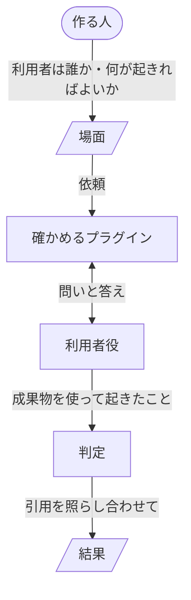

# ben

ben を使うと、Claude Code のプラグインやその変更を出す前に、プラグインの README が利用者に約束していることを、利用者が本当に得られるかが分かります。変更なら、前に確かめた時より良くなったかも分かります。

## 得られること

- 変更が役に立ったかを、出力の見た目でなく、利用者に起きたことで判断できます。

    テストが通り、出力が整っていても、利用者が約束されたことをできないままのことがあります。ben では、走らせる前に「利用者に何が起きれば合格か」を書き、話し合いを知らない利用者役がプラグインの成果物を実際に使って、それが起きたかを見ます。利用者役はプラグインが何度問い返しても最後まで付き合うので、出力のファイルだけを見る評価では分からない、対話の途中のつまずきも見えます。

- 古い版を走らせ直さずに、変更で何が動いたかが分かります。

    確かめるたびに、場面の横に結果のファイルが1つ残ります。コミットしておけば、次に同じ場面を同じモデルで確かめた時、どのマシンでもその結果と比べます。

- まぐれの1回に惑わされません。

    同じ場面を何回か走らせ、回によって判定が分かれた項目を挙げます。

- 判定の理由を、その場で確かめられます。

    各判定には、理由と、走らせた時の記録のどこに何が書かれていたかの引用が付きます。引用が記録に見当たらない判定は、数えません。

- 中身と、待ち時間や費用を、同じ1つの結果で見られます。

    正しさなどの中身の指標と、時間、利用者の待ち時間、利用者が答えた回数と読んだ量、トークンを、回ごとと中央値で残します。

- どのプラグインも、同じ順で考え、同じ土台の上に作れます。

    利用者の得ることから README、設計書、実装へと進む順と、その確かめ方が、どのプラグインでも同じです。

## 必要なもの

- ログイン済みの Claude Code。

    プラグインを、利用者が使うのと同じ本物のセッションで走らせるためです。

- git。

    確かめた版を記録し、比べる相手の版を取り出すためです。

- Python 3.10 以上と、そこに入った DeepEval。

    中身の指標を、ほかの評価と同じ意味で測るためです。DeepEval が判定に使うモデルは、`claude -p` を通した Claude なので、API キーは要りません。ben は環境変数 `BEN_PYTHON` が指す Python を使い、なければ `~/.ben/bin/python` を使います。どちらにも DeepEval がなければ、入れ方の一例を示して止まります。

    ```
    python3.12 -m venv ~/.ben && ~/.ben/bin/pip install deepeval
    ```

確かめは、1回走らせるのに数分、3回と判定を合わせて数十分ほどかかり、Claude Code の利用枠を使います。

## 入れる

Claude Code の中で入れます。

```
/plugin marketplace add lovaizu/ccpm
/plugin install ben@ccpm
```

## 新しいプラグインを確かめる



ben が確かめる単位は場面です。場面には、どんな利用者が、どんなリポジトリで、何を頼み、成果物を何に使うかと、README の約束ごとの合格の項目を書きます。

writ を作り終え、最初の約束が守られているかを知りたいとします。確かめるプラグインの名前を渡して `/ben:check` を呼ぶと、ben がその README から一緒に場面を書きます。

```
> /ben:check writ

● writ の README は「読み手は一度読めば分かり、読み終えたら何をすればよいか分かる」と
  約束しています。この場面の読み手は誰で、その人に何が起きればよいですか？
> 今日入ったチームの新人が、writ の書いた手順書だけでアプリを起動できること。
```

ben が聞くのは、作る人にしか決められないことだけです。利用者は誰か、何をしたいか、その人に何が起きればよいか、いま使っている版があればそのタグかコミット、場面をどこに置くかです。そのうえで、約束がなければ利用者がはっきり困る場面を選び、一度見せて承認を受けます。場面は、確かめるプラグインと同じ git リポジトリに置きます。どの版を確かめたかを、そのリポジトリのコミットで残すためです。

承認すると、ben は場面を3回走らせ、場面の横に結果を書きます。比べる結果がまだないので、これが最初の結果になります。

```markdown
## 結論
この場面の最初の結果です。比べる相手はありません。
- 約束1 読み手は一度読めば分かり、読み終えたら何をすればよいか分かる：3回中2回得られた
## 根拠
- 項目1.1 新人が手順書だけでアプリを起動する：3回目は得られなかった。ポート番号で止まった
- 回によって分かれた項目：1.1
- 中央値 時間：212秒、利用者が答えた回数：2、トークン：41万
## 証拠
- 3回目 記録 5f2c….jsonl:14「どのポートで待ち受けていますか？」
```

場面と結果を一緒にコミットします。

## 改善を確かめる

writ が読み手について聞く聞き方を直し、場面ファイルを渡して同じ場面をもう一度確かめます。

```
> /ben:check dev/writ/scenes/setup.json
```

ben は、同じ場面を同じモデルで確かめた前回の結果と比べるので、古い版は走らせません。

```markdown
## 結論
0.1.0（3c9e1a2）の結果と比べています。
- 約束1 読み手は一度読めば分かり、読み終えたら何をすればよいか分かる：3回中3回得られた（前回 3回中2回）
```

項目ごと、数値ごとにも、前回の値が並びます。比べられる結果がない時や、使うモデルが変わった時は、場面に書いた「いま使っている版」も走らせて、それと比べます。

場面のどこかを書き換えると、利用者に起きることが変わりうるので、別の場面として扱い、前回の結果とは比べません。走らせる回数は、場面で変えられます。

利用者が人でなく別のプラグインであるもの、たとえば turn は、それを呼ぶ小さなプラグインを通して確かめます。

## プラグインの考え方と作り方

前の段を決めてから次の段へ進みます。作るものが、利用者の得ることに仕えるようにするためです。

- 利用者の目的と、プラグインで得られることから始めます。

    仕組みから作ったプラグインは、どの約束にも要らない機能を抱えます。

- 次に README を書きます。利用者が得ることと、実際の画面に近い使い方の場面です。

    README は ben が確かめる約束なので、それを守るものより先にあります。

- 次に設計書を書きます。方針とそれが成り立つ理由、機能ごとにそれが仕える約束です。

    判断と意図だけを持つ設計書は、作り直しても正しいままです。手順や、ある場面での扱いは、方針から導けるので実装が持ちます。

- そのあとで作り、README から書いた場面で ben を使って確かめます。

    足すのは、ben で欠けが見つかった所だけです。欠けは、結果の証拠から記録をたどって、なぜ起きたかを突き止め、その原因を直します。待つ、確かめを緩める、例外を足す、といった症状を抑える継ぎ足しはしません。症状だけを抑えると、同じ原因が別の所で出て、継ぎ足しが積み重なるからです。

### AI に何かを作らせるプラグインは turn の上に作る

turn は、作る、使ってみる、直す、をタスク1つ分まるごと受け持つプラグインです。プラグインが持つのは、それ以外のこと、つまり何を作るか、誰のためか、利用者と何を合意するか、どのタスクをどの順に回すか、どこで利用者を待つかです。

### どのプラグインにも共通の決まり

- 利用者のマシンで動くスクリプトは、Python 3.9 以上の標準ライブラリだけで書きます。

    Python 3.9 は多くの環境に最初から入っていて、利用者に新しく入れてもらうものが要りません。ben の確かめの道具は、作る人のマシンでだけ動くので、これに当たりません。

- python3 がなければ、止まって入れるように伝えます。

    黙って走らなかった確かめは、通った確かめと見分けがつきません。

- テストはプラグインの外に置き、プラグインが走らせる行をすべて走らせます。

    インストールはプラグインのフォルダを丸ごと写すので、外に置けば利用者に届きません。どのテストも走らせない行は、要らない行です。
