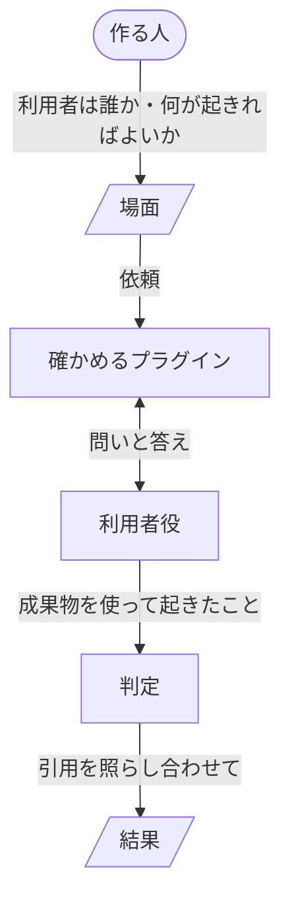

# ben

ben を使うと、Claude Code のプラグインを、目的を決めてから利用者に届けるまで、どれも同じやり方で進められます。出す前には、プラグインの README が利用者に約束していることを、利用者が本当に得られるかが分かります。変更なら、前に確かめた時より良くなったかも分かります。

## 得られること

- 目的から出すまでを、この README だけで進められます。

    マーケットプレイスの用意、作る順、テストと確かめ、出し方までがここにあります。ben のスキルによって、ben を入れた Claude Code も同じやり方で作業するので、リポジトリに作り方の決まりのファイルを置かずに済みます。

- どのプラグインも、同じ順で考え、同じ土台の上に作れます。

    利用者の得ることから README、設計書、実装へと進む順と、その確かめ方が、どのプラグインでも同じです。

- 変更が役に立ったかを、出力の見た目でなく、利用者に起きたことで判断できます。

    テストが通り、出力が整っていても、利用者が約束されたことをできないままのことがあります。ben では、走らせる前に「利用者に何が起きれば合格か」を書き、作る人と Claude Code の話し合いを知らない AI の利用者役がプラグインの成果物を実際に使って、それが起きたかを見ます。利用者役はプラグインが何度問い返しても最後まで付き合うので、出力のファイルだけを見る評価では分からない、対話の途中のつまずきも見えます。

- 古い版を走らせ直さずに、変更で何が動いたかが分かります。

    確かめは、どんな利用者が何をするかと合格の項目を書いた場面ごとに行い、そのたびに場面の横に結果のファイルが1つ残ります。コミットしておけば、次に同じ場面を同じモデルで確かめた時、どのマシンでもその結果と比べます。

- まぐれの1回に惑わされません。

    同じ場面を何回か走らせ、回によって判定が分かれた項目を挙げます。

- 判定の理由を、その場で確かめられます。

    各判定には、理由と、走らせた時の記録のどこに何が書かれていたかの引用が付きます。引用が記録に見当たらない判定は、数えません。

- 中身と、待ち時間や費用を、同じ1つの結果で見られます。

    正しさなどの中身の指標と、時間、利用者の待ち時間、利用者が答えた回数と読んだ量、トークンを、回ごとと中央値で残します。

## 必要なもの

- ログイン済みの Claude Code。

    プラグインを、利用者が使うのと同じ本物のセッションで走らせるためです。

- git と、マーケットプレイスを置く GitHub のリポジトリ。

    確かめた版を記録し、比べる相手の版を取り出し、利用者がマーケットプレイスからプラグインを入れられるようにするためです。

- Python 3.10 以上と、そこに入った DeepEval。

    中身の指標を、DeepEval を使うほかの評価と同じ意味で測るためです。項目ごとの判定も DeepEval の判定も、`claude -p` を通した Claude が行うので、API キーは要りません。ben は環境変数 `BEN_PYTHON` が指す Python を使い、なければ `~/.ben/bin/python` を使います。どちらにも DeepEval がなければ、入れ方の一例を示して止まります。

    ```
    python3.12 -m venv ~/.ben && ~/.ben/bin/pip install deepeval
    ```

- GitHub を使う場面には、非公開の練習用リポジトリ。

    場面を走らせると、プルリクエストや push ができます。それを人が使うリポジトリに残さないためです。リポジトリは前もって作っておき、ben がそうした場面を最初に書く時に尋ねられたら伝えます。ben はそれを場面に書き残します。同じリポジトリで2つの場面を同時に走らせると混ざるので、1つずつ走らせます。

確かめは、1回走らせるのに数分、3回と判定を合わせて数十分ほどかかり、Claude Code の利用枠を使います。

## 入れる

Claude Code の中で入れます。

```
/plugin marketplace add lovaizu/ccpm
/plugin install ben@ccpm
```

入れておけば、プラグインを作る、直す、出す作業で、Claude Code がこの README を読んでそのとおりに進めます。そのために呼ぶコマンドはなく、確かめだけを `/ben:check` で頼みます。確かめだけを使うことはできません。どのプラグインも同じやり方で届けるためです。作る人がするのは、目的を決め、README と設計書を承認し、確かめを `/ben:check` で頼み、マージし、出すかどうかを決めることです。

## マーケットプレイスを用意する

自分の GitHub リポジトリに、いくつものプラグインを並べます。目的を伝えた時にこの置き方がなければ、Claude Code がまず用意します。すでにあるマーケットプレイスなら、Claude Code がファイルをこの置き方に移し、作る人が承認してから進めます。

```
.claude-plugin/marketplace.json   プラグインの一覧
README.md                         人が読む入口
<plugin>/                         利用者に届くもの
<plugin>/.claude-plugin/plugin.json  プラグインの名前と版番号
dev/<plugin>/design.md           設計書
dev/<plugin>/tests/               テスト
dev/<plugin>/scenes/              場面と結果
.github/workflows/                CI
```

- 利用者に届けるものだけを、プラグインのフォルダに置きます。

    インストールはプラグインのフォルダを丸ごと写すので、テストや設計書を外に置けば利用者に届きません。

- プラグインは、`.claude-plugin/marketplace.json` の `plugins` と、ルートの README の両方に載せます。

    一覧には `name`、`description`、`source`（たとえば `./rn`）、`category` を書きます。書き方は[公式の文書](https://code.claude.com/docs/en/plugins/marketplace-reference)にあります。Claude Code は一覧を読んで入れ、人は README から各プラグインの README へたどります。どちらかにしかないプラグインは、届いていないのと同じなので、足す時も名前を変える時も外す時も、2つを一緒に変えます。

## プラグインを作る

どのプラグインも、ベストプラクティスに従い、目的をシンプルに果たすことを追求します。公式のやり方に沿えば、Claude Code が変わっても、ほかのプラグインと並べても崩れにくく、目的に要らないものを持たなければ、直す所も壊れる所も減るからです。

前の段を決めてから次の段へ進みます。作るものが、利用者の得ることに仕えるようにするためです。始める時は、Claude Code に目的を伝えます。

```
> 今日入った新人が手順書だけでアプリを起動できるよう、手順書を書くプラグインを作りたい

● 誰が、何のために使い、何が起きればよいかから決めましょう。…
  README の案をプルリクエスト #12 に出しました。見て、よければ承認してください。
```

README、設計書、実装は、それぞれプルリクエストで見せ、作る人が承認してから次の段へ進みます。

- 利用者の目的と、プラグインで得られることから始めます。

    仕組みから作ったプラグインは、どの約束にも要らない機能を抱えます。

- 次に README を書きます。利用者が得ることと、実際の画面に近い使い方の場面です。

    README は ben が確かめる約束なので、それを守るものより先にあります。

- 次に設計書を書きます。方針とそれが成り立つ理由、機能ごとにそれが仕える約束です。

    判断と意図だけを持つ設計書は、作り直しても正しいままです。手順や、ある場面での扱いは、方針から導けるので実装が持ちます。

- そのあとで作り、README から書いた場面で ben を使って確かめます。

    足すのは、ben で欠けが見つかった所だけです。欠けは、結果の証拠から記録をたどって、なぜ起きたかを突き止め、その原因を直します。待つ、確かめを緩める、例外を足す、といった症状を抑える継ぎ足しはしません。症状だけを抑えると、同じ原因が別の所で出て、継ぎ足しが積み重なるからです。

### AI に何かを作らせるプラグインは turn の上に作る

文書やコードなど、AI に成果物を作らせるプラグインは、[turn](../turn/README.md) に依存して作ります。turn は、作る、使ってみる、直す、をタスク1つ分まるごと受け持つプラグインで、依存に書けば利用者のマシンにも一緒に入ります。プラグインが持つのは、それ以外のこと、つまり何を作るか、誰のためか、利用者と何を合意するか、どのタスクをどの順に回すか、どこで利用者を待つかです。

### コードとテスト

- 利用者のマシンで動くスクリプトは、Python 3.9 以上の標準ライブラリだけで書き、README にそう書きます。

    Python 3.9 は多くの環境に最初から入っていて、利用者に新しく入れてもらうものが要りません。すでにある道具を呼ぶだけのものは、sh でも構いません。

- ben の確かめの道具のように、作る人のマシンでだけ動くものは、それ以上を要してもよく、README に入れ方を書きます。

    作る人は、道具を一度入れれば済みます。

- python3 や、作る人の道具が要るものがなければ、止まって入れ方を伝えます。

    黙って走らなかった確かめは、通った確かめと見分けがつきません。

- フックの確かめは1つずつ名前の付いたファイルに置き、入口のファイルはフックの種類ごとに1つにします。

    確かめを1つずつ読み、直し、テストできます。

- テストは `dev/<plugin>/tests/` に `unittest` で書き、コードが実際に受け取るものを渡して、止める場合と通す場合の両方を確かめます。

    何も止めない確かめは、働いている確かめと見分けがつきません。

- テストの名前は起きるべきことを1文で書き、本文を `# Given`、`# When`、`# Then` で区切ります。

    何も確かめていない Then が目立ちます。

- テストは、プラグインが自分で走らせる行をすべて走らせ、どのテストにも走らせる理由のない行は消します。

    走るかどうかがテストで作れない環境で決まる行だけは、`# pragma: no cover` に理由を添えて外します。

## 確かめる

確かめは3つあり、どれも通ってから出します。

- 構造：`claude plugin validate <plugin> --strict` と `claude plugin validate . --strict` の両方が通ること。

    形の崩れた設定は、どの利用者にも入れる時点で失敗します。

- テスト：push のたびに CI がすべてのテストを走らせ、走らなかった行が1つでもあれば落ちること。

    CI と `.coveragerc` は、マーケットプレイスを用意する時に Claude Code が置きます。CI は coverage で `dev/<plugin>/tests/` の `unittest` を走らせ、`.coveragerc` の `fail_under = 100` で落とします。coverage は CI にだけ入れるので、利用者のマシンには要りません。push したら CI が終わるのを確かめます。

- 約束：README の約束を利用者が得られることを、ben の場面で確かめること。

    CI は Claude Code を動かせないので、利用者が使うのと同じように走らせて確かめます。

### 新しいプラグインを確かめる



ben が確かめる単位は場面です。場面には、どんな利用者が、どんなリポジトリで、何を頼み、成果物を何に使うかと、README の約束ごとの合格の項目を書きます。

文書を書くプラグイン writ を作り終え、最初の約束が守られているかを知りたいとします。確かめるプラグインの名前（`plugin.json` の `name`）を渡して `/ben:check` を呼ぶと、ben がその README から一緒に場面を書きます。

```
> /ben:check writ

● writ の README は「読み手は一度読めば分かり、読み終えたら何をすればよいか分かる」と
  約束しています。この場面の読み手は誰で、その人に何が起きればよいですか？
> 今日入ったチームの新人が、writ の書いた手順書だけでアプリを起動できること。
```

ben が聞くのは、作る人にしか決められないことだけです。利用者は誰か、何をしたいか、その人に何が起きればよいか、いま使っている版があればそのタグかコミット、場面をどこに置くかです。そのうえで、約束がなければ利用者がはっきり困る場面を選び、一度見せて承認を受けます。場面は、確かめるプラグインと同じ git リポジトリに置きます。どの版を確かめたかを、そのリポジトリのコミットで残すためです。

承認すると、ben は場面を3回走らせ、場面と同じフォルダに、確かめた版と日時を名前にした結果のファイルを書きます。約束は README の、利用者が得ることを書いた各項で、約束と項目の番号は、ben が README の順に付けます。正しさは、成果物が場面に書いた正しい事実と合っているかを DeepEval で測った値です。比べる結果がまだないので、これが最初の結果になります。

```markdown
## 結論
この場面の最初の結果です。比べる相手はありません。
- 約束1 読み手は一度読めば分かり、読み終えたら何をすればよいか分かる：3回中2回得られた
## 根拠
- 項目1.1 新人が手順書だけでアプリを起動する：3回目は得られなかった。ポート番号で止まった
- 回によって分かれた項目：1.1
- 中央値 正しさ：0.8、時間：212秒、利用者が答えた回数：2、トークン：41万
## 証拠
- 3回目 記録 5f2c….jsonl:14「どのポートで待ち受けていますか？」
```

場面と結果を一緒にコミットします。

### 改善を確かめる

writ が読み手について聞く聞き方を直し、場面ファイルを渡して同じ場面をもう一度確かめます。

```
> /ben:check dev/writ/scenes/setup.json
```

ben は、同じ場面を同じモデルで確かめた前回の結果と比べるので、古い版は走らせません。

```markdown
## 結論
0.1.0（3c9e1a2）の結果と比べています。
- 約束1 読み手は一度読めば分かり、読み終えたら何をすればよいか分かる：3回中3回得られた（前回 3回中2回）
```

項目ごと、数値ごとにも、前回の値が並びます。比べられる結果がない時や、使うモデルが変わった時は、場面に書いた「いま使っている版」も走らせて、それと比べます。

モデルは、作る人の Claude Code に設定してあるものを使います。

場面のどこかを書き換えると、利用者に起きることが変わりうるので、別の場面として扱い、前回の結果とは比べません。走らせる回数だけは、場面のファイルの回数を書き換えても同じ場面として前回と比べます。

利用者が人でなく別のプラグインであるもの、たとえば turn は、作る人がそれを呼ぶ小さなプラグインを作り、それを通して確かめます。

## 出す

出すかどうかと、いつ出すかは、作る人が決めます。マージしただけでは出さず、作る人が出すと言った時に出します。

```
> writ を出して
```

### 版番号

- 版番号は `plugin.json` の `version` の1か所にだけ、必ず書きます。

    両方にあれば `plugin.json` が勝つので（[公式の文書](https://code.claude.com/docs/en/plugins-reference#metadata-precedence)）、一覧に書いても意味がありません。`version` がないと `claude plugin validate --strict` が通りません。利用者に更新が届くのは、版番号が上がった時だけです。

- どれだけ上げるかは、利用者から見たいちばん大きな変更で決めます。

    使い方が変わって壊れる変更なら1つ目の数字（`0.x` の間は2つ目）、新しい振る舞いや変わった振る舞いなら2つ目、振る舞いの変わらない直しなら3つ目です。

### CHANGELOG

- プラグインのフォルダに `CHANGELOG.md` を [Keep a Changelog](https://keepachangelog.com) の形で置きます。

    出していない変更は先頭の `## [Unreleased]` に、出したものは `## [x.y.z] - YYYY-MM-DD` ごとに、`Added`、`Changed`、`Fixed`、`Removed` に分けて書きます。

- 利用者が気づく変更ごとに、「何が変わったか — 利用者にどう役立つか」を1行で書きます。

    誤字、作り直し、中の文書、体裁の直しは書きません。

- 出す時は `## [Unreleased]` を版番号と日付に書き換え、空の `## [Unreleased]` を残しません。

    次に利用者が気づく変更が入った時に作り直します。

### 誰が何をするか

1. Claude Code が、版番号を上げ、CHANGELOG を仕上げ、コミットして push します。
2. Claude Code が、作る人にプルリクエストのマージを頼みます。自分ではマージせず、`--admin` も使いません。
3. 作る人がマージし、そう伝えます。
4. Claude Code が、`main` にタグを打ち、GitHub Release を出します。

マージは、作る人が変更を引き受けることなので、作る人だけがします。

### タグと GitHub Release

- タグは `main` に `<plugin>--v<version>`（たとえば `rn--v0.2.0`）の形で、プラグインのフォルダから `claude plugin tag --push` で打ちます。

    これは Claude Code 自身の形で（[公式の文書](https://code.claude.com/docs/en/plugins/dependencies#create-a-release-tag)）、版の範囲を付けてほかのプラグインに依存するプラグインは、このタグで解決されます。接頭辞があるので、プラグインごとに版を上げられます。このコマンドはプラグインを確かめ、すでにあるタグは打ちません。

- そのタグで GitHub Release を出し、本文には CHANGELOG の同じ版の節を使います。

- いつ出したかは、マージのコミットでなく、タグと GitHub Release から読みます。
