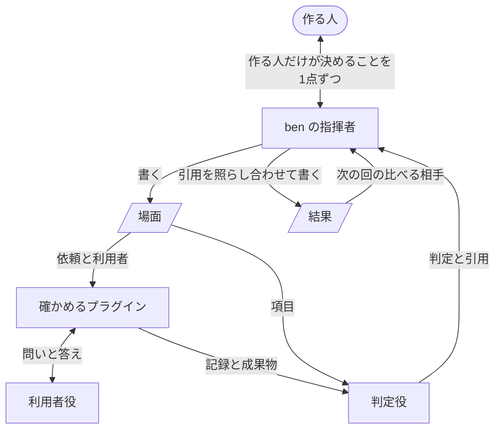

# ben の設計

ben は、プラグインの利用者が README の約束どおりのものを得られるかを確かめる道具と、どのプラグインにも共通の考え方と作り方を持つプラグインです。この設計書は、ben を作る人、直す人が、ここに書かれた方針から実装を導くためのものです。書かれていない場面に出会ったら、どの方針に当たるかを見て決めます。

## 用語

- 作る人は、プラグインを作り、ben で確かめる人です。

- 約束は、確かめるプラグインの README が、利用者に約束していることです。

- 成果物は、確かめるプラグインが利用者に渡すものです。

- 場面は、確かめの単位です。

    どんな利用者が、どんなリポジトリで、何を頼み、成果物を何に使うかと、約束ごとの合格の項目を持ちます。

- 項目は、利用者に何が起きれば、その約束を得たと言えるかを書いた1文です。

- 指揮者は、ben の中で判断する役です。

- 利用者役は、場面の利用者として確かめるプラグインと話し、成果物を使う AI です。

    話し合いも項目も知りません。

- 判定役は、項目ごとに、起きたことが項目どおりかを決める AI です。

- 記録は、Claude Code が会話ごと、エージェントごとに残すやりとりの全記録で、JSONL のファイルです。

- 結果は、1回の確かめで残るファイルです。

- 印は、場面の中身から作る文字列で、結果がどの場面のものかを見分けます。

- 欠けは、利用者が約束を得られなかった所です。

## 1. 方針

### 合格の基準は、走らせる前に、利用者に起きることで書く

項目は場面と一緒に、走らせる前に書き、出力の形でなく、利用者に起きることで書きます。

走らせてから書くと、見たものに合わせて基準が甘くなります。出力の形で書いた基準は、利用者が約束を得ていなくても通ります。

### 出すかどうかを決めるのは作る人

ben は、起きたことと数値を示すだけで、良くなった、悪くなったとは言いません。

数値だけで決めると、待ち時間が減った代わりに約束を逃した変更を、良いと取り違えます。何を大事にするかは、作る人にしか決められません。

### 足すのは欠けのためだけ、直すのは原因

ben 自身も、どのプラグインも、最小から始め、ben で欠けが見つかった所だけを足します。欠けは、結果の証拠から記録をたどって原因を突き止め、原因を直します。症状を抑える継ぎ足しはしません。

症状ごとに足すと太り、どの部分がどの約束に仕えるかが見えなくなります。症状だけを抑えると、同じ原因が別の所で出ます。

## 2. 機能

各機能が仕えるのは、[ben/README.md](../../ben/README.md) の「得られること」の項です。

- 場面を一緒に書きます。

    「変更が役に立ったかを、出力の見た目でなく、利用者に起きたことで判断できる」に仕えます。作る人には、作る人にしか決められないこと、つまり利用者は誰か、何をしたいか、何が起きればよいか、いま使っている版、場面をどこに置くかだけを聞き、約束は README の言葉のまま写します。場面は、約束がなければ利用者がはっきり困るものを選びます。ほかの道具でも同じようにこなせる場面では、通っても何も示さないからです。

- 利用者として走らせます。

    「変更が役に立ったかを、出力の見た目でなく、利用者に起きたことで判断できる」と「まぐれの1回に惑わされない」に仕えます。確かめるプラグインを本物のセッションで走らせ、利用者役が答え、終わったら成果物を使います。turn のように利用者が別のプラグインであるものは、それを呼ぶプラグインを通して走らせます。

    同じ場面を何回か走らせ、回によって分かれた項目をそのまま示します。

    AI のプラグインは、同じ依頼でも回ごとに振る舞いが変わります。1回の合格は、まぐれと見分けられません。

- 判定します。

    「判定の理由を、その場で確かめられる」に仕えます。中身の指標は DeepEval で測り、判定役のモデルには `claude -p` を通した Claude を使います。指標を自前で作らないのは、正しさや忠実さが、ほかの評価と同じ意味を持つようにするためです。結果を書く前に、引用が記録のその場所にあるかを機械で照らし合わせます。

    判定役は、項目ごとに理由と、記録のどこに何があったかの引用を返します。引用が記録にない判定は、数えません。

    判定役も AI なので、もっともらしい根拠を作ることがあります。確かめていない判定を数えると、作る人はそれを事実として出すかどうかを決めてしまいます。

- 測ります。

    「中身と、待ち時間や費用を、同じ1つの結果で見られる」に仕えます。時間、利用者の待ち時間、答えた回数、読んだ量、トークンは、記録から機械が数え、回ごとと中央値を残します。読んだ量は文字数で数えます。人が読む手間にいちばん近く、モデルを替えても数え方が変わらないからです。

- 結果を残し、前回と比べます。

    「古い版を走らせ直さずに、変更で何が動いたかが分かる」に仕えます。

    改善は、同じ場面、同じモデルで残っている前回の結果と比べます。比べられる結果がない時だけ、場面に書いた、いま使っている版を走らせます。

    結果が残っていれば、古い版を走らせ直す時間と費用が要りません。どのマシンで確かめても、同じものと比べられます。

- 考え方と作り方を示します。

    「どのプラグインも、同じ順で考え、同じ土台の上に作れる」に仕えます。README に置きます。

## 3. 登場人物と依存

- 作る人は、利用者は誰か、何が起きればよいか、出すかどうかを決めます。

- ben の指揮者は、作る人と場面を書き、走らせ、判定を照らし合わせて結果を残し、作る人に伝えます。

    良し悪しは決めません。

- 利用者役は、場面の利用者として答え、成果物を使います。

    項目も、プラグインの作り方も知りません。知っていると、項目に沿って使ってしまい、利用者がつまずく所が見えなくなるからです。

- 判定役は、項目ごとに判定し、理由と引用を返します。

    結果のファイルは書きません。

## 4. 作る人のリポジトリに残すもの

場面と結果は、作る人がコミットし、後の確かめ、後の版の ben、人が読みます。形を変える時は、それを読む側が壊れないかを見ます。

### 場面

場面のファイルは、確かめるプラグイン、いま使っている版、確かめる時のリポジトリと事前の準備、依頼、利用者がどんな人で何をしたいか、成果物を何に使うか、正しい成果物が持つ事実があればそれ、走らせる回数、約束ごとの項目を持ちます。

- 約束の言葉は、README のまま写します。

    README が言い換えられた時に、どの約束を確かめた結果かが分かるためです。

- 場面のどこかを変えると、新しい場面になり、前の結果とは比べません。

    どこを変えても、利用者に起きることが変わりうるからです。走らせる回数だけは、利用者に起きることを変えないので、変えても同じ場面です。結果は、印でどの場面のものかを見分けます。

### 結果

結果は、場面ごとのフォルダに、確かめた版と日時を名前にした md のファイルとして残します。どのプラグインでも同じ形で、人がそのまま読み、次の回の ben がそこから読み取って比べます。機械向けの写しを別に持たないのは、同じ中身の写しが2つあると食い違うからです。形は ben のスクリプトが書くので崩れません。

- 先頭に、プラグイン、版、コミット、日時、場面とその印、使ったモデル、回数、比べた相手、形の番号を持ちます。

    次の回は、同じ場面の印と同じモデルの結果だけを比べる相手にします。

- 本文は、結論、根拠、証拠の順です。

    結論は約束ごとに何回中何回得られたかと前回の値、根拠は回ごとの判定と理由・指標・数値、証拠は記録の場所と引用です。作る人は結論から読み、必要な所だけ下ります。

- 次の回の ben が読むのは、先頭、結論、根拠の数値です。

    証拠は人が読むためのもので、形を自由に変えられます。

- ben が読む部分の形は、番号を持ちます。

    その形を変える時は形の番号を上げ、前の番号の結果は比べる相手にしません。読めない形を読み違えて比べるより、比べないほうがよいからです。

## 5. ben 自身の確かめ方

ben の約束は、作る人が結果だけを読んで、記録を読み込んだ人と同じ判断を下せることです。

- 合格は、作る人に起きることで決めます。

    利用者が約束を逃すとはっきり分かっている変更と、逃しを直した変更を、作る人役がそれぞれ結果だけを読んで判断し、記録を全部読んだ人と同じ判断になれば合格です。

- 場面は、見た目では良くなるのに利用者は困る変更にします。

    テストが通り、出力が整っているのに利用者がつまずく変更でこそ、ben がないと作る人が見逃すからです。

- 引用の照らし合わせや結果の読み書きのように、機械で決まることは、ben のテストが受け持ちます。
