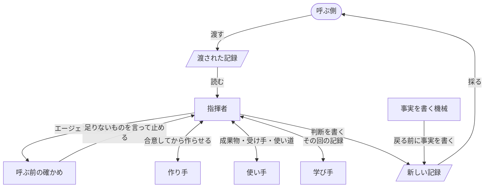

# turn の設計

turn は、AI に何かを作らせるプラグインから呼ばれ、タスク1つを終わりまで運ぶプラグインです。この設計書は、turn を作る人、直す人が、ここに書かれた方針から実装を導くためのものです。書かれていない場面に出会ったら、どの方針に当たるかを見て決めます。

## 用語

- 呼ぶ側は、turn を呼ぶプラグインです。

    利用者と話し、タスクの並びを持ちます。

- 記録（CCS）は、タスクの状態を書いたファイルです。

    Bousetouane「AI Agents Need Memory Control Over More Context」（arXiv 2601.11653）の形で、ゴール、制約、注目するもの、不確かなこと、次の一手など、決まった9つの部分を持ちます。

- 指揮者は、turn の中で判断する役です。

    `turn:up` の指示を受けた、メインの会話です。

- 作り手は、成果物を作るか直すエージェントです。

- 使い手は、成果物を受け手として使い、起きたことを返すエージェントです。

- 学び手は、使い手が使うたびに、その回の記録から学びを出すエージェントです。

- 成果物は、作り手が作るものです。

- 受け手は、成果物を受け取って使う人です。

- 受け入れ基準は、受け手が成果物で何をできれば合格かです。

- 差は、受け入れ基準と、使ってみて起きたこととの食い違いです。

- 回は、1つのエージェントを1回起動してから返事を受け取るまでです。

- JSONL は、Claude Code が会話ごと、エージェントごとに、そのマシンに残すやりとりの全記録です。

## 1. 全体に効く方針

### タスク1つを、一続きの仕事として受け持つ

turn は、渡されたタスクを、受け入れ基準を満たすか、呼ぶ側の判断が要る所まで運びます。中で作り手、使い手、学び手を分けるのは、作った本人が自分の成果物を確かめないようにし、作る、使う、学ぶの各作業を、それだけを渡されたエージェントが集中してするためです。

人なら、作って、使ってみて、直すまでを1人でします。仕事の単位はタスクで、役を分けたのは、AI が自分の作ったものに甘くなるのを避け、指揮者も各エージェントもずれないようにするためです。1つの作業だけを持つエージェントは、その作業からずれません。作業の中身まで指揮者の会話に入ると、長い記録で埋まり、タスクのゴールからずれていきます。

### 判断するのは指揮者だけ

作り手、使い手、学び手は、自分の成果を返すだけで、良し悪しも次の一手も決めません。

判断がエージェントに散ると、話し合いを知らないエージェントが、目的に合っているものまで作り直します。

### 受け取った記録は変えず、新しい記録を返す

turn は渡された記録を書き換えず、新しい記録を作って返します。返した記録を今の状態として採るのは、呼ぶ側です。

確定した状態が壊れなければ、途中で切れた turn は、渡された記録からやり直すだけで済みます。turn は呼ぶ側の状態を勝手に変えません。

### 利用者とは話さず、利用者が決めることは呼ぶ側へ返す

turn は利用者に何も聞きません。利用者にしか決められないことは、新しい記録に入れて返します。

何を利用者に決めてもらうかは、ゴールと利用者を知る呼ぶ側にしか判断できません。turn の中で決めると、利用者の知らない決めごとが成果物に入ります。

### 事実は、エージェントの言い分でなく記録から機械が書く

各エージェントが何を読み、何を書き、何を実行したかは、JSONL と git から機械が書きます。turn の途中で写さず、終えた時も止めた時も、戻る前に1回だけ書きます。新しい記録の書き手は、判断を書く指揮者と、事実を書くこの機械の2つで、書く部分が分かれています。

言い分は、したこと以上を言いえます。指揮者が途中で事実を写すと、同じ部分に書き手が2人いることになり、食い違います。

### 足すのは欠けのためだけ、直すのは原因

最小から始め、試走で確かめて欠けが見つかった所だけを足します。欠けは、JSONL をたどって原因を突き止め、原因を直します。待つ、確かめを緩める、例外を足す、といった症状を抑える継ぎ足しはしません。

症状ごとに足すと太り、利用者を待たせ、どの部分が何に仕えるかが見えなくなります。症状だけを抑えると、同じ原因が別の所で出ます。

## 2. 機能

各機能が仕えるのは、[turn/README.md](../../turn/README.md) の「プラグインにとって」と「プラグインの利用者にとって」の項です。

- 作って、使わせて、差だけ直します。

    「作る、使ってみる、直す、の流れを自分で書かずに済む」と「見せられるものは、すでに使われ、足りない所が直っている」に仕えます。

    - 作り手には、作る前に何をどう作るかと不明点を返させ、合意してから作らせます。作ってからずれに気づくと、作り直しになるからです。
    - 使い手には、成果物、受け手、何に使うかだけを渡し、すぐ使わせます。受け入れ基準も作り方も渡しません。知っていると、それに沿って使ってしまい、受け手がつまずく所が見えなくなるからです。使い方を前もって合わせることもしません。受け手はただ使うだけだからです。
    - 差だけを直し、つまずいた所だけを使い直させます。全体を作り直すと、良い所まで壊すからです。同じ差が2度直らなければ、作り方か受け入れ基準が違うので、呼ぶ側へ返します。

- 何も作らないプラグインには、使うところから始めます。

    「見せられるものは、すでに使われ、足りない所が直っている」に仕えます。すでにある成果物を確かめるだけのプラグインでも、利用者に見せる前に、使い手が受け手として成果物を使います。差は直さず、すべて呼ぶ側へ返します。

- 新しい記録を返します。

    「成果物を読まずに、返ってきた記録だけで次の一手を決められる」に仕えます。差ごとの終わり方、利用者が決めること、学んだ進め方、次にすることを書きます。

- 利用者が決めることを返します。

    「聞かれるのは、自分が決めることだけ」に仕えます。

- 使うたびに学びます。

    「同じつまずきを、タスクの中で2度しない」に仕えます。学び手には、その回の記録を渡し、すぐ学ばせます。何を読むかは渡したもので決まっているので、前もって合わせることはしません。成果物について学んだことはその場で直し、進め方について学んだことはそのタスクの残りで守って、呼ぶ側へ返します。

- 止めた所から続けます。

    「途中で止めても、別のマシンでも、続きから進む」に仕えます。利用者が止めた時は、終わった回までと次にすることを新しい記録に書いて返します。急に切れた turn は、渡された記録からやり直します。途中の頭の中を確定させると、書きかけを頼りに続けることになるからです。

- エージェントを呼ぶ前に確かめます。

    「見せられるものは、すでに使われ、足りない所が直っている」と「同じつまずきを、タスクの中で2度しない」が抜けないようにします。渡された記録に欠かせないものがないまま、使い手が使わないまま、学び手が学ばないまま、進めず、終わらせません。確かめは記録を読むだけで、止める時は何が足りないかを言います。指揮者がそれを済ませれば、先へ進めるようにするためです。

- 自分のエージェントと、渡されたタスクにだけ働きます。

    「ほかの作業に触れない」に仕えます。利用者は、ほかのセッションや、自分で書いていないプラグインを並べて使うからです。

## 3. 登場人物と依存

- 呼ぶ側は、利用者と話し、タスクを選び、記録を渡し、返った記録を採ります。

- 指揮者は、記録を読み、エージェントに頼み、判断し、新しい記録を書きます。

    作る、使う、学ぶことはしません。

- 作り手は、成果物を作るか直します。推測なしに作れなければ、作らずに不明点を返します。

- 使い手は、受け手として1回使い、頼りにする記述を実物で確かめ、起きたことを返します。

    良し悪しは判断しません。

- 学び手は、その回の記録から、成果物について学んだことと、進め方について学んだことを返します。

    判断も、直すこともしません。

- 作り手は Sonnet、使い手と学び手は Opus で動きます。

- 呼ぶ前の確かめは、指揮者がエージェントを呼ぶたびに、渡された記録に欠かせないものがあるか、使い手と学び手が抜けていないかを見ます。

- 事実を書く機械は、turn が戻る前に、JSONL と git から各エージェントのしたことを新しい記録に書きます。

## 4. 呼ぶ側と取り交わす記録

記録は、呼ぶ側が書いて渡し、turn が新しく作って返します。turn と呼ぶ側の取り決めで、後の版の turn も、あとで記録を読む人も、これを読みます。

渡す記録は、次の5つを必ず持ちます。turn は、これだけから始められます。

- `focal_entities` の `work` は、成果物の置き場所です。

    作り手が作り、使い手が使う物を、1つに決めるためです。

- `focal_entities` の `receiver` は、受け手です。

    使い手は、この人として使います。

- `goal_orientation` の `acceptance` は、受け入れ基準です。

    指揮者は、これと起きたことを比べて差を見ます。

- `goal_orientation` の `use` は、受け手が何に使うかです。

    使い手は、これを実際にします。

- `constraints` の `language` は、言語です。

    成果物と返す記録を、呼ぶ側と利用者が読める言葉で書くためです。

次の2つは、あれば足します。

- `retrieved_artifacts` の `source` は、成果物の元にする資料です。

    作り手が推測なしに作るためです。

- `constraints` の `rule` は、前のタスクで学んだ進め方です。

    前のタスクでしたつまずきを、このタスクでしないためです。

返す記録は、渡されたものに加えて、次の5つを持ちます。呼ぶ側は、成果物を読まずに、ここから次の一手を決めます。

- `goal_orientation` の `difference` は、差ごとの終わり方です。

    直した、理由を添えて見送った、理由を添えて呼ぶ側に任せた、のどれかで、呼ぶ側は何が残ったかだけを見ればよくなります。

- `uncertainty_signal` の `gap` は、利用者にしか決められないことです。

    呼ぶ側は、これを利用者に聞きます。

- `semantic_gist` の `process` は、学んだ進め方です。

    呼ぶ側は、これを次のタスクに `rule` として渡せます。

- `episodic_trace` は、各エージェントが何を読み、何を書き、何を実行したかです。

    エージェントの言い分でなく、あとで確かめられる事実を残すためです。

- `predictive_cue` の `next` は、次にすることです。

    終わったか、呼ぶ側が決めることか、止めた turn がどこから続くかを、呼ぶ側が1か所で知るためです。

記録について、次を守ります。

- 一度渡した記録、返した記録は、誰も書き換えません。

    どの記録も、ある turn が始めた時か終えた時の状態のままであれば、やり直す turn も、あとで読む人も、それを頼りにできます。

- 部分の名前と、項目の種類の名前は変えません。足すことは壊しません。

    turn は知らない行も残すので、足しても前の版の記録を読めます。名前を変えると、後の版が今の記録を読み違えます。

## 5. 確かめ方

turn は試走で確かめます。turn の利用者は呼ぶ側のプラグインなので、それを呼ぶ小さなプラグインを通して、その先の利用者に起きることで決めます。起きたことは、試走の JSONL を読んで事実で判断します。

- 合格は、利用者と呼ぶ側に起きることで決めます。

    受け手が成果物どおりに1回使って、つまずかず、誰にも聞かずに目的を果たすこと。呼ぶ側が、成果物を読まずに、返った記録だけで次の一手を決められることです。

- 場面は、作り手1人では気づきにくい落とし穴のある成果物にします。

    turn がなくても困らない場面では、通っても何も示さないからです。

- 呼ぶ前の確かめが止めるべきものを止めるか、記録を書き換えないかのように、機械で決まることは、turn のテストが受け持ちます。
