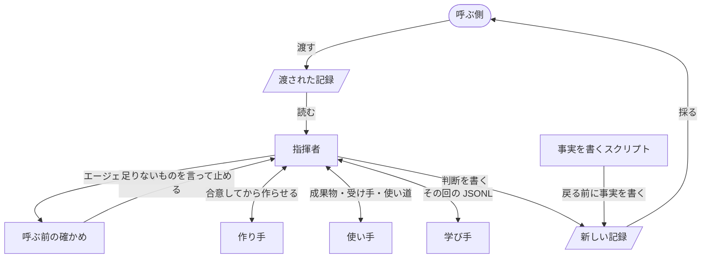

# turn の設計

turn は、AI に何かを作らせるプラグインから呼ばれ、タスク1つを終わりまで運ぶプラグインです。この設計書は、turn を作る人、直す人が、ここに書かれた方針から実装を導くためのものです。書かれていない場面に出会ったら、どの方針に当たるかを見て決めます。

## 用語

- 呼ぶ側は、turn を呼ぶプラグインです。

    利用者と話し、タスクの並びを持ちます。

- `turn:up` は、呼ぶ側が turn を呼ぶスキルです。

- 記録（CCS、Compressed Cognitive State）は、タスクの状態を書いたファイルです。

    Bousetouane「AI Agents Need Memory Control Over More Context」（arXiv 2601.11653）の形で、ゴール、制約、注目するもの、不確かなこと、次の一手など、決まった9つの部分を持ちます。会話の全部でなく、決まった部分だけで状態を持つので、新しい turn も呼ぶ側も、記録だけから続けられます。

- 回は、1つのエージェントを1回起動してから返事を受け取るまでです。

- JSONL は、Claude Code が会話ごと、エージェントごとに、そのマシンに残すやりとりの全記録です。

- 指揮者は、turn の中で判断する役です。

    `turn:up` の指示を受けた、メインの会話です。

- 作り手は、成果物を作るか直すエージェントです。

- 使い手は、成果物を受け手として使い、起きたことを返すエージェントです。

- 学び手は、使い手が使うたびに、その回の JSONL から学びを出すエージェントです。

- 成果物は、作り手が作るものです。

- 受け手は、成果物を受け取って使う人です。

- 受け入れ基準は、受け手が成果物で何をできれば合格かです。

- 差は、受け入れ基準と、使ってみて起きたこととの食い違いです。

- ben は、プラグインの利用者が README の約束どおりのものを得られるかを確かめる、同じマーケットプレイスのプラグインです。

## 1. 全体に効く方針

### タスク1つを、一続きの仕事として受け持つ

turn は、渡されたタスクを、受け入れ基準を満たすか、呼ぶ側の判断が要る所まで運びます。中で作り手、使い手、学び手を分けるのは、作った本人が自分の成果物を確かめないようにし、作る、使う、学ぶの各作業を、それだけを渡されたエージェントが集中してするためです。

人なら、作って、使ってみて、直すまでを1人でします。仕事の単位はタスクで、役を分けたのは、AI が自分の作ったものに甘くなるのを避け、指揮者も各エージェントもずれないようにするためです。この分け方は、1つの作業だけを持つエージェントはその作業からずれにくく、作業の中身まで指揮者の会話に入ると長い記録で埋まってタスクのゴールからずれていく、という見立てに立っています。見立てが合っているかは、5章の約束で確かめます。

### 判断するのは指揮者だけ

作り手、使い手、学び手は、自分の成果を返すだけで、良し悪しも次の一手も決めません。

判断がエージェントに散ると、話し合いを知らないエージェントが合否や直す所を決め、目的に合っている所まで変えられて、そこが壊れます。

### 受け取った記録は変えず、新しい記録を返す

turn は渡された記録を書き換えず、新しい記録を作って返します。返した記録を今の状態として採るのは、呼ぶ側です。一度渡した記録、返した記録は、誰も書き換えません。

どの記録も、ある turn が始めた時か終えた時の状態のままであれば、途中で切れた turn は渡された記録からやり直すだけで済み、あとで読む人もそれを頼りにできます。README の「途中で止めても、別のマシンでも、続きから進む」は、これを土台にしています。turn は呼ぶ側の状態を勝手に変えません。

### 利用者とは話さず、利用者が決めることは呼ぶ側へ返す

turn は利用者に何も聞きません。利用者にしか決められないことは、新しい記録に入れて返します。

何を利用者に決めてもらうかは、ゴールと利用者を知る呼ぶ側にしか判断できません。turn の中で決めると、利用者の知らない決めごとが成果物に入ります。

### 事実は、エージェントの言い分でなく記録から機械が書く

各エージェントが何を読み、何を書き、何を実行したかは、JSONL と git から turn のスクリプトが書きます。新しい記録の書き手は、判断を書く指揮者と、事実を書くこのスクリプトの2つで、書く部分が分かれています。どちらも turn の途中では書かず、終えた時も止めた時も、戻る前に指揮者が判断を書き、そのあとスクリプトが事実を書きます。

呼ぶ側は成果物を読まずに記録だけで次の一手を決めるので、記録が事実と違えば判断を誤ります。言い分は、したこと以上を言いえます。指揮者が途中で事実を写すと、同じ部分に書き手が2人いることになり、食い違います。

### 足すのは欠けのためだけ、直すのは原因

最小から始め、ben で確かめて欠けが見つかった所だけを足します。欠けは、JSONL をたどって原因を突き止め、原因を直します。待つ、確かめを緩める、例外を足す、といった症状を抑える継ぎ足しはしません。

症状ごとに足すと太り、利用者を待たせ、どの部分が何に仕えるかが見えなくなります。症状だけを抑えると、同じ原因が別の所で出ます。

## 2. 機能

各機能が仕えるのは、[turn/README.md](../../turn/README.md) の「プラグインが得ること」と「プラグインの利用者が得ること」の項です。1回の turn は、作り方を合意して作る、使う、学ぶ、差を直して使い直す、を差がなくなるか呼ぶ側の判断が要るまで繰り返し、戻る前に事実を書きます。

### 作って、使わせて、差だけ直す

「作る、使ってみる、直す、の流れを自分で書かずに済む」と「見せられるものは、すでに使われ、足りない所が直っている」に仕えます。README の「turn を呼ぶ」で働きます。この流れが turn の1か所にあるので、流れを良くする時もそこだけを直せば、どのプラグインにも届きます。

- 作り手には、作る前に何をどう作るかと不明点を返させ、合意してから作らせます。作ってからずれに気づくと、作り直しになるからです。
- 使い手には、成果物、受け手、何に使うかだけを渡し、すぐ使わせます。受け入れ基準も作り方も渡しません。知っていると、それに沿って使ってしまい、受け手がつまずく所が見えなくなるからです。使い方を前もって合わせることもしません。受け手はただ使うだけだからです。
- 差だけを作り手に直させ、つまずいた所だけを使い直させます。全体を作り直すと、良い所まで壊すからです。同じ差が2度直らなければ、作り方か受け入れ基準が違うので、呼ぶ側へ返します。受け入れ基準に関わらない差は、直さず理由を添えて見送ります。直すと、受け入れ基準の外で良い所を変えるからです。

### 何も作らないプラグインには、使うところから始める

「見せられるものは、すでに使われ、足りない所が直っている」に仕えます。README の「プラグインごとの部分を置く（domain）」で、`make.md` がない時に働きます。

すでにある成果物を確かめるだけのプラグインでも、利用者に見せる前に、使い手が受け手として成果物を使います。何も直さず、差も、成果物について学んだことも、すべて呼ぶ側へ返します。

### 新しい記録を返す

「成果物を読まずに、返ってきた記録だけで次の一手を決められる」に仕えます。README の「返ってきた記録で次を決める」で働きます。

差ごとの終わり方、利用者が決めること、学んだ進め方、次にすることを書きます。

### 利用者が決めることを返す

「聞かれるのは、自分が決めることだけ」に仕えます。README の「返ってきた記録で次を決める」で、呼ぶ側が `gap` を聞く所で働きます。

作り手の不明点も、使ってみて出た差も、指揮者がまず渡された記録とリポジトリで決められないかを見ます。決められず、利用者にしか決められないものだけを `gap` に書いて返し、それにかかる差は直さずに残します。調べれば分かることまで返すと、利用者の時間を、利用者の決めることでないものに使わせるからです。

### 使うたびに学ぶ

「同じつまずきを、タスクの中で2度しない」に仕えます。README の「返ってくる記録」の `process` に表れます。

学び手には、その回の JSONL を渡し、すぐ学ばせます。何を読むかは渡したもので決まっているので、前もって合わせることはしません。成果物について学んだことは作り手にその場で直させ、進め方について学んだことは、以後の回で作り手と使い手に渡す指示に加えてそのタスクの残りで守り、呼ぶ側へ返します。

### 止めた所から続ける

「途中で止めても、別のマシンでも、続きから進む」に仕えます。README の「返ってきた記録で次を決める」で働きます。

利用者は、指揮者のいるメインの会話に割り込んで止めるよう伝えます。指揮者は、終わった回までと次にすることを新しい記録に書いて返します。止めた turn を呼び直された時は、渡された記録の `next`、`difference`、`episodic_trace` から、どの回まで終わったかを知って続けます。急に切れた turn は、渡された記録からやり直し、切れるまでに書き換わった成果物は、そのまま使ってみて直します。やり直した回の時間とトークンはかかりますが、途中の状態を記録に書き出していくと、書きかけを頼りに続けることになり、成果物を壊すからです。

### エージェントを呼ぶ前に確かめる

「見せられるものは、すでに使われ、足りない所が直っている」と「同じつまずきを、タスクの中で2度しない」に仕えます。README の「必要なもの」の `python3` で動きます。

使い手が使わないまま、学び手が学ばないまま、終わらせません。確かめは、作り手が作るか直したあとに使い手が呼ばれたか、使い手のあとに学び手が呼ばれたかを、エージェントを呼ぶ道具が使われる前に Claude Code のフックで、その turn の JSONL から見るだけで、止める時は何が足りないかを言います。`python3` がなければ止まり、入れるよう利用者に伝えてほしいと `next` に書いて返します。指揮者がそれを済ませれば、先へ進めるようにするためです。

### 自分のエージェントと、渡されたタスクにだけ働く

「ほかの作業に触れない」に仕えます。README の「turn を呼ぶ」の `out` と、「プラグインに残ること」の push に表れます。

指揮者が呼んだエージェントだけを待ち、読み、止めます。書くのは渡されたタスクの成果物と `out` だけで、リポジトリの外には書かず、push もしません。利用者は、ほかのセッションや、自分で書いていないプラグインを並べて使うからです。

## 3. 登場人物と依存

- 呼ぶ側は、利用者と話し、タスクを選び、記録を渡し、返った記録を採ります。

- 指揮者は、記録を読み、エージェントに頼み、判断し、新しい記録を書きます。

    作る、使う、学ぶことはしません。

- 作り手は、成果物を作るか直します。推測なしに作れなければ、作らずに不明点を返します。

- 使い手は、受け手として1回使い、頼りにする記述を実物で確かめ、起きたことを返します。

    良し悪しは判断しません。

- 学び手は、その回の JSONL から、成果物について学んだことと、進め方について学んだことを返します。

    判断も、直すこともしません。

- 呼ぶ前の確かめは、指揮者がエージェントを呼ぶたびに、使い手と学び手が抜けていないかを見ます。

- 事実を書くスクリプトは、turn が戻る前に、JSONL と git から各エージェントのしたことを新しい記録に書きます。

## 4. 呼ぶ側と取り交わすもの

呼び方、プラグインごとの部分、記録は、turn と呼ぶ側の取り決めで、後の版の turn も、あとで記録を読む人も、これを読みます。

### 呼び方

呼ぶ側は `turn:up` を、`in`（渡す記録）、`out`（新しい記録を書く場所）、`domain`（プラグインごとの部分のフォルダ）の3行を引数にして呼びます。

`out` を呼ぶ側が決めるのは、記録の置き場所と名前を、記録を持つ呼ぶ側が決めるためです。

### プラグインごとの部分

`domain` のフォルダには、作り手が最初に読む `make.md`、使い手の `use.md`、学び手の `learn.md`、指揮者の `conductor.md` を置きます。`conductor.md` には、エージェントに何を渡し、どう判断するかの、そのプラグインならではのことを書き、なくてもよいものです。`make.md` がなければ何も作らないプラグインとして扱います。ファイルの名前と3行の引数の名前は変えません。中身の形は決めません。

turn が知りえない、何を作り、それがどう使われるかだけを、呼ぶ側が持つためです。

### 記録

記録は YAML で、CCS の9つの部分（`episodic_trace`、`semantic_gist`、`focal_entities`、`relational_map`、`goal_orientation`、`constraints`、`predictive_cue`、`uncertainty_signal`、`retrieved_artifacts`）ごとに、`種類: "値"` の行を並べます。turn が読み書きするのは下に挙げる渡す種類と返す種類だけで、ほかの部分と種類の行もそのまま残します。値の書き方は、終わり方の印と `done` のほかは決めず、行の順に意味は持たせません。

渡す記録は、次の5つを必ず持ちます。turn は、これだけから始められます。

- `focal_entities` の `work` は、成果物の置き場所です。

    作り手が作り、使い手が使う物を、1つに決めるためです。

- `focal_entities` の `receiver` は、受け手です。

    使い手は、この人として使います。

- `goal_orientation` の `acceptance` は、受け入れ基準です。

    指揮者は、これと起きたことを比べて差を見ます。

- `goal_orientation` の `use` は、受け手が何に使うかです。

    使い手は、これを実際にします。

- `constraints` の `language` は、言語です。

    成果物と返す記録を、呼ぶ側と利用者が読める言葉で書くためです。

次の3つは、あれば足します。

- `retrieved_artifacts` の `source` は、成果物の元にする資料です。

    作り手が推測なしに作るためです。

- `constraints` の `rule` は、前のタスクで学んだ進め方です。

    前のタスクでしたつまずきを、このタスクでしないためです。

- `constraints` の `decision` は、利用者が決めたことです。

    返した `gap` への答えを、turn が利用者の決めたこととして守るためです。

返す記録は、渡されたものに加えて、次の5つを持ちます。呼ぶ側は、成果物を読まずに、ここから次の一手を決めます。

- `goal_orientation` の `difference` は、差ごとの終わり方です。

    値の終わりに、直した（`→ fixed`）、理由を添えて見送った（`→ let go: 理由`）、理由を添えて呼ぶ側に任せた（`→ to the caller: 理由`）のどれかを付けます。呼ぶ側は何が残ったかだけを見ればよくなります。

- `uncertainty_signal` の `gap` は、利用者にしか決められないことです。

    呼ぶ側は、これを利用者に聞きます。

- `semantic_gist` の `process` は、学んだ進め方です。

    呼ぶ側は、これを次のタスクに `rule` として渡せます。

- `episodic_trace` は、各エージェントが何を読み、何を書き、何を実行したかです。

    エージェントの言い分でなく、あとで確かめられる事実を残すためです。

- `predictive_cue` の `next` は、次にすることです。

    終わったら `done`、そうでなければ次にすることを書きます。終わったか、呼ぶ側が決めることか、止めた turn がどこから続くかを、呼ぶ側が1か所で知るためです。

部分の名前と、種類の名前と、終わり方の印は変えません。種類を足すことは壊しません。終わり方の印を足すと、前の版の呼ぶ側がその差を読めないので、名前を変えるのと同じに扱います。

turn は知らない行も残すので、足しても前の版の記録を読めます。名前を変えると、後の版が今の記録を読み違えます。

## 5. 確かめ方

turn は [ben](../../ben/README.md) で確かめます。場面、項目、利用者役は ben の言葉です。turn の利用者は呼ぶ側のプラグインなので、文書を1つ作るタスクを turn に渡すだけの小さなプラグインを通して確かめます。受け手は、turn の使い手とは別の、ben の利用者役が務めます。つまずいたかどうかは ben の場面の項目で決め、走らせる回数も ben の場面に従います。

約束ごとの合格は、次のことが起きることです。

- 作る、使ってみる、直す、の流れを自分で書かずに済む：小さなプラグインが `turn:up` を1度呼ぶだけで、直った成果物と記録が返ること。

- 成果物を読まずに、記録だけで次の一手を決められる：記録だけを読んだ呼ぶ側が、成果物も JSONL も読んだ人と同じ次の一手を選ぶこと。

- 見せられるものは、すでに使われ、足りない所が直っている：受け手が成果物どおりに1回使って、つまずかず、誰にも聞かずに目的を果たすこと。

- 聞かれるのは、自分が決めることだけ：返った `gap` がどれも利用者にしか決められないことで、利用者にしか決められないことが `gap` 以外で決められていないこと。

- 同じつまずきを、タスクの中で2度しない：一度学んだ進め方に当たるつまずきが、そのタスクの残りの回に出ないこと。

- 途中で止めても、別のマシンでも、続きから進む：途中で止めた turn を、返った記録だけを持って別の作業ツリーで呼び直すと、終わった回をやり直さずに終わること。やり直していないかは、`episodic_trace` で見ます。途中で会話を切った turn を同じ `in` で呼び直すと、終わりまで進むこと。

- ほかの作業に触れない：並べて動かしたほかのセッションのファイルとエージェントが、turn の前後で変わらないこと。

場面は、作り手1人では気づきにくい落とし穴のある成果物にします。たとえば、書いた本人の環境では当たり前で手順書に書き漏らしやすい前提がある、新人向けの手順書です。turn がなくても困らない場面では、通っても何も示さないからです。

確かめの手間は、上の約束にかけます。呼ぶ前の確かめが止めるべきものを止めるか、記録を書き換えないかのように、機械で決まることは、turn のテストが受け持ちます。
