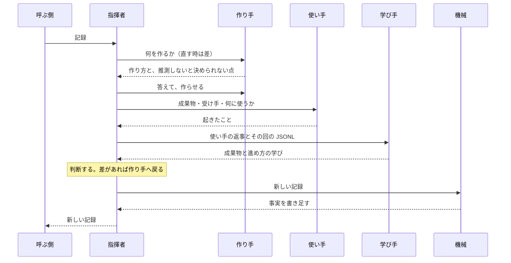

# turn の設計

この設計書は、turn を作る人、直す人のためのものです。[README](../../turn/README.md) の約束のそれぞれを、どの機能がどう届けるか、それをどう確かめるかを書きます。変更が設計に合うかは、ここの方針に照らし、利用者が何を失うかで決めます。書かれていない場面に出会ったら、どの方針に当たるかを見て決めます。

## 用語

- 呼ぶ側は、turn を呼ぶプラグインです。

    利用者と話し、タスクの並びを持ちます。

- 記録は、タスクの状態を書いたファイルで、呼ぶ側と turn がやりとりします。

- 指揮者は、turn の中で判断する役で、`turn:up` の指示を受けたメインの会話です。

- 作り手は成果物を作るか直すエージェント、使い手は成果物を受け手として使うエージェント、学び手は使ったあとに学びを出すエージェントです。

- 受け手は、成果物を受け取って使う人です。

- 受け入れ基準は、受け手が成果物で何をできれば合格かです。

- 差は、受け入れ基準と、使ってみて起きたこととの食い違いです。

- 回は、1つのエージェントを起動してから、その返事を受け取るまでです。

- JSONL は、Claude Code が会話ごと、エージェントごとに、そのマシンに残すやりとりの全記録です。

## 1. 方針

### タスク1つを一続きの仕事として受け持ち、作る、使う、学ぶを別々のエージェントに任せる

人なら1人で、作って、使ってみて、直します。turn もこの一続きを受け持ちます。役を分けるのは、AI のために次の2つを避けるためです。

- 作った本人が自分の成果物を確かめると、甘くなります。

    これが崩れると、「見せられる成果物は、すでに使われ、つまずいた所が直っている」が成り立ちません。

- 1つの会話が多くの作業を抱えると、タスクのゴールからずれます。

    作る、使う、学ぶの中身まで指揮者の会話に入ると、長い記録で埋まります。1つの作業だけを持つエージェントは、その作業からずれません。学び手を使い手と分けるのも同じ理由です。学ぶには、その回の長い記録と、指揮者自身の進め方まで読む必要があります。

### 判断するのは指揮者だけ

作り手、使い手、学び手は、自分の成果を返すだけです。良し悪しも次の一手も決めません。

判断がエージェントに散ると、話し合いを知らないエージェントが、目的に合っているものまで作り直します。そうなると、どの直しが受け入れ基準のためかを、指揮者が説明できなくなります。

### 受け取った記録は変えず、新しい記録を返す

turn は、渡された記録を書き換えません。新しい記録を作って返し、それを今の状態として採るのは呼ぶ側です。

これが崩れると、途中で切れた turn が、壊れた状態から続きを始めます。turn が呼ぶ側の状態を勝手に変えることにもなります。守られていれば、切れた turn は渡された記録からやり直すだけで済み、「途中で止めても、別のマシンでも、続きから進む」が成り立ちます。

### 利用者とは話さず、利用者が決めることは呼ぶ側へ返す

何を利用者に決めてもらうかは、ゴールと利用者を知る呼ぶ側にしか判断できません。turn の中で決めると、利用者の知らない決めごとが成果物に入ります。これが崩れると、「聞かれるのは、利用者にしか決められないことだけ」が成り立ちません。

### 足すのは欠けのためだけ、直すのは原因

最小から始め、確かめて欠けが見つかった所だけを足します。欠けは JSONL をたどって原因を突き止め、原因を直します。

症状ごとに足すと、turn は太り、利用者は待たされ、どの部分がどの約束に仕えるかが見えなくなります。症状だけを抑えると、同じ原因が別の所で出ます。

## 2. 機能

各機能が仕える約束は README の「プラグインにとって」と「プラグインの利用者にとって」の項、働く場面は README の「使い方」の手順です。

### 作って、使わせて、差だけ直す

仕える約束は「流れを自分のスキルに書かずに済む」と「見せられる成果物は、すでに使われ、つまずいた所が直っている」です。働くのは使い方の3（呼ぶ）からです。

- 作り手には、作る前に、何をどう作るかと、推測しないと決められない点を返させます。指揮者が答えてから作らせます。

    作ってからずれに気づくと、作り直しになるからです。

- 使い手には、成果物、受け手、何に使うか、`use.md` だけを渡し、すぐ使わせます。受け入れ基準も作り方も渡しません。

    知っていると、それに沿って使ってしまい、受け手がつまずく所が見えなくなります。

- 差だけを直させ、つまずいた所だけを使い直させます。

    全体を作り直すと、良い所まで壊すからです。受け入れ基準に響かない差は、理由を添えて見送ります。2回直しても残る差は、作り方か受け入れ基準が違うので、呼ぶ側へ返します。

- `make.md` のないプラグインでは、使うところから始め、何も直しません。差はすべて呼ぶ側へ返します。

### 使うたびに学ぶ

仕える約束は「同じつまずきを、タスクの中で繰り返さない」です。

- 学び手には、使い手の返事と、その回の JSONL（指揮者の会話と、その回に呼んだエージェントのもの）と、`learn.md` を渡します。

    使い手の言い分だけでなく、実際に起きたことから学ぶためです。

- 成果物について学んだことは、差として作り手に直させます。

- 進め方について学んだことは、指揮者が決まりとして持ち、タスクの残りで呼ぶどのエージェントにも渡します。新しい記録の `process` にも入れて返します。

    呼ぶ側が次のタスクに渡せば、タスクをまたいでも同じつまずきをしません。

### 利用者が決めることを返す

仕える約束は「聞かれるのは、利用者にしか決められないことだけ」です。働くのは使い方の4です。

- 記録とその資料、利用者の答え、受け入れ基準、プラグインごとの部分（`make.md` など）から決まることは、指揮者が決めます。
- 決まらず、利用者にしか決められないことだけを `gap` に入れ、`next` を `ask the user` にして返します。
- コミットや push のように呼ぶ側が受け持つことは、利用者への問いにしません。

### 新しい記録を返す

仕える約束は「返ってきた記録だけで次の一手を決められる」です。働くのは使い方の4です。

- 指揮者は、差ごとの終わり方、利用者が決めること、学んだ進め方、次にすることを書きます。
- 各エージェントが何を読み、何を書き、何を実行したかは、JSONL と git から機械が書きます。turn が戻る前に1回だけです。

    エージェントの言い分は、したこと以上を言いうるからです。機械は判断を書かず、指揮者は事実を書きません。書き手が部分ごとに分かれているので、食い違いません。

### 止めた所から続ける

仕える約束は「途中で止めても、別のマシンでも、続きから進む」です。働くのは使い方の4の `stopped` です。

- 利用者が会話で止めると、指揮者は新しいエージェントを呼ばずに、返事を受け取り終えた回までを新しい記録に書きます。`next` は `stopped` で、どこから続くかを添えて返します。

    返事を受け取った回は、作った成果物、使い手の返事、学びといった、もう確定した事実です。動いていた1回だけを失います。

- 急に切れた turn は、何も書き残しません。呼ぶ側が同じ記録でもう一度呼び、始めからやり直します。

    途中の頭の中を記録に書くと、書きかけを頼りに続けることになるからです。急に切れることはまれなので、やり直しの手間は小さく済みます。

- 続きに要るものは、すべて記録と成果物にあります。JSONL は要りません。

    呼ぶ側がコミットすれば、別のマシンでも続けられます。

### エージェントを呼ぶ前に確かめる

仕える約束は「見せられる成果物は、すでに使われ、つまずいた所が直っている」と「同じつまずきを、タスクの中で繰り返さない」です。

- 指揮者がエージェントを呼ぶたびに、次の3つを機械が確かめ、欠けていれば何が足りないかを言って止めます。
  - 渡された記録に欠かせない5つがあり、新しい記録の置き場所がまだないこと。
  - 作ったものを使い手が使わないまま、次に進んでいないこと。
  - 使ったあと、学び手が学ばないまま、次に進んでいないこと。
- 戻る時には、返す記録が取り決めの形を守っているかを確かめます。渡された行がすべて残り、各種類が決まった部分の下にあり、差に終わり方が付き、`next` が決まった語の1つで、差や `gap` と食い違わないことです。`next` が `done` なら、使い手と学び手が抜けていないことも確かめます。

    呼ぶ側は、記録をこの形で読んで次の一手を決めるからです。

    確かめは記録を読むだけです。指揮者が欠けを済ませれば、そのまま先へ進めます。

- 確かめは `python3` で動きます。利用者のマシンになければ、止めて、入れるよう伝えてほしいと返します。

### ほかの作業に触れない

仕える約束は「利用者のほかの作業に触れない」です。

- turn は、自分のエージェントと、渡されたタスクにだけ働きます。

    利用者は、ほかのセッションや、自分で書いていないプラグインを並べて使うからです。

- リポジトリの外には書かず、コミットも push もしません。

    コミットと push は、どのタスクをどこまで採るかを決める呼ぶ側のものです。

## 3. 登場人物と依存

1回の `turn:up` の中の流れです。差がなくなるまで、または呼ぶ側の判断が要るまで、作る、使う、学ぶを繰り返します。

指揮者がエージェントを呼ぶたびに、機械が呼ぶ前の確かめをします。

## 4. 呼ぶ側と取り交わす記録

記録は、turn と呼ぶ側の取り決めです。後の版の turn も、あとで記録を読む人も、これを読みます。

### 形

記録の形は、Bousetouane「AI Agents Need Memory Control Over More Context」（arXiv 2601.11653）の CCS に従います。CCS は、自由な要約でなく、決まった名前の部分の集まりで、エージェントが次の一手に要る状態だけを持ちます。turn が使う部分は8つで、論文の残りの1つ（`relational_map`）は使いません。

- ファイルは YAML で、部分ごとに `- 種類: "値"` の行を並べます。値は1行の引用符つき文字列です。

    標準ライブラリの Python だけで読み書きでき、人も読めるようにするためです。

### 渡す記録

次の5つを必ず持ちます。turn はこれだけから始められます。

- `focal_entities` の `work` は、成果物の置き場所です。作り手が作り、使い手が使う物を1つに決めます。
- `focal_entities` の `receiver` は、受け手です。使い手はこの人として使います。
- `goal_orientation` の `acceptance` は、受け入れ基準です。指揮者は、これと起きたことを比べて差を見ます。
- `goal_orientation` の `use` は、受け手が何に使うかです。使い手はこれを実際にします。
- `constraints` の `language` は、成果物と記録を書く言葉です。

次は、あれば足します。

- `retrieved_artifacts` の `source` は、成果物の元にする資料です。作り手が推測せずに作るためです。
- `constraints` の `rule` は、前のタスクで学んだ進め方の決まりです。
- `constraints` の `answer` は、前に返した `gap` への利用者の答えです。

### 返す記録

渡されたものをすべて残し、次を足します。

- `goal_orientation` の `difference` は、差ごとの終わり方です。

    値は、差の説明のあとに、`→ fixed`、`→ let go: <理由>`、`→ to the caller: <理由>` のどれかを付けます。呼ぶ側は、何が残ったかだけを見ればよくなります。

- `uncertainty_signal` の `gap` は、利用者にしか決められないことを、呼ぶ側がそのまま聞ける問いにしたものです。

- `semantic_gist` の `process` は、学んだ進め方の決まりです。呼ぶ側は、次のタスクに `rule` として渡せます。

- `episodic_trace` は、機械が書く事実です。

    種類は `<エージェント>-<何回目か>`（`maker-1` など）か `git` です。値は、`read <パス>`、`wrote <パス>`、`ran <コマンドの1行目>`、`uncommitted <パス>` のどれかです。`uncommitted` は、戻る時にコミットされていない変更のあるファイルで、turn より前からの利用者の変更も含みます。渡された記録にあった行は、前に残します。

- `predictive_cue` の `next` は、次にすることです。

    値は、`done`、`ask the user`、`to the caller: <理由>`、`stopped: <どこから続くか>` のどれかです。呼ぶ側が1か所で、何をすればよいかを知るためです。

### いつも成り立つこと

- 一度渡した記録、返した記録は、誰も書き換えません。

    どの記録も、ある turn が始めた時か終えた時の状態のままなので、やり直す turn も、あとで読む人も、それを頼りにできます。

- 部分の名前、種類の名前、`difference` の終わり方と `next` の値の決まった語は変えません。足すことは壊しません。

    turn は知らない行も残すので、足しても前の版の記録を読めます。名前や決まった語を変えると、後の版が今の記録を読み違えます。

## 5. 確かめ方

turn の利用者は呼ぶ側のプラグインです。そこで、記録を書いて `turn:up` を呼び、返った記録だけを読む小さなプラグインを通して、その先の利用者と呼ぶ側に起きることで確かめます。試走ではそのプラグインを実際に動かし、起きたことは試走の JSONL を読んで事実で判断します。

確かめる手間は、まず次の約束に向けます。

| 約束 | 合格 | 場面 |
|---|---|---|
| 返ってきた記録だけで次の一手を決められる | 返った記録だけを読んだ呼ぶ側が、成果物も読んだ時と同じ次の一手を選ぶ | 差が直ったもの、見送ったもの、呼ぶ側に任せたものが混ざる |
| 見せられる成果物は、すでに使われ、つまずいた所が直っている | 何も知らない新しい受け手が、返った成果物を1回使い、つまずかず、誰にも聞かずに受け入れ基準を満たす | 作り手がコードを読むだけでは気づきにくい落とし穴がある |
| 聞かれるのは、利用者にしか決められないことだけ | 利用者にしか決められない点が `gap` で返り、記録や資料で決まる点は `gap` に入らない | 利用者にしか決められない点と、資料で決まる点の両方がある |
| 同じつまずきを、タスクの中で繰り返さない | 1回目の使用で学んだ進め方の決まりにより、後の回で同じ種類のつまずきが起きない | 同じ種類のつまずきが、直す回のたびに起こりうる |
| 途中で止めても、別のマシンでも、続きから進む | 止めて返った記録を、別のクローンで `in` にして呼ぶと、終わった回をやり直さずに続く | 作る回が終わったあとで止める |
| 利用者のほかの作業に触れない | turn のあと、変わったのは成果物と新しい記録だけで、リポジトリの外に書いたものも、コミットも push もない | 利用者の作業中の変更がリポジトリにある |

「流れを自分のスキルに書かずに済む」は、上の試走の呼ぶ側が、記録を書いて呼び、返った記録を読むだけで済んでいることで確かめます。

呼ぶ前の確かめが止めるべきものを止めるか、記録を書き換えないか、のように機械で決まることは、turn のテストで確かめます。
