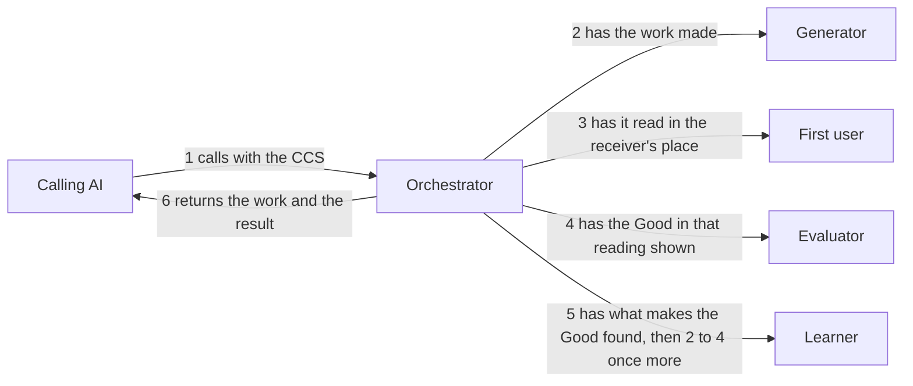

# turn design

turn is built from five AI roles, a few scripts and hooks: one role makes the work, one reads it in
its receiver's place, and the rest decide from that reading which items get their Good and have the
work made again where one does not. The goal, the key results, and what a checklist, the receiver
and a Good are, are in [turn's UX](ux.md).

## User stories

- As the calling AI, I want to hand turn the path of a CCS and get the work back, with each item's
  Good and its lines, the questions only the user can decide, and each item still without Good.

  The UX's first and last scenes are the calling AI's own work around this call.

## Architecture

### Logical view


```mermaid
flowchart LR
  caller["Calling AI"]
  orch["Orchestrator"]
  gen["Generator"]
  fu["First user"]
  ev["Evaluator"]
  le["Learner"]
  caller -->|1 calls with the CCS| orch
  orch -->|2 has the work made| gen
  orch -->|3 has it read in the receiver's place| fu
  orch -->|4 has the Good in that reading shown| ev
  orch -->|5 has what makes the Good found, then 2 to 4 once more| le
  orch -->|6 returns the work and the result| caller
```

The orchestrator and the four roles it starts are AIs, each answering the orchestrator in its reply.

- Every role looks only for the Good each item gets and the lines that give it; only a script,
  code that runs the same every time, doubts, such as by naming the lines no Good rests on.

  An AI that looks for what more the work needs finds more without end, and each find is patched
  in, so the work drifts from what it should be. Each role has one aim, so it works to the aim
  rather than to a list of steps.
- The calling AI hands the orchestrator the CCS's path, where the result goes, and the kinds it uses
  in the CCS for where the work goes, the checklists and the receiver, and, if it has them, what the
  receiver reads the work for and what they open with it.

  The CCS is the calling AI's, and turn defines nothing of it: what turn needs is found by these
  kinds, and the values stay in the CCS alone, so the call and the CCS cannot differ. Where the
  result goes is this call's answer, not the task's state, so it is not in the CCS.
- The generator makes the work from the whole CCS so that every item gets its Good, and hands back
  each item's lines and the questions only the user can decide.

  It hands back once it has read the work against each item. What the CCS does not say becomes a
  question, not its own guess. The lines are its claim, not a judgment.
- The orchestrator reads the work against every item and sends back the items whose Good it does
  not find, each said as what the receiver gets once it has it; once it sends nothing back, a script
  records its findings.

  A shortfall plain to see is sent back before the costly reading. How the work gets the Good is
  the generator's to decide, since an edit told per item broke other items. An item only the user's
  answer can give is not sent back; it is a question.
- The first user reads the work in the receiver's place, with what the receiver opens and the
  checklists, and says for each item what it got from the work and where.

  A reader that did not make the work stops where the receiver would; the maker reads in what it
  meant.
- The evaluator, given the same and that reading, shows each item's Good the reading gives, with
  its lines; the orchestrator decides each item where its findings and the evaluator's differ,
  against what the first user opened and where it stopped.

  The orchestrator's findings are recorded before the evaluator starts, as a judgment made after
  another's is pulled toward it. The evaluator is there because one reader misses a Good the work
  gives, and an item judged without it is made again for nothing.
- When every item has its Good or is a question, the run returns; otherwise the learner looks
  through every item's finding and every role's record of the run for what makes the Good, and the
  generator makes the work again with what it found.

  For an item without Good it finds how the work would give it; for one with Good, what gives it,
  so the remake keeps it. What fell short often lies in what a role did, which only its record
  shows.
- The work made again is read once more, from the orchestrator's findings to its decision, and then
  the run returns, with each item still without Good and what the receiver gets once it has it.

  A second reading settles what the first found; what is left costs the calling AI less to fix than
  more readings would.

### Physical view

```
turn/                      the plugin, installed by Claude Code
├── agents/
│   ├── up.md              the orchestrator <agent>
│   ├── generator.md       <agent>
│   ├── first-user.md      <agent>
│   ├── evaluator.md       <agent>
│   └── learner.md         <agent>
├── scripts/               the call's check, each role's input, the findings, the result <Python 3, jq>
└── hooks/
    ├── hooks.json         one entry per event
    └── *.py               one check each <Python 3>
```

- turn runs on Claude Code, python3 3.9 or later, jq and git.
- The calling AI starts the orchestrator, `turn:up`, in the background with the call as JSON, so its
  context holds only what comes back.

  It can still take the user's pause while it waits, and stops a run by sending the orchestrator a
  message. The user sees the run's agents in the panel below the prompt input. `claude -p` is not
  used, since the docs say `--bare`, which reads no subscription login, will become its default.
- A script checks the call and takes every entry of each kind it names from the CCS, so no AI
  copies a value; it stops a call that names a missing file or leaves where the work goes, the
  checklists or the receiver without an entry.
- What each role is given: the generator, the whole CCS, what is sent back and what the learner
  found; the first user, the work, what the receiver opens, who the receiver is and what for, and
  the checklists; the evaluator, the same and the first user's reading; the learner, every item's
  finding and the JSONL of every role of its run.
- Each role replies in a JSON form of its own, not in a file, and a hook checks each role at both
  ends.

  Only the orchestrator holds the replies, so the first user cannot see the generator's claim. A
  hook lets a role start only with what it is to be given, and stops a reply that does not fill its
  form; the evaluator starts only once a script holds the orchestrator's findings.
- The hooks stop a read outside what a role is given, a write outside where the work goes, and a
  commit or a push; a stop says why and names what may be read.

  A role that reads only what it is given is not bent by what it was not meant to see.
- A script writes the result where the call says, and checks its shape as it writes.

  A reply would be copied into a file by the calling AI, where a slip goes unseen.
- Several runs go at once, and the hooks tell them apart by the orchestrator's `agent_id`.

  Every agent of a conversation has the same `session_id`. A role's run is the `parentAgentId` in
  `subagents/agent-<agent_id>.meta.json` beside the conversation's transcript; tried with two runs
  at once, every role's tool use and reply was tied to its own orchestrator. The file is there from
  a role's first tool use, so what a role is started with is checked at the orchestrator's own call
  that starts it. The file is Claude Code's record, not a documented hook input, so the hooks'
  tests hold its shape.
- The work is made where it goes, and a run cut off leaves its writing as changes git shows.

  The calling AI undoes or finishes them and calls turn again on what is there. No run resumes part
  way, since being cut off is rare and a reading again costs less than a resume to build and keep
  right.

## Verification

### Units

- The scripts and the hooks: each check stops what it must and lets through what it must.
  - Run by [`dev/check.sh`](../check.sh) in CI on every push:
    - unittest in `dev/turn/tests/`
    - Lines and branches 100% covered
    - Ruff's lint and format
    - Pyrefly's types for Python 3.9
- The orchestrator and the four roles: each works to its aim with what it is given, giving its
  form.
  - Run on its own on a small task, on Opus 5.5; passes when its JSONL shows it read only what it
    was given and worked to its aim, and its reply fills its form.

### Acceptance

Each trial runs in `lovaizu/playground`, one at a time, on a branch of its own removed after: a
stand-in for the calling AI is handed a small task's CCS and checklist and calls turn, and is judged
from the JSONL of every agent it started and from the work.

- The story: the work comes back where it goes, and every item has a Good with its lines, a
  question, or what the receiver gets once it has its Good.
  - Each Good is checked by reading its lines in the work.
- KR1.1: the items the calling AI fixes after the work comes back.
  - Counted from the stand-in's own check in its JSONL, and compared with the version in use on the
    same task, kept with the trial in `dev/turn/trials/`.
- KR1.2: the time from the call to the work coming back.
  - Taken from the JSONL's timestamps for a README-sized work, and compared with the version in use
    on the same task.

A change is taken when the story is still achieved and KR1.2 does not come closer at the cost of
KR1.1.
