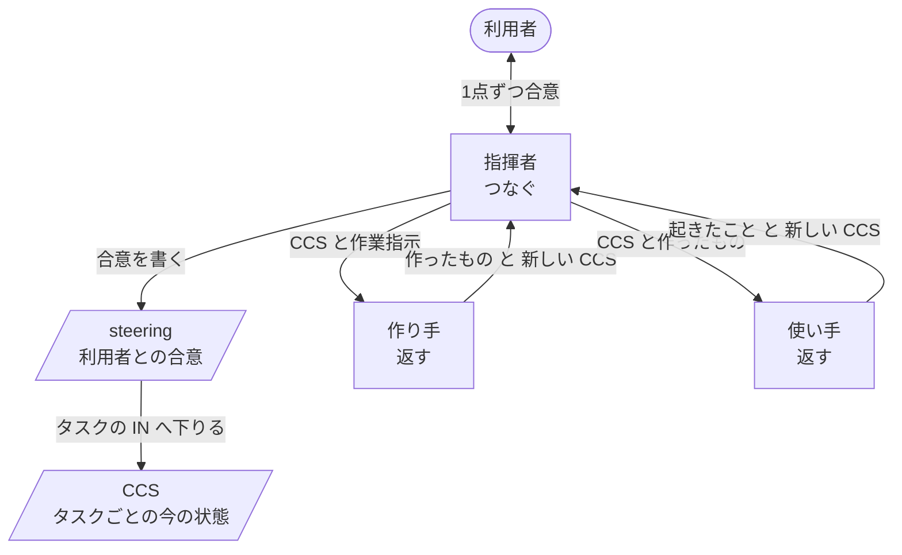

# プラグインのベース設計

このマーケットプレイスで、AI に何かを作らせるプラグインを作る人のための設計書です。どのプラグインも、ここに書いた骨組みの上に作ります。プラグインを作る人が自分で書くのは、ドメインの部分（各「返す」の IN の必須項目、OUT として作るもの、観点）だけです。

## この設計で得るもの

- プラグインが、目的を達成していることを確かめながら作れる。
- プラグインが重厚長大にならず、シンプルな形のまま育つ。
- 作る手間と確かめる手間が少ない。

    rn 0.9.0 は、作るたびに見つけた不具合ごとに手順やフックを足して太り、利用者を何時間も待たせました。作り直しでも、同じ流れを各プラグインがそれぞれ文章で書き直し、試走の結果だけを見て一文ずつ足していました。この設計は、その2つを骨組みで防ぎます。

## 型：返す・つなぐ・再開

プラグインは、1つの単位と、その上に積む2つの層でできています。Web アプリが処理をセッションでつなぎ、バッチが処理を記録でつないで途中から再開するのと同じ形です。

| 層 | すること | 使うプラグイン |
|---|---|---|
| 返す | 受け取った CCS と作業指示から1つ作り（または使い）、新しい CCS を返す。利用者とは話さない | pith、writ、rn |
| つなぐ | 利用者と合意し、「返す」を呼び、結果を判断して次を決める | writ、rn |
| 再開 | 合意と状態を記録に残し、会話を消しても続きから始める | rn |

- どの層まで使うかは、プラグインごとに決めます。

    pith は「返す」だけ、writ は「返す」と「つなぐ」、rn は3つすべてを使います。必要のない層を持つと、それだけ読む量と壊れる所が増えます。

## 登場人物

| 登場人物 | すること | しないこと |
|---|---|---|
| 利用者 | 決める | 作業を見張る |
| 指揮者 | 利用者と話し、判断し、次を頼み、合意と判断を記録に書く | 自分で作る、自分で試す |
| 作り手 | 1つ作る。推測なしに作れなければ、作らずに穴を返す | 判断する、利用者と話す |
| 使い手 | 受け取る人として1回使い、起きたことを報告する | 良し悪しを判断する |

- 1つのセッションの指揮者は1人です。

    利用者と話せるのはメインの会話だけで、切り離して動く役からは質問の道具が外されます（Claude Code 公式ドキュメント、サブエージェント）。Anthropic のマルチエージェント調査システムも、利用者が話すのは司令役だけで、作業役は自分の会話で作業して要点だけを返す形です。

- プラグインが別のプラグインを呼ぶ時、呼ばれた側は「返す」とドメインの部分だけを貸します。

    呼ばれた側の指揮者を呼び出し元の会話の中で動かすと、会話があふれます。rn が writ をそうして呼んだ試走では、指揮者の記録が 1.7MB になりました。切り離して動かすと利用者に聞けなくなり、問いが呼び出し元を往復します。

- 「返す」は、終わるまで待つスキル（`context: fork`、`background: false`）で起動します。

    Agent ツールで起動すると対話セッションでは裏で動き、指揮者は待てずに、決めることのない利用者を呼ぶか、結果がないまま先へ進みます（#44）。

## 状態：steering と CCS

| | 中身 | 変わる時 | 粒度 |
|---|---|---|---|
| steering | ゴールとなぜ、受け入れ条件、利用者が決めた事実、調べて確かめた事実、前提、制約、タスクの並び | 利用者の合意でだけ | セッションに1つ |
| CCS | タスクの今の状態。起きたこと、扱ったもの、出所、決めたこと、不確かなこと、次にすること | 「返す」のたびに丸ごと書き直す | タスクごとに1つ |

- CCS は、Bousetouane「AI Agents Need Memory Control Over More Context」（arXiv 2601.11653）の9項目の YAML をそのまま使い、足りないものは項目ではなく種類（type）を足して表します。

    論文では、エージェントは会話の全文ではなく、最後に確定した状態と今回の入力だけを見て動きます。状態は追記せずに置き換え、資料は貼らずに参照します。受け取る人とその人に必要なことも、受け取る人を `focal_entities`、その人が決めることを `goal_orientation`、決まっていないことを `uncertainty_signal`、出典を `retrieved_artifacts` の種類として入ります。

- 合意は上から下へ、穴の知らせは下から上へ流れます。

    利用者と合意するのは steering の段です。末端の「返す」の IN は、そこから下りてくるものを受け取るだけです。IN の穴が steering から決まるなら、指揮者が出典を添えて埋めます。どこからも決まらなければ、steering の合意が足りなかったということなので、上に戻って利用者と合意します。

## CCS を書くのは誰か：事実は機械、判断はそれを知る本人

| 部分 | 取る元 | 書くもの |
|---|---|---|
| 起きたこと、読んだファイル、実行したコマンドと成否 | その役の JSONL | スクリプト |
| 変わったファイル | git の差分とコミット | スクリプト |
| 出所 | JSONL の読んだファイル、取得した URL | スクリプト |
| ゴールと制約 | 承認済みの文書（パスで指す） | スクリプト |
| 利用者と決めたこと | 利用者の言葉のまま | 指揮者 |
| 不確かなこと | 本人の頭の中だけ | それに出会った本人 |
| 次にすること | 判断 | 指揮者 |

- 記録から取れる事実を LLM に書かせません。

    同じ事実を2か所に持つとずれます。本人の言い分は、作ったもの以上のことを言いうるので、事実の元にはしません。

- JSONL とコミットを突き合わせ、食い違いを事実として報告します。

    git では変わっているのに書いた跡のないファイル（コマンドで書いたもの）、リポジトリの外への書き込み、成功と言いながら失敗している手順、利用者の発言にない「利用者が決めたこと」を見つけます。

- 「返す」が終わった時のフック（SubagentStop）が、その役の JSONL から事実を CCS に書きます。

    フックは自分のプラグインの役の名前に絞ります。同じフックは Claude Code 自身の入力候補の補助が終わった時にも動くからです。

## 「返す」の IN と OUT

| | 成り立つこと | 確かめる時 |
|---|---|---|
| IN | 最新の CCS に、その「返す」の必須項目と種類がそろい、関わる穴が残っていない。合格条件（受け取る人が何をできれば合格か）を含む | 呼ぶ直前、フックで |
| OUT | 作ったものが指定の場所にある。作れなかったものは穴として書かれている | 返った直後、フックで |
| 次の CCS | CCS の形式（9項目、種類、2000バイトほど、資料はパス） | 書いた直後、フックで |

- プラグインが書くのは、各「返す」の IN の必須項目と、OUT として作るものだけです。形式と検査は共通です。
- フックが確かめるのは、項目が「ある」ことまでです。中身が目的に合っているかは、使い手と指揮者の判断が見ます。
- フックは自分のプラグインの CCS と「返す」の呼び出しにだけ働かせます。

    rn 0.9.0 のフックは、他のセッションや、待つべき指揮者まで止めました（#43、#44）。

## 1つのタスクの流れ

1. steering のタスク（何を作り、何ができれば合格か）から IN を埋める。フックが必須項目を確かめ、steering から決まらない穴は上に戻る。
2. 作り手が作る。推測なしに作れなければ、作らずに穴を返す。
3. 使い手が、受け取る人として1回使い、起きたことを返す。
4. 指揮者が、期待と起きたことの差を判断する。
5. 差の部分だけを作り直させる。直ったかは、新しい使い手を立てず、つまずいた所を同じようにやり直して確かめる。
6. 同じ差が2回直らなければ、上に戻る。

- 作る前に穴を返させます。

    書き上げてから「決まっていない点」を返すと、そのたびに書き直しになります。rn の試走では、設計段階でこれが8回回り、利用者を45分待たせました。書いて初めて見つかる穴は残るので、狙いは回数を減らすことです。

- 使い手は1つのタスクに1回です。

    新しい使い手は、走らせるたびに新しい細かい指摘を持ってくるので、確かめが終わりません。

## 判断

テストと同じく、期待と実際の差を見て、次の一手を選びます。

- 期待：作る前に書いた合格条件。受け取る人がそれで何をできるようになるか。
- 実際：使い手が使って起きたこと。
- 約束違反：JSONL とコミットの突き合わせで見つかった食い違い。

次の一手は4つのどれかです。期待どおりなら受け入れて進む。差があればその分だけ作り直す。期待が決まっていなかったら利用者に聞く。期待が間違っていたら前の段に戻る。

- 期待は作る前に書きます。

    作ったものを見てから書くと、作ったものに合わせて甘くなります。

## 利用者との合意

- 合意するのは、steering に入るもの（何がほしいか、なぜか、受け入れ条件、どこまで手間をかけるか）と、節目の承認です。
- 1回に1点だけ聞きます。複数あっても、1つずつ話し合って、お互いが同じものを見てから次に進みます。

    まとめて聞くと、利用者は追える1つに答え、残りは半端に決まります。待っている問いは CCS に保留として残し、失いません。

- 記録や文書で決まることは聞きません。調べた事実は出所を添えます。
- 何がほしいかを聞く時は案を出しません。やり方を選んでもらう時は、それぞれ得るものと代償、おすすめと理由を添えます。

    先に出した案は推測の上に立っていて、利用者はそれを取ってしまいます。

## 再開

上から順に読みます。

1. steering：ゴール、合意したこと、タスクの並びと進み具合。ここで今のタスクが決まります。
2. 今のタスクの最新の CCS：どこまで進み、何が保留か。
3. CCS が指す承認済みの文書とコミットを、必要な時だけ読む。

- CCS はリポジトリに置き、決めるたびにコミットして push します。

    翌日でも別の PC でも同じ所から始められます。JSONL は手元の PC にしかないので、再開には使いません。

## 検証

作り方と検証は一組です。良くなったかを確かめられなければ、直し方を選べません。

- 確かめるのは、利用者が得たものと、そのために払ったもの（待った時間、決めるために読んだ量、呼ばれた回数）です。

    各部分が動いても、全体では利用者を何時間も待たせることがあり、得たものだけを見ていると見落とします。

- 普段の変更は場面で確かめます。場面は、利用者が得るものを得る直前の状態から始め、それが分かる最初の結果で終わるので、数分で済みます。
- 節目に、README の話全体を本物の対話セッションで1回走らせます。

    `claude -p` は対話とふるまいが違います。Python の標準ライブラリで本物の `claude` を操作し、フックでターンの終わりを知る方法は、Claude Code 2.1.293 で動くことを確かめました。ターンが本当に終わったのは、`Stop` が来て、裏で動く作業が残っていない時です。

- 話、開始状態、比べる相手（今使っている版）は最初に決め、途中で変えません。

    作り直しの比較が最後まで終わらなかったのは、題材が4回変わったからです。

- 利用者は AI の代役が演じます。代役には、README から分かる利用者の知識と望みだけを渡します。
- 原因は結果ではなく記録で特定します。走らせた会話と作業役すべての JSONL をたどり、誰に何が渡り、何をして何を返したかを見てから直し方を決めます。
- 1回の試走の所見は全部集め、原因ごとにまとめてから、原因の場所だけを直します。

    AI のふるまいは毎回ぶれるので、1回の観察では原因か分かりません。症状ごとに一文足すと太ります。

- 直ったかは、つまずいた場面を走らせ直して確かめます。節目では、今使っている版と、どちらか伏せて比べます。

## シンプルさ

- 最小から始めます。目的とドメインの部分だけで作ります。

    Anthropic の指針も同じです。「最小のプロンプトを最良のモデルで試し、初めの試しで見つかった失敗に応じて指示や例を足す」（Effective context engineering for AI agents）、「穴に対処するのに足りるだけの内容を書く」（Skill authoring best practices）。

- 足すのは、場面で再現した失敗のためだけです。
- 節目の報告とマージの依頼のたびに、プラグインごとの大きさ（1回の呼び出しで読む語数）を、今使っている版と並べて示します。増えた時は、どの失敗を防ぐためかを添えます。

    小さいことはシンプルさの物差しで、良さの物差しではありません。rn 0.9.0 は 0.8.0 より小さいのに害がありました。良さは検証が見ます。

## 確かめた範囲

- 確かめたこと：本物の対話セッションをスクリプトで操作できること。終わるまで待つスキルで起動した役でも SubagentStop が動き、JSONL のパスと最後の返事が入ってくること。その JSONL からスクリプトで事実を抜き出し、次のターンから見えるファイルに書けること（0.02秒）。いずれも Claude Code 2.1.293。
- 確かめていないこと：CCS がプロンプトだけの制御で太らずに保てるか。論文の評価は数値のない定性的な結果です。aiya の試し（`worktree-aiya`）では5段階で807〜953字に収まりましたが、スクリプトで制御した場合でした。
