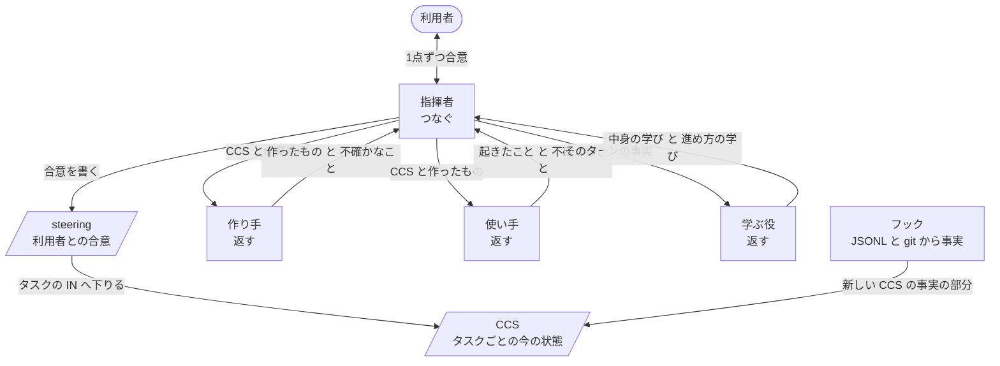

# プラグインのベース設計

このマーケットプレイスで、AI に何かを作らせるプラグインを作る人のための設計書です。共通の骨組みは fw プラグインが持ち、どのプラグインも fw に依存して、その上に作ります。プラグインを作る人が自分で書くのは、ドメインの部分（各「返す」の IN の必須項目、OUT として作るもの、観点）だけです。

## この設計で得るもの

1. 利用者は、自分が決めることだけに時間を使えば、ほしいものが手に入る。
2. 作業が何日かかっても、会話が消えても、続きから進められる。
3. 使うほど良くなる。中身の学びはその場で直す。進め方の学びはセッションの中でルールとして効かせ、最後に利用者の了承を得てプラグインへ送る。
4. 良くなったかを事実で判断できる。利用者が得るものも払うものも数値で測り、悪くなった時は記録（JSONL）から原因が分かる。
5. 共通の流れは1か所にある。直すのも確かめるのも1回で済み、ドメインの部分（モックに差し替えられる）とは別に確かめられる。プラグインを作る人は、ドメインの部分を書くだけで済む。
6. やりながら計画が変わっても追いつける。タスクが増えたり減ったり、順番が変わったりしても、流れが崩れない。
7. 止まらず、ほかを壊さない。進めなくなる状態（デッドロック）にならず、ほかのセッションやリポジトリの外のファイルに手を出さない。
8. fw 自体が小さいまま保たれる。足すのは、再現した失敗を防ぐためだけ。

    rn 0.9.0 は、見つけた不具合ごとに手順やフックを足して太り、利用者を何時間も待たせました。作り直しでも、同じ流れを各プラグインがそれぞれ文章で書き直し、試走の結果だけを見て一文ずつ足していました。この設計は、その2つを骨組みで防ぎます。

## 型：返す・つなぐ・再開

プラグインは、1つの単位と、その上に積む2つの層でできています。Web アプリが処理をセッションでつなぎ、バッチが処理を記録でつないで途中から再開するのと同じ形です。

| 層 | すること | 使うプラグイン |
|---|---|---|
| 返す | 受け取った CCS と作業指示から1つ作り（または使い）、作ったものと不確かなことを返す。利用者とは話さない | pith、writ、rn |
| つなぐ | 利用者と合意し、「返す」を呼び、結果を判断して次を決める | writ、rn |
| 再開 | 合意と状態を記録に残し、会話を消しても続きから始める | rn |

- どの層まで使うかは、プラグインごとに決めます。

    pith は「返す」だけ、writ は「返す」と「つなぐ」、rn は3つすべてを使います。必要のない層を持つと、それだけ読む量と壊れる所が増えます。

- 「つなぐ」を持たないプラグインは、呼び出した会話が指揮者として判断します。

    判断は「つなぐ」層の仕事なので、pith を利用者が直接呼んだ時は利用者の会話が、writ や rn が呼んだ時はその指揮者が、pith の返した起きたことを期待と比べます。

## fw と各プラグイン

| 持つもの | fw | 各プラグイン |
|---|---|---|
| 役 | 指揮する・作る・使う・学ぶの4つの役の、ドメインによらない指示 | 各役に渡すドメインの部分（観点、作るものの形） |
| 流れ | 1つのタスクの流れ（状態遷移表）と、役を呼ぶ前の条件 | 入口のスキル（`writ:up` など）。ドメインの部分を添えて、fw の流れを読み込む |
| 状態 | CCS の形式、IN の検査、事実の書き込み、再開のしかた | 各「返す」の IN の必須項目 |

- 共通の部分は、写しではなく、依存する1つのプラグインに置きます。

    写しを各プラグインが持つと、文章の部分は食い違います。writ の作り直しでは、writ の指示書にだけ「指揮者は自分で作らない」が抜けていて、指揮者が文書を自分で書き換えました。1か所なら、直すのも確かめるのも1回で済みます。Claude Code は依存するプラグインを自動で入れ、別のプラグインのスキルを名前で呼べます（writ は pith の `pith:use` と `pith:where` を呼んで動いています）。共通の部分を依存先のプラグインに置く例は、公式のプラグインにも他の事例にも見つかっていません。動かなければ、写しを持たせる形に戻します。

- 役の指示は、共通の部分とドメインの部分を別のファイルにして、CCS でパスを渡して組み合わせます。fw のフックも、各プラグインの IN の必須項目を、CCS に書かれたパスから読みます。

    takt は、役の指示を人格・守る決まり・作業の指示・知識・出力の形の5つのファイルから組み立て、ドメインの部分だけを差し替えています。

## 登場人物

| 登場人物 | すること | しないこと |
|---|---|---|
| 利用者 | 決める | 作業を見張る |
| 指揮者 | 利用者と話し、判断し、次を頼み、合意と判断を記録に書く | 自分で作る、自分で試す |
| 作り手 | 1つ作る。推測なしに作れなければ、作らずに穴を返す | 判断する、利用者と話す |
| 使い手 | 受け取る人として1回使い、頼りにする記述を実物で確かめ、起きたことを報告する | 良し悪しを判断する |
| 学ぶ役 | 毎ターン、そのターンの事実（使い手の報告、JSONL、コミット）から、中身の学びと進め方の学びを出す | 判断する、直す |

- 判断するのは指揮者だけです。作り手、使い手、学ぶ役は、自分の成果を出すだけです。
- 学ぶ役は毎ターン動きます。

    進め方の学びを最後にまとめて出す形にすると、後回しにされて抜けます。writ の作り直しでも、原因を JSONL からたどる進め方の振り返りは、利用者に言われて初めてしっかり行いました。時間と費用がかかっても、毎ターン組み込みます。

- 中身の学びは、指揮者がその場で直させます。進め方の学びは、指揮者が steering にルールとして入れ、次のターンから守ります。セッションの最後に、指揮者はそれをプラグインへ issue として送るかを利用者に聞きます。

    プラグイン本体を直すのは issue からで、検証で良くなったと確かめてから入れます。送るのはリポジトリの外への投稿なので、利用者の了承を取ります。

- 1つのセッションの指揮者は1人です。

    利用者と話せるのはメインの会話だけで、切り離して動く役からは質問の道具が外されます（Claude Code 公式ドキュメント、サブエージェント）。Anthropic のマルチエージェント調査システムも、利用者が話すのは司令役だけで、作業役は自分の会話で作業して要点だけを返す形です。

- プラグインが別のプラグインを呼ぶ時、呼ばれた側は「返す」とドメインの部分だけを貸します。

    呼ばれた側の指揮者を呼び出し元の会話の中で動かすと、会話があふれます。rn が writ をそうして呼んだ試走では、指揮者の記録が 1.7MB になりました。切り離して動かすと利用者に聞けなくなり、問いが呼び出し元を往復します。

- 「返す」は、終わるまで待つスキル（`context: fork`、`background: false`）で起動します。

    Agent ツールで起動すると対話セッションでは裏で動き、指揮者は待てずに、決めることのない利用者を呼ぶか、結果がないまま先へ進みます（#44）。

## 状態：steering と CCS

| | 中身 | 変わる時 | 粒度 |
|---|---|---|---|
| steering | ゴールとなぜ、受け入れ条件、利用者が決めた事実、調べて確かめた事実、前提、制約、タスクの並び | 利用者が決めたこと（ゴール、受け入れ条件など）は、利用者の合意でだけ変わる。タスクの並びと進み具合、進め方のルールは指揮者が書く | セッションに1つ |
| CCS | タスクの今の状態。起きたこと、扱ったもの、出所、決めたこと、不確かなこと、次にすること | 「返す」のたびに丸ごと書き直す | 役の呼び出しごとに1つ。タスクごとのフォルダにまとめる |

- CCS は、Bousetouane「AI Agents Need Memory Control Over More Context」（arXiv 2601.11653）の9項目の YAML をそのまま使います。足りないものは、項目ではなく種類（type）を足して表します。

    論文では、エージェントは会話の全文を見ません。最後に確定した状態と今回の入力だけを見て動きます。状態は追記せずに置き換え、資料は貼らずに参照します。受け取る人とその人に必要なことは、次の種類として入ります。

    - 受け取る人：`focal_entities`
    - その人が決めること：`goal_orientation`
    - 決まっていないこと：`uncertainty_signal`
    - 出典：`retrieved_artifacts`

- CCS は、役の呼び出しごとに1つのファイルで、タスクごとのフォルダにまとめます。役ごとに渡すものが違うからです。使い手の CCS には狙いを入れません。「再開」を持つプラグインは、自分の記録の場所に置き、コミットします。持たないプラグインは、呼び出し元が渡した場所か、自分の記録の場所に置き、終われば消します。

- 「再開」を持たない「つなぐ」では、利用者と合意した計画のファイルが steering の役をします。記録の場所に置き、コミットはしません。

    CCS は続きから始めるための記録です。再開しないプラグインが残すと、頼まれていないファイルが増えます。リポジトリの外に置くと、普段の権限の設定では、書くたび読むたびに利用者が許可を求められます。

- 合意は上から下へ、穴の知らせは下から上へ流れます。

    利用者と合意するのは steering の段です。末端の「返す」の IN は、そこから下りてくるものを受け取るだけです。IN の穴が steering から決まるなら、指揮者が出典を添えて埋めます。どこからも決まらなければ、steering の合意が足りなかったということなので、上に戻って利用者と合意します。

## CCS を書くのは誰か：事実は機械、判断はそれを知る本人

| 部分 | 取る元 | 書くもの |
|---|---|---|
| 実行したコマンドと成否、ツールで読み書きしたファイル | その役の JSONL | スクリプト |
| リポジトリの中で変わったファイル | git の差分とコミット | スクリプト |
| 出所 | JSONL のツールで読んだファイル、取得した URL | スクリプト |
| ゴールと制約 | 承認済みの文書（パスで指す） | スクリプト |
| 利用者と決めたこと | 利用者の言葉のまま | 指揮者 |
| 不確かなこと | 本人の頭の中だけ | それに出会った本人。利用者の答えで決まったら、指揮者が決めたことに移して消す |
| 次にすること | 判断 | 指揮者 |

- 記録から取れる事実を LLM に書かせません。

    同じ事実を2か所に持つとずれます。本人の言い分は、作ったもの以上のことを言いうるので、事実の元にはしません。

- JSONL とコミットの突き合わせは、作り手の言い分を判断に使う所にだけ置き、その食い違いが場面で再現してから作ります。

    見つけるのは、git では変わっているのに書いた跡のないファイル（コマンドで書いたもの）、成功と言いながら失敗している手順、利用者の発言にない「利用者が決めたこと」です。pith の使い手は判断を言わないので、pith には要りません。

- 記録に残らないことは、事実として報告しません。

    コマンド（`cat` など）で読んだファイルは、コマンドの文字列にしか出ません。コマンドでリポジトリの外に書いたものは、JSONL にも git にも残りません。pith の作り直しの試走で、使い手はすべてを `cat` で読みました。

- 「返す」が終わった時のフック（SubagentStop）が、その役の JSONL から事実を CCS に書きます。CCS には要点だけを書き、全文は JSONL のパスで指します。

    フックは fw の役の名前に絞ります。同じフックは Claude Code 自身の入力候補の補助が終わった時にも動くからです。

## 「返す」の IN と OUT

- IN：最新の CCS に、その「返す」の必須項目と種類がそろい、関わる穴が残っていない。呼ぶ直前にフックで確かめます。
- OUT：作ったものと、作れなかった穴。何をしたかの事実は、返った後のフック（SubagentStop）が記録から書きます。
- プラグインが書くのは、各「返す」の IN の必須項目と、OUT として作るものだけです。形式と検査は共通です。
- 必須項目は、その役の目的から決めます。作り手と判断する側には合格条件（受け取る人が何をできれば合格か）を渡します。使い手には、使うものと受け取る人と使う目的を渡し、狙いも作り方も渡しません。

    作り手は合格条件を狙って作ります。使い手の目的は、何も知らない受け取る人がつまずく所を見つけることです。狙いを知ると、狙いに沿って読んでしまい、つまずきが見えなくなります。

- 使い手は、受け取る人が頼りにして決めたり動いたりする記述を、リポジトリやコード、動かした結果などの実物で確かめ、合わなかった所も起きたこととして返します。

    出所を添えていても、出所が言っていないことを書いた行や、作り手が黙って足した推測は、読むだけでは見えません。受け取る人が実物に当たって初めてつまずきます。writ の作り直しの試走では、使い手は読むだけで、実物で確かめた比較の読み手が、文書の中の食い違い、出所の言わない「ディレクトリごとに一緒に移す」、問いとして成り立たない問い、移行で古くなるファイルの抜けを見つけました。

- 初めから作るフックは、IN の検査と事実の書き込みの2つだけです。OUT や CCS の形式の検査は、それが防ぐ失敗が場面で再現してから足します。

    この2つは、rn で起きた失敗（作り手が渡されなかったことを推測した、作り手の言い分を信じた）に答えます。CCS の事実の部分はスクリプトが書くので、形式は書く側で守られます。
- IN の必須項目は「返す」ごとに書きます。形は、CCS の項目と種類の組を並べた、機械が読める一覧です。各組には、埋める元（steering、リポジトリ、記録）を添えます。

    フックがそのまま読めるようにするためです。埋める元が書いてあると、穴が見つかった時に、誰が埋めるか（スクリプト、指揮者、上に戻って利用者）が決まります。

- フックが確かめるのは、項目が「ある」ことまでです。中身が目的に合っているかは、使い手と指揮者の判断が見ます。
- フックは fw の役の呼び出しと、その CCS にだけ働かせます。

    rn 0.9.0 のフックは、他のセッションや、待つべき指揮者まで止めました（#43、#44）。

## 1つのタスクの流れ

タスクの並びは steering にあり、やりながら増えたり減ったり、順番が変わったりします。並びを変えるのは指揮者で、利用者が決めること（何がほしいか、受け入れ条件など）を変える時は利用者の承認を取ります。1つのタスクの中の流れは毎回同じなので、状態遷移表で漏れなく書きます。

| 今の状態 | 出来事 | 次の状態 |
|---|---|---|
| 埋める | 必要な情報がそろった | 作る |
| 埋める | 利用者が決める点がある | 利用者待ち |
| 埋める | 出所がどこにもなく、利用者にも決められない | 埋める（「決まっていない」と、誰が決めるかを書く） |
| 利用者待ち | 答えが出た | 埋める |
| 作る | 作れた | 使う |
| 作る | 推測なしには作れない | 埋める |
| 使う | 報告が返った | 学ぶ |
| 学ぶ | 学びが返った | 判断 |
| 判断 | 差がない | 完了 |
| 判断 | 差がある（同じ差を直すのが2回目まで） | 直す |
| 判断 | 同じ差が2回直らない、または期待が違っていた | 上に戻る |
| 判断 | 利用者が決める点が出た | 利用者待ち |
| 直す | 直せた | 確かめ直す |
| 直す | 推測なしには直せない | 埋める |
| 確かめ直す | 報告が返った | 学ぶ |
| 上に戻る | steering を直した | 同じタスクの「埋める」か、並べ替えた次のタスクの「埋める」 |
| 完了 | steering に残りのタスクがある | 次のタスクの「埋める」 |
| 完了 | 残りのタスクがない | 送るか確認 |
| 送るか確認 | 利用者が答えた | 終わり |
| どの状態でも | 会話が消えた | 同じ状態から再開 |

- 流れを守らせるためだけのスクリプトやフックは作りません。表の遷移のうち、抜けると利用者が損をするものを、役を呼ぶ前の条件にして、IN の検査のフックで確かめます。

    | 呼ぶもの | 条件 |
    |---|---|
    | 作り手（初めて） | 必要な情報がそろい、そのタスクに使い手の記録がまだない |
    | 作り手（直し） | 前のターンの判断（`fix` と `keep`）と、学びが記録にある |
    | 使い手（初めて） | 作ったものがあり、そのタスクで使い手がまだ使っていない |
    | 使い手（確かめ直し） | 直した記録があり、確かめるのはつまずいた所だけ |
    | 学ぶ役 | そのターンの使い手の報告がある |
    | 結果を利用者に渡す（結果ファイルを書く） | 使い手の記録と、最後のターンの学びがある |

    takt は「プロンプトだけでは振る舞いを強制できない」として、流れを仕組みに持たせています。一方、流れ専用のスクリプトとフックで縛ると、止めたまま進めなくなるおそれがあり、rn 0.9.0 のフックは実際にほかのセッションや待つべき指揮者を止めました。そこで、抜けると利用者が損をする遷移だけを、今ある IN の検査の項目にします。誰が決める点か、タスクをどう変えるかは判断なので、指揮者が持ちます。外れた時は学ぶ役が記録から見つけます。

- フックが止めるのは役の呼び出しだけです。利用者とのやりとりと、ターンの終わりは止めません。止める時は、足りないものを必ず言います。

    指揮者が足りないものを埋めるか、利用者に聞けば、どの状態からも先へ進めます。

- タスクの中の今の状態は、タスクのフォルダの CCS（どの役が呼ばれ、何を返したか）から決まります。指揮者は別に書きません。

    同じ事実を2か所に持つとずれます。CCS の事実はフックが記録から書き、コミットされるので、会話が消えても同じ状態から再開できます。

- テストで、すべての状態から先へ進めるか、利用者に戻せるかを確かめます。
- 直したかどうかは、全体を使い直させず、つまずいた所だけを使い手に同じようにやり直させて確かめます。直すことと保つことは、CCS の `goal_orientation` に `fix` と `keep` で書きます。

- 作る前に穴を返させます。

    書き上げてから「決まっていない点」を返すと、そのたびに書き直しになります。rn の試走では、設計段階だけでこれが8回回り、利用者を45分待たせました。書いて初めて見つかる穴は残ります。狙いは回数を減らすことです。

- 使い手が作ったもの全体を使うのは、1つのタスクに1回です。確かめ直しでは、つまずいた所だけを使わせます。

    新しい使い手は、走らせるたびに新しい細かい指摘を持ってくるので、確かめが終わりません。

## 判断

テストと同じく、期待と実際の差を見て、次の一手を選びます。

- 期待：作る前に書いた合格条件。受け取る人がそれで何をできるようになるか。
- 実際：使い手が使って起きたこと。
- 約束違反：JSONL とコミットの突き合わせで見つかった食い違い。

使い手がつまずいた所は、どれも差です。利用者に言うことがないという理由で見送りません。作り手が推測だと返したものも差で、「決まっていない」と書き直させます。

- 使い手のつまずきを直す時も、まず出所を調べます。

    writ の作り直しの試走では、使い手が「`src/api/validate.ts` を同じ PR で作ると1ディレクトリの決まりに反するか」でつまずき、指揮者はそれを調べずに「決まっていない」と書きました。`validate.ts` は `src/api/` の中にあり、問いとして成り立っていませんでした。

次の一手は4つのどれかです。期待どおりなら受け入れて進む。差があればその分だけ作り直す。期待が決まっていなかったら利用者に聞く。利用者にも決められなければ、作ったものの中に、決まっていないことと誰が決めるかを書かせる。期待が間違っていたら前の段に戻る。

- 期待は作る前に書きます。

    作ったものを見てから書くと、作ったものに合わせて甘くなります。

- 判断の結果は、記録の場所の `open/` にファイルで置きます。すべて片づいたら、各指摘に直したか、見送った理由か、利用者に渡したかを添えて、ファイルを丸ごとコミットメッセージに写し、同じコミットでファイルを消します。

    結果は会話が消えても残り、プルリクエストで読めます。`open/` には、まだ手の要るものだけが残ります。

## 利用者との合意

- 利用者に聞くのは、利用者だけが決められることです。steering に入るもの（何がほしいか、なぜか、受け入れ条件、どこまで手間をかけるか）と、節目の承認だけを聞きます。

    自分の決めることのためだけに呼ばれれば、利用者は作業をプラグインに任せられます。

- それ以外の点は聞かずに、次のどちらかにします。
    - 依頼、リポジトリ、文書に出所があれば、出所つきで埋める。
    - 出所がなければ「決まっていない」と書き、誰が決めるかを添える。依頼が名指しした人、名指しがなければ受け取る人です。

    writ の作り直しの試走では、指揮者は「リポジトリにない」ことを理由に、読み手のチームが決める点を利用者に聞き、答えは「決まっていない」でした。出所のない推測を、決まったこととして書いた点もありました。

- 埋める範囲は、依頼が挙げた点だけではありません。受け取る人が作ったものを使って決めることや、することの1つ1つから、それに関わる事実をリポジトリでたどります。依頼に書かれたことは1つも落としません。

    writ の作り直しの試走では、指揮者は依頼が挙げた3つの決めごとだけを埋め、`npm run dev` や express の型など、読み手の作業に関わる事実を、読んでいながら計画に入れませんでした。今使っている版は、これらを最初に作り手へ渡していました。

- 埋め終えたら、全体を1回承認してもらいます。

    項目を1つずつ聞いた試走では、問い10回のうち5回が依頼かリポジトリで答えの出ているものでした。

- 1回に1点だけ聞きます。複数あっても、1つずつ話し合って、お互いが同じものを見てから次に進みます。

    まとめて聞くと、利用者は追える1つに答え、残りは半端に決まります。待っている問いは CCS に保留として残し、失いません。

- 何がほしいかを聞く時は案を出しません。やり方を選んでもらう時は、それぞれ得るものと代償、おすすめと理由を添えます。

    先に出した案は推測の上に立っていて、利用者はそれを取ってしまいます。

## 再開

上から順に読みます。

1. steering：ゴール、合意したこと、タスクの並びと進み具合。ここで今のタスクが決まります。
2. 今のタスクの最新の CCS：どこまで進み、何が保留か。
3. CCS が指す承認済みの文書とコミットを、必要な時だけ読む。

- CCS はリポジトリに置き、決めるたびにコミットして push します。

    翌日でも別の PC でも同じ所から始められます。JSONL は手元の PC にしかないので、再開には使いません。

## 検証

作り方と検証は一組です。良くなったかを確かめられなければ、直し方を選べません。

- 試走のたびに、まず README が約束することの1つ1つを、プラグインが作ったものが果たしたかを確かめます。作ったものを引用して示します。
- 果たしたかは、同じ場面を今使っている版でも走らせ、2つの結果をどちらの版か伏せて受け取る人の代役に渡し、どちらがほしいかとその理由を聞いて決めます。

    作った側の自己評価や、指摘の数では分かりません。writ の作り直しでは、時間も問いも減ったのに、読み手は今使っている版の文書を選びました。

- そのあとで、利用者が使ったもの（待った時間、決めるために読んだ量、聞かれた回数）を数えます。

    約束を果たしても、利用者を何時間も待たせれば使われません。ただし、これが減っても、作ったものが悪くなっていれば改善ではありません。

- 普段の変更は場面で確かめます。場面は、利用者が得るものを得る直前の状態から始め、それが分かる最初の結果で終わるので、数分で済みます。
- 節目に、README の話全体を本物の対話セッションで1回走らせます。

    `claude -p` は対話とふるまいが違います。Python の標準ライブラリで本物の `claude` を操作し、フックでターンの終わりを知る方法は、Claude Code 2.1.293 で動くことを確かめました。ターンが本当に終わったのは、`Stop` が来て、裏で動く作業が残っていない時です。

- 話、開始状態、比べる相手（今使っている版）は最初に決め、途中で変えません。

    作り直しの比較が最後まで終わらなかったのは、題材が4回変わったからです。

- 利用者は AI の代役が演じます。代役には、README から分かる利用者の知識と望みだけを渡します。
- 原因は結果ではなく記録で特定します。走らせた会話と作業役すべての JSONL をたどり、誰に何が渡り、何をして何を返したかを見てから直し方を決めます。
- 1回の試走の所見は全部集め、原因ごとにまとめてから、原因の場所だけを直します。

    AI のふるまいは毎回ぶれるので、1回の観察では原因か分かりません。症状ごとに一文足すと太ります。

- 直ったかは、つまずいた場面を走らせ直して確かめます。

## シンプルさ

- 最小から始めます。目的とドメインの部分だけで作ります。

    Anthropic の指針も同じです。

    - 「最小のプロンプトを最良のモデルで試し、初めの試しで見つかった失敗に応じて指示や例を足す」（Effective context engineering for AI agents）
    - 「穴に対処するのに足りるだけの内容を書く」（Skill authoring best practices）

- 足すのは、場面で再現した失敗のためだけです。
- 節目の報告とマージの依頼のたびに、プラグインごとの大きさ（1回の呼び出しで読む語数）を、今使っている版と並べて示します。増えた時は、どの失敗を防ぐためかを添えます。

    小さいことはシンプルさの物差しで、良さの物差しではありません。rn 0.9.0 は 0.8.0 より小さいのに害がありました。良さは検証が見ます。

## 確かめた範囲

- 確かめたこと：本物の対話セッションをスクリプトで操作できること。終わるまで待つスキルで起動した役でも SubagentStop が動き、JSONL のパスと最後の返事が入ってくること。その JSONL からスクリプトで事実を抜き出し、次のターンから見えるファイルに書けること（0.02秒）。「返す」を呼ぶ直前のフック（スキル呼び出しの PreToolUse）が、必須項目の足りない呼び出しを止められること（pith の作り直し、b5a5bb8）。いずれも Claude Code 2.1.293。
- 確かめていないこと：各プラグインの入口から fw の流れを読み込み、その通りに動けるか。fw の IN の検査が、依存するプラグインからの呼び出しにだけ働き、ほかのセッションを止めないか。学ぶ役が JSONL から流れの外れを見つけられるか。返った直後のフック（PostToolUse）。CCS がプロンプトだけの制御で太らずに保てるか。論文の評価は数値のない定性的な結果です。aiya の試し（`worktree-aiya`）では5段階で807〜953字に収まりましたが、スクリプトで制御した場合でした。
