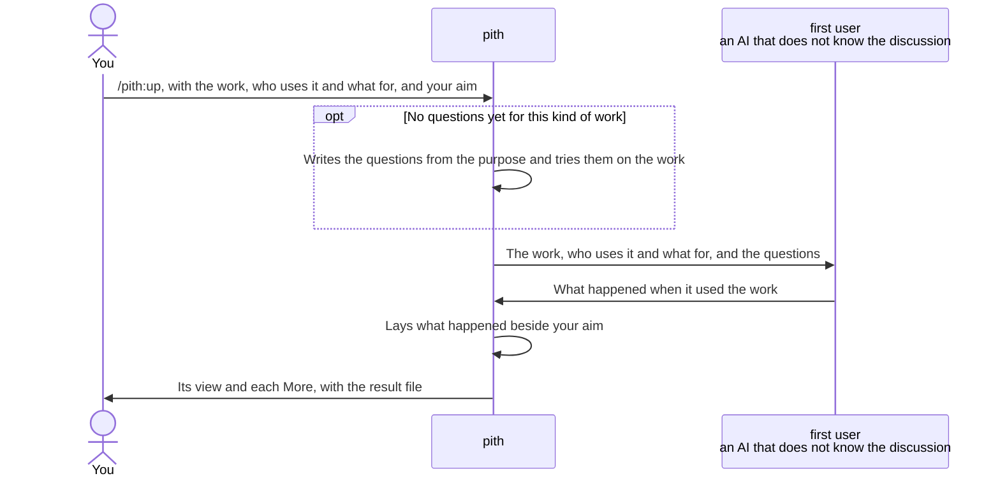

# pith

pith is a Claude Code plugin. When it checks something you made, a document, a prompt, a Claude Code plugin, code or tests, you get the following.

- You learn where the receiver of your work, the person or AI that uses it, falls short of what you aimed for, from what happened when the work was actually used, not from what you meant while making it.
- Each point pith returns names the place in the work and quotes what happened there, so you see what to fix and what must not be lost while fixing.
- You can check any kind of work: a document, a prompt or a plugin with the questions pith comes with, and a kind no one has written questions for yet, such as code or tests, with questions pith writes from the work's purpose, tries on your work, and keeps for the next check of that kind.

Reading your work over yourself, or asking the AI that helped you make it, does not find these places. Both know what you meant, and fill in what the work leaves out without noticing. pith hands your work to a separate AI that does not know the discussion or how the work was made. It uses the work as its receiver would: it reads a document, runs a prompt with an AI, calls code, runs tests. Then it reports what happened, without judging.

The check you called as `/writ:pith` is now `/pith:up`. It checks the same way with the same questions, and pith comes installed with writ.

## Call `/pith:up` with the work and your aim, and you learn where the receiver falls short

pith checks with questions kept in an essentials file, one for each kind of work. For a document, a prompt or a plugin, it uses the ones it comes with. For any other kind, such as code or tests, it uses the one for that kind in `.pith/essentials/` in your repository, and writes it first when there is none. That separate AI, called the first user, uses the work and reports what happened for each question. pith then gives each question a Good, where the receiver gains what your aim intends, or a More, where the receiver falls short of it.



Each question asks what happened in use, such as "When you gave it a situation that no step reaches, what did the AI do?". None asks about form, such as whether the steps are numbered, because a work can pass every question about form and still miss its purpose.

The first user is given the work, who uses it and what for, and the questions, but never your aim. Knowing the aim, it would use the work looking for it, and fill in what is missing in its head.

Write your aim out in sentences when you call pith, because an aim that was not written out cannot be compared with. Without one, pith returns at once and asks for it. If a question cannot be compared with anything in your aim, pith names that question and asks you to add to the aim before any first user runs.

## Example: checking a prompt that reviews pull requests

Say you wrote a prompt at `.github/prompts/pr-review.md` for the Claude that reviews pull requests in CI. The UI calls the API through `src/ui/api-client.js`, and you want every API change that breaks it caught.

```console
> /pith:up Check .github/prompts/pr-review.md.
  The receiver is Claude in CI, which reads each pull request's diff with this prompt and writes a comment.
  The aim is to miss no API change that breaks src/ui/api-client.js, and to comment on nothing else.

● I checked it with pith's own questions for a prompt.
  Changed endpoints are caught as the aim intends, but one kind of change gets past.

  More: a renamed response field is missed (pr-review.md:12, "Look at endpoints added, removed, or with changed arguments")
    Question: When you gave it a situation that no step reaches, what did the AI do?
    The first user's report: given a diff that only renamed dueDate to dueAt in a response, it output NO_COMMENT
    What the receiver struggles with: the pull request is merged and the UI breaks.

  Full text: .pith/open/01-report-pr-review.md
```

The first user did not read the prompt and say whether it looked right. It gave the prompt to an AI with a diff no step covers, and the AI wrote no comment. That is how the hole showed.

The short result holds only what you decide: pith's view of where the work stands against your aim, and each More in full. It stays this short however many questions were asked, so a larger work does not cost you a longer read. The result file holds the rest: the first user's report for every question, and every Good, which tells you what must not be lost while fixing, and every More, each with its place and the quoted evidence.

## Example: checking code with no essentials file yet

Say your team has a command-line tool, `taskctl`, and you changed its export in `cli/src/export.js`. There are no questions for code yet.

```console
> /pith:up Check cli/src/export.js. Engineers run `taskctl export` to put tasks into a file they share.
  The aim is that the file holds exactly the tasks asked for, and a wrong option stops with a message.

● There was no essentials file for code, so I wrote .pith/essentials/code.md and tried it on export.js:
    Called as its users call it, what ended up in the output?
    Called with a value its users might mistype, what happened?
  More: a date in another form is taken without a word (export.js:32, "tasks = tasks.filter((t) => t.dueDate && t.dueDate >= opts.since);")
    Question: Called with a value its users might mistype, what happened?
    The first user's report: with --since 10/01/2026 it wrote every task that has a due date, and no message
    What the receiver struggles with: the shared file holds tasks no one asked for.

  Full text: .pith/open/02-report-export.md
```

The next check of code uses these same questions. If you already have your own essentials files, name them in the call, and pith uses them instead: `/pith:up Check cli/src/export.js with docs/essentials/code.md ...`.

## What stays in your repository, and how to clear it

pith writes one result file for each work, in `.pith/open/` at the root of your repository, and does not commit or push it. To keep it beyond the conversation and show it on the pull request, commit it yourself.

Say that, besides the renamed field, the same question also found a wrong path, which you fixed and then rewrote in the file as a Good yourself, and a long diff read only in part, which you left. That question's section of `.pith/open/01-report-pr-review.md` then reads:

```markdown
## prompt.md: When you gave it a situation that no step reaches, what did the AI do?

Report: Given a diff that only renamed dueDate to dueAt in a response, it output NO_COMMENT. The prompt sent it to src/ui/apiClient.js, which does not exist. Given a diff of 3,000 lines, it read only the first part.

- More: `.github/prompts/pr-review.md:12` A renamed response field is missed, so the pull request is merged and the UI breaks.
  - Evidence (report): "it output NO_COMMENT"
- Good: `.github/prompts/pr-review.md:13` The AI opens the client it checks the change against.
  - Evidence (work): "read `src/ui/api-client.js`"
- More: `.github/prompts/pr-review.md:3` A change late in a long diff goes unchecked.
  - Evidence (report): "it read only the first part"
  - Left because: our pull requests stay under 500 lines.
```

You check a fix yourself by doing again what the first user did where the More was found: here, giving the prompt the diff that renames a field, and seeing that it now comments. pith is not run again, since each new first user brings fresh small remarks and the checking would never end. Then rewrite the More in the file as the Good it now is, as above.

Once every More is fixed or let go with a reason, copy the file into a commit message and delete the file in that commit. The record stays in the git history, so a file left in `.pith/open/` is the sign that something still waits for you.

## The essentials pith comes with

- [Every document](references/essentials/doc.md): whether readers understand it in one reading and know what to do once they finish.
- [A README](references/essentials/readme.md): whether a newcomer learns what they gain, decides whether to use the product, and can start using it.
- [A design document](references/essentials/design.md): whether those who build and maintain the product know which feature brings which benefit, and can judge whether a change fits the design.
- [A prompt an AI reads](references/essentials/prompt.md): whether the AI acts toward the purpose even in situations the writer did not foresee, and what the prompt adds over the AI without it.
- [A Claude Code plugin](references/essentials/plugin.md): whether the user gets what its README promises when its story is run end to end, and what that costs them in waiting, reading and being asked.
- [Essentials files](references/essentials/essentials.md): whether a file's questions were worked back from the purpose and can be answered from what happened in use.

## With writ and rn

writ, which writes documents, and rn, which carries a goal through to a finished change, both check their work through pith, so an improvement to how work is checked is made once in pith and reaches both.

To check a document and fix it yourself, call `/pith:up`; to have a document written or fixed for you, call `/writ:up`, as [writ's README](../writ/README.md) tells. rn keeps its own questions for its kinds of work, such as a plan, a design or a finished change, and hands them to pith when it checks.

## Getting started

pith is a Claude Code plugin, so you need Claude Code, on Opus or Sonnet. Its checks are Python scripts, so it also needs Python 3.9 or later; on a Mac, it comes in the same developer tools as git. Without it, pith stops instead of skipping the check, and tells you to install it. Node.js is not needed.

pith is in the plugin marketplace `lovaizu/ccpm`. In Claude Code, add the marketplace, then install pith. If you have writ or rn, pith is already installed.

```console
> /plugin marketplace add lovaizu/ccpm
> /plugin install pith@ccpm
```

Now you can use `/pith:up`.

## License

MIT. The full text is in [LICENSE](../LICENSE) at the root of the repository.
