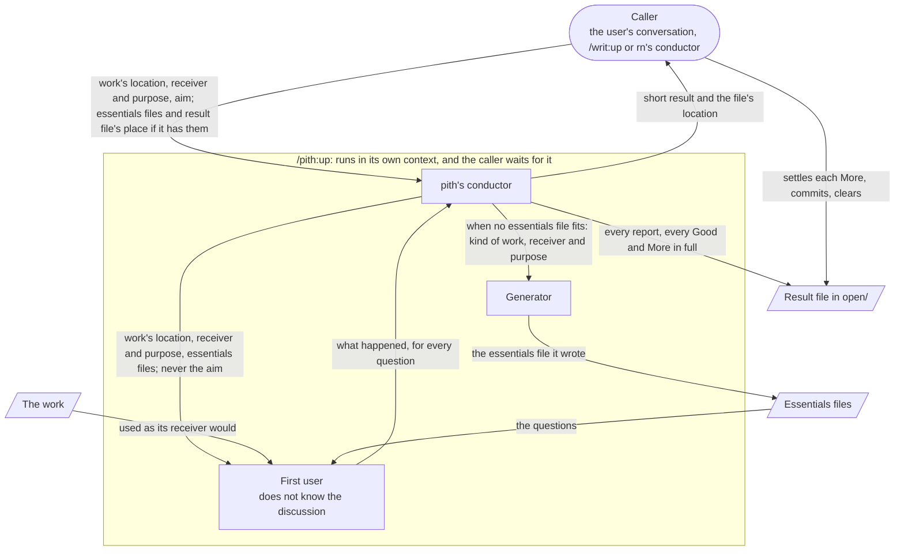
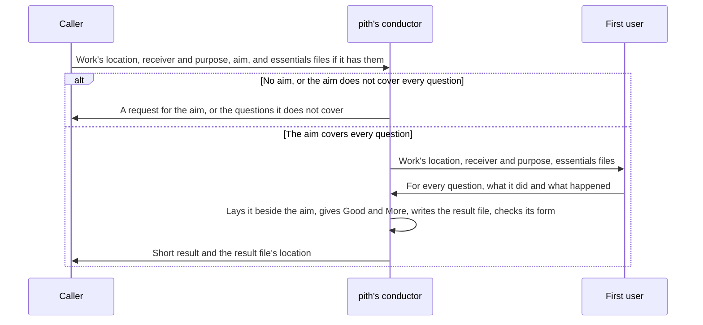
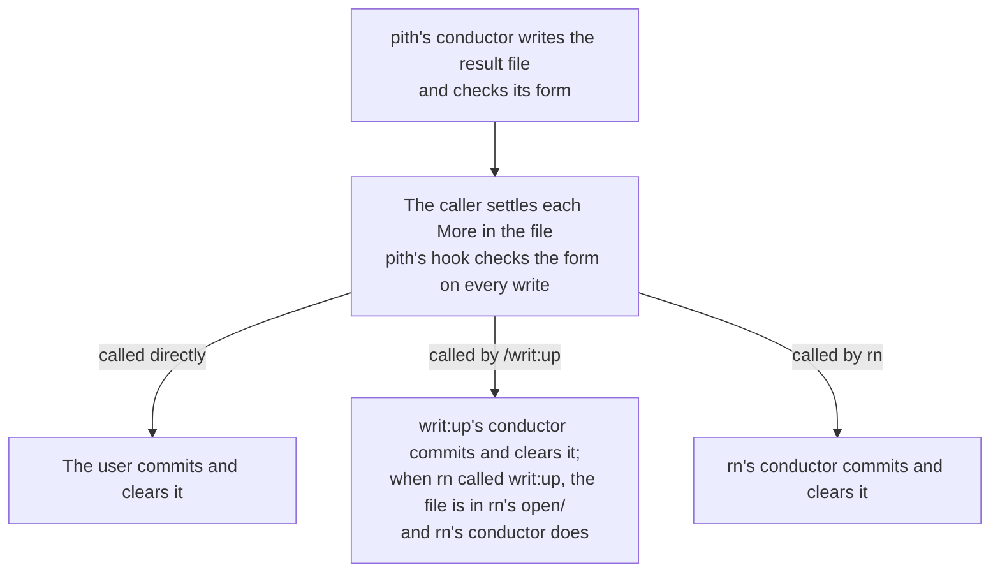
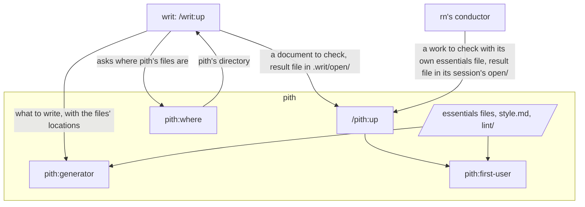

# pith design

Which feature brings each benefit of the [README](../README.md), how it is built, and what must
always hold, so that whoever builds or maintains pith, writ or rn can tell what a change would cost
the user. The flow of use is in the README, and this document points to its sections rather than
telling it again. How to run the checks named here is in the [verification document](./verification.md).

The caller is whoever calls `/pith:up`: the user's own conversation, the conductor of `/writ:up`, or
rn's conductor. pith's conductor is `/pith:up` itself, running in a context of its own; it alone
judges a check. The first user uses the work as its receiver would and reports what happened,
without judging. The generator writes what pith's conductor or `/writ:up` decides. The aim is what
the receiver should gain, written out in sentences by the caller. Essentials file, question, Good,
More and result file mean the same as in the README.

## Acceptance criteria

What would make a user choose pith is attractive quality, and what a user takes for granted is
must-be quality. Each criterion has an ID, by which the features below and the verification document
refer to it.

### Attractive quality

- A1: Installing pith alone, without writ, gives `/pith:up`, which checks any work, such as a
  document, a prompt, code or tests, by a first user's use, first writing the questions for a kind of
  work that has none, such as code or tests.
- A2: writ and rn both check their work through pith, so a change to how work is checked is made in
  pith once and reaches both.

### Must-be quality

- M1: `/writ:up`'s golden paths, writing a new document and fixing an existing one, give no less than
  before pith was split out.
- M2: An rn session's golden path, the plan, the design, the tasks and the deliverable, each checked
  before its sign-off, gives no less than before.
- M3: `/writ:pith` is gone, and whoever called it finds the same check as `/pith:up`, installed with
  writ.
- M4: No copy of pith's parts remains in writ or rn, and each part they share has exactly one home.
- M5: Each plugin keeps `.claude/rules/plugin.md`: tests that run every line in CI, trials, a README
  stating Python 3.9 or later, a CHANGELOG entry, both `claude plugin validate --strict` runs
  passing, and a listing in `.claude-plugin/marketplace.json` and the root `README.md`.

## Four features bring the benefits

- Check a work by its use, and give a Good or More for every question.

    Gives A1, and brings "what happened when the work was actually used" and "names the place in
    the work and quotes what happened there". It works in the README's "Call `/pith:up` with the
    work and your aim" and "Example: checking a prompt that reviews pull requests".

- Write an essentials file for a kind of work that has none, and try it on the work.

    Gives A1, and brings "You can check any kind of work". It works in the README's "Example:
    checking code with no essentials file yet".

- Keep the whole result in a result file that the caller settles.

    Gives A1, bringing "names the place in the work and quotes what happened there", and A2, since
    writ and rn read and settle the same file. It works in the README's "What stays in your
    repository, and how to clear it".

- Be the one place where writ and rn check their work.

    Gives A2, bringing "an improvement to how work is checked is made once in pith and reaches
    both", and M1, M2, M3 and M4. It works in the README's "With writ and rn" and "Getting started".

M5 is held by the machine checks in the last section.

## Principles every feature keeps

- Only pith's conductor judges a check, and only the caller decides what to do with it.

    pith's conductor lays the first user's report beside the aim and gives Good and More. When
    judgment spreads to the first user or the generator, a role that does not know the aim remakes
    even what serves it, and a generator that grades what it wrote fills the holes with what it meant
    and grades too softly. Whether to fix or leave a More is the caller's, since only the caller
    knows the purpose and the discussion. If this broke, a check would report what the maker meant,
    and the first benefit would be gone.

- The first user never learns how the work was made, and its agent definition holds this.

    The first user is a plugin agent with `omitClaudeMd`, started as a separate subagent that does
    not carry over the conversation. Neither it nor the generator has the tool that calls other
    agents, so the generator cannot call the first user and shape what it is told. A subagent can be
    called from the conversation, by the user, from another skill or by another plugin, so watching
    every way it is called with hooks grows tangled, while a definition holds however it is called.
    Here pith relies on a trial whose result runs contrary to the documentation: the official
    sub-agents documentation says `omitClaudeMd` is ignored for plugin agents, but on Claude Code 2.1.285 a plugin agent with it did
    not read the project's CLAUDE.md. Only that version was tried, running the definition with and
    without the field twice each. A first user that knew how the work was made would fill in what
    the work leaves out, so a check would report what the maker meant instead of what happened in
    use, and the user would lose the first benefit.

    The definition also tells the first user not to read the git history, Claude Code's conversation
    records, or the result files of earlier checks in `open/`. Its reading tools are needed to check
    facts, so narrowing the tools cannot keep it out. A hook of pith's stops only what the definition
    cannot hold: the git commands that read history (log, show, diff, blame, reflog, stash) and paths
    under `.claude/projects`. By the official hooks documentation, a plugin's hooks also run on a
    subagent's tool calls and carry `agent_type`, so the hook acts only when it is `pith:first-user`
    and leaves other work alone. Result files in `open/` are kept from it by the definition alone.

- The content of the essentials lives only in the essentials files, and every handoff passes their
  location.

    A copy or a summary drifts each time the essentials are refined, and what the generator aims for
    and what the first user answers drift apart. This holds for writ and rn too: they hand pith the
    location of an essentials file, never its questions.

- Whatever a script can decide is checked by a script, and a check is never skipped.

    A script is fast and gives the same answer every time, and leaves pith's conductor and the caller
    free to judge what only they can. pith's scripts and hooks are written with Python 3's standard
    library only, running on 3.9, so each check can be fixed and tested on its own. python3 comes with
    git in the Mac developer tools, and on Linux and Windows it is no less common than jq, while
    Node.js may not be on the user's machine. When python3 is missing, `/pith:up` stops and tells the
    user to install Python 3.9 or later, and the hook stops the first user's tool calls with the same
    message. A skipped check goes unnoticed, so no one would learn that the rule was not kept.

- In the end only the work remains, and a result file stays in `open/` until it is settled.

    No drafts or notes along the way are left. Left behind, they would be for the user to clear
    away, and the user would not know which is the real one. The first user leaves the working tree as
    it found it, and the generator writes directly into the work.

## Check a work by its use, and give a Good or More for every question

- `/pith:up` is a skill that runs in a context of its own (`context: fork`) with `background: false`,
  so it never carries over the caller's conversation and the caller waits for its result.

    It is a skill, not an agent, because the user calls it by name and other plugins' skills call it
    too. Run apart, pith's conductor never reads the work through the caller's discussion, which
    follows Anthropic's guidance, [Harness design for long-running application
    development](https://www.anthropic.com/engineering/harness-design-long-running-apps), that a role apart from the maker grades more strictly than the maker
    grading its own work. That a forked skill can start the first user was tried on Claude Code
    2.1.285. In an interactive session every agent the Agent tool starts runs in the background,
    nested ones too ([#44](https://github.com/lovaizu/ccpm/issues/44)), and a caller that does not wait reads a half-finished check as finished;
    a forked skill with `background: false` makes the caller wait, and the agent it started ran in the
    foreground, as tried on 2.1.291. The cost of running apart is that an aim not written out cannot
    be checked, so a written aim is a required input.

- Without an aim, pith returns at once and asks for one; before any first user runs, pith's conductor
  checks that the aim covers every question, and otherwise returns the questions it does not cover.

    A question with nothing in the aim to compare against cannot be judged even after a first user has
    used the work, and finding that out before costs less than after.

- pith uses the essentials files the caller names; otherwise, for a document `doc.md` and whichever
  of `readme.md`, `design.md`, `prompt.md` and `essentials.md` fits its kind, and for any other work
  the file for its kind in `.pith/essentials/`.

    `doc.md` asks what happened when the work was read, so it fits every document and nothing that is
    not read. A kind with no file goes to "Write an essentials file for a kind of work that has none".

- The first user is handed only the work's location, the receiver and purpose, the essentials files'
  locations, the language of its report and, on a recheck, the questions to answer: never the aim,
  the maker's Good or More, the style rules, or anything else from the discussion.

    A real receiver knows what they use the work for, so without the purpose the use drifts from the
    real one. The receiver and purpose may name files the receiver holds while using the work, as rn
    names its `steering.md` and the documents the user approved. Knowing the aim, the first user would
    use the work looking for it and fill in what is missing in its head; given the maker's view or the
    style rules, it would spend its attention on them instead of on what only it can do.

- The first user uses the work as its receiver would, decides for itself how, and reports for every
  question what it did and what happened, without judging.

    It reads a document once from the top as its reader, gives a prompt to an AI with `claude -p`,
    calls code and runs tests. A fact of use can be laid beside the aim and compared; a verdict
    cannot. When it stops, unsure, it reports where it stopped, since a real receiver also cannot ask
    the maker, and that is what is being looked for.

- pith's conductor gives each question at least one Good or More, each with its place and evidence
  quoted from the report or the work; each part the report names in answer to a question, such as a
  part read past, a stop or a guess, is a More unless the aim shows the receiver needs it as it is.

    The questions ask what kept the receiver from the purpose, so what the report names there is a
    struggle even when the aim does not mention it. A Good says what the receiver gains, so whoever
    fixes the work knows what must not be lost; a More says what the receiver struggles with, so the
    caller can weigh it against the purpose. pith does not say how to fix a More or decide to leave
    one, since a More put as a fix pulls the caller's decision toward pith's first idea.

- pith writes every question's report and every Good and More in full to the result file, and returns
  to the caller only a short result and the file's location.

    The whole result in the caller's conversation would be too long to read, crowd the caller's
    context, and be lost when the conversation is summarized. The short result opens with pith's view
    of where the work stands against the aim, gives every question one line, Good or More with a few
    words on what the receiver gains or struggles with and where, and sets out each More in full. A
    place alone tells the caller nothing until they read the work there, which is the reading the
    short result is meant to spare.

- When a question comes up, pith returns it to the caller as its result and never asks the user.

    pith does not hold the caller's conversation, so whether to ask the user is for the caller, which
    knows the discussion.

### A first user only where use can show something new

- A check starts a first user once for each work it checks, an essentials file pith writes being one
  such work, and once more for each fixed More the caller judges to be of attractive quality, on that
  question alone; nothing else starts one.

    Whether a fixed attractive-quality More now gives the receiver what the work is for shows only
    when someone who does not know the discussion uses the work again, and the earlier first user used
    it before the fix. A More of quality the user takes for granted, such as a wrong path or a word
    used two ways, is easy to see and quick to fix, so the caller confirms its fix at its place
    without a recheck. Rechecking only that question keeps new remarks from spreading over the whole
    with every fix. Each first user costs the user waiting: when settling the result file also took a
    run of pith, 13 calls of `/writ:up` ran pith 43 times, and three of rn's documents took 2 hours 43
    minutes ([#37](https://github.com/lovaizu/ccpm/issues/37)).

- The caller, which knows the purpose, decides that a fixed More was of attractive quality, and asks
  for the recheck by calling pith again with the result file and that question; pith replaces only
  that question's section.

    Every other question keeps its answer, and a call that does not carry over the earlier
    conversation goes on from where the work stands instead of checking from the start.

## Write an essentials file for a kind of work that has none, and try it on the work

- When no essentials file fits the work's kind and the caller named none, pith writes one in
  `.pith/essentials/`, tries it on this work, and then checks the work with it.

    The user would otherwise have to write the questions before any check, and questions written
    without trying them grow into a list of form. Kept there, the file is used by the next check of
    that kind. A user who has their own essentials files names them in the call, and pith uses those.

- pith's conductor starts the generator (`pith:generator`), which writes the file worked back from the
  work's purpose, following `essentials.md`, `style.md` and the lint.

    Worked back from the purpose, every question asks whether the purpose was met, answered by what
    happened in use, and none asks about means or about how to check. Such questions would grow into
    a checklist that passes while no one has checked the purpose.

- The file is checked as any work is, with `essentials.md` as its essentials file: its receiver is
  whoever checks a work of that kind, and the first user uses it by applying its questions to the real
  work.

    To use an essentials file is to check a real work with it, so that is what is tried. pith's
    conductor judges whether the answers that came out show whether the work met its aim. When no real
    work of the kind exists, pith runs no first user and does not claim the file was tried.

- pith's conductor decides what to fix in the file, starts a new generator for each fix with the
  places to fix and the Goods to keep, and checks each fix at its place.

    The essentials file is pith's own work, so pith, not the caller, decides what to fix. A generator
    asked again reads with the intent of its earlier writing, and one without the Goods to keep breaks
    what already serves the purpose.

## Keep the whole result in a result file that the caller settles

The result file lets the user check what lies behind any line of the short result by reading only
that part, and in the end the work is handed on alone, with nothing of the check beside it. The
following always hold.

- pith writes the result file at the place the caller names, down to the file's name, and otherwise
  at `.pith/open/{NN}-report-{target}.md` at the repository root.

    `/writ:up` names its own in `.writ/open/`, or the place its own caller names, as rn names one in
    its session's `open/` when it has a document written; rn, checking through pith directly, names `open/{NN}-report-{about}.md` in its
    session's directory, so each caller keeps the files it acts on in one `open/`.

- After pith returns, the caller settles the file itself: a fixed More becomes the Good it now is,
  with its place and evidence in the work as it is now, and a More that was left gets `Left because:`
  with the reason.

    The form is held by the check script and a hook, not by who writes the file, so settling it
    starts no agent (#37).

- pith never commits or pushes a result file; only the conductor that talks with the user does, as the
  figure shows.

    The record is kept by the one role that knows what the user decided, and a caller such as rn stops
    every other role from using git. Called directly, pith leaves the commit to the user, as the
    README says.

- `open/` holds only what is not settled: a More is settled when it is fixed, let go with a reason, or
  decided by the user, and a file whose Mores are all settled is cleared by copying its whole text
  into a commit message and deleting it in that commit.

    A file left in `open/` is then the sign that something still waits, also when the conversation
    ends before the user decides. The record stays in the git history, where a More that was let go
    keeps its reason.

- There is one file per target, and a recheck or a settling rewrites that file.

    It then holds only what applies to the work as it is now.

### The form check

`check_result.py` checks a result file against its form: that every question of the essentials
files has its section with at least one Good or More, that every place exists, and that each quote
is really in the work or in the first user's report in the same file. pith's conductor runs it before
returning, and a hook of pith's runs it on every write to a result file, so a file settled by the
caller is held to the same form. The script sits inside pith; a caller relies on the form, not on the
script's insides.

Not decided yet: how the hook knows which essentials files a result file was checked against.
`check_result.py` takes them as arguments, the file's headings carry only each essentials file's
name, not its directory, and no field is to be added to the form. How the hook tells a result file
from other files, and what it does when the check finds a problem, are not decided either.

### The result file's form, a contract with the outside

The file is read by the user, by callers such as writ and rn, and by later versions of pith, so its
form is kept here. The form below does not change, and no field is added now. The text beside each
label is written in the user's language.

- The labels stay as written: `# Check: <target path>` as the first line, `Target:`, `Receiver and
  purpose:`, `Aim:`, `## <essentials file name>: <question>`, `Report:`, `- Good:`, `- More:`,
  `Evidence (work)`, `Evidence (report)` and `Left because:`. In a place, `<line>` is one line or a
  range `a-b`, and paths are relative to the repository root.

    The check script and every caller find each question's section, its report, each Good and More
    and its evidence by these words.

- The file is named `{NN}-report-{target}.md`, with `{NN}` two digits, one more than the highest
  number already in its `open/`.

    When the user opens `open/`, they read what waits for a decision in the order it came.

- The top of the file names the target work, its receiver and purpose, and the aim.

    A later reader knows what aim each Good and More was compared with, without the conversation.

- Every question has its own section, headed by the essentials file's name and the question word for
  word, with the first user's report and at least one Good or More under it.

    With the file's name, the user can read the question in that file, and a script can match the
    essentials file against the result and check that every question has an answer.

- Every Good and More carries its place as `path:line` and evidence quoted from the work or from the
  first user's report.

    With the place, the user looks at that spot instead of the whole work; with the evidence, they
    check pith's judgment instead of trusting it. Both have a fixed form, so a script checks them.

- A Good says what the receiver gains, a More what the receiver struggles with, and a More that was
  left also says why.

    What a Good gains shows what must not be lost in a fix; what a More struggles with lets the user
    decide whether to accept it; the reason shows the More was left by a decision, not missed.

The marks that end each More when the file is cleared, `→ fixed:`, `→ let go:` with the reason, and
`→ to the user:`, belong to the commit message that clears the file, as `.claude/rules/plugin.md`
states, not to the file's form. A reader of the file never meets them, and a caller may add its own
marks to its commit, as rn adds its decision line.

## Be the one place where writ and rn check their work

- Every part of how work is checked has one home, in `pith/`: the `/pith:up` skill with the result
  form and the check script, `pith:where`, the first user and its hook, the generator, the essentials
  files `doc.md`, `readme.md`, `design.md`, `prompt.md` and `essentials.md`, `style.md`, and `lint/`.

    A copy drifts from its source, so an improvement made in one copy does not reach the other
    caller (A2, M4). pith alone needs every one of these to check a document or a prompt and to write
    essentials (A1). They are the parts writ's pith used, moved with their names changed, so pith
    checks as `/writ:pith` did (M3). Their tests and trials live in `dev/pith/`, outside the plugin,
    since installing a plugin copies its whole directory.

- writ and rn each declare pith as a dependency with the range `^0.1.0`, resolved against
  `pith--v<version>` tags; rn declares it directly, since it calls `/pith:up` itself.

    A dependency installs with the plugin that declares it, so installing writ or rn installs pith,
    and installing pith installs neither. By the official documentation, for a plugin at a relative
    path, as here, a range with no matching tag falls back to the marketplace's copy, so until pith is
    released the marketplace's copy is used.

- A caller reaches pith's files through `pith:where`, a skill that returns pith's own directory, under
  which they sit at `references/essentials/`, `references/style.md` and `references/lint/`.

    A plugin cannot name a file inside another plugin: the official documentation gives no path
    variable for a dependency's directory, and `${CLAUDE_PLUGIN_ROOT}` in a skill is its own plugin's
    directory. Tried on Claude Code 2.1.291: a plugin's skill called a dependency's skill that
    returned that directory, and read a file there.

- `/writ:up` starts `pith:generator` to write and fix a document, handing it pith's essentials files,
  `style.md` and `lint/`, and calls `/pith:up` to check it, with its result file in `.writ/open/`.
  writ keeps `/writ:up` and its hook that runs its agents in the foreground.

    The generator is shared: pith starts it to write an essentials file, and `/writ:up` to write a
    document, so it has one home with the essentials it aims for.

- rn calls `/pith:up` for every check it makes, of the plan, the design, a task's result, the
  deliverable, a question and a proposal, and keeps its own essentials files for these, `plan.md`,
  `design.md`, `task-result.md`, `deliverable.md` and `conductor.md`.

    rn hands the work, its essentials file, the receiver and purpose with the paths the receiver holds
    when using the work, such as `steering.md`, the approved documents and feedback, the goal and
    criteria of `steering.md` as the aim, and its session's `open/{NN}-report-{about}.md` as the
    result file. rn's conductor checks each Good and More at its place and decides each More. rn's
    documents are written by `/writ:up`, which checks them through pith in turn. rn keeps no first user
    of its own.

- What callers rely on is `/pith:up`'s inputs and short result, the result file's form,
  `pith:where`'s directory and the paths under it, and `pith:generator`; a change to any of these is
  a change to writ and rn.

    writ's and rn's designs link to this document for how a check runs, and keep only what they hand
    pith and what they do with its result. `background: false` makes callers wait for `/pith:up`
    alone; the agents writ and rn start themselves are outside it, and #44 stays rn's own for them.

The names the user sees are these. The README teaches use with them, so changing one breaks what the
user learned.

- `/pith:up`, pith, first user, Good, More, essentials file, result file
- `doc.md`, `readme.md`, `design.md`, `prompt.md`, `essentials.md`
- `.pith/open/`, `.pith/essentials/`

## Check that the user gets each benefit (validation)

Checking effort goes to A1 and A2 first, because they are why the user chooses pith. They are
checked by using pith as its user would, in situations where the user would plainly struggle without
the benefit; in other situations, whether it arrived cannot be seen. Each scene below gives that
situation and what must happen for it to pass. Where a run starts and how it goes are in the
[verification document](./verification.md).

- A1, checked by use: with pith installed alone, without writ, `/pith:up` checks the pull-request
  review prompt of the README's example, which has one hole, with the README's aim.

    It passes when a More points at that hole with what happened in use as its evidence. The hole is
    one that cannot be seen by reading the prompt and shows only when the prompt is run, so a pass
    shows the check rested on the fact of use, not on a reading.

- A1, any kind of work: with pith installed alone, `/pith:up` checks `cli/src/export.js` of the
  README's example, for which no essentials file exists.

    It passes when pith first writes an essentials file for code in `.pith/essentials/`, and then
    checks `export.js` with it, every question answered from what happened when the code was run.

- A2: one `/writ:up` run and one rn check of a plan against `plan.md`.

    It passes when each starts `pith:first-user` and leaves a result file that passes pith's form
    check, so both reach the one check that a change to pith would change.

What a script can decide is checked by script every time: that no first user, result-form script or
essentials file of pith's remains outside `pith/` (M4), and that each plugin's tests run every line
and both `claude plugin validate --strict` runs pass (M5). The check script is tested on a result file
it stops and one it lets through, and the first user's hook on a call it stops and one it lets
through. M1 to M3 are not checked up front: as `.claude/rules/plugin.md` says, a shortfall in what
the user takes for granted is fixed when it shows in use.
