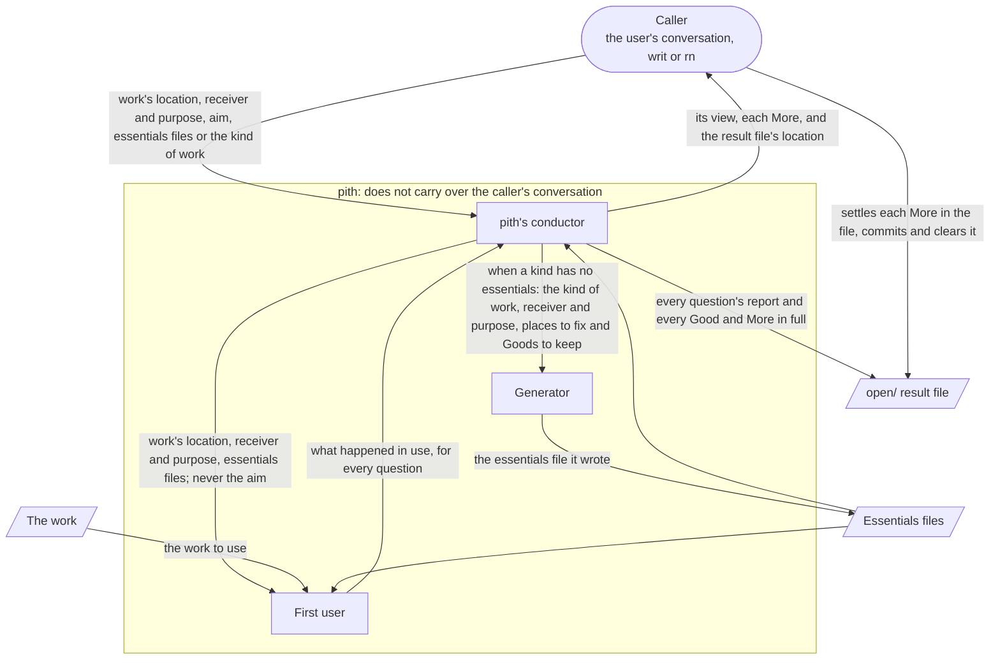
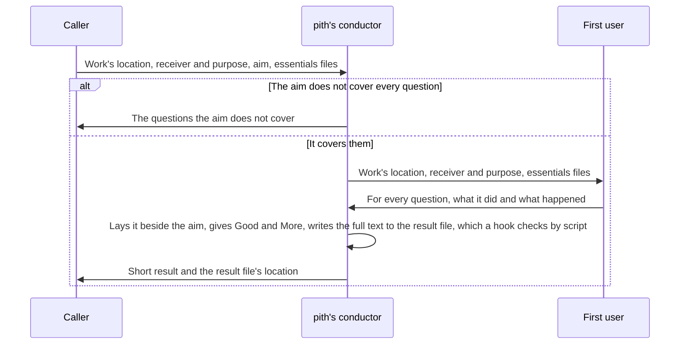
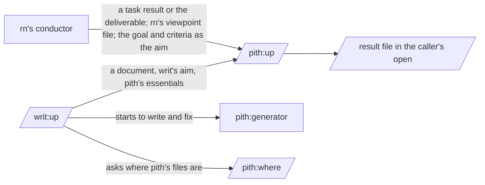
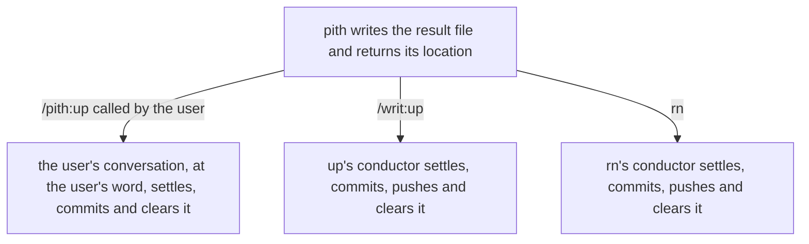

# pith design

pith brings the user the benefits at the top of the [README](../README.md) through one skill, `/pith:up`, which the user calls by name or asks for in words, and which writ and rn call to check their own work. pith was split out of writ, where it was `/writ:pith`, so that it checks any work without a plugin for writing documents, and so that writ and rn check through one place: an improvement to how work is checked is then made once and reaches both. pith is built from three roles: the conductor, the generator and the first user. Only pith's conductor judges and decides what comes next. The generator writes and fixes an essentials file as the conductor decides, and the first user uses the work as its receiver would and reports what happened. Essentials, question, Good, More and first user mean the same as in the README.

## Three features bring the benefits

The benefits are called by the words at the top of the README: "where the receiver falls short, from what happened in use", "each point names its place and quotes what happened", and "check any kind of work".

- Lay the fact of use as the receiver beside the aim and turn it into Good and More.

    It serves "where the receiver falls short, from what happened in use" and "each point names its place and quotes what happened". It works in the README's "Call `/pith:up` with the work and your aim".

- Write essentials worked back from the purpose for a kind of work that has none, and try them on a real work.

    It serves "check any kind of work". It works in the README's "Example: checking code with no essentials file yet".

- Be the one place where writ and rn check their work.

    It brings the benefits above to every work writ and rn check, and makes an improvement to how work is checked reach both at once. It works in the README's "With writ and rn".

## Principles every feature keeps

- Only the conductor judges.

    pith's conductor lays the first user's report beside the aim and gives Good and More, and decides what to fix in an essentials file it wrote. Whether to fix or leave a More in the caller's work is the caller's, which knows the purpose. When judgment spreads to the generator or the first user, a role that does not know the discussion remakes even what serves the purpose. A generator that grades what it wrote fills the holes with what it meant and grades too softly.

- The roles are kept apart by the agent definitions.

    The generator and the first user are plugin agents, `pith:generator` and `pith:first-user`. The first user has `omitClaudeMd` and is called as a separate subagent that does not carry over the conversation. The first user can run commands, so it gives a prompt to an AI with `claude -p` and runs it, and uses code by calling it or running its tests. Neither the generator nor the first user has the tool that calls other agents, so the generator cannot call the first user. What must hold is that, however the first user is called, the discussion never reaches it. A subagent can be called from the conversation, by the user or from another skill, so watching how it is called with hooks grows tangled. An agent definition with `omitClaudeMd` holds however it is called. Here pith relies on what a trial showed, against the documentation: the official sub-agents documentation says this field is ignored for plugin agents, but on Claude Code 2.1.285 a plugin agent with it did not read the project's CLAUDE.md. Only that version was tried, running the definition with and without the field twice each.

    The first user's definition also tells it not to read how the work was made: the git history, Claude Code's conversation records, and the result files of earlier checks in `open/`. Reading them, it would fill the work's holes with the maker's intent. Its reading tools are needed to check facts, so narrowing the tools cannot keep it out. Hooks stop only what the definition cannot hold: the git commands that read history (log, show, diff, blame, reflog, stash) and paths under `.claude/projects`, where the conversation records are. By the official hooks documentation, a plugin's hooks also run on a subagent's tool calls, and inside a subagent the hook's input carries `agent_type`, so the hooks stop these only when it is `pith:first-user` and do not affect other work. The result files in `open/` are kept from it by the definition alone.

- The content of the essentials lives only in the essentials files, and handoffs pass their location.

    The content of the essentials is not copied into other documents or into pith's prompts. A copy or a summary drifts each time the essentials are refined, and what a maker aims for and what the first user answers drift apart. The README names the essentials files, so the user can read in them which question each Good and More answers.

- In the end only the work remains, and a result file stays in `open/` until it is settled.

    No drafts or files of notes along the way are made. Left behind, they would be for the user to clear away, and would leave the user unsure which is the real one. Only the full result of a check is written to a file in `open/`, so that it survives when a long conversation is summarized and does not flow into the caller's conversation, and it is cleared once everything in it is settled.

## Lay the fact of use as the receiver beside the aim and turn it into Good and More

pith is called by the user's conversation, by the conductor of `/writ:up`, or by rn's conductor.

- pith is a skill that runs in a context of its own (`context: fork`, `background: false`) and does not carry over the caller's conversation.

    It is a skill, not an agent, because the user calls it by name and other plugins' skills call it too, and fork keeps the caller's conversation out. That a forked skill can start the first user agent was tried on Claude Code 2.1.285. pith's conductor, which gives Good and More, never reads the work through the caller's discussion. It also follows Anthropic's guidance that a role apart from the maker grades more strictly than the maker grading its own work. The cost is that an aim not written out cannot be checked. So a written aim is a required input of pith.

    In an interactive session every agent the Agent tool starts runs in the background, nested ones too (#44), and a caller that reads what pith returns as finished would read it before the result file exists. A forked skill with `background: false` makes the caller wait for its result; tried on Claude Code 2.1.291, the first user it started ran in the foreground. A prompt cannot hold this for every caller, while the skill's own setting holds however pith is called.

- pith uses the essentials files named in the call. When none are named, for a document it uses `doc.md` and adds whichever of `readme.md`, `design.md` and `essentials.md` fits its kind; for a prompt, `prompt.md`; for a Claude Code plugin, `plugin.md` with `prompt.md` for its skills and agents; for any other kind, the file for that kind in `.pith/essentials/`, written first as in the next section when there is none.

    `plugin.md` runs the plugin's README story from end to end and asks what the user spent on it: how long they waited, how much they read to decide, what they were asked. Every scene of a plugin can pass while the whole path costs the user hours, and that shows only on the whole path.

    `doc.md` asks what happened when the work was read as its reader, so it fits every document and nothing that is not read. A caller that keeps its own questions for its kinds of work, as rn does, names them, so its questions stay its own while how the check runs stays pith's. The choice is the same whether writ is installed or not, so a former `/writ:pith` user gets the same check with the same questions.

- Before starting a first user, pith's conductor checks that the aim, written in sentences, covers every question, and if not, returns as it is.

    A question with no aim to compare against cannot be judged even after a first user has used the work. Finding that out before costs less than after.

- The first user is handed only the work's location, the receiver and purpose, and the essentials files: never the aim, and nothing else from the discussion or from the maker.

    A real user also knows what they use the work for. Without the purpose, its use drifts from the real one. Knowing the aim, on the other hand, it would use the work looking for it and fill what is missing in its head. A paraphrase test, too, never shows the reader the right answer.

- The first user actually uses the work as its receiver and reports, for every question, what it did and what happened. It does not judge. How to use and check the work is the first user's to decide.

    For a document, it is what it took in and what it set out to do, reading as the reader. For a prompt, what the AI did when given it with `claude -p` and run; for code, what happened when it was called. A fact of use can be laid beside the aim and compared. When it stops, unsure, it reports that it stopped. A real user also stops, unable to ask the maker, and that is exactly what is being looked for.

- pith's conductor lays the report beside the aim and gives each question a Good or More. A Good carries its place and what is gained, a More its place and the struggle, and both carry evidence quoted from the report or the work. Each part the report names in answer to a question, such as a part read past, a stop or a guess, is a More, unless the aim shows the receiver needs it as it is.

    The questions ask for what kept the receiver from the purpose, so what the report names there is a struggle even when the aim does not mention it. Judged by the aim alone, a part read past that the aim says nothing about comes back as a Good, and the caller hands on a work with parts no one uses.

- pith writes every question's report and every Good and More in full to the result file, and returns to the caller a short result and the file's location.

    Returning the full text would fill the caller's conversation. The short result holds only what the caller decides: the conductor's view of how close the work comes to the aim, and each More in full. A line for every question would grow with the questions, and a caller asked to decide from a list that grows with the work either reads all of it or stops reading (#46). The Goods stay in the file, where whoever fixes reads what must not be lost.

- A first user is started once for a work. Whether a fix holds, the caller sees by doing again what the first user did where the More was found, and seeing that it no longer happens; pith is not run again. Every other More the caller settles in the file itself: a fixed one is rewritten as its Good, a left one gets `Left because:`.

    Started again after a fix, a new first user brings fresh small remarks with every run, so the checking never ends and each round keeps the user waiting. What the first user reported is concrete, what it did and what happened, so whether that still happens can be seen by repeating it, which needs no one who does not know the discussion. When a More shows something the essentials did not ask, the caller keeps it as a viewpoint of its own for that work and proposes it for the essentials at the end, so the essentials grow from what use showed. pith used to run once more only to write the caller's settling into the file; a hook now checks the form on every write, so that run is gone (#37).

- A hook of pith's checks the form of a result file by script every time one is written, by pith or by its caller: that every question has an answer, that every place exists, and that each quote is really where it was quoted from, which is the work or the first user's report in the same result file.

    What a machine can decide, checked by a machine, is fast and gives the same answer every time. The caller receives only what was already checked, so it does not check the same again, and a caller's settling cannot break the form unseen. The script sits inside pith and nothing else calls it, because a caller that relied on its insides would break when pith's build changed. The script, and the hooks that stop the first user, are written with Python 3's standard library only, so each check can be fixed and tested on its own as checks grow. python3 comes with git in the Mac developer tools, and on Linux and Windows it is no less common than jq, while Node.js may not be on the user's machine. When python3 is missing, pith stops instead of skipping a check: it tells the user to install Python 3.9 or later, and the hook stops the first user's tool calls with the same message. A skipped check goes unnoticed, so no one would learn that the rule was not kept.

- When a question comes up, pith does not ask the user but returns it to the caller as its result.

    pith does not hold the caller's conversation, so whether to ask the user is for the caller, which knows the discussion, to decide.

## Write essentials worked back from the purpose, and try them on a real work

- When a work's kind has no essentials file and none is named, pith writes one before checking, from the kind of work, its receiver and purpose, and the aim, and tries it on the work handed in. It keeps it at `.pith/essentials/<kind>.md`, so the next check of that kind uses the same questions. A caller can also ask pith only to write essentials for a kind, naming where to put them, and hand a real work if one exists.

    The aim is what the caller wants from the essentials, that is, what a receiver should gain from a work checked with them. pith's conductor compares with it when it checks the essentials file it wrote. Writing them first, rather than returning to ask for them, is what lets a kind no one has written questions for be checked in one call.

- pith's conductor calls the generator, and the generator writes the essentials file worked back from the purpose, following the essentials for essentials files (`essentials.md`).

    Essentials are a few questions that ask whether the purpose was achieved, answered by what happened in use. Worked back from the purpose, no question asks about means. No question asks how to check, so the essentials do not become a checklist.

- The essentials file written is checked in the flow above, with the essentials for essentials files. The first user applies the file's questions to a real work and actually tries checking it.

    The user of an essentials file is whoever checks a work with it, so to use it is to try checking a real work. The first user reports, for every question, what it did to check, what answer came out, and where it stopped. Whether the answers show if the purpose was achieved is for pith's conductor to judge. If no real work exists yet, it cannot be tried, so pith does not claim it was tried; it is tried the first time a real work is checked.

- pith's conductor decides what to fix, has a new generator fix it with the places to fix and the Goods to keep, and checks at each More's place that it is fixed before using the file on the work.

    An essentials file is pith's own work, so pith decides whether to fix it. A generator asked again reads the file with the intent of its earlier writing, and one that does not know the Goods to keep breaks them while it fixes.

## Be the one place where writ and rn check their work

- writ and rn each declare pith as a dependency, so installing either installs pith. rn declares it directly, not through writ, since it calls `/pith:up` itself.

    By the official documentation, a dependency installs with the plugin that declares it. Both plugins call pith's skills and agents, which the documentation names as what a dependency is for. The three are released together, so each follows the marketplace's copy of the others.

- writ keeps `/writ:up`, and writes and fixes a document with `pith:generator`. It learns where pith's essentials files, `style.md` and `lint/` are from a small skill of pith's, `pith:where`, that returns pith's own directory.

    The essentials files and the style rules each have one home, in pith, so an improvement to them reaches writ's writing and pith's checking at once. A plugin cannot name a file inside another plugin: `${CLAUDE_PLUGIN_ROOT}` is always the plugin's own directory, and no variable is given for a dependency's. Tried on Claude Code 2.1.291, a plugin's skill called a dependency's skill that returned that directory, and read a file there.

- `/writ:up` hands `/pith:up` the result file's place in `.writ/open/`, as it did with `/writ:pith`. Called directly, pith writes to `.pith/open/` at the root of the repository.

- rn calls `/pith:up` only where use shows what its maker cannot see: a task's result and the finished deliverable. It hands the work, its own viewpoint file as the essentials, the receiver and purpose with the paths the receiver holds when using the work, `steering.md`'s goal and criteria as the aim, and its session's `open/{NN}-report-{about}.md` as the result file. Its documents are checked once, by writ through pith, with rn's design viewpoints added to writ's. A question or a proposal rn writes to the user is not checked: the user reads it themselves, and a first user before them only makes them wait (#45).

    rn's viewpoint files are for its own kinds of work and stay rn's; what moves is the first user, the comparison with the aim, and the result file's form, which rn had kept in copies of its own (`rn/agents/first-user.md`, `rn/references/essentials/report.md`, and the hooks that kept its first user to its report), and which had grown apart from pith's. They are removed from rn.

- `writ/docs/design.md` and `rn/docs/design.md` link this document for how a check runs, and keep only what they hand pith and what they do with its result.

    A copy of how a check runs, kept in three designs, would drift as pith's did in rn.

## The result file: who writes, who settles, and its form

The result file lets the user check what lies behind any line of the short result by reading only that part of the file, and in the end leaves the work alone, with nothing of the check beside it. The following always hold.

- pith writes the result file at the place the caller names in its request, down to the file's name, or at `.pith/open/{NN}-report-{target}.md`. The caller writes in it only to settle a More, and a hook checks its form on every write.

    Its form is then checked every time, whoever writes, and no caller relies on pith's insides.

- Only the conductor that talks with the user commits, pushes and clears it, as the figure shows; pith does not commit it, however it is called. Called directly, pith leaves the file uncommitted, and the user commits it when they want it kept.

    The record, the git history and `open/`, is kept by the one role that knows what the user decided; a role that is called writes and returns, and a caller such as rn stops any other role from using git.

- `open/` holds only what is not settled. A More is settled when it is fixed, let go with a reason, or decided by the user, and a file whose Mores are all settled is cleared: its whole text is copied into a commit message, and the file is deleted in that commit.

    A file in `open/` is then the sign that something needs action, also when the conversation ends before the user decides. The record stays in the git history, where a More that was let go keeps its reason and can be read later as a road not taken.

- There is one file per target, and checking the same target again rewrites that file.

    It then holds only what applies to the work as it is now.

The result file's form is a contract with the outside, because the file is read by the user, by writ and rn, and by later versions of pith. Its form is the one it had as `/writ:pith`'s, with one field added, `Essentials:`, and the following hold in every version. A field is added only when a reader needs something the form does not hold: the hook that checks a file written by the caller must know which essentials files its questions come from, and two callers can each have a `design.md`. The marks that end each More in the commit message that clears the file, `→ fixed:`, `→ let go:` with the reason, and `→ to the user:`, belong to that commit, not to the file's form.

- The labels stay as written, while the text beside them is written in the user's language: `# Check: <target path>` as the first line, `Target:`, `Receiver and purpose:`, `Essentials:` with the path of each essentials file, `Aim:`, `## <essentials file name>: <question>`, `Report:`, `- Good:`, `- More:`, `Evidence (work)`, `Evidence (report)` and `Left because:`. In a place, `<line>` is one line or a range `a-b`, and paths are relative to the repository root.

    The check script finds each question's section, its report, each Good and More and its evidence by these words.

- The `{NN}` in the file name is two digits, one more than the highest number already in `open/`.

    When the user opens `open/`, they read what waits for a decision in the order it came.

- The top of the file names the target work, its receiver and purpose, and the aim.

    A later reader knows what aim each Good and More was compared with, without going back to the conversation.

- Then every question has its own section, headed by the essentials file's name and the question written word for word, with the first user's report and at least one Good or More under it.

    With the essentials file's name, the user can read the question in that file. Since the question has the same characters as in the essentials file, a script can match the file against it and check that every question has an answer.

- Every Good and More carries its place as `path:line` and evidence quoted from the work or from the first user's report.

    With the place, the user looks at that spot instead of the whole work. With the evidence, the user checks pith's judgment instead of trusting it. Both are in a fixed form, so a script can check that the place exists and that the quoted text is really where it was quoted from. A quote from the work is looked for in the work, and a quote from the first user's report is looked for in the report in the same result file.

- A Good says what the receiver gains, a More says what the receiver struggles with, and a More that was left also says why it was left.

    What a Good gains shows, by its effect on the receiver, what must not be lost when the work is fixed. What a More struggles with lets the user decide, by its effect on the receiver, whether to accept a More that was left. The reason shows the More was left by a decision, not missed, and whether it is for the user to decide.

The names the user sees are the following. The README teaches use and the essentials with these names, so changing them breaks what the user learned from the README.

- `/pith:up`, pith, first user
- Good, More
- The essentials files' names: `doc.md`, `readme.md`, `design.md`, `prompt.md`, `essentials.md`
- `.pith/open/`, `.pith/essentials/`

## Check quality by using pith where its benefits can be seen (validation)

Checking effort goes to the benefits first, because they are why the user chooses pith. They are checked by validation: use pith as its user would, in the README's example situations, and lay what happened beside the benefits. The situations chosen are ones where, without the benefit, the user would plainly struggle. Quality the user takes for granted is not checked up front, beyond what a script decides; it is fixed when it shows up in use. The scenes, their inputs and when each passes are in the [verification document](verification.md).

Every quality is checked with a separate subagent that does not know the discussion. It runs pith in the user's place, uses what comes back, and reports what happened. Pass or fail is decided by the conductor checking pith, which lays the report beside the benefits. Each situation is run once, since running it costs time and money.

### Benefits

- The user learns where the receiver falls short, from what happened in use, with each point at its place and quoted.

    In the README's situation of the prompt that reviews pull requests, with pith installed and writ not, `/pith:up` checks a prompt with one hole that misses the aim. It passes when a More pointing at that hole comes back with what happened in use as its evidence. The hole put in is one that cannot be seen by reading the prompt and shows only when it is run. A hole seen by reading alone would not show whether the check rested on the fact of use.

- The user can check a kind of work no one has written questions for.

    In the README's situation of code with no essentials file, `/pith:up` checks it. It passes when pith writes `.pith/essentials/code.md`, every question can be answered from what happened when the first user used the code, and the check with it finds the mistyped value the aim speaks of.

- writ and rn check through pith.

    One `/writ:up` run and one check of an rn plan each start `pith:first-user` and leave a result file that passes pith's form check.

- A check costs the caller less than `/writ:pith` did.

    On every run above, the time the caller waited, the number of first users started, and the lines of the short result are recorded and set beside the same situation run with `/writ:pith` of writ 0.1.0. What the caller spends on a check is part of what pith gives, and shows only when a whole check is run.

### Quality the user takes for granted

What a machine can decide is checked by script every time. It is fast, gives the same answer every time, and leaves the conductor's attention for judging the benefits.

- Comparing the working directory before and after a run, only the result file in `open/`, and an essentials file pith wrote, have changed.
- pith's Good and More answer every question, every place exists, and every quoted piece of evidence is in the work or in the first user's report. The hook checks this on every write, and the script is tested with Python's unittest on a case it stops and a case it lets through.
- While a first user runs, the hooks stop reading git history and conversation records. This too is tested with unittest.
- No first user, form-check script or essentials file of pith's is left in writ or rn.

The rest of it, such as not being asked the same thing twice, not being left waiting, and facts matching the repository, is left to use, since such failures are easy to see and quick to fix.

### What is not checked

Only the README's example situations above are tried. Other kinds of work or receivers, and other flows, are not. The design relies on the essentials being written in words that fit any kind of work.
