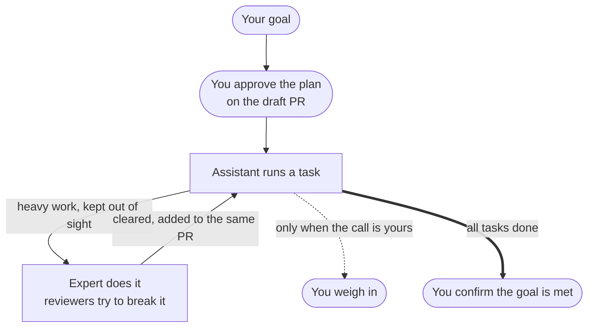

# rn — Right Now

Start by naming a goal, and pick up right where you left off after any break. One task at a time, with quality built in as you go.

## Install

`rn` ships from the `ccpm` marketplace. In Claude Code, add the marketplace once, then install the plugin:

```console
> /plugin marketplace add lovaizu/ccpm
> /plugin install rn@ccpm
```

That makes `/rn:on`, `/rn:dn`, and `/rn:up` available.

## How it works



One assistant stays with you the whole time; the experts and reviewers work behind the scenes, so the trial-and-error never crowds the conversation. You sign off on the plan up front, then the assistant works through the tasks without stopping to ask you for each one — they pile up on the same PR as the reviewers clear them. It pulls you back in only when a call is genuinely yours, and at the very end you confirm the goal is actually met before the session closes.

## Getting started

Say you want to push through "fix the bug in the payment screen."

### 1. Start — `/rn:on`

Tell it your goal. It restates the goal as it understands it, breaks it into verifiable tasks, and opens a draft PR with the full plan for you to review — too much to read comfortably in the console.

```console
> /rn:on fix the bug in the payment screen

● ── payment-fix: payments complete on the payment screen ──
  👉 plan sign-off ── asking now: review the plan on the draft PR, approve to start #1
  ⬜ #1–#3   reproduction test / root-cause fix / regression check
  (after approval, tasks run one by one without stopping to ask)

  Captured your goal as I understand it:
    "Fix the bug on the payment screen so payments complete successfully"

  Steering: .rn/20260702-payment-fix/steering.md
  Draft PR with the full plan: https://github.com/you/repo/pull/42
```

That opening block — ✅ done / 👉 now / ⬜ ahead — heads every message that stops for your input, so you always see where the session stands without opening steering.md.

Read the plan on the PR, approve, and the assistant begins the first task — from here it's the loop above, one task at a time, each task added to the same PR as the reviewers clear it, without stopping to ask you again until the goal is met.

### 2. Step away — `/rn:dn`

Context is full, or you're done for the day. Run it and your work is committed / pushed, with a note left for next time.

```console
> /rn:dn

● Committed and pushed — "test: add reproduction test for payment failure"
  Last completed: #1 reproduction test
  Up next:        #2 find the root cause and fix it

  Run /clear, then start a fresh conversation with /rn:up.
```

### 3. Come back — `/rn:up`

Run it in a fresh conversation. It finds where you stopped from git and resumes from there.

```console
> /rn:up

● Found a suspended session: payment-fix
  Reconciled with the git log — #1 is done.

● Resuming from #2: find the root cause and fix it
```

---

`on` is just once, at the very start. After that, each break is just **`dn` → `/clear` → `up`**, and your work stays unbroken until the goal is met.

> Run `/clear` yourself after `/rn:dn` — a plugin can't clear the context for you.

## Why on / dn / up?

They're a two-letter power set — on / down / up — easy to keep straight because they track the session's own state:

- **`on`** — *power on.* You sit down and start a session.
- **`dn`** — *down.* You take the session down for now — a pause, not quitting. ("down" trimmed to two letters to match.)
- **`up`** — *up.* You bring the session back up and pick up where you left off.
