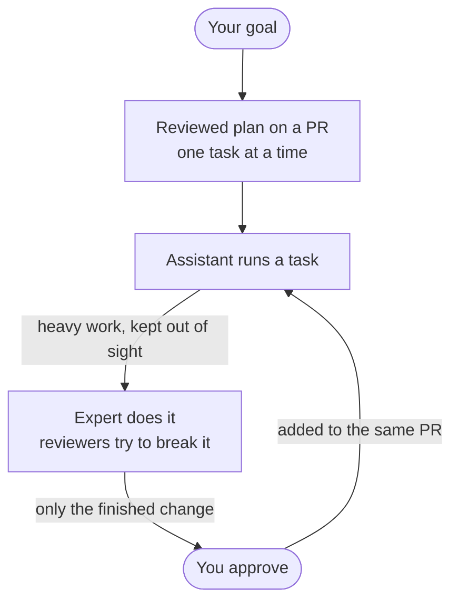

# rn — Right Now

Start by naming a goal, and pick up right where you left off after any break. One task at a time, with quality built in as you go.

## Install

`rn` ships from the `ccpm` marketplace. In Claude Code, add the marketplace once, then install the plugin:

```console
> /plugin marketplace add lovaizu/ccpm
> /plugin install rn@ccpm
```

That makes `/rn:rdy`, `/rn:brb`, and `/rn:bak` available.

## How it works



One assistant stays with you the whole time; the experts and reviewers work behind the scenes, so the trial-and-error never crowds the conversation. What reaches you is the finished change — and nothing lands until you approve.

## Getting started

Say you want to push through "fix the bug in the payment screen."

### 1. Start — `/rn:rdy`

Tell it your goal. It restates the goal as it understands it, breaks it into verifiable tasks, and opens a draft PR with the full plan for you to review — too much to read comfortably in the console.

```console
> /rn:rdy fix the bug in the payment screen

● Captured your goal as I understand it:
    "Fix the bug on the payment screen so payments complete successfully"

  Location: .rn/payment-fix/steering.md
    □ #1  Write a test that reproduces the payment failure
    □ #2  Find the root cause and fix it
    □ #3  Check for regressions

  Opened a draft PR with the full plan: https://github.com/you/repo/pull/42
  Review the steering there and approve to start #1.
```

Read the plan on the PR, approve, and the assistant begins the first task — from here it's the loop above, one task at a time, each approved task added to the same PR.

### 2. Step away — `/rn:brb`

Context is full, or you're done for the day. Run it and your work is committed / pushed, with a note left for next time.

```console
> /rn:brb

● Committed and pushed — "test: add reproduction test for payment failure"
  Last completed: #1 reproduction test
  Up next:        #2 find the root cause and fix it

  Run /clear, then start a fresh conversation with /rn:bak.
```

### 3. Come back — `/rn:bak`

Run it in a fresh conversation. It finds where you stopped from git and resumes from there.

```console
> /rn:bak

● Found a suspended session: payment-fix
  Reconciled with the git log — #1 is done.

● Resuming from #2: find the root cause and fix it
```

---

`rdy` is just once, at the very start. After that, each break is just **`brb` → `/clear` → `bak`**, and your work stays unbroken until the goal is met.

> Run `/clear` yourself after `/rn:brb` — a plugin can't clear the context for you.

## Why rdy / brb / bak?

They're the chat shorthand you'd naturally type at each moment, so they're easy to remember — and all three letters:

- **`rdy`** — *ready.* You sit down and start on a goal.
- **`brb`** — *be right back.* You step away for now — a break, not quitting.
- **`bak`** — *back.* You're back; pick up where you left off. ("back" trimmed to three letters to match.)
