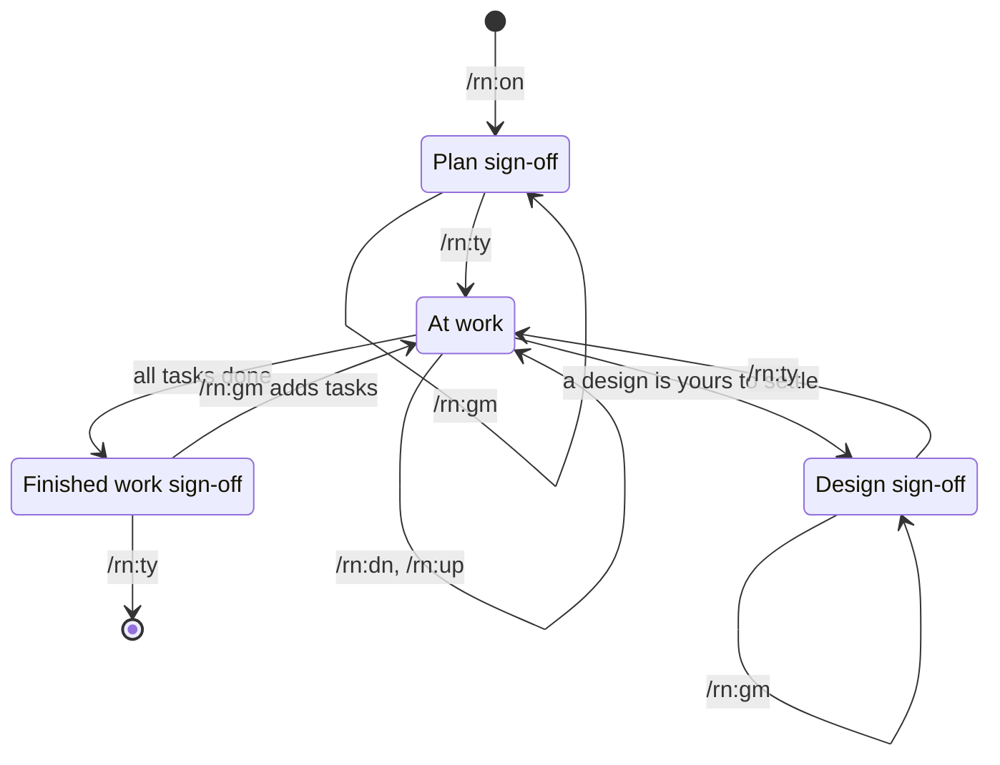

# rn — Right Now

Most AI agents need a carefully written prompt and someone watching them to get a task done. `rn`
doesn't: give it a goal, roughly, with `/rn:on`. It works out with you what you actually want, then
carries the work through without you, and calls you back only for the decisions that are yours. One
goal carried through to the end is a session, and a session lives in git — its record in `.rn/` in
your repository, its work on a pull request — so it survives a full context, a `/clear`, or the end
of the day. You can start right now, with nothing prepared.

## What you need

- [Claude Code](https://code.claude.com)
- A git repository with its remote on GitHub
- The [GitHub CLI](https://cli.github.com) `gh`, logged in to that GitHub with `gh auth login`,
  since `rn` opens and updates a pull request

## Install

`rn` ships from the `ccpm` marketplace. In Claude Code, add the marketplace once, then install the
plugin:

```console
> /plugin marketplace add lovaizu/ccpm
> /plugin install rn@ccpm
```

## How a session goes

A session is at work, paused by you, or stopped for you at a sign-off: a point where you approve
something before the work goes past it. `rn` stops only where the call is yours:

- **the Plan sign-off** — before any work starts;
- **a Design sign-off** — where the work changes what your product should be, or where taste, scope,
  or cost against benefit is yours to weigh, as when the current way does not settle however it is
  fixed. Say a payment times out: whether it retries or fails over is yours to settle. `rn` talks it
  through with you one point at a time, and writes it into your README and design document — the
  ones it finds in your repository, or `README.md` and `docs/design.md` when there are none. You
  approve those, and the work is built to them;
- **the Finished work sign-off** — whether the finished work does what you wanted.


```mermaid
stateDiagram-v2
    state "Plan sign-off" as Plan
    state "At work" as Work
    state "Design sign-off" as Design
    state "Finished work sign-off" as Finished

    [*] --> Plan: /rn:on
    Plan --> Plan: /rn:gm
    Plan --> Work: /rn:ty
    Work --> Work: /rn:dn, /rn:up
    Work --> Design: a design is yours to settle
    Work --> Finished: all tasks done
    Design --> Design: /rn:gm
    Design --> Work: /rn:ty
    Finished --> Work: /rn:gm adds tasks
    Finished --> [*]: /rn:ty
```

- **`/rn:ty` approves, `/rn:gm` asks for changes.** Either one acts on your answer and stops. Say "go
  on" to continue in the same conversation, or `/clear` first when you want a fresh one, then
  `/rn:up`.
- **`/rn:dn` pauses the work anywhere**, and `/rn:up` picks it up again, in this conversation or a new
  one.
- **`/rn:ty` or `/rn:gm` at work, and `/rn:dn` at a sign-off, only tell you where the session
  stands.** `/rn:up` at a sign-off you have not answered stops there again.
- **`/rn:up` also brings a session started under an earlier `rn` up to date**: it reads the old plan
  and the work done, asks only what they leave unclear, and stops for you to approve the new plan, on
  the same branch and pull request.

## A session, start to finish

Say the payment screen fails now and then, and you want it fixed.

### 1. Start — `/rn:on`

Say what you want, as roughly as it comes to mind. `rn` tells you how it reads it, one point at a
time — what you want, why, how you'd know it's done, how to go about it — and moves on only when
you agree. It looks up what the repository can answer instead of asking you.

```console
> /rn:on the payment screen fails sometimes, fix it

● Here's how I read it: payments with a saved card fail about one time in twenty — the error log
  shows a timeout from the card service. Is that the failure you mean?

> yes, and customers give up when it happens

● So the point is that a customer who pays gets through, not only that the error goes away —
  a retry or a clear message would count too. Is that right?
```

Once the goal and the way to it are agreed, `rn` writes the plan and puts it on a draft pull
request. The plan is a numbered list of tasks, each sign-off one of them, and it runs only as far as
your next decision; once you decide, `rn` writes the tasks that follow from it.

```console
● ── payment-fix: customers who pay get through ──
  👉 #1 Plan sign-off ── read the plan on the PR: /rn:ty to approve, /rn:gm <feedback> to revise
  ⬜ #2 reproduce the timeout / #3 Design sign-off
  (after approval, #2 runs without you; at #3 we settle together how a payment recovers from the
  timeout, and I write it into the README and design doc for you to approve)

  Draft PR: https://github.com/you/repo/pull/42
```

The map on top heads every message where `rn` stops: ✅ done, 👉 now, ⬜ ahead.

### 2. Answer — `/rn:ty` and `/rn:gm`

Every decision is answered the same way: `/rn:ty` approves, `/rn:gm <feedback>` asks for changes,
and plain `/rn:gm` takes your review comments on the pull request as your feedback.

```console
> /rn:ty

● Approved: Plan sign-off. Next: say "go on", or /clear and /rn:up.
```

### 3. While it works

You don't watch. Each task is made by one agent and evaluated by another, so work passes because it
does its job, not because its maker says so. Each time `rn` decides what to do next, it says so in
one line, so when you glance back you can follow it:

```console
● #2 reproduce the timeout ── decided: not reached (the test passes without the fault) → retry
● #2 reproduce the timeout ── decided: reached → #3
```

Every evaluation is committed with the session, so you can read it on the pull request. Why `rn` is
built this way is in its [design document](./docs/design.md).

### 4. Step away — `/rn:dn`, then `/rn:up`

Context nearly full in the middle of the work, or done for the day: `/rn:dn` records where the
session stands and pushes everything. Run `/clear` yourself when you want a fresh conversation (a
plugin can't), then `/rn:up`.

```console
> /rn:dn

● ── payment-fix: customers who pay get through ──
  ✅ #1 Plan sign-off
  👉 #2 reproduce the timeout ── stopped here; next: /rn:up
  ⬜ #3 Design sign-off

> /clear
> /rn:up

● Resuming payment-fix at #2: reproduce the timeout
```

### 5. Finish

At the Finished work sign-off, you approve the finished work. On `/rn:ty` the pull request is marked
ready; the merge is yours. The session leaves behind only its `.rn/` directory and the work itself.

## The names

`on` / `dn` / `up` follow a race: **on** your marks, cool **d**ow**n** for a pause, warm **up** to
go on. `ty` / `gm` are two thanks: **t**hank **y**ou approves, **g**ood, **m**ore asks for more.

## License

[MIT](../LICENSE)
