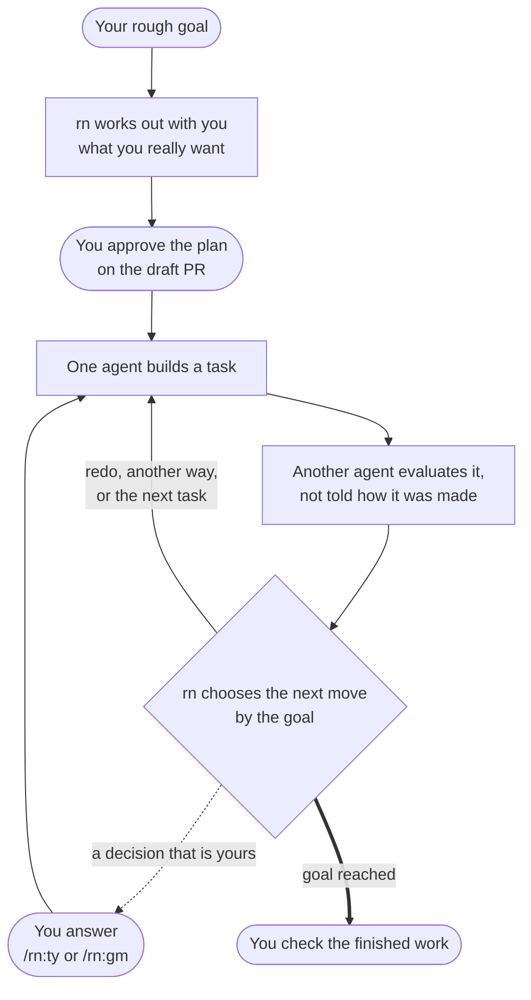

# rn — Right Now

Most AI agents need a carefully written prompt and someone watching them to get a task done. `rn`
doesn't: give it a goal, roughly, with `/rn:on`. It works out with you what you actually want, then
carries the work through without you, and calls you back only for the decisions that are yours. The
session lives in git, so it survives a full context, a `/clear`, or the end of the day. You can start
right now, with nothing prepared.

## Install

`rn` ships from the `ccpm` marketplace. In Claude Code, add the marketplace once, then install the
plugin:

```console
> /plugin marketplace add lovaizu/ccpm
> /plugin install rn@ccpm
```

## How it works


```mermaid
flowchart TD
  G([Your rough goal]) --> O[rn works out with you<br/>what you really want]
  O --> P([You approve the plan<br/>on the draft PR])
  P --> B[One agent builds a task]
  B --> J[Another agent evaluates it,<br/>not told how it was made]
  J --> C{rn chooses the next move<br/>by the goal}
  C -->|redo, another way,<br/>or the next task| B
  C -.->|a decision that is yours| Y([You answer<br/>/rn:ty or /rn:gm])
  Y --> B
  C ==>|goal reached| D([You check the finished work])
```

## A session, start to finish

Say the payment screen fails now and then, and you want it fixed.

### 1. Start — `/rn:on`

Say what you want, as roughly as it comes to mind. `rn` tells you how it reads it, one point at a
time — what you want, why, how you'd know it's done, how to go about it — and moves on only when
you agree. It looks up what the repository can answer instead of asking you.

```console
> /rn:on the payment screen fails sometimes, fix it

● Here's how I read it: payments with a saved card fail about one time in twenty — the error log
  shows a timeout from the card service. Is that the failure you mean?

> yes, and customers give up when it happens

● So the point is that a customer who pays gets through, not only that the error goes away —
  a retry or a clear message would count too. Is that right?
```

Once the goal and the way to it are agreed, `rn` writes the plan — only as far as the next decision
that is yours, since what comes after depends on it — and puts it on a draft pull request.

```console
● ── payment-fix: customers who pay get through ──
  👉 #1      plan sign-off ── read the plan on the PR: /rn:ty to approve, /rn:gm <feedback> to revise
  ⬜ #2–#3   reproduce the timeout / design sign-off
  (after approval, #2 runs without you; you're called again at #3 to choose between retry and
  failover)

  Draft PR: https://github.com/you/repo/pull/42
```

The block on top heads every message that stops for you: ✅ done, 👉 now, ⬜ ahead.

### 2. Decide — `/rn:ty` and `/rn:gm`

Every decision is answered the same way: `/rn:ty` approves, `/rn:gm <feedback>` asks for changes,
and plain `/rn:gm` takes your review comments off the pull request. Where you choose between ways,
`/rn:ty` takes the one `rn` recommends and `/rn:ty <choice>` another. `rn` records the decision in the
session and stops there.

```console
> /rn:ty

● Approved: plan sign-off. Next: /clear, then /rn:up — or say "go on" to continue here.
```

A fresh conversation picks the session up from what was recorded, so a long session never runs out
of room.

### 3. While it works

You don't watch. Each piece of work is built by one agent and evaluated by another, which is told
the goal but not how the work was made — so work passes because it does its job, not because its
maker says so. Between them, `rn` decides the next move by the goal: send the work back, try another
way, bring you in, or go on. Each decision is one line, so when you glance back you can follow it:

```console
● #2 reproduce the timeout ── evaluated: fails (the test passes without the fault) → redo
● #2 reproduce the timeout ── evaluated: passes → #3
```

Every evaluation is also on the pull request, beside the change it evaluated.

### 4. Called back

`rn` stops for you only where the call is yours:

- **the plan** — before any work starts;
- **an approach** — where taste, scope, or cost against benefit is yours to weigh, including when
  the current way keeps falling short;
- **the finished work** — whether it does what you wanted.

### 5. Step away — `/rn:dn`, then `/rn:up`

Context nearly full, or done for the day: `/rn:dn` records where the session stands and pushes
everything. Run `/clear` yourself (a plugin can't), then `/rn:up` in the fresh conversation.

```console
> /rn:dn

● ── payment-fix: customers who pay get through ──
  ✅ #1      plan sign-off
  👉 #2      reproduce the timeout ── stopped here; next: /clear, then /rn:up
  ⬜ #3      design sign-off

> /clear
> /rn:up

● Resuming payment-fix at #2: reproduce the timeout
```

### 6. Finish

At the last sign-off you check the finished work. On `/rn:ty` the pull request is marked ready; the
merge is yours. The session leaves behind only its plan, `steering.md`, and the work itself.

## Coming from an earlier rn

A session started under any earlier version of `rn` is rebuilt the next time you run `/rn:up` on it:
`rn` reads the old plan and the work done, asks only what they leave unclear, and stops for you to
approve the new plan — on the same branch and pull request.

## Why these names?

`on` / `dn` / `up` follow a race:

- **`on`** — *on your marks.* You take your place, facing the goal.
- **`dn`** — *cool down.* You ease off for now — a pause, not quitting.
- **`up`** — *warming up.* You warm back up and go on from where you stopped.

`ty` / `gm` are the two answers to a decision, and both are thanks:

- **`ty`** — *thank you.* You approve by thanking.
- **`gm`** — *good, more.* You thank it, and ask for more.

Either one records your answer and stops; the work goes on at the next `/rn:up`.
