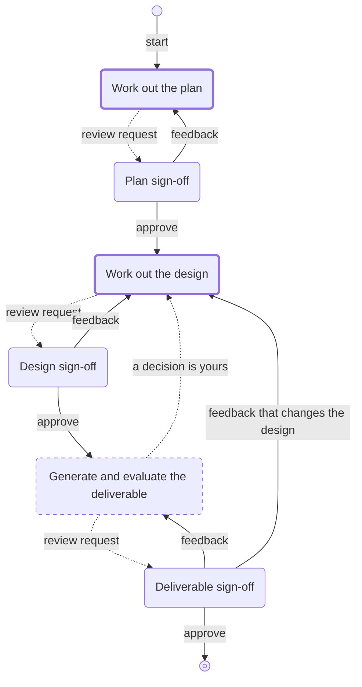

# rn — Right Now

Say what you want to achieve, and `rn` carries it all the way there. All you do is decide.

- You get what you really want, without writing a careful prompt first.
- Your time goes only to the decisions that are yours: you don't watch the work, and you don't
  re-read all of it to approve it.
- Work that takes days goes on the next day, or in a fresh conversation, from where it stopped.

Most AI agents need a carefully written prompt and some babysitting.

## What you need

- [Claude Code](https://code.claude.com)
- A git repository with its remote on GitHub, since `rn` puts everything you review on a pull request
- The [GitHub CLI](https://cli.github.com) `gh`, which `rn` uses to open and update a pull request

## Install

`rn` ships from the `ccpm` marketplace. In Claude Code, add the marketplace once, then install the
plugin:

```console
> /plugin marketplace add lovaizu/ccpm
> /plugin install rn@ccpm
```

## How a session goes


```mermaid
flowchart TD
    S@{ shape: sm-circ }
    PlanTalk("Work out the plan")
    Plan("Plan sign-off")
    DesignTalk("Work out the design")
    Design("Design sign-off")
    Make("Generate and evaluate the deliverable")
    Deliverable("Deliverable sign-off")
    E@{ shape: fr-circ }

    S -->|start| PlanTalk
    PlanTalk -.->|review request| Plan
    Plan -->|feedback| PlanTalk
    Plan -->|approve| DesignTalk
    DesignTalk -.->|review request| Design
    Design -->|feedback| DesignTalk
    Design -->|approve| Make
    Make -.->|a decision is yours| DesignTalk
    Make -.->|review request| Deliverable
    Deliverable -->|feedback| Make
    Deliverable -->|feedback that changes the design| DesignTalk
    Deliverable -->|approve| E

    style Make stroke-dasharray: 5 5
    style PlanTalk stroke-width: 3px
    style DesignTalk stroke-width: 3px
```

Dotted lines are where `rn` moves on, solid lines are yours, a bold box is where `rn` looks things
up while talking with you one point at a time, until you both see the same thing, and the dashed box
is where it works without you.

One goal carried through to the end is a session. A sign-off is where you look at the work before it
goes past that point, and approve it or give feedback. `rn` asks for each one with what is good and
what falls short, and why, so you can decide without reading everything again. `rn` stops only
there, and where you pause it.

Say your app is written in JavaScript, and you want it moved to TypeScript — work that takes days.

### 1. Start — `/rn:on`

Say what you want, as roughly as it comes to mind. `rn` tells you how it understands it, one point
at a time — what you want, why you want it, and how you would know the goal is achieved — and moves
on only when you agree. What the repository, the official documentation, or best practice can
answer, it looks up instead of asking you.

```console
> /rn:on move this app to TypeScript

● Here's how I understand it: three of last quarter's production bugs were a value of the wrong
  type — undefined where a number was expected. Is catching those before they ship what you're after?

> yes, that's why

● Then the goal is that such a mistake fails the build. Every file ending in .ts is not enough: a
  file moved with loose types would still let it through. Is that right?
```

Then `rn` writes the plan and puts it on a draft pull request. The plan holds the goal, how you
would know it is achieved, and the tasks. Tasks that make the deliverable come only once the design
is settled.

```console
● ── typescript: a wrong type fails the build ──
  👉 #1 Plan sign-off ── read the plan on the PR: /rn:ty to approve, /rn:gm <feedback> to ask for changes
  ⬜ #2 Design sign-off

  Draft PR: https://github.com/you/repo/pull/42

  ### Can you read the goal and say "yes, that is what I want, and why"?
  - Good: it names the three type bugs as the reason (steering.md:11), so every later choice is
    judged against stopping them
  - More: none
  ...
```

The map on top heads every message where `rn` stops for a sign-off or a pause: ✅ done, 👉 now,
⬜ ahead. Under it, each question the plan must answer comes with what is good and what falls short,
and where, so you can decide without reading the whole plan.

### 2. Approve or give feedback — `/rn:ty` and `/rn:gm`

`/rn:ty` approves. `/rn:gm <feedback>` asks for changes, and plain `/rn:gm` takes your review
comments on the pull request as feedback, which `rn` then works through. Either one stops. Say
"go on" to continue, or `/clear` first when you want a fresh conversation, then `/rn:up`.

```console
> /rn:ty

● Approved the plan. Next: say "go on", or /clear and /rn:up.
```

### 3. Work out the design — Design sign-off

Once you approve the plan, `rn` works out the design with you, and there is always a Design
sign-off ([why](./docs/design.md#it-works-out-the-goal-and-the-design-with-the-user-one-point-at-a-time-looking-things-up-as-they-talk)).
`rn` proposes how to build it, and what to test so you know it works. Of those, how strict the type
checks start is a call of effort against safety, so it is yours. What you settle goes into your
README and design document, which stay with your product. You approve them, and your product is
built to them.

```console
● The three bugs are in src/cart and src/checkout. For the test, I propose code that reproduces
  each of the three, passing when all three fail the build. Strict checks from the start stop all
  three, but nothing builds until every file is typed; loose first builds sooner, but lets all
  three through until tightened. I recommend strict: stopping those three is why you are moving.
  Which weighs more for you?
```

### 4. Generate and evaluate the deliverable

You don't watch. Each result is checked by an agent that did not make it, so it passes because it
does its job, not because its maker says so ([why](./docs/design.md#an-evaluator-that-did-not-make-the-work-checks-it-once-and-the-conductor-settles-the-fixes-before-the-user-is-called)). Each time `rn` decides what to
do next, it says so in one line:

```console
● #3 move src/cart ── decided: purpose not fulfilled. It passes only because its types are `any`;
  last quarter's cart bug would still ship → fix
● #3 move src/cart ── decided: purpose fulfilled → #4
```

### 5. Pause and resume — `/rn:dn`, `/rn:up`

When the context is nearly full, or you are done for the day, `/rn:dn` records how far the session
has come and pushes everything. When you want a fresh conversation, run `/clear` yourself, then
`/rn:up`. A plugin can't run `/clear`.

```console
> /rn:dn

● ── typescript: a wrong type fails the build ──
  ✅ #1 Plan sign-off / #2 Design sign-off / #3 move src/cart
  👉 #4 move src/checkout ── stopped here; next: /rn:up
  ⬜ #5 move src/account / #6 Deliverable sign-off

> /clear
> /rn:up

● Resuming typescript at #4: move src/checkout
```

### 6. Finish — Deliverable sign-off

You approve the deliverable, your product as the session leaves it, by whether it achieves your
goal. When something falls short, `/rn:gm` has it fixed. On `/rn:ty` the pull request is marked
ready; the merge is yours. Besides your product, the session leaves only its `.rn/` directory, the
record of how things were decided.

## How it is built

Who makes, checks, and decides each thing in a session, and why `rn` is built that way, is in its
[design document](./docs/design.md).

## The names

`on` / `dn` / `up` follow a race: **on** your marks, cool **d**ow**n** for a pause, warm **up** to
go on. `ty` / `gm` are two thanks: **t**hank **y**ou approves, **g**ood, **m**ore asks for more.

## License

[MIT](../LICENSE)
