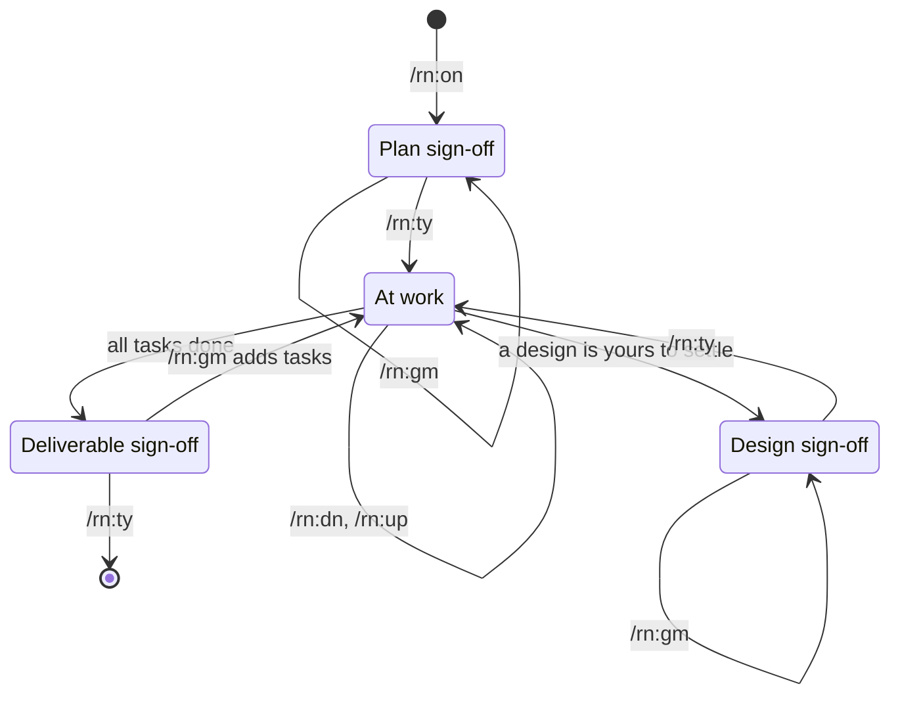

# rn — Right Now

Most AI agents need a carefully written prompt and someone watching them to get a task done. `rn`
doesn't: give it a goal, roughly, with `/rn:on`. It works out with you what you actually want, then
carries the work through without you, and calls you back only for the decisions that are yours. One
goal carried through to the end is a session, and a session lives in git — its record in `.rn/` in
your repository, what it makes on a pull request — so it survives a full context, a `/clear`, or
the end of the day. You can start right now, with nothing prepared.

## What you need

- [Claude Code](https://code.claude.com)
- A git repository with its remote on GitHub
- The [GitHub CLI](https://cli.github.com) `gh`, logged in to that GitHub with `gh auth login`,
  since `rn` opens and updates a pull request

## Install

`rn` ships from the `ccpm` marketplace. In Claude Code, add the marketplace once, then install the
plugin:

```console
> /plugin marketplace add lovaizu/ccpm
> /plugin install rn@ccpm
```

## How a session goes


```mermaid
stateDiagram-v2
    state "Plan sign-off" as Plan
    state "At work" as Work
    state "Design sign-off" as Design
    state "Deliverable sign-off" as Deliverable

    [*] --> Plan: /rn:on
    Plan --> Plan: /rn:gm
    Plan --> Work: /rn:ty
    Work --> Work: /rn:dn, /rn:up
    Work --> Design: a design is yours to settle
    Work --> Deliverable: all tasks done
    Design --> Design: /rn:gm
    Design --> Work: /rn:ty
    Deliverable --> Work: /rn:gm adds tasks
    Deliverable --> [*]: /rn:ty
```

A sign-off is where you approve something before the work goes past it. `rn` stops only there, or
where you pause it. Say your app is written in JavaScript, and you want it moved to TypeScript —
work that takes days.

### 1. Start — `/rn:on`

Say what you want, as roughly as it comes to mind. `rn` tells you how it reads it, one point at a
time — what you want, why, how you'd know it's done, how to go about it — and moves on only when
you agree. It looks up what the repository can answer instead of asking you.

```console
> /rn:on move this app to TypeScript

● Here's how I read it: three of last quarter's production bugs were a value of the wrong type —
  undefined where a number was expected. Is catching those before they ship what you're after?

> yes, that's why

● Then the goal is that such a mistake fails the build, not only that every file ends in .ts — a
  file moved with loose types would still let it through. Is that right?
```

Then `rn` writes the plan — the goal, how you'd know it is reached, and the tasks — and puts it on a
draft pull request. The tasks run only as far as your next decision; once you decide, `rn` plans
what follows from it.

```console
● ── typescript: a wrong type fails the build ──
  👉 #1 Plan sign-off ── read the plan on the PR: /rn:ty to approve, /rn:gm <feedback> to ask for changes
  ⬜ #2 trace the type mistakes that reached production / #3 Design sign-off

  Draft PR: https://github.com/you/repo/pull/42
```

The map on top heads every message where `rn` stops: ✅ done, 👉 now, ⬜ ahead.

### 2. Answer — `/rn:ty` and `/rn:gm`

`/rn:ty` approves; `/rn:gm <feedback>` asks for changes, and plain `/rn:gm` takes your review
comments on the pull request. Either one then stops: say "go on" to continue, or `/clear` first when
you want a fresh conversation, then `/rn:up`.

```console
> /rn:ty

● Approved: Plan sign-off. Next: say "go on", or /clear and /rn:up.
```

### 3. Settle a design — Design sign-off

#2 runs without you. At #3, how strict the type checks start is a call of cost against safety, so it
is yours. `rn` talks it through with you one point at a time, and writes what you settle into your
README and design document — the ones it finds in your repository, or `README.md` and
`docs/design.md` when there are none. You approve those, and your product is built to them.

```console
● #2 found the three bugs in src/cart and src/checkout. Strict checks from the start stop all
  three, but nothing builds until every file is typed; loose first builds sooner and lets them
  through until tightened. Which weighs more for you?
```

### 4. While it works

You don't watch. Each task is made by one agent and evaluated by another, so a result passes
because it does its job, not because the agent that made it says so. Each time `rn` decides what to
do next, it says so in one line:

```console
● #4 move src/cart ── decided: not reached (it passes only because its types are `any`; last
  quarter's cart bug would still ship) → fix
● #4 move src/cart ── decided: reached → #5
```

Every evaluation is committed with the session, so you can read it on the pull request.

### 5. Step away — `/rn:dn`, then `/rn:up`

Context nearly full, or done for the day: `/rn:dn` records where the session stands and pushes
everything. Run `/clear` yourself when you want a fresh conversation (a plugin can't), then
`/rn:up`.

```console
> /rn:dn

● ── typescript: a wrong type fails the build ──
  ✅ #1 Plan sign-off / #2 trace the type mistakes / #3 Design sign-off / #4 move src/cart
  👉 #5 move src/checkout ── stopped here; next: /rn:up
  ⬜ #6 move src/account / #7 Deliverable sign-off

> /clear
> /rn:up

● Resuming typescript at #5: move src/checkout
```

### 6. Finish — Deliverable sign-off

You approve the deliverable, your product as the session leaves it, by whether it reaches your goal;
`/rn:gm` adds tasks instead. On `/rn:ty` the pull request is marked ready; the merge is yours. The
session leaves behind only its `.rn/` directory and the deliverable.

## How it is built

Who makes, checks, and decides each thing in a session, and why `rn` is built that way, is in its
[design document](./docs/design.md).

## The names

`on` / `dn` / `up` follow a race: **on** your marks, cool **d**ow**n** for a pause, warm **up** to
go on. `ty` / `gm` are two thanks: **t**hank **y**ou approves, **g**ood, **m**ore asks for more.

## License

[MIT](../LICENSE)
