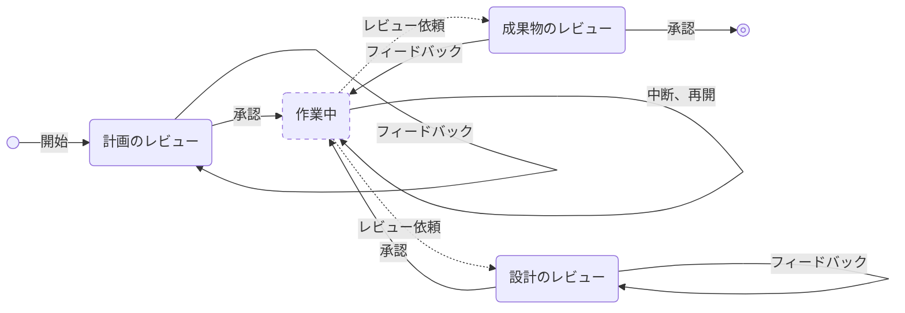

# rn — Right Now

たいていの AI エージェントは、作業をやり遂げるのに、よく練ったプロンプトと子守りを必要とする。`rn` は要らない。ゴールをざっくり渡すだけでよい。`rn` は、あなたが本当に欲しいものをあなたと一緒に詰め、そこから先はあなた抜きで作業をやり遂げ、あなたが決めることのときだけ呼び戻す。途中の記録も作ったものも git に置くので、会話を新しくしても、翌日になっても、止めたところから続けられる。何も準備せず、今すぐ始められる。

## 必要なもの

- [Claude Code](https://code.claude.com)
- リモートが GitHub にある git リポジトリ
- [GitHub CLI](https://cli.github.com) の `gh`。`rn` がプルリクエストを開いて更新するのに使う

## インストール

`rn` は `ccpm` マーケットプレイスから配っている。Claude Code で、マーケットプレイスを一度だけ追加し、プラグインを入れる。

```console
> /plugin marketplace add lovaizu/ccpm
> /plugin install rn@ccpm
```

## セッションの進み方


```mermaid
flowchart LR
    S@{ shape: sm-circ }
    Plan("計画のレビュー")
    Work("作業中")
    Design("設計のレビュー")
    Deliverable("成果物のレビュー")
    E@{ shape: fr-circ }

    S -->|開始| Plan
    Plan -->|フィードバック| Plan
    Plan -->|承認| Work
    Work -->|中断、再開| Work
    Work -.->|レビュー依頼| Design
    Work -.->|レビュー依頼| Deliverable
    Design -->|フィードバック| Design
    Design -->|承認| Work
    Deliverable -->|フィードバック| Work
    Deliverable -->|承認| E

    style Work stroke-dasharray: 5 5
```

1つのゴールを最後までやり遂げる単位をセッションと呼ぶ。レビューは、作業がその先へ進む前に、あなたが見て、承認するかフィードバックを返すところ。`rn` が止まるのはそこと、あなたが中断したところだけ。点線は `rn` が進めるところ、実線はあなたがするところ。

例として、あなたのアプリは JavaScript で書かれていて、それを TypeScript に移したいとする。何日もかかる作業だ。

### 1. 開始 — `/rn:on`

欲しいものを、思いついたままざっくり言う。`rn` は、何が欲しいのか、なぜ欲しいのか、どうなればゴールを達成したと言えるのかを、どう理解したか1点ずつ伝える。あなたが同意してから次に進む。リポジトリや公式ドキュメント、ベストプラクティスを調べれば分かることは、あなたに聞かずに調べる。

```console
> /rn:on このアプリを TypeScript に移して

● こう理解しました: 前の四半期に本番で出た不具合のうち3件は、型の違う値でした。数値のはずの
  ところに undefined が来ていました。これを出す前に止めたい、ということでしょうか?

> そう、それが理由

● では、ゴールは「そういう間違いがあるとビルドが落ちること」ですね。全ファイルが .ts に
  なるだけでは足りません。ゆるい型で移したファイルは、同じ間違いを通してしまいます。
  合っていますか?
```

次に `rn` は計画を書き、下書きのプルリクエストに載せる。計画は、ゴール、ゴールを達成したと分かる条件、タスクを持つ。タスクはあなたの次の判断までしか立てず、あなたが決めたら、そこから続くタスクを立てる。

```console
● ── typescript: 型の間違いでビルドが落ちる ──
  👉 #1 計画のレビュー ── PR で計画を読んでください: 承認は /rn:ty、直してほしいときは /rn:gm <フィードバック>
  ⬜ #2 本番に出た型の間違いをたどる / #3 設計のレビュー

  下書きの PR: https://github.com/you/repo/pull/42
```

`rn` が止まるたびに、メッセージの頭にこの地図が出る。✅ は済み、👉 は今、⬜ はこの先。

### 2. 承認、フィードバック — `/rn:ty` と `/rn:gm`

`/rn:ty` は承認する。`/rn:gm <フィードバック>` は直してほしいことを伝え、引数なしの `/rn:gm` はプルリクエストのレビューコメントをフィードバックとして受け取る。どちらも、そのあと止まる。続けるときは「続けて」と言う。新しい会話にしたいときは、先に `/clear` してから `/rn:up` する。

```console
> /rn:ty

● 計画を承認しました。次: 「続けて」と言うか、/clear して /rn:up。
```

### 3. 設計を決める — 設計のレビュー

#2 はあなた抜きで進む。#3 では、どう作るかと、ゴールから見て確かめるべき品質ごとに、テストのしかた、合格の基準、どこまで確かめるかを、`rn` が提案する。そのうち「型チェックをどれくらい厳しく始めるか」は、手間と安全のどちらを取るかの判断なので、あなたが決める。`rn` はそれを1点ずつあなたと話し、決まったことを README と設計書に書く。書く先は、リポジトリにある README と設計書で、無ければ `README.md` と `docs/design.md`。あなたがそれを承認すると、プロダクトはそのとおりに作られる。

```console
● #2 で、3件の不具合は src/cart と src/checkout にあると分かりました。テストは、3件を
  それぞれ再現するコードを置き、3件ともビルドが落ちれば合格、を提案します。
  型チェックは、最初から厳しくすれば3件とも止まりますが、全ファイルに型を付けるまで
  ビルドできません。ゆるく始めれば早くビルドできますが、締めるまでは3件とも通ります。
  どちらを重く見ますか?
```

### 4. 作業中

あなたは見ていなくてよい。タスクごとに、ある agent が作り、別の agent が評価する。だから成果は、作った agent がそう言うからではなく、役目を果たしているから通る。`rn` は次に何をするかを決めるたびに、1行で伝える。

```console
● #4 src/cart を移す ── 判断: 目的を果たしていない。型を `any` にして通しているだけで、
  前の四半期のカートの不具合はまだ出てしまう → 直す
● #4 src/cart を移す ── 判断: 目的を果たした → #5
```

評価はどれもセッションと一緒にコミットされるので、プルリクエストで読める。

### 5. 中断、再開 — `/rn:dn`、`/rn:up`

context がいっぱいになりそうなとき、その日の作業を終えるとき、`/rn:dn` はセッションがどこまで進んだかを記録し、すべてを push する。新しい会話にしたいときは、あなたが `/clear` してから `/rn:up` する。`/clear` はプラグインからはできない。

```console
> /rn:dn

● ── typescript: 型の間違いでビルドが落ちる ──
  ✅ #1 計画のレビュー / #2 型の間違いをたどる / #3 設計のレビュー / #4 src/cart を移す
  👉 #5 src/checkout を移す ── ここで止めました。次: /rn:up
  ⬜ #6 src/account を移す / #7 成果物のレビュー

> /clear
> /rn:up

● typescript を #5 から再開します: src/checkout を移す
```

### 6. 終える — 成果物のレビュー

成果物、つまりセッションを終えた時点のプロダクトを、ゴールを達成しているかで承認する。足りなければ `/rn:gm` でタスクを足す。`/rn:ty` でプルリクエストは ready になり、マージはあなたが行う。セッションが残すのは、`.rn/` ディレクトリと成果物だけ。

## 仕組み

セッションの中で誰が作り、誰が確かめ、誰が決めるのか、そしてなぜそう作ったのかは、[設計書](./docs/design.md)にある。

## 名前の由来

`on` / `dn` / `up` は競走から取った。**on** your marks（位置について）、中断は cool **d**ow**n**、再開は warm **up**。`ty` / `gm` は2つのお礼の言葉。**t**hank **y**ou は承認、**g**ood, **m**ore はもっと良くしてほしいという頼み。

## ライセンス

[MIT](../LICENSE)
