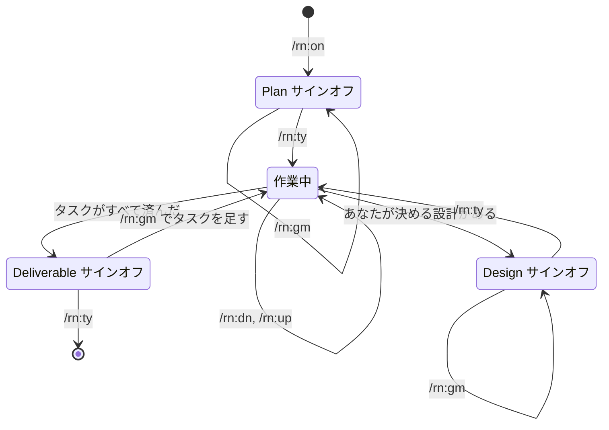

# rn — Right Now

たいていの AI エージェントは、作業をやり遂げるのに、よく練ったプロンプトと見張る人を必要とする。`rn` は要らない。`/rn:on` で、ゴールをざっくり渡すだけでよい。`rn` は、あなたが本当に欲しいものをあなたと一緒に詰め、そこから先はあなた抜きで作業をやり遂げ、あなたが決めることのときだけ呼び戻す。1つのゴールを最後までやり遂げる単位をセッションと呼ぶ。セッションは git の中にある。記録はリポジトリの `.rn/` に、作ったものはプルリクエストに置かれる。だから context がいっぱいになっても、`/clear` しても、翌日になっても続けられる。何も準備せず、今すぐ始められる。

## 必要なもの

- [Claude Code](https://code.claude.com)
- リモートが GitHub にある git リポジトリ
- [GitHub CLI](https://cli.github.com) の `gh`。`rn` がプルリクエストを開いて更新するのに使う

## インストール

`rn` は `ccpm` マーケットプレイスから配っている。Claude Code で、マーケットプレイスを一度だけ追加し、プラグインを入れる。

```console
> /plugin marketplace add lovaizu/ccpm
> /plugin install rn@ccpm
```

## セッションの進み方


```mermaid
stateDiagram-v2
    state "Plan サインオフ" as Plan
    state "作業中" as Work
    state "Design サインオフ" as Design
    state "Deliverable サインオフ" as Deliverable

    [*] --> Plan: /rn:on
    Plan --> Plan: /rn:gm
    Plan --> Work: /rn:ty
    Work --> Work: /rn:dn, /rn:up
    Work --> Design: あなたが決める設計がある
    Work --> Deliverable: タスクがすべて済んだ
    Design --> Design: /rn:gm
    Design --> Work: /rn:ty
    Deliverable --> Work: /rn:gm でタスクを足す
    Deliverable --> [*]: /rn:ty
```

サインオフは、作業がその先へ進む前に、あなたが承認するところ。`rn` が止まるのはそこと、あなたが一時停止したところだけ。例として、あなたのアプリは JavaScript で書かれていて、それを TypeScript に移したいとする。何日もかかる作業だ。

### 1. 始める — `/rn:on`

欲しいものを、思いついたままざっくり言う。`rn` は、何が欲しいのか、なぜ欲しいのか、どうなれば届いたと言えるのかを、どう理解したか1点ずつ伝える。あなたが同意してから次に進む。リポジトリを見れば分かることは、あなたに聞かずに調べる。

```console
> /rn:on このアプリを TypeScript に移して

● こう理解しました: 前の四半期に本番で出た不具合のうち3件は、型の違う値でした。数値のはずの
  ところに undefined が来ていました。これを出す前に止めたい、ということでしょうか?

> そう、それが理由

● では、ゴールは「そういう間違いがあるとビルドが落ちること」ですね。全ファイルが .ts に
  なるだけでは足りません。ゆるい型で移したファイルは、同じ間違いを通してしまいます。
  合っていますか?
```

次に `rn` は計画を書き、下書きのプルリクエストに載せる。計画は、ゴール、ゴールに届いたと分かる条件、タスクを持つ。タスクはあなたの次の判断までしか立てず、あなたが決めたら、そこから続くタスクを立てる。

```console
● ── typescript: 型の間違いでビルドが落ちる ──
  👉 #1 Plan サインオフ ── PR で計画を読んでください: 承認は /rn:ty、直してほしいときは /rn:gm <フィードバック>
  ⬜ #2 本番に出た型の間違いをたどる / #3 Design サインオフ

  下書きの PR: https://github.com/you/repo/pull/42
```

`rn` が止まるたびに、メッセージの頭にこの地図が出る。✅ は済み、👉 は今、⬜ はこの先。

### 2. 答える — `/rn:ty` と `/rn:gm`

`/rn:ty` は承認する。`/rn:gm <フィードバック>` は直してほしいことを伝え、引数なしの `/rn:gm` はプルリクエストのレビューコメントをフィードバックとして受け取る。どちらも、そのあと止まる。続けるときは「続けて」と言う。新しい会話にしたいときは、先に `/clear` してから `/rn:up` する。

```console
> /rn:ty

● 承認しました: Plan サインオフ。次: 「続けて」と言うか、/clear して /rn:up。
```

### 3. 設計を決める — Design サインオフ

#2 はあなた抜きで進む。#3 で決める「型チェックをどれくらい厳しく始めるか」は、手間と安全のどちらを取るかの判断なので、あなたが決める。`rn` はそれを1点ずつあなたと話し、決まったことを README と設計書に書く。書く先は、リポジトリにある README と設計書で、無ければ `README.md` と `docs/design.md`。あなたがそれを承認すると、プロダクトはそのとおりに作られる。

```console
● #2 で、3件の不具合は src/cart と src/checkout にあると分かりました。最初から厳しくすれば
  3件とも止まりますが、全ファイルに型を付けるまでビルドできません。ゆるく始めれば早く
  ビルドできますが、締めるまでは3件とも通ります。どちらを重く見ますか?
```

### 4. 任せている間

あなたは見ていなくてよい。タスクごとに、ある agent が作り、別の agent が評価する。だから成果は、作った agent がそう言うからではなく、役目を果たしているから通る。`rn` は次に何をするかを決めるたびに、1行で伝える。

```console
● #4 src/cart を移す ── 判断: 届いていない。型を `any` にして通しているだけで、前の四半期の
  カートの不具合はまだ出てしまう → 直す
● #4 src/cart を移す ── 判断: 届いた → #5
```

評価はどれもセッションと一緒にコミットされるので、プルリクエストで読める。

### 5. 離れる — `/rn:dn`、そして `/rn:up`

context がいっぱいになりそうなとき、その日の作業を終えるとき、`/rn:dn` はセッションがどこまで進んだかを記録し、すべてを push する。新しい会話にしたいときは、あなたが `/clear` してから `/rn:up` する。`/clear` はプラグインからはできない。

```console
> /rn:dn

● ── typescript: 型の間違いでビルドが落ちる ──
  ✅ #1 Plan サインオフ / #2 型の間違いをたどる / #3 Design サインオフ / #4 src/cart を移す
  👉 #5 src/checkout を移す ── ここで止めました。次: /rn:up
  ⬜ #6 src/account を移す / #7 Deliverable サインオフ

> /clear
> /rn:up

● typescript を #5 から再開します: src/checkout を移す
```

### 6. 終える — Deliverable サインオフ

成果物、つまりセッションを終えた時点のプロダクトを、ゴールに届いているかで承認する。足りなければ `/rn:gm` でタスクを足す。`/rn:ty` でプルリクエストは ready になり、マージはあなたが行う。セッションが残すのは、`.rn/` ディレクトリと成果物だけ。

## 仕組み

セッションの中で誰が作り、誰が確かめ、誰が決めるのか、そしてなぜそう作ったのかは、[設計書](./docs/design.md)にある。

## 名前の由来

`on` / `dn` / `up` は競走から取った。**on** your marks（位置について）、一時停止は cool **d**ow**n**、続けるのは warm **up**。`ty` / `gm` は2つのお礼の言葉。**t**hank **y**ou は承認、**g**ood, **m**ore はもっと良くしてほしいという頼み。

## ライセンス

[MIT](../LICENSE)
