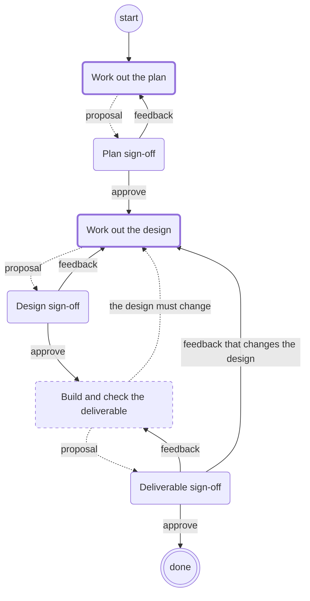

# rn — Right Now

Say what you want to achieve in your repository, and `rn` carries it all the way there. All you do
is decide.

- You get what you really want, without writing a careful prompt first.
- Your time goes only to the decisions that are yours, such as what to build and how much risk to
  take: you don't babysit the work, and you don't re-read all of it to approve it.
- Work that takes days goes on the next day, or in a fresh conversation, from where it stopped.

## What you need

- [Claude Code](https://code.claude.com)
- A git repository with its remote on GitHub, since `rn` puts everything you review on a pull request
- The [GitHub CLI](https://cli.github.com) `gh`, logged in with push access, which `rn` uses to open
  and update a pull request
- Python 3.9 or later, which runs the checks `rn` makes on its own record as it goes

## Install

`rn` ships from the `ccpm` marketplace. In Claude Code, add the marketplace once, then install the
plugin:

```console
> /plugin marketplace add lovaizu/ccpm
> /plugin install rn@ccpm
```

This also installs `writ` and `pith`, from the same marketplace: `rn` has `writ` write your README and
design document so they read well to whoever picks them up, and has `pith` use each result before
you see it.

## How a session goes

One goal carried through to the end is a session. A sign-off is where you look at the work before it
goes past that point, and say yes to `rn`'s proposal or give feedback. Between sign-offs, `rn` calls
you only for a decision that is yours. It works on its own branch and a draft pull request, so your
default branch is untouched until you merge.


```mermaid
flowchart TD
    S(("start"))
    PlanTalk("Work out the plan")
    Plan("Plan sign-off")
    DesignTalk("Work out the design")
    Design("Design sign-off")
    Make("Build and check the deliverable")
    Deliverable("Deliverable sign-off")
    E((("done")))

    S --> PlanTalk
    PlanTalk -.->|proposal| Plan
    Plan -->|feedback| PlanTalk
    Plan -->|approve| DesignTalk
    DesignTalk -.->|proposal| Design
    Design -->|feedback| DesignTalk
    Design -->|approve| Make
    Make -.->|the design must change| DesignTalk
    Make -.->|proposal| Deliverable
    Deliverable -->|feedback| Make
    Deliverable -->|feedback that changes the design| DesignTalk
    Deliverable -->|approve| E

    style Make stroke-dasharray: 5 5
    style PlanTalk stroke-width: 3px
    style DesignTalk stroke-width: 3px
```

Dotted lines are where `rn` moves on, solid lines are yours, a bold box is where `rn` looks things
up while talking with you one point at a time, until you both see the same thing, and the dashed box
is where it works without you.

Say your app is written in JavaScript, and you want it moved to TypeScript — work that takes days.

### 1. Start — `/rn:on`

In your repository, say what you want, as roughly as it comes to mind; what you get is what you
meant. `rn` tells you how it understands it and asks, one point at a time, what you want, why you
want it, and how you would know the goal is achieved; where there are several ways to get it, it
offers them with what each gives and costs and the one it recommends. It moves on only when you
agree. What the repository, the official documentation, or best practice can answer,
it looks up instead of asking you. It also asks which language to talk in and which to write the
repository in, and which issues the work closes.

```console
> /rn:on move this app to TypeScript

● Here's how I understand it: three of last quarter's production bugs were a value of the wrong
  type — undefined where a number was expected. Is catching those before they ship what you're after?

> yes, that's why

● Then the goal is that such a mistake fails the build. Every file ending in .ts is not enough: a
  file moved with loose types would still let it through. Is that right?
```

Knowing why you want it is what shows where your first words would go wrong: every file ending in
.ts would have let the bugs through.

From your first words, `rn` keeps the plan, `steering.md`, on a draft pull request, and updates it
as each point is agreed. The plan holds the goal, its acceptance criteria, and the tasks. The
criteria come in two kinds: what would make you choose the result, and what you take for granted.
Each has an ID, so you can follow any task or check back to the criterion it serves:

```markdown
# Acceptance criteria

## Attractive quality

- A1: Code reproducing each of the three bugs fails the build

## Must-be quality

- M1: Every file is .ts
- M2: The app builds and runs as before
```

The tasks that build it are planned once the design is settled, so they follow what you agree to
there; until then, the plan shows them as not yet specified.

```console
● ── typescript: a wrong type fails the build ──
  👉 #1 Plan sign-off ── read the plan on the PR: /rn:ty to approve, /rn:gm <feedback> to ask for changes
  ⬜ #2 Design sign-off

  Draft PR: https://github.com/you/repo/pull/42

  I propose working out the design on this plan: it says what you want, why, and how you would
  know it is achieved.

  Goal: a wrong type fails the build
  - A1: Code reproducing each of the three bugs fails the build
  - M1: Every file is .ts
  - M2: The app builds and runs as before

  Toward what you would choose it for:
  - A1: each of the three bugs is named with how its failing build is checked; nothing is built yet
    (first proposal)

  For you to decide:
  - Assumed, not checked: the three bugs are all in src/cart and src/checkout (steering.md:24)

  ● #1 Plan sign-off ── proposed: work out the design on this plan → waiting for #1 Plan sign-off
```

The map on top heads every message where `rn` stops for a sign-off or a pause: ✅ done, 👉 now,
⬜ ahead. Under it, `rn` says what it proposes to do next and why; at the Plan sign-off, the goal and
criteria in the plan's own words, since they are what you approve. Then it says how close the work
has come to each thing you would choose it for, and what came closer since its last proposal.
Clearing every shortfall never ends, so this is what you decide on: whether it has come close enough.
Last comes only what is yours to decide: a shortfall it left, something it assumed without checking,
or something your product will no longer do. However large the work, the proposal holds no more
than that; everything good and everything short of it is in the record on the pull request, for
whenever you want it. The last line is what `rn` records of where it stopped, so a fresh conversation
goes on from the same place.

### 2. Approve or give feedback — `/rn:ty` and `/rn:gm`

`/rn:ty` approves. `/rn:gm <feedback>` asks for changes, and plain `/rn:gm` takes the review
comments you wrote on the pull request since `rn` stopped for this sign-off as feedback, so you can
comment where you read. Either one stops there. You can clear the conversation at that point and
lose nothing: say "go on" to continue, or `/clear` first, then `/rn:up`.

```console
> /rn:ty

● #1 Plan sign-off ── approved → #2 Design sign-off

  Say "go on", or /clear and then /rn:up.
```

### 3. Work out the design — Design sign-off

Once you approve the plan, `rn` works out the design with you: how to build it, and how you will see
that it works. You approve the design document and a verification document together, before anything
is built, so what comes back at the end is what you expected. The verification document says, for
each attractive criterion, how it will be used as you would use it and what it should do then, so
the same check can be run again after any later change. Of
the points that come up, how strict the type checks start is a call of effort against safety, so it
is yours. What you settle goes into your README, design document, and verification document, which
stay with your product, so the next session, or a teammate, starts from what you settled.

```console
● The three bugs are in src/cart and src/checkout. For the test, I propose code that reproduces
  each of the three, passing when all three fail the build. Strict checks from the start stop all
  three, but nothing builds until every file is typed; loose first builds sooner, but lets all
  three through until tightened. I propose strict: stopping those three is why you are moving.
  Which weighs more for you?
```

### 4. Build and check the deliverable

You don't babysit it. Before you see a result, an agent that knows nothing of how it was made uses
it as you would, and tells `rn` what it understood and what happened. `rn` sets that beside what the
result is for, so a result passes because it does its job, not because its maker says so. Each task
has a purpose set in the plan, and each time `rn` decides what to do next against it, it says so in
one line, so a glance tells you where it is and why:

```console
● #3 move src/cart ── decided: purpose not fulfilled. It passes only because its types are `any`;
  last quarter's cart bug would still ship → fix
● #3 move src/cart ── decided: purpose fulfilled → #4
```

If a decision only you can make comes up, `rn` asks you, with what it proposes and why.

### 5. Pause and resume — `/rn:dn`, `/rn:up`

Every decision is pushed as it is made, so tomorrow, or a fresh conversation, starts where you
stopped, without explaining anything again. When the context is nearly full, or you are done for the
day, `/rn:dn` records how far the session has come. When you want a fresh conversation, run `/clear`
yourself, then `/rn:up`. A plugin can't run `/clear`.

```console
> /rn:dn

● ── typescript: a wrong type fails the build ──
  ✅ #1 Plan sign-off / #2 Design sign-off / #3 move src/cart
  👉 #4 move src/checkout ── paused here
  ⬜ #5 move src/account / #6 Deliverable sign-off

  ● #4 move src/checkout ── half done: order.ts moved, payment.ts next → paused at #4 move src/checkout

  Next: /clear, then /rn:up.

> /clear
> /rn:up

● Resuming typescript at #4: move src/checkout
```

### 6. Finish — Deliverable sign-off

You approve the deliverable, your product as the session leaves it, by whether it achieves the goal
you agreed at the start. Before you see it, it was used as you would use it, in each scene of the
verification document you approved, so it was checked against that goal, not only against its
tasks. The proposal says how close it has come to each thing you would choose it for, so you decide
whether that is enough.
When something falls short, `/rn:gm` has it fixed. On `/rn:ty` the pull request is marked ready,
and the merge is yours:

```console
> /rn:ty

● Approved the deliverable. The pull request is ready: https://github.com/you/repo/pull/42
```

Besides your product, the session leaves only its `.rn/` directory, the record of how things were
decided, so you or a teammate can later see why things came out as they did. The pull request links
the issues the work closes or serves, and the pull requests it replaces, so GitHub connects them for
you.

## How it is built

Who makes, uses, and decides each thing in a session, and why `rn` is built that way, is in its
[design document](./docs/design.md). How `rn` itself is checked is in its
[verification document](./docs/verification.md).

## License

[MIT](../LICENSE)
