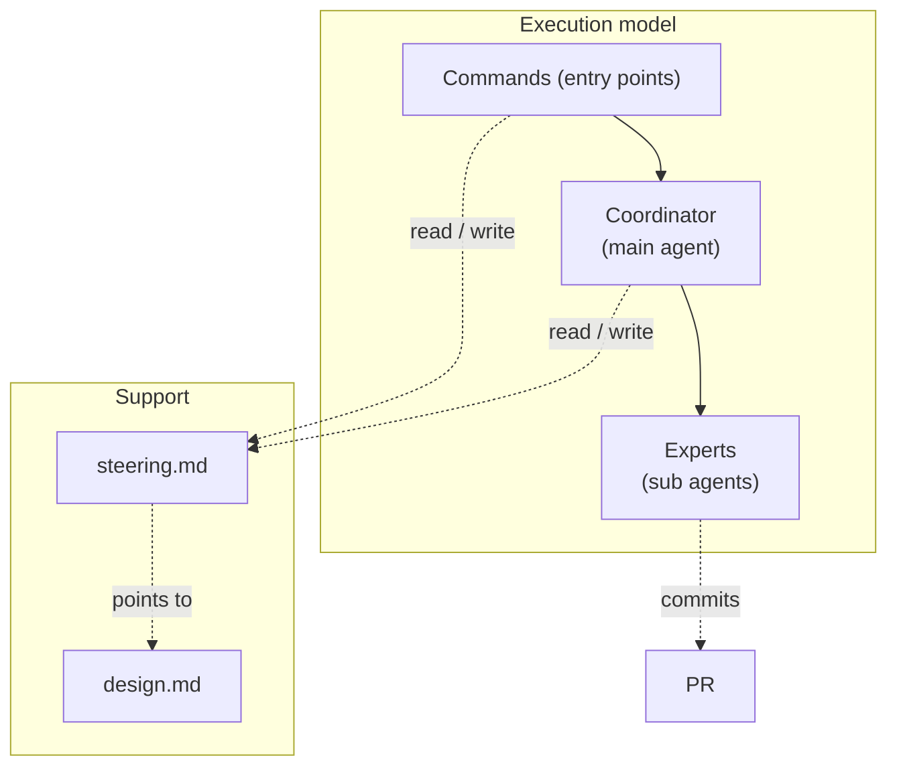
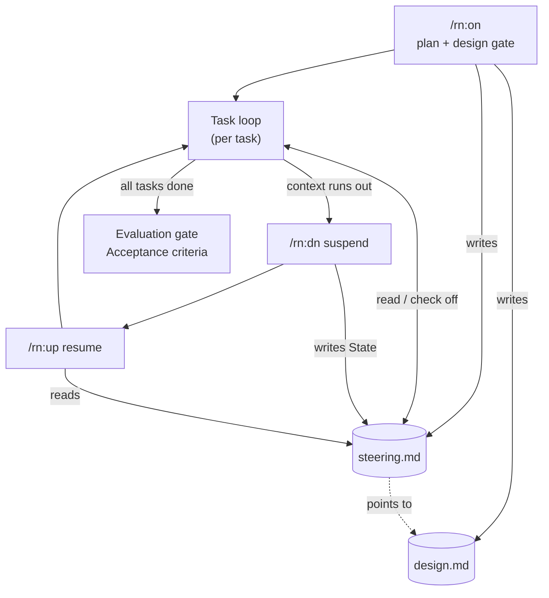
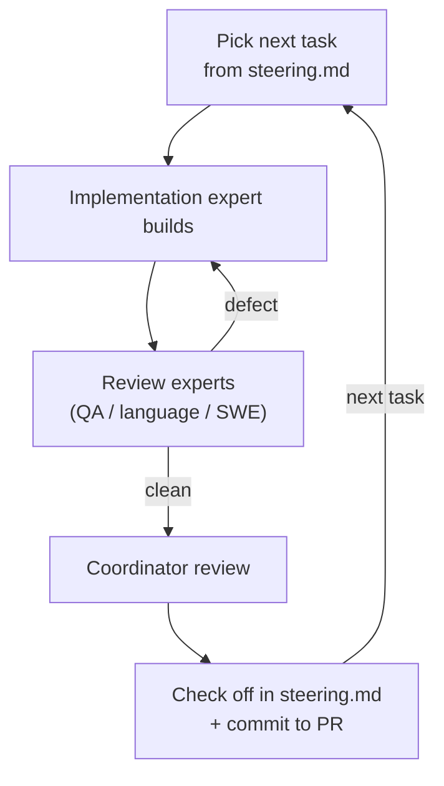

# rn — design notes

Not read at runtime — for whoever maintains the procedures and must judge whether a step is still
right when requirements change. Key ideas and mechanism only.

## Context & constraints

A piece of real work outlives any single conversation: context runs out, `/clear` wipes the thread,
days pass. So rn keeps the durable state on disk — `steering.md` + git + the PR, never the agent's
memory — and a coordinator drives fresh expert subagents through the work one task at a time. A cold
agent can then resume from `steering.md`, which stays small enough to re-read in full each time.

## Approach

The key decisions, each over the alternative it beat:

- **Coordinator / expert split** — over one agent that builds *and* reviews its own work, which is not
  independent.
- **steering.md is a lean forward contract** — heavy content lives elsewhere (rationale → `design.md`,
  UX → `README`, history → git + PR). Never stored, so it can't drift or grow into an archive.
- **Quality built into each task** — over a final inspection: a defect is caught at the task that
  introduced it.
- **The user gates only plan / design / evaluation** — each evaluating one thing: plan → `steering.md`,
  design → `design.md`, evaluation → the end results (the Acceptance-criteria run and the task checks).
  Over a gate on every task, which is ceremony where no decision is waiting. Escalation is a separate,
  always-open channel for anything that changes the agreed plan or design.

## Structure

| Actor | What it is |
|---|---|
| Commands (entry points) | `/rn:on`, `/rn:dn`, `/rn:up` — start, suspend, resume a session. |
| Coordinator (main agent) | The conversation agent that decomposes, dispatches, reviews, and records. |
| Experts (sub agents) | Implementation builds; QA and (for code) language and software-engineering review. |
| `steering.md` | The session's forward contract. |
| `design.md` | The whole-structure design (this doc). |

The per-task loop is defined in `task-workflow.md`.

## Flow

Two loops at two altitudes.

**Session lifecycle** — a goal driven to *done* across context resets. `steering.md` is the durable
spine: `/rn:on` and `/rn:dn` write it, `/rn:up` and the task loop read it, so the work survives any
number of context boundaries.

**Task loop** — how one task is built and its quality made. Coordinator-driven, no command; the
defect is caught at the task that introduced it. Only the shape is here — the steps live in
`task-workflow.md`.

## Open questions

- **Default home for a session's `design.md`.** Sessions default to `.rn/{slug}/design.md`, but rn
  keeps its own under `rn/docs/`; whether that exception generalizes is open.
