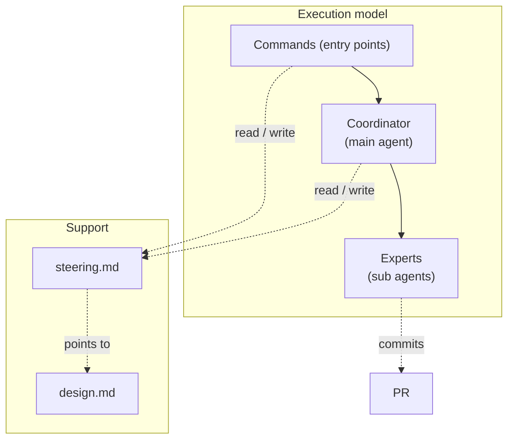
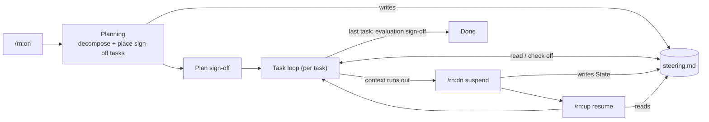
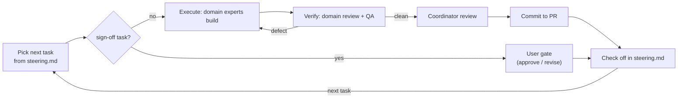

# rn — design notes

Not read at runtime — for whoever maintains the procedures and must judge whether a step is still
right when requirements change. Key ideas and mechanism only.

## Context & constraints

A piece of real work outlives any single conversation: context runs out, `/clear` wipes the thread,
days pass. So rn keeps the durable state on disk — `steering.md` + git + the PR, never the agent's
memory — and a coordinator drives fresh expert subagents through the work one task at a time. A cold
agent can then resume from `steering.md`, which stays small enough to re-read in full each time.

## Approach

The key decisions, each over the alternative it beat:

- **Coordinator / expert split** — over one agent that builds *and* reviews its own work, which is not
  independent.
- **steering.md is a lean forward contract** — heavy content lives elsewhere (rationale → `design.md`,
  UX → `README`, history → git + PR). Never stored, so it can't drift or grow into an archive.
- **Procedures orchestrate; each artifact's detail lives in its template** — a skill controls only the
  *order* in which work-instructions fire; *what / why / when* to write a `steering.md`, a `design.md`,
  or a task is fixed in that artifact's template, in one place. Over the same guidance scattered across
  procedure steps, which drifts and is hard to keep consistent.
- **Experts are chosen per task by the artifact's domain, and the same domains build and review** — over
  a fixed code-centric review trio (language / software-engineering), which neither fits prose, prompts,
  or slides nor mirrors what was built. Builder and reviewer sharing a domain means fewer defects
  survive to review. QA — does it meet the objective? — is the constant check across domains.
- **Quality built into each task** — over a final inspection: a defect is caught at the task that
  introduced it.
- **The user gates only plan / design / evaluation**, and those sign-offs are woven into the task
  sequence at planning, as sign-off *tasks* placed at their right timing — not checkpoints hardcoded
  into execution. Each evaluates one thing: plan → `steering.md`, design → `design.md`, evaluation →
  the end results (the Acceptance-criteria run and the task checks). Over a gate on every task, which is
  ceremony where no decision is waiting. Escalation is a separate, always-open channel for anything that
  changes the agreed plan or design.

## Structure

| Actor | What it is |
|---|---|
| Commands (entry points) | `/rn:on`, `/rn:dn`, `/rn:up` — start, suspend, resume a session. |
| Coordinator (main agent) | The conversation agent that plans, dispatches, reviews, and records. |
| Experts (sub agents) | Chosen per task by the artifact's domain; the same domains build and review, with QA checking the objective. |
| `steering.md` | The session's forward contract. |
| `design.md` | The whole-structure design (this doc). |

The coordinator follows three procedures: **planning-workflow** decomposes the goal into tasks and
places the plan / design / evaluation sign-offs among them; **task-execute-workflow** builds one task;
**task-verify-workflow** verifies it.

## Flow

Two loops at two altitudes.

**Session lifecycle** — a goal driven to *done* across context resets. `/rn:on` runs planning once;
the task loop then runs each task, suspending and resuming across context boundaries. `steering.md` is
the durable spine: planning and `/rn:dn` write it, `/rn:up` and the loop read it. The plan / design /
evaluation sign-offs are tasks in the sequence, placed by planning.

**Task loop** — how one task is handled, coordinator-driven (no command). A sign-off task is a user
gate; any other task is built then verified along its domains, with the defect caught in the loop.
Only the shape is here — the steps live in `task-execute-workflow.md` / `task-verify-workflow.md`.

## Open questions

- **The expert domains.** "Chosen per task by domain" needs a concrete palette. Candidate: **Design /
  Coding / Test**, instantiated per medium (code, prose, prompt, slide), with **QA** cross-cutting — the
  same axes for build and review. Whether that set covers the artifacts rn produces, or needs another
  axis, is open.
- **Default home for a session's `design.md`.** Sessions default to `.rn/{slug}/design.md`, but rn
  keeps its own under `rn/docs/`; whether that exception generalizes is open.
