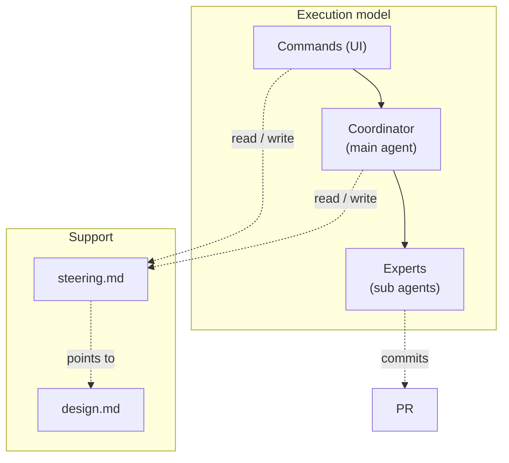
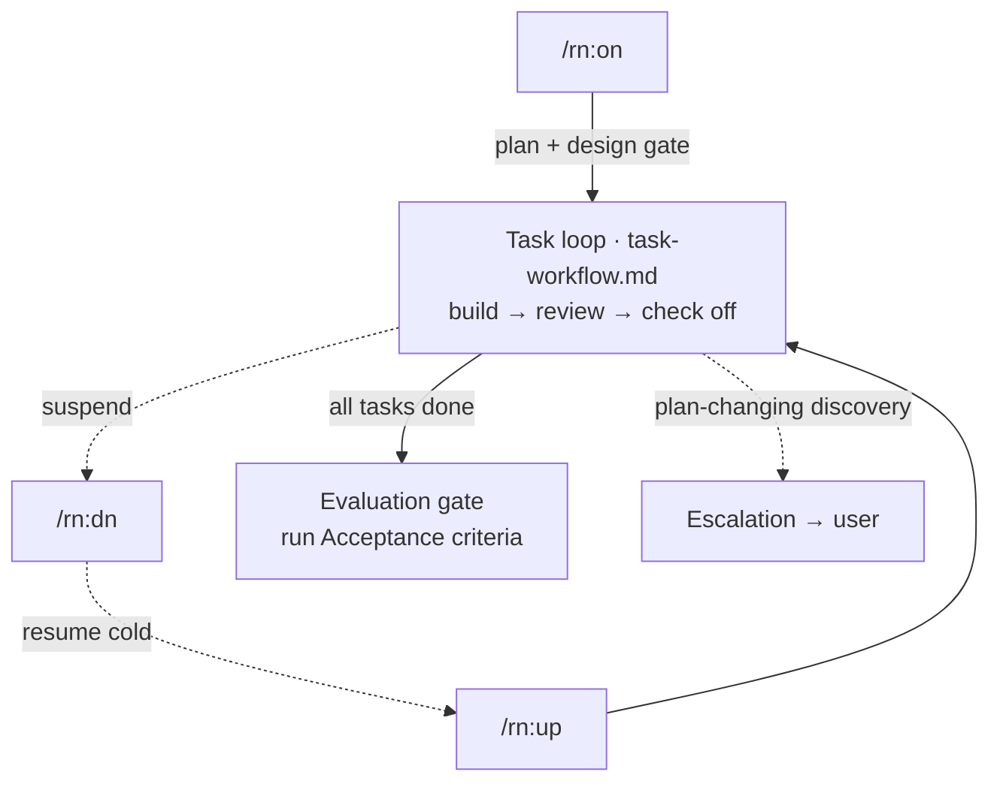

# rn — design notes

Not read at runtime — the skill and reference files are pure procedure. This file is for whoever
maintains them and needs to judge whether a step is still right when requirements change. It records
the design's decisions and how the parts fit, not a memo per step.

## Context & constraints

rn helps a user drive a goal to *done* across context boundaries — a conversation fills up, a day
ends, a `/clear` wipes the thread — one task at a time, with quality built in rather than inspected in
at the end. A single conversation cannot hold a real piece of work end to end, and what the agent
"remembers" is lost the moment the thread resets. So the design must survive being picked up cold by a
fresh agent that saw none of the prior conversation.

Constraints that follow:

- **The durable record is on disk and in git, not in the agent's head** — anything a resume needs is
  reconstructable from `steering.md`, the commit log, and the PR.
- **`steering.md` is read cold every resume** — small enough to re-read in full, a forward contract for
  the remaining work, not an archive of the finished work.
- **Quality cannot be a final inspection** — each task carries its own verification, so a defect is
  caught at the task that introduced it.
- **The user stays in the loop where judgment is irreplaceable** — sign-off on the PR, where diffs and
  long documents render properly.

## Approach

- **Coordinator / expert split** — the coordinator delegates all deliverable work to fresh subagent
  experts instead of doing it itself. Chosen over one agent that both builds and reviews: a builder
  reviewing its own output is not independent, and keeping each expert's trial-and-error inside a
  subagent keeps the coordinator's context light.
- **Lean forward contract, heavy content externalized — not pruned** — `steering.md` holds only
  requirements, criteria, remaining tasks, and resume state; design intent lives in `design.md`,
  history in git + the PR. Chosen over a *store-then-prune* model: pruning is machinery that can
  mis-fire and still lets steering swell between prunes, whereas never storing the heavy content leaves
  nothing to prune and nothing to regrow into an archive.
- **Doc-division by kind** — requirements & criteria → `steering.md`, structure & decisions →
  `design.md`, UX → `README`. Chosen over letting each document accrete whatever is convenient: a fixed
  home per kind keeps steering lean structurally, not by a discipline someone must remember.
- **Three scheduled gates** — the user signs off at exactly the three points where judgment is
  irreplaceable: **plan** (the draft-PR approval), **design** (the approach before anything builds on
  it), **evaluation** (the end-of-session criteria run). Chosen over a *gate-every-task* model, which
  fires on every boundary whether or not a decision is waiting — ceremony the agent cannot add judgment
  to. Per-task quality is caught instead by self-check + QA/expert review + the coordinator's
  independent review. Design folds into the plan gate when settled at plan time, so it is one of the
  three, never a fourth.
- **Escalation is a channel, not a gate** — any discovery that would change the *agreed plan or design*
  is raised to the user immediately, wherever it surfaces. Chosen over folding it into triage as an
  exception: a gate fires on a schedule, but a plan-changing discovery can land anywhere and must not
  wait for the next one.

## Structure

| Actor | Responsibility |
|---|---|
| Commands (UI) | The user's interface — start, suspend, resume a session. |
| Coordinator (main agent) | Decomposes the goal, picks the expert per task, reviews returned work, records verdicts. Never touches the deliverable. |
| Experts (sub agents) | Implementation builds and commits the deliverable; QA — and, for code, language and software-engineering — review it adversarially. |
| `steering.md` | Forward contract: goal, criteria, rules, remaining tasks, state, and the `Design:` pointer. |
| `design.md` | The whole-structure design (this doc) that `steering.md` points to. |

The per-task coordinator/expert loop is defined in `task-workflow.md`.

## Flow

## Open questions

- **Where session-spanning `design.md` lives by default.** Sessions default to `.rn/{slug}/design.md`,
  but a plugin like rn keeps its own design under `rn/docs/`; whether that exception generalizes is
  open.
