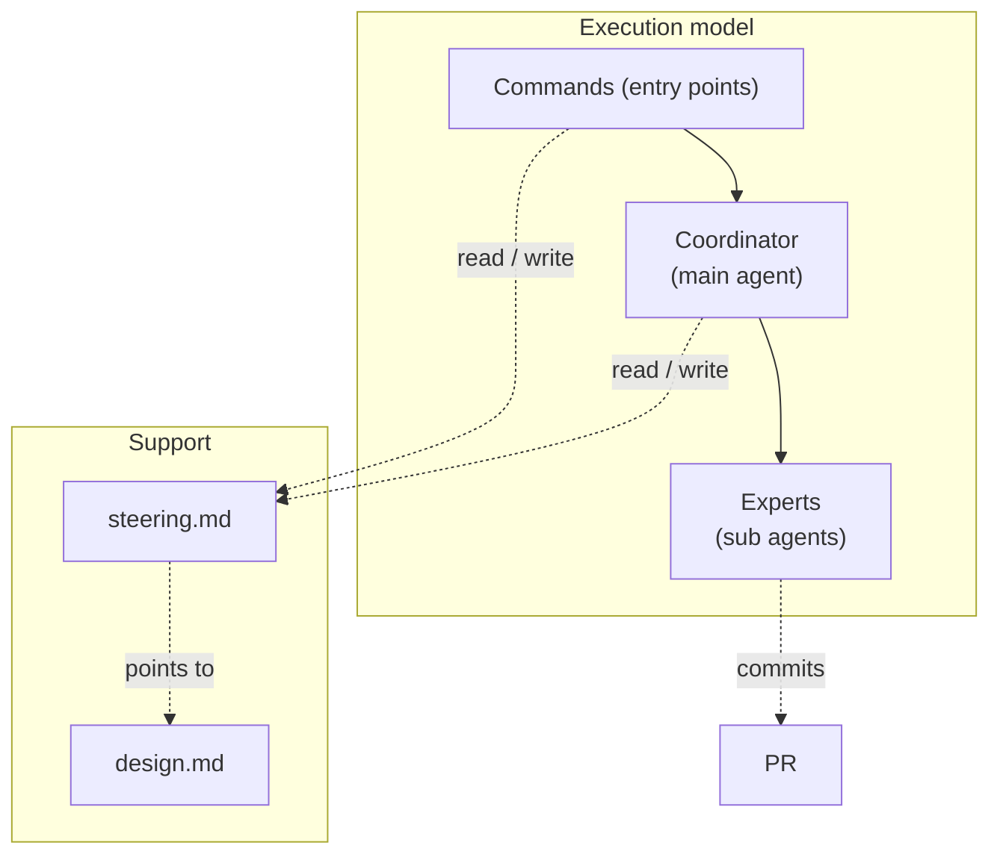
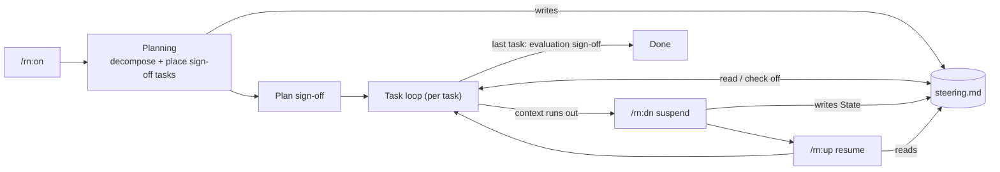
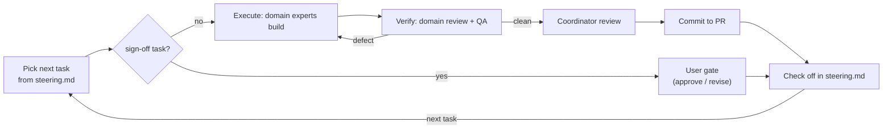

# rn — design notes

Not read at runtime — for whoever maintains the procedures and must judge whether a step is still
right when requirements change. Key ideas and mechanism only.

## Context & constraints

A piece of real work outlives any single conversation: context runs out, `/clear` wipes the thread,
days pass. So rn keeps the durable state on disk — `steering.md` + git + the PR, never the agent's
memory — and a coordinator drives fresh expert subagents through the work one task at a time. A cold
agent can then resume from `steering.md`, which stays small enough to re-read in full each time.

## Approach

Two organizing ideas, with the rest following from them.

**(A) A skill orchestrates; each work-instruction is a fixed spec.** A procedure controls only the
*order* in which work-instructions fire. The detail of each one lives in its own spec, in one place:
*what / why / when* to write a `steering.md`, a `design.md`, or a task → that artifact's template; how a
task is built or verified → its workflow. From this follow, rather than as separate inventions:

- **Planning, execution, and verification are separate workflows** — each a single work-instruction
  (`planning-workflow`, `task-execute-workflow`, `task-verify-workflow`).
- **A user gate is a sign-off work-instruction the planner places in the task sequence** — not a
  checkpoint hardcoded into execution. Its timing is a planning decision, visible in the task list.
- **All gates and confirmations resolve through one verdict vocabulary** — `/rn:ty` (approve) and
  `/rn:gm` (revise) are wired to every sign-off task and every ad hoc confirmation, so the coordinator
  never infers a verdict from prose.
- **Authoring guidance lives in templates, not scattered across procedure steps** — where duplicated
  guidance drifts and is hard to keep consistent.
- **PR review feedback runs its own, lighter loop** (`pr-feedback-workflow`), separate from the task
  loop. `/rn:gm` with no argument collects the PR's unresolved threads the reviewer still has the last
  word on, dispatches one execution subagent per thread in sequence with a coordinator review between
  each, and never resolves a thread itself — resolution is the reviewing author's act on GitHub.

**(B) Experts fit the artifact, and build and review mirror each other.** Experts are chosen per task by
what it produces — **design**, **craft** (coding / writing / visual, per medium), **verification** (test
/ fact-check / dry-run) — with **QA** (does it meet the objective?) across all. Over a fixed code-centric
trio (language / software-engineering), which neither fits prose, prompts, or slides nor mirrors what was
built. The same axes build and review, so a reviewer shares the builder's viewpoint and fewer defects
survive; only the axes a task needs are spawned, so coverage widens without weight.

The standing decisions these build on:

- **Coordinator / expert split** — over one agent that builds *and* reviews its own work, which is not
  independent.
- **steering.md is a lean forward contract** — heavy content lives elsewhere (rationale → `design.md`,
  UX → `README`, history → git + PR). Never stored, so it can't drift or grow into an archive.
- **Quality built into each task** — over a final inspection: a defect is caught at the task that
  introduced it.
- **The user gates only plan / design / evaluation** — each evaluating one thing: plan → `steering.md`,
  design → `design.md`, evaluation → the end results (the Acceptance-criteria run and the task checks).
  The design and evaluation gates are sign-off tasks (per A); the plan gate is planning's own closing
  hand-off, since a plan can't carry a task that approves itself. Over a gate on every task, which is
  ceremony where no decision is waiting. Escalation is a separate, always-open channel for anything that
  changes the agreed plan or design.

## Structure

| Actor | What it is |
|---|---|
| Commands (entry points) | `/rn:on`, `/rn:dn`, `/rn:up` — start, suspend, resume a session; `/rn:ty`, `/rn:gm` — approve or revise whatever is pending (a gate or reviewed result, or, with no argument to `/rn:gm`, the PR's review threads). |
| Coordinator (main agent) | The conversation agent that plans, dispatches, reviews, and records. |
| Experts (sub agents) | Chosen per task — design, craft (per medium), verification — with QA across all; the same axes build and review. |
| `steering.md` | The session's forward contract. |
| `design.md` | The whole-structure design (this doc). |

The coordinator follows three procedures: **planning-workflow** decomposes the goal into tasks and
places the plan / design / evaluation sign-offs among them; **task-execute-workflow** builds one task;
**task-verify-workflow** verifies it. A fourth, **pr-feedback-workflow**, runs outside the task loop:
`/rn:gm` with no argument invokes it directly against the PR's review threads.

## Flow

Two loops at two altitudes.

**Session lifecycle** — a goal driven to *done* across context resets. `/rn:on` runs planning once;
the task loop then runs each task, suspending and resuming across context boundaries. `steering.md` is
the durable spine: planning and `/rn:dn` write it, `/rn:up` and the loop read it. The design and
evaluation sign-offs are tasks placed by planning; the plan sign-off is planning's own closing hand-off.

**Task loop** — how one task is handled, coordinator-driven (no command). A sign-off task is a user
gate; any other task is built then verified along its domains, with the defect caught in the loop.
Only the shape is here — the steps live in `task-execute-workflow.md` / `task-verify-workflow.md`.

## Open questions

- **The craft / verification specializations.** The axes are design / craft / verification + QA; how
  craft and verification instantiate per medium (coding↔test, writing↔fact-check, visual↔dry-run) is
  sketched, not pinned — whether the medium list is complete is open. Also open: a task spanning more
  than one medium (e.g. code plus an accompanying diagram) — whether it spawns one Craft/Verification
  instance per medium it touches is unresolved.
- **Default home for a session's `design.md`.** Sessions default to `.rn/{slug}/design.md`, but rn
  keeps its own under `rn/docs/`; whether that exception generalizes is open.
