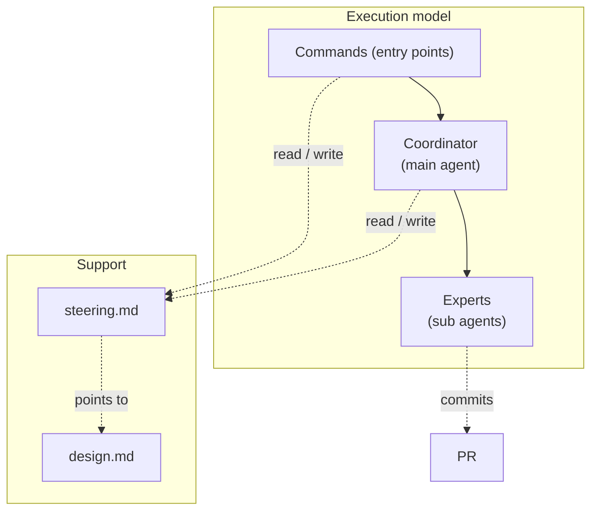
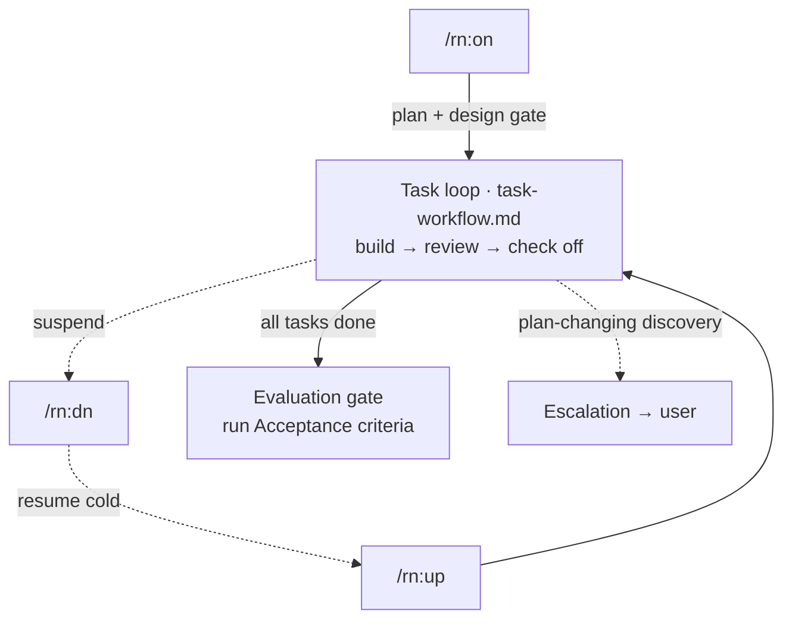

# rn — design notes

Not read at runtime — for whoever maintains the procedures and needs to judge whether a step is still
right when requirements change. Records the key ideas and the mechanism, not every detail.

## Context & constraints

rn drives a goal to *done* across context resets — a conversation fills up, a `/clear` wipes the
thread, a day ends. A fresh agent picks the work up cold, so the durable record lives in `steering.md`,
git, and the PR (never in the agent's memory), and `steering.md` stays small enough to re-read in full
every resume.

## Approach

- **Coordinator / expert split** — the coordinator delegates every deliverable to fresh subagent
  experts and never builds or reviews its own output. Keeps reviews independent and its context light.
- **`steering.md` is a lean forward contract** — goal, criteria, remaining tasks, and resume state
  only; rationale → `design.md`, UX → `README`, history → git + the PR. Heavy content is never stored,
  so steering can't drift or regrow into an archive.
- **Quality per task, not a final inspection** — each task is gated by self-check + QA/expert review +
  the coordinator's independent diff review, so a defect is caught where it is introduced.
- **Three user gates + escalation** — the user signs off only at plan, design, and evaluation, never
  per task; any discovery that changes the agreed plan or design is escalated immediately, anytime.

## Structure

| Actor | Responsibility |
|---|---|
| Commands (entry points) | The user's interface — start, suspend, resume a session. |
| Coordinator (main agent) | Decomposes the goal, dispatches the expert per task, reviews returned work, records verdicts. Never touches the deliverable. |
| Experts (sub agents) | Implementation builds and commits; QA — and, for code, language and software-engineering — review adversarially. |
| `steering.md` | Forward contract: goal, criteria, rules, remaining tasks, state, `Design:` pointer. |
| `design.md` | The whole-structure design (this doc) that `steering.md` points to. |

The per-task coordinator/expert loop is defined in `task-workflow.md`.

## Flow

## Open questions

- **Default home for a session's `design.md`.** Sessions default to `.rn/{slug}/design.md`, but rn
  keeps its own under `rn/docs/`; whether that exception generalizes is open.
