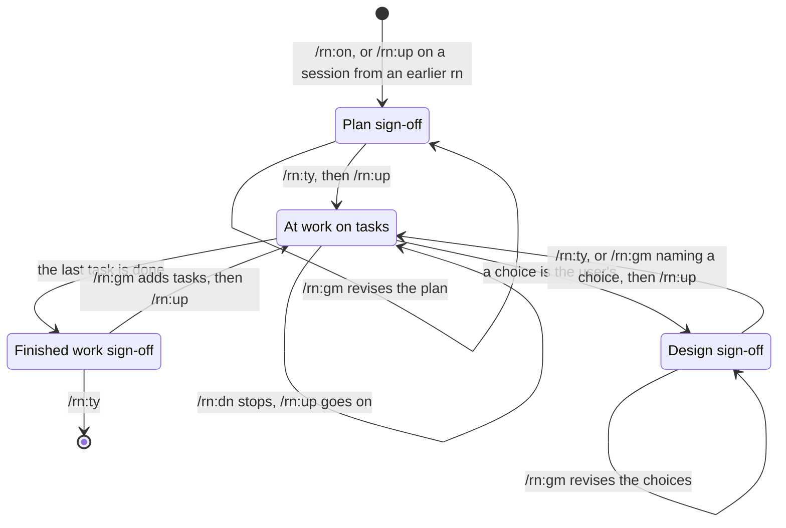

# rn design

The README says what the user sees. This is the ground it stands on: what rn holds to, and why. The
prompts under `skills/` and `references/` carry it out; where one differs from this, this is right.

## What rn holds to

- **The Goal is what the user really wants, not their first words.** Every piece of work and every
  decision rests on it, and a plan built on the first words reaches the wrong thing however well it
  is carried out. So the session starts by working the Goal out with the user.
- **Work is given by its purpose, not by steps.** A task says what it must reach and how to tell it
  is reached, on the real thing. Steps written in advance are kept to the letter and miss the point
  when the ground turns out different; a purpose survives a change of means.
- **What is made is evaluated by someone who did not make it.** The evaluator is told the Goal and
  shown the work, not how or why it was made, since a view pulled toward its maker's no longer
  watches for the user.
- **Only the conductor decides what comes next.** The implementer implements, the evaluator says
  what holds and what does not with its grounds, the user answers only what is theirs. A move
  decided by the letter of an evaluation retries work that already serves the Goal; the conductor
  weighs each point against the Goal instead.
- **The user decides only what is theirs.** Taste, scope, cost against benefit, another way when the
  current one keeps falling short, and whether the finished work is what they wanted. Everything
  else goes on without them, since their attention is the scarcest thing in the session.
- **The plan reaches only as far as the user's next decision.** What follows depends on it.
- **Every stop is a point where the user can clear the conversation.** A long session outgrows any
  one conversation, so everything the next one needs is in `steering.md` and git, and nowhere else.

## Who does what

| Role | Does | Decides |
|---|---|---|
| **User** | answers at a sign-off | the Plan, a Design choice, the Finished work |
| **Conductor** (the main conversation) | works out the Goal, writes the plan, sets out choices, starts the others, keeps `steering.md` | every next move, by the Goal |
| **Implementer** (a fresh agent per task) | implements one task and checks it | nothing |
| **Evaluator** (a fresh agent per evaluation) | evaluates the plan, the choices, a task's result, or the finished work | nothing |

## Where the session stands, and what each command does

A session is always at one of these points: at work on a task, or stopped at a sign-off. A sign-off
ends each stretch of tasks: the Plan sign-off first, a Design sign-off where a choice is the user's,
the Finished work sign-off last.

```mermaid
stateDiagram-v2
    state "Plan sign-off" as Plan
    state "At work on tasks" as Work
    state "Design sign-off" as Design
    state "Finished work sign-off" as Finished

    [*] --> Plan: /rn:on, or /rn:up on a session from an earlier rn
    Plan --> Plan: /rn:gm revises the plan
    Plan --> Work: /rn:ty, then /rn:up
    Work --> Work: /rn:dn stops, /rn:up goes on
    Work --> Design: a choice is the user's
    Work --> Finished: the last task is done
    Design --> Design: /rn:gm revises the choices
    Design --> Work: /rn:ty, or /rn:gm naming a choice, then /rn:up
    Finished --> Work: /rn:gm adds tasks, then /rn:up
    Finished --> [*]: /rn:ty
```

- **`/rn:gm` revises until the evaluation leaves nothing of the feedback, then stops**; `/rn:ty`
  records the approval and stops. `/rn:gm` without a choice named at a Design sign-off is feedback;
  naming one approves it, as `/rn:ty` approves the recommended one.
- **`/rn:up` at a sign-off not yet approved stops there again.**
- **A command with nothing to do where the session stands only reports**: `/rn:gm` and `/rn:ty` at
  work say what the session is doing; `/rn:dn` at a sign-off says where it is stopped and what
  answers it.
- **Every command that stops, stops without going on.** `/rn:up` is the only way back to work, so the
  user can always clear first.
- **A session from an earlier rn** is brought up to date by `/rn:up`, by working out its plan again
  from the old record, on the same branch and pull request; it stops at the Plan sign-off. Versions
  differ when their first two numbers do.

## How the conductor decides

Each turn, the conductor takes what is in front: the first task not done, or an evaluation not yet
decided. What it made itself, it checks first; then it has it evaluated, and weighs each point the
evaluator raises by what is left between the thing and its Goal or Purpose, and whose that is:

| What is left | Whose | Next move |
|---|---|---|
| Nothing | — | a task is done; what a sign-off waits on, the plan, the choices, or the finished work, goes to it and the session stops there; a plan no sign-off waits on goes on to its tasks, since the decision it follows is made |
| A task falls short | the implementer's | the task is retried, the evaluation given with it |
| The plan or the choices fall short | the conductor's | they are revised, and evaluated again |
| The finished work falls short | the conductor's | tasks are added before its sign-off |
| A choice of taste, scope, or cost against benefit, or a way that keeps falling short | the user's | a Design sign-off takes the place of the tasks not done, its choices set out, and the session stops there |

- **Each decision is one line**, committed with its evaluation, so the user can follow the session on
  the pull request.

## What is handed on, and who reads it

| What | Written by | Read by | Cleared |
|---|---|---|---|
| Goal, Goal reached when, Assumptions, Rules, Tasks | conductor | everyone | never; revised in place |
| a task's `[x]` | conductor when it decides the Purpose reached; `/rn:ty` for a sign-off | conductor, to find what is in front | never |
| a choice the user made | `/rn:ty` or `/rn:gm <choice>`, as a Fact in Assumptions | conductor, implementer, evaluator | never |
| `design`: the document with a Design sign-off's choices | conductor, when the plan first holds a Design sign-off | conductor, implementer, evaluator | never |
| `Feedback`: the user's words, whole | `/rn:gm` | conductor, evaluator | conductor when nothing is left of it; `/rn:ty` on approval |
| `Notes`: where the work stands | `/rn:dn` | conductor at the next turn | conductor once read |
| an evaluation | evaluator, uncommitted | conductor to decide; the implementer on a retry of its task | conductor commits it; removed at the Finished work approval |
| the implementer's return: commits, and what it found to be the user's | implementer | conductor | — |
| a decision line | conductor, as the commit message | user, on the pull request | — |
| a reply on a review thread | `/rn:gm`, after the revision is committed | user | the user resolves it |

- **The evaluator names the points that fall short; the conductor decides which one decides the
  move.** The evaluator's word is a report, not a verdict on what comes next.
- **The evaluator reads neither `Notes` nor earlier evaluations**, since both are the session's own
  account and would pull its view toward it.
