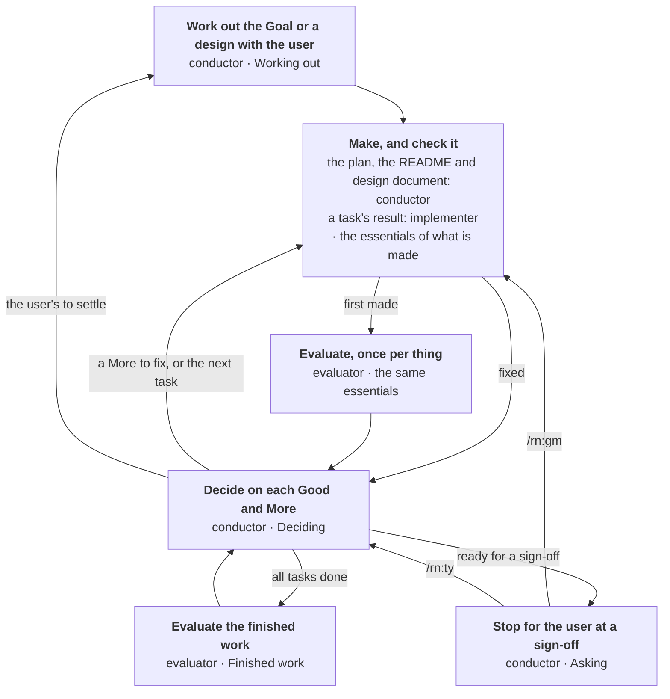

# rn design

How `rn` reaches what its [README](../README.md) says. Where `rn`'s prompts differ from this, this is
right.

## What rn holds to

- **The Goal is what the user really wants, not their first words.** Every piece of work and every
  decision rests on it; a plan built on the first words reaches the wrong thing however well it is
  carried out.
- **rn works by essentials, not by steps or rules.** Each role is given what its work must reach and
  the essential questions to judge it by, and finds its own way there. Steps are kept to the letter
  and miss the point when the ground turns out different, and they cap the work at what their writer
  foresaw; essentials let a better model do better work. So `rn` improves by refining its
  essentials.
- **What is made is evaluated by someone who did not make it.** A maker's view leans toward its own
  reasons, and what it overlooks, its own check overlooks too.
- **Only the conductor decides what comes next.** A move taken on the letter of an evaluation redoes
  work that already serves the Goal; the conductor weighs each point against the Goal instead.
- **The user decides only what is theirs.** Taste, scope, cost against benefit, a way that does not
  settle, and whether the finished work is what they wanted. Everything else goes on without them,
  since their attention is what a session spends most carefully.
- **What the product should be is written down before it is built.** Where the work changes it, the
  README and design document say so first, and change before the work does. A decision kept only in
  the session ends with it; in the documents it outlives the session, and the next change can be
  told against it.
- **The plan reaches only as far as the user's next decision.** Tasks planned past a decision not
  yet made rest on a guess of it, and are rewritten once it is made. So a plan is a list of tasks,
  each with its Purpose, what it must reach, and it ends at a sign-off, itself a task the user
  closes.

## Who does what

| Role | Does | Decides |
|---|---|---|
| **User** | works out the Goal and each design with the conductor; answers at a sign-off | the Plan, a Design, the Finished work |
| **Conductor** (the main conversation) | works out the Goal and designs with the user; writes the plan, the README and the design document; starts the others; keeps `steering.md` | every next move, by the Goal |
| **Implementer** (a fresh agent per task) | implements one task, and checks it by the essentials | nothing |
| **Evaluator** (a fresh agent per evaluation) | evaluates the plan, a design, a task's result, or the finished work by the essentials | nothing |

## Everything is made and judged by the same essentials

An essential is a question of what something must reach. It has two sides: the one who makes a
thing takes the questions as the aim of the making, and checks what it made by them; the evaluator
asks the same questions of the same thing. So making and evaluating look at the same thing, and
each question is written once. Every check and every evaluation answers each question with a Good,
what already serves the aim and must be kept, and a More, what falls short and how to change it,
each with its grounds, since the conductor decides from them. `rn` carries its essentials as one
set, in parts named for what they look at: Working out, Plan, Design, Task result, Finished work,
Deciding, and Asking.

```mermaid
flowchart TD
    Talk["<b>Work out the Goal or a design with the user</b><br/>conductor · Working out"]
    Make["<b>Make, and check it</b><br/>the plan, the README and design document: conductor<br/>a task's result: implementer<br/>· the essentials of what is made"]
    Eval["<b>Evaluate, once per thing</b><br/>evaluator · the same essentials"]
    Fin["<b>Evaluate the finished work</b><br/>evaluator · Finished work"]
    Decide["<b>Decide on each Good and More</b><br/>conductor · Deciding"]
    Ask["<b>Stop for the user at a sign-off</b><br/>conductor · Asking"]

    Talk --> Make
    Make -->|first made| Eval
    Make -->|fixed| Decide
    Eval --> Decide
    Fin --> Decide
    Decide -->|a More to fix, or the next task| Make
    Decide -->|all tasks done| Fin
    Decide -->|the user's to settle| Talk
    Decide -->|ready for a sign-off| Ask
    Ask -->|/rn:gm| Make
    Ask -->|/rn:ty| Decide
```

- **The conductor's own acts have essentials too**: working out with the user, deciding, and asking
  the user. No evaluator stands there, so the conductor checks itself by them, and each decision
  shows as one line on the pull request.
- **A thing is evaluated once.** A fix is checked by its maker's check, and the conductor decides on
  it from that check's Good and More.

## What each command sets going

The states and commands are the [README's](../README.md#how-a-session-goes); each command starts
one part of the flow above.

- **`/rn:on`**: working out the Goal with the user, then making the plan, up to the Plan sign-off.
- **`/rn:up`**: whatever is in front, the first task not done or an evaluation not yet decided, turn
  after turn until a sign-off, where it stops. At a Design sign-off not yet worked out, it works the
  design out with the user first. A session from an earlier `rn` is worked out again from its old
  record, up to a new Plan sign-off.
- **`/rn:ty`**: closes the sign-off in front, and stops.
- **`/rn:gm`**: keeps the user's words, from its argument or from the pull request's review comments,
  as `Feedback`; the conductor fixes what the sign-off decides on by them, checks the fix, and stops.
- **`/rn:dn`**: writes where the work stands in `Notes`, and stops.

## How the conductor decides

A task is done when no More is left that fixing would bring closer to its Purpose. For each More,
the conductor asks, by the Goal: does fixing it bring the thing closer to the Goal or its Purpose;
whose is it to fix; how; and does the fix keep the Goods. A More that fixing does not bring closer
is set aside, with the reason in the decision line. What it fixes, it gives to whoever the fix is: a
task's result to its implementer again with the Mores to fix, the plan or a design to itself, the
finished work as tasks added before its sign-off. The user's is what the Goal cannot decide: taste,
scope, cost against benefit, or a way that does not settle — the same More coming back, or each fix
bringing a new one. That becomes a Design sign-off in place of the tasks not done, worked out there
with the user.

## What is kept, and who reads it

Everything a session needs is in its directory `.rn/{date}-{slug}/`, which holds `steering.md` and
`evaluations/`, and in git.

| What | Written by | Read by | Kept until |
|---|---|---|---|
| `rn`: the version the session runs under | conductor | every command, to tell a session from an earlier `rn` (the first two numbers differ) | brought up to date |
| `pr`, `design`: the pull request, and the design document the work is built to | conductor | everyone | the end |
| Goal, Goal reached when, Assumptions, Rules (what the tasks must follow), Tasks | conductor | everyone | the end, revised in place |
| a task's `[x]` | conductor when it decides the Purpose reached, or on the user's `/rn:ty` for a sign-off | conductor, to find what is in front | the end |
| the README and the design document | conductor | conductor, implementer, evaluator | beyond the session: they are the product's own |
| `Feedback`: the user's words, whole | conductor, on `/rn:gm` | conductor, evaluator | answered |
| `Notes`: where the work stands | conductor, on `/rn:dn` | conductor | read |
| an evaluation, in `evaluations/` | evaluator | conductor; the implementer on a fix of its task | the Finished work approval |
| the implementer's return: commits, and a Good and More for each essential | implementer | conductor | decided |
| a decision line, as the commit message | conductor | user, on the pull request | — |
| a reply on a review thread | conductor, on `/rn:gm` | user | the user resolves it |

## What always holds

1. **After every command, resuming needs only `steering.md` and git.** So the user can stop anywhere
   with `/rn:dn`, and clear the conversation whenever they want.
2. **Nothing goes past a sign-off the user has not approved.**
3. **Every move of the session is a decision line of the conductor's.**
4. **The evaluator is given the Goal, the user's `Feedback`, the essentials, and the thing, and
   nothing else**: not the maker's reasons, not `Notes`, not earlier evaluations.
5. **No commit of the work goes beyond what the README and the design document on its branch
   say.**

## What it costs, and the ways not taken

- **A fresh agent for every task and every evaluation** costs time and tokens that one agent doing and
  checking its own work would not. It is paid because a maker's own check leans toward its reasons.
- **Stopping for each design** costs the user's time mid-session. It is paid because of the third
  assumption below.
- **Planning only to the next decision** means planning again after each. It is paid because a plan
  past it is rewritten anyway.
- **Evaluating each thing once** leaves a fix seen only by its maker's check, which leans toward its
  reasons. It is paid because of the fourth assumption below; what a fix gets wrong is left to the
  evaluation of the finished work and to the user's sign-off.
- **Essentials over steps** make a run less predictable than a script. It is paid because steps cap
  the work at what their writer foresaw.
- **Not taken — the evaluator decides the next move.** It would retry work that serves the Goal over
  a point of wording.
- **Not taken — the user picks among prepared choices.** A pick is not written into the README and
  design document, so the next change cannot be told against it, and prepared choices hide what the
  user would have raised in talk.

Assumptions, not yet checked:

- The models `rn` runs on keep getting better at judging by purpose. Were they not, steps would serve
  better than essentials.
- An evaluator told only the Goal and shown only the work finds what the user would find wrong.
- A design settled without the user is what they most often find wrong only at the end.
- Rounds of evaluation run by AI alone keep raising points that are not essential and do not settle;
  one round, with a person deciding from its result, takes less time and costs less.
