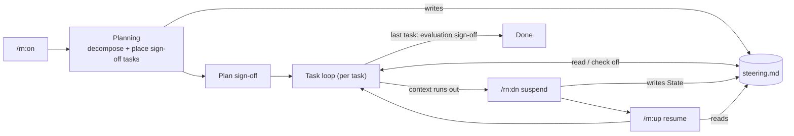
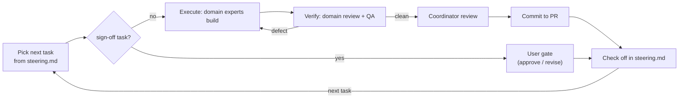

# rn — design notes

Not read at runtime — for whoever maintains the procedures and must judge whether a step is still
right when requirements change. Key ideas and mechanism only.

## 1. Background & Goals

### 1.1 What is the goal?

A piece of real work outlives any single conversation: context runs out, `/clear` wipes the thread,
days pass. `rn` keeps the durable state on disk — `steering.md` + git + the PR, never the agent's
memory — and a coordinator drives fresh expert subagents through the work one task at a time, so a
cold agent can resume purely by re-reading `steering.md`. This session extends that goal one layer
further: `rn` itself keeps changing its own conventions (the question-driven `design.md` contract, the
existing-design-update branch, and version tracking are this session's own additions), so a session's
`steering.md` / `design.md` / tasks, authored under an older `rn` version, must catch up to the
currently installed one automatically — without the user having to notice the drift or ask for it.

### 1.2 What goes wrong without this?

Without durable on-disk state: context loss silently drops in-flight decisions, and a resumed
conversation has no reliable way to reconstruct what was agreed. Without a decision-driven design
template: a `design.md` section can be silently dropped when it "has nothing to record," so a reader
can't tell whether a question was actually considered and rejected or simply never asked. Without an
existing-design-update branch: planning either duplicates a `design.md` that already covers the area,
or has nothing telling it how to update one instead of authoring fresh — this session hit that gap
directly, since `rn/docs/design.md` (this document) already existed and needed updating. Without
version tracking: a session started under an older `rn` keeps running against stale conventions
indefinitely — the gap between what a session's artifacts assume and what the installed plugin now
requires only widens, and nothing ever notices or closes it.

### 1.3 What does reaching it require?

The standing mechanism: a durable `steering.md` forward contract, a coordinator/expert split, and the
planning / execute / verify procedures with a fixed three-gate rule (plan / design / evaluation).
Layered on by this session: a `design-template.md` that forces a decision-plus-reasoning answer on
every h3 question, never a silent drop (4.4); a `planning-workflow.md` branch that checks for an
existing covering `design.md` before defaulting to a fresh path (4.5); an `Rn version:` stamp on every
`steering.md`, set once at creation from the installed plugin version; a `migration-workflow.md` that
reconciles `steering.md`, then `design.md`, then remaining tasks against current convention on a
version mismatch; and a one-line version check wired into each of the five command skills
(`on`/`dn`/`up`/`ty`/`gm`) that triggers it (4.6).

### 1.4 What is out of scope?

No mass, one-time migration of past sessions — reconciliation triggers only going forward, on a
version mismatch a command actually encounters; a session that never hits a mismatch is never touched.
No semver-range or CHANGELOG-driven migration logic — the version check is plain string equality, and
reconciliation always compares the current artifact against the currently installed template, never
against a delta keyed to which version a session started from. Cutting an actual `rn` release (version
bump + finalizing `CHANGELOG.md`) is a separate, explicit follow-up instruction per `plugin.md`'s
release procedure, not part of this design.

## 2. Assumptions & Constraints

### 2.1 What do we take as true?

`steering.md` + git + the PR is durable and the agent's own memory is not — a cold agent resuming from
`steering.md` alone is assumed sufficient, and `steering.md` stays small enough to re-read in full each
time. This session adds three narrower assumptions: aiya's design.md structure
(https://github.com/lovaizu/ccpm/blob/feature/smith-plugin/aiya/docs/design.md), once its
Conductor/CCS/Turn-specific content is stripped, generalizes to arbitrary `rn` sessions — validated
here only against this document, not against a wide sample of past session design docs. The version
check needs only plain string equality between the recorded and installed plugin version, since it
only answers "has anything changed," never "by how much" — no ordering or semver-range logic is
needed. `migration-workflow.md` runs with no user gate; an occasional wrong reconciliation is an
accepted risk, caught through normal PR/git-log review rather than a live approval step (per
`push-and-review.md`), not through the scheduled sign-off gates.

### 2.2 What binds the solution?

The user gates only plan / design / evaluation — never per task, and never on a reconciliation — so
any new mechanism must fit inside that fixed three-gate rule rather than add a fourth (see 4.6, 5.1).
Version tracking and migration reuse only what already exists — `steering.md`'s own header line, git,
the PR — rather than introducing a new state store or service, consistent with `steering.md` staying
the one durable substrate (2.1). `migration-workflow.md` may not read `CHANGELOG.md` or reason about
version ranges — every comparison is current-artifact-vs-current-template, regardless of which version
a session started from, so there is no per-version bookkeeping to maintain as `rn` keeps changing.

## 3. Design overview

### 3.1 What is the core idea, and why does it solve the problem?

Two organizing ideas, with the rest following from them.

**(A) A skill orchestrates; each work-instruction is a fixed spec.** A procedure controls only the
*order* in which work-instructions fire. The detail of each one lives in its own spec, in one place:
*what / why / when* to write a `steering.md`, a `design.md`, or a task → that artifact's template; how a
task is built or verified → its workflow; how a version mismatch is reconciled → `migration-workflow.md`.
From this follow, rather than as separate inventions:

- **Planning, execution, and verification are separate workflows** — each a single work-instruction
  (`planning-workflow`, `task-execute-workflow`, `task-verify-workflow`).
- **A user gate is a sign-off work-instruction the planner places in the task sequence** — not a
  checkpoint hardcoded into execution. Its timing is a planning decision, visible in the task list.
- **Sign-off tasks and any reviewed result share one verdict vocabulary** — `/rn:ty` (approve) and
  `/rn:gm` (revise) cover the plan / design / evaluation gates and any reviewed result; escalation and
  weigh-in questions are answered directly, not through these commands.
- **Authoring guidance lives in templates, not scattered across procedure steps** — where duplicated
  guidance drifts and is hard to keep consistent. This is also why version reconciliation is one
  reference (`migration-workflow.md`) that every command skill cites, rather than reconciliation logic
  copied into each of the five.
- **PR review feedback runs its own, lighter loop** (`pr-feedback-workflow`), separate from the task
  loop. `/rn:gm` with no argument invokes it against the PR's unresolved threads and never resolves one
  itself — resolution is the reviewing author's act on GitHub.

**(B) Experts fit the artifact, and build and review mirror each other.** Experts are chosen per task by
what it produces — **design**, **craft** (coding / writing / visual, per medium), **verification** (test
/ fact-check / dry-run) — with **QA** (does it meet the objective?) across all. The same axes build and
review, so a reviewer shares the builder's viewpoint and fewer defects survive; only the axes a task
needs are spawned, so coverage widens without weight. (Why this over a fixed code-centric trio, and what
else was considered for both ideas, is in section 5.)

Together these solve the problem this document opens with: (A) gives every mechanism — including this
session's version tracking and migration — one authoritative place to live and cite, so a cold agent or
a future session never has to re-derive it; (B) means the reviewer of a change (a `design.md` rewrite, a
workflow edit, a skill edit) is drawn from the same axis as whoever built it, so drift in any one
artifact is caught by someone who actually understands that artifact's shape.

### 3.2 What are the pieces, and what is each responsible for?

| Actor | What it is |
|---|---|
| Commands (entry points) | `/rn:on`, `/rn:dn`, `/rn:up` — start, suspend, resume a session; `/rn:ty`, `/rn:gm` — approve or revise whatever is pending (a gate or reviewed result, or, with no argument to `/rn:gm`, the PR's review threads). Each of the five checks the active session's `Rn version:` before proceeding with its own work (4.6). |
| Coordinator (main agent) | The conversation agent that plans, dispatches, reviews, and records. |
| Experts (sub agents) | Chosen per task — design, craft (per medium), verification — with QA across all; the same axes build and review. |
| `steering.md` | The session's forward contract: `Goal` / `Acceptance criteria` / `Assumptions` / `Rules` / `Tasks` / `State`, plus the `Rn version:` and `Design:` header lines. Doc-division rule: requirements & acceptance criteria live here; structure & decisions live in `design.md`; user-facing UX lives in the README — this keeps `steering.md` lean enough to re-read in full every time (2.1). |
| `design.md` | The whole-structure design — this doc, for `rn`'s own work. A session's `design.md` defaults to `.rn/{yyyymmdd}-{slug}/design.md`, but that default is not unconditional: `planning-workflow.md`'s design-location step checks first whether an existing `design.md` already covers the session's work area, and if so points `Design:` at it and treats the work as an update instead of fresh authoring (4.5). `rn/docs/design.md` living at `rn/docs/` rather than under a per-session `.rn/` path is not a special-cased exception to that default — it is the ordinary outcome of that check: this canonical doc already covers `rn`'s own work area, so any `rn` session (including this one) whose work touches it is "updating," not authoring fresh. This resolves the prior open question on this point; there is nothing further to leave open here. |
| `migration-workflow.md` | The reconciliation procedure a version mismatch triggers — coordinator-only, no expert spawn (4.6). |

The coordinator follows four procedures for the normal session flow, plus a fifth for drift:
**planning-workflow** decomposes the goal into tasks and places the plan / design / evaluation
sign-offs among them; **task-execute-workflow** builds one task; **task-verify-workflow** verifies it;
**pr-feedback-workflow** runs outside the task loop, invoked directly by `/rn:gm` with no argument
against the PR's review threads; **migration-workflow** runs when a command's version check finds a
mismatch, reconciling `steering.md`, then `design.md`, then remaining tasks against current convention,
with no expert spawn and no user gate (4.6).

Every stop for user input while a session is active (its `steering.md` exists and is identified) — asks
and flow-ending reports alike, among them the plan gate, the design / evaluation sign-off gates, an
escalation, `/rn:dn`'s untracked-path confirmation and its suspend report — opens with a
**session-status block** (4.1).

### 3.3 How does work move?

Two loops at two altitudes, plus a version check at the entry of every command.

**Session lifecycle** — a goal driven to *done* across context resets. `/rn:on` runs planning once; the
task loop then runs each task, suspending and resuming across context boundaries. `steering.md` is the
durable spine: planning and `/rn:dn` write it, `/rn:up` and the loop read it. The design and evaluation
sign-offs are tasks placed by planning; the plan sign-off is planning's own closing hand-off. Each of
`on`/`dn`/`up`/`ty`/`gm` also checks the session's `Rn version:` against the installed plugin version
somewhere in its sequence (4.6) — before any task-loop work proceeds.

```mermaid
flowchart LR
  on["/rn:on"] --> plan["Planning<br/>decompose + place sign-off tasks"]
  plan --> psign["Plan sign-off"]
  psign --> loop["Task loop (per task)"]
  loop -->|context runs out| dn["/rn:dn suspend"]
  dn --> up["/rn:up resume"]
  up --> loop
  loop -->|"last task: evaluation sign-off"| done["Done"]

  steer[("steering.md")]
  plan -->|writes| steer
  loop <-->|read / check off| steer
  dn -->|writes State| steer
  up -->|reads| steer
```

**Task loop** — how one task is handled, coordinator-driven (no command). A sign-off task is a user
gate; any other task is built then verified along its domains, with the defect caught in the loop. Only
the shape is here — the steps live in `task-execute-workflow.md` / `task-verify-workflow.md`.

```mermaid
flowchart LR
  pick["Pick next task<br/>from steering.md"] --> kind{"sign-off task?"}
  kind -->|yes| gate["User gate<br/>(approve / revise)"]
  kind -->|no| build["Execute: domain experts build"]
  build --> verify["Verify: domain review + QA"]
  verify -->|defect| build
  verify -->|clean| cr["Coordinator review"]
  cr --> commit["Commit to PR"]
  commit --> off["Check off in steering.md"]
  gate --> off
  off -->|next task| pick
```

## 4. Detailed design

### 4.1 What does the session-status block guarantee, and how is a breach caught?

Guarantees the user can orient at any stop — what's done, what's being asked, what remains — without
opening `steering.md` themselves, derived fresh from it at emit time, in the user's conversation
language. Its format, and the boundary for stops outside an active session, lives in one reference,
**status-display.md**; every stop point only cites it. A breach (a stop that improvises its own status
format, or omits the block where the boundary requires it) is caught because there is only one place
the format is allowed to be defined — a stop that doesn't match it is visibly inconsistent against that
single reference on review, rather than one of several competing definitions any of which could claim
to be right.

### 4.2 What do the plan / design / evaluation sign-off gates guarantee, and how is a breach caught?

Guarantees the user approves exactly three things — the plan, the design (when unsettled at plan time),
and the final evaluation — and nothing else needs a live stop; per-task quality is instead caught inside
that task's own build/verify chain (`task-execute-workflow.md` / `task-verify-workflow.md`). Each gate
is a sign-off task or hand-off placed by `planning-workflow.md`, taken only through `/rn:ty`/`/rn:gm`'s
explicit user verdict — the commands never infer approval. A breach (proceeding past a gate without a
recorded verdict) is structurally discouraged: `planning-workflow.md`'s persist step states "CRITICAL:
DO NOT proceed without explicit user approval," and `/rn:ty`'s own steps require identifying an
unambiguous pending approval — asking the user to disambiguate rather than guessing — before recording
one.

### 4.3 What does the PR-feedback workflow guarantee, and how is a breach caught?

Guarantees that PR review comments get addressed without disrupting the task loop's own three gates — a
separate, lighter loop, invoked only by `/rn:gm` with no argument. It guarantees every piece of feedback
is acted on, and that thread resolution stays a human act: the workflow replies and revises but never
resolves a thread itself. A breach (the workflow auto-resolving a thread, or dropping feedback) is
visible because resolution is defined as the reviewing author's own GitHub action — a thread resolved
without the author having acted on it is checkable directly on the PR.

### 4.4 What does the question-driven design-doc contract guarantee, and how is a breach caught?

Replaces the old five-section template (Context & constraints / Approach / Structure / Flow / Open
questions), whose per-section guidance allowed "a section with nothing to record" to be dropped
silently — a reader of a `design.md` under that shape could never tell whether a topic was actually
considered and rejected, or simply never asked. The new contract (`design-template.md`) fixes five
sections — Background & Goals / Assumptions & Constraints / Design overview / Detailed design /
Alternatives considered — each with explicit h3 questions, generalized from aiya's design.md
(https://github.com/lovaizu/ccpm/blob/feature/smith-plugin/aiya/docs/design.md) with its
Conductor/CCS/Turn-specific content stripped. It guarantees every h3 question gets a
decision-plus-reasoning answer, including "not applicable" stated with why. A breach — an h3 left
silently blank — is caught because the h3 headings are fixed and enumerable: a reader (or reviewer) can
diff the actual document against the canonical list and see exactly which question has no answer, which
the old shape's free-form sections never made checkable. This document is itself the dogfood case:
every section above and below follows that same contract.

### 4.5 What does the existing-design.md-update branch guarantee, and how is a breach caught?

Before this session, `planning-workflow.md`'s design-location step only knew "author a fresh
`design.md`" or "the session has none" — it had no branch for "an existing `design.md` already covers
this area, update it instead." That gap was live, not hypothetical: this document is `rn`'s own
canonical `design.md`, and this session's own design-location step had to route to it rather than
create a competing one. The closed gap: Step 2 of `planning-workflow.md` now explicitly checks, as a
judgment call on scope overlap (not a mechanical file-existence check), whether an existing `design.md`
already covers the session's work area — this repo/plugin's own canonical `design.md`, or another active
session's overlapping one — before defaulting to the per-session path. If one covers the area, `Design:`
points at it and the work follows `design-template.md`'s "Updating an existing design.md" procedure
(4.4's sibling procedure) instead of fresh authoring. A breach (planning creating a fresh, duplicate
`design.md` when an existing one already covers the area) is caught because it manifests concretely as
two overlapping `design.md` files with conflicting content — visible to whoever reviews the plan or the
PR, not merely a latent risk.

### 4.6 What does version-tracking + migration guarantee, and how is a breach caught?

Guarantees that a session's `steering.md` / `design.md` / remaining tasks never permanently drift from
the currently installed `rn` plugin's conventions — the moment any command runs under a newer version
than the one the session was authored under, the drift is reconciled automatically, without the user
noticing the mismatch or asking for a fix. The mechanism: `steering-template.md`'s header carries an
`Rn version:` line, stamped once at creation from the installed plugin's version and never user-edited
afterward; each of the five command skills (`on`/`dn`/`up`/`ty`/`gm`) carries a one-line step comparing
that recorded value against the installed plugin's current version (plain string equality — 2.1); on a
mismatch, the skill runs `migration-workflow.md` before proceeding with its own task-loop work. That
step sits early and unconditionally in every skill's sequence — first in `ty`/`gm`, second in `on`/`dn`
(right after locating or writing `steering.md`), seventh in `up` (after `up`'s own task-state
reconciliation but still before it begins the next task) — none of the five branches around it, so a
normal invocation always reaches it. `migration-workflow.md` reconciles, in order, `steering.md` against
`steering-template.md`, then `design.md` (if any) against `design-template.md`'s update procedure, then
each remaining task against the task-definition-requirements table — steering first because design's
location is read from its `Design:` line, and both before tasks since tasks are the remaining
forward-looking work. Reconciliation commits directly with no user gate (2.2's fixed three-gate rule has
no room for a fourth — see 5.1), then stamps `Rn version:` to the installed version last, so the stamp
only advances once the artifacts it certifies are actually current. `on`'s own version-check step is
structurally a no-op: `on` just stamped that line from the same installed version one step earlier, so
the comparison can never mismatch there — the step exists only so all five skills share one uniform
shape, not because `on` has its own drift to detect. A breach in `migration-workflow.md`'s own judgment
(a wrong reconciliation) is not caught synchronously — no live gate reviews it — but surfaces through
normal PR/git-log review, an accepted trade-off (2.1, 5.2).

## 5. Alternatives considered

### 5.1 Why this shape, and not another?

The standing decisions these build on:

- **Coordinator / expert split** — over one agent that builds *and* reviews its own work, which is not
  independent.
- **steering.md is a lean forward contract** — heavy content lives elsewhere (rationale → `design.md`,
  UX → `README`, history → git + PR). Never stored, so it can't drift or grow into an archive.
- **Quality built into each task** — over a final inspection: a defect is caught at the task that
  introduced it.
- **The user gates only plan / design / evaluation** — each evaluating one thing: plan → `steering.md`,
  design → `design.md`, evaluation → the end results (the Acceptance-criteria run and the task checks).
  The design and evaluation gates are sign-off tasks; the plan gate is planning's own closing hand-off,
  since a plan can't carry a task that approves itself. Over a gate on every task, which is ceremony
  where no decision is waiting. Escalation is a separate, always-open channel for anything that changes
  the agreed plan or design. This is also why `migration-workflow.md`'s reconciliation gets no gate of
  its own (4.6): adding a fourth gate for a mechanical, potentially-frequent procedure would break this
  fixed count.
- **Design / craft / verification / QA over a fixed code-centric trio** (language / software-engineering)
  — the fixed trio neither fits prose, prompts, or slides, nor mirrors what was actually built; choosing
  experts per task by what it produces, with the same axes building and reviewing, means a reviewer
  shares the builder's viewpoint and only the axes a task needs are spawned.
- **The question-driven `design.md` contract (4.4) over the old free-form five-section template** — the
  old shape let a section with "nothing to record" be dropped silently; forcing a decision-plus-reasoning
  answer to a fixed, enumerable set of h3 questions (including "not applicable, because...") makes an
  omission checkable instead of invisible.
- **A plain string-equality version check + current-vs-current reconciliation (4.6) over semver-range or
  CHANGELOG-driven migration** — the question this system needs answered is only "has anything changed,"
  never "by how much" or "what changed between these two specific versions"; range logic would add
  bookkeeping (a per-version delta table) that current-vs-current comparison never needs, since
  `migration-workflow.md` always reconciles against whatever is currently installed regardless of the
  session's starting version.
- **No one-time mass migration of past sessions** — reconciliation triggers per-session, only on an
  actual version mismatch a command encounters going forward; migrating every past session's
  `steering.md`/`design.md` immediately would touch dormant sessions nobody is actively working, for no
  benefit over reconciling lazily if and when a command next touches them.

### 5.2 What did we trade away?

Verbosity for rigor in the design-doc contract: every h3 question now demands an explicit
decision-plus-reasoning answer, even a "not applicable" one — a `design.md` under the new contract is
longer and more repetitive than the old shape's terse, sometimes-silent sections, in exchange for never
leaving a reader to guess whether a topic was actually considered. Synchronous safety for throughput in
migration: reconciliation commits with no user gate, so an occasional wrong reconciliation is an
accepted risk rather than a prevented one — caught only through ordinary PR/git-log review, not before
it lands (per `push-and-review.md`). Completeness for cost in version tracking: not migrating past,
already-closed sessions means some older `steering.md`/`design.md` pairs may carry stale conventions
indefinitely if no command ever runs against them again — accepted because those sessions are done, and
reconciling them would spend effort on work nobody is resuming.
