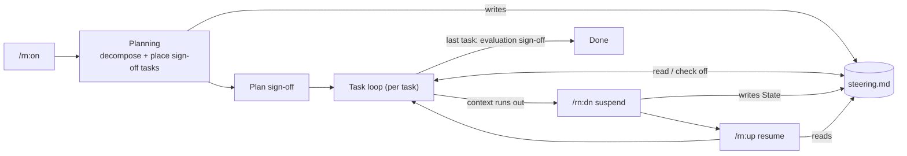
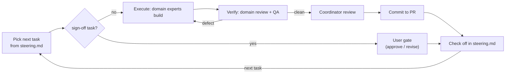

# rn — design notes

Not read at runtime — for whoever maintains the procedures and must judge whether a step is still
right when requirements change. Key ideas and mechanism only.

## 1. Background & Goals

### 1.1 What is the goal?

- Durable state on disk (`steering.md` + git + the PR, never the agent's memory) lets work outlive any
  one conversation; a coordinator drives fresh expert subagents through the work one task at a time, so
  a cold agent can resume by re-reading `steering.md`.
- This session: `rn` must keep its own conventions (question-driven `design.md` contract,
  existing-design-update branch, version tracking) current in artifacts authored under an older `rn`
  version — automatically, without the user noticing the drift or asking for it.
- Further layer this session adds: `rn` should be improvable from how its own sessions actually ran,
  using the Claude Code conversation log as evidence instead of memory or hand correlation. Needs two
  new pieces:
  - A task-boundary marker in the session's JSONL, marking where one task's work ends and the next
    begins.
  - A retrospective that turns friction actually observed in that log into improvement proposals.

### 1.2 What goes wrong without this?

- No durable on-disk state: context loss silently drops in-flight decisions; a resumed conversation
  can't reliably reconstruct what was agreed.
- No decision-driven design template: a `design.md` section can be silently dropped when it "has
  nothing to record" — a reader can't tell whether a question was considered and rejected, or never
  asked.
- No existing-design-update branch: planning either duplicates a `design.md` that already covers the
  area, or has no way to update one instead of authoring fresh — this session hit that gap directly
  (`rn/docs/design.md`, this document, already existed and needed updating).
- No version tracking: a session started under an older `rn` keeps running against stale conventions
  indefinitely; the gap between a session's artifacts and the installed plugin only widens and nothing
  closes it.
- No task boundary in the log: one task's stretch of work can't be told apart from neighboring tasks
  without hand-correlating `git log` against the JSONL — the exact gap task #1 measured.
- No retrospective on top of that boundary: recurring friction is never turned into anything, since
  nobody re-reads old JSONL looking for it, and asking for a proposal after every task would make the
  retrospective a tax nobody wants to pay (steering.md's own Goal draws this line explicitly).

### 1.3 What does reaching it require?

- Standing mechanism: a durable `steering.md` forward contract, a coordinator/expert split, and
  planning/execute/verify with a fixed three-gate rule (plan / design / evaluation).
- Layered on by an earlier session: `design-template.md` forcing a decision-plus-reasoning answer on
  every h3 question, never a silent drop (4.4); a `planning-workflow.md` branch checking for an
  existing covering `design.md` before defaulting to a fresh path (4.5); an `Rn version:` stamp on
  every `steering.md`, set once at creation from the installed plugin version; a `migration-workflow.md`
  that reconciles `steering.md` → `design.md` → remaining tasks on a version mismatch; a one-line
  version check wired into each of the five command skills (`on`/`dn`/`up`/`ty`/`gm`) that triggers it
  (4.6).
- Layered on by this session: a task-boundary marker, restamped continuously by a plugin hook rather
  than emitted as two remembered events, so a task's interval is read off as a changepoint (4.7); a
  collection stage turning each interval's trace-backed friction into an append-only record at every
  `/rn:dn`, at no cost when there's nothing to record (4.8); a stocktake stage, user-invoked, proposing
  only friction recurring across intervals and filing it as an issue only on explicit approval (4.9).

### 1.4 What is out of scope?

- No mass, one-time migration of past sessions — reconciliation triggers only going forward, on a
  version mismatch a command actually encounters.
- No semver-range or CHANGELOG-driven migration — the version check is plain string equality;
  reconciliation always compares the current artifact against the currently installed template, never
  a delta keyed to a session's starting version.
- Cutting an actual `rn` release (version bump + finalizing `CHANGELOG.md`) is a separate, explicit
  follow-up instruction per `plugin.md`'s release procedure — not part of this design.
- No retroactive marking of conversation history already on disk — the marker exists only in entries
  written after `rn` starts emitting it; task #8 demonstrates the mechanism on this session's own later
  tasks, not by reaching into the conversations task #1 already measured.
- No machine-wide, unbounded log search — locating a session's own record is bounded to its own
  working-directory project directory plus, inside a worktree, the parent checkout's project directory
  (4.7) — never a scan of every project directory on the machine.
- No cross-repository correlation — a friction fact belongs to the repository whose `.rn/friction.md`
  records it (2.2, 4.8).

## 2. Assumptions & Constraints

### 2.1 What do we take as true?

- `steering.md` + git + the PR is durable, the agent's own memory is not — a cold agent resuming from
  `steering.md` alone is assumed sufficient, and `steering.md` stays small enough to re-read in full
  each time.
- aiya's `design.md` structure, once its Conductor/CCS/Turn-specific content is stripped, generalizes
  to arbitrary `rn` sessions — validated here only against this document, not a wide sample of past
  session design docs.
- The version check needs only plain string equality between recorded and installed version, since it
  only answers "has anything changed," never "by how much" — no ordering or semver-range logic needed.
- `migration-workflow.md` runs with no user gate; an occasional wrong reconciliation is an accepted
  risk, caught through normal PR/git-log review (`push-and-review.md`), not a live approval step.

Measured evidence (task #1's evidence document) behind the task-boundary/friction mechanism:

- Claude Code files a conversation under the project directory named for its starting working
  directory — separates sibling worktrees of one repository — but not unconditionally: **measured
  2026-09-20**, leaving a worktree can relocate the conversation's file into the *parent checkout's*
  project directory instead. 6 of 155 files on this machine sit under a directory no `cwd` of theirs
  reproduces, including one of this session's own eight conversations.
  - The location method (4.7) therefore treats the working-directory glob as a fast path and the
    parent checkout's directory as a second, bounded search target — never a machine-wide scan, since
    relocation is measured to target only that one further, known location.
- Only a plugin hook's stdout (channel 6 of task #1's six measured emission channels) lands as an entry
  structurally distinct from ordinary conversation text: its `attachment.type: "hook_success"` and
  `hookEvent` key occur nowhere else across 552 files scanned machine-wide, while the same string
  quoted in prose reaches the identical field paths the other five channels use.
  - A `PostToolUse` hook on the coordinator's own tool call lands carrying that call's own `toolUseID`;
    a `SubagentStop` hook, or any hook firing while a subagent runs, reaches only the subagent's file;
    a `SessionEnd` hook's output is filed nowhere. So the marker fires on the coordinator's own
    `PostToolUse` only — never inside a dispatched subagent, never on `SubagentStop`.
  - A hook can print content it computes at fire time by reading a file (demonstrated: three runs each
    printed whichever token was on disk at fire time, not a value fixed at install) — so the marker
    relies on the hook reading `steering.md` fresh each firing.
- JSONL line order and wall-clock timestamp order disagree, by a margin with no found ceiling (808
  backward-running pairs machine-wide, largest 13,429.9 s, still climbing as the corpus grows) — so the
  collection stage (4.8) cuts an interval by line position within each append-only file, never by
  comparing timestamps across entries.
- Two continuation shapes exist, neither attributable to a particular invocation flag
  (`--resume`/`--continue`) from what's on disk:
  - `sessionKind: "bg"` — carries the predecessor's `uuid`-carrying entries into a new file under a
    new `sessionId`, restamping `sessionId` on every replayed entry; only `.message` content is
    byte-identical, not the whole entry.
  - The other shape simply appends into the existing file, under its original `sessionId`, after a
    restart, with nothing replayed.
  - The collection stage dedups by `uuid` across a session's own files to survive the first shape; the
    second shape has nothing to dedup.
- Nothing beyond 16-character lowercase hex (channels 1–5) and that alphabet plus a space and uppercase
  ASCII (channel 6) has been measured to survive any channel unaltered — this session fixes the
  marker's fields (4.7) but leaves the literal join characters (a slug's hyphens, a task description's
  punctuation) to be verified empirically before task #4 finalizes the format string. Residual risk,
  carried forward, not assumed away.

### 2.2 What binds the solution?

- The user gates only plan / design / evaluation — never per task, never on a reconciliation — so any
  new mechanism fits inside that fixed three-gate rule rather than adding a fourth (4.6, 5.1).
- Version tracking and migration reuse only what already exists — `steering.md`'s own header line, git,
  the PR — rather than a new state store or service, consistent with `steering.md` staying the one
  durable substrate (2.1).
- `migration-workflow.md` may not read `CHANGELOG.md` or reason about version ranges — every comparison
  is current-artifact-vs-current-template, regardless of which version a session started from, so
  there's no per-version bookkeeping.
- The friction store reuses git as its durability mechanism (`.rn/friction.md`, committed like
  `steering.md`) rather than a database or service.
- Neither the collection stage nor the stocktake stage adds a fourth user gate — collection runs
  unattended inside the existing `/rn:dn`; stocktake is a plain command the user chooses to run, not a
  stop the coordinator forces.
- Locating a session's own conversation files stays bounded to two directories — the working
  directory's own project directory, and, inside a worktree, the parent checkout's — rather than a
  machine-wide scan; task #1's relocation finding names the parent checkout as the only other place a
  worktree conversation is ever filed.

## 3. Design overview

### 3.1 What is the core idea, and why does it solve the problem?

Three organizing ideas, with the rest following from them.

**(A) A skill orchestrates; each work-instruction is a fixed spec.** A procedure controls only the
*order* work-instructions fire in. Each instruction's detail lives in one place: *what/why/when* to
write `steering.md`/`design.md`/a task → that artifact's template; how a task is built or verified →
its workflow; how a version mismatch is reconciled → `migration-workflow.md`. Follows from this:

- Planning, execution, and verification are separate single-work-instruction workflows
  (`planning-workflow`, `task-execute-workflow`, `task-verify-workflow`).
- A user gate is a sign-off work-instruction the planner places in the task sequence — not hardcoded
  into execution; its timing is a planning decision, visible in the task list.
- Sign-off tasks and any reviewed result share one verdict vocabulary — `/rn:ty` (approve) / `/rn:gm`
  (revise) cover the plan / design / evaluation gates and any reviewed result; escalation and weigh-in
  questions are answered directly, not through these commands.
- Authoring guidance lives in templates, not scattered across procedure steps — duplicated guidance
  drifts. Same reason version reconciliation is one reference (`migration-workflow.md`) every command
  skill cites, rather than logic copied into each of the five.
- PR review feedback runs its own, lighter loop (`pr-feedback-workflow`), separate from the task loop.
  `/rn:gm` with no argument invokes it against the PR's unresolved threads and never resolves one
  itself — resolution is the reviewing author's act on GitHub.

**(B) Experts fit the artifact, and build and review mirror each other.** Experts are chosen per task
by what it produces — **design**, **craft** (coding/writing/visual, per medium), **verification**
(test/fact-check/dry-run) — with **QA** (does it meet the objective?) across all. The same axes build
and review, so a reviewer shares the builder's viewpoint and fewer defects survive; only the axes a
task needs are spawned, so coverage widens without weight. (Alternatives considered: 5.1.)

**(C) A task boundary is a position in the log, not an event the coordinator has to remember to
emit.** A hook restamps the *current* task's own description on every coordinator tool call; a
boundary is simply where that restamped value changes between two consecutive markers, which the
collection stage (4.8) reads off directly. This follows from a channel-6 measurement: emission has to
be a hook, the only channel a marker cannot be confused with a quotation of itself on (2.1); once
emission is the hook's own act rather than something the coordinator deliberately fires, restamping on
every firing costs nothing extra — the alternative (recognizing two specific tool calls as "the"
boundary) is the one that would need bespoke logic (4.7, 5.1). A further consequence beyond 4.7's own
mechanism: because a boundary is a changepoint in a continuously restamped value, the friction record
(4.8) is keyable by that same description with no extra bookkeeping — collection reads the value the
hook already put there.

(C) sits at a narrower altitude than (A) and (B) — one mechanism, not an organizing architecture — but
its consequence reaches past its own section.

Together these solve the problem this document opens with: (A) gives every mechanism one authoritative
place to live and cite, so a cold agent or a future session never re-derives it; (B) means the reviewer
of a change is drawn from the same axis as whoever built it, so drift in any one artifact is caught by
someone who understands that artifact's shape; (C) means a task's own stretch of the log exists without
the coordinator having to remember to mark it, and survives whatever `/rn:gm` later does to the task
list that named it.

### 3.2 What are the pieces, and what is each responsible for?

| Actor | What it is |
|---|---|
| Commands (entry points) | `/rn:on`, `/rn:dn`, `/rn:up` — start, suspend, resume a session; `/rn:ty`, `/rn:gm` — approve or revise whatever is pending (a gate or reviewed result, or, with no argument to `/rn:gm`, the PR's review threads). Each of the five checks the active session's `Rn version:` before proceeding with its own work (4.6). |
| Coordinator (main agent) | The conversation agent that plans, dispatches, reviews, and records. |
| Experts (sub agents) | Chosen per task — design, craft (per medium), verification — with QA across all; the same axes build and review. |
| `steering.md` | The session's forward contract: `Goal` / `Acceptance criteria` / `Assumptions` / `Rules` / `Tasks` / `State`, plus the `Rn version:` and `Design:` header lines. Doc-division rule: requirements & acceptance criteria live here; structure & decisions live in `design.md`; user-facing UX lives in the README — keeps `steering.md` lean enough to re-read in full every time (2.1). |
| `design.md` | The whole-structure design — this doc, for `rn`'s own work. Defaults to `.rn/{yyyymmdd}-{slug}/design.md`, but not unconditionally: `planning-workflow.md`'s design-location step checks first whether an existing `design.md` already covers the session's work area, and if so points `Design:` at it and treats the work as an update instead of fresh authoring (4.5). |
| `migration-workflow.md` | The reconciliation procedure a version mismatch triggers — coordinator-only, no expert spawn (4.6). |
| Task-boundary hook | A plugin `PostToolUse` hook that restamps the session's slug and the current task's description on every coordinator tool call, landing as a structurally discriminable `attachment` entry (4.7). |
| `.rn/friction.md` | The friction store — one append-only, git-tracked file at the repo root, written by the collection stage and read by both it and the stocktake stage (4.8, 4.9). |
| `/rn:sk` | The stocktake command — user-invoked, proposes only friction recurring across intervals, files nothing without approval (4.9). |

- Four procedures for the normal session flow, plus a fifth for drift: **planning-workflow** decomposes
  the goal into tasks and places the plan/design/evaluation sign-offs; **task-execute-workflow** builds
  one task; **task-verify-workflow** verifies it; **pr-feedback-workflow** runs outside the task loop,
  invoked directly by `/rn:gm` with no argument against the PR's review threads; **migration-workflow**
  runs when a command's version check finds a mismatch, reconciling `steering.md` → `design.md` →
  remaining tasks, with no expert spawn and no user gate (4.6).
- Every stop for user input while a session is active — asks and flow-ending reports alike, among them
  the plan gate, the design/evaluation sign-off gates, an escalation, `/rn:dn`'s untracked-path
  confirmation and its suspend report — opens with a **session-status block** (4.1).

### 3.3 How does work move?

Two loops at two altitudes, plus a version check at the entry of every command.

**Session lifecycle** — a goal driven to *done* across context resets. `/rn:on` runs planning once; the
task loop then runs each task, suspending and resuming across context boundaries. `steering.md` is the
durable spine: planning and `/rn:dn` write it, `/rn:up` and the loop read it. The design and evaluation
sign-offs are tasks placed by planning; the plan sign-off is planning's own closing hand-off. Each of
`on`/`dn`/`up`/`ty`/`gm` also checks the session's `Rn version:` against the installed plugin version
somewhere in its sequence (4.6) — before any task-loop work proceeds.

```mermaid
flowchart LR
  on["/rn:on"] --> plan["Planning<br/>decompose + place sign-off tasks"]
  plan --> psign["Plan sign-off"]
  psign --> loop["Task loop (per task)"]
  loop -->|context runs out| dn["/rn:dn suspend"]
  dn --> up["/rn:up resume"]
  up --> loop
  loop -->|"last task: evaluation sign-off"| done["Done"]

  steer[("steering.md")]
  plan -->|writes| steer
  loop <-->|read / check off| steer
  dn -->|writes State| steer
  up -->|reads| steer
```

**Task loop** — how one task is handled, coordinator-driven (no command). A sign-off task is a user
gate; any other task is built then verified along its domains, with the defect caught in the loop. Only
the shape is here — the steps live in `task-execute-workflow.md` / `task-verify-workflow.md`.

```mermaid
flowchart LR
  pick["Pick next task<br/>from steering.md"] --> kind{"sign-off task?"}
  kind -->|yes| gate["User gate<br/>(approve / revise)"]
  kind -->|no| build["Execute: domain experts build"]
  build --> verify["Verify: domain review + QA"]
  verify -->|defect| build
  verify -->|clean| cr["Coordinator review"]
  cr --> commit["Commit to PR"]
  commit --> off["Check off in steering.md"]
  gate --> off
  off -->|next task| pick
```

**Task-boundary layer** — a third, finer-grained loop that runs underneath both of the above without
changing their shape. The task-boundary hook fires on every coordinator tool call regardless of which
loop is active, restamping the session's slug and whatever task `steering.md` currently shows as
in-progress; so a task's own stretch of the log exists whether that task went through the ordinary
build/verify path or was a sign-off gate, with no separate step for either diagram to carry (4.7).
`/rn:dn`'s existing suspend step gains the collection stage as a silent addition (4.8); a new,
separately-invoked `/rn:sk` command is the only path to a stocktake proposal, mentioned but not run at
the session's own closing report (4.9).

## 4. Detailed design

### 4.1 What does the session-status block guarantee, and how is a breach caught?

- Guarantees the user can orient at any stop — what's done, what's being asked, what remains — without
  opening `steering.md` themselves; derived fresh from it at emit time, in the user's conversation
  language.
- Format, and the boundary for stops outside an active session, lives in one reference,
  **status-display.md**; every stop point only cites it.
- Breach (a stop improvising its own status format, or omitting the block where the boundary requires
  it) is caught because there's only one place the format is allowed to be defined — a mismatch is
  visibly inconsistent against that single reference on review.

### 4.2 What do the plan / design / evaluation sign-off gates guarantee, and how is a breach caught?

- Guarantees the user approves exactly three things — the plan, the design (when unsettled at plan
  time), and the final evaluation — nothing else needs a live stop; per-task quality is instead caught
  inside that task's own build/verify chain (`task-execute-workflow.md` / `task-verify-workflow.md`).
- Each gate is a sign-off task or hand-off placed by `planning-workflow.md`, taken only through
  `/rn:ty`/`/rn:gm`'s explicit user verdict — the commands never infer approval.
- Breach (proceeding past a gate without a recorded verdict) is structurally discouraged:
  `planning-workflow.md`'s persist step states "CRITICAL: DO NOT proceed without explicit user
  approval," and `/rn:ty`'s own steps require identifying an unambiguous pending approval — asking the
  user to disambiguate rather than guessing — before recording one.

### 4.3 What does the PR-feedback workflow guarantee, and how is a breach caught?

- Guarantees PR review comments get addressed without disrupting the task loop's own three gates — a
  separate, lighter loop, invoked only by `/rn:gm` with no argument. Every piece of feedback is acted
  on, and thread resolution stays a human act: the workflow replies and revises but never resolves a
  thread itself.
- Breach (the workflow auto-resolving a thread, or dropping feedback) is visible because resolution is
  the reviewing author's own GitHub action — a thread resolved without the author having acted on it is
  checkable directly on the PR.

### 4.4 What does the question-driven design-doc contract guarantee, and how is a breach caught?

- Replaces the old five-section template (Context & constraints / Approach / Structure / Flow / Open
  questions), whose per-section guidance allowed "a section with nothing to record" to be dropped
  silently — a reader could never tell whether a topic was actually considered and rejected, or simply
  never asked.
- The new contract (`design-template.md`) fixes five sections — Background & Goals / Assumptions &
  Constraints / Design overview / Detailed design / Alternatives considered — each with explicit h3
  questions, generalized from aiya's design.md (2.1). Guarantees every h3 question gets a
  decision-plus-reasoning answer, including "not applicable" stated with why.
- Breach (an h3 left silently blank) is caught because the h3 headings are fixed and enumerable: a
  reader (or reviewer) can diff the actual document against the canonical list and see exactly which
  question has no answer — which the old free-form shape never made checkable.
- This document is itself the dogfood case: every section above and below follows that same contract.

### 4.5 What does the existing-design.md-update branch guarantee, and how is a breach caught?

- Before this session, `planning-workflow.md`'s design-location step only knew "author a fresh
  `design.md`" or "the session has none" — no branch for "an existing `design.md` already covers this
  area, update it instead." That gap was live, not hypothetical: this document is `rn`'s own canonical
  `design.md`, and this session's own design-location step had to route to it rather than create a
  competing one.
- Closed: Step 2 of `planning-workflow.md` now checks, as a judgment call on scope overlap (not a
  mechanical file-existence check), whether an existing `design.md` already covers the session's work
  area — this repo/plugin's own canonical `design.md`, or another active session's overlapping one —
  before defaulting to the per-session path. If one covers the area, `Design:` points at it and the
  work follows `design-template.md`'s "Updating an existing design.md" procedure instead of fresh
  authoring.
- This same check also settles whether `rn/docs/design.md` living at `rn/docs/` rather than under a
  per-session `.rn/` path is a special-cased exception: it is not — it's the ordinary outcome of this
  check, since this canonical doc already covers `rn`'s own work area, so any session touching it is
  "updating," not authoring fresh.
- Breach (planning creating a fresh, duplicate `design.md` when an existing one already covers the
  area) is caught because it manifests concretely as two overlapping `design.md` files with conflicting
  content — visible to whoever reviews the plan or the PR.

### 4.6 What does version-tracking + migration guarantee, and how is a breach caught?

- Guarantees that a session's `steering.md` / `design.md` / remaining tasks never permanently drift from
  the currently installed `rn` plugin's conventions — the moment any command runs under a newer version
  than the session was authored under, the drift is reconciled automatically, without the user noticing
  the mismatch or asking for a fix.
- Mechanism: `steering-template.md`'s header carries an `Rn version:` line, stamped once at creation
  from the installed plugin's version and never user-edited afterward; each of the five command skills
  (`on`/`dn`/`up`/`ty`/`gm`) carries a one-line step comparing that recorded value against the installed
  version (plain string equality — 2.1); on a mismatch, the skill runs `migration-workflow.md` before
  proceeding with its own task-loop work.
  - That step sits early and unconditionally in every skill's sequence — first in `ty`/`gm`, second in
    `on`/`dn` (right after locating or writing `steering.md`), seventh in `up` (after `up`'s own
    task-state reconciliation but still before it begins the next task) — none of the five branches
    around it.
  - `migration-workflow.md` reconciles, in order, `steering.md` against `steering-template.md`, then
    `design.md` (if any) against `design-template.md`'s update procedure, then each remaining task
    against the task-definition-requirements table — steering first because design's location is read
    from its `Design:` line, both before tasks since tasks are the remaining forward-looking work.
  - Reconciliation commits directly with no user gate (2.2's fixed three-gate rule has no room for a
    fourth — 5.1), then stamps `Rn version:` last, so the stamp only advances once the artifacts it
    certifies are actually current.
- `on`'s own version-check step is structurally a no-op: `on` just stamped that line from the same
  installed version one step earlier, so the comparison can never mismatch there — the step exists only
  so all five skills share one uniform shape.
- Breach (a wrong reconciliation) is not caught synchronously — no live gate reviews it — but surfaces
  through normal PR/git-log review, an accepted trade-off (2.1, 5.2).

### 4.7 What does the task-boundary marker guarantee, and how is a breach caught?

- Guarantees that every stretch of the log where the coordinator is actively working under an `rn`
  session can be attributed to one task's own description — without relying on the five ordinary
  emission channels (assistant text, a Bash command or its output, a tool result, a subagent's final
  report), none of which task #1 could tell apart from a document or work order quoting the same text,
  and without relying on the session-status block, which appears only at explicit user-facing stops —
  never during an ordinary task's build/verify work, where a boundary actually needs to be read (2.2,
  4.1).
- **Mechanism.** A plugin `PostToolUse` hook, registered with no tool restriction, fires on every tool
  call — measured directly for `Agent` and `Bash`, both landing in the identical
  `attachment`/`hook_success` shape; extending to other tools `rn`'s workflows call (`Read`, `Edit`,
  `Write`) is an extrapolation task #4 should confirm. On every firing the hook reads `steering.md`
  fresh, finds the *current* task (first task in the Tasks list still carrying an unchecked step —
  reuses the checkbox convention, no new field, per 2.2), and prints a fixed-shape line naming the
  session's slug and that task's description. The line lands as `attachment.type: "hook_success"`, the
  shape task #1 measured to occur nowhere else in 552 files — so a document, `steering.md`, or this
  design doc can name and quote the marker's format in prose without confusion.
- **Continuous restamping, not two discrete events.** The hook restamps the same line on every firing
  while a task stays current; a boundary is where the restamped description changes between two
  consecutive markers (read directly by 4.8). An abandoned task's markers simply stop once
  `steering.md` moves past it — no missing "complete" event to notice. A re-done task (steps reopened,
  or a revision reintroducing the same work) is restamped again the same way, producing a second,
  non-contiguous run the collection stage treats as its own interval. A sign-off task is covered too:
  `/rn:ty`/`/rn:gm` both read `steering.md` (and, on a version mismatch, `plugin.json`) before recording
  a verdict, so at least one tool call — and marker — occurs; a sign-off with genuinely zero coordinator
  tool calls would go unmarked, believed not to occur but not itself measured (5.2).
- **Naming the session and task, not `#N`.** The marker carries the session's slug (fixed for the
  session's lifetime, set at `/rn:on`) and the task's *description text*. Why: `/rn:gm` can rewrite or
  add tasks mid-session, so `#N` need not name the same task later, and a squashed PR drops the
  intermediate `steering.md` revisions that would say what `#N` meant at the time. A description
  carries its own meaning with no other file open — needed by the friction record (4.8) too.
- **Locating a session's own markers without a separate ID.** The working-directory glob already
  separates concurrent sessions in the common case (each worktree gets its own project directory) — a
  bare correlation token would duplicate that. The gap is relocation to the parent checkout's directory
  once a worktree is left, measured to land only there (2.1). So: a two-directory search (working
  directory's project directory, plus the parent checkout's when in a worktree) filtered to markers
  naming this session's own slug — both picks this session out among other sessions' relocated files
  sharing that directory (measured: two worktrees' stubs can sit side by side) and confirms a candidate
  file is this session's rather than guessing from its path. A separate opaque session ID was
  considered and rejected (5.1): it would need its own lookup table (2.2 rules out as a new state
  store) and would still need the two-directory search to find it.
- **Breach detection.** The hook failing to fire for a stretch is caught the way task #4's completion
  criterion checks it: grep both boundaries of a task that actually ran and confirm the interval
  between them holds that task's work. A marker naming the wrong session/task (a bug reading
  `steering.md`) is visible on direct log inspection, since the marker's text and the actual working
  directory/task are stated in the same line. A quotation of the marker's format elsewhere (this doc,
  README, a work order) isn't mistaken for a real emission because collection (4.8) keys off the
  entry's structural shape (`attachment.type: "hook_success"` + the hook's own `command`), never a bare
  substring match — the Verification expert review of tasks #4/#5 checks that the implementation
  actually does so.

### 4.8 What does the collection stage guarantee, and how is a breach caught?

- Guarantees that friction actually left in the log surfaces without the user doing anything at
  `/rn:dn`, and that nothing is invented when there is none.
- **Who runs it, and over what span.** A subagent, never the coordinator (so its own context isn't
  spent reading a JSONL, 2.1), locates this session's own conversation files by 4.7's two-directory
  method, finds task-boundary markers bearing this session's slug, and cuts the *whole* session's
  stretch, from its own start, into per-task intervals where the restamped description changes — every
  run, not only since the previous one.
  - Cut by line position within each file, never by comparing timestamps across entries (line/timestamp
    order disagree unboundedly, 2.1).
  - A marker replayed into a later file by the `sessionKind: "bg"` shape is deduped by `uuid` rather
    than counted twice; the other continuation shape (restart, append) replays nothing, so dedup has
    nothing to do there.
  - Consequence of 4.7's own residual risk: a sign-off task with genuinely zero tool calls has no
    marker/interval, so friction from it would be misattributed to a neighboring task — believed not to
    occur, carried forward as the same unmeasured case (5.2).
- **Ordering files before cutting intervals inside any one.** A session's record commonly spans several
  files (this session: seven, or eight counting one relocation, 2.1). Two cases:
  - A **continuation pair** linked by a `continued-in` entry (2.1; only instance measured, but
    directional by construction) is known-adjacent regardless of timestamp.
  - Files with **no continuation link** (independent conversations, e.g. either side of a `/clear`) are
    ordered by each file's own first *timestamped* entry — a coarser, whole-file comparison, not
    per-entry, so it doesn't inherit the within-file inversion problem. Reasoned, not measured: a file
    can carry no timestamped entry for a stretch of its early life (measured: a 10-entry no-timestamp
    file grew into 296 entries; a separate single-entry file has no timestamp at all), so a snapshot
    mid-session can find a newer file with nothing yet to compare. A sharper failure mode: a file that
    truly starts first can carry a long stretch of leading untimestamped entries before its own first
    timestamped one, while a later-starting file reaches its first timestamped entry sooner — comparing
    by first-timestamped-entry alone can invert the true start order even with both files having a
    timestamp to compare (a correctness risk, not just completeness). Both carried forward as residual
    risks.
- **The bar for a recorded friction fact:** a citable trace — a tool call that errored and was retried,
  an expert "revise" verdict with the defect it names, an explicit user correction that changed
  already-built work, a workaround invented because a documented step didn't hold. An impression with
  no entry to point at is not recorded, even if it might have been right — this is what "friction that
  actually left a trace" (steering.md's Goal) means, and what makes task #5's completion criterion ("a
  record with no citable trace is not producible") a property of the procedure. An interval with no
  traceable friction yields no record — the normal path, not a shortfall.
- **Idempotent, not watermarked.** Every `/rn:dn` re-scans the session's entries from its own start; a
  fact is appended only if no existing `.rn/friction.md` entry already carries the same dedup key
  (source `uuid` when present, file-and-line otherwise — never a text compare), so re-scanning costs a
  re-read, never a duplicate. Chosen over an explicit watermark (a `steering.md` State line, or a
  marker in `.rn/friction.md`) for two reasons: 2.2 already bars a new state store, and a watermark is
  one more position to keep synced; `steering.md`'s doc-division rule keeps it lean, not an archive. A
  watermark is also unreliable exactly when it matters most — a friction-keyed watermark can be
  silently absent right after an uneventful stretch, the case a later run most needs to know about.
  Re-scanning trades a bigger read for no new durable state, already paid by a subagent that never
  touches the coordinator's context.
- **Storage and shape.** `.rn/friction.md`, one git-tracked file at the repo root (sibling to
  per-session `.rn/{yyyymmdd}-{slug}/` directories, not nested — friction is compared across a
  session's tasks and across sessions over time). One entry per fact, appended, never rewritten: date;
  session slug + task description as they read at the time (never `#N`, same reason as 4.7); the
  friction itself in a sentence or two; the JSONL citation (file + line, always available since every
  candidate entry sits in an append-only file) plus the source entry's `uuid` when present; an optional
  quoted fragment, only ever a supplement. Dedup key is `uuid` when present, file-and-line otherwise —
  same fix as 4.7's marker, for the same reason (the `bg` continuation shape replays a `uuid`-carrying
  entry into a successor file at a different line). The fallback loses nothing in practice: every entry
  the citable-trace bar can point at is one of the `uuid`-carrying message-type entries; the uuid-less
  bookkeeping kinds are dropped, not replayed, by a continuation. A status field, defaulting to unfiled,
  is flipped by the stocktake stage (4.9) once a cluster becomes an approved issue — so an
  already-acted-on fact doesn't look "recurring" again, since the store is never pruned. Markdown,
  matching `steering.md`/`design.md` — openable directly with no tooling.
- **Breach detection.** A recorded fact with no citation field is visibly non-conformant on a plain read
  of `.rn/friction.md`. The coordinator's own context being spent reading a JSONL (rather than a
  subagent's) is checkable in the transcript. That an interval with no friction leaves nothing behind,
  and `/rn:dn` asks no question and adds no output for it, is task #5's own completion criteria.

### 4.9 What does the stocktake stage guarantee, and how is a breach caught?

- Guarantees that the user, and only the user, decides when accumulated friction becomes a proposal;
  a proposal is shown only for friction seen more than once; nothing is filed as an issue without
  explicit user approval.
- **Command and call sites.** `/rn:sk` — two letters, matching the existing `on`/`dn`/`up`/`ty`/`gm`
  naming, mnemonic for "stock[take]"; a longer, self-explanatory name was considered and rejected for
  the same reason the existing five stayed two letters — consistency with a command surface the user
  already remembers wins over self-explanatory-in-isolation. Runs only on:
  1. Explicit user invocation, at any time — the only call site that actually runs it, matching
     steering.md's Goal wording that the user invokes stocktake "at exactly one point of their own
     choosing."
  2. A one-line mention, not a run, in the closing report once a session reaches its evaluation
     sign-off — naming `/rn:sk` as available at the moment the user is most likely to want it, without
     spending their choice for them.
  - Wiring stocktake into `/rn:dn` itself was considered and rejected: `/rn:dn` already carries
    collection (4.8), and the session's Acceptance criteria fix that suspending costs the user nothing
    extra; running the recurrence check at every suspend would reintroduce the per-suspend tax the
    two-stage split exists to avoid.
- **Mechanism.** The command reads `.rn/friction.md`; the coordinator (not a fixed keyword/string
  match) reads all unfiled facts and groups them by a stated equivalence test: two facts belong to the
  same group when one could be rewritten as a restatement of the other without losing or adding
  information. The test targets the friction itself, not the task or wording it was recorded with —
  lets differently-worded facts from different tasks/sessions cluster. Applying the test is a judgment
  call, of the same kind 4.5 accepts for design-doc scope overlap — guided by a stated test, not
  unconstrained. An exact/keyword match was considered and rejected: two differently-worded facts about
  the same issue would never cluster, silently under-reporting recurrence. Grouping is not by which
  session/task recorded a fact, since the same friction can recur under different task descriptions in
  different sessions.
  - Only a group with more than one member is surfaced ("friction it has seen more than once,"
    steering.md's Acceptance criteria), each with every fact in the group attached, citations included.
  - For each surfaced group the coordinator proposes one improvement and takes the user's verdict
    through `/rn:ty` (approve → file as one GitHub issue) or `/rn:gm` (revise → re-cluster differently
    or drop, per feedback) — the same verdict vocabulary 3.1(A) already gives every reviewed result: a
    stocktake proposal is structurally that, not an escalation (5.1 ties escalation to a change in the
    agreed plan/design) and not a weigh-in question (an ad hoc mid-task query).
  - Unlike the plan gate, a standalone `/rn:sk` run may have no active session at all: `/rn:sk` carries
    no version check of its own (4.6 names only `on`/`dn`/`up`/`ty`/`gm`), but a stocktake verdict is
    taken through `/rn:ty`/`/rn:gm`, whose version-check step is written against "the active session's
    `Rn version:`" and whose advance step enumerates only a gate proceeding or a reviewed item standing
    as final — neither "file as an issue" nor "return to re-cluster." Both gaps are this decision's own
    scope extension of the two commands; task #6 carries the matching change into `ty`'s and `gm`'s own
    skill steps.
  - An approved proposal becomes a GitHub issue; a revised or unresolved group stays in
    `.rn/friction.md`, unfiled, until it recurs further, is re-clustered, or the user acts on it
    directly. A group of one is never proposed; a run finding no recurring group reports that plainly
    (task #6's completion criterion). Once approved and filed, every fact in the group has its status
    field flipped so the pattern isn't re-proposed later — necessary since `.rn/friction.md` is never
    pruned.
- **Breach detection.** An issue filed with no matching approved proposal in the transcript is
  checkable directly on GitHub against `.rn/friction.md`'s status field. A proposal shown for a group
  of size one, or without supporting facts, is checkable by re-reading `.rn/friction.md` — the same
  store the user can open, so nothing the command surfaces rests on material only it can see. A missed
  clustering isn't caught synchronously, but isn't permanently lost either — the underlying friction
  persists, generates its own trace, and reappears as a future fact for a later run to catch; a false
  negative costs delay, not loss.

## 5. Alternatives considered

### 5.1 Why this shape, and not another?

Standing decisions these build on:

- **Coordinator / expert split** — over one agent that builds *and* reviews its own work, which isn't
  independent.
- **`steering.md` is a lean forward contract** — heavy content lives elsewhere (rationale →
  `design.md`, UX → README, history → git + PR); never stored, so it can't drift into an archive.
- **Quality built into each task** — over a final inspection: a defect is caught at the task that
  introduced it.
- **The user gates only plan / design / evaluation** — each evaluating one thing (plan → `steering.md`,
  design → `design.md`, evaluation → end results). Design/evaluation gates are sign-off tasks; the plan
  gate is planning's own closing hand-off, since a plan can't carry a task that approves itself. Over a
  gate on every task, which is ceremony where no decision is waiting. Escalation is a separate,
  always-open channel for anything changing the agreed plan/design. Also why `migration-workflow.md`'s
  reconciliation gets no gate of its own (4.6) — a fourth gate for a mechanical, potentially-frequent
  procedure would break the fixed count.
- **Design / craft / verification / QA over a fixed code-centric trio** (language/software-engineering)
  — the trio fits neither prose, prompts, nor slides, nor what was actually built; choosing experts per
  task by output means a reviewer shares the builder's viewpoint and only needed axes spawn.
- **The question-driven `design.md` contract (4.4) over the old free-form five-section template** — the
  old shape let a section with "nothing to record" drop silently; a fixed, enumerable set of h3
  questions (including "not applicable, because...") makes an omission checkable instead of invisible.
- **Plain string-equality version check + current-vs-current reconciliation (4.6) over semver-range or
  CHANGELOG-driven migration** — the question is only "has anything changed," never "by how much";
  range logic would add a per-version delta table current-vs-current never needs.
- **No one-time mass migration of past sessions** — reconciliation triggers per-session, only on an
  actual mismatch encountered going forward; migrating every dormant session immediately would touch
  work nobody is actively doing, for no benefit over lazy reconciliation.
- **A structurally-discriminable hook (channel 6) over channels 1–5 for the marker's emission** —
  assistant text, a Bash command/output, and a tool result all land at field paths a document or work
  order can also land text in, with no test separating a real emission from a quotation (measured
  machine-wide: `hookEvent` occurs as a JSON key only inside a hook attachment across 552 files, 0 false
  positives, against 65 false positives for a plain substring match). Channel 5 (a subagent's final
  report) was separately measured unreliable regardless of the discriminator question: handoff latency
  ranges 14 ms–37.4 s, bounded by the coordinator's own turn length; of 316 handoffs landing as a
  `<task-notification>` entry, a further 142 task ids are enqueued and removed without ever reaching
  one; a delivered report is entity-escaped and, when it trips the `marker-prefix-forgery` pattern
  (fired twice on this machine already, on exactly the shape a task-boundary marker has by
  construction), irreversibly rewritten.
- **Continuous restamping (4.7) over two discrete start/complete events** — a discrete pair needs the
  hook to recognize *which* tool call is the boundary, a content-matching problem no channel-6
  measurement covers, plus bespoke handling for an abandoned task (no completion marker ever emitted)
  or a re-done one (a second start marker needs its own rule). Reading the current task fresh from
  `steering.md` on every `PostToolUse` needs neither. Cost is volume (a marker per tool call, not two
  per task), not correctness (5.2).
- **A self-naming marker plus a bounded two-directory search (4.7) over a separately minted session ID
  or a machine-wide grep** — the working-directory glob already separates concurrent sessions in the
  common case; the gap is relocation, measured to always target the worktree's own parent checkout,
  never an arbitrary directory. Since the marker already carries the session's own name to stay
  self-describing, that text is what the bounded search filters on; a separate opaque ID would need its
  own lookup table (2.2 rules out as a new state store).
- **The task's description text, not `#N`, as what the marker (4.7) and the friction record (4.8)
  name** — `/rn:gm` can rewrite or add tasks mid-session, and a squashed PR drops the intermediate
  `steering.md` revisions that would say what `#N` meant at the time. A description carries its own
  meaning with no other file open.
- **Reading task boundaries off the session-status block was never a candidate, and stays rejected** —
  the block opens only at explicit user-facing stops; an ordinary build task passes through none of
  those, so there's nothing in it to read a boundary off. Settled already by the fixed three-gate rule
  (2.2) and 3.2's stop-point list, not by anything task #1 measured.

### 5.2 What did we trade away?

- **Verbosity for rigor in the design-doc contract** — every h3 demands an explicit
  decision-plus-reasoning answer, even "not applicable," making the new contract longer and more
  repetitive than the old terse, sometimes-silent shape, in exchange for never leaving a reader to
  guess whether a topic was considered.
- **Synchronous safety for throughput in migration** — reconciliation commits with no user gate; an
  occasional wrong reconciliation is an accepted risk, caught only through ordinary PR/git-log review,
  not before it lands (`push-and-review.md`).
- **Completeness for cost in version tracking** — not migrating past, closed sessions means some older
  `steering.md`/`design.md` pairs may carry stale conventions indefinitely if no command ever runs
  against them again — accepted since those sessions are done and reconciling them would spend effort
  on work nobody is resuming.
- **Volume for uniformity in the marker** — restamping on every `PostToolUse` writes far more log
  entries than two events per task would, in exchange for never special-casing an abandoned or re-done
  task. Residual risks carried, not resolved: the marker's literal join characters beyond the tested
  hex/space/uppercase alphabet are left to task #4 to verify (2.1); a sign-off task with zero
  coordinator tool calls would go unmarked (believed not to occur, not measured, 4.7); which invocation
  (`--resume`, `--continue`, plain restart) produces which continuation shape is not established from
  what's on disk (2.1) — carried forward since the collection stage's dedup (4.8) has to hold under
  either shape regardless of cause.
- **Completeness for simplicity in the friction store** — `.rn/friction.md` is never pruned, so a filed
  pattern needs its own status field to avoid being re-proposed forever; a fact whose only trace is the
  collecting subagent's own impression is simply not recorded, even where it might have been right —
  the bar is a citable JSONL entry, not judgment (4.8). The edge a file-and-line-only dedup would leave
  open (the `bg` continuation shape copying a `uuid`-carrying entry into a second file at a different
  line, producing two citations for one entry) is closed the same way as the task-boundary marker:
  dedup key is `uuid` when present, file-and-line otherwise — holds for every entry the citable-trace
  bar can point at, since each is a `uuid`-carrying message-type entry, not one of the uuid-less
  bookkeeping kinds a continuation drops (2.1); that the bar's named entry kinds line up with the
  uuid-carrying set is a reasoned conclusion from those kinds' own definitions, not a separate
  machine-wide measurement.
