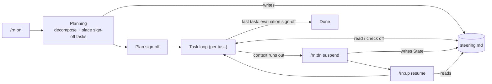
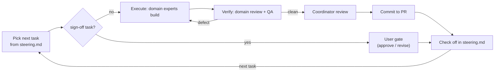

# rn — design notes

Not read at runtime — for whoever maintains the procedures and must judge whether a step is still
right when requirements change. Key ideas and mechanism only.

## 1. Background & Goals

### 1.1 What is the goal?

A piece of real work outlives any single conversation: context runs out, `/clear` wipes the thread,
days pass. `rn` keeps the durable state on disk — `steering.md` + git + the PR, never the agent's
memory — and a coordinator drives fresh expert subagents through the work one task at a time, so a
cold agent can resume purely by re-reading `steering.md`. This session extends that goal one layer
further: `rn` itself keeps changing its own conventions (the question-driven `design.md` contract, the
existing-design-update branch, and version tracking are this session's own additions), so a session's
`steering.md` / `design.md` / tasks, authored under an older `rn` version, must catch up to the
currently installed one automatically — without the user having to notice the drift or ask for it.
This session adds a further layer on top: `rn` should be improvable from how its own sessions actually
ran, using the Claude Code conversation log as evidence instead of memory or hand correlation. That
needs two things `rn` does not yet have — a boundary marker that says where one task's work ends and
the next begins inside a session's JSONL, and a retrospective that turns friction actually observed in
that log into improvement proposals rather than impressions.

### 1.2 What goes wrong without this?

Without durable on-disk state: context loss silently drops in-flight decisions, and a resumed
conversation has no reliable way to reconstruct what was agreed. Without a decision-driven design
template: a `design.md` section can be silently dropped when it "has nothing to record," so a reader
can't tell whether a question was actually considered and rejected or simply never asked. Without an
existing-design-update branch: planning either duplicates a `design.md` that already covers the area,
or has nothing telling it how to update one instead of authoring fresh — this session hit that gap
directly, since `rn/docs/design.md` (this document) already existed and needed updating. Without
version tracking: a session started under an older `rn` keeps running against stale conventions
indefinitely — the gap between what a session's artifacts assume and what the installed plugin now
requires only widens, and nothing ever notices or closes it. Without a task boundary in the log: one
task's own stretch of work cannot be told apart from the tasks either side of it without correlating
`git log` timestamps against the JSONL by hand — the exact gap task #1 measured. Without a retrospective
built on top of that boundary: friction that recurs across a session, or across sessions, is never
turned into anything, because nobody re-reads old JSONL files looking for it, and asking for a proposal
after every task would make the retrospective a tax nobody wants to pay (steering.md's own Goal draws
this line explicitly).

### 1.3 What does reaching it require?

The standing mechanism: a durable `steering.md` forward contract, a coordinator/expert split, and the
planning / execute / verify procedures with a fixed three-gate rule (plan / design / evaluation).
Layered on by this session: a `design-template.md` that forces a decision-plus-reasoning answer on
every h3 question, never a silent drop (4.4); a `planning-workflow.md` branch that checks for an
existing covering `design.md` before defaulting to a fresh path (4.5); an `Rn version:` stamp on every
`steering.md`, set once at creation from the installed plugin version; a `migration-workflow.md` that
reconciles `steering.md`, then `design.md`, then remaining tasks against current convention on a
version mismatch; and a one-line version check wired into each of the five command skills
(`on`/`dn`/`up`/`ty`/`gm`) that triggers it (4.6). Layered on further by this session: a task-boundary
marker, restamped continuously by a plugin hook rather than emitted as two remembered events, so a
task's interval in the log is read off as a changepoint rather than tracked by the coordinator (4.7); a
collection stage that turns each interval's trace-backed friction into an append-only record at every
`/rn:dn`, at no cost to the user when there is nothing to record (4.8); and a stocktake stage, invoked by
the user, that proposes only friction recurring across intervals and files it as an issue only on
explicit approval (4.9).

### 1.4 What is out of scope?

No mass, one-time migration of past sessions — reconciliation triggers only going forward, on a
version mismatch a command actually encounters; a session that never hits a mismatch is never touched.
No semver-range or CHANGELOG-driven migration logic — the version check is plain string equality, and
reconciliation always compares the current artifact against the currently installed template, never
against a delta keyed to which version a session started from. Cutting an actual `rn` release (version
bump + finalizing `CHANGELOG.md`) is a separate, explicit follow-up instruction per `plugin.md`'s
release procedure, not part of this design. No retroactive marking of conversation history already on
disk: the marker only exists in entries written after `rn` starts emitting it, so task #8 demonstrates
the mechanism on this session's own later tasks, not by reaching backward into the conversations task #1
already measured. No machine-wide, unbounded log search: locating a session's own record is bounded to
its own working directory's project directory plus, when running inside a worktree, the parent
checkout's project directory that relocation is measured to target (4.7) — not a scan of every project
directory on the machine. No cross-repository correlation: a friction fact belongs to the repository
whose `.rn/friction.md` records it (2.2, 4.8).

## 2. Assumptions & Constraints

### 2.1 What do we take as true?

`steering.md` + git + the PR is durable and the agent's own memory is not — a cold agent resuming from
`steering.md` alone is assumed sufficient, and `steering.md` stays small enough to re-read in full each
time. This session adds three narrower assumptions: aiya's design.md structure
(https://github.com/lovaizu/ccpm/blob/feature/smith-plugin/aiya/docs/design.md), once its
Conductor/CCS/Turn-specific content is stripped, generalizes to arbitrary `rn` sessions — validated
here only against this document, not against a wide sample of past session design docs. The version
check needs only plain string equality between the recorded and installed plugin version, since it
only answers "has anything changed," never "by how much" — no ordering or semver-range logic is
needed. `migration-workflow.md` runs with no user gate; an occasional wrong reconciliation is an
accepted risk, caught through normal PR/git-log review rather than a live approval step (per
`push-and-review.md`), not through the scheduled sign-off gates.

This session adds a further round of narrower, measured assumptions (task #1's evidence document).
Claude Code files a conversation under the project directory named for the working directory its
conversation started in — separating sibling worktrees of one repository, since each has its own
directory — but not unconditionally: **measured 2026-09-20**, leaving a worktree can relocate that
conversation's file into the *parent checkout's* project directory instead, and 6 of 155 files on this
machine sit under a directory no `cwd` of theirs reproduces, including one of this session's own eight
conversations. The location method this session adds (4.7) treats the working-directory glob as a fast
path and the parent checkout's directory as a second, bounded search target precisely because of this —
never a scan of every project directory on the machine, since relocation is measured to target only
that one further, known location. Only a plugin hook's stdout — channel 6 of task #1's six measured
channels — lands as an entry structurally distinct from ordinary conversation text: its
`attachment.type: "hook_success"` and its `hookEvent` key occur nowhere else across 552 files scanned
machine-wide, while the same string quoted in prose (this document included, once it is read back into
a conversation) reaches the identical field paths the other five channels use. A `PostToolUse` hook on
the coordinator's own tool call lands in the conversation file carrying that call's own `toolUseID`; a
`SubagentStop` hook, or any hook firing while a subagent is running, reaches only the subagent's file; a
`SessionEnd` hook's output is filed nowhere — so this session's marker fires on the coordinator's own
`PostToolUse`, never inside a dispatched subagent and never on `SubagentStop`. A hook can print content
it computes at the moment it fires, by reading a file — demonstrated by three runs each printing
whichever token was on disk at fire time, not a value fixed when the plugin was installed — so this
session's marker relies on the hook reading `steering.md` fresh on every firing rather than on anything
baked in when the plugin was installed. JSONL line order and wall-clock timestamp order disagree, by a
margin this document's own re-runs have never found a ceiling for (808 backward-running pairs
machine-wide, largest 13,429.9 s, still climbing as the corpus grows), so this session's collection
stage (4.8) cuts an interval by line position within each append-only file, never by comparing
timestamps across entries. Two continuation shapes were measured, neither attributable to a particular
invocation flag (`--resume`/`--continue`) from what's on disk: the `sessionKind: "bg"` shape carries
the predecessor's `uuid`-carrying entries into a new file under a new `sessionId`, restamping
`sessionId` on every replayed entry and adding `sessionKind` — only the `.message` content is
byte-identical to the original, not the whole entry, so "verbatim" overstates it — while the other
shape simply appends into the existing file, under its original `sessionId`, after a restart, with
nothing replayed at all. The collection stage deduplicates by `uuid` across a session's own files to
survive the first shape; the second shape has no replayed entry to dedup in the first place, so it
leaves that mechanism unaffected. Finally, **nothing beyond 16-character lowercase hex (channels 1–5) and that
alphabet plus a space and uppercase ASCII (channel 6) has been measured to survive any channel
unaltered** — this session fixes the marker's fields (4.7) but leaves the literal characters joining
them, in particular whatever a session slug's own hyphens or a task description's punctuation need, to
be verified empirically before task #4 finalizes the format string; that gap is a residual risk carried
forward, not something this design invents a false certainty about.

### 2.2 What binds the solution?

The user gates only plan / design / evaluation — never per task, and never on a reconciliation — so
any new mechanism must fit inside that fixed three-gate rule rather than add a fourth (see 4.6, 5.1).
Version tracking and migration reuse only what already exists — `steering.md`'s own header line, git,
the PR — rather than introducing a new state store or service, consistent with `steering.md` staying
the one durable substrate (2.1). `migration-workflow.md` may not read `CHANGELOG.md` or reason about
version ranges — every comparison is current-artifact-vs-current-template, regardless of which version
a session started from, so there is no per-version bookkeeping to maintain as `rn` keeps changing.

This session binds three further constraints. The friction store reuses git as its durability
mechanism (`.rn/friction.md`, committed like `steering.md`) rather than introducing a database or
service, consistent with `steering.md` + git + the PR being the one durable substrate (2.1). Neither the
collection stage nor the stocktake stage adds a fourth user gate: collection runs unattended inside the
existing `/rn:dn`, and stocktake is a plain command the user chooses to run, not a stop the coordinator
forces — the fixed three-gate rule (this section, 4.2) still counts only plan / design / evaluation.
Locating a session's own conversation files stays bounded to two directories — the working directory's
own project directory and, inside a worktree, the parent checkout's — rather than a machine-wide scan;
task #1's relocation finding names the parent checkout as the only place a worktree conversation is
ever filed instead, so a bounded, deterministic search covers the measured failure mode without
scanning every project directory on the machine.

## 3. Design overview

### 3.1 What is the core idea, and why does it solve the problem?

Three organizing ideas, with the rest following from them.

**(A) A skill orchestrates; each work-instruction is a fixed spec.** A procedure controls only the
*order* in which work-instructions fire. The detail of each one lives in its own spec, in one place:
*what / why / when* to write a `steering.md`, a `design.md`, or a task → that artifact's template; how a
task is built or verified → its workflow; how a version mismatch is reconciled → `migration-workflow.md`.
From this follow, rather than as separate inventions:

- **Planning, execution, and verification are separate workflows** — each a single work-instruction
  (`planning-workflow`, `task-execute-workflow`, `task-verify-workflow`).
- **A user gate is a sign-off work-instruction the planner places in the task sequence** — not a
  checkpoint hardcoded into execution. Its timing is a planning decision, visible in the task list.
- **Sign-off tasks and any reviewed result share one verdict vocabulary** — `/rn:ty` (approve) and
  `/rn:gm` (revise) cover the plan / design / evaluation gates and any reviewed result; escalation and
  weigh-in questions are answered directly, not through these commands.
- **Authoring guidance lives in templates, not scattered across procedure steps** — where duplicated
  guidance drifts and is hard to keep consistent. This is also why version reconciliation is one
  reference (`migration-workflow.md`) that every command skill cites, rather than reconciliation logic
  copied into each of the five.
- **PR review feedback runs its own, lighter loop** (`pr-feedback-workflow`), separate from the task
  loop. `/rn:gm` with no argument invokes it against the PR's unresolved threads and never resolves one
  itself — resolution is the reviewing author's act on GitHub.

**(B) Experts fit the artifact, and build and review mirror each other.** Experts are chosen per task by
what it produces — **design**, **craft** (coding / writing / visual, per medium), **verification** (test
/ fact-check / dry-run) — with **QA** (does it meet the objective?) across all. The same axes build and
review, so a reviewer shares the builder's viewpoint and fewer defects survive; only the axes a task
needs are spawned, so coverage widens without weight. (Why this over a fixed code-centric trio, and what
else was considered for both ideas, is in section 5.)

**(C) A task boundary is a position in the log, not an event the coordinator has to remember to emit.**
Rather than two events (start, complete) that something has to remember to fire and that an abandoned or
re-done task would need special handling for, a hook restamps the *current* task's own description on
every coordinator tool call; a boundary is simply where that restamped value changes between two
consecutive markers, which the collection stage (4.8) reads off directly. This follows from a channel-6
measurement of its own: emission has to be a hook, since that is the only channel a marker cannot be
confused with a quotation of itself on (2.1), and once emission is the hook's own act rather than
something the coordinator deliberately fires, restamping on every firing costs nothing extra to
implement — the alternative (recognising two specific tool calls as "the" boundary) is the one that
would need bespoke logic (4.7, 5.1). From this follows more than 4.7's own mechanism: because a boundary
is a changepoint in a continuously restamped value rather than a remembered event, the friction record
built on top of it (4.8) is keyable by that same restamped description with no extra bookkeeping of its
own — collection never has to ask "which task was this," it reads the value the hook already put there.
(C) sits at a narrower altitude than (A) and (B) — one mechanism, not an organizing architecture — but
its consequence reaches past its own section.

Together these solve the problem this document opens with: (A) gives every mechanism — including this
session's version tracking and migration — one authoritative place to live and cite, so a cold agent or
a future session never has to re-derive it; (B) means the reviewer of a change (a `design.md` rewrite, a
workflow edit, a skill edit) is drawn from the same axis as whoever built it, so drift in any one
artifact is caught by someone who actually understands that artifact's shape; (C) means a task's own
stretch of the log exists without the coordinator having to remember to mark it, and survives whatever
`/rn:gm` later does to the task list that named it.

### 3.2 What are the pieces, and what is each responsible for?

| Actor | What it is |
|---|---|
| Commands (entry points) | `/rn:on`, `/rn:dn`, `/rn:up` — start, suspend, resume a session; `/rn:ty`, `/rn:gm` — approve or revise whatever is pending (a gate or reviewed result, or, with no argument to `/rn:gm`, the PR's review threads). Each of the five checks the active session's `Rn version:` before proceeding with its own work (4.6). |
| Coordinator (main agent) | The conversation agent that plans, dispatches, reviews, and records. |
| Experts (sub agents) | Chosen per task — design, craft (per medium), verification — with QA across all; the same axes build and review. |
| `steering.md` | The session's forward contract: `Goal` / `Acceptance criteria` / `Assumptions` / `Rules` / `Tasks` / `State`, plus the `Rn version:` and `Design:` header lines. Doc-division rule: requirements & acceptance criteria live here; structure & decisions live in `design.md`; user-facing UX lives in the README — this keeps `steering.md` lean enough to re-read in full every time (2.1). |
| `design.md` | The whole-structure design — this doc, for `rn`'s own work. A session's `design.md` defaults to `.rn/{yyyymmdd}-{slug}/design.md`, but that default is not unconditional: `planning-workflow.md`'s design-location step checks first whether an existing `design.md` already covers the session's work area, and if so points `Design:` at it and treats the work as an update instead of fresh authoring (resolved in 4.5). |
| `migration-workflow.md` | The reconciliation procedure a version mismatch triggers — coordinator-only, no expert spawn (4.6). |
| Task-boundary hook | A plugin `PostToolUse` hook that restamps the session's slug and the current task's description on every coordinator tool call, landing as a structurally discriminable `attachment` entry (4.7). |
| `.rn/friction.md` | The friction store — one append-only, git-tracked file at the repo root, written by the collection stage and read by both it and the stocktake stage (4.8, 4.9). |
| `/rn:sk` | The stocktake command — user-invoked, proposes only friction recurring across intervals, files nothing without approval (4.9). |

The coordinator follows four procedures for the normal session flow, plus a fifth for drift:
**planning-workflow** decomposes the goal into tasks and places the plan / design / evaluation
sign-offs among them; **task-execute-workflow** builds one task; **task-verify-workflow** verifies it;
**pr-feedback-workflow** runs outside the task loop, invoked directly by `/rn:gm` with no argument
against the PR's review threads; **migration-workflow** runs when a command's version check finds a
mismatch, reconciling `steering.md`, then `design.md`, then remaining tasks against current convention,
with no expert spawn and no user gate (4.6).

Every stop for user input while a session is active (its `steering.md` exists and is identified) — asks
and flow-ending reports alike, among them the plan gate, the design / evaluation sign-off gates, an
escalation, `/rn:dn`'s untracked-path confirmation and its suspend report — opens with a
**session-status block** (4.1).

### 3.3 How does work move?

Two loops at two altitudes, plus a version check at the entry of every command.

**Session lifecycle** — a goal driven to *done* across context resets. `/rn:on` runs planning once; the
task loop then runs each task, suspending and resuming across context boundaries. `steering.md` is the
durable spine: planning and `/rn:dn` write it, `/rn:up` and the loop read it. The design and evaluation
sign-offs are tasks placed by planning; the plan sign-off is planning's own closing hand-off. Each of
`on`/`dn`/`up`/`ty`/`gm` also checks the session's `Rn version:` against the installed plugin version
somewhere in its sequence (4.6) — before any task-loop work proceeds.

```mermaid
flowchart LR
  on["/rn:on"] --> plan["Planning<br/>decompose + place sign-off tasks"]
  plan --> psign["Plan sign-off"]
  psign --> loop["Task loop (per task)"]
  loop -->|context runs out| dn["/rn:dn suspend"]
  dn --> up["/rn:up resume"]
  up --> loop
  loop -->|"last task: evaluation sign-off"| done["Done"]

  steer[("steering.md")]
  plan -->|writes| steer
  loop <-->|read / check off| steer
  dn -->|writes State| steer
  up -->|reads| steer
```

**Task loop** — how one task is handled, coordinator-driven (no command). A sign-off task is a user
gate; any other task is built then verified along its domains, with the defect caught in the loop. Only
the shape is here — the steps live in `task-execute-workflow.md` / `task-verify-workflow.md`.

```mermaid
flowchart LR
  pick["Pick next task<br/>from steering.md"] --> kind{"sign-off task?"}
  kind -->|yes| gate["User gate<br/>(approve / revise)"]
  kind -->|no| build["Execute: domain experts build"]
  build --> verify["Verify: domain review + QA"]
  verify -->|defect| build
  verify -->|clean| cr["Coordinator review"]
  cr --> commit["Commit to PR"]
  commit --> off["Check off in steering.md"]
  gate --> off
  off -->|next task| pick
```

**Task-boundary layer** — a third, finer-grained loop that runs underneath both of the above without
changing their shape. The task-boundary hook fires on every coordinator tool call regardless of which
loop is active, restamping the session's slug and whatever task `steering.md` currently shows as
in-progress; so a task's own stretch of the log exists whether that task went through the ordinary
build/verify path or was a sign-off gate, with no separate step for either diagram to carry (4.7).
`/rn:dn`'s existing suspend step gains the collection stage as a silent addition (4.8); a new,
separately-invoked `/rn:sk` command is the only path to a stocktake proposal, mentioned but not run at
the session's own closing report (4.9).

## 4. Detailed design

### 4.1 What does the session-status block guarantee, and how is a breach caught?

Guarantees the user can orient at any stop — what's done, what's being asked, what remains — without
opening `steering.md` themselves, derived fresh from it at emit time, in the user's conversation
language. Its format, and the boundary for stops outside an active session, lives in one reference,
**status-display.md**; every stop point only cites it. A breach (a stop that improvises its own status
format, or omits the block where the boundary requires it) is caught because there is only one place
the format is allowed to be defined — a stop that doesn't match it is visibly inconsistent against that
single reference on review, rather than one of several competing definitions any of which could claim
to be right.

### 4.2 What do the plan / design / evaluation sign-off gates guarantee, and how is a breach caught?

Guarantees the user approves exactly three things — the plan, the design (when unsettled at plan time),
and the final evaluation — and nothing else needs a live stop; per-task quality is instead caught inside
that task's own build/verify chain (`task-execute-workflow.md` / `task-verify-workflow.md`). Each gate
is a sign-off task or hand-off placed by `planning-workflow.md`, taken only through `/rn:ty`/`/rn:gm`'s
explicit user verdict — the commands never infer approval. A breach (proceeding past a gate without a
recorded verdict) is structurally discouraged: `planning-workflow.md`'s persist step states "CRITICAL:
DO NOT proceed without explicit user approval," and `/rn:ty`'s own steps require identifying an
unambiguous pending approval — asking the user to disambiguate rather than guessing — before recording
one.

### 4.3 What does the PR-feedback workflow guarantee, and how is a breach caught?

Guarantees that PR review comments get addressed without disrupting the task loop's own three gates — a
separate, lighter loop, invoked only by `/rn:gm` with no argument. It guarantees every piece of feedback
is acted on, and that thread resolution stays a human act: the workflow replies and revises but never
resolves a thread itself. A breach (the workflow auto-resolving a thread, or dropping feedback) is
visible because resolution is defined as the reviewing author's own GitHub action — a thread resolved
without the author having acted on it is checkable directly on the PR.

### 4.4 What does the question-driven design-doc contract guarantee, and how is a breach caught?

Replaces the old five-section template (Context & constraints / Approach / Structure / Flow / Open
questions), whose per-section guidance allowed "a section with nothing to record" to be dropped
silently — a reader of a `design.md` under that shape could never tell whether a topic was actually
considered and rejected, or simply never asked. The new contract (`design-template.md`) fixes five
sections — Background & Goals / Assumptions & Constraints / Design overview / Detailed design /
Alternatives considered — each with explicit h3 questions, generalized from aiya's design.md (2.1). It
guarantees every h3 question gets a
decision-plus-reasoning answer, including "not applicable" stated with why. A breach — an h3 left
silently blank — is caught because the h3 headings are fixed and enumerable: a reader (or reviewer) can
diff the actual document against the canonical list and see exactly which question has no answer, which
the old shape's free-form sections never made checkable. This document is itself the dogfood case:
every section above and below follows that same contract.

### 4.5 What does the existing-design.md-update branch guarantee, and how is a breach caught?

Before this session, `planning-workflow.md`'s design-location step only knew "author a fresh
`design.md`" or "the session has none" — it had no branch for "an existing `design.md` already covers
this area, update it instead." That gap was live, not hypothetical: this document is `rn`'s own
canonical `design.md`, and this session's own design-location step had to route to it rather than
create a competing one. The closed gap: Step 2 of `planning-workflow.md` now explicitly checks, as a
judgment call on scope overlap (not a mechanical file-existence check), whether an existing `design.md`
already covers the session's work area — this repo/plugin's own canonical `design.md`, or another active
session's overlapping one — before defaulting to the per-session path. If one covers the area, `Design:`
points at it and the work follows `design-template.md`'s "Updating an existing design.md" procedure
(4.4's sibling procedure) instead of fresh authoring.

This same check also settles a question this document previously left open: whether `rn/docs/design.md`
living at `rn/docs/` rather than under a per-session `.rn/` path is a special-cased exception to the
per-session default. It is not — it is the ordinary outcome of this check: this canonical doc already
covers `rn`'s own work area, so any `rn` session (including this one) whose work touches it is
"updating," not authoring fresh. This resolves the prior open question on this point; there is nothing
further to leave open here.

A breach (planning creating a fresh, duplicate `design.md` when an existing one already covers the
area) is caught because it manifests concretely as two overlapping `design.md` files with conflicting
content — visible to whoever reviews the plan or the PR, not merely a latent risk.

### 4.6 What does version-tracking + migration guarantee, and how is a breach caught?

Guarantees that a session's `steering.md` / `design.md` / remaining tasks never permanently drift from
the currently installed `rn` plugin's conventions — the moment any command runs under a newer version
than the one the session was authored under, the drift is reconciled automatically, without the user
noticing the mismatch or asking for a fix. The mechanism: `steering-template.md`'s header carries an
`Rn version:` line, stamped once at creation from the installed plugin's version and never user-edited
afterward; each of the five command skills (`on`/`dn`/`up`/`ty`/`gm`) carries a one-line step comparing
that recorded value against the installed plugin's current version (plain string equality — 2.1); on a
mismatch, the skill runs `migration-workflow.md` before proceeding with its own task-loop work. That
step sits early and unconditionally in every skill's sequence — first in `ty`/`gm`, second in `on`/`dn`
(right after locating or writing `steering.md`), seventh in `up` (after `up`'s own task-state
reconciliation but still before it begins the next task) — none of the five branches around it, so a
normal invocation always reaches it. `migration-workflow.md` reconciles, in order, `steering.md` against
`steering-template.md`, then `design.md` (if any) against `design-template.md`'s update procedure, then
each remaining task against the task-definition-requirements table — steering first because design's
location is read from its `Design:` line, and both before tasks since tasks are the remaining
forward-looking work. Reconciliation commits directly with no user gate (2.2's fixed three-gate rule has
no room for a fourth — see 5.1), then stamps `Rn version:` to the installed version last, so the stamp
only advances once the artifacts it certifies are actually current. `on`'s own version-check step is
structurally a no-op: `on` just stamped that line from the same installed version one step earlier, so
the comparison can never mismatch there — the step exists only so all five skills share one uniform
shape, not because `on` has its own drift to detect. A breach in `migration-workflow.md`'s own judgment
(a wrong reconciliation) is not caught synchronously — no live gate reviews it — but surfaces through
normal PR/git-log review, an accepted trade-off (2.1, 5.2).

### 4.7 What does the task-boundary marker guarantee, and how is a breach caught?

Guarantees that every stretch of the conversation log where the coordinator is actively working under
an `rn` session can be attributed to one task's own description — without relying on any of the five
ordinary emission channels (assistant text, a Bash command or its output, a tool result, a subagent's
final report), none of which task #1 could tell apart from a document or a work order quoting the same
text, and without relying on the session-status block, which appears only at explicit user-facing stops
— the sign-off gates, an escalation, `/rn:dn`'s untracked-path confirmation, its suspend report (3.2) —
never during an ordinary task's build/verify work, where a task boundary actually needs to be read (2.2,
4.1).

The mechanism: a plugin `PostToolUse` hook, registered with no tool restriction so it fires on every
tool call the coordinator makes — measured directly for the `Agent` and `Bash` tools, both landing in
the identical `attachment`/`hook_success` shape, so extending the same hook to the other tools `rn`'s
workflows call (`Read`, `Edit`, `Write`) is an extrapolation from those two rather than something task
#1 ran itself; task #4 should confirm it holds for each tool type before relying on it. On every firing
the hook reads `steering.md` fresh — never a value fixed when the plugin was installed (2.1) — finds the
*current* task (the first task in the Tasks list still carrying an unchecked step; this reuses
`steering.md`'s own checkbox convention rather than adding a field, per 2.2) and prints a fixed-shape
line naming the active session's own slug and that task's description text. The line lands as an
`attachment` entry of `attachment.type: "hook_success"`, the one shape task #1 measured to occur nowhere
else in 552 files scanned machine-wide (2.1) — so this document, `steering.md`, or a future planning
session can name and quote the marker's own format in prose (as this section does) without that
quotation ever being confused with a real emission, which channels 1–5 could not have offered no matter
how the format were chosen.

**Continuous restamping, not two discrete events.** Rather than emitting one marker at task start and
another at task completion, the hook restamps the same line on *every* firing while a task stays
current; a task boundary is simply the line in the log where the restamped description changes between
two consecutive markers, which the collection stage (4.8) reads off directly rather than being told
"start" or "complete" by name. This directly answers what happens to a task that is abandoned or
re-done: an abandoned task's markers simply stop appearing once `steering.md` moves past it — there is
no missing "complete" event to notice, because none was ever expected — and a re-done task (steps
reopened under the same heading, or a revision that reintroduces the same work) is restamped again the
same way it was the first time, producing a second, non-contiguous run of the same description text
that the collection stage treats as its own interval rather than merging it into the first. A sign-off
task is covered the same way: `/rn:ty` and `/rn:gm` both read `steering.md` (and, on a version mismatch,
`plugin.json`) before recording a verdict, so at least one coordinator tool call — and hence at least one
restamped marker — occurs even though no expert subagent is dispatched; a sign-off task with genuinely
zero coordinator tool calls would go unmarked, believed not to occur under the current skills but not
itself measured, and named as a residual risk rather than assumed away (5.2).

**Naming the session and the task so the marker survives a revised list.** The marker carries the
session's own slug (the `.rn/{yyyymmdd}-{slug}` name, fixed for the session's lifetime, set once at
`/rn:on`) and the current task's *description text*, never a bare `#N`. `steering.md`'s own Assumptions
already establish why: `/rn:gm` can rewrite or add tasks mid-session, so `#N` at one moment and `#N`
later need not name the same task, and a squashed PR drops the intermediate `steering.md` revisions that
would say what `#N` meant at the time it was written. A description carries its own meaning with no
other file open, which is what the marker (and, by the same reasoning, the friction record in 4.8) needs
to survive a task list that has since moved.

**Locating a session's own markers without a separately minted session-identifying string.** Task #1
measured that the working-directory glob already separates concurrent sessions in the common case — each
worktree of one repository gets its own project directory — so a bare correlation token would only
duplicate work the directory split already does. The gap the glob leaves is relocation: a conversation
can be filed under the *parent checkout's* directory instead once its worktree is left, and that
retargeting is measured to land only there, never at some unrelated directory (2.1). The location method
this session settles on is therefore a two-directory search — the working directory's own project
directory, plus the parent checkout's when running inside a worktree — filtered to the markers naming
this session's own slug, which both picks this session out from any other session's relocated files
sharing that same parent-checkout directory (measured: two different worktrees' stubs can sit side by
side there) and confirms structurally that a candidate file is this session's rather than merely
guessing from its path. Emitting a separate, opaque session-identifying string was considered and
rejected for this (5.1): it would need its own lookup table back to the session it names, which 2.2
rules out as a new state store, and it would still need the two-directory search to find it — the slug
already gives a bounded search something readable to filter on, at no extra cost.

**Breach detection.** A breach (the hook failing to fire for a stretch of coordinator activity — plugin
misconfigured, or disabled, so no markers land for that stretch at all) is caught the same way task #4's
own completion criterion checks it: by grepping for both boundaries of a task that has actually run and
confirming the interval between them holds that task's work. A breach (a marker naming the wrong session
or task, from a bug reading `steering.md`) is visible on direct inspection of the log, because the
marker's own text and the working directory or task actually in progress are stated in the same line. A
quotation of the marker's own format elsewhere — in this document, in `README.md`, in a work
order — is not mistaken for a real emission because the collection stage (4.8) keys off the entry's
structural shape (`attachment.type: "hook_success"` and the hook's own `command`, per task #1's channel-6
discriminator), never a bare substring match; the Verification expert review of tasks #4 and #5 checks
that the implementation actually does so, rather than falling back to a grep that the self-reference
hazard measured to be unsound (2.1).

### 4.8 What does the collection stage guarantee, and how is a breach caught?

Guarantees that friction actually left in the log surfaces without the user doing anything at `/rn:dn`,
and that nothing is invented when there is none.

At every `/rn:dn`, a subagent — never the coordinator itself, so its own context is not spent reading a
JSONL (2.1) — locates this session's own conversation files by 4.7's two-directory method, finds the
task-boundary markers bearing this session's slug within them, and cuts the *whole* session's stretch,
from its own start, into per-task intervals at the points where the restamped description changes —
every run, not only the stretch since the previous one (below). Two ordering rules carried forward from
task #1 govern the cut: intervals
are cut by line position within each append-only file, never by comparing timestamps across entries,
because line order and timestamp order are measured to disagree by an unbounded and still-growing margin
(2.1); and a marker replayed into a later file by the measured `sessionKind: "bg"` continuation shape is
deduplicated by its `uuid` rather than counted as a second occurrence, because that shape carries every
`uuid`-carrying entry of its predecessor forward under the same `uuid`, with only its `.message` content
byte-identical and its `sessionId` restamped (2.1) — the other measured continuation shape, a restart
appending into the existing file, replays nothing, so it leaves this dedup step with nothing to do. A
consequence of 4.7's own residual risk follows directly here, not a new one: a sign-off task with
genuinely zero coordinator tool calls has no marker and so no interval of its own, so any friction from
it (a "revise" verdict, say) would be misattributed to whichever neighboring task's markers bracket that
stretch of the log — believed not to occur, since every sign-off command reads `steering.md` at minimum,
but carried forward as the same unmeasured case 4.7 already names (5.2).

**Ordering the files themselves, before cutting intervals inside any one of them.** A session's own
record commonly spans more than one file — this session alone has seven, or eight counting the one
relocation places outside the working-directory glob (2.1) — so cutting per-task intervals across the
whole session first needs those files placed in order relative to each other, a question distinct from
the within-file line-position rule above. Two cases. A **continuation pair** — one file continuing
another, linked by a `continued-in` entry (2.1; the only instance measured machine-wide, but directional
by construction) — is already known-adjacent and in order regardless of any timestamp: the entry names
predecessor and successor directly, so the predecessor's stretch always precedes its successor's, the
same ordering the dedup rule above already relies on to treat a replayed marker's original as preceding
its copy. Files with **no continuation link between them** — independent conversations within the same
session, for instance either side of a `/clear` or a fresh start — are ordered instead by each file's own
first *timestamped* entry, never by comparing timestamps across entries within a stream, which the rule
above already distrusts for the measured, unbounded inversions of 2.1: comparing which file as a whole
started earlier is a coarser, whole-file comparison, not a per-entry one, so it does not inherit that
specific failure mode. This file-start rule is a reasoned choice, not a measured one — task #1 measured
cross-entry inversion within a file, not cross-file start-time reliability directly — and one part of the
evidence does bear on it: a file can carry no timestamped entry at all for a stretch of its own early
life (measured: a 10-entry, no-timestamp file grew into a 296-entry conversation, and a separate,
single-entry file carries no timestamp whatsoever), so a file-start comparison taken as a snapshot
mid-session can find a newer file with nothing yet to compare. A second, sharper failure mode exists even
once both files do have a timestamped entry to compare: a file that in truth starts first can carry a
long stretch of leading, untimestamped bookkeeping entries (measured to exist, above) before its own
first timestamped entry, while a file that in truth starts later reaches its own first timestamped entry
sooner — comparing by first-timestamped-entry alone then ranks the later file ahead of the earlier one,
inverting the true start order even though both files had a timestamp available to compare, a
correctness risk rather than only a completeness one. Both are carried forward as residual risks
alongside the others this section already names, not assumed away.

**The bar for a friction fact worth recording** is a citable trace: a specific JSONL entry (or entries)
the fact points at — a tool call that errored and had to be retried, an expert review verdict of
"revise" together with the defect it names, an explicit user correction that changed already-built work,
a workaround the coordinator had to invent because a documented step did not hold. A fact resting only
on the collecting subagent's own impression, with no entry to point at, is not recorded, even where that
impression might have been right — this is what "friction that actually left a trace" (steering.md's own
Goal wording) cashes out to, and it is what makes task #5's own completion criterion ("a record with no
citable trace is not producible") a property of the procedure rather than a matter of subagent judgment.
An interval with no traceable friction yields no record at all — the empty outcome is the normal path,
not a shortfall to explain.

**Finding where the previous run left off.** The collection stage is idempotent rather than
watermarked: every `/rn:dn` re-scans the session's entries from its own start, and a fact is appended
only if no existing entry in `.rn/friction.md` already carries the same dedup key — the source entry's
`uuid` when it has one, the file-and-line pair otherwise (below), never a fragment-text compare — so
re-scanning an interval a previous run already covered costs a re-read, never a duplicate record
regardless of how a re-scan's own extraction happens to word the fact, and regardless of which replayed
copy of the same underlying entry (2.1, 4.7) a re-scan happens to draw its citation from. This was chosen
over storing an explicit watermark (a line in `steering.md`'s own State section, or a marker appended to
`.rn/friction.md` itself naming the last-processed position) for two reasons that follow from this
design's own existing constraints rather than a fresh judgment call: 2.2 already binds this design
against introducing a new state store, and a watermark is exactly one more position to keep
synchronized; and `steering.md`'s own doc-division rule keeps it a lean forward contract, not an
archive, so stamping progress onto it on every `/rn:dn` is the kind of growth that rule exists to
prevent. A watermark is also unreliable exactly when it would matter most: 4.8's own rule that an
interval with no friction yields no record at all means a friction-keyed watermark can be silently
absent right after the session's most uneventful stretch — the one case a second-or-later run most
needs to know where the previous one stopped. Re-scanning trades a bigger read (the whole session, not
one interval) for no new durable state, and that read is already paid by a subagent dispatched
precisely so it never touches the coordinator's own context (2.1, above).

**Where facts are stored, and their shape.** `.rn/friction.md`, one file at the repo root — a sibling to
the per-session `.rn/{yyyymmdd}-{slug}/` directories, not nested inside any one of them, because
friction is meant to be compared across the tasks of a session and across sessions over time, and a
per-session location would scatter exactly what a later stocktake needs gathered. Git-tracked, reusing
`steering.md` + git + the PR as the one durable substrate (2.1, 2.2) rather than adding a new store. One
entry per friction fact, appended, never rewritten by collection, each carrying: the date; the session's
slug and the task's description text as they read at the time (never `#N`, for the same reason as the
marker in 4.7 — a fact recorded against `#N` would be unreadable once `/rn:gm` moves the list under it);
the friction itself, in a sentence or two; the JSONL citation it traces to — file and line, which is
available in literally every case the collection stage would ever cite, since every entry it could point
at sits in an append-only file and so has a stable line position once written (2.1's own
liveness/append-only measurement), plus the source entry's own `uuid` when it carries one; a short quoted
fragment may sit alongside either for readability, but is only ever a supplement, never a substitute. The
dedup key above is that `uuid` when the source entry has one, the file-and-line pair otherwise, never a
fragment-text compare — the same fix 4.7 already applies to the task-boundary marker, and for the same
reason: the measured `sessionKind: "bg"` continuation shape replays a `uuid`-carrying entry into a
successor file at a different line (2.1), so file-and-line alone would see the predecessor's and the
successor's copies as two distinct citations, where `uuid`-based dedup correctly treats them as one. The
fallback to file-and-line loses nothing in practice: every entry the citable-trace bar above can point at
— a tool call, a review verdict, a user correction, a workaround — is one of the message-type entries
task #1 measured to carry a `uuid`; an entry with none is the uuid-less, bookkeeping kind (`mode`,
`cost-state`, and similar, 2.1) that a continuation drops rather than replays, with one measured exception
(`file-history-snapshot`) that this bar never cites either — so a re-scan paraphrasing the same fragment
differently still can never itself produce a second record — and a status field, defaulting to unfiled,
that the stocktake stage (4.9) flips once a
cluster built from this fact becomes an approved issue — without it, a fact already acted on would look
"recurring" again on every later run, since the store is never pruned. Markdown, matching `steering.md`
and `design.md`, so the user can open and read it directly with no tooling of its own.

**Breach detection.** A breach (a recorded fact with no citation field) is visibly non-conformant against
the shape just fixed, on a plain read of `.rn/friction.md`. A breach (the coordinator's own context spent
reading a JSONL, rather than a subagent's) is checkable because a subagent dispatch, not a coordinator
tool call, is what the transcript shows around each `/rn:dn`. That an interval with no friction leaves
nothing behind, and that `/rn:dn` asks no question and adds no output for it, is exactly task #5's own
completion criteria and is checked there.

### 4.9 What does the stocktake stage guarantee, and how is a breach caught?

Guarantees that the user, and only the user, decides when accumulated friction becomes a proposal, that
a proposal is shown only for friction seen more than once, and that nothing is filed as an issue without
that user's explicit approval for it.

**Command and call sites.** `/rn:sk` — two letters, matching the plugin's existing `on`/`dn`/`up`/`ty`/`gm`
naming, mnemonic for "stock[take]." A longer, self-explanatory name (`/rn:stocktake`, `/rn:review`) was
considered and rejected for the same reason the existing five stayed two letters: consistency with a
command surface the user already has to remember wins over any one command being self-explanatory in
isolation. It runs only on: (1) explicit user invocation, at any time, which is
the only call site that actually runs it — matching steering.md's own Goal wording that the user invokes
stocktake "at exactly one point of their own choosing"; and (2) a one-line mention, not a run, in the
closing report once a session reaches its evaluation sign-off and can close (the same closing report
`/rn:ty`'s own steps already open with the session-status block, 4.1) — naming `/rn:sk` as available at
the moment the user is most likely to want it, without spending their choice for them. Wiring stocktake
into `/rn:dn` itself, the third candidate call site, was considered and rejected: `/rn:dn` already
carries the collection stage (4.8), and the session's own Acceptance criteria fix that suspending "costs
the user nothing extra — no question, no added output"; running the recurrence check and proposal flow
at every suspend would reintroduce exactly the per-suspend tax the two-stage split (steering.md's Goal)
exists to avoid.

**Mechanism.** The command reads `.rn/friction.md`, and the coordinator — not a fixed keyword or string
match — reads all of its unfiled facts and groups them against a stated equivalence test: two facts
belong to the same group when one could be rewritten as a restatement of the other without losing or
adding information — concretely: group A and B only when telling the user about A alone, or B alone,
would be an accurate but incomplete account of the same underlying friction, not when they are two
distinct frictions worth reporting separately even though related. The test targets the friction itself,
not the task it happened in or the wording it was recorded with, which is what lets two differently-worded
facts from different tasks or sessions cluster at all. Applying the test is still a judgment call, of the
same kind 4.5 already accepts for scope overlap between design docs — the coordinator, not a mechanical
rule, decides whether the two facts are actually restatements of one underlying friction or two separate
ones — but it is a judgment call guided by a stated test, not an unconstrained one. An
exact or keyword match on the friction text was considered and rejected for this: two facts about the
same underlying issue, worded differently across tasks or sessions, would never cluster under it,
silently under-reporting exactly the recurrence this stage exists to surface. Grouping is not by which
session or task recorded a fact, since the same underlying friction can recur under different task
descriptions in different sessions. Only a group with more than one member is surfaced (steering.md's own
Acceptance criteria: "friction it has seen more than once"), each with every fact in the group attached,
citations included, so a proposal is never shown without the material it rests on. For each surfaced
group the coordinator proposes one improvement and takes the user's verdict through `/rn:ty` (approve →
file the group as one GitHub issue) or `/rn:gm` (revise → the coordinator either re-clusters the group
differently or drops the proposal, per the user's feedback) — the same verdict vocabulary 3.1(A) already
gives every reviewed result, not a third channel: a stocktake proposal (the coordinator builds it,
presents it, and gets an approve/decline verdict on it) is structurally exactly that — a reviewed
result — not an escalation, which 5.1 ties to a change in the *agreed plan*, and not a weigh-in question,
which is an ad hoc query mid-task; stocktake is neither. Unlike the plan gate, which always has a
`steering.md` just written underneath it (3.3), a standalone `/rn:sk` run may have no active session — no
`steering.md` — at all: `/rn:sk` itself carries no version check of its own — 4.6
names only `on`/`dn`/`up`/`ty`/`gm` as the five skills that carry one — but a stocktake verdict is taken
through `/rn:ty`/`/rn:gm`, and their own version-check step (4.6) is written against "the active
session's `Rn version:`," something a standalone stocktake run need not have identified; and their
advance step (4.2, 3.2) enumerates only a plan/design/evaluation gate proceeding or a reviewed item
standing as final, neither of which is "file the group as an issue" or "return to re-cluster." Both gaps
are this decision's own scope extension of the two commands, stated plainly rather than assumed already
covered — task #6, which implements `/rn:sk`, carries the matching change into `ty`'s and `gm`'s own
skill steps. An approved proposal becomes a GitHub issue, and
a revised or otherwise unresolved group stays in `.rn/friction.md`, unfiled, until it recurs further, is
re-clustered successfully, or the user acts on it directly. A group of one is never proposed, and a run
that finds no recurring group reports that plainly rather than manufacturing one (task #6's own
completion criterion). Once a group's proposal is approved and filed, every fact in that group has its
status field (4.8) flipped so the same pattern is not re-proposed on a later run — necessary precisely
because `.rn/friction.md` is never pruned.

**Breach detection.** A breach (an issue filed with no matching approved proposal in the conversation
transcript) is checkable directly on GitHub, against `.rn/friction.md`'s status field for the facts it
claims to close. A breach (a proposal shown for a group of size one, or without its supporting facts) is
checkable
by re-reading `.rn/friction.md` itself — the same store the command reads and the user can open, so
nothing the command surfaces rests on material only the command itself can see. A missed clustering (two
facts about the same friction the coordinator's judgment failed to group) is not caught synchronously —
nothing flags it at the run that missed it — but is not permanently lost either: the underlying friction
persists and keeps generating its own trace, so it eventually reappears as its own future fact, and a
later stocktake run gets another chance to cluster it; a false negative here costs delay, not loss.

## 5. Alternatives considered

### 5.1 Why this shape, and not another?

The standing decisions these build on:

- **Coordinator / expert split** — over one agent that builds *and* reviews its own work, which is not
  independent.
- **steering.md is a lean forward contract** — heavy content lives elsewhere (rationale → `design.md`,
  UX → `README`, history → git + PR). Never stored, so it can't drift or grow into an archive.
- **Quality built into each task** — over a final inspection: a defect is caught at the task that
  introduced it.
- **The user gates only plan / design / evaluation** — each evaluating one thing: plan → `steering.md`,
  design → `design.md`, evaluation → the end results (the Acceptance-criteria run and the task checks).
  The design and evaluation gates are sign-off tasks; the plan gate is planning's own closing hand-off,
  since a plan can't carry a task that approves itself. Over a gate on every task, which is ceremony
  where no decision is waiting. Escalation is a separate, always-open channel for anything that changes
  the agreed plan or design. This is also why `migration-workflow.md`'s reconciliation gets no gate of
  its own (4.6): adding a fourth gate for a mechanical, potentially-frequent procedure would break this
  fixed count.
- **Design / craft / verification / QA over a fixed code-centric trio** (language / software-engineering)
  — the fixed trio neither fits prose, prompts, or slides, nor mirrors what was actually built; choosing
  experts per task by what it produces, with the same axes building and reviewing, means a reviewer
  shares the builder's viewpoint and only the axes a task needs are spawned.
- **The question-driven `design.md` contract (4.4) over the old free-form five-section template** — the
  old shape let a section with "nothing to record" be dropped silently; forcing a decision-plus-reasoning
  answer to a fixed, enumerable set of h3 questions (including "not applicable, because...") makes an
  omission checkable instead of invisible.
- **A plain string-equality version check + current-vs-current reconciliation (4.6) over semver-range or
  CHANGELOG-driven migration** — the question this system needs answered is only "has anything changed,"
  never "by how much" or "what changed between these two specific versions"; range logic would add
  bookkeeping (a per-version delta table) that current-vs-current comparison never needs, since
  `migration-workflow.md` always reconciles against whatever is currently installed regardless of the
  session's starting version.
- **No one-time mass migration of past sessions** — reconciliation triggers per-session, only on an
  actual version mismatch a command encounters going forward; migrating every past session's
  `steering.md`/`design.md` immediately would touch dormant sessions nobody is actively working, for no
  benefit over reconciling lazily if and when a command next touches them.
- **A structurally-discriminable hook (channel 6) over any of channels 1–5 for the marker's emission** —
  assistant text, a Bash command or its output, and a tool result all land at field paths a document, a
  work order, or this very design doc can also land text in, with no field-path or entry-type test
  separating a real emission from a quotation (measured machine-wide: `hookEvent` occurs as a JSON key
  only inside a hook attachment across 552 files, 0 false positives, against 65 false positives for a
  plain substring match on the same word). Channel 5 specifically — a subagent's final report, the
  channel `rn` would otherwise reach for first — was measured separately unreliable regardless of the
  discriminator question: real handoff latency ranges 14 ms to 37.4 s, bounded by the coordinator's own
  turn length rather than anything the channel itself bounds; on top of the 316 handoffs that do land as
  a `<task-notification>` entry, a further 142 task ids on this machine are enqueued and then removed
  again without ever reaching one at all; and a delivered report is entity-escaped and, when it trips
  the `marker-prefix-forgery` pattern (fired twice on this machine already, on exactly the shape a
  task-boundary marker has by construction), irreversibly rewritten.
- **Continuous restamping of the current task's description (4.7) over two discrete start/complete
  events** — a discrete pair needs the hook to recognise *which* tool call is the boundary (for example,
  the specific `steering.md` edit that checks a task off), a content-matching problem no channel-6
  measurement covers, and it would still need bespoke handling for a task that is abandoned mid-way (no
  completion marker is ever emitted for it) or re-done (a second start marker for the same task needs its
  own rule). Reading the current task fresh from `steering.md` on every `PostToolUse` needs neither: an
  abandoned task simply stops being restamped once `steering.md` moves past it, and a re-done task is
  restamped again exactly the way it was the first time, with no separate code path for either case. The
  cost is volume — a marker per tool call rather than two per task — not correctness (5.2).
- **A self-naming marker plus a bounded two-directory search (4.7) over a separately minted
  session-identifying string or a machine-wide grep** — task #1 measured that the working-directory glob
  already separates concurrent sessions in the common case, so a bare correlation token would duplicate
  work the directory split already does; the gap the glob leaves is relocation, which task #1 also
  measured to always target the worktree's own parent checkout, never an arbitrary directory, so the
  search only needs to widen to that one further, known location rather than to every project directory
  on the machine. Because the marker already has to carry the session's own name to stay self-describing
  (below), that same text is what a bounded substring search over the two directories filters on; a
  separate opaque ID would need its own lookup table back to the session, which 2.2 rules out as a new
  state store.
- **The task's description text, not `#N`, as what the marker (4.7) and the friction record (4.8) name**
  — steering.md's own Assumptions already establish that a task number is not a stable identifier:
  `/rn:gm` can rewrite or add tasks mid-session, and a squashed PR drops the intermediate `steering.md`
  revisions that would say what `#N` meant at the time. A description carries its own meaning with no
  other file open, which is exactly what both need to survive a task list that has since moved.
- **Reading task boundaries off the session-status block was never a candidate to begin with, and stays
  rejected** — the block opens only at explicit user-facing stops (the sign-off gates, an escalation,
  `/rn:dn`'s untracked-path confirmation, its suspend report; 3.2), and an ordinary build task passes
  through none of those, so the block never appears around an ordinary task boundary; there is nothing
  in it to read a boundary off. This alternative was never live to begin with — settled already by this
  design's own fixed three-gate rule (2.2) and 3.2's own list of stop points, not by anything task #1
  measured.

### 5.2 What did we trade away?

Verbosity for rigor in the design-doc contract: every h3 question now demands an explicit
decision-plus-reasoning answer, even a "not applicable" one — a `design.md` under the new contract is
longer and more repetitive than the old shape's terse, sometimes-silent sections, in exchange for never
leaving a reader to guess whether a topic was actually considered. Synchronous safety for throughput in
migration: reconciliation commits with no user gate, so an occasional wrong reconciliation is an
accepted risk rather than a prevented one — caught only through ordinary PR/git-log review, not before
it lands (per `push-and-review.md`). Completeness for cost in version tracking: not migrating past,
already-closed sessions means some older `steering.md`/`design.md` pairs may carry stale conventions
indefinitely if no command ever runs against them again — accepted because those sessions are done, and
reconciling them would spend effort on work nobody is resuming.

Volume for uniformity in the marker: restamping on every `PostToolUse` writes far more log entries than
two events per task would, in exchange for never having to special-case an abandoned or re-done task. A
small residual risk is carried rather than resolved: the marker's literal join characters beyond the
tested hex/space/uppercase alphabet are left to task #4 to verify, not decided here (2.1), and a sign-off
task that happens to involve zero coordinator tool calls would go unmarked — believed not to occur, since
every sign-off command reads `steering.md` at minimum, but not itself measured (4.7). Which invocation
(`--resume`, `--continue`, or a plain restart) produces which of the two measured continuation shapes is
also not established from what's on disk (2.1) — carried forward as a gap rather than assumed, since the
collection stage's dedup step (4.8) has to hold under either shape regardless of which flag caused it.
Completeness for
simplicity in the friction store: `.rn/friction.md` is never pruned, so a filed pattern needs its own
status field to keep from being re-proposed forever, and a fact whose only trace is the collecting
subagent's own impression is simply not recorded at all, even where that impression might have been
right — the bar is a citable JSONL entry, not the subagent's judgment (4.8). The edge a file-and-line-only
dedup rule would have left open — the measured `sessionKind: "bg"` continuation shape copying a
`uuid`-carrying entry into a second file at a different line (2.1), so the same underlying entry could
carry two distinct file-and-line citations, one per copy — is closed the same way 4.8 already closes it
for the task-boundary marker: the dedup key is the source entry's `uuid` when it has one, file-and-line
otherwise. This holds for every entry the citable-trace bar (4.8) can actually point at — a tool call, a
review verdict, a user correction, a workaround — since each is one of the message-type entries task #1
measured to carry a `uuid`, never one of the uuid-less bookkeeping kinds a continuation drops (2.1); that
the bar's named entry kinds line up with the uuid-carrying set is a reasoned conclusion from those kinds'
own definitions, not a separate machine-wide measurement enumerating every entry type's `uuid` presence.
