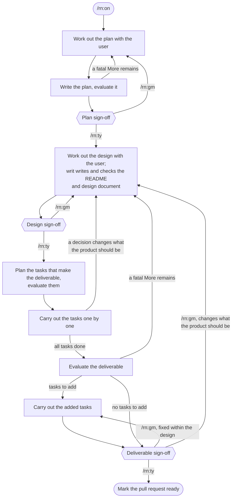
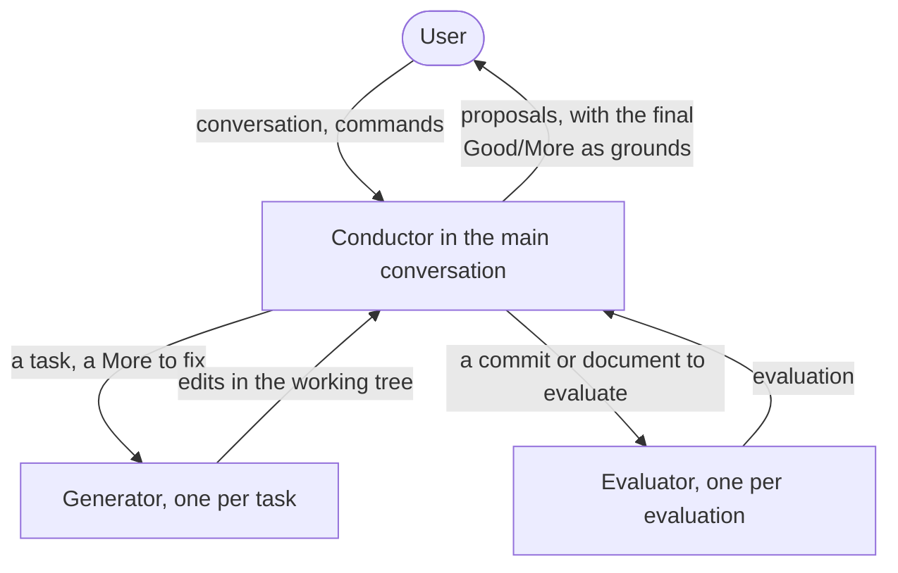
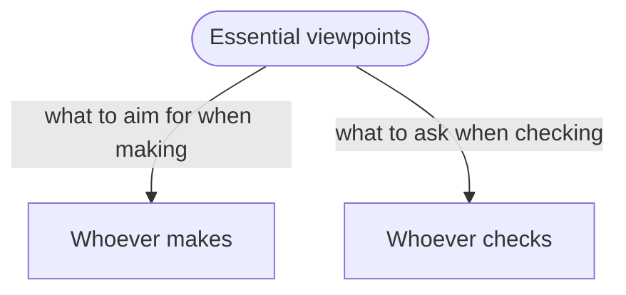
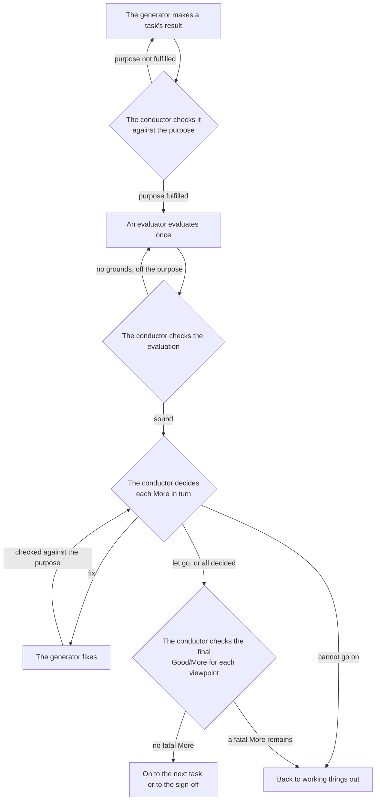
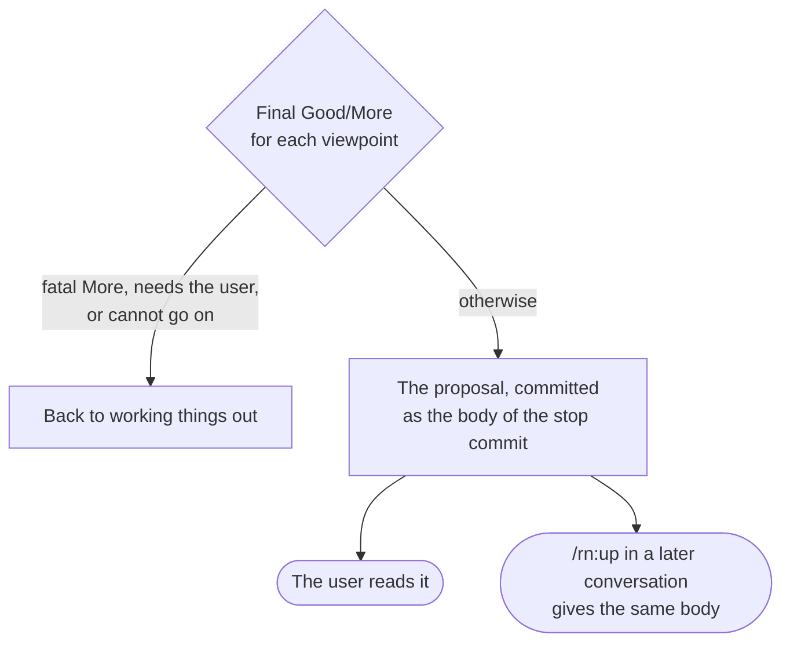
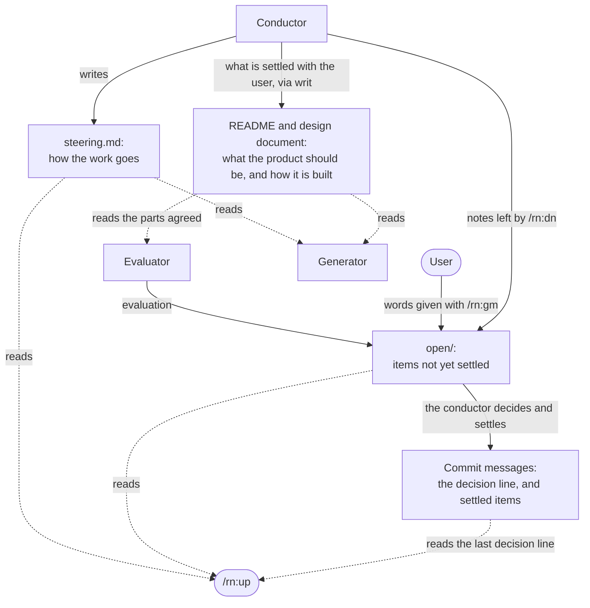

# rn design

## The benefits, and the features that give them

### You get what you really want, without writing a careful prompt first

- [It works out the goal and the design with the user, one point at a time, looking things up as they talk](#it-works-out-the-goal-and-the-design-with-the-user-one-point-at-a-time-looking-things-up-as-they-talk)

    Works in the README's 1. Start and 3. Work out the design.

- [An evaluator that did not make the work checks it once, and the conductor settles the fixes before the user is called](#an-evaluator-that-did-not-make-the-work-checks-it-once-and-the-conductor-settles-the-fixes-before-the-user-is-called)

    Works in 4. Generate and evaluate.

### Your time goes only to the decisions that are yours

- [It calls the user only at three sign-offs, and for decisions only the user can make](#it-calls-the-user-only-at-three-sign-offs-and-for-decisions-only-the-user-can-make)

    Works in 2. Approve or give feedback, and 4. Generate and evaluate.

- [An evaluator that did not make the work checks it once, and the conductor settles the fixes before the user is called](#an-evaluator-that-did-not-make-the-work-checks-it-once-and-the-conductor-settles-the-fixes-before-the-user-is-called)

    Works in 4. Generate and evaluate.

- [A sign-off comes with what rn proposes next, grounded in the final Good and More for every essential viewpoint](#a-sign-off-comes-with-what-rn-proposes-next-grounded-in-the-final-good-and-more-for-every-essential-viewpoint)

    Works in 2. Approve or give feedback, and 6. Finish.

### Work that takes days goes on the next day, or in a fresh conversation, from where it stopped

- [Everything decided is pushed to the branch as it is decided, so any conversation takes the session up](#everything-decided-is-pushed-to-the-branch-as-it-is-decided-so-any-conversation-takes-the-session-up)

    Works in 5. Pause and resume.

## Who does what, and what holds throughout

Who is who: the conductor is the main conversation with the user, the one that decides every next
move. A generator makes one task's result. An evaluator checks one thing, answering each essential
viewpoint (a question the thing must answer yes to, kept in `references/essentials.md`) with Good,
what serves it, and More, what falls short.

The whole session, from the inside:


```mermaid
flowchart TD
    ON(["/rn:on"])
    W["Work out the plan with the user"]
    P["Write the plan, evaluate it"]
    PS{{"Plan sign-off"}}
    D["Work out the design with the user;<br/>writ writes and checks the README<br/>and design document"]
    DS{{"Design sign-off"}}
    P2["Plan the tasks that make the deliverable,<br/>evaluate them"]
    T["Carry out the tasks one by one"]
    EV["Evaluate the deliverable"]
    T2["Carry out the added tasks"]
    FS{{"Deliverable sign-off"}}
    END(["Mark the pull request ready"])
    ON --> W --> P --> PS
    P -->|"a fatal More remains"| W
    PS -->|"/rn:gm"| W
    PS -->|"/rn:ty"| D
    D --> DS
    DS -->|"/rn:gm"| D
    DS -->|"/rn:ty"| P2
    P2 --> T
    T -->|"a decision changes what<br/>the product should be"| D
    T -->|"all tasks done"| EV
    EV -->|"tasks to add"| T2
    EV -->|"a fatal More remains"| D
    T2 --> FS
    EV -->|"no tasks to add"| FS
    FS -->|"/rn:gm, fixed within the design"| T2
    FS -->|"/rn:gm, changes what<br/>the product should be"| D
    FS -->|"/rn:ty"| END
```

Five policies hold across the features:

- Only the conductor decides what happens next. An evaluator sees only the thing, so fixes decided
  by its words would rebuild what already serves the goal, and the user would not get what they
  wanted.
- Only the conductor uses git. A commit records a decision, so one made by anyone else would record
  a decision nobody made, and a later conversation would go on from it.
- Everything is made to essential viewpoints and checked with the same ones, and `rn` is improved by
  sharpening them, not by adding steps. Steps miss the mark in situations they did not foresee, and
  the user gets work that followed them instead of work that serves the goal.
- Documents lead the work and hold only what holds now. A decision kept only in a conversation is
  lost when it is cleared, and history left in a document buries what holds now, so either way the
  user explains again what was already decided.
- `rn` decides what goes into the README and design document; `writ`, a plugin `rn` depends on,
  writes and checks them. Their viewpoints then live in one place, so the documents the user
  approves read as well as any `writ` writes, and improving `writ` improves them.

## It works out the goal and the design with the user, one point at a time, looking things up as they talk

The conductor works out the plan before anything else, because a plan built on the user's first
words achieves what they said, not what they wanted. It looks things up while talking instead of
finishing the research before asking, since the user's answers change where to look. What the
repository, official documentation, or best practice can answer is looked up, not asked. The plan
has its own sign-off, because a design worked out on a wrong goal is wasted.

The design is worked out the same way, with what to test and what passes. What is settled goes to
`writ`, which writes it into the README and design document and returns the final Good and More for
its viewpoints, for the Design sign-off. There is always a Design sign-off, even when the design
document does not change, because a mismatch found only after it is built costs a lot of rework.
Tasks that make the deliverable are planned only once the design is settled; tasks planned before
the design would mostly be rewritten once it is.

After feedback at a sign-off, the session goes back to before it: a plan or a design is worked out
again with the user, taking the mismatch behind the feedback as the first point, since fixing only
what the words say leaves the mismatch in place. Feedback on the deliverable that changes what the
product should be goes back to working out the design, through a Design sign-off, since the README
and design document are what the user approved the product to be.

## It calls the user only at three sign-offs, and for decisions only the user can make

The user is asked only what only the user can decide: taste, scope, effort against safety, whether to
wait for someone outside, what the product should be, another way when fixes keep falling short, and
whether the deliverable achieves the goal. Everything else is looked up or decided from the goal. The
more the user is asked, the less they can leave the work to `rn`.

Whenever `rn` calls the user, at a question or a sign-off, it comes with what it proposes to do next
toward the goal, and why, so the user only says yes or no. A report of where things stand would
leave the user to work out what to do next, which is the work they left to `rn`.

A question is put so the user can answer it on the spot. When the work waits on someone outside,
what to do meanwhile is such a question, not a stop: a stop leaves the user unsure what `rn` is
waiting for.

Approving and giving feedback each stop, since that is where the user may clear the conversation.

Once approved, the goal, the README, and the design document go back through their sign-off only
when what the product should be, or how it is built, changes without the user having decided it.
Two kinds of change are written without stopping: a correction that changes neither, such as a line
number gone stale, and a change the user made by answering a question. The next proposal shows
them first, as changed since the last approval. Stopping for them would spend the user's attention
on nothing to decide; leaving them out would have the user approve something other than what they
read.

## An evaluator that did not make the work checks it once, and the conductor settles the fixes before the user is called


```mermaid
flowchart TD
    U(["User"])
    C["Conductor in the main conversation"]
    G["Generator, one per task"]
    E["Evaluator, one per evaluation"]
    U -->|"conversation, commands"| C
    C -->|"proposals, with the final<br/>Good/More as grounds"| U
    C -->|"a task, a More to fix"| G
    G -->|"edits in the working tree"| C
    C -->|"a commit or document to evaluate"| E
    E -->|"evaluation"| C
```

The conductor is the main conversation with the user, the same one throughout the session, since
what was talked through stays with it. A generator is started for each task, and an evaluator for each evaluation; each ends when done. A
generator edits the working tree and returns; the conductor checks the result against the task's
purpose, commits, and has it evaluated.

An evaluator receives only what the user agreed to and what the user said, never how the thing was
made or what it was changed to answer. Whoever made it reads it along their own reasons. Someone who
did not make it, reading from the user's side, sees where the user will struggle. Every role is
handed the paths of what it reads, never a summary of them: a summary carries the summarizer's
reading, and the role would work from that instead of the thing.


```mermaid
flowchart TD
    E(["Essential viewpoints"])
    M["Whoever makes"]
    V["Whoever checks"]
    E -->|"what to aim for when making"| M
    E -->|"what to ask when checking"| V
```

Everything `rn` makes, such as a plan or a task's result, has a purpose, stated as what whoever
receives it can then do. For a plan, that is "can the conductor carry the work to the goal by it",
not "does it list tasks". Whether it was done can be met by following steps;
whether it serves its purpose can be answered only by looking at the real thing. Making and
checking read the same file of viewpoints, so they do not drift apart.

Only whoever checks answers, with Good and More of the same weight. Both point to a place in the real
thing and say why. A Good adds what the user gains from it, which a fix must not take away; a More adds what the user will
struggle with because of it. How to fix it is left to the conductor: a fix written into the
evaluation would pull that decision toward the evaluator's first idea.


```mermaid
flowchart TD
    M["The generator makes a task's result"]
    K{"The conductor checks it<br/>against the purpose"}
    V["An evaluator evaluates once"]
    KE{"The conductor checks the evaluation"}
    D{"The conductor decides<br/>each More in turn"}
    F["The generator fixes"]
    J{"The conductor checks the final<br/>Good/More for each viewpoint"}
    N["On to the next task,<br/>or to the sign-off"]
    U["Back to working things out"]
    M --> K
    K -->|"purpose not fulfilled"| M
    K -->|"purpose fulfilled"| V
    V --> KE
    KE -->|"no grounds, off the purpose"| V
    KE -->|"sound"| D
    D -->|"fix"| F
    F -->|"checked against the purpose"| D
    D -->|"let go, or all decided"| J
    D -->|"cannot go on"| U
    J -->|"no fatal More"| N
    J -->|"a fatal More remains"| U
```

Each Good's grounds are checked as a More's are, since a wrong Good has the fix keep what should
change.

From there the conductor and the generator repeat the fixing, one More at a time:

- A More whose fix brings the work closer to its purpose, and keeps the Goods, is fixed.
- A More whose fix would not bring it closer is let go, with the reason. Its cost, or that the fix
  needs the README, the design document, or the user, is never that reason.

Because the conductor decides, the repetition always ends as either "settled" or "cannot go on".
It cannot go on when the same More keeps coming back, when each fix brings a new More, or when a fix
needs the README or the design document changed.

Fixes after the evaluation are checked by the conductor against the purpose, not by a fresh
evaluator. Evaluations are not repeated, because evaluating with AI alone keeps raising points that are not essential and
never settles. The user can check every final Good and More at its place, and ask for another
evaluation with `/rn:gm`.

When Mores contradict each other, `rn` does not pick one. They are a sign that something is
undecided in the goal, the essential viewpoints, or a document, so that is what gets decided.

A plan follows the same flow, with the conductor, not a generator, making and fixing it. The whole deliverable is evaluated once, when the tasks planned after the last Design sign-off
are done.

## A sign-off comes with what rn proposes next, grounded in the final Good and More for every essential viewpoint

When every More is decided, the conductor checks the final Good and More for each question of the
essential viewpoints. A fatal More is one without which the goal cannot be achieved, and whose fix
the goal does not determine. The work goes back to working things out, with that More as the first
point, instead of to the sign-off, when:

- a fatal More remains,
- a More needs the user to decide, or
- the work cannot go on.

Having the user approve something that is no use until fixed only spends their time.


```mermaid
flowchart TD
    J{"Final Good/More<br/>for each viewpoint"}
    U["Back to working things out"]
    R["The proposal, committed<br/>as the body of the stop commit"]
    P(["The user reads it"])
    L(["/rn:up in a later conversation<br/>gives the same body"])
    J -->|"fatal More, needs the user,<br/>or cannot go on"| U
    J -->|"otherwise"| R
    R --> P
    R --> L
```

Otherwise `rn` gives the proposal: what it wants to do next, such as building on this design, and
why that serves the goal. Then, as its grounds, it gives under every question put in the user's
language the final Good and More, each at its place in the real thing and with its grounds, claiming
no more than that place shows. Not the points and fixes along the way: the user approves the final state, and with those
they would have to work out where each applies now. No More asks the user to decide or invites
feedback, since those went back to working things out.

The user is given the body of the stop commit word for word, so what the user read and what a later
conversation gives never differ.

## Everything decided is pushed to the branch as it is decided, so any conversation takes the session up


```mermaid
flowchart TD
    U(["User"])
    C["Conductor"]
    E["Evaluator"]
    S["steering.md:<br/>how the work goes"]
    RD["README and design document:<br/>what the product should be, and how it is built"]
    O["open/:<br/>items not yet settled"]
    M["Commit messages:<br/>the decision line, and settled items"]
    C -->|"writes"| S
    C -->|"what is settled with the user, via writ"| RD
    E -->|"evaluation"| O
    U -->|"words given with /rn:gm"| O
    C -->|"notes left by /rn:dn"| O
    O -->|"the conductor decides and settles"| M
    G["Generator"]
    UP(["/rn:up"])
    S -.->|"reads"| G
    RD -.->|"reads"| G
    RD -.->|"reads the parts agreed"| E
    S -.->|"reads"| UP
    O -.->|"reads"| UP
    M -.->|"reads the last decision line"| UP
```

Every decision is committed and pushed as it is made, with a decision line that says what was
decided and what comes next. A fresh conversation, on `/rn:up`, reads `steering.md`, `open/`, and the
last decision line, and takes up the next move, in the language that line is written in. For a
session started under an older version of `rn`, `/rn:up` works the goal out again from the old
record and stops at a new Plan sign-off.

What is not yet settled goes in `open/`: an evaluator's evaluation, the user's words received with
`/rn:gm`, and the notes `/rn:dn` leaves, with an unfinished task's edits committed beside them, so
nothing needed to resume is only in the working tree. A file is named `{NN}-{kind}-{about}.md`: the
number keeps the order they came in, and the kind, `evaluation`, `feedback`, or `notes`, says who
wrote it and so how it is settled. A settled item leaves `open/` in the commit that settles it,
copied whole into that commit's message with the decision on each More. So nothing slips, and
`open/` is always empty when the session stops at a sign-off. The user reads it all on a GitHub
pull request, where diffs, long documents, and diagrams render, and the record stays with the code.

A settled evaluation and a stop look like this in their commit messages:

```
rn: settle the evaluation of #3 move src/cart

- src/cart/price.ts:12 still takes `any` for the quantity; last quarter's cart bug would ship
  → fixed: typed the quantity as number

● #3 move src/cart ── decided: purpose fulfilled → #4
```

| Part | Why it is there |
|---|---|
| The evaluation, copied whole | So the Goods to keep and the Mores stay readable after `open/` is emptied |
| `→ fixed:`, `→ let go:`, or `→ to the user:` after each More | So the user and a later conversation see what became of each |
| The decision line, last | `/rn:up` finds the next move by `●`, `──`, `→`, and `waiting for #{id} {sign-off name}`, which stay as written; the rest is in the user's language, which a later conversation takes from it |

### A session has one directory under .rn/

```
repository/
├── README.md                   what the product should be, to whoever uses it
├── docs/
│   └── design.md               how it is built
└── .rn/
    └── {yyyymmdd}-{slug}/      one session
        ├── steering.md         how the work goes
        └── open/               items not yet settled
```

The README and design document are where they are shown when nothing else is specified; another
place can be settled with the user while working out the plan. The settled place stays in the `ux`
and `design` fields of `steering.md`. The layout under `.rn/` cannot be changed, since `/rn:up` finds
the session by it.

A session leaves behind only this directory and the deliverable. The README and design document
belong to the product: they stay after the session ends, and the next session starts from them.

### steering.md holds the goal and the plan in one place

Any role, even after a fresh conversation, can read this and work from the same goal and plan. For
the move to TypeScript, `steering.md` right after the Design sign-off looks like this:

```markdown
---
rn: 0.9.0
pr: https://github.com/you/repo/pull/42
status: running
ux: README.md
design: docs/design.md
---

# Goal

Stop the production bugs from last quarter caused by a value of the wrong type before they ship.
A wrong type fails the build.

# Goal achieved when

- Code reproducing each of the three bugs fails the build, all three
- Every file is .ts

# Assumptions

- **Fact** (checked in the bug records): the three bugs are in src/cart and src/checkout
- **Fact** (the user decided): type checks are strict from the start
- **Assumption**: the build runs tsc in CI

# Rules

- Tests sit next to the code they test, as `*.test.ts`

# Tasks

### [x] #1: Plan sign-off
### [x] #2: Design sign-off
### [ ] #3: move src/cart

**Purpose**: in the cart's price calculation, a wrong type fails the build

**Purpose achieved when**:

- Code reproducing the cart bug fails the build

### [ ] #4: move src/checkout
### [ ] #5: Deliverable sign-off
```

| Field | Why it is there |
|---|---|
| `rn` | To tell a session started under an older version, so `/rn:up` can bring it to the current form |
| `pr` | So the place where the user reads everything is not lost when the conversation changes |
| `status` | `running` or `finished`, so every command judges the same way whether the session has ended |
| `ux` | To fix the one README that says what the product should be to whoever uses it, so every role reads the same document across conversations |
| `design` | To fix the one design document that says how it is built, so likewise every role reads the same document |
| Goal | What the user wants and why, as agreed with them, the basis of every decision |
| Goal achieved when | What the Deliverable sign-off judges whether the goal is achieved by |
| Assumptions | To keep checked facts apart from unchecked assumptions, so a decision resting on an assumption can be told |
| Rules | What a generator cannot tell from the goal, such as the repository's conventions |
| Tasks | Each holds its purpose and how to tell it is fulfilled, so the conductor can check against the purpose. Sign-offs are tasks too, and make the map shown at every stop |

## Qualities

`rn` is made of prompts, so the same input does not behave the same way every time, and no test can
compare it against a fixed answer. So before writing the prompts, for each benefit in the README, it
is set what the user struggles with if it fails, in which scene it is checked, and what passes; after
writing them, they are checked in two ways.

- Reading: an evaluator that did not write the prompts reads them against the essential viewpoints
  for prompts and this design document. From every command, it traces end to end who writes what
  and who reads it, looking for something read that nothing writes, or something written that
  nothing reads. Running may not pass through branches that are hard to trigger, so those can only
  be checked by reading.
- Running: on a practice repository on GitHub holding a small JavaScript app, with cases planted
  where a benefit would visibly be lost, such as a partner's list whose short entries read two ways,
  `rn` is actually run
  with `claude -p --plugin-dir`. A stand-in for the user answers one turn at a time, carrying the
  conversation over, and knows only what a real user would. An evaluator that did not make it
  evaluates the conversation, `steering.md`, `open/`, the commits, the pull request, and the
  deliverable against the pass criteria below. Prompts that read as correct do not guarantee an AI
  behaves that way.

The benefits come first, and what the user takes for granted after. Other agents already make work
that is correct when someone babysits them, so an `rn` that is only correct gives no reason to use it. A run is
judged first on the benefits, and while one fails, what the user takes for granted is not what is
fixed first: those failures are the easiest to see, and fixing whatever a run shows first leaves the
benefits never measured. Each check of a benefit is run on a case where, without it, the user would
visibly lose out, and measures the benefit as the user would feel it, not that an artifact has the
form meant to bring it.

### You get what you really want, without writing a careful prompt first

If this fails, the user has to write a careful prompt, as with other agents, or gets what they said
instead of what they wanted.

| Scene | Passes when |
|---|---|
| Start with a rough goal whose words, taken as they are, would build the wrong thing, such as a partner's list whose short entries could be read two ways | The approved goal differs from the first words where those would have gone wrong, and the evaluator can name what each difference prevented. It asks one point at a time, only what the user decides, and looks up what the repository or official documentation answers |
| `/rn:gm` at the Plan sign-off | It works the plan out again, taking the mismatch behind the feedback as the first point |
| Working out the design, with a decision only the user can make, such as how strict the type checks start | It asks it as one point, with what each way costs and gives and a recommendation, and the approved design holds the answer |
| A goal set up so that a More comes up whose fix the goal does not determine | It does not go to the Deliverable sign-off; it goes back to working out the design and asks the user about that More first |
| From the Design sign-off to the Deliverable sign-off | The deliverable meets Goal achieved when in `steering.md` beyond its letter: in the TypeScript example, code reproducing each of the three bugs fails the build, all three |

### Your time goes only to the decisions that are yours

If this fails, the user babysits the work, or re-reads all of it at each sign-off, which is what `rn`
is chosen to spare them.

| Scene | Passes when |
|---|---|
| A whole session, from `/rn:on` to the Deliverable sign-off | Every time the user is called is a sign-off or a question only they can decide, and the evaluator agrees for each one. Between the Design and Deliverable sign-offs the user is not called unless such a question comes up |
| The work waits on someone outside, such as a partner's answer | It asks the user what to do meanwhile, and does not stop on its own |
| A correction to the approved README that changes neither what the product should be nor how it is built | It does not stop for it, and a stand-in reading only the next proposal can tell what changed since the last approval |
| Each of the three sign-offs | A stand-in for the user who reads only the proposal decides to say yes or no, and the evaluator, reading the real thing, finds the same decision right |

### Work that takes days goes on from where it stopped

If this fails, the user cannot hand over work that does not fit in one conversation, or explains it
all again each time.

| Scene | Passes when |
|---|---|
| `/rn:dn` in the middle of a task, then `/rn:up` in a fresh conversation | It starts from the same task, does not redo finished ones, speaks the user's language, and asks nothing already decided |
| `/rn:up` at a sign-off in a fresh conversation | It gives the same proposal again |

### What the user takes for granted

If these fail, the user loses what an upgrade carried, approves on a claim that does not hold, or
cannot tell why things came out as they did.

| Scene | Passes when |
|---|---|
| `/rn:up` on a session started under 0.8.0 | A `steering.md` in the current form, carrying over what was done, is made, and it stops at the Plan sign-off |
| `/rn:gm` at the Deliverable sign-off, fixable within the design | Tasks are added and carried out, and it stops at the Deliverable sign-off again |
| `/rn:gm` at the Deliverable sign-off, changing what the product should be | It works out the design with the user, stops at a Design sign-off, and then at the Deliverable sign-off again |
| Each of the three sign-offs | Every Good and More in the proposal holds when the evaluator checks it at its place |
| Every scene | The evaluations, and the decision on each More, are in the commit messages, whole; `open/` is empty at every sign-off; each stop's message is its commit's body |

What a script can decide, such as `open/` being empty at a stop or a stop's message matching its
commit, is checked by a script over the run's commits, not by the evaluator: it is faster, gives the
same answer every time, and leaves the evaluator's attention for whether the user gets the benefits.

Each scene is run once. A run takes time and money, so measuring the spread over many runs is given
up, and reading makes up for it. That only the conductor uses git, and which role reads what, are hard
to tell from a run's conversation, so they are checked by reading only. Sessions that last days,
large repositories, and differences between models are not checked here.
