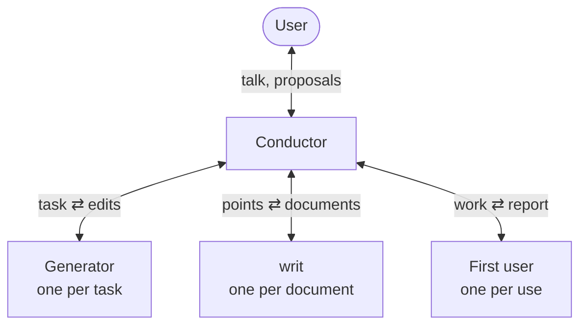
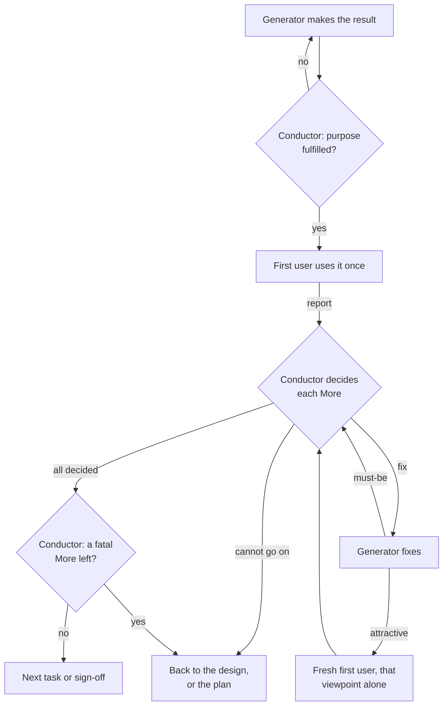
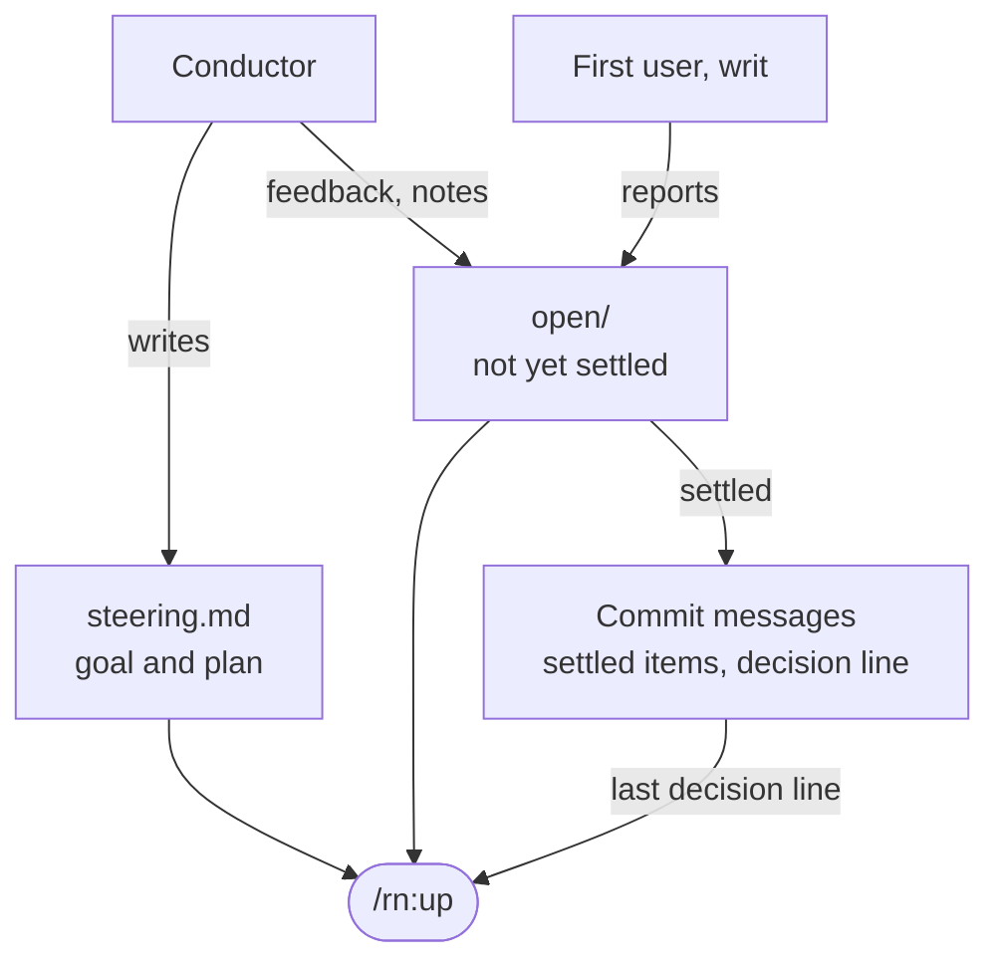

# rn design

Which features give the user what the [README](../README.md) promises, how each is built, and what
must always hold, so a builder knows what a change would cost the user.

## Acceptance criteria

What would make a user choose `rn` is attractive quality, and what a user takes for granted is
must-be quality, after the Kano model (Kano, Seraku, Takahashi and Tsuji, "Attractive quality and
must-be quality", 1984). Each criterion has an ID, by which the features below and the
[verification document](./verification.md) refer to it.

### Attractive quality

- A1: The user gets what they really want, though they start from rough words.
- A2: The user is called only for decisions that are theirs, and does not watch over the work.
- A3: At a sign-off, the user decides from the proposal, without re-reading all the work.
- A4: Work that takes days goes on, the next day or in a fresh conversation, from where it stopped,
  without the user explaining anything again.

### Must-be quality

- M1: The user's default branch changes only when they merge.
- M2: Every decision is committed and pushed as it is made, with a line that says what was decided
  and what comes next.
- M3: Every settled item is whole in the commit that settles it, so the record shows why things came
  out as they did.
- M4: `steering.md`, the names of the files in `open/`, and the verification document keep the form
  every command reads them by, and every ID they refer to exists.
- M5: A sign-off is passed only by the user's approval, and is put to the user with nothing
  unsettled behind it.
- M6: What the first user reports is what the user would get, since it knows nothing of how the work
  was made.
- M7: `rn` installs from the marketplace and passes its strict validation.

## The features that give them

| Feature | Gives | Works at README step |
|---|---|---|
| It works out the goal and the design with the user | A1 | 1, 3 |
| It calls the user only for decisions that are theirs | A2 | 1, 3, 4 |
| The first user uses the work before the user does | A1, A2, M6 | 4, 6 |
| A sign-off comes with a proposal and its grounds | A3 | 1, 2, 6 |
| Everything decided is pushed, so any conversation goes on | A4, M1, M2, M3 | 2, 5 |
| Hooks check rn's rules as it goes | M2–M6 | 5, 6 |
| It installs from the marketplace with writ | M7 | Install |

## Who does what, and what holds throughout

- The conductor is the main conversation with the user, and decides every next move.
- A generator makes one task's result.
- The first user uses a piece of work as its receiver would, before the user does, and reports what
  it understood and what happened, without judging it.
- A viewpoint is a question worked back from the purpose of the work, answered by what happened when
  the work was used.
- The conductor sets each answer in a report beside the aim and gives a Good, what serves the aim,
  or a More, what falls short of it.
- A fatal More is one without whose fix the goal cannot be achieved, and whose fix only the user can
  decide.
- `writ`, a plugin `rn` depends on, writes the README, design document, and verification document,
  and checks how they read.
- Each decision is committed with a decision line that says what was decided and what comes next.
  The commit where `rn` stops for the user is the stop commit.

Seven policies hold across the features:

- Only the conductor decides what happens next.

    Decisions are made where the goal and the whole conversation are known, so a fix keeps what
    already serves the goal. Fixes decided by the first user's words would rebuild what works.

- Only the conductor uses git.

    Every commit then records a decision someone actually made, so a later conversation goes on from
    real decisions.

- Everything is made and checked with the same viewpoints, and `rn` is improved by sharpening them,
  not by adding steps.

    A viewpoint asks what the work is for, so it fits situations no one foresaw. An added step is
    followed even where it misses.

- Every role is handed the paths of what it reads, never a summary of them.

    A summary carries the summarizer's reading, and the role would work from that instead of the
    thing.

- Every agent the conductor calls leaves its whole result in a file and returns only a short result
  and where the file is.

    A whole result in the conversation crowds the conductor's context and is lost when the
    conversation is summarized.

- Decisions are written into documents before the work that follows them, and the documents hold
  only what holds now.

    A decision written down outlives a cleared conversation, so the user never explains again what
    was already decided.

- Attractive quality comes first, and must-be quality after.

    Attractive quality is why the user chooses the work, so effort goes there while the goal is
    still open. Must-be quality is easier to build and check, and started first it takes the effort.

## It works out the goal and the design with the user

Gives A1.

### Hearing what the user really wants

The conductor works out the plan itself, in the conversation it holds, before anything else, since
what the user gets is what they meant only when the goal is theirs. The plan has its own sign-off,
because a design worked out on a wrong goal is wasted.

How it asks follows the know-how of `grilling` in
[mattpocock/skills](https://github.com/mattpocock/skills) (MIT, commit `d81f3a1`):

- What is to be decided is a tree, each decision hanging off the ones it rests on.
- Only a question whose prerequisites are settled is asked.
- Each question comes with the answer `rn` recommends.
- Facts are looked up, never asked: what the repository, the official documentation, or best
  practice can settle is the conductor's to find.
- Hearing is done when nothing is silently assumed.

To this `rn` adds its own part. It finds what the user really wants from the purpose behind their
words and the ideal that purpose calls for, since the words alone carry the gap the README's example
shows: every file ending in .ts would have let the bugs through. It asks one point at a time and
writes each into `steering.md` as it is agreed, so a pause loses none. Which issues the work closes
or serves, and which languages the record and the talk are in, are among the points agreed.

### Acceptance criteria, split by the Kano model

The goal is met when its Acceptance criteria hold, and each task's purpose when its Completion
criteria hold. Both are split into Attractive quality and Must-be quality. Every acceptance
criterion has an ID, `A1`… for attractive and `M1`… for must-be, and the design, the verification
document, the tasks, and the Good and More on the deliverable refer to criteria by it, so each can
be followed back to what the user approved, and a criterion nothing serves shows.

### The design and the verification document

The design is worked out with the user the same way, with how the user will see that it works.
`rn` decides what goes into the README, design document, and verification document, and `writ`
writes them, so they read as well as any `writ` writes. Whether the design achieves the goal is
`rn`'s, so the first user uses it against `rn`'s own viewpoints. Points agreed wait in `open/` until
`writ` writes them, so a pause loses none.

Attractive quality is confirmed by using the product as its user would, on the golden path, and
comparing what happened with what was aimed for. Edge cases and other flows are not covered in
advance: a must-be gap is fixed when it shows up in use, since it is visible and quick to fix, while
covering everything adds checks that can all pass with no one having confirmed the attractive
quality. What a machine can judge is checked by machine every time, since it costs nothing and gives
the same answer each time.

The verification document holds what it takes to run those checks again after any change and see
whether something that worked broke:

- Where a run starts, fixed so each run starts the same.
- How a run goes.
- For each attractive criterion, under `### <ID>: <criterion>` in `## Scenes`, each scene as a list
  item: what is put in, such as what the user says, knows, and decides, and, indented below,
  "Passes when" what must happen. A must-be criterion no machine can judge is named by its ID in a
  "Passes when".
- `## Machine checks`, a table of commands whose `Criteria` column names the IDs each checks.

A scene's input and its pass are fixed before the work is seen, since whoever fixes them after could
choose them so that it passes. The first user who runs a scene is handed its input, never its pass:
knowing what passes, it would look for that and report it. The conductor sets the report beside the
pass.

There is always a Design sign-off, and it approves the design and verification documents together,
so the user sees how the product will be built and how it will be checked before anything is built.

### Tasks

Tasks that make the deliverable are planned only once the design is approved, since tasks planned
before it would mostly be rewritten. How they are planned follows the know-how of `wayfinder` in the
same repository:

- The goal and its Acceptance criteria are agreed before any task exists.
- Decisions are settled one at a time, each before the tasks that rest on it.
- What cannot yet be stated precisely is kept under Not yet specified in `steering.md`, and becomes a
  task once it can be.

Each task names the acceptance criteria it serves. Tasks first raise attractive quality until the
goal is nearly achieved, and finish must-be quality last.

The maintainer reads each change `mattpocock/skills` makes to `grilling` and `wayfinder` and decides
whether `rn` takes it in, since `rn` holds the know-how, not the skills.

### Feedback at a sign-off

Feedback is the words the user gives with `/rn:gm`, or, when they give none, the review comments the
`gh` user wrote on the pull request after the stop commit, so the user can comment where they read.
It is kept whole, in the user's own words and language, in a `feedback` item in `open/`, so the work
is measured by what the user said.

After feedback, the session goes back to working out the plan or the design, taking the mismatch
behind the feedback as the first point, since fixing only what the words say leaves the mismatch in
place. Feedback on the deliverable that changes what the product should be goes back to the design.
Work that went back always stops at that sign-off again before anything is built on it: answers
settle points one at a time, and only the sign-off shows the user the whole they are about to have
built.

## It calls the user only for decisions that are theirs

Gives A2.

The user is asked only what the goal, the repository, the official documentation and best practice
cannot settle, such as how much effort is worth how much safety, and whether the deliverable achieves
the goal.

Whenever `rn` calls the user, it comes with what it proposes to do next toward the goal, and why. A
report of where things stand would leave the user to work out what to do next, which is the work they
left to `rn`. A question is put so the user can answer it on the spot. When the work waits on someone
outside, what to do meanwhile is such a question, not a stop.

Approving and giving feedback each stop, since that is where the user may clear the conversation;
the user goes on by saying so, or by `/clear` and then `/rn:up`, and both lead to the same next move.

Once approved, the plan and the documents go back through their sign-off only when what they say
changes without the user having decided it. A correction that changes nothing they say, and a change
the user made by answering a question, are written without stopping, and the next proposal shows
them as changed since the last approval.

## The first user uses the work before the user does

Gives A1, A2, and M6.


```mermaid
flowchart TD
    U(["User"])
    C["Conductor"]
    G["Generator<br/>one per task"]
    W["writ<br/>one per document"]
    F["First user<br/>one per use"]
    U <-->|"talk, proposals"| C
    C <-->|"task ⇄ edits"| G
    C <-->|"points ⇄ documents"| W
    C <-->|"work ⇄ report"| F
```

Each agent the conductor calls returns a short result and where its whole result is.

The generator and the first user are split after the generator/evaluator split in Anthropic's
[Harness design for long-running application development](https://www.anthropic.com/engineering/harness-design-long-running-apps):
an agent asked to evaluate its own work tends to praise it. `rn` keeps the use and leaves out the
judging: the first user reports only what it understood and what happened, and the conductor, who
holds the goal and everything the user agreed, sets those facts beside the aim.

The conductor stays the same conversation throughout the session, so what was talked through stays
with it. A fresh generator is started for each task, a fresh `writ` for each document, and a fresh
first user for each use, so each one's attention holds only its own work.

### Keeping the first user apart

The first user knows nothing of how the work was made. This is held first by how the agents in
`rn/agents/` are defined, since a definition holds however an agent is called:

- The first user is a fresh subagent that does not load `CLAUDE.md`, which carries how the work is
  made.
- It is handed only the paths of the work, the viewpoints, what the user agreed, and the file its
  report goes to.
- The generator has no Agent tool, so it cannot call the first user and shape what it is told.

What a definition cannot hold, since the first user and the generator need the shell, is left to
hooks: only the conductor commits, the first user writes only its report, and it does not read
commit messages, notes, or earlier reports. A hook sees a shell command's text, not every file it
touches, so a read or write through the shell is not stopped; this is accepted, since the first user
is given no path to the maker's account, and what it writes stays in the working tree for the
conductor to see before committing.

### Viewpoints

Everything `rn` makes has a purpose, stated as what whoever receives it can then do. Its viewpoints,
in `rn/references/essentials/`, are a few questions worked back from that purpose, each answered by
what happened when the first user used the work, such as "Checking each fact the plan rests on at its
source, which did not hold?" rather than "Is each fact checked?". A question of whether something is
there or good is answered "yes" without using the work, and a work no one can use passes. Each
question asks about one point, so a shortfall does not hide behind what holds, and has grounds that
say what the receiver gains, so it is followed by its intent where it names nothing. Every file also
asks which parts of the work were used toward its purpose and which were passed over, since a part
no one needs would otherwise never come to light. A question stays only if its answer is used to
judge whether the work achieved its purpose. This follows `writ`'s essentials for essentials.

There is one file each for the plan, the design, a task's result, the deliverable, a report, and
what the conductor decides and says. The files are not split by Kano quality; the plan's file asks
whether must-be work comes before the attractive criteria are nearly met.

The first user answers each viewpoint with "from the work I understood this" or "doing as written,
this happened", and gives no Good or More. The conductor sets each answer beside the aim and gives
the Good or More, each at a place in the real thing and with the criterion ID it bears on. A Good
says what the user gains, which a fix must not take away; a More says what the user will struggle
with.

### Each result is used once and settled by the conductor


```mermaid
flowchart TD
    M["Generator makes the result"]
    K{"Conductor: purpose<br/>fulfilled?"}
    V["First user uses it once"]
    D{"Conductor decides<br/>each More"}
    F["Generator fixes"]
    R["Fresh first user, that<br/>viewpoint alone"]
    J{"Conductor: a fatal<br/>More left?"}
    N["Next task or sign-off"]
    U["Back to the design,<br/>or the plan"]
    M --> K
    K -->|"no"| M
    K -->|"yes"| V
    V -->|"report"| D
    D -->|"fix"| F
    F -->|"attractive"| R
    F -->|"must-be"| D
    R --> D
    D -->|"all decided"| J
    D -->|"cannot go on"| U
    J -->|"no"| N
    J -->|"yes"| U
```

A generator reads its result whole once made, and again after each fix, since one fix can break
another place. Whoever made a thing cannot see where it is unclear; the first user stays for that.

Every Good is checked at its place as strictly as every More. A Good that does not hold is the most
dangerous point in a session: no one looks again at what is called good, so the flaw it hides
reaches the user's approval unseen. A viewpoint the report leaves unanswered goes to a fresh first
user for that viewpoint alone. Then the conductor decides each More:

- A More whose fix brings the work closer to its purpose, and keeps the Goods, is fixed.

    The fix starts from what the work should be for its purpose, wherever the same cause shows. A
    fix made only where the More points leaves the cause to show up elsewhere.

- A More whose fix would not bring the work closer is let go, with the reason.

    Its cost, or that the fix needs the README, the design document, or the user, is never that
    reason.

It cannot go on when the same More keeps coming back, when each fix brings a new More, or when a fix
needs the documents changed, unless what is fixed is the design itself. When Mores contradict each
other, something is undecided in the goal, the viewpoints, or a document, and that is what gets
decided.

A fix to a More on attractive quality is used again by a fresh first user for that viewpoint alone,
since whoever made a fix is the worst placed to see that it falls short. A fix to a More on must-be
quality is not, since a must-be gap is visible and quick to fix, and the effort goes to attractive
quality instead. The final check looks again at every Good a fix touched. The whole is not used
again, since each fresh use raises new points that are not essential.

The whole deliverable is used once, when the tasks after the last Design sign-off are done: a first
user runs each scene of the verification document, and the machine checks run. Its Mores become
added tasks. The plan follows the same flow, with the conductor making it, and so does the design,
with `writ` writing it.

## A sign-off comes with a proposal and its grounds

Gives A3.

A fatal More, or work that cannot go on, goes back to working things out with the user instead of to
the sign-off, since approving something that is no use until fixed only spends the user's time.

Otherwise `rn` proposes what it wants to do next and why that serves the goal. As its grounds it
gives, under every viewpoint and in the user's terms, the final Good and More, each at its place,
with its criterion ID, claiming no more than that place shows. When the design takes away something
the product does today, the proposal names it, so the user decides that loss there. The points and
fixes along the way are left out, since the user approves the final state.

The user reads the body of the stop commit in the conversation language, so what they read and what
a later conversation reads say the same. When the same sign-off is proposed again, each More of the
last proposal stays until a fix settles it.

## Everything decided is pushed, so any conversation goes on

Gives A4, M1, M2, and M3.


```mermaid
flowchart TD
    C["Conductor"]
    F["First user, writ"]
    S["steering.md<br/>goal and plan"]
    O["open/<br/>not yet settled"]
    M["Commit messages<br/>settled items, decision line"]
    UP(["/rn:up"])
    C -->|"writes"| S
    C -->|"feedback, notes"| O
    F -->|"reports"| O
    O -->|"settled"| M
    S --> UP
    O --> UP
    M -->|"last decision line"| UP
```

Every decision is committed and pushed as it is made, so `/rn:up` takes up the next move from the
last decision line, in the conversation language `steering.md` records. A session started under an
older `rn` has its goal worked out again from the old record and stops at a new Plan sign-off, since
an older record may not hold why the user wants the goal; what its design approved is kept as agreed
points for `writ` to write.

### The pull request

A session works on its own branch with a draft pull request, so the default branch changes only when
the user merges. `/rn:on` makes `steering.md` and the pull request from the user's first words, and
each point agreed updates them. The user reads everything on the pull request, where diffs and
diagrams render. When the user approves the deliverable, the pull request is marked ready; the merge
stays the user's.

The pull request body links `steering.md`, with `Closes #N`, `Refs #N`, and the pull requests it
replaces, so GitHub connects them; it holds no copy of the plan, which would drift.

When a session is taken up, and before each sign-off, its branch is brought up to the latest default
branch, and what that changes in the plan or the design is worked out again before the sign-off, so
the user never approves work on files the default branch no longer has.

### open/ and the record in commit messages

`open/` holds what is not yet settled, so nothing needed to go on lives only in the conversation: a
`report` from a first user or `writ`, a `feedback` item with the user's words, and a `notes` item
with design points waiting for `writ` or where a paused task stands.

A settled item leaves `open/` in the commit that settles it, copied whole into its message with what
was decided on each point, each More ending `→ fixed:`, `→ let go:`, or `→ to the user:`. The record
then lives in git and shows each finding beside what became of it, and a More let go keeps its
reason. Feedback is quoted in the user's own language; everything else is in the artifact language.

### Where rn stops

`rn` stops for the user at a sign-off, after `/rn:ty`, after `/rn:gm`, and on a pause with `/rn:dn`,
each in a stop commit whose decision line says which. At a sign-off every report and feedback is
settled first, so the user approves the whole of the work with nothing found about it left unread.
A pause leaves what is unsettled as it is, with a note on where the task stands, so `/rn:up` takes it
up with nothing to redo. A question is not a stop: nothing is committed, and a fresh conversation
comes to the same question again.

### A session has one directory under .rn/

```
repository/
├── README.md                   what the product should be, to whoever uses it
├── docs/
│   ├── design.md               how it is built
│   └── verification.md         how it is checked
└── .rn/
    └── {yyyymmdd}-{slug}/      one session
        ├── steering.md         how the work goes
        └── open/               items not yet settled
```

The README, design document, and verification document are where they are shown unless another
place is agreed. They belong to the product: they stay after the session, and the next session starts
from them. The design document states each decision with its reason and the ways not chosen, as
decision records do ([Nygard](https://cognitect.com/blog/2011/11/15/documenting-architecture-decisions),
[MADR](https://adr.github.io/madr/)), so a reader does not reopen them. `/rn:up` finds the session
by this layout.

`steering.md` holds the goal and why the user wants it, the Acceptance criteria, checked facts kept
apart from assumptions, the repository's rules a generator cannot tell from the goal, the tasks with
each one's purpose, the criteria it serves, and its Completion criteria, and what is not yet
specified. Its front matter records the version of `rn`, the pull request, whether the session is
finished, the two languages, and where the three documents are, so any conversation works from the
same goal and plan.

## Hooks check rn's rules as it goes

Gives M2 to M6.

What a machine can judge is checked by hooks, so a breach is stopped where it happens. Whether the
work serves its purpose stays with the first user and the conductor. The checks run right after a
file is written, before the first user is called and before the conductor stops for the user, and
before every commit; checks 10 and 11 run before the first user's file tool call.

1. `steering.md` has its front matter and headings, and task IDs are unique.
2. `open/` files are named `{NN}-{kind}-{about}.md`, the kind `report`, `feedback`, or `notes`.
3. Every ID referred to exists; the verification document keeps its form; every acceptance criterion
   has a scene or a machine check, and a task once tasks are planned.
4. Every conductor commit ends with a decision line `● … ── … → …`.
5. A settled `open/` item is whole in the commit message.
6. A stop commit leaves in `open/` only what its kind allows, and at a sign-off the latest default
   branch is merged.
7. A sign-off is passed, or the session finished, only after the user typed `/rn:ty`; feedback is
   taken only after `/rn:gm`, and a pause made only after `/rn:dn`.
8. Every commit is pushed.
9. Only the conductor uses git.
10. The first user writes only its own report file.
11. The first user does not read commit messages, notes, or earlier reports.

The hooks are written in Python 3.9 with the standard library only, which comes with git on a Mac
and is common elsewhere; when it is missing, the session stops and says so, since a skipped check
goes unnoticed.

## It installs from the marketplace with writ

Gives M7.

`rn` ships from the `ccpm` marketplace, and its `plugin.json` names `writ` as a dependency, so the
user installs one thing. `writ` stays a separate plugin, updated together with `rn`, so the documents
a session writes read as well as any `writ` writes without a second copy of how to write them. `rn`
passes `claude plugin validate --strict`, alone and as part of the marketplace, on every change.

## The parts

- `rn/skills/`: the commands `/rn:on`, `/rn:ty`, `/rn:gm`, `/rn:dn`, `/rn:up`.
- `rn/references/`: how the conductor carries the work, how a generator makes and a first user uses,
  and the form of `steering.md`.
- `rn/references/essentials/`: the viewpoint files.
- `rn/agents/`: the generator and the first user.
- `rn/hooks/`: the checks above, with their tests in `rn/tests/`.
