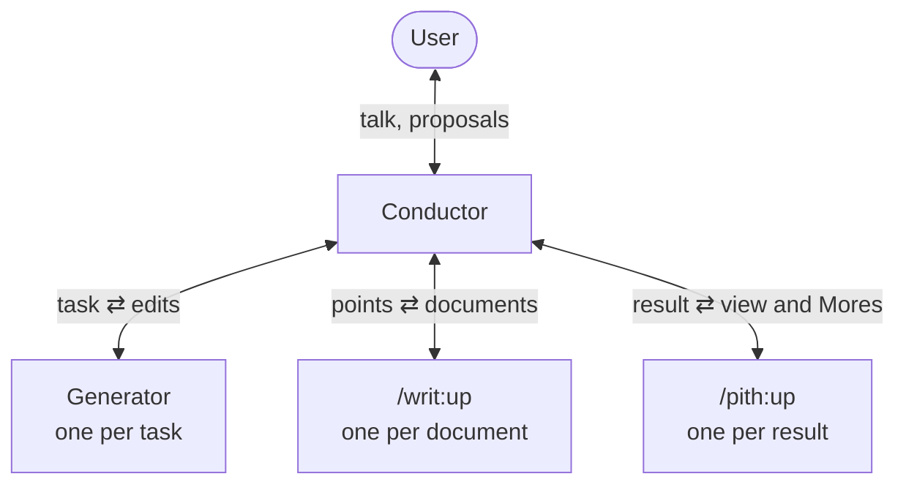

# rn design

Which features give the user what the [README](../README.md) promises, how each is built, and what
must always hold, so a builder knows what a change would cost the user.

## Acceptance criteria

What would make a user choose `rn` is attractive quality, and what a user takes for granted is
must-be quality, after the Kano model (Kano, Seraku, Takahashi and Tsuji, "Attractive quality and
must-be quality", 1984). Each criterion has an ID, by which the features below and the
[verification document](./verification.md) refer to it.

### Attractive quality

- A1: The user gets what they really want, though they start from rough words.
- A2: The user is called only for decisions that are theirs, and does not watch over the work.
- A3: At a sign-off, the user decides from the proposal, without re-reading all the work.
- A4: Work that takes days goes on, the next day or in a fresh conversation, from where it stopped,
  without the user explaining anything again.

### Must-be quality

- M1: The user's default branch changes only when they merge.
- M2: Every decision is committed and pushed as it is made, with a line that says what was decided
  and what comes next.
- M3: Every settled item is whole in the commit that settles it, so the record shows why things came
  out as they did.
- M4: `steering.md`, the names of the files in `open/`, and the verification document keep the form
  every command reads them by, and every ID they refer to exists.
- M5: A sign-off is passed only by the user's approval, and is put to the user with nothing
  unsettled behind it.
- M6: What the first user reports is what the user would get, since it knows nothing of how the work
  was made.
- M7: `rn` installs from the marketplace and passes its strict validation.

## The features that give them

| Feature | Gives | Works at README step |
|---|---|---|
| It works out the goal and the design with the user | A1 | 1, 3 |
| It calls the user only for decisions that are theirs | A2 | 1, 3, 4 |
| Each result is used before the user sees it | A1, A2, M6 | 4, 6 |
| A sign-off comes with a proposal of what the user decides | A3 | 1, 2, 6 |
| Everything decided is pushed, so any conversation goes on | A4, M1, M2, M3 | 2, 5 |
| Hooks check the record as it goes | M2–M5 | 5, 6 |
| It installs from the marketplace with writ and pith | M7 | Install |

## Who does what, and what holds throughout

- The conductor is the main conversation with the user, and decides every next move.
- A generator makes one task's result.
- `writ` writes the README, design document, and verification document, and checks how they read.
- `pith` has a first user, who knows nothing of how a thing was made, use a task's result or the
  deliverable as its receiver would, and returns its view and each More, with every Good and More in a
  result file.
- A viewpoint is a question worked back from the purpose of the work, answered by what happened when
  the work was used.
- Each decision is committed with a decision line that says what was decided and what comes next.
  The commit where `rn` stops for the user is the stop commit.

These policies hold across the features, the first above the rest:

- Attractive quality is the goal, and what the user spends on the way is part of it.

    Attractive quality is why the user chooses the work, so they get what they came for soonest when
    every effort goes to raising it. Each question they answer, each line they read, and each wait
    while an agent runs is time taken from them; a session whose every part works can still cost
    hours, which shows only when the whole story is run. Must-be quality is checked by machine, and
    a must-be gap is fixed where it stands in the way on the golden path.

- Only the conductor decides what happens next, and only the conductor uses git.

    Decisions are made where the goal and the whole conversation are known, so a fix keeps what
    already serves the goal, and every commit records a decision someone actually made.

- A fault met in use is fixed at its cause, by sharpening a purpose or a viewpoint, not by adding a
  step or a hook.

    A viewpoint asks what the work is for, so it fits situations no one foresaw. An added step is
    followed even where it misses; `rn` 0.9.0 grew a step or a hook for each fault, and each came to
    stand between the user and what this README promises.

- Each thing is checked once, by the one that made it, and only where use shows what its maker cannot
  see.

    Every first user is time the user waits. A task's result and the deliverable are used by `pith`;
    the documents are checked by `writ`, with `rn`'s question of whether the design achieves the goal
    added to the same use; what the conductor writes to the user is read by the user.

- What the user reads grows with what they decide, not with the work checked.

    A proposal that lists every criterion and viewpoint is one the user either reads all of, spending
    the time the sign-off was meant to save, or approves without reading.

- Every role is handed the paths of what it reads, never a summary of them, and every agent leaves its
  whole result in a file and returns only a short result and where the file is.

    A summary carries the summarizer's reading, and a whole result in the conversation crowds it and
    is lost when it is summarized.

- Decisions are written into documents before the work that follows them, and the documents hold
  only what holds now.

    A decision written down outlives a cleared conversation, so the user never explains again what
    was already decided.

## It works out the goal and the design with the user

Gives A1.

### Hearing what the user really wants

The conductor works out the plan itself, in the conversation it holds, before anything else, since
what the user gets is what they meant only when the goal is theirs. The plan has its own sign-off,
because a design worked out on a wrong goal is wasted.

How it asks follows the know-how of `grilling` in
[mattpocock/skills](https://github.com/mattpocock/skills) (MIT, commit `d81f3a1`):

- What is to be decided is a tree, each decision hanging off the ones it rests on.
- Only a question whose prerequisites are settled is asked.
- Each question comes with the answer `rn` recommends; `rn` keeps this for means questions only.
- Facts are looked up, never asked: what the repository, the official documentation, or best
  practice can settle is the conductor's to find.
- Hearing is done when nothing is silently assumed.

`rn` asks two kinds of question, since what the user wants is theirs to say and how to get it is
`rn`'s to find:

- An intent question asks what the user wants: why they want the goal, and what a result should do
  for them or their users. It carries no recommended answer and offers no way: `rn` says what it has
  understood so far, and may name gains it sees, but only the user knows which they want, and a way
  offered before that is built on a guess the user may take. The answer is written, in the user's
  words, as an attractive criterion: what the user or their users gain. What must not happen is
  must-be quality, and gives nothing to build a way from.
- A means question asks the user to choose among ways, where the criteria allow ways that give
  different things. It names the criteria it serves, and offers only ways that give what they say,
  each with what it gives and costs, and the one `rn` recommends and why. Where no criterion yet says
  what a result should do on the point, the intent question comes first.

A fact none of those sources can show, such as what the user's records hold, is asked, since only the
user knows it and a guess holds in the repository but not where the product runs. Each kind of input
the goal speaks of, such as "a user with no name", is such a fact: what forms it takes where the
product runs is asked unless the repository shows them, and what the product does today is checked
on every form, since a criterion worded from the one form tried passes while the others still fail.
What the user does not know but tells `rn` to go on with is written as an `Assumption`, not as their
decision, so it stays a More in every proposal until something checks it.

`rn` finds what the user really wants from the purpose behind their words and the ideal that purpose
calls for, since the words alone carry the gap the README's example shows: every file ending in .ts
would have let the bugs through. It asks one point per message, since with several the user answers
the one they follow and the rest go by half-decided, and writes each into `steering.md` as it is
agreed, so a pause loses none. Which issues the work closes or serves, which pull requests it
replaces, and which languages the record and the talk are in, are among the points agreed; `rn`
proposes the languages the repository and the user's instructions already set, or else English for
the record, which reaches the most readers later, and the user's own for the talk.

### Acceptance criteria, split by the Kano model

The goal is met when its Acceptance criteria hold, and each task's purpose when its Completion
criteria hold. Both are split into Attractive quality and Must-be quality. Every acceptance
criterion has an ID, `A1`… for attractive and `M1`… for must-be, and the design, the verification
document, the tasks, and the Good and More on the deliverable refer to criteria by it, so each can
be followed back to what the user approved, and a criterion nothing serves shows.

### The design and the verification document

The design is worked out with the user the same way, with how the user will see that it works.
`rn` decides what goes into the README, design document, and verification document, and `writ`
writes them, so they read as well as any `writ` writes. Points agreed wait in `open/` until `writ`
writes them, so a pause loses none.

Every point a writer would need is settled before any document is written: the conductor reads the
agreed points against the goal as a writer would, and puts the gaps it finds to the user together,
where they do not depend on each other's answers. A gap found by writing costs a whole round of
writing; in `rn` 0.9.0 each one sent `writ` back again, and the design stage took hours (#39). Each
document is then written once and checked once by `writ`, which adds `rn`'s design viewpoints to its
own for the design document, so whether the design achieves the goal is checked in the same use.

Attractive quality is confirmed by using the product as its user would, on the golden path, and
comparing what happened with what was aimed for. Each attractive criterion gets the fewest scenes,
and each scene the fewest inputs, that show the user getting why they would choose the product; a
scene or input that shows nothing another does not is left out. A scene is the moment the user
gets what the criterion promises: it starts from the state just before, set up rather than reached
by running what comes before it, and ends at the first result that shows whether they got it, so a
change is checked quickly. Before a round's verdict the whole story is also run once, from the
user's first words to the deliverable, measuring what the user spent: how long they waited, how much
they read to decide, and each time they were called. Every scene of `rn` 0.9.0 passed while one
design stage took hours, which only the whole story shows. Edge cases and other flows are not
covered in advance: a must-be gap is fixed when it shows up in use, since it is visible and quick to
fix, while covering everything adds checks that can all pass with no one having confirmed the
attractive quality, and spends on checking the time that would raise it. What a machine can judge is
checked by machine every time, since it costs nothing and gives the same answer each time.

The verification document holds what it takes to run those checks again after any change and see
whether something that worked broke:

- Where a run starts, fixed so each run starts the same.
- How a run goes.
- For each attractive criterion, under `### <ID>: <criterion>` in `## Scenes`, each scene as a list
  item: what is put in, such as what the user says, knows, and decides, and, indented below,
  "Passes when" what must happen. A must-be criterion no machine can judge is named by its ID in a
  "Passes when".
- `## Machine checks`, a table of commands whose `Criteria` column names the IDs each checks.

A scene's input and its pass are fixed before the work is seen, since whoever fixes them after could
choose them so that it passes. The first user who runs a scene is handed its input, never its pass:
knowing what passes, it would look for that and report it. The conductor sets the report beside the
pass.

There is always a Design sign-off, and it approves the design and verification documents together,
so the user sees how the product will be built and how it will be checked before anything is built.

### Tasks

Tasks that make the deliverable are planned only once the design is approved, since tasks planned
before it would mostly be rewritten. How they are planned follows the know-how of `wayfinder` in the
same repository:

- The goal and its Acceptance criteria are agreed before any task exists.
- Decisions are settled one at a time, each before the tasks that rest on it.
- What cannot yet be stated precisely is kept under Not yet specified in `steering.md`, and becomes a
  task once it can be.

Each task names the acceptance criteria it serves. Tasks first raise attractive quality until the
goal is nearly achieved, and finish must-be quality last.

The maintainer reads each change `mattpocock/skills` makes to `grilling` and `wayfinder` and decides
whether `rn` takes it in, since `rn` holds the know-how, not the skills.

### Feedback at a sign-off

Feedback is the words the user gives with `/rn:gm`, or, when they give none, every comment the `gh`
user wrote on the pull request after the stop commit, on a line or on the whole, so the user can comment where they read.
It is kept whole, in the user's own words and language, in a `feedback` item in `open/`, so the work
is measured by what the user said.

After feedback, the session goes back to working out the plan or the design, taking the mismatch
behind the feedback as the first point, since fixing only what the words say leaves the mismatch in
place. Feedback on the deliverable that changes what the product should be goes back to the design.
Work that went back always stops at that sign-off again before anything is built on it: answers
settle points one at a time, and only the sign-off shows the user the whole they are about to have
built.

## It calls the user only for decisions that are theirs

Gives A2.

The user is asked only what the goal, the request, the repository, the official documentation and
best practice cannot settle, such as how much effort is worth how much safety, and whether the
deliverable achieves the goal. The goal settles a point only when it leaves one answer: where it
allows answers that give the user or their users different things, the choice is theirs, and `rn`
deciding it is a guess they find later. A point that is settled goes into the plan as a Fact naming
where it was settled, with no question, so the user is not drawn into what was never theirs (#45).

A question goes straight to the user. The conductor reads it as the user would before asking, by the
Question viewpoints; no first user takes it up first, since that only makes the user wait for a
question that, written right, needs no check. Whenever `rn` calls the user, it comes with what it
proposes to do next toward the goal, and why.

Approving and giving feedback each stop, since that is where the user may clear the conversation;
the user goes on by saying so, or by `/clear` and then `/rn:up`, and both lead to the same next move.

Once approved, the plan and the documents go back through their sign-off only when what they say
changes without the user having decided it. A correction that changes nothing they say, and a change
the user made by answering a question, are written without stopping, and the next proposal shows
them as changed since the last approval.

## Each result is used before the user sees it

Gives A1, A2, and M6.


```mermaid
flowchart TD
    U(["User"])
    C["Conductor"]
    G["Generator<br/>one per task"]
    W["/writ:up<br/>one per document"]
    P["/pith:up<br/>one per result"]
    U <-->|"talk, proposals"| C
    C <-->|"task ⇄ edits"| G
    C <-->|"points ⇄ documents"| W
    C <-->|"result ⇄ view and Mores"| P
```

The generator and the first user are split after the generator/evaluator split in Anthropic's
[Harness design for long-running application development](https://www.anthropic.com/engineering/harness-design-long-running-apps):
an agent asked to evaluate its own work tends to praise it. The first user, `pith`'s, reports only
what it understood and what happened; `pith` and then the conductor, who holds the goal and everything
the user agreed, set those facts beside the aim. How a check runs, and how the first user is kept
from how the work was made, is in [pith's design](../../pith/docs/design.md); `rn` keeps only what it
hands `pith` and what it does with the result.

A task's result is used once, by `pith` with `rn`'s `task-result.md`; the deliverable once, with
`deliverable.md` and each scene's input from the verification document, never its pass. Whether a fix
holds, the conductor sees by doing again what the first user did where the More was found; `pith` is
not run again, since a new first user brings fresh small remarks with every run and the checking
never ends. When a More shows something no viewpoint asked, it becomes a viewpoint of the session,
written to `steering.md`'s Rules so every generator after it aims at it, and is proposed for `rn`'s
viewpoint files at the Deliverable sign-off.

The conductor checks every Good and More at its place, then decides each More:

- A More whose fix brings an attractive criterion closer, or closes a must-be gap met on the golden
  path, is fixed, from what the work should be for its purpose, wherever the same cause shows.
- A More whose fix would not bring the work closer is let go, with the reason; a must-be gap met only
  off the golden path is let go, since hunting such gaps never ends.
- Where whether it brings the work closer turns on what the user wants and the criteria do not say,
  the user is asked.
- When the same More keeps coming back, or each fix brings a new one, or a fix needs the design
  changed, the session goes back to the design, or the plan, with that More first.

The conductor waits for every agent and skill it starts. When Claude Code runs one in the background,
the conductor ends its turn saying what it waits for, and the result starts its next turn; nothing
polls, and no hook forbids the wait (#44).

### Viewpoints

Everything `rn` makes has a purpose, stated as what whoever receives it can then do. Its viewpoints,
in `rn/references/essentials/`, are a few questions worked back from that purpose, each answered by
what happened when the work was used: one file each for the plan, the design, a task's result, the
deliverable, and what the conductor decides and says. The conductor writes the plan, its questions
and its proposals to them and reads them itself as their receiver would; `pith` uses `task-result.md`
and `deliverable.md`; `writ` adds `design.md` to its own for the design document. A question stays
only if its answer is used to judge whether the work achieved its purpose.

## A sign-off comes with a proposal of what the user decides

Gives A3.

A fatal More, or work that cannot go on, goes back to working things out with the user instead of to
the sign-off, since approving something that is no use until fixed only spends the user's time.

Otherwise `rn` proposes what it wants to do next and why that serves the goal, and gives only what the
user decides on:

- At the Plan sign-off, the goal and each acceptance criterion as `steering.md` words them, since they
  are what the user approves, and what the user knows that they leave out shows only against the
  words themselves.
- For each attractive criterion, how far the work now gives it and what came closer since the last
  proposal. Clearing every More never ends; how close the work has come is what lets the user decide
  whether it is enough.
- Each point that is theirs: a More left, an `Assumption` no one has checked, something the product
  did before that this work no longer does, each with where.

Every Good and More stays in the record and on the pull request. A proposal that also listed every
criterion and viewpoint grew with the work checked and reached 72 lines, which the user could not
decide from (#46); its length now follows what the user decides.

The user reads the body of the stop commit in the conversation language, so what they read and what
a later conversation reads say the same. When the same sign-off is proposed again, each point of the
last proposal stays until a fix settles it.

## Everything decided is pushed, so any conversation goes on

Gives A4, M1, M2, and M3.


```mermaid
flowchart TD
    C["Conductor"]
    F["First user, writ"]
    S["steering.md<br/>goal and plan"]
    O["open/<br/>not yet settled"]
    M["Commit messages<br/>settled items, decision line"]
    UP(["/rn:up"])
    C -->|"writes"| S
    C -->|"feedback, notes"| O
    F -->|"reports"| O
    O -->|"settled"| M
    S --> UP
    O --> UP
    M -->|"last decision line"| UP
```

Every decision is committed and pushed as it is made, so `/rn:up` takes up the next move from the
last decision line, in the conversation language `steering.md` records. A session started under an
older `rn` has its goal worked out again from the old record and stops at a new Plan sign-off, since
an older record may not hold why the user wants the goal; what its design approved is kept as agreed
points for `writ` to write.

### The pull request

A session works on its own branch with a draft pull request, so the default branch changes only when
the user merges. It starts from the latest default branch and never takes in the user's uncommitted
changes: `/rn:on` on a tree that has them says so and stops. `/rn:on` makes `steering.md` and the pull request from the user's first words, and
each point agreed updates them. The user reads everything on the pull request, where diffs and
diagrams render. When the user approves the deliverable, the pull request is marked ready; the merge
stays the user's.

The pull request body links `steering.md`, with `Closes #N`, `Refs #N`, and the pull requests it
replaces, so GitHub connects them; it holds no copy of the plan, which would drift.

When a session is taken up, and before each sign-off, its branch is brought up to the latest default
branch, and what that changes in the plan or the design is worked out again before the sign-off, so
the user never approves work on files the default branch no longer has.

### open/ and the record in commit messages

`open/` holds what is not yet settled, so nothing needed to go on lives only in the conversation: a
`report`, the result file `pith` or `writ` leaves, a `feedback` item with the user's words, and a `notes` item
with design points waiting for `writ`, a question being put to the user, or where a paused task
stands.

A settled item leaves `open/` in the commit that settles it, copied whole into its message with what
was decided on each point, each More ending `→ fixed:`, `→ let go:`, or `→ to the user:`. The record
then lives in git and shows each finding beside what became of it, and a More let go keeps its
reason. Feedback is quoted in the user's own language; everything else is in the artifact language.

### Where rn stops

`rn` stops for the user at a sign-off, after `/rn:ty`, after `/rn:gm`, and on a pause with `/rn:dn`,
each in a stop commit whose decision line says which. At a sign-off every report and feedback is
settled first, so the user approves the whole of the work with nothing found about it left unread.
A pause leaves what is unsettled as it is, with a note on where the task stands and its generator's
edits, even those it had not returned, so `/rn:up` takes it up with nothing to redo or ask. A
question is not a stop: a fresh conversation comes to the same question again from its item in
`open/`. When Claude Code summarizes the conversation partway, a hook
has the conductor read the record again as `/rn:up` does, since a summary drops details the record
holds whole.

### A session has one directory under .rn/

```
repository/
├── README.md                   what the product should be, to whoever uses it
├── docs/
│   ├── design.md               how it is built
│   └── verification.md         how it is checked
└── .rn/
    └── {yyyymmdd}-{slug}/      one session
        ├── steering.md         how the work goes
        └── open/               items not yet settled
```

The README, design document, and verification document are where they are shown unless another
place is agreed. They belong to the product: they stay after the session, and the next session starts
from them. The design document states each decision with its reason and the ways not chosen, as
decision records do ([Nygard](https://cognitect.com/blog/2011/11/15/documenting-architecture-decisions),
[MADR](https://adr.github.io/madr/)), so a reader does not reopen them. `/rn:up` finds the session
by this layout.

`steering.md` holds the goal and why the user wants it, the Acceptance criteria, checked facts kept
apart from assumptions, the repository's rules a generator cannot tell from the goal, the tasks with
each one's purpose, the criteria it serves, and its Completion criteria, and what is not yet
specified. Its front matter records the version of `rn`, the pull request, whether the session is
finished, the two languages, and where the three documents are, so any conversation works from the
same goal and plan.

## Hooks check the record as it goes

Gives M2 to M5.

What a machine can judge about the record is checked by hooks, so a breach is stopped where it
happens. A hook acts only in a conversation where the user typed an rn command, and on the agents it
started; another session in the same repository is never stopped, sent on, or taken for the
conductor (#43). A hook judges only what was written: whether the work serves its purpose, whether
the conversation goes on, and how Claude Code runs an agent are not a hook's, since a hook sees none
of them, and `rn` 0.9.0's hooks that tried left the conductor no way to wait for its agents (#44).

- After a record file is written, and when the conductor ends its turn: `steering.md` has its front
  matter and headings with unique IDs; `open/` files are named `{NN}-{kind}-{about}.md`; every
  criterion ID referred to, in the tasks or the verification document, exists; once tasks are
  planned, every criterion is served by a task.
- On every conductor commit: it ends with a decision line `● … ── … → …`, followed only by trailers;
  a settled `open/` item is whole in its message; a sign-off is passed, or the session finished,
  only after the user typed `/rn:ty`, feedback taken only after `/rn:gm`, a pause made only after
  `/rn:dn`.
- Before an agent's command: no agent commits or pushes on the session's repository.
- When the conductor ends its turn: every commit is pushed.
- After Claude Code summarizes the conversation: the conductor reads the record again as `/rn:up`
  does.

The hooks are written in Python 3.9 with the standard library only, which comes with git on a Mac
and is common elsewhere; when it is missing, the session stops and says so, since a skipped check
goes unnoticed.

## It installs from the marketplace with writ and pith

Gives M7.

`rn` ships from the `ccpm` marketplace, and its `plugin.json` names `writ` and `pith` as
dependencies, so the user installs one thing. They stay separate plugins, released together with
`rn`, so the documents a session writes read as well as any `writ` writes, and a result is used as
any `pith` check uses it, without a second copy of either. `rn` passes
`claude plugin validate --strict`, alone and as part of the marketplace, on every change.

## The parts

- `rn/skills/`: the commands `/rn:on`, `/rn:ty`, `/rn:gm`, `/rn:dn`, `/rn:up`.
- `rn/references/`: what the conductor carries the work toward, and the form of `steering.md`.
- `rn/references/essentials/`: the viewpoint files.
- `rn/agents/`: the generator.
- `rn/hooks/`: the checks above, with their tests in `dev/rn/tests/`.
