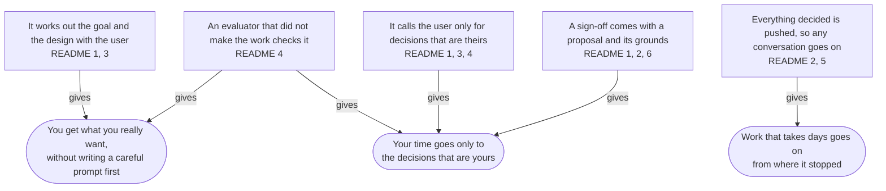
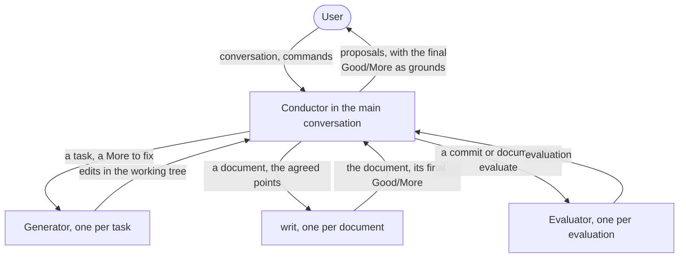
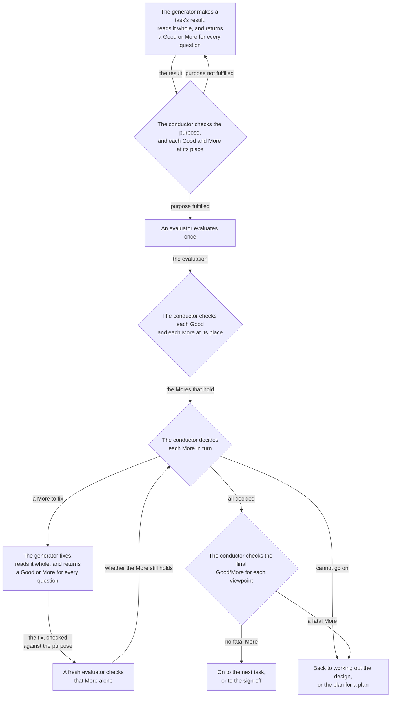
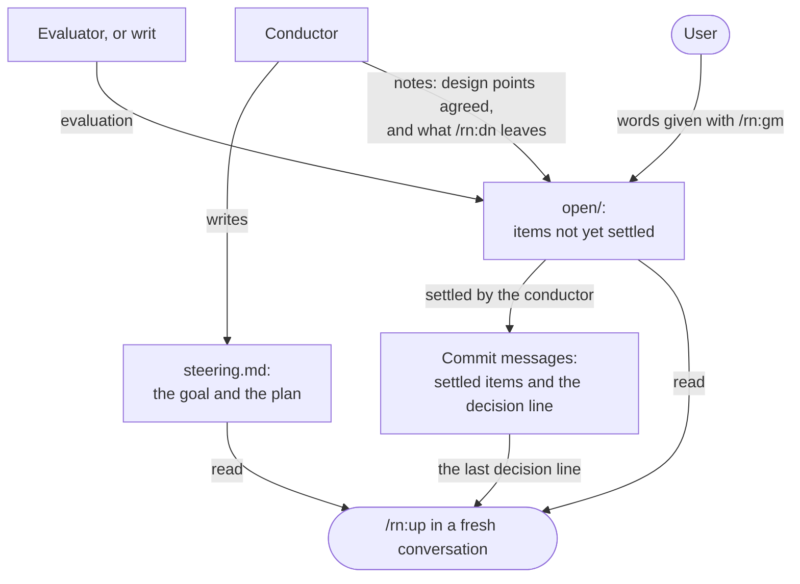

# rn design

## The benefits, and the features that give them


```mermaid
flowchart TD
    F1["It works out the goal and the design with the user<br/>README 1, 3"]
    F2["It calls the user only for decisions that are theirs<br/>README 1, 3, 4"]
    F3["An evaluator that did not make the work checks it<br/>README 4"]
    F4["A sign-off comes with a proposal and its grounds<br/>README 1, 2, 6"]
    F5["Everything decided is pushed, so any conversation goes on<br/>README 2, 5"]
    B1(["You get what you really want,<br/>without writing a careful prompt first"])
    B2(["Your time goes only to<br/>the decisions that are yours"])
    B3(["Work that takes days goes on<br/>from where it stopped"])
    F1 -->|"gives"| B1
    F3 -->|"gives"| B1
    F3 -->|"gives"| B2
    F2 -->|"gives"| B2
    F4 -->|"gives"| B2
    F5 -->|"gives"| B3
```

Five features give the README's three benefits. Under each feature are the README stages where it
works.

## Who does what, and what holds throughout

- The conductor is the main conversation with the user, and decides every next move.
- A generator makes one task's result.
- An evaluator checks one thing against the essential viewpoints and answers each with Good and More.

    An essential viewpoint is a question the thing must answer yes to. A Good is what serves it, and
    a More is what falls short.

- A fatal More is one without whose fix the goal cannot be achieved, and whose fix only the user can
  decide.
- `writ`, a plugin `rn` depends on, writes and checks the README and design document.
- Each decision is committed with a decision line that says what was decided and what comes next.

    The commit where `rn` stops for the user is the stop commit.

Five policies hold across the features:

- Only the conductor decides what happens next.

    Decisions are made where the goal and the whole conversation are known, so a fix keeps what
    already serves the goal. An evaluator sees only the thing, and fixes decided by its words would
    rebuild what works.

- Only the conductor uses git.

    Every commit then records a decision someone actually made, so a later conversation goes on from
    real decisions, not from one nobody made.

- Everything is made and checked with the same essential viewpoints, and `rn` is improved by
  sharpening them, not by adding steps.

    A viewpoint asks what the work is for, so it fits situations no one foresaw and the user gets
    work that serves the goal. An added step is followed even where it misses.

- Every role is handed the paths of what it reads, never a summary of them.

    Each role then reads the thing itself, so what it makes or finds holds for the thing. A summary
    carries the summarizer's reading, and the role would work from that instead.

- Decisions are written into documents before the work that follows them, and the documents hold
  only what holds now.

    A decision written down outlives a cleared conversation, and a document without history shows
    what holds at a glance, so the user never explains again what was already decided.

## It works out the goal and the design with the user

The conductor works out the plan before anything else, since what the user gets is what they meant
only when the goal is theirs (README, 1. Start). It makes the plan itself, not through a generator,
because the plan is worked out in the conversation it holds. It looks things up while talking
instead of finishing the research before asking, since the user's answers change where to look. The
plan has its own sign-off, because a design worked out on a wrong goal is wasted.

The design is worked out the same way, with what to test and what passes. `rn` decides what goes
into the README and design document, and `writ` writes them and returns the final Good and More for
its viewpoints. The viewpoints for documents then live in one place, so the documents the user
approves read as well as any `writ` writes, and improving `writ` improves them; two copies would
drift apart. Points agreed while working out the design wait in `open/` until `writ` writes them,
so a pause loses none. What `writ` returns is kept in `open/` as an evaluation and settled as one, so
the conductor checks its Goods and Mores at their places and its record reaches the commit whole. There is always a Design sign-off, even when the design document
does not change, since the user sees how it will be built and checked before anything is built
(README, 3. Work out the design). Tasks that make the deliverable are planned only once the design
is approved; tasks planned before the design would mostly be rewritten once it is.

After feedback at a sign-off, the session goes back to before it: a plan or a design is worked out
again with the user, taking the mismatch behind the feedback as the first point, since fixing only
what the words say leaves the mismatch in place. Feedback on the deliverable that changes what the
product should be, or how it is built, goes back to working out the design, through a Design
sign-off, since the README and design document are what the user approved the product to be. Work
that goes back to working out the plan or the design, from feedback or from a fatal More, always
stops at that sign-off again before anything is built on it, even when the user answered every
question along the way: answers settle points one at a time, and only the sign-off shows the user
the whole they are about to have built.

## It calls the user only for decisions that are theirs

The user is asked only what the goal, the repository, the official documentation and best practice
cannot settle, such as how much effort is worth how much safety, and whether the deliverable achieves
the goal. Everything else is looked up or decided from the goal, so the user's time goes only to what
is theirs.

Whenever `rn` calls the user, at a question or a sign-off, it comes with what it proposes to do next
toward the goal, and why. A report of where things stand would leave the user to work out what to do
next, which is the work they left to `rn`.

A question is put so the user can answer it on the spot. When the work waits on someone outside,
what to do meanwhile is such a question, not a stop: a stop leaves the user unsure what `rn` is
waiting for.

Approving and giving feedback each stop, since that is where the user may clear the conversation.

Once approved, the goal goes back through the Plan sign-off, and the README and design document
through the Design sign-off, only when what they say changes without the user having decided it. Two
kinds of change are written without stopping: a correction that changes nothing they say, such as a
line number gone stale, and a change the user made by answering a question while the work goes on
from what was approved, not after it went back to working out the plan or the design. The next proposal shows
them first, as changed since the last approval, so the user approves what they read without being
stopped for what they already decided.

## An evaluator that did not make the work checks it


```mermaid
flowchart TD
    U(["User"])
    C["Conductor in the main conversation"]
    G["Generator, one per task"]
    W["writ, one per document"]
    E["Evaluator, one per evaluation"]
    U -->|"conversation, commands"| C
    C -->|"proposals, with the final<br/>Good/More as grounds"| U
    C -->|"a task, a More to fix"| G
    G -->|"edits in the working tree"| C
    C -->|"a document, the agreed points"| W
    W -->|"the document, its final Good/More"| C
    C -->|"a commit or document to evaluate"| E
    E -->|"evaluation"| C
```

The conductor stays the same conversation throughout the session, since what was talked through
stays with it. A fresh generator is started for each task, so its attention holds only that task,
a fresh `writ` for each document, and a fresh evaluator for each evaluation; each ends when done.
Every one of them returns to the conductor, never to the user, so the conductor's turn ends only
when it stops for a sign-off or asks the user a question.

An evaluator is handed the thing, its essential viewpoints, and what the user agreed to and said:
the goal and the task's purpose in `steering.md`, and the agreed parts of the README and design
document. It is never handed how the thing was made or what it was changed to answer. Someone who
did not make it, reading from the user's side, sees where the user will struggle; whoever made it
reads it along their own reasons.

Everything `rn` makes, such as a plan or a task's result, has a purpose, stated as what whoever
receives it can then do. For a plan, that is "can the conductor carry the work to the goal by it",
not "does it list tasks". Whether it was done can be met by following steps; whether it serves its
purpose can be answered only by looking at the real thing.

Good and More carry the same weight. Both point to a place in the real thing and say why. A Good
adds what the user gains from it, which a fix must not take away; a More adds what the user will
struggle with because of it. How to fix it is left to the conductor: a fix written into the
evaluation would pull that decision toward the evaluator's first idea.

### Each result is evaluated once and settled by the conductor


```mermaid
flowchart TD
    M["The generator makes a task's result,<br/>reads it whole, and returns<br/>a Good or More for every question"]
    K{"The conductor checks the purpose,<br/>and each Good and More at its place"}
    V["An evaluator evaluates once"]
    KE{"The conductor checks each Good<br/>and each More at its place"}
    D{"The conductor decides<br/>each More in turn"}
    F["The generator fixes,<br/>reads it whole, and returns<br/>a Good or More for every question"]
    R["A fresh evaluator checks<br/>that More alone"]
    J{"The conductor checks the final<br/>Good/More for each viewpoint"}
    N["On to the next task,<br/>or to the sign-off"]
    U["Back to working out the design,<br/>or the plan for a plan"]
    M -->|"the result"| K
    K -->|"purpose not fulfilled"| M
    K -->|"purpose fulfilled"| V
    V -->|"the evaluation"| KE
    KE -->|"the Mores that hold"| D
    D -->|"a More to fix"| F
    F -->|"the fix, checked<br/>against the purpose"| R
    R -->|"whether the More still holds"| D
    D -->|"all decided"| J
    D -->|"cannot go on"| U
    J -->|"no fatal More"| N
    J -->|"a fatal More"| U
```

A generator reads its result whole once made, and again after each fix, and fixes it until no
question of the viewpoints falls short, since one fix, such as a word changed or a part moved, can
break another place. It returns a Good or More for every question, a More it could not fix
included, so the conductor sees where it stands without finding out alone. Whoever made a thing
knows what it means and cannot see where it is unclear; the evaluator stays for that.

The conductor checks every question in full three times: what the generator returns, what the
evaluator returns, and, before proposing to the user, the final Good and More against the real thing
as it is now, since a fix can move or take away what a Good pointed to.

Every Good is checked at its place as strictly as every More, so a Good the user reads in a proposal
holds, and they can trust it without reading that part. A Good that does not hold is the most
dangerous point in a session: no one looks again at what is called good, so the flaw it hides would
reach the user's approval unseen. It is decided as the More it hides. A Good or More without
grounds, or off the purpose, is dropped with the reason. A question then left with neither Good nor
More goes to a fresh evaluator for that question alone, since the conductor made the plan and the
design and is the worst placed to call them good. Then the conductor decides each More in turn:

- A More whose fix brings the work closer to its purpose, and keeps the Goods, is fixed.

    The fix starts from what the work should be for its purpose, not from the place the More names:
    the gap between that and the real thing says what to change, wherever the same cause shows. A
    fix made only where the More points leaves the cause to show up again elsewhere.

- A More whose fix would not bring the work closer is let go, with the reason.

    Its cost, or that the fix needs the README, the design document, or the user, is never that
    reason.

The repetition ends as either settled or cannot go on. It cannot go on when the same More keeps
coming back, when each fix brings a new More, or when a fix needs the README or the design document
changed.

A fix is checked by the conductor against the purpose, and then by a fresh evaluator given only that
More and its place, which says whether it still holds. Whoever made a fix is the worst placed to see
that it falls short, and a More called fixed that still holds reaches the proposal as a Good. The
final check looks again at every Good a fix touched, since a fix can take a Good away. The whole is
not evaluated again, since an AI evaluation can raise new points that are not essential each time it
is asked, and repeating need not settle; asking about one More keeps the check to what was fixed. For
the same reason the whole
deliverable is evaluated once, when the tasks planned after the last Design sign-off are done, and
the Mores it raises are fixed as added tasks. The user can check every final Good and More at its
place, and ask with `/rn:gm` for anything, another evaluation included.

When Mores contradict each other, `rn` does not pick one. They are a sign that something is
undecided in the goal, the essential viewpoints, or a document, so that is what gets decided.

A plan follows the same flow, with the conductor making and fixing it.

## A sign-off comes with a proposal and its grounds

A fatal More, or work that cannot go on, goes back to working things out with the user, that More
first, instead of to the sign-off, since having the user approve something that is no use until
fixed only spends their time.

Otherwise `rn` gives the proposal: what it wants to do next, such as building on this design, and
why that serves the goal. Then, as its grounds, it gives under every essential viewpoint, put in the
user's terms, the final Good and More, each at its place in the real thing and with its grounds,
claiming no more than that place shows. The points and fixes along the way are left out: the user
approves the final state, and with those they would have to work out where each applies now.

The user is given the body of the stop commit in the conversation language, adding nothing and
leaving nothing out, so what the user read and what a later conversation gives say the same. When
the same sign-off is proposed again, each More of its last proposal stays, at its place as it is
now, until a fix settles it, since the user approves the final state and a More left out of it is
one they never see.

## Everything decided is pushed, so any conversation goes on


```mermaid
flowchart TD
    U(["User"])
    C["Conductor"]
    E["Evaluator, or writ"]
    S["steering.md:<br/>the goal and the plan"]
    O["open/:<br/>items not yet settled"]
    M["Commit messages:<br/>settled items and the decision line"]
    UP(["/rn:up in a fresh conversation"])
    C -->|"writes"| S
    E -->|"evaluation"| O
    U -->|"words given with /rn:gm"| O
    C -->|"notes: design points agreed,<br/>and what /rn:dn leaves"| O
    O -->|"settled by the conductor"| M
    S -->|"read"| UP
    O -->|"read"| UP
    M -->|"the last decision line"| UP
```

Every decision is committed and pushed as it is made, so `/rn:up` takes up the next move, in the
conversation language that `steering.md` records. For a session started under an older version of
`rn`, `/rn:up` works the goal out again from the old record and stops at a new Plan sign-off, since
an older record may not hold why the user wants the goal, and every later decision is judged by it.
What an old design approved is kept as agreed points of the design, for `writ` to write and the user
to see at the Design sign-off, since the design document changes only that way.

A session works on its own branch with a draft pull request, so the user's default branch changes
only when they merge. `/rn:on` makes `steering.md` and the draft pull request at once, linking the issue it serves when
there is one, from the
user's first words, and each point agreed updates them, so a stop at any moment loses nothing agreed. The user reads everything on the pull request, where diffs, long documents,
and diagrams render, and the record stays with the code.

When a session is taken up, and before each sign-off, its branch is brought up to the latest default
branch on the remote. When that changes what the plan or the design rests on, that is worked out
again before the sign-off. A branch left behind would have the user approve work on files the
default branch no longer has, found out only at the merge.

Items go in `open/` as they were received, and `/rn:dn` commits an unfinished task's edits beside
its notes, so nothing needed to resume is only in the working tree. A file is named
`{NN}-{kind}-{about}.md`: the number keeps the order they came in, and the kind, `evaluation`,
`feedback`, or `notes`, says who wrote it. A settled item leaves `open/` in the commit that settles
it, copied whole into that commit's message with what was decided on each point, so the record lives
in git and leaves no file behind in the repository. `open/` is always empty when the session stops
at a sign-off.

A settled evaluation looks like this in its commit message:

```
rn: settle the evaluation of #3 move src/cart

- Good: src/cart/total.ts:8 types the total as number; the cart bug fails the build
- More: src/cart/price.ts:12 still takes `any` for the quantity; the cart bug would ship
  → fixed: typed the quantity as number

● #3 move src/cart ── decided: purpose fulfilled → #4
```

- The evaluation is copied whole.

    The Goods to keep and the Mores stay readable after `open/` is emptied.

- Each More ends with `→ fixed:`, `→ let go:`, or `→ to the user:`.

    The user and a later conversation see what became of each.

- The decision line comes last, and a stop commit's ends `→ waiting for #2 Design sign-off`.

    `/rn:up` finds the next move by `●`, `──`, `→`, and `waiting for`, which stay as written. The
    rest is in the artifact language, like everything else committed.

### A session has one directory under .rn/

```
repository/
├── README.md                   what the product should be, to whoever uses it
├── docs/
│   └── design.md               how it is built
└── .rn/
    └── {yyyymmdd}-{slug}/      one session
        ├── steering.md         how the work goes
        └── open/               items not yet settled
```

The README and design document are where they are shown when nothing else is specified; another
place can be agreed with the user while working out the plan. They belong to the product: they stay
after the session ends, and the next session starts from them.

The layout under `.rn/` cannot be changed, since `/rn:up` finds the session by it. `/rn:up` takes the
session on the current branch whose `status` is not `finished`, a session from an older `rn` having
none, since each session works on its own
branch.

### steering.md holds the goal and the plan in one place

Any role, even after a fresh conversation, can read this and work from the same goal and plan. For
the move to TypeScript, `steering.md` right after the Design sign-off looks like this:

```markdown
---
rn: 0.9.0
pr: https://github.com/you/repo/pull/42
status: running
artifact-language: English
conversation-language: Japanese
readme: README.md
design: docs/design.md
---

# Goal

Stop the production bugs from last quarter caused by a value of the wrong type before they ship.
A wrong type fails the build.

# Goal achieved when

- Code reproducing each of the three bugs fails the build, all three
- Every file is .ts

# Assumptions

- Fact, checked in the bug records: the three bugs are in src/cart and src/checkout
- Fact, decided by the user: type checks are strict from the start
- Assumption: the build runs tsc in CI

# Rules

- Tests sit next to the code they test, as `*.test.ts`

# Tasks

### [x] #1: Plan sign-off
### [x] #2: Design sign-off
### [ ] #3: move src/cart

Purpose: in the cart's price calculation, a wrong type fails the build

Purpose achieved when:

- Code reproducing the cart bug fails the build

### [ ] #4: move src/checkout
### [ ] #5: move src/account
### [ ] #6: Deliverable sign-off
```

- `rn` tells a session started under an older version.

    `/rn:up` can then bring it to the current form.

- `pr` keeps the place where the user reads everything.

    It is not lost when the conversation changes.

- `status` is `running` or `finished`.

    Every command then judges the same way whether the session has ended.

- `artifact-language` and `conversation-language` are what the user chose when the session began:
  the first for everything written to the repository, the record and commits included, the second
  for what is said to them.

    The record reads in one language throughout, and a fresh conversation speaks the user's
    language from the first line instead of guessing it. `rn` proposes English for the repository,
    which reaches the most readers later, and the language the user writes in for the talk.

- `readme` and `design` fix the one README and the one design document, wherever they were agreed.

    Every role reads the same documents across conversations.

- Goal is what the user wants and why, as agreed with them.

    It is the basis of every decision.

- Goal achieved when is what the Deliverable sign-off judges the goal by.
- Assumptions keep checked facts apart from unchecked assumptions.

    A decision resting on an assumption can then be told.

- Rules hold what a generator cannot tell from the goal, such as the repository's conventions.
- Each task holds its purpose and how to tell it is fulfilled.

    The conductor checks against the purpose. Sign-offs are tasks too, and make the map of tasks
    shown at the head of every stop.

## How to check that the user gets each benefit

`rn` is made of prompts, so the same input does not behave the same way every time, and no test can
compare it against a fixed answer. So for each benefit in the README, it is set what the user
struggles with if it fails, in which scene it is checked, and what passes, and the prompts are
checked in two ways.

- Running: `rn` is run with `claude -p --plugin-dir` on a practice repository on GitHub holding a
  small JavaScript app, with cases planted where a benefit would visibly be lost.

    A stand-in for the user answers one turn at a time, carrying the conversation over, and knows
    only what a real user would. An evaluator that did not make it evaluates the conversation,
    `steering.md`, `open/`, the commits, the pull request, and the deliverable against the pass
    criteria below. Prompts that read as correct do not guarantee an AI behaves that way.

- Reading: an evaluator that did not write the prompts reads them against the essential viewpoints
  for prompts and this design document.

    From every command, it traces end to end who writes what and who reads it, looking for something
    read that nothing writes, or something written that nothing reads. Running may not pass through
    branches that are hard to trigger, so those are checked by reading.

    It also traces both ways between this document and the prompts, every statement and not a
    sample: each decision here to the prompt line that makes an AI do it where it applies, and each
    prompt rule that changes what the user gets or sees to the decision it rests on. A decision no
    prompt carries is lost however good the design, and a rule nothing here grounds changes the user's
    experience without having been agreed. It is done again whenever the prompts or this document
    change, since a change on one side leaves the other behind unseen.

The benefits come first, and what the user takes for granted after: an `rn` that is only correct
gives no reason to use it (README, the line on other agents). A run is judged first on the benefits,
and while one fails, what the user takes for granted is not what is fixed first, since those failures
are the easiest to see and would leave the benefits never measured.

### You get what you really want, without writing a careful prompt first

If this fails, the user has to write a careful prompt, as with other agents, or gets what they said
instead of what they wanted.

- A rough goal whose words, taken as they are, would build the wrong thing, such as a partner's list
  whose short entries could be read two ways.

    Passes when the approved goal differs from the first words where those would have gone wrong,
    and the evaluator can name what each difference prevented.

- Feedback at the Plan sign-off whose words point at a symptom of a deeper mismatch.

    Passes when the next plan fixes the mismatch, not only what the words said.

- A decision only the user can make while working out the design, such as how strict the type
  checks start.

    Passes when the user decides from the question alone, and the approved design holds the answer.

- A goal set up so that a More comes up whose fix the goal does not determine.

    Passes when the user is asked about that More before the Deliverable sign-off, not at it.

- A goal whose Goal achieved when can be met to the letter while missing the goal, such as a fourth
  wrong-type bug of the same kind, planted in src/account, that no criterion names.

    Passes when the deliverable proposed at the Deliverable sign-off stops the planted bug too.

### Your time goes only to the decisions that are yours

If this fails, the user babysits the work, or re-reads all of it at each sign-off, which is what `rn`
is chosen to spare them.

- A whole session, from `/rn:on` to the Deliverable sign-off.

    Passes when every time the user is called is a sign-off or a question only they can decide, and
    the evaluator agrees for each one.

- The work waits on someone outside, such as a partner's answer.

    Passes when the user is asked what to do meanwhile, and is never left waiting without knowing
    why.

- A correction to the approved README that changes nothing it says.

    Passes when it does not stop, and a stand-in reading only the next proposal can tell what changed
    since the last approval.

- A task result that looks done but does not serve its purpose, such as a file moved to .ts that
  builds only because its types are `any`.

    Passes when no proposal claims it as a Good, and it is fixed before the sign-off, or shown there
    as a More if it cannot be.

- Each of the three sign-offs.

    Passes when a stand-in for the user who reads only the proposal decides yes or no, and the
    evaluator, reading the real thing, finds the same decision right and every Good and More holding
    at its place.

### Work that takes days goes on from where it stopped

If this fails, the user cannot hand over work that does not fit in one conversation, or explains it
all again each time.

- `/rn:dn` in the middle of a task, then `/rn:up` in a fresh conversation.

    Passes when it starts from the same task, does not redo finished ones, speaks the conversation
    language, and asks nothing already decided.

- `/rn:up` at a sign-off in a fresh conversation.

    Passes when a stand-in decides from what it gives as from the first proposal.

### What the user takes for granted

If these fail, the user loses what an upgrade carried, or cannot tell why things came out as they
did.

- `/rn:up` on a session started under 0.8.0.

    Passes when a `steering.md` in the current form, carrying over what was done, is made, what the
    old design approved is in a `notes` item and not in the design document, and it stops at the Plan
    sign-off.

- `/rn:gm` at the Deliverable sign-off, fixable within the design.

    Passes when tasks are added and carried out, and it stops at the Deliverable sign-off again.

- `/rn:gm` at the Deliverable sign-off, changing what the product should be.

    Passes when it works out the design with the user, stops at a Design sign-off, and then at the
    Deliverable sign-off again.

What a script can decide is checked by a script over every run's commits, not by the evaluator: that
the evaluations and what was decided on each point are whole in the commit messages, that `open/` is
empty at every sign-off, and that each stop's commit body is the proposal the user was given. A script is faster, gives
the same answer every time, and leaves the evaluator's attention for whether the user gets the
benefits.

Each scene is run once. A run takes time and money, so measuring the spread over many runs is given
up, and reading makes up for it. That only the conductor uses git, and which role reads what, are hard
to tell from a run's conversation, so they are checked by reading only. Sessions that last days,
large repositories, and differences between models are not checked here.
