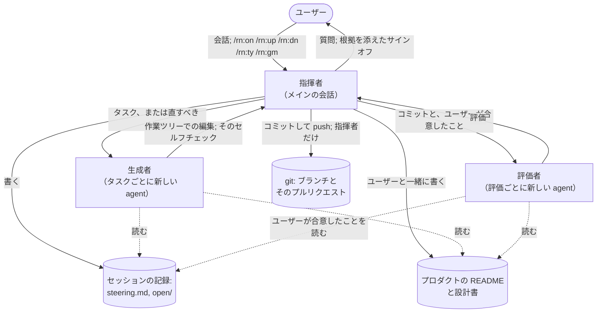
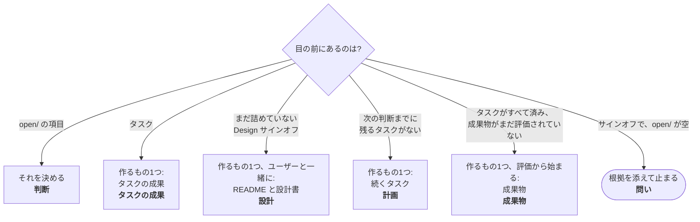
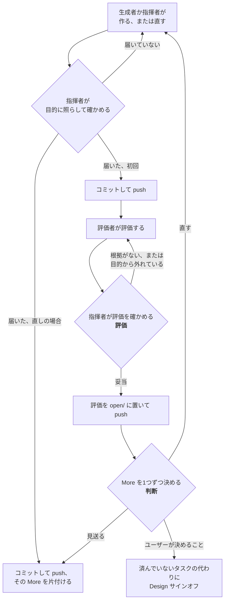
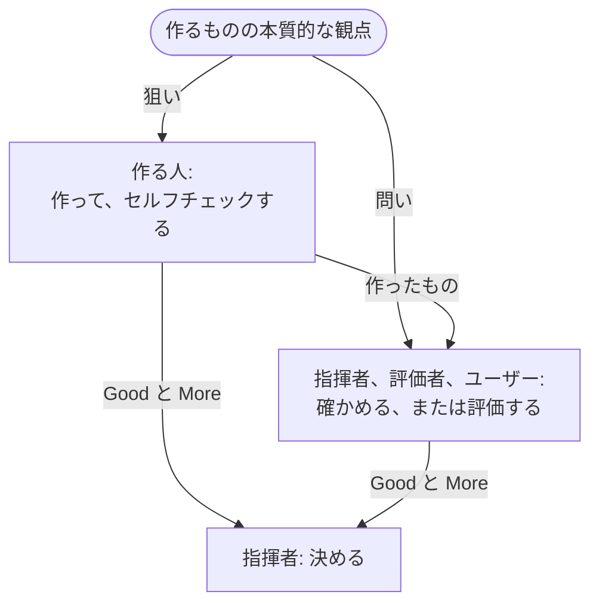

# rn 設計書

`rn` が [README](../README.md) に書いたことをどう実現するか。`rn` のプロンプトやそれが書くものがこの文書と食い違うときは、この文書が正しい。

## rn が守ること

- ゴールは、ユーザーが本当に欲しいものであって、最初に口にした言葉ではない。

  作業も判断もすべてゴールの上に立つ。最初の言葉の上に立てた計画は、どれほどうまく進めても違うものに行き着く。

- rn は手順やルールではなく、本質的な観点で動く。

  セッションで作るものにはすべて、何に届くべきかと、それを確かめる本質的な問いを渡し、道筋は作る人が見つける。手順は字面どおりに守られ、状況が想定と違うと的を外す。しかも書いた人が想定した範囲までしか仕事ができなくなる。だから `rn` は観点を磨くことで良くなり、動かすモデルが良くなるほど得をする（仮説1）。

- 作ったものは、頼んだ人が確かめ、作っていない人が評価する。

  作った人の見方は、自分の理由に寄る（仮説2）。

- 次に何をするかを決めるのは指揮者だけで、記録するのも指揮者だけ。

  作業を頼むのは指揮者なので、それぞれが目的に届くことに責任を持つ。評価の字面どおりに動くと、すでにゴールに役立っている作業をやり直すことになる。何人もが書いた記録は、誰が何を決めたかを語らなくなる。

- ユーザーが決めるのは、ユーザーのことだけ。

  好み、範囲、費用対効果、プロダクトがどうあるべきか、いくら直しても収束しないやり方、そして成果物がゴールに届いたか。セッションが一番大事に使うのはユーザーの注意であり、それ以上を求めると、ユーザーは作業を任せきれなくなる。

- 文書が作業を先導し、今の状態だけを持つ。

  進め方は計画の上で、作り方はプロダクトの設計書の上で、あるべき姿はプロダクトの README の上で議論する。どれも作業より先に変わる。文書に書くのは今成り立っていることとその理由で、そこに至った経緯は書かない。経緯はコミットにあり、各コミットがそこに至った議論を運ぶ。セッションの中だけにある決定はセッションとともに消え、文書に残した経緯は今成り立っていることを埋もれさせる。

- 計画は、ユーザーの次の判断までしか立てない。

  まだ下されていない判断の先に立てたタスクは、その判断の推測の上に立っている（仮説5）。

## 部品と、部品の間を渡るもの

```mermaid
flowchart TD
    U(["ユーザー"])
    C["指揮者<br/>（メインの会話）"]
    I["生成者<br/>（タスクごとに新しい agent）"]
    E["評価者<br/>（評価ごとに新しい agent）"]
    R[("セッションの記録:<br/>steering.md, open/")]
    D[("プロダクトの README<br/>と設計書")]
    G[("git: ブランチと<br/>そのプルリクエスト")]

    U -->|"会話; /rn:on /rn:up /rn:dn /rn:ty /rn:gm"| C
    C -->|"質問; 根拠を添えたサインオフ"| U
    C -->|"タスク、または直すべき More"| I
    I -->|"作業ツリーでの編集; そのセルフチェック"| C
    C -->|"コミットと、ユーザーが合意したこと"| E
    E -->|"評価"| C
    C -->|"書く"| R
    C -->|"ユーザーと一緒に書く"| D
    C -->|"コミットして push; 指揮者だけ"| G
    I -.->|読む| R
    I -.->|読む| D
    E -.->|"ユーザーが合意したことを読む"| R
    E -.->|読む| D
```

| 部品 | すること | 決めること | git を触るか |
|---|---|---|---|
| ユーザー | 指揮者と一緒にゴールと各設計を詰める。サインオフで答える | 計画、各設計、成果物 | 触らない |
| 指揮者 | ゴールを目指す: ゴールと各設計を詰め、計画と文書を書き、作業を頼んで戻ってきたものを確かめ、記録を持つ | 次の一手すべて | 指揮者だけが触る |
| 生成者 | 作業ツリーで1つのタスクの成果を作り、セルフチェックする | なし | 触らない |
| 評価者 | 作られたものを評価する: コミット、計画、設計、成果物 | なし | 触らない |

「作ったもの」とは、セッションで作られるものすべてを指す: 合意したゴール、計画、設計、タスクの成果、評価、判断、ユーザーへの問い、成果物。計画は `steering.md` のことで、ゴール、ゴールに届いたと分かる条件、タスクを持つ。プロダクトはユーザーのリポジトリが作っているもので、成果物はセッションを終えた時点のプロダクトである。

## 指揮者の1ターン

1ターンごとに目の前にあるものを1つ片付け、セッションがユーザーのために止まるまでターンが続く。太字は、そのステップを作り、確かめるときに使う観点。

```mermaid
flowchart TD
    F{"目の前にあるのは?"}
    F -->|"open/ の項目"| D["それを決める<br/><b>判断</b>"]
    F -->|"タスク"| T["作るもの1つ:<br/>タスクの成果<br/><b>タスクの成果</b>"]
    F -->|"まだ詰めていない<br/>Design サインオフ"| DT["作るもの1つ、ユーザーと一緒に:<br/>README と設計書<br/><b>設計</b>"]
    F -->|"次の判断までに<br/>残るタスクがない"| P["作るもの1つ:<br/>続くタスク<br/><b>計画</b>"]
    F -->|"タスクがすべて済み、<br/>成果物がまだ評価されていない"| FW["作るもの1つ、評価から始まる:<br/>成果物<br/><b>成果物</b>"]
    F -->|"サインオフで、open/ が空"| A(["根拠を添えて止まる<br/><b>問い</b>"])
```

作るものは、何であっても同じ道をたどる。タスクの成果は生成者が作り、計画と各設計は指揮者が作る。成果物は単独で作られるものではなく、評価から始まる。

```mermaid
flowchart TD
    M["生成者か指揮者が<br/>作る、または直す"]
    K{"指揮者が<br/>目的に照らして確かめる"}
    C["コミットして push"]
    V["評価者が評価する"]
    KE{"指揮者が評価を確かめる<br/><b>評価</b>"}
    O["評価を open/ に置いて push"]
    D{"More を1つずつ決める<br/><b>判断</b>"}
    S["コミットして push、<br/>その More を片付ける"]
    U["済んでいないタスクの代わりに<br/>Design サインオフ"]
    M --> K
    K -->|"届いていない"| M
    K -->|"届いた、初回"| C
    C --> V
    V --> KE
    KE -->|"根拠がない、または<br/>目的から外れている"| V
    KE -->|"妥当"| O
    O --> D
    D -->|"直す"| M
    K -->|"届いた、直しの場合"| S
    D -->|"見送る"| S
    D -->|"ユーザーが決めること"| U
```

- `/rn:on` はゴールを詰めて計画を作り、Plan サインオフまで進む。

  ゴール、次に計画を、作るもの1つとして作る。

- `/rn:up` は、セッションがユーザーのために止まるまでターンを進める。

  以前の `rn` で始めたセッションは、古い記録からゴールを詰め直し、新しい Plan サインオフまで進む。

- `/rn:gm` は、サインオフで決める対象をユーザーの言葉どおりに直し、同じサインオフで止まる。

  ユーザーの言葉はそのまま `open/` に入る。指揮者がそれに従って直し、直しを確かめる。直しに答えるのは評価者ではなくユーザー。

- `/rn:ty` は目の前のサインオフを閉じて止まる。

- `/rn:dn` は作業がどこまで進んだかを `open/` に書いて一時停止する。

- 成果物の評価から足されたタスクは、他のタスクと同じように作り、そのあとセッションは Deliverable サインオフで止まる。

## 作るものごとの本質的な観点

本質的な観点とは、作るものが何に届くべきかを問うもの。作る人はその問いを作る狙いにし、作ったものをその問いで確かめる。指揮者、評価者、ユーザーも、同じ問いで確かめたり評価したりする。確かめも評価も、問いのそれぞれに Good と More で答える。Good は狙いに役立っていて残すべきもの。More は届いていないところ、そのせいで読む人に何がまずいか、どう直すか。

```mermaid
flowchart TD
    E(["作るものの本質的な観点"])
    M["作る人:<br/>作って、セルフチェックする"]
    V["指揮者、評価者、ユーザー:<br/>確かめる、または評価する"]
    C["指揮者: 決める"]
    E -->|狙い| M
    E -->|問い| V
    M -->|作ったもの| V
    M -->|Good と More| C
    V -->|Good と More| C
```

| 観点 | 作るもの | 作る人 | 確かめる人 | 届くべきところ |
|---|---|---|---|---|
| ゴール | 合意したゴール | 指揮者、ユーザーと一緒に | ユーザー | ユーザーが本当に欲しいものを、双方が同じに見ていて、ユーザーが決めることを勝手に決めていない |
| 計画 | `steering.md` | 指揮者 | 評価者。Plan サインオフでユーザー | ユーザーがまだ下していない判断に頼らない、ゴールへの道筋。各タスクの目的が実物で確かめられる |
| 設計 | README と設計書 | 指揮者、ユーザーと一緒に | 評価者。Design サインオフでユーザー | README: プロダクトを初めて見る人が、自分に何をしてくれるかが分かり、始められる。設計書: 作り方のあらゆる判断が出発できる唯一の元 — 構造、各部品の目的、部品の間を渡るものが、穴なく、人が追える図で書かれている。両方: 今成り立っていることだけ |
| タスクの成果 | タスクの編集 | 生成者 | 指揮者、次に評価者 | 設計の範囲内で、実物でタスクの目的に届いている |
| 評価 | 作ったものへの Good と More | 評価者 | 指揮者 | ユーザーにとって何がまずいかを、作ったものに根拠を置いて、目的に照らして言う |
| 判断 | 判断の1行 | 指揮者 | ユーザー、プルリクエスト上で | 作ったものを一番ゴールに近づけ、収束する一手: 近づけない直しはしない、ユーザーのことをユーザー抜きで決めない、判断のあとも計画と設計が成り立っている（成り立たないなら先に直す） |
| 問い | サインオフでユーザーに聞くこと | 指揮者 | ユーザー | ユーザーが決めることで、見せたものからその場で決められる |
| 成果物 | セッションを終えた時点のプロダクト | セッション | 評価者。Deliverable サインオフでユーザー | ゴールに届いている |

問いそのものは、この文書とは別の1か所にまとめて置く。問いを磨くことが `rn` を良くする方法だから。

## 指揮者の決め方

戻ってきたものは、まず頼んだ目的に照らして確かめる。届いていない成果はすぐ生成者に戻す。More が作ったものに根拠を置いていない評価、目的に関わらない評価も、すぐ評価者に戻す。

妥当な評価の More それぞれについて、指揮者はゴールに照らして問う: 直せば作ったものが目的に近づくか、直すのは誰か、どう直すか、直しても Good が保たれるか。互いに食い違う2つの More は、ゴール、観点、文書のどこかに決まっていないことがあるしるし。指揮者は片方を選ぶのではなく、決まっていないことを見つけてそこで決める。ゴールから決められない More はユーザーのもの: 好み、範囲、費用対効果。README や設計書を変える直し。収束しないやり方（同じ More が繰り返し出る、直すたびに新しい More が出る）。それらは、済んでいないタスクの代わりに Design サインオフになる。直せば目的に近づく More が残っていなければ、タスクは済み。

作ったものを何回評価するかは指揮者が決める。もう1回評価すれば近づくかどうかで決める。今は1回にしている: AI だけで評価を何度も回すと、本質的でない指摘が出続けて収束しない（仮説4）。だから1回評価したら指揮者が More を1つずつ決め、決められないものはユーザーに渡す。直しは指揮者が確かめ、もう一度は評価しない。成果物も、その評価で足したタスクのあとに、もう一度は評価しない。

## 何を残し、誰が読むか

セッションのディレクトリ `.rn/{date}-{slug}/` とそのブランチが、セッションに要るすべてを持つ。`steering.md` の項目名と `open/` の名前は外との約束: ユーザーはプルリクエストでそれを読み、後の版の `rn` もそれを読む。

| もの | 書く人 | 読む人 | いつまで残すか |
|---|---|---|---|
| `steering.md`、つまり計画: `rn`（版）、`pr`、`design`（設計書）、`status`。`Goal`、`Goal reached when`、`Assumptions`、`Rules`（作業が従う決まり）、`Tasks` とその `Purpose` と `[x]` | 指揮者 | 全員 | 最後まで、今の状態で |
| README と設計書 | 指揮者 | 全員 | セッションの後も |
| `open/{NN}-{kind}-{about}.md`: まだ片付いていないもの。kind は `check`、`evaluation`、`feedback`、`notes` のどれか | 出どころの人。置くのは指揮者 | 指揮者 | 項目はコミットで片付くまで。ファイルは空になるまで |
| コミットメッセージ: 判断の1行と、それで片付く `open/` の項目 | 指揮者 | ユーザー、プルリクエスト上で | プルリクエストの履歴に |

## いつも成り立つこと

1. どのコマンドのあとでも、再開に要るのは push 済みのブランチだけ。
2. ユーザーが承認していないサインオフの先のタスクは、始めることもコミットすることもない。
3. git を使うのは指揮者だけで、1つのコミットは1つの判断。

   コミットメッセージは、それで片付く `open/` の項目を運び、その項目は同じコミットで `open/` から消える。

4. セッションがサインオフで止まるときは、いつも `open/` が空。
5. 評価者に渡すのは、ユーザーが合意したことや言ったことだけで、どう作ったかは渡さない。

   渡すのは、評価するコミットか文書、観点、ゴール、ゴールに届いたと分かる条件、決まり、タスクの目的、README、設計書、ユーザーのフィードバック。作った人の理由、コミットメッセージ、メモ、以前の評価は渡さない。

6. 作業のコミットは、そのブランチの README と設計書に書いてあることを越えない。
7. 文書は今成り立っていることだけを持つ。

## 払う代償と、選ばなかったやり方

- タスクごと、評価ごとに新しい agent を立てるので、時間とトークンがかかる。

  新しい生成者は、前の生成者が知ったことを知らずに始める。仮説2のために払う代償で、次のタスクに要ることは文書にある。

- 設計ごとに止まるので、セッションの途中でユーザーの時間を使う。

  仮説3のために払う代償。

- 次の判断までしか計画しないので、判断のたびに計画し直す。

  仮説5のために払う代償。

- 作ったものを1回しか評価しないので、直しを見るのは作った人と指揮者だけになる。

  仮説4のために払う代償。直しの誤りは、成果物の評価とユーザーのサインオフに任せる。

- 指揮者自身が作る計画と設計は、評価者が見るまで他の誰も確かめない。

  ユーザーもそれぞれのサインオフで見るので、払える代償としている。

- 生成者が作業している間、その編集は作業ツリーにしかない。git を使うのは指揮者だけだから。

  そのときに会話が終わると、同じマシンでしか再開できない。

- どう作られてきたかは、GitHub のプルリクエストにしか残らない。

  ブランチは `main` に1つのコミットとしてスカッシュされる。ブランチを消しても、プルリクエストはコミットを保つ。

- 評価者は次の一手を決めない。

  決めさせると、ゴールに役立っている作業を言い回しのためにやり直すことになる。

- ユーザーに、用意した選択肢から選ばせない。

  選んだだけでは理由が README と設計書に残らない。用意した選択肢は、ユーザーが会話でなら持ち出したはずのことを隠す。

- 評価者は1人で全体を読む。観点ごとに評価者を分けない。

  評価者は読む人の代わりで、読む人は全体を読む。1つの問いしか見ない評価者は、問いをまたぐ食い違いを見落とす。1人の評価者が浅くなるなら、観点が多すぎるか鈍すぎるので、観点を磨く。

- 判断を独立したファイルとして残さない。

  文書の横に積み上がって、今成り立っていることを埋もれさせる。判断はすでにコミットが運んでいる。

まだ確かめていない仮説:

1. `rn` を動かすモデルは、目的から判断するのがこれからも上手くなっていく。そうでないなら、観点より手順の方が役に立つ。
2. 作った人のセルフチェックは、その人が見落としたものを見落とす。作っていない人に、ユーザーが合意したことだけを伝えれば、ユーザーがまずいと思うものを見つける。
3. ユーザー抜きで決めた設計こそ、ユーザーが最後になって一番まずいと気づくもの。
4. AI だけで評価を何度も回すと、本質的でない指摘が出続けて収束しない。1回評価して、指揮者、次にユーザーがそれを元に決める方が、短い時間と少ない費用で済む。
5. まだ下していない判断の先に立てたタスクは、判断が下るとほとんど書き直しになる。
