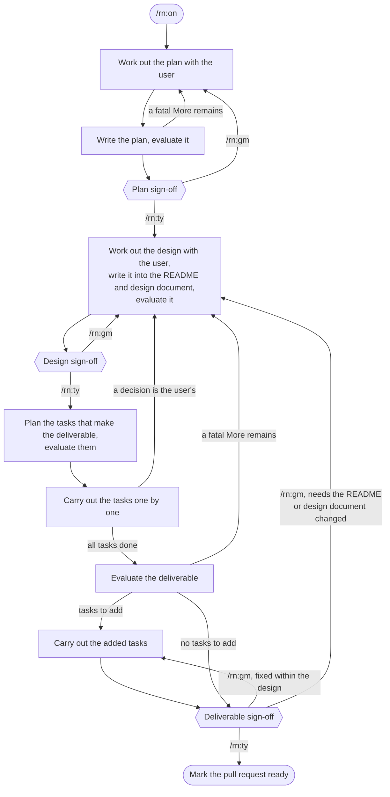
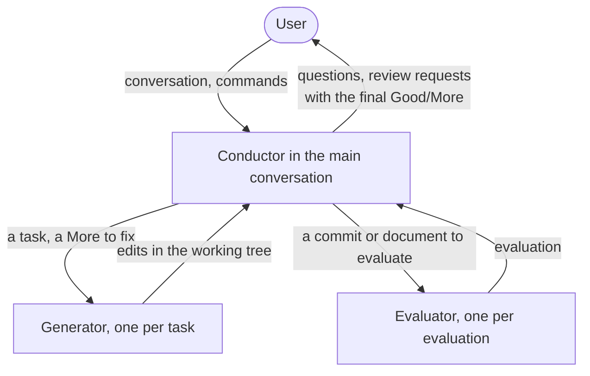
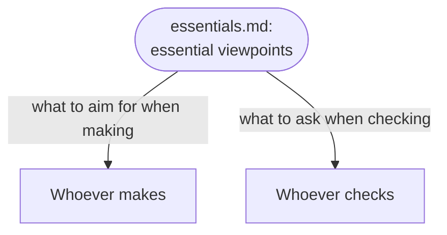
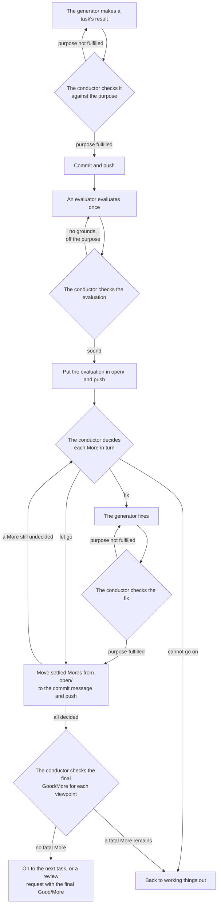
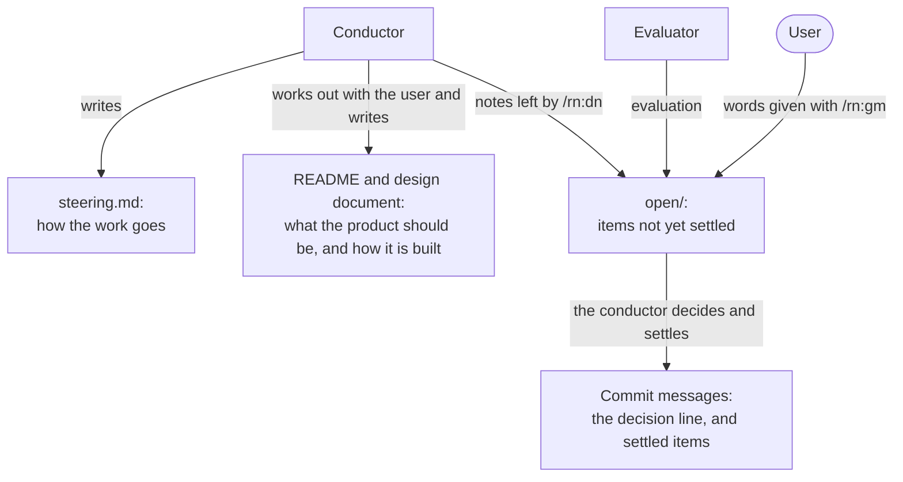

# rn design

## What rn delivers

- From a rough goal, it works out the plan and the design with the user, looking things up while
  they talk, until both see the same thing.
- From there it makes the work without the user, and an evaluator that did not make it checks it
  against the pass criteria set in the design.
- It asks the user only for the Plan, Design, and Deliverable sign-offs, and for decisions that are
  the user's.
- What was decided, and how, can be read on the pull request and in the commit messages.
- In a fresh conversation, or the next day, the work goes on from where it stopped, from the pushed
  branch.

## Three sign-offs divide a session: plan, design, deliverable


```mermaid
flowchart TD
    ON(["/rn:on"])
    W["Work out the plan with the user"]
    P["Write the plan, evaluate it"]
    PS{{"Plan sign-off"}}
    D["Work out the design with the user,<br/>write it into the README and design document,<br/>evaluate it"]
    DS{{"Design sign-off"}}
    P2["Plan the tasks that make the deliverable,<br/>evaluate them"]
    T["Carry out the tasks one by one"]
    EV["Evaluate the deliverable"]
    T2["Carry out the added tasks"]
    FS{{"Deliverable sign-off"}}
    END(["Mark the pull request ready"])
    ON --> W --> P --> PS
    P -->|"a fatal More remains"| W
    PS -->|"/rn:gm"| W
    PS -->|"/rn:ty"| D
    D --> DS
    DS -->|"/rn:gm"| D
    DS -->|"/rn:ty"| P2
    P2 --> T
    T -->|"a decision is the user's"| D
    T -->|"all tasks done"| EV
    EV -->|"tasks to add"| T2
    EV -->|"a fatal More remains"| D
    T2 --> FS
    EV -->|"no tasks to add"| FS
    FS -->|"/rn:gm, fixed within the design"| T2
    FS -->|"/rn:gm, needs the README<br/>or design document changed"| D
    FS -->|"/rn:ty"| END
```

When the user gives a goal with `/rn:on`, the conductor first works out the plan. For "move this app
to TypeScript", it asks why, and while looking through the repository and past bugs, confirms one
point at a time that the goal is "a wrong type fails the build". The user's answers change where to
look, so it looks things up while talking instead of finishing the research before asking. Once
both see the same thing, it writes the plan, evaluates it, and stops at the Plan sign-off.

On approval, it works out the design the same way: how strict the type checks start, which qualities
to check with which tests, and what passes. There is always a Design sign-off, even when the design
document does not change, because a mismatch found only after it is built costs a lot of rework.

Tasks that make the deliverable are planned once the design is settled. Tasks planned before the
design would mostly be rewritten once it is. When all tasks are done, the whole deliverable is
evaluated, tasks are added for what falls short and carried out, and the session stops at the
Deliverable sign-off. When a decision comes up that is the user's, or a More without which the goal
cannot be achieved, it goes back to working out the design.

At a sign-off, the user approves with `/rn:ty` or gives feedback with `/rn:gm`. Either one then
stops. That is where the user may start a fresh conversation with `/clear`, and the work goes on with
"go on" or `/rn:up`. After feedback, the session goes back to before that sign-off: a plan or a
design is worked out again with the user, and a deliverable gets added tasks. Feedback on the
deliverable that needs the README or design document changed goes back to working out the design,
through a Design sign-off, since those documents are what the user approved the product to be.
Fixing only what the words say would leave the mismatch behind the feedback in place.

`/rn:dn` pauses at any time, and `/rn:up` carries on from there to the next sign-off. For a session
started under an older version of `rn`, `/rn:up` works the goal out again from the old record and
stops at a new Plan sign-off.

## The conductor decides, the generator makes, and an evaluator that did not make it evaluates


```mermaid
flowchart TD
    U(["User"])
    C["Conductor in the main conversation"]
    G["Generator, one per task"]
    E["Evaluator, one per evaluation"]
    U -->|"conversation, commands"| C
    C -->|"questions, review requests<br/>with the final Good/More"| U
    C -->|"a task, a More to fix"| G
    G -->|"edits in the working tree"| C
    C -->|"a commit or document to evaluate"| E
    E -->|"evaluation"| C
```

The conductor is the main conversation with the user, the same one throughout the session. A
generator is started for each task, and an evaluator for each evaluation; each ends when done.

Only the conductor decides what happens next. When an evaluator reports "src/cart's types are still
`any`", the conductor decides whether to fix it. Acting on the letter of an evaluation redoes work
that serves the goal, so the conductor that asked for a task is responsible for it fulfilling its
purpose. Commits carry decisions, so only the conductor uses git. A generator edits the working tree
and returns.

An evaluator receives only what the user agreed to and what the user said, never how the thing was
made. Whoever made it reads it along their own reasons. Someone who did not make it, reading from the
user's side, sees where the user will struggle.

The user is asked only what only the user can decide: taste, scope, effort against safety, what the
product should be, another way when fixes keep falling short, and whether the deliverable achieves
the goal. Everything else is looked up or decided from the goal. The more the user is asked, the less
they can leave the work to `rn`.

## Everything is made to essential viewpoints, and checked with the same ones


```mermaid
flowchart TD
    E(["essentials.md:<br/>essential viewpoints"])
    M["Whoever makes"]
    V["Whoever checks"]
    E -->|"what to aim for when making"| M
    E -->|"what to ask when checking"| V
```

Everything `rn` makes, such as a plan, a design document, or a task's result, has a purpose. An
essential viewpoint asks not whether it was made or done, but whether it serves its purpose. The
purpose is stated as what whoever receives it can then do. For a README, that is "can a newcomer
tell what it does for them, and start using it", not "is there an install step". Whether it was done
can be met by following steps; whether it serves its purpose can be answered only by looking at the
real thing.

The essential viewpoints for each kind of thing are in one place, essentials.md. Whoever makes aims
for them, and whoever checks asks the same questions. The conductor makes the plan and the design,
and a generator makes the deliverable. The conductor and an evaluator check.

For example, the design document has the essential viewpoint "can whoever builds it read it and
decide which qualities to check, how, and what passes". The conductor writes to meet it, and an
evaluator reads with the same question. Because what is aimed for and what is asked are the same,
making and checking do not drift apart.

The result of a check comes back as Good and More, with the same weight. Both point to a place in the
real thing and say why. A Good adds why it must be kept when fixing; a More adds what the user will
struggle with because of it. How to fix it is left to the conductor, who decides every next move:
a fix written into the evaluation would pull that decision toward the evaluator's first idea.

Only whoever checks answers with Good and More. Whoever makes reads the essential viewpoints as what
to aim for, and the conductor checks what they made against its purpose.

`rn` hands over essential viewpoints instead of steps because steps miss the mark in situations they
did not foresee. With essential viewpoints, an AI can choose the way that fits the situation, and
chooses better as models get smarter. So `rn` is improved by sharpening essentials.md, not by adding
steps.

## An evaluator evaluates once, and the conductor settles the fixes before moving on


```mermaid
flowchart TD
    M["The generator makes a task's result"]
    K{"The conductor checks it<br/>against the purpose"}
    C["Commit and push"]
    V["An evaluator evaluates once"]
    KE{"The conductor checks the evaluation"}
    O["Put the evaluation in open/ and push"]
    D{"The conductor decides<br/>each More in turn"}
    F["The generator fixes"]
    FK{"The conductor checks the fix"}
    S["Move settled Mores from open/<br/>to the commit message and push"]
    J{"The conductor checks the final<br/>Good/More for each viewpoint"}
    N["On to the next task, or a review<br/>request with the final Good/More"]
    U["Back to working things out"]
    M --> K
    K -->|"purpose not fulfilled"| M
    K -->|"purpose fulfilled"| C
    C --> V
    V --> KE
    KE -->|"no grounds,<br/>off the purpose"| V
    KE -->|"sound"| O
    O --> D
    D -->|"fix"| F
    F --> FK
    FK -->|"purpose not fulfilled"| F
    FK -->|"purpose fulfilled"| S
    D -->|"let go"| S
    S -->|"a More still undecided"| D
    S -->|"all decided"| J
    D -->|"cannot go on"| U
    J -->|"no fatal More"| N
    J -->|"a fatal More remains"| U
```

In a task, the conductor first checks what the generator made against the task's purpose. If it
fulfills the purpose, the conductor commits and pushes, and an evaluator evaluates that commit.

On receiving an evaluation, the conductor first checks the evaluation itself. A point without
grounds, or off the purpose, goes back to the evaluator to evaluate again. A sound evaluation is put
in `open/` and pushed. The evaluator evaluates only once; from there the conductor and the generator
repeat the fixing. The conductor decides each More in turn. A More whose fix brings the work closer
to its purpose, and keeps the Goods, is fixed by the generator, checked by the conductor, and
committed. A More whose fix does not bring it closer is let go, with the reason. Because the
conductor decides, the repetition always ends as either "settled" or "cannot go on". It cannot go on
when the same More keeps coming back, each fix brings a new More, or a fix needs the README or the
design document changed.

When every More is decided, the conductor checks the final Good/More for each essential viewpoint. A
fatal More is one without which the goal cannot be achieved, and whose fix the goal does not
determine. When one remains, or the work cannot go on, it does not go to the sign-off: it goes back
to working things out, and that More is the first point to talk through with the user. Otherwise it
moves on, and before a sign-off, the final Good/More goes with the review request. The user sees the
final state, not the points and fixes along the way, so they can say for themselves whether to
approve or give feedback without reading everything again. A fatal More is not taken to a sign-off,
because having the user approve something that is no use until fixed only spends their time.

When Mores contradict each other, `rn` does not pick one. They are a sign that something is
undecided in the goal, the essential viewpoints, or a document, so that is what gets decided.

What is fixed after the evaluation does not pass before anyone who did not make it. The final
Good/More is the judgment of the conductor that decided the fixes. Evaluations are still not
repeated, because evaluating with AI alone keeps raising points that are not essential and never
settles. Every final Good and More points to a place in the real thing and says why, so the user can
check it, and when they want another evaluation, they can ask for it with `/rn:gm`.

A plan and a design follow the same flow, with the conductor, not a generator, making and fixing
them. The whole deliverable starts from the evaluator's evaluation, once all tasks are done.

## Documents lead the work and hold only the current state


```mermaid
flowchart TD
    U(["User"])
    C["Conductor"]
    E["Evaluator"]
    S["steering.md:<br/>how the work goes"]
    RD["README and design document:<br/>what the product should be, and how it is built"]
    O["open/:<br/>items not yet settled"]
    M["Commit messages:<br/>the decision line, and settled items"]
    C -->|"writes"| S
    C -->|"works out with the user and writes"| RD
    E -->|"evaluation"| O
    U -->|"words given with /rn:gm"| O
    C -->|"notes left by /rn:dn"| O
    O -->|"the conductor decides and settles"| M
```

`rn` writes down how the work goes, what the product should be, and how it is built, before it
works. How the work goes is in `steering.md`; what the product should be and how it is built are in
the product's README and design document. Discussion with the user happens on these documents too:
once something is decided, the document changes first, and the work follows it. A generator reads
all three, and an evaluator reads the parts the user agreed to. The user reads everything on the pull
request.

Documents hold only what holds now. How it came to be decided is carried by commit messages. History
left in a document buries what holds now.

What is not yet settled goes in `open/`: an evaluator's evaluation, the user's words received with
`/rn:gm`, and the notes `/rn:dn` leaves. A file is named `{NN}-{kind}-{about}.md`, where kind is
`evaluation`, `feedback`, or `notes`. The conductor
decides item by item whether it is needed, and a settled item leaves `open/` in the commit that
settles it and stays in that commit's message. So nothing slips, and `open/` is always empty when
the session stops at a sign-off.

### A session has one directory under .rn/

```
repository/
├── README.md                   what the product should be, to whoever uses it
├── docs/
│   └── design.md               how it is built
└── .rn/
    └── {yyyymmdd}-{slug}/      one session
        ├── steering.md         how the work goes
        └── open/               items not yet settled
```

The README and design document are where they are shown when nothing else is specified; another
place can be settled with the user while working out the plan. The settled place stays in the `ux`
and `design` fields of `steering.md`. The layout under `.rn/` cannot be changed.

A session leaves behind only this directory and the deliverable. The README and design document
belong to the product: they stay after the session ends, and the next session starts from them.

### steering.md holds the goal and the plan in one place

Any role, even after a fresh conversation, can read this and work from the same goal and plan. For
the move to TypeScript, `steering.md` right after the Design sign-off looks like this:

```markdown
---
rn: 0.9.0
pr: https://github.com/you/repo/pull/42
status: running
ux: README.md
design: docs/design.md
---

# Goal

Stop the production bugs from last quarter caused by a value of the wrong type before they ship.
A wrong type fails the build.

# Goal achieved when

- Code reproducing each of the three bugs fails the build, all three
- Every file is .ts

# Assumptions

- **Fact** (checked in the bug records): the three bugs are in src/cart and src/checkout
- **Fact** (the user decided): type checks are strict from the start
- **Assumption**: the build runs tsc in CI

# Rules

- Commit and push every change

# Tasks

### [x] #1: Plan sign-off
### [x] #2: Design sign-off
### [ ] #3: move src/cart

**Purpose**: in the cart's price calculation, a wrong type fails the build

**Purpose achieved when**:

- Code reproducing the cart bug fails the build
```

| Field | Why it is there |
|---|---|
| `rn` | To tell a session started under an older version, so `/rn:up` can bring it to the current form |
| `pr` | So the place where the user reads everything is not lost when the conversation changes |
| `status` | So every command judges the same way whether the session has ended |
| `ux` | To fix the one README that says what the product should be to whoever uses it, so every role reads the same document across conversations |
| `design` | To fix the one design document that says how it is built, so likewise every role reads the same document |
| Goal | What the user wants and why, as agreed with them, the basis of every decision |
| Goal achieved when | What the Deliverable sign-off judges whether the goal is achieved by |
| Assumptions | To keep checked facts apart from unchecked assumptions, so a decision resting on an assumption can be told |
| Rules | What a generator cannot tell from the goal, such as the repository's conventions |
| Tasks | Each holds its purpose and how to tell it is fulfilled, so the conductor can check against the purpose. Sign-offs are tasks too, and make the map shown at every stop |

## rn's quality is checked by reading the prompts and by running rn on a practice repository

`rn` is made of prompts, so the same input does not behave the same way every time, and no test can
compare it against a fixed answer. So before writing the prompts, for each item under "What rn
delivers", it is set what the user struggles with if it fails, in which scene it is checked, and
what passes; after writing them, they are checked in two ways.

- Reading: an evaluator that did not write the prompts reads them against the essential viewpoints
  for prompts and this design document. From every command, it traces end to end who writes what
  and who reads it, looking for something read that nothing writes, or something written that
  nothing reads. Running may not pass through branches that are hard to trigger, so those can only
  be checked by reading.
- Running: on a practice repository on GitHub holding a small JavaScript app, `rn` is actually run
  with `claude -p --plugin-dir`. The user's replies are passed one turn at a time, carrying the
  conversation over. An evaluator that did not make it evaluates the conversation, `steering.md`,
  `open/`, the commits, and the pull request against the pass criteria below. Prompts that read as
  correct do not guarantee an AI behaves that way.

### It works out the plan and the design until both see the same thing

If this fails, the work is built on a mismatch, found only after it is built, at great rework.

| Scene | Passes when |
|---|---|
| Start with "move this app to TypeScript" | It asks one point at a time. It stops at the Plan sign-off, and on approval stops at the Design sign-off even when nothing changes the design document. Tasks that make the deliverable are planned after the Design sign-off |
| `/rn:gm` at the Plan sign-off | It works the plan out again, taking the mismatch behind the feedback as the first point |

### It makes the work without the user, and an evaluator that did not make it checks it against the pass criteria

If this fails, the work goes nowhere unless the user watches, or something that does not serve its
purpose gets through.

| Scene | Passes when |
|---|---|
| From the Design sign-off to the Deliverable sign-off | The deliverable meets Goal achieved when in `steering.md`: in the TypeScript example, code reproducing each of the three bugs fails the build, all three. The evaluator evaluates once, and each More is decided as fix, let go, or hand to the user |
| A goal set up so that a More comes up whose fix the goal does not determine | It does not go to the Deliverable sign-off; it goes back to working out the design and asks the user about that More first |
| `/rn:gm` at the Deliverable sign-off, fixable within the design | Tasks are added and carried out, and it stops at the Deliverable sign-off again |
| `/rn:gm` at the Deliverable sign-off, needing the README changed | It works out the design with the user, stops at a Design sign-off, and then at the Deliverable sign-off again |

### It asks only for sign-offs and the user's decisions

If this fails, the user is called back at every question and cannot leave the work to `rn`.

| Scene | Passes when |
|---|---|
| Every scene | It stops only at the three sign-offs and at what only the user can decide. It does not ask what the repository or official documentation can answer |
| Each of the three sign-offs | The review request carries the final Good/More for each essential viewpoint, with the place in the real thing and the grounds, so the user can decide without reading everything again |

### Decisions can be read on the pull request and in commit messages

If this fails, nobody can tell why things came out as they did: the user cannot approve, and whoever
fixes it later loses the thread.

| Scene | Passes when |
|---|---|
| Every scene | The evaluations, and the decision and reason for each More, can be read in the commit messages. `open/` is empty when it stops at a sign-off |

### It goes on from where it stopped

If this fails, the user cannot hand over long work that does not fit in one conversation.

| Scene | Passes when |
|---|---|
| `/rn:dn` in the middle of a task, then `/rn:up` in a fresh conversation | It starts from the same task and does not redo finished ones |
| `/rn:up` on a session started under 0.8.0 | A `steering.md` in the current form, carrying over what was done, is made, and it stops at the Plan sign-off |

Each scene is run once. A run takes time and money, so measuring the spread over many runs is given
up, and reading makes up for it. That only the conductor uses git, and which role reads what, are hard
to tell from a run's conversation, so they are checked by reading only. Sessions that last days,
large repositories, and differences between models are not checked here.
