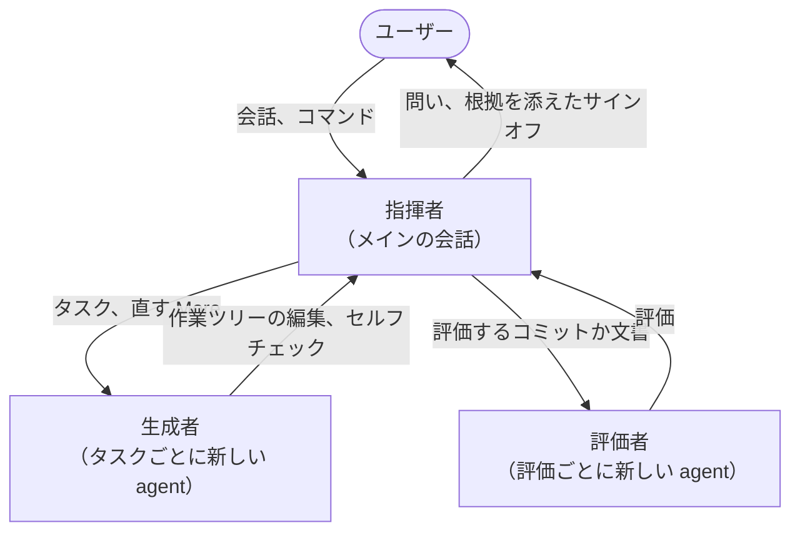
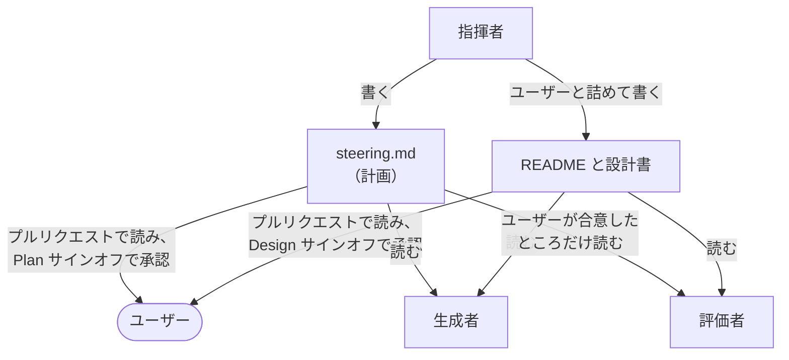
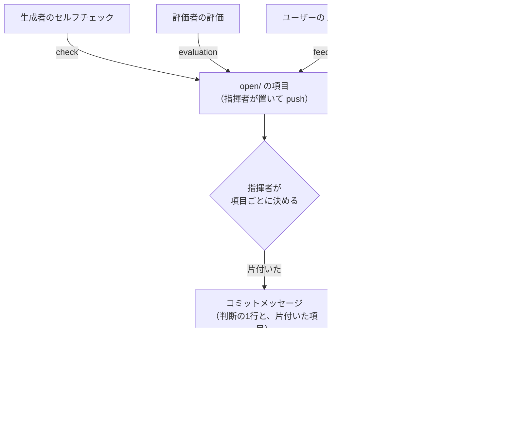
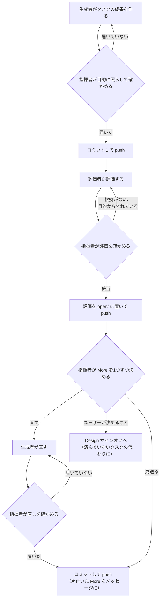
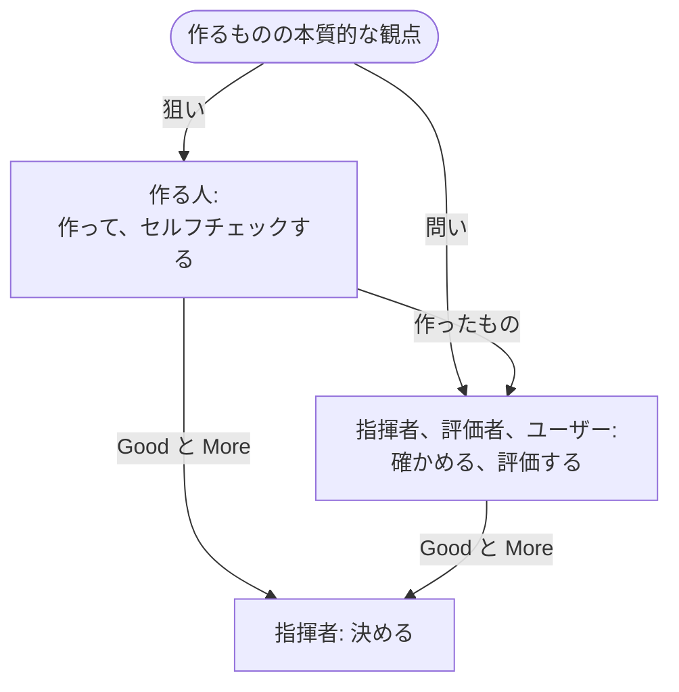

# rn 設計書

`rn` が [README](../README.md) に書いたことをどう実現するか。`rn` のプロンプトやそれが書くものがこの文書と食い違うときは、この文書が正しい。

## rn が守ること

- ゴールは、ユーザーが本当に欲しいものであって、最初に口にした言葉ではない。

  作業も判断もすべてゴールの上に立つ。最初の言葉の上に立てた計画は、どれほどうまく進めても違うものに行き着く。

- rn は手順やルールではなく、本質的な観点で動く。

  セッションで作るものにはすべて、何に届くべきかと、それを確かめる本質的な問いを渡し、道筋は作る人が見つける。手順は字面どおりに守られ、状況が想定と違うと的を外す。しかも書いた人が想定した範囲までしか仕事ができなくなる。だから `rn` は観点を磨くことで良くなり、動かすモデルが良くなるほど得をする（仮説1）。

- 作ったものは、頼んだ人が確かめ、作っていない人が評価する。

  作った人の見方は、自分の理由に寄る（仮説2）。

- 次に何をするかを決めるのは指揮者だけで、記録するのも指揮者だけ。

  作業を頼むのは指揮者なので、それぞれが目的に届くことに責任を持つ。評価の字面どおりに動くと、すでにゴールに役立っている作業をやり直すことになる。何人もが書いた記録は、誰が何を決めたかを語らなくなる。

- ユーザーが決めるのは、ユーザーのことだけ。

  好み、範囲、費用対効果、プロダクトがどうあるべきか、いくら直しても収束しないやり方、そして成果物がゴールに届いたか。セッションが一番大事に使うのはユーザーの注意であり、それ以上を求めると、ユーザーは作業を任せきれなくなる。

- 文書が作業を先導し、今の状態だけを持つ。

  進め方は計画の上で、作り方はプロダクトの設計書の上で、あるべき姿はプロダクトの README の上で議論する。どれも作業より先に変わる。文書に書くのは今成り立っていることとその理由で、そこに至った経緯は書かない。経緯はコミットにあり、各コミットがそこに至った議論を運ぶ。セッションの中だけにある決定はセッションとともに消え、文書に残した経緯は今成り立っていることを埋もれさせる。

- 計画は、ユーザーの次の判断までしか立てない。

  まだ下されていない判断の先に立てたタスクは、その判断の推測の上に立っている（仮説5）。

## 登場人物

### 人と agent

```mermaid
flowchart TD
    U(["ユーザー"])
    C["指揮者<br/>（メインの会話）"]
    G["生成者<br/>（タスクごとに新しい agent）"]
    E["評価者<br/>（評価ごとに新しい agent）"]
    U -->|"会話、コマンド"| C
    C -->|"問い、根拠を添えたサインオフ"| U
    C -->|"タスク、直す More"| G
    G -->|"作業ツリーの編集、セルフチェック"| C
    C -->|"評価するコミットか文書"| E
    E -->|"評価"| C
```

- 次の一手を決めるのも、git を使うのも、指揮者だけ。

  生成者は作業ツリーで編集するだけ、評価者は評価するだけで、どちらも次の一手を決めない。

### 文書

```mermaid
flowchart TD
    C["指揮者"]
    U(["ユーザー"])
    S["steering.md<br/>（計画）"]
    RD["README と設計書"]
    G["生成者"]
    E["評価者"]
    C -->|"書く"| S
    C -->|"ユーザーと詰めて書く"| RD
    S -->|"プルリクエストで読み、<br/>Plan サインオフで承認"| U
    RD -->|"プルリクエストで読み、<br/>Design サインオフで承認"| U
    S -->|"読む"| G
    RD -->|"読む"| G
    S -->|"ユーザーが合意した<br/>ところだけ読む"| E
    RD -->|"読む"| E
```

矢印は中身が流れる向き。

- README は、プロダクトが何をしてくれるかと、その始め方を持つ。

  プロダクトはユーザーのリポジトリが作っているもので、成果物はセッションを終えた時点のプロダクト。

- 設計書は、プロダクトの作り方のあらゆる判断が出発する唯一の元になる。
- `steering.md` は、ゴールへの進め方を持つ。

  項目は `rn`（版）、`pr`、`design`（設計書の場所）、`status`、`Goal`、`Goal reached when`、`Assumptions`、`Rules`（作業が従う決まり）、`Tasks` とその `Purpose` と `[x]`。項目名は外との約束で、後の版の `rn` も読む。

- 3つとも、今の状態だけを持つ。

### 中間成果物とコミットメッセージ

```mermaid
flowchart TD
    G["生成者のセルフチェック"]
    E["評価者の評価"]
    U["ユーザーの /rn:gm の言葉"]
    N["/rn:dn のメモ"]
    O["open/ の項目<br/>（指揮者が置いて push）"]
    D{"指揮者が<br/>項目ごとに決める"}
    M["コミットメッセージ<br/>（判断の1行と、片付いた項目）"]
    X["同じコミットで open/ から消す<br/>空になったファイルも消す"]
    G -->|"check"| O
    E -->|"evaluation"| O
    U -->|"feedback"| O
    N -->|"notes"| O
    O --> D
    D -->|"片付いた"| M
    M --> X
```

- 項目のファイル名は `open/{NN}-{kind}-{about}.md` で、kind は図の矢印の名前。
- 項目は片付くまで残り、残った項目は指揮者が要るか要らないかを決めるので、何も漏れない。
- コミットメッセージは、プルリクエストの履歴に残る。

## セッションの流れ

```mermaid
flowchart TD
    ON(["/rn:on"])
    W["ゴールをユーザーと詰める"]
    P["次の判断までの計画を作り、<br/>評価する"]
    PS{{"Plan サインオフ"}}
    T["タスクを1つずつ進める"]
    D["設計をユーザーと詰めて<br/>README と設計書に書き、評価する"]
    DS{{"Design サインオフ"}}
    P2["続くタスクを計画し、評価する"]
    EV["成果物を評価する"]
    T2["評価から足したタスクを進める"]
    FS{{"Deliverable サインオフ"}}
    END(["プルリクエストを ready にする"])
    ON --> W --> P --> PS
    PS -->|"/rn:ty"| T
    T -->|"ユーザーが決めることが出た"| D
    D --> DS
    DS -->|"/rn:ty"| P2
    P2 --> T
    T -->|"タスクがすべて済んだ"| EV
    EV -->|"足すタスクがある"| T2
    T2 --> FS
    EV -->|"足すタスクがない"| FS
    FS -->|"/rn:ty"| END
```

- `/rn:gm` は、サインオフで見せたものをユーザーの言葉どおりに直し、同じサインオフで止まる。

  ユーザーの言葉はそのまま `open/` に入る。直しは指揮者が確かめ、それに答えるのは評価者ではなくユーザー。

- `/rn:ty` は、目の前のサインオフを閉じて止まる。

  図の次のステップは、同じ会話で「続けて」と言うか、`/rn:up` で始まる。

- `/rn:up` は、止まったところから、次にユーザーのために止まるところまで進める。

  以前の `rn` で始めたセッションは、古い記録からゴールを詰め直し、新しい Plan サインオフで止まる。

- `/rn:dn` は、どこでも、作業がどこまで進んだかを `open/` に書いて一時停止する。
- セッションがサインオフで止まるときは、`open/` がいつも空になっている。

## 作るもの1つの流れ

```mermaid
flowchart TD
    M["生成者がタスクの成果を作る"]
    K{"指揮者が目的に照らして確かめる"}
    C["コミットして push"]
    V["評価者が評価する"]
    KE{"指揮者が評価を確かめる"}
    O["評価を open/ に置いて push"]
    D{"指揮者が More を1つずつ決める"}
    F["生成者が直す"]
    FK{"指揮者が直しを確かめる"}
    S["コミットして push<br/>（片付いた More をメッセージに）"]
    U["Design サインオフへ<br/>（済んでいないタスクの代わりに）"]
    M --> K
    K -->|"届いていない"| M
    K -->|"届いた"| C
    C --> V
    V --> KE
    KE -->|"根拠がない、<br/>目的から外れている"| V
    KE -->|"妥当"| O
    O --> D
    D -->|"直す"| F
    F --> FK
    FK -->|"届いていない"| F
    FK -->|"届いた"| S
    D -->|"見送る"| S
    D -->|"ユーザーが決めること"| U
```

- 図はタスクの成果の例で、計画と設計も同じ流れをたどり、作って直すのが生成者ではなく指揮者になる。
- 成果物は単独で作られるものではないので、「評価者が評価する」から始まる。
- 直しはもう一度評価しない。

  何回評価するかは、本来は指揮者が、もう1回で近づくかどうかで決めること。今は1回にしている。AI だけで評価を何度も回すと、本質的でない指摘が出続けて収束しないため（仮説4）。

## 本質的な観点

```mermaid
flowchart TD
    E(["作るものの本質的な観点"])
    M["作る人:<br/>作って、セルフチェックする"]
    V["指揮者、評価者、ユーザー:<br/>確かめる、評価する"]
    C["指揮者: 決める"]
    E -->|"狙い"| M
    E -->|"問い"| V
    M -->|"作ったもの"| V
    M -->|"Good と More"| C
    V -->|"Good と More"| C
```

本質的な観点は、作るものが何に届くべきかを問う。問いのそれぞれに、Good と More で答える。Good は狙いに役立っていて残すべきもの。More は届いていないところ、そのせいで読む人に何がまずいか、どう直すか。

- ゴールは、ユーザーが本当に欲しいものを双方が同じに見ていて、ユーザーが決めることを勝手に決めていないこと。

  指揮者がユーザーと作り、ユーザーが確かめる。

- 計画は、ユーザーがまだ下していない判断に頼らないゴールへの道筋で、各タスクの目的が実物で確かめられること。

  指揮者が作り、評価者と、Plan サインオフでユーザーが確かめる。

- 設計の README は、プロダクトを初めて見る人が、自分に何をしてくれるかが分かり、始められること。

  指揮者がユーザーと作り、評価者と、Design サインオフでユーザーが確かめる。

- 設計の設計書は、作り方のあらゆる判断が出発できる唯一の元であること。

  構造、各部品の目的、部品の間を渡るものが、穴なく、人が追える図で書かれている。README と同じく、今成り立っていることだけを持つ。

- タスクの成果は、設計の範囲内で、実物でタスクの目的に届いていること。

  生成者が作り、指揮者、次に評価者が確かめる。

- 評価は、ユーザーにとって何がまずいかを、作ったものに根拠を置いて、目的に照らして言うこと。

  評価者が作り、指揮者が確かめる。

- 判断は、作ったものを一番ゴールに近づけ、収束する一手であること。

  近づけない直しはしない、ユーザーのことをユーザー抜きで決めない、判断のあとも計画と設計が成り立っている（成り立たないなら先に直す）。指揮者が作り、ユーザーがプルリクエストで読む。

- 問いは、ユーザーが決めることで、見せたものからその場で決められること。

  指揮者が作り、サインオフでユーザーが答える。

- 成果物は、ゴールに届いていること。

  評価者が評価し、Deliverable サインオフでユーザーが確かめる。

問いそのものは、この文書とは別の1か所にまとめて置く。問いを磨くことが `rn` を良くする方法だから。

## 指揮者の決め方

- 戻ってきたものは、まず頼んだ目的に照らして確かめる。

  届いていない成果はすぐ生成者に戻す。作ったものに根拠を置いていない More、目的に関わらない More を出した評価も、すぐ評価者に戻す。

- More は1つずつ、ゴールに照らして決める。

  直せば目的に近づくか、直すのは誰か、どう直すか、直しても Good が保たれるかを問う。

- 互いに食い違う More は、どこかに決まっていないことがあるしるしとして扱う。

  ゴール、観点、文書のどこかに決まっていないことがある。片方を選ぶのではなく、それを見つけてそこで決める。

- ゴールから決められない More はユーザーに渡す。

  好み、範囲、費用対効果、README や設計書を変える直し、収束しないやり方（同じ More が繰り返し出る、直すたびに新しい More が出る）。済んでいないタスクの代わりに Design サインオフになる。

- 直せば目的に近づく More が残っていなければ、タスクは済み。

## いつも成り立つこと

1. どのコマンドのあとでも、再開に要るのは push 済みのブランチだけ。
2. ユーザーが承認していないサインオフの先のタスクは、始めることもコミットすることもない。
3. git を使うのは指揮者だけで、1つのコミットは1つの判断。

   コミットメッセージは、それで片付く `open/` の項目を運び、その項目は同じコミットで `open/` から消える。

4. セッションがサインオフで止まるときは、いつも `open/` が空。
5. 評価者に渡すのは、ユーザーが合意したことや言ったことだけで、どう作ったかは渡さない。

   渡すのは、評価するコミットか文書、観点、ゴール、ゴールに届いたと分かる条件、決まり、タスクの目的、README、設計書、ユーザーのフィードバック。作った人の理由、コミットメッセージ、メモ、以前の評価は渡さない。

6. 作業のコミットは、そのブランチの README と設計書に書いてあることを越えない。
7. 文書は今成り立っていることだけを持つ。

## 払う代償と、選ばなかったやり方

- タスクごと、評価ごとに新しい agent を立てるので、時間とトークンがかかる。

  新しい生成者は、前の生成者が知ったことを知らずに始める。仮説2のために払う代償で、次のタスクに要ることは文書にある。

- 設計ごとに止まるので、セッションの途中でユーザーの時間を使う。

  仮説3のために払う代償。

- 次の判断までしか計画しないので、判断のたびに計画し直す。

  仮説5のために払う代償。

- 作ったものを1回しか評価しないので、直しを見るのは作った人と指揮者だけになる。

  仮説4のために払う代償。直しの誤りは、成果物の評価とユーザーのサインオフに任せる。

- 指揮者自身が作る計画と設計は、評価者が見るまで他の誰も確かめない。

  ユーザーもそれぞれのサインオフで見るので、払える代償としている。

- 生成者が作業している間、その編集は作業ツリーにしかない。git を使うのは指揮者だけだから。

  そのときに会話が終わると、同じマシンでしか再開できない。

- どう作られてきたかは、GitHub のプルリクエストにしか残らない。

  ブランチは `main` に1つのコミットとしてスカッシュされる。ブランチを消しても、プルリクエストはコミットを保つ。

- 評価者は次の一手を決めない。

  決めさせると、ゴールに役立っている作業を言い回しのためにやり直すことになる。

- ユーザーに、用意した選択肢から選ばせない。

  選んだだけでは理由が README と設計書に残らない。用意した選択肢は、ユーザーが会話でなら持ち出したはずのことを隠す。

- 評価者は1人で全体を読む。観点ごとに評価者を分けない。

  評価者は読む人の代わりで、読む人は全体を読む。1つの問いしか見ない評価者は、問いをまたぐ食い違いを見落とす。1人の評価者が浅くなるなら、観点が多すぎるか鈍すぎるので、観点を磨く。

- 判断を独立したファイルとして残さない。

  文書の横に積み上がって、今成り立っていることを埋もれさせる。判断はすでにコミットが運んでいる。

まだ確かめていない仮説:

1. `rn` を動かすモデルは、目的から判断するのがこれからも上手くなっていく。そうでないなら、観点より手順の方が役に立つ。
2. 作った人のセルフチェックは、その人が見落としたものを見落とす。作っていない人に、ユーザーが合意したことだけを伝えれば、ユーザーがまずいと思うものを見つける。
3. ユーザー抜きで決めた設計こそ、ユーザーが最後になって一番まずいと気づくもの。
4. AI だけで評価を何度も回すと、本質的でない指摘が出続けて収束しない。1回評価して、指揮者、次にユーザーがそれを元に決める方が、短い時間と少ない費用で済む。
5. まだ下していない判断の先に立てたタスクは、判断が下るとほとんど書き直しになる。
