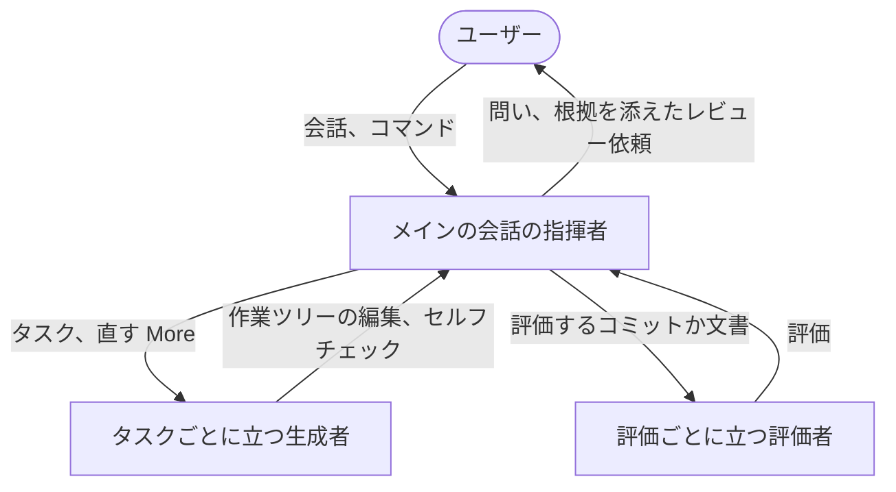
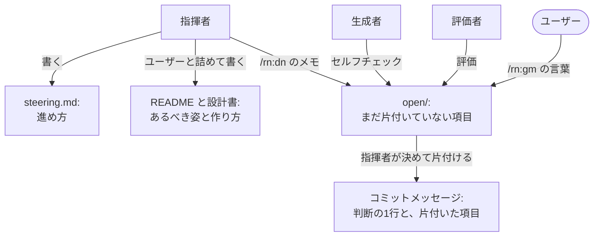
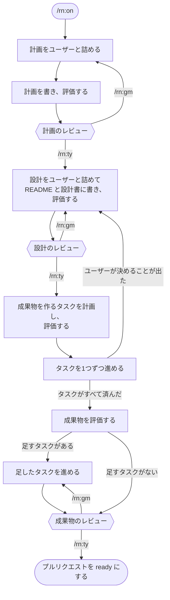
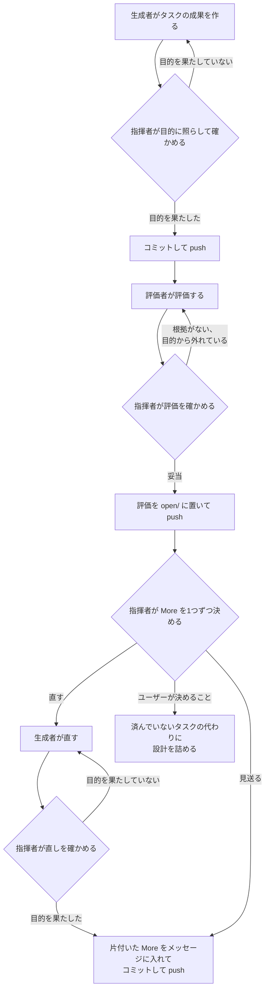

# rn 設計書

## rn が実現すること

- ざっくりしたゴールから、計画と設計を、調べながらユーザーと話して、認識が揃うまで詰める。
- そこから先はユーザー抜きで作り、作っていない評価者が、設計で決めた合格の基準で確かめる。
- ユーザーに聞くのは、計画、設計、成果物のレビューと、ユーザーが決めることだけ。
- 何をどう判断したかは、プルリクエストとコミットメッセージで読める。
- 会話を新しくしても、翌日でも、push 済みのブランチから止めたところの続きができる。

## 作るものはすべて、本質的な観点で作り、同じ観点で確かめる

```mermaid
flowchart TD
    E(["essentials.md:<br/>本質的な観点"])
    M["作る人"]
    V["確かめる人"]
    E -->|"作るときに目指すこと"| M
    E -->|"確かめるときに問うこと"| V
```

計画と設計は指揮者が作り、成果物は生成者が作る。確かめるのは、指揮者と評価者。

手順は渡さない。手順は字面どおりに守られて、状況が想定と違うと的を外し、書いた人が想定した場面でしか役に立たない。観点なら、磨くほど `rn` が良くなり、動かすモデルが良くなるほど得をする。

確かめた結果は、Good と More で返す。Good は目指すことに役立っていて残すべきもの、More は目指すことを満たしていないところと、そのせいで読む人に何がまずいか、どう直すか。

`rn` を良くするときは essentials.md を磨く。文書の書き方は essentials.md に持たず、ユーザーが入れている書き方のスキルやルールに従う。

## 指揮者が決め、生成者が作り、作っていない評価者が評価する

```mermaid
flowchart TD
    U(["ユーザー"])
    C["メインの会話の指揮者"]
    G["タスクごとに立つ生成者"]
    E["評価ごとに立つ評価者"]
    U -->|"会話、コマンド"| C
    C -->|"問い、根拠を添えたレビュー依頼"| U
    C -->|"タスク、直す More"| G
    G -->|"作業ツリーの編集、セルフチェック"| C
    C -->|"評価するコミットか文書"| E
    E -->|"評価"| C
```

- 次の一手を決めるのも、git を使うのも、指揮者だけ。

  作業を頼んだ者が、それが目的を果たすことに責任を持つ。評価の字面どおりに動くと、ゴールに役立っている作業までやり直すことになる。

- 評価者には、ユーザーが合意したことと言ったことだけを渡し、どう作ったかは渡さない。

  作った人の見方は自分の理由に寄るので、作っていない人がユーザーの立場で見る。

- ユーザーが決めるのは、好み、範囲、費用対効果、プロダクトのあるべき姿、収束しないやり方、成果物がゴールを達成したかだけ。

  それ以上を聞くと、ユーザーは作業を任せきれなくなる。

## 文書が作業を先導し、今の状態だけを持つ

```mermaid
flowchart TD
    U(["ユーザー"])
    C["指揮者"]
    G["生成者"]
    E["評価者"]
    S["steering.md:<br/>進め方"]
    RD["README と設計書:<br/>あるべき姿と作り方"]
    O["open/:<br/>まだ片付いていない項目"]
    M["コミットメッセージ:<br/>判断の1行と、片付いた項目"]
    C -->|"書く"| S
    C -->|"ユーザーと詰めて書く"| RD
    G -->|"セルフチェック"| O
    E -->|"評価"| O
    U -->|"/rn:gm の言葉"| O
    C -->|"/rn:dn のメモ"| O
    O -->|"指揮者が決めて片付ける"| M
```

- 進め方も作り方もあるべき姿も文書の上で議論し、文書は作業より先に変わる。
- 文書には経緯を書かず、経緯はコミットメッセージが運ぶ。

  文書に経緯を残すと、今成り立っていることが埋もれる。

- 片付いた項目は、そのコミットで `open/` から消え、空になったファイルも消える。

  残っている項目は指揮者が要るか要らないかを決めるので、何も漏れない。レビューで止まるときは、いつも空。

- 生成者は `steering.md`、README、設計書を読み、評価者はそのうちユーザーが合意したところを読む。ユーザーは全部をプルリクエストで読む。
- `steering.md` の項目と `open/` のファイル名は、後の版の `rn` も読む約束。

  `steering.md` の項目は、そのひな形が持つ。`open/` のファイル名は `{NN}-{kind}-{about}.md` で、kind は `check`、`evaluation`、`feedback`、`notes`。

## セッションの流れ

```mermaid
flowchart TD
    ON(["/rn:on"])
    W["計画をユーザーと詰める"]
    P["計画を書き、評価する"]
    PS{{"計画のレビュー"}}
    D["設計をユーザーと詰めて<br/>README と設計書に書き、評価する"]
    DS{{"設計のレビュー"}}
    P2["成果物を作るタスクを計画し、<br/>評価する"]
    T["タスクを1つずつ進める"]
    EV["成果物を評価する"]
    T2["足したタスクを進める"]
    FS{{"成果物のレビュー"}}
    END(["プルリクエストを ready にする"])
    ON --> W --> P --> PS
    PS -->|"/rn:gm"| W
    PS -->|"/rn:ty"| D
    D --> DS
    DS -->|"/rn:gm"| D
    DS -->|"/rn:ty"| P2
    P2 --> T
    T -->|"ユーザーが決めることが出た"| D
    T -->|"タスクがすべて済んだ"| EV
    EV -->|"足すタスクがある"| T2
    T2 --> FS
    EV -->|"足すタスクがない"| FS
    FS -->|"/rn:gm"| T2
    FS -->|"/rn:ty"| END
```

- 詰めるときは、指揮者が調べ、手を動かしながら、ユーザーと1点ずつ話し、認識が揃うまで続ける。

  ユーザーの答えで調べる先が変わるので、調べ終えてから聞くのではなく、話しながら調べる。

- 設計のレビューは、設計書を変えるかどうかにかかわらず、いつもある。

  実装してから認識のずれに気づくと、手戻りが大きい。

- 成果物を作るタスクは、設計が決まってから立てる。

  設計の前に立てたタスクは、設計が決まるとほとんど書き直しになる。

- `/rn:ty` は承認してレビューを閉じ、止まる。次のステップは「続けて」か `/rn:up` で始まる。
- `/rn:gm` はフィードバックを受け取って止まり、次のステップはそのレビューの前に戻る。計画と設計はユーザーと詰め直し、成果物はタスクを足して進める。

  言葉どおりに直すだけでは、フィードバックの裏にある認識のずれが残る。

- `/rn:dn` はどこでも中断し、`/rn:up` はそこから次のレビューまで進める。

  以前の `rn` で始めたセッションは、`/rn:up` が古い記録からゴールを詰め直し、新しい計画のレビューで止まる。

## 作るもの1つの流れ

```mermaid
flowchart TD
    M["生成者がタスクの成果を作る"]
    K{"指揮者が目的に照らして確かめる"}
    C["コミットして push"]
    V["評価者が評価する"]
    KE{"指揮者が評価を確かめる"}
    O["評価を open/ に置いて push"]
    D{"指揮者が More を1つずつ決める"}
    F["生成者が直す"]
    FK{"指揮者が直しを確かめる"}
    S["片付いた More をメッセージに入れて<br/>コミットして push"]
    U["済んでいないタスクの代わりに<br/>設計を詰める"]
    M --> K
    K -->|"目的を果たしていない"| M
    K -->|"目的を果たした"| C
    C --> V
    V --> KE
    KE -->|"根拠がない、<br/>目的から外れている"| V
    KE -->|"妥当"| O
    O --> D
    D -->|"直す"| F
    F --> FK
    FK -->|"目的を果たしていない"| F
    FK -->|"目的を果たした"| S
    D -->|"見送る"| S
    D -->|"ユーザーが決めること"| U
```

- 計画と設計も同じ流れで、作って直すのが指揮者になる。成果物は「評価者が評価する」から始まる。
- More は、直せば目的に近づくか、直しても Good が保たれるかで決める。

  互いに食い違う More は、ゴール、観点、文書のどこかに決まっていないことがあるしるしなので、片方を選ばず、そこで決める。

- ゴールから決められない More は、ユーザーに渡す。

  README や設計書を変える直しも、収束しないやり方も含む。同じ More が繰り返し出るときや、直すたびに新しい More が出るときが、収束しないやり方。

- 評価は1回で、直しはもう一度評価しない。

  何回評価するかは本来は指揮者が決めることだが、AI だけで評価を回すと本質的でない指摘が続いて収束しないので、今は1回評価したら指揮者とユーザーが決める。
