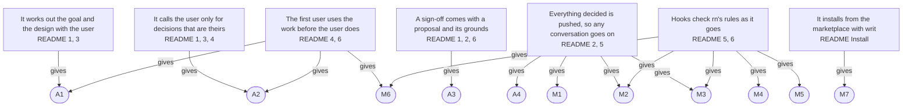
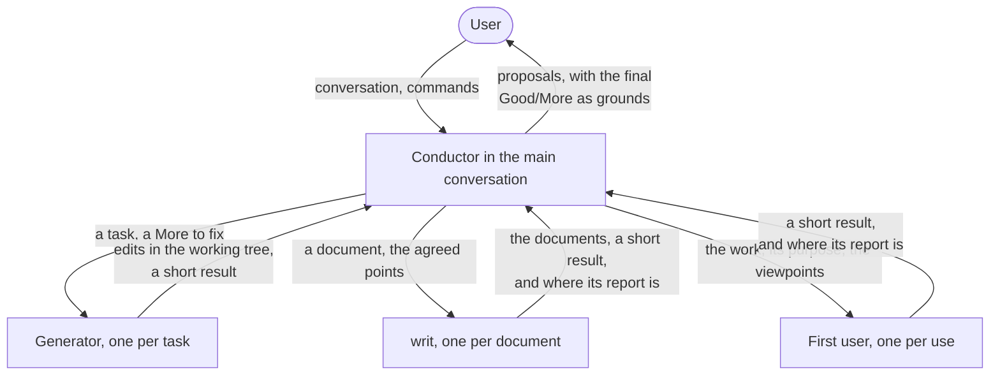
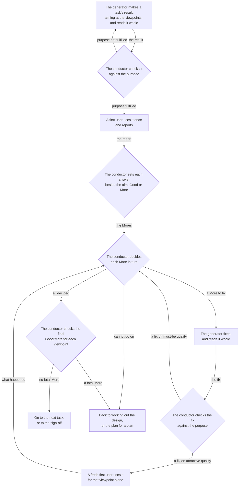
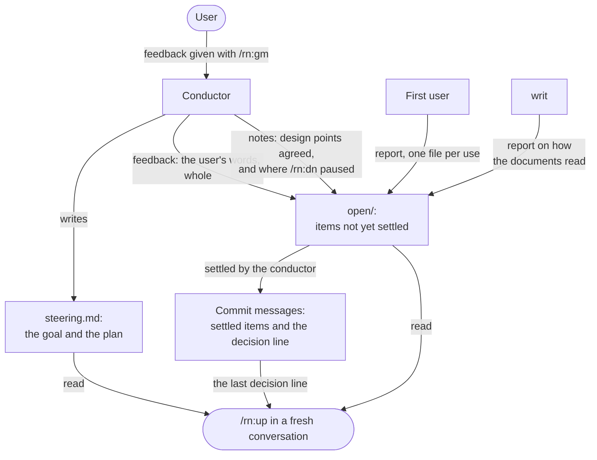

# rn design

## Why rn is built

Most AI agents need a carefully written prompt and some babysitting. The prompt is where what the
user says and what they want part: an agent that takes the words as they are builds what was said,
and the user finds out at the end. Babysitting is where the work is checked: an agent asked to judge
its own work tends to praise it, so the user re-reads everything to know whether it does its job.

`rn` takes both off the user. It works out with them what they really want, carries the work to it,
and has the work used, before the user sees it, by an agent that knows nothing of how it was made.
The user's time goes to the decisions only they can make.

## Acceptance criteria

What `rn` must give for a user to choose it, and what a user takes for granted. The first kind is
attractive quality and the second must-be quality, after the Kano model, which separates attributes
that satisfy when present but are not missed when absent from those that are not noticed when present
but dissatisfy when absent (Kano, Seraku, Takahashi and Tsuji, "Attractive quality and must-be
quality", Journal of the Japanese Society for Quality Control 14(2), 1984). Each criterion has an ID,
by which the features below and the [verification document](./verification.md) refer to it.

### Attractive quality

- A1: The user gets what they really want, though they start from rough words.
- A2: The user is called only for decisions that are theirs, and does not watch over the work.
- A3: At a sign-off, the user decides from the proposal, without re-reading all the work.
- A4: Work that takes days goes on, the next day or in a fresh conversation, from where it stopped,
  without the user explaining anything again.

### Must-be quality

- M1: The user's default branch changes only when they merge.
- M2: Every decision is committed and pushed as it is made, with a line that says what was decided
  and what comes next.
- M3: Every settled item is whole in the commit that settles it, so the record shows why things came
  out as they did.
- M4: `steering.md`, the names of the files in `open/`, and the verification document keep the form
  every command reads them by, and every ID they refer to exists.
- M5: A sign-off is passed only by the user's approval, and is put to the user with nothing
  unsettled behind it.
- M6: What the first user reports is what the user would get, since it knows nothing of how the work
  was made.
- M7: `rn` installs from the marketplace and passes its strict validation.

## The features that give them


```mermaid
flowchart TD
    F1["It works out the goal and the design with the user<br/>README 1, 3"]
    F2["It calls the user only for decisions that are theirs<br/>README 1, 3, 4"]
    F3["The first user uses the work before the user does<br/>README 4, 6"]
    F4["A sign-off comes with a proposal and its grounds<br/>README 1, 2, 6"]
    F5["Everything decided is pushed, so any conversation goes on<br/>README 2, 5"]
    F6["Hooks check rn's rules as it goes<br/>README 5, 6"]
    F7["It installs from the marketplace with writ<br/>README Install"]
    A1(["A1"])
    A2(["A2"])
    A3(["A3"])
    A4(["A4"])
    M1(["M1"])
    M2(["M2"])
    M3(["M3"])
    M4(["M4"])
    M5(["M5"])
    M6(["M6"])
    M7(["M7"])
    F1 -->|"gives"| A1
    F2 -->|"gives"| A2
    F3 -->|"gives"| A1 & A2 & M6
    F4 -->|"gives"| A3
    F5 -->|"gives"| A4 & M1 & M2 & M3
    F6 -->|"gives"| M2 & M3 & M4 & M5 & M6
    F7 -->|"gives"| M7
```

Under each feature are the README stages where it works.

## Who does what, and what holds throughout

- The conductor is the main conversation with the user, and decides every next move.
- A generator makes one task's result.
- The first user uses a piece of work as its receiver would, before the user does, and reports what
  it understood and what happened, without judging it.
- A viewpoint is a question worked back from the purpose of the work, answered by what happened when
  the work was used.
- The conductor sets each answer in a report beside the aim and gives a Good, what serves the aim,
  or a More, what falls short of it.
- A fatal More is one without whose fix the goal cannot be achieved, and whose fix only the user can
  decide.
- `writ`, a plugin `rn` depends on, writes the README, design document, and verification document,
  and checks how they read.
- Each decision is committed with a decision line that says what was decided and what comes next.

    The commit where `rn` stops for the user is the stop commit.

Seven policies hold across the features:

- Only the conductor decides what happens next.

    Decisions are made where the goal and the whole conversation are known, so a fix keeps what
    already serves the goal. A first user sees only the work, and fixes decided by its words would
    rebuild what works.

- Only the conductor uses git.

    Every commit then records a decision someone actually made, so a later conversation goes on from
    real decisions, not from one nobody made.

- Everything is made and checked with the same viewpoints, and `rn` is improved by sharpening them,
  not by adding steps.

    A viewpoint asks what the work is for, so it fits situations no one foresaw and the user gets
    work that serves the goal. An added step is followed even where it misses.

- Every role is handed the paths of what it reads, never a summary of them.

    Each role then reads the thing itself, so what it makes or finds holds for the thing. A summary
    carries the summarizer's reading, and the role would work from that instead.

- Every agent the conductor calls leaves its whole result in files and returns only a short result
  and where those files are.

    A whole result in the conversation is too long to be read, crowds the conductor's context, and
    is lost when the conversation is summarized; the files keep it for whoever wants to check.

- Decisions are written into documents before the work that follows them, and the documents hold
  only what holds now.

    A decision written down outlives a cleared conversation, and a document without history shows
    what holds at a glance, so the user never explains again what was already decided.

- Attractive quality comes first, and must-be quality after.

    Attractive quality is why the user chooses the work, so effort goes there while the goal is
    still open. Must-be quality is easier to build and check, and started first it takes the effort
    while why the user would choose the work goes unchecked.

## It works out the goal and the design with the user

Gives A1.

### Hearing what the user really wants

The conductor works out the plan before anything else, since what the user gets is what they meant
only when the goal is theirs (README, 1. Start). It makes the plan itself, not through a generator,
because the plan is worked out in the conversation it holds. The plan has its own sign-off, because
a design worked out on a wrong goal is wasted.

How it asks follows the know-how of `grilling` in
[mattpocock/skills](https://github.com/mattpocock/skills) (MIT, at commit `d81f3a1`, 2026-09-29):

- What is to be decided is a tree, each decision hanging off the ones it rests on.
- Only a question whose prerequisites are settled is asked, so no question guesses at an answer not
  yet heard.
- Each question comes with the answer `rn` recommends.
- Facts are looked up, never asked: what the repository, the official documentation, or best
  practice can settle is the conductor's to find, and only decisions go to the user.
- Hearing is done when nothing is silently assumed.

`rn` asks one point at a time, where `grilling` asks every open question in one round, since each
answer is recorded as agreed before the next point. To this, `rn` adds its own part. It finds what
the user really wants from the purpose behind their words and the ideal that purpose calls for,
since the words alone carry the gap the README's example shows: every file ending in .ts would have
let the bugs through. Each point is written into `steering.md` as it is agreed, so a pause loses
none.

`rn` takes the know-how, not the skill. `grilling` asks in rounds and leaves the record to the skills
that call it, and `rn` needs each point recorded as it is agreed. The copy is kept to `d81f3a1`, and
when `mattpocock/skills` changes these skills, the maintainer reads the change and decides whether
`rn` takes it in, since nothing reaches `rn` by itself.

### Acceptance criteria, split by the Kano model

The goal is met when its Acceptance criteria hold, and each task's purpose when its Completion
criteria hold. Both are split into Attractive quality, what would make the user choose the result,
and Must-be quality, what the user takes for granted. Every acceptance criterion has an ID, `A1`,
`A2`… for attractive and `M1`, `M2`… for must-be. The design, the verification checks, the tasks,
and the Good and More on the deliverable refer to criteria by ID, so any of them can be followed back
to what the user approved, and a criterion that nothing serves shows.

The split names what the policy of attractive quality first needs to tell apart. Without it, a
criterion the user would choose the work for and one they take for granted sit in one list, and the
easier one gets built first.

### The design and the verification document

The design is worked out the same way, with how the user will see that it works. `rn` decides what
goes into the README, design document, and verification document, and `writ` writes them, as a
generator makes a task's result. How a document reads is checked by `writ`'s viewpoints, kept in one
place, so the documents the user approves read as well as any `writ` writes; two copies would drift
apart. Whether the design achieves the goal is `rn`'s, so the design is used by the first user
against `rn`'s own viewpoints, as the plan, each task's result, and the deliverable are. Points
agreed while working out the design wait in `open/` until `writ` writes them, so a pause loses none.

The verification document holds, for each attractive criterion, the scene where the product is used
as its user would use it, on the golden path, and what passes, and the checks a machine makes every
time, each naming the criteria it checks; a must-be criterion no machine can judge is named with
the scenes where it shows in use. Attractive quality is confirmed by using the product and
comparing what happened with what was aimed for. Edge cases and other flows are not covered in
advance: a must-be gap is fixed when it shows up in use, since it is visible and quick to fix, while
covering everything adds checks that can all pass with no one having confirmed the attractive
quality. What a machine can judge is checked by machine every time, since it costs nothing to run
and gives the same answer each time. Verification is its own document, not a section of the design,
since it is what the deliverable is checked by, and keeping it apart lets the first user be handed
it alone.

Each scene fixes in advance everything its pass depends on, such as what the user says, knows, and
decides, since whoever runs a scene after seeing the work could otherwise choose those so that it
passes. The document has a form the conductor finds each scene by, and hook check 3 traces each ID
by:

- `## Golden-path scenes` has a `### <ID>: <criterion>` heading for each attractive criterion, and
  under it each scene as a list item, with what passes indented below it, starting "Passes when".
- `## Machine checks` is a table whose `Criteria` column names the IDs each check checks.
- A must-be criterion no machine can judge is named by its ID in the "Passes when" of a scene.

`rn`'s own [verification document](./verification.md) has the same form.

There is always a Design sign-off, even when the documents do not change, and it approves the design
and verification documents together, since the user sees how the product will be built and how it
will be checked before anything is built (README, 3. Work out the design).

### Tasks

Tasks that make the deliverable are planned only once the design is approved; tasks planned before
the design would mostly be rewritten once it is. How they are planned follows the know-how of
`wayfinder` in the same repository and commit:

- The destination comes first: the goal and its Acceptance criteria are agreed before any task
  exists, since they fix what every task is measured against.
- Decisions are settled one at a time, each before the tasks that rest on it.
- What cannot yet be stated precisely is kept visible under Not yet specified in `steering.md`,
  not cut into tasks early, and becomes a task once it can be stated.

`rn` takes the know-how, not the skill: `wayfinder` keeps its map and decision tickets on the issue
tracker, settles one ticket per session, and plans decisions rather than the deliverable, while `rn`
keeps its plan in `steering.md` on the pull request and carries the work to the deliverable.

Each task names the acceptance criteria it serves. Tasks first raise attractive quality until the
goal is nearly achieved, and finish must-be quality last, by the policy above.

### Feedback at a sign-off

Feedback is the words the user gives with `/rn:gm`, or, when they give none, the review comments
they wrote on the pull request for that sign-off, each with its place, since the user reads the work
on the pull request and can comment where they read. The comments for that sign-off are those the
`gh` user wrote on the pull request after its stop commit, since comments from before it were made
on the work as it stood before this proposal. Either is kept whole in a `feedback` item in `open/`,
quoted in the user's own words and language even when the record is in another, since the work is
then measured by what the user said, not by a translation of it.

After feedback at a sign-off, the session goes back to before it: a plan or a design is worked out
again with the user, taking the mismatch behind the feedback as the first point, since fixing only
what the words say leaves the mismatch in place. Feedback on the deliverable that changes what the
product should be, or how it is built, goes back to working out the design, through a Design
sign-off, since the README, design document, and verification document are what the user approved
the product to be. Work that goes back to working out the plan or the design, from feedback or from
a fatal More, always stops at that sign-off again before anything is built on it, even when the user
answered every question along the way: answers settle points one at a time, and only the sign-off
shows the user the whole they are about to have built.

## It calls the user only for decisions that are theirs

Gives A2.

The user is asked only what the goal, the repository, the official documentation and best practice
cannot settle, such as how much effort is worth how much safety, and whether the deliverable achieves
the goal. Everything else is looked up or decided from the goal, so the user's time goes only to what
is theirs.

Whenever `rn` calls the user, at a question or a sign-off, it comes with what it proposes to do next
toward the goal, and why. A report of where things stand would leave the user to work out what to do
next, which is the work they left to `rn`.

A question is put so the user can answer it on the spot. When the work waits on someone outside,
what to do meanwhile is such a question, not a stop: a stop leaves the user unsure what `rn` is
waiting for.

Approving and giving feedback each stop, since that is where the user may clear the conversation.
The user goes on by saying so in the same conversation, or by `/clear` and then `/rn:up`; both go on
from what is pushed, so they lead to the same next move (see Where rn stops).

Once approved, the goal goes back through the Plan sign-off, and the README, design document, and
verification document through the Design sign-off, only when what they say changes without the user
having decided it. Two kinds of change are written without stopping: a correction that changes
nothing they say, such as a line number gone stale, and a change the user made by answering a
question while the work goes on from what was approved, not after it went back to working out the
plan or the design. The next proposal shows them first, as changed since the last approval, so the
user approves what they read without being stopped for what they already decided.

## The first user uses the work before the user does

Gives A1 and A2, and M6.


```mermaid
flowchart TD
    U(["User"])
    C["Conductor in the main conversation"]
    G["Generator, one per task"]
    W["writ, one per document"]
    F["First user, one per use"]
    U -->|"conversation, commands"| C
    C -->|"proposals, with the final<br/>Good/More as grounds"| U
    C -->|"a task, a More to fix"| G
    G -->|"edits in the working tree,<br/>a short result"| C
    C -->|"a document, the agreed points"| W
    W -->|"the documents, a short result,<br/>and where its report is"| C
    C -->|"the work, its purpose, the viewpoints"| F
    F -->|"a short result,<br/>and where its report is"| C
```

The generator and the first user are split after the generator/evaluator split in Anthropic's
[Harness design for long-running application development](https://www.anthropic.com/engineering/harness-design-long-running-apps)
(Prithvi Rajasekaran, 2026-03-24): an agent asked to evaluate its own work tends to praise it, and
an evaluator kept apart is easier to make skeptical than a generator is to make critical of itself.
That article's evaluator clicks through the running application the way a user would, and judges.
`rn` keeps the use and leaves out the judging: the first user reports only what it understood from
the work and what happened when it did as the work says, and the conductor, who knows the aim, sets
those facts beside it and gives the Good and More. Comparing with the aim is the conductor's, since
it holds the goal and everything the user agreed; the first user's part is the facts of use, which
anyone can check at their place.

The conductor stays the same conversation throughout the session, since what was talked through
stays with it. A fresh generator is started for each task, so its attention holds only that task, a
fresh `writ` for each document, and a fresh first user for each use; each ends when done. Every one
of them returns to the conductor, never to the user, so the conductor's turn ends only when it stops
for the user or asks them a question.

### Keeping the first user apart, by how it is defined

The first user is there to use the work knowing nothing of how it was made, so what it reports is
what the user would get. This is held first by how the agents are defined, in `rn/agents/`, since a
definition holds however an agent is called, while watching every way it can be called grows
tangled:

- The first user, `rn:first-user`, is a fresh subagent: it does not carry over the conversation.
- Its definition sets `omitClaudeMd`, so the project's and the user's `CLAUDE.md`, which carry how
  the work is made, do not reach it.
- It is handed only the work and its purpose: the paths of the work, of the viewpoints, and of what
  the user agreed to, the goal and the task's purpose in `steering.md`, the agreed parts of the
  README, design document, and verification document, and the user's feedback in their own words,
  and the path of the file its report goes to.
- The generator, `rn:generator`, has no Agent tool, so it cannot call the first user and shape what
  it is told.
- The conductor calls the first user by name, `rn:first-user`.

What a definition cannot hold is left to hooks: stopping the first user, the generator, and `writ`
from committing or pushing, keeping the first user's writing to its own report, and keeping it from
reading the maker's account, that is, commit messages, notes, and earlier reports (see Hooks check
rn's rules as it goes). A definition can take a tool away but not part of one, and the first user and
the generator need the shell to use and to build the work.

The hooks hold this only for what the first user writes and reads with Claude Code's file tools. A
hook sees a shell command's text, not every file the command touches, so a write or read made through
the shell, such as a build writing its output or a script reading `open/`, is not stopped. This is
accepted, since stopping it would take the shell the use needs. What remains is held otherwise: the
first user is handed no path to the maker's account and nothing of how the work was made, so it has
no reason to look for it, and what it writes stays in the working tree, where the conductor, the only
one who commits, sees it before committing.

`rn` does not use a skill's `agent` field to run a skill as one of its own agents, since the
documentation does not say that field can name a plugin's agent.

### Viewpoints

Everything `rn` makes, such as a plan or a task's result, has a purpose, stated as what whoever
receives it can then do. For a plan, that is "can the conductor carry the work to the goal by it",
not "does it list tasks". Its viewpoints are a few essential questions worked back from that purpose,
each answered by what happened when the first user used the work, such as "Checking each fact the
plan rests on at its source, which did not hold?" rather than "Is each fact checked?". A question of
whether something is there, or is good, is answered "yes" by looking the work over without using
it, and a work no one can use passes; answered by what happened in use, the answer is a fact the
conductor can set beside the aim. Each question asks about one point, so the point that falls short
does not hide behind one that holds, and has grounds that say what the receiver gains, so it is
followed by its intent where it names nothing. Every file also asks which parts of the work were
used toward its purpose and which were passed over unused: a question of whether something is good
gets answers only about the parts that were used, so a part no one needs would never come to light.
This follows `writ`'s essentials for essentials (`writ/references/essentials/essentials.md` at
`0056078`). How to use the work to find the answer is left to the first user.

Each viewpoint file in `rn/references/essentials/` is for one thing `rn` makes or says: the plan, the
design, a task's result, the deliverable, a report, and what the conductor decides and says. Its
viewpoints are not split by Kano quality: a question stays only if its answer is used to judge
whether the work achieved its purpose, whatever its quality, so the first user gives full attention
to each. The
Kano split is used where it changes what is done, in the Acceptance criteria and the tasks and checks
tied to them, and the plan's viewpoint file asks which work on must-be quality comes before the
attractive criteria are nearly met.

For each viewpoint the first user answers in one of two forms: "from the work I understood this",
or "doing as written, this happened". It gives no Good or More. The conductor sets each answer beside
the aim, the purpose and the criteria by ID, and gives the Good or More. A Good adds what the user
gains, which a fix must not take away; a More adds what the user will struggle with because of it.
Both point to a place in the real thing. How to fix is left to the conductor's decision, made from
the goal and the whole conversation.

### Each result is used once and settled by the conductor


```mermaid
flowchart TD
    M["The generator makes a task's result,<br/>aiming at the viewpoints, and reads it whole"]
    K{"The conductor checks it<br/>against the purpose"}
    V["A first user uses it once<br/>and reports"]
    KE{"The conductor sets each answer<br/>beside the aim: Good or More"}
    D{"The conductor decides<br/>each More in turn"}
    F["The generator fixes,<br/>and reads it whole"]
    FK{"The conductor checks the fix<br/>against the purpose"}
    R["A fresh first user uses it<br/>for that viewpoint alone"]
    J{"The conductor checks the final<br/>Good/More for each viewpoint"}
    N["On to the next task,<br/>or to the sign-off"]
    U["Back to working out the design,<br/>or the plan for a plan"]
    M -->|"the result"| K
    K -->|"purpose not fulfilled"| M
    K -->|"purpose fulfilled"| V
    V -->|"the report"| KE
    KE -->|"the Mores"| D
    D -->|"a More to fix"| F
    F -->|"the fix"| FK
    FK -->|"a fix on attractive quality"| R
    FK -->|"a fix on must-be quality"| D
    R -->|"what happened"| D
    D -->|"all decided"| J
    D -->|"cannot go on"| U
    J -->|"no fatal More"| N
    J -->|"a fatal More"| U
```

A generator reads its result whole once made, and again after each fix, and fixes it until no
viewpoint falls short as far as it can see, since one fix, such as a word changed or a part moved,
can break another place. Whoever made a thing knows what it means and cannot see where it is unclear;
the first user stays for that.

Every Good is checked at its place in the real thing as strictly as every More, so a Good the user
reads in a proposal holds, and they can trust it without reading that part. A Good that does not
hold is the most dangerous point in a session: no one looks again at what is called good, so the flaw
it hides would reach the user's approval unseen. A Good is given only where the report shows what
happened there; a viewpoint the report leaves unanswered goes to a fresh first user for that
viewpoint alone. Then the conductor decides each More in turn:

- A More whose fix brings the work closer to its purpose, and keeps the Goods, is fixed.

    The fix starts from what the work should be for its purpose, not from the place the More names:
    the gap between that and the real thing says what to change, wherever the same cause shows. A
    fix made only where the More points leaves the cause to show up again elsewhere.

- A More whose fix would not bring the work closer is let go, with the reason.

    Its cost, or that the fix needs the README, the design document, or the user, is never that
    reason.

The repetition ends as either settled or cannot go on. It cannot go on when the same More keeps
coming back, when each fix brings a new More, or when a fix needs the README, design document, or
verification document changed, unless what is fixed is the design itself.

Every fix is checked by the conductor against the purpose. A fix to a More on attractive quality is
then used by a fresh first user given only that viewpoint and its place: whoever made a fix is the
worst placed to see that it falls short, and a More called fixed that still holds reaches the
proposal as a Good. A fix to a More on must-be quality, one bearing only on a must-be criterion or a
task's must-be Completion criteria, is not used again, since a must-be gap is visible and quick to
fix, and the effort of another use goes to attractive quality instead. The final check looks again
at every Good a fix touched, since a fix can take a Good away. The whole is not used again, since
each fresh use can raise new points that are not essential, and repeating need not settle; asking
about one viewpoint keeps the check to what was fixed.

For the same reason the whole deliverable is used once, when the tasks planned after the last Design
sign-off are done: a first user runs each scene of the verification document, and the machine checks
run. The conductor gives the Good and More by criterion ID. The Mores it raises are fixed as added
tasks, and a must-be gap that shows up in the use is fixed the same way. The user can check every
final Good and More at its place, and at a sign-off ask with `/rn:gm` for anything, another use
included.

When Mores contradict each other, `rn` does not pick one. They are a sign that something is
undecided in the goal, the viewpoints, or a document, so that is what gets decided.

A plan follows the same flow, with the conductor making and fixing it, and so does the design, with
`writ` writing and fixing it.

## A sign-off comes with a proposal and its grounds

Gives A3.

A fatal More, or work that cannot go on, goes back to working things out with the user, that More
first, instead of to the sign-off, since having the user approve something that is no use until
fixed only spends their time.

Otherwise `rn` gives the proposal: what it wants to do next, such as building on this design, and
why that serves the goal. Then, as its grounds, it gives under every viewpoint, put in the user's
terms, the final Good and More, each at its place in the real thing, with the criterion ID it bears
on and its grounds, claiming no more than that place shows. The points and fixes along the way are
left out: the user approves the final state, and with those they would have to work out where each
applies now.

The user is given the body of the stop commit in the conversation language, adding nothing and
leaving nothing out, so what the user read and what a later conversation gives say the same. When
the same sign-off is proposed again, each More of its last proposal stays, at its place as it is
now, until a fix settles it, since the user approves the final state and a More left out of it is
one they never see.

## Everything decided is pushed, so any conversation goes on

Gives A4, M1, M2, and M3.


```mermaid
flowchart TD
    U(["User"])
    C["Conductor"]
    F["First user"]
    W["writ"]
    S["steering.md:<br/>the goal and the plan"]
    O["open/:<br/>items not yet settled"]
    M["Commit messages:<br/>settled items and the decision line"]
    UP(["/rn:up in a fresh conversation"])
    C -->|"writes"| S
    F -->|"report, one file per use"| O
    W -->|"report on how<br/>the documents read"| O
    U -->|"feedback given with /rn:gm"| C
    C -->|"feedback: the user's words, whole"| O
    C -->|"notes: design points agreed,<br/>and where /rn:dn paused"| O
    O -->|"settled by the conductor"| M
    S -->|"read"| UP
    O -->|"read"| UP
    M -->|"the last decision line"| UP
```

Every decision is committed and pushed as it is made, so `/rn:up` takes up the next move, in the
conversation language that `steering.md` records. For a session started under an older version of
`rn`, `/rn:up` works the goal out again from the old record and stops at a new Plan sign-off, since
an older record may not hold why the user wants the goal, and every later decision is judged by it.
What an old design approved is kept as agreed points of the design, for `writ` to write and the user
to see at the Design sign-off, since the design document changes only that way.

### The pull request

A session works on its own branch with a draft pull request, so the user's default branch changes
only when they merge. `/rn:on` makes `steering.md` and the draft pull request at once, from the user's
first words, and each point agreed updates them, so a stop at any moment loses nothing agreed. The
user reads everything on the pull request, where diffs, long documents, and diagrams render, and the
record stays with the code.

When the user approves the deliverable, the pull request is marked ready for review, since the work
is then what the user approved; the merge stays the user's.

The pull request body links `steering.md` and carries what GitHub needs to connect the work:
`Closes #N` for an issue the work completes, `Refs #N` for one it only serves, and the pull requests
it replaces. The body holds no copy of the plan, since a copy drifts from `steering.md`.

When a session is taken up, and before each sign-off, its branch is brought up to the latest default
branch on the remote. When that changes what the plan or the design rests on, that is worked out
again before the sign-off. A branch left behind would have the user approve work on files the
default branch no longer has, found out only at the merge.

### open/ and the record in commit messages

Items go in `open/` as they come in, so nothing needed to go on is only in the working tree or the
conversation:

- A `report` is written by whoever the conductor calls to use or check the work: a first user, or
  `writ` on how the documents read.
- A `feedback` item is written by the conductor, holding the user's feedback at a sign-off.
- A `notes` item is written by the conductor, holding design points agreed and waiting for `writ`,
  such as those an older session's design approved, or where a task stands when `/rn:dn` pauses it.

A file is named `{NN}-{kind}-{about}.md`. The kind says what it holds. The number is one more than
the highest in `open/`, or `01` when `open/` is empty, so it keeps the order among the items open
together and is chosen from `open/` alone; once an item is settled, its place in the order is its
commit.

The conductor names a report's file, one for each use it asks for: task #3's result is one use, and
one viewpoint of it after a fix is another, with its own file, so the report from before the fix
stays as it was found. The report goes whole into that file, and only a short result and the file's
place come back: one line per viewpoint saying what was understood or what happened, and where (from
`writ`, which sets its own first user's answers beside its aim, a Good or More and where), and in
full only what the user must decide. The conductor sets those lines beside the aim, reads the file
wherever a line does not show enough, and commits each report as it arrives, so the user can read it
on the pull request.

A settled item leaves `open/` in the commit that settles it, copied whole into that commit's message
with what was decided on each point, so the record lives in git and leaves no file behind in the
repository:

- A task's reports, its first use and every use after a fix, are settled together in the commit
  that decides what comes of the task, such as its purpose fulfilled, in the order of their numbers.

    The record then shows each finding beside what became of it, in the order it happened.

- The reports on a plan or a design are settled before its sign-off stop, and a `feedback` item
  before the next sign-off stop, once the work it asked for is done.

    The user approves the final state, so nothing of it is left open when they are asked.

- Asking for the same use again, such as one viewpoint after a second fix, writes the same file
  anew, since only the latest applies to the work as it is now. The conductor first settles the
  earlier report, taking it out of `open/` in a commit that carries it whole with what was decided
  on it.

    The earlier report then stays in the record like any other, and the first user never reads it.

A settled report looks like this in its commit message:

```
rn: settle the reports on #3 move src/cart

04-report-3-cart.md:
- Does a wrong type in the cart fail the build?
  Doing as written: I passed "2" as the quantity to src/cart/price.ts:12 and ran the build; it built.
- Good A1: src/cart/total.ts:8 types the total as number; the cart bug fails the build
- More A1: src/cart/price.ts:12 still takes `any` for the quantity; the cart bug would ship
  → fixed: typed the quantity as number

05-report-3-cart-wrong-type.md:
- Does a wrong type in the cart fail the build?
  Doing as written: I passed "2" as the quantity to src/cart/price.ts:12 and ran the build; it
  failed, saying a string is not a number.
- Good A1: src/cart/price.ts:12 types the quantity as number; the cart bug fails the build

● #3 move src/cart ── decided: purpose fulfilled → #4
```

- Each report is copied whole under its file name, and each Good and More follows with its
  criterion ID.

    What the first user found and what the conductor made of it stay readable after `open/` is
    emptied.

- Each More ends with `→ fixed:`, `→ let go:`, or `→ to the user:`.

    The user and a later conversation see what became of each, and a More let go keeps its reason,
    the way not chosen.

- Feedback is quoted in the user's own words and language; everything else is in the artifact
  language.

    The words the work is measured by stay the user's, and the rest of the record reads in one
    language.

- The decision line comes last, and a stop commit's ends as its kind says in Where rn stops.

### Where rn stops

`rn` stops for the user in four ways, each in a stop commit whose decision line says which it is, so
`/rn:up` reads from the last decision line what it takes up and what `open/` may hold:

| Stop | `open/` holds | The decision line, for example |
|---|---|---|
| A sign-off, with the proposal | only `notes` of design points waiting for `writ` | `● #2 Design sign-off ── proposed: build on this design → waiting for #2 Design sign-off` |
| After `/rn:ty` | the same as at the sign-off | `● #2 Design sign-off ── approved → #3 move src/cart` |
| After `/rn:gm` | that, and the `feedback` item | `● #2 Design sign-off ── feedback in 03-feedback-design.md → working out the design again` |
| A pause, on `/rn:dn` | whatever is not yet settled, and a `notes` item on where the task stands, its edits committed beside it | `● #4 move src/checkout ── half done: order.ts moved, payment.ts next → paused at #4 move src/checkout` |

- At a sign-off, every report and feedback is settled first.

    What the user approves is then the whole of the work, with nothing found about it left unread.

- After feedback, the `feedback` item stays open until the work it asked for is done, and is
  settled before the next sign-off stop.

    A fresh conversation then starts that work from the user's own words.

- A pause leaves what is unsettled as it is, since settling it is the work the pause interrupts.

    `/rn:up` takes the task up from its notes and its committed edits, with nothing to redo.

- `/rn:up` finds the next move by `●`, `──`, `→`, `waiting for`, and `paused at`, which stay as
  written whatever the artifact language.

A question to the user is not a stop: nothing has been decided, so nothing is committed, and a fresh
conversation comes to the same question again from the last decision line.

### A session has one directory under .rn/

```
repository/
├── README.md                   what the product should be, to whoever uses it
├── docs/
│   ├── design.md               how it is built
│   └── verification.md         how it is checked
└── .rn/
    └── {yyyymmdd}-{slug}/      one session
        ├── steering.md         how the work goes
        └── open/               items not yet settled
```

The README, design document, and verification document are where they are shown when nothing else
is specified; another place can be agreed with the user while working out the plan. They belong to
the product: they stay after the session ends, and the next session starts from them. The design
document states each decision with its reason, and names the ways not chosen where they explain it,
as decision records do: Michael Nygard's
[Documenting Architecture Decisions](https://cognitect.com/blog/2011/11/15/documenting-architecture-decisions)
(2011) keeps each decision's context and consequences beside it, and
[MADR](https://adr.github.io/madr/) adds the options considered. A reader who sees why the other way
was not taken does not reopen it.

The layout under `.rn/` cannot be changed, since `/rn:up` finds the session by it. `/rn:up` takes the
session on the current branch whose `status` is not `finished`, a session from an older `rn` having
none, since each session works on its own branch.

### steering.md holds the goal and the plan in one place

Any role, even after a fresh conversation, can read this and work from the same goal and plan. For
the move to TypeScript, `steering.md` right after the Design sign-off looks like this:

```markdown
---
rn: 0.9.0
pr: https://github.com/you/repo/pull/42
status: running
artifact-language: English
conversation-language: Japanese
readme: README.md
design: docs/design.md
verification: docs/verification.md
---

# Goal

Stop the production bugs from last quarter caused by a value of the wrong type before they ship.
A wrong type fails the build.

# Acceptance criteria

## Attractive quality

- A1: Code reproducing each of the three bugs fails the build

## Must-be quality

- M1: Every file is .ts
- M2: The app builds and runs as before

# Assumptions

- Fact, checked in the bug records: the three bugs are in src/cart and src/checkout
- Fact, decided by the user: type checks are strict from the start
- Assumption: the build runs tsc in CI

# Rules

- Tests sit next to the code they test, as `*.test.ts`

# Tasks

### [x] #1: Plan sign-off
### [x] #2: Design sign-off
### [ ] #3: move src/cart

Purpose: in the cart's price calculation, a wrong type fails the build

Serves: A1, M1

Completion criteria:

- Attractive quality: code reproducing the cart bug fails the build
- Must-be quality: the cart's tests pass

### [ ] #4: move src/checkout
### [ ] #5: move src/account
### [ ] #6: Deliverable sign-off

# Not yet specified

- Whether the shared helpers in src/lib move with the first module that uses them
```

- `rn` tells a session started under an older version.

    `/rn:up` can then bring it to the current form.

- `pr` keeps the place where the user reads everything.

    It is not lost when the conversation changes.

- `status` is `running` or `finished`.

    Every command then judges the same way whether the session has ended.

- `artifact-language` and `conversation-language` are what the user chose when the session began:
  the first for everything written to the repository, the record and commits included, but for the
  user's feedback, which is quoted in their own words; the second for what is said to them.

    The record reads in one language throughout, and a fresh conversation speaks the user's
    language from the first line instead of guessing it. `rn` proposes English for the repository,
    which reaches the most readers later, and the language the user writes in for the talk.

- `readme`, `design`, and `verification` fix the one README, design document, and verification
  document, wherever they were agreed.

    Every role reads the same documents across conversations.

- Goal is what the user wants and why, as agreed with them.

    It is the basis of every decision.

- Acceptance criteria are what the Deliverable sign-off judges the goal by, with an ID each.
- Assumptions keep checked facts apart from unchecked assumptions.

    A decision resting on an assumption can then be told.

- Rules hold what a generator cannot tell from the goal, such as the repository's conventions.
- Each task holds its purpose, the criteria it serves, and its Completion criteria.

    The conductor checks against the purpose. Sign-offs are tasks too, and make the map of tasks
    shown at the head of every stop.

- Not yet specified holds what cannot yet be stated as a task.

    The user sees what is still open without it being cut into tasks that would be rewritten.

## Hooks check rn's rules as it goes

Gives M2 to M6.

What a machine can judge is checked by hooks in `rn/hooks/hooks.json`, so a breach is stopped where
it happens rather than left to the first user or the conductor to notice. Content, whether the work
serves its purpose, the language, and whether feedback is kept whole, stays with the first user and
the conductor.

The checks run at three points:

- Right after a file is written (PostToolUse), on that file.
- When a stage ends and its work goes to be checked: before the first user is called, and before the
  conductor's turn ends for the user.
- Before every commit, on what is about to be committed.

Checks 10 and 11 run before the first user's file tool call instead (PreToolUse), since a write or
read is already done once it is seen after.

What they check:

1. `steering.md` has its front matter and headings, task headings read `### [ ] #N: name`, and IDs
   are unique.
2. `open/` files are named `{NN}-{kind}-{about}.md`, the kind `report`, `feedback`, or `notes`.
3. Every ID referred to exists. The verification document keeps its form: every attractive
   criterion has a `### <ID>:` heading with a scene, and every must-be criterion is named in a
   machine check or a scene. Every acceptance criterion has a task once tasks are planned.
4. Every conductor commit ends with a decision line `● … ── … → …`.
5. A settled `open/` item's text is whole in the commit message, an earlier report taken out to be
   written anew included.
6. A stop commit keeps what its kind allows in Where rn stops: what `open/` holds and how its
   decision line ends; at a sign-off, the latest default branch is also merged.
7. A sign-off is marked `[x]`, or `status: finished` set, only after the user typed `/rn:ty`;
   feedback is taken only after `/rn:gm`, and a pause made only after `/rn:dn`.
8. Every commit is pushed.
9. Only the conductor uses git: a commit or push from inside a subagent, the generator, the first
   user, or `writ`, is stopped.
10. The first user writes only its own report file.
11. The first user does not read the maker's account: commit messages, notes, or earlier reports.

Check 7 knows what the user typed from a hook on `UserPromptExpansion`, which Claude Code runs when a
command the user typed expands, and not when Claude calls a skill itself. It notes the command, read
from the line the user typed, under the session's ID in the plugin's data directory, and the next
stop commit uses the note up. Only the user can make that note, so the conductor cannot pass a
sign-off, take feedback, or pause on its own decision.

Checks 9 to 11 tell the agents apart by the `agent_type` a hook receives inside a subagent, which for
a plugin's agent is the plugin-scoped name, such as `rn:first-user`. For check 10, a hook does not
see the path the conductor named in its call, so it holds the first user to the first file it
writes: that file must be a `report` in the session's `open/` that the last commit does not hold,
and is noted under the agent's `agent_id`, and every later write by the same agent must be to it.

The hooks live in the plugin's `hooks/hooks.json`, since Claude Code ignores the `hooks` field in a
plugin agent's own definition. They are written in Python 3.9 with the standard library only, which
comes with git in the Mac developer tools and is no less common elsewhere; when it is missing they
stop and tell the user to install it, since a skipped check goes unnoticed.

## It installs from the marketplace with writ

Gives M7.

`rn` ships from the `ccpm` marketplace, and its `plugin.json` names `writ` as a dependency, so
installing `rn` brings `writ` with it and the user installs one thing (README, Install). `writ` stays
a dependency rather than part of `rn`: it ships from the same marketplace and is updated together
with `rn`, so the documents a session writes read as well as any `writ` writes, without a second
copy of how to write them.

`rn` passes `claude plugin validate --strict`, alone and as part of the marketplace, on every change
to it, so a fault in its manifest or files is caught before it reaches a user who installs it.

## The parts

- `rn/skills/`: the commands `/rn:on`, `/rn:ty`, `/rn:gm`, `/rn:dn`, `/rn:up`.
- `rn/references/`: how the conductor carries the work, how a generator makes and a first user uses,
  and the form of `steering.md`.
- `rn/references/essentials/`: the viewpoint files.
- `rn/agents/`: the generator and the first user.
- `rn/hooks/`: the checks above, with their tests in `rn/tests/`.
